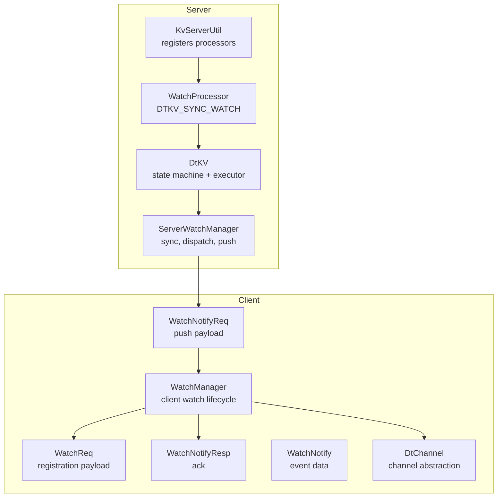
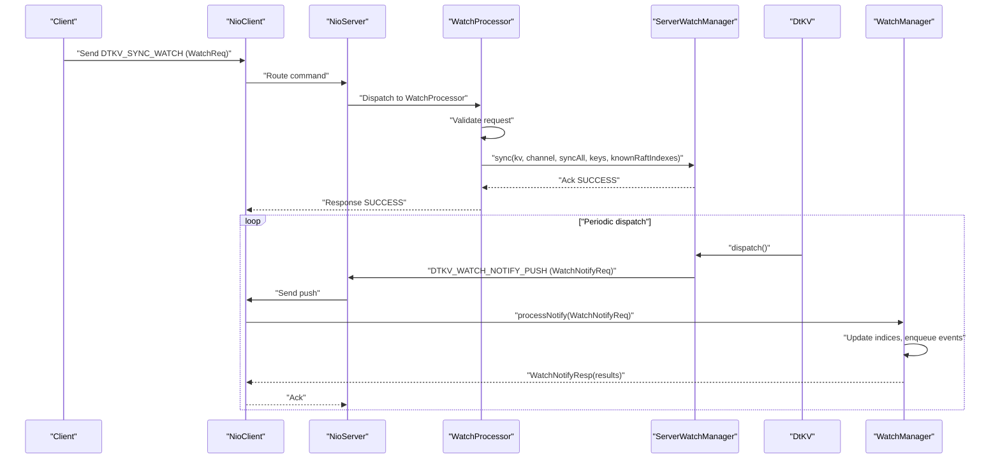
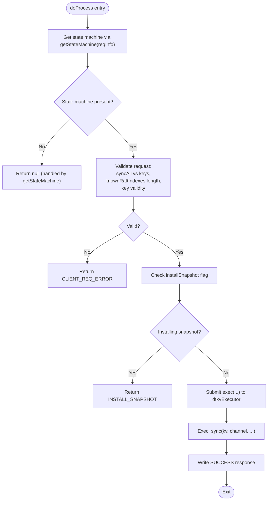
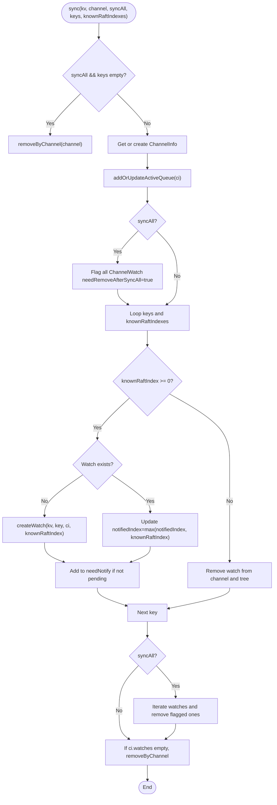
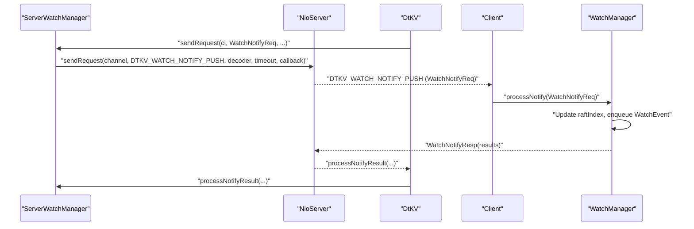
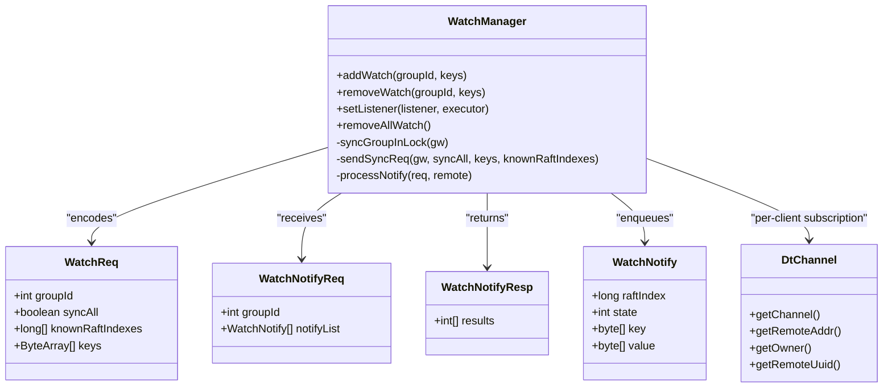
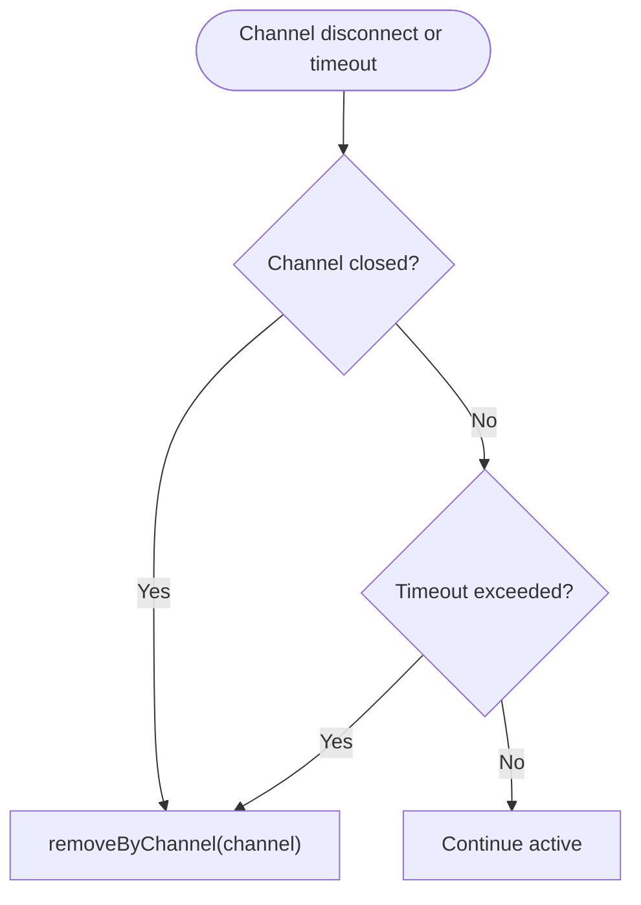
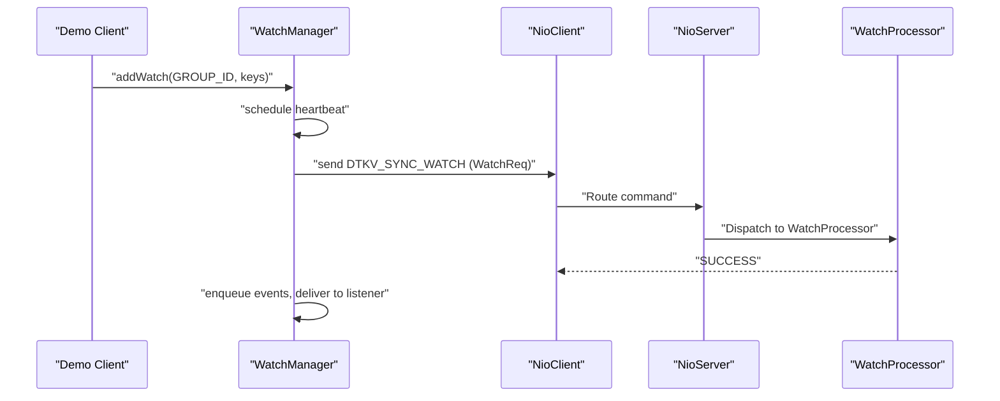
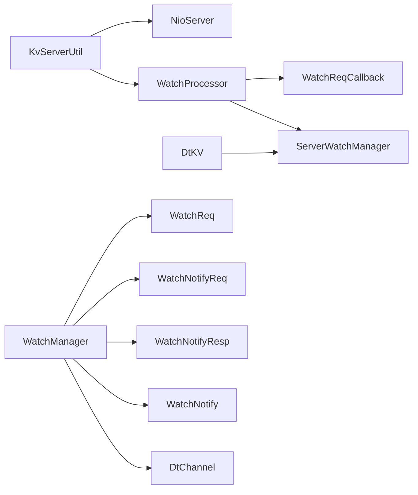

# Watch and Notification Management

<cite>
**Referenced Files in This Document**
- [KvServerUtil.java](file://server/src/main/java/com/github/dtprj/dongting/dtkv/server/KvServerUtil.java)
- [WatchProcessor.java](file://server/src/main/java/com/github/dtprj/dongting/dtkv/server/WatchProcessor.java)
- [ServerWatchManager.java](file://server/src/main/java/com/github/dtprj/dongting/dtkv/server/ServerWatchManager.java)
- [DtKV.java](file://server/src/main/java/com/github/dtprj/dongting/dtkv/server/DtKV.java)
- [WatchReqCallback.java](file://server/src/main/java/com/github/dtprj/dongting/dtkv/server/WatchReqCallback.java)
- [WatchManager.java](file://client/src/main/java/com/github/dtprj/dongting/dtkv/WatchManager.java)
- [WatchReq.java](file://client/src/main/java/com/github/dtprj/dongting/dtkv/WatchReq.java)
- [WatchNotify.java](file://client/src/main/java/com/github/dtprj/dongting/dtkv/WatchNotify.java)
- [WatchNotifyReq.java](file://client/src/main/java/com/github/dtprj/dongting/dtkv/WatchNotifyReq.java)
- [WatchNotifyResp.java](file://client/src/main/java/com/github/dtprj/dongting/dtkv/WatchNotifyResp.java)
- [DtChannel.java](file://client/src/main/java/com/github/dtprj/dongting/net/DtChannel.java)
- [WatchDemoClient.java](file://demos/src/main/java/com/github/dtprj/dongting/demos/watch/WatchDemoClient.java)
- [WatchDemoServer.java](file://demos/src/main/java/com/github/dtprj/dongting/demos/watch/WatchDemoServer.java)
</cite>

## Table of Contents
1. [Introduction](#introduction)
2. [Project Structure](#project-structure)
3. [Core Components](#core-components)
4. [Architecture Overview](#architecture-overview)
5. [Detailed Component Analysis](#detailed-component-analysis)
6. [Dependency Analysis](#dependency-analysis)
7. [Performance Considerations](#performance-considerations)
8. [Troubleshooting Guide](#troubleshooting-guide)
9. [Conclusion](#conclusion)
10. [Appendices](#appendices)

## Introduction
This document explains the watch and notification mechanism in the system, focusing on how the server registers the WatchProcessor for handling DTKV_SYNC_WATCH commands and how the client establishes watches and receives notifications via DTKV_WATCH_NOTIFY_PUSH. It covers:
- How KvServerUtil.initKvServer registers the WatchProcessor for DTKV_SYNC_WATCH with the NioServer
- The implementation of WatchProcessor.doProcess() including validation, synchronization, and integration with ServerWatchManager
- The client-server interaction pattern for watch registration and notifications
- The role of DtChannel in maintaining watch subscriptions and handling client disconnections
- Best practices for managing large numbers of watches efficiently

## Project Structure
The watch/notification system spans both server and client modules:
- Server-side components handle watch registration, state synchronization, batching, and push notifications
- Client-side components manage watch lifecycle, periodic health checks, and event delivery to listeners

**Diagram sources**
- [KvServerUtil.java](file://server/src/main/java/com/github/dtprj/dongting/dtkv/server/KvServerUtil.java#L52-L76)
- [WatchProcessor.java](file://server/src/main/java/com/github/dtprj/dongting/dtkv/server/WatchProcessor.java#L51-L112)
- [ServerWatchManager.java](file://server/src/main/java/com/github/dtprj/dongting/dtkv/server/ServerWatchManager.java#L477-L536)
- [DtKV.java](file://server/src/main/java/com/github/dtprj/dongting/dtkv/server/DtKV.java#L112-L129)
- [WatchManager.java](file://client/src/main/java/com/github/dtprj/dongting/dtkv/WatchManager.java#L308-L349)
- [WatchReq.java](file://client/src/main/java/com/github/dtprj/dongting/dtkv/WatchReq.java#L38-L94)
- [WatchNotifyReq.java](file://client/src/main/java/com/github/dtprj/dongting/dtkv/WatchNotifyReq.java#L33-L112)
- [WatchNotifyResp.java](file://client/src/main/java/com/github/dtprj/dongting/dtkv/WatchNotifyResp.java#L28-L49)
- [WatchNotify.java](file://client/src/main/java/com/github/dtprj/dongting/dtkv/WatchNotify.java#L30-L127)
- [DtChannel.java](file://client/src/main/java/com/github/dtprj/dongting/net/DtChannel.java#L25-L49)

**Section sources**
- [KvServerUtil.java](file://server/src/main/java/com/github/dtprj/dongting/dtkv/server/KvServerUtil.java#L52-L76)
- [WatchProcessor.java](file://server/src/main/java/com/github/dtprj/dongting/dtkv/server/WatchProcessor.java#L51-L112)
- [ServerWatchManager.java](file://server/src/main/java/com/github/dtprj/dongting/dtkv/server/ServerWatchManager.java#L477-L536)
- [DtKV.java](file://server/src/main/java/com/github/dtprj/dongting/dtkv/server/DtKV.java#L112-L129)
- [WatchManager.java](file://client/src/main/java/com/github/dtprj/dongting/dtkv/WatchManager.java#L308-L349)
- [WatchReq.java](file://client/src/main/java/com/github/dtprj/dongting/dtkv/WatchReq.java#L38-L94)
- [WatchNotifyReq.java](file://client/src/main/java/com/github/dtprj/dongting/dtkv/WatchNotifyReq.java#L33-L112)
- [WatchNotifyResp.java](file://client/src/main/java/com/github/dtprj/dongting/dtkv/WatchNotifyResp.java#L28-L49)
- [WatchNotify.java](file://client/src/main/java/com/github/dtprj/dongting/dtkv/WatchNotify.java#L30-L127)
- [DtChannel.java](file://client/src/main/java/com/github/dtprj/dongting/net/DtChannel.java#L25-L49)

## Core Components
- Server-side registration and processing:
  - KvServerUtil.initKvServer registers the WatchProcessor for DTKV_SYNC_WATCH with the NioServer
  - WatchProcessor validates incoming watch requests, synchronizes watch states via ServerWatchManager, and responds on the business thread
- Server-side watch management:
  - ServerWatchManager maintains per-channel subscriptions, batches notifications, retries on failures, and cleans up disconnected clients
  - DtKV integrates ServerWatchManager and sends DTKV_WATCH_NOTIFY_PUSH to clients
- Client-side watch lifecycle:
  - WatchManager manages watch registration/removal, periodic health checks, and event delivery to user listeners
  - WatchReq carries watch registration payloads; WatchNotifyReq/Resp carry push notifications and acknowledgments

**Section sources**
- [KvServerUtil.java](file://server/src/main/java/com/github/dtprj/dongting/dtkv/server/KvServerUtil.java#L52-L76)
- [WatchProcessor.java](file://server/src/main/java/com/github/dtprj/dongting/dtkv/server/WatchProcessor.java#L51-L112)
- [ServerWatchManager.java](file://server/src/main/java/com/github/dtprj/dongting/dtkv/server/ServerWatchManager.java#L477-L536)
- [DtKV.java](file://server/src/main/java/com/github/dtprj/dongting/dtkv/server/DtKV.java#L112-L129)
- [WatchManager.java](file://client/src/main/java/com/github/dtprj/dongting/dtkv/WatchManager.java#L308-L349)
- [WatchReq.java](file://client/src/main/java/com/github/dtprj/dongting/dtkv/WatchReq.java#L38-L94)
- [WatchNotifyReq.java](file://client/src/main/java/com/github/dtprj/dongting/dtkv/WatchNotifyReq.java#L33-L112)
- [WatchNotifyResp.java](file://client/src/main/java/com/github/dtprj/dongting/dtkv/WatchNotifyResp.java#L28-L49)
- [WatchNotify.java](file://client/src/main/java/com/github/dtprj/dongting/dtkv/WatchNotify.java#L30-L127)

## Architecture Overview
The watch architecture consists of:
- Command registration: NioServer registers DTKV_SYNC_WATCH to be handled by WatchProcessor
- Request decoding: WatchReqCallback decodes the watch request into groupId, keys, and knownRaftIndexes
- Validation and synchronization: WatchProcessor validates inputs and delegates to ServerWatchManager.sync
- Dispatch and push: ServerWatchManager batches and pushes notifications via DTKV_WATCH_NOTIFY_PUSH
- Client ack and retry: WatchManager processes WatchNotifyReq, updates indices, and acknowledges with WatchNotifyResp; failures trigger retries

**Diagram sources**
- [KvServerUtil.java](file://server/src/main/java/com/github/dtprj/dongting/dtkv/server/KvServerUtil.java#L52-L76)
- [WatchProcessor.java](file://server/src/main/java/com/github/dtprj/dongting/dtkv/server/WatchProcessor.java#L51-L112)
- [ServerWatchManager.java](file://server/src/main/java/com/github/dtprj/dongting/dtkv/server/ServerWatchManager.java#L477-L536)
- [DtKV.java](file://server/src/main/java/com/github/dtprj/dongting/dtkv/server/DtKV.java#L112-L129)
- [WatchManager.java](file://client/src/main/java/com/github/dtprj/dongting/dtkv/WatchManager.java#L521-L562)
- [WatchReq.java](file://client/src/main/java/com/github/dtprj/dongting/dtkv/WatchReq.java#L38-L94)
- [WatchNotifyReq.java](file://client/src/main/java/com/github/dtprj/dongting/dtkv/WatchNotifyReq.java#L33-L112)
- [WatchNotifyResp.java](file://client/src/main/java/com/github/dtprj/dongting/dtkv/WatchNotifyResp.java#L28-L49)

## Detailed Component Analysis

### Server Registration and Command Handling
- KvServerUtil.initKvServer registers the WatchProcessor for DTKV_SYNC_WATCH with the NioServer, enabling the server to accept watch registration requests from clients.
- WatchProcessor.doProcess validates the request (syncAll vs keys presence, knownRaftIndexes length, key validity), checks snapshot installation state, and delegates to ServerWatchManager.sync on the business thread pool.

**Diagram sources**
- [WatchProcessor.java](file://server/src/main/java/com/github/dtprj/dongting/dtkv/server/WatchProcessor.java#L51-L112)
- [KvServerUtil.java](file://server/src/main/java/com/github/dtprj/dongting/dtkv/server/KvServerUtil.java#L78-L88)

**Section sources**
- [KvServerUtil.java](file://server/src/main/java/com/github/dtprj/dongting/dtkv/server/KvServerUtil.java#L52-L76)
- [WatchProcessor.java](file://server/src/main/java/com/github/dtprj/dongting/dtkv/server/WatchProcessor.java#L51-L112)

### Watch Synchronization and State Management
- ServerWatchManager.sync handles:
  - Removing all watches when syncAll is true and keys are empty
  - Updating existing watches or creating new ones keyed by knownRaftIndexes
  - Marking watches for removal when knownRaftIndex < 0
  - Adding watches to needNotify channels and scheduling immediate push when appropriate
- The manager also maintains per-channel info, retry queues, and active queues for efficient dispatch.

**Diagram sources**
- [ServerWatchManager.java](file://server/src/main/java/com/github/dtprj/dongting/dtkv/server/ServerWatchManager.java#L477-L536)

**Section sources**
- [ServerWatchManager.java](file://server/src/main/java/com/github/dtprj/dongting/dtkv/server/ServerWatchManager.java#L477-L536)

### Push Notifications and Acknowledgment
- DtKV creates a ServerWatchManager subclass that overrides sendRequest to send DTKV_WATCH_NOTIFY_PUSH with WatchNotifyReq
- ServerWatchManager.pushNotify batches notifications per channel, respecting max batch size and request bytes, and invokes sendRequest
- On acknowledgment, WatchManager.processNotify updates indices, enqueues events, and returns WatchNotifyResp with per-watch results

**Diagram sources**
- [DtKV.java](file://server/src/main/java/com/github/dtprj/dongting/dtkv/server/DtKV.java#L112-L129)
- [ServerWatchManager.java](file://server/src/main/java/com/github/dtprj/dongting/dtkv/server/ServerWatchManager.java#L290-L345)
- [WatchManager.java](file://client/src/main/java/com/github/dtprj/dongting/dtkv/WatchManager.java#L521-L562)
- [WatchNotifyReq.java](file://client/src/main/java/com/github/dtprj/dongting/dtkv/WatchNotifyReq.java#L33-L112)
- [WatchNotifyResp.java](file://client/src/main/java/com/github/dtprj/dongting/dtkv/WatchNotifyResp.java#L28-L49)

**Section sources**
- [DtKV.java](file://server/src/main/java/com/github/dtprj/dongting/dtkv/server/DtKV.java#L112-L129)
- [ServerWatchManager.java](file://server/src/main/java/com/github/dtprj/dongting/dtkv/server/ServerWatchManager.java#L290-L345)
- [WatchManager.java](file://client/src/main/java/com/github/dtprj/dongting/dtkv/WatchManager.java#L521-L562)

### Client Watch Lifecycle and Event Delivery
- WatchManager.addWatch/removeWatch updates internal state and schedules sync
- Periodic heartbeat ensures server reachability and prevents idle removal
- WatchReq encodes the registration payload; WatchNotifyReq/Resp carry push data and acknowledgments
- WatchNotify provides the event data (raftIndex, state, key, value)

**Diagram sources**
- [WatchManager.java](file://client/src/main/java/com/github/dtprj/dongting/dtkv/WatchManager.java#L132-L200)
- [WatchReq.java](file://client/src/main/java/com/github/dtprj/dongting/dtkv/WatchReq.java#L38-L94)
- [WatchNotifyReq.java](file://client/src/main/java/com/github/dtprj/dongting/dtkv/WatchNotifyReq.java#L33-L112)
- [WatchNotifyResp.java](file://client/src/main/java/com/github/dtprj/dongting/dtkv/WatchNotifyResp.java#L28-L49)
- [WatchNotify.java](file://client/src/main/java/com/github/dtprj/dongting/dtkv/WatchNotify.java#L30-L127)
- [DtChannel.java](file://client/src/main/java/com/github/dtprj/dongting/net/DtChannel.java#L25-L49)

**Section sources**
- [WatchManager.java](file://client/src/main/java/com/github/dtprj/dongting/dtkv/WatchManager.java#L132-L200)
- [WatchReq.java](file://client/src/main/java/com/github/dtprj/dongting/dtkv/WatchReq.java#L38-L94)
- [WatchNotifyReq.java](file://client/src/main/java/com/github/dtprj/dongting/dtkv/WatchNotifyReq.java#L33-L112)
- [WatchNotifyResp.java](file://client/src/main/java/com/github/dtprj/dongting/dtkv/WatchNotifyResp.java#L28-L49)
- [WatchNotify.java](file://client/src/main/java/com/github/dtprj/dongting/dtkv/WatchNotify.java#L30-L127)
- [DtChannel.java](file://client/src/main/java/com/github/dtprj/dongting/net/DtChannel.java#L25-L49)

### Client Disconnection Handling
- ServerWatchManager.removeByChannel removes all watches associated with a channel and clears internal structures
- During push, if a channel is closed, the manager removes the channel and its watches
- Timeout cleanup evicts inactive channels from the active queue

**Diagram sources**
- [ServerWatchManager.java](file://server/src/main/java/com/github/dtprj/dongting/dtkv/server/ServerWatchManager.java#L201-L217)
- [ServerWatchManager.java](file://server/src/main/java/com/github/dtprj/dongting/dtkv/server/ServerWatchManager.java#L290-L345)
- [ServerWatchManager.java](file://server/src/main/java/com/github/dtprj/dongting/dtkv/server/ServerWatchManager.java#L463-L475)

**Section sources**
- [ServerWatchManager.java](file://server/src/main/java/com/github/dtprj/dongting/dtkv/server/ServerWatchManager.java#L201-L217)
- [ServerWatchManager.java](file://server/src/main/java/com/github/dtprj/dongting/dtkv/server/ServerWatchManager.java#L290-L345)
- [ServerWatchManager.java](file://server/src/main/java/com/github/dtprj/dongting/dtkv/server/ServerWatchManager.java#L463-L475)

### Example: Watch Registration Patterns and Best Practices
- Register watches for multiple keys with knownRaftIndexes to minimize redundant notifications
- Use syncAll=false with explicit keys for targeted watch sets
- Periodic heartbeat keeps connections alive and prevents server-side removal of idle clients
- Batch notifications are limited by max batch size and request bytes; large-scale deployments should tune watchMaxBatchSize and watchMaxReqBytes accordingly

**Diagram sources**
- [WatchDemoClient.java](file://demos/src/main/java/com/github/dtprj/dongting/demos/watch/WatchDemoClient.java#L34-L65)
- [WatchManager.java](file://client/src/main/java/com/github/dtprj/dongting/dtkv/WatchManager.java#L308-L349)
- [WatchReq.java](file://client/src/main/java/com/github/dtprj/dongting/dtkv/WatchReq.java#L38-L94)
- [WatchProcessor.java](file://server/src/main/java/com/github/dtprj/dongting/dtkv/server/WatchProcessor.java#L51-L112)

**Section sources**
- [WatchDemoClient.java](file://demos/src/main/java/com/github/dtprj/dongting/demos/watch/WatchDemoClient.java#L34-L65)
- [WatchDemoServer.java](file://demos/src/main/java/com/github/dtprj/dongting/demos/watch/WatchDemoServer.java#L23-L31)
- [WatchManager.java](file://client/src/main/java/com/github/dtprj/dongting/dtkv/WatchManager.java#L308-L349)

## Dependency Analysis
- Server-side dependencies:
  - KvServerUtil depends on NioServer and registers WatchProcessor for DTKV_SYNC_WATCH
  - WatchProcessor depends on WatchReqCallback for decoding and ServerWatchManager for synchronization
  - DtKV composes ServerWatchManager and overrides sendRequest to push notifications
- Client-side dependencies:
  - WatchManager depends on RaftClient, NioClient, and encoders/decoders for WatchReq, WatchNotifyReq/Resp, and WatchNotify
  - DtChannel abstracts network channels for both sides

**Diagram sources**
- [KvServerUtil.java](file://server/src/main/java/com/github/dtprj/dongting/dtkv/server/KvServerUtil.java#L52-L76)
- [WatchProcessor.java](file://server/src/main/java/com/github/dtprj/dongting/dtkv/server/WatchProcessor.java#L51-L112)
- [WatchReqCallback.java](file://server/src/main/java/com/github/dtprj/dongting/dtkv/server/WatchReqCallback.java#L28-L81)
- [ServerWatchManager.java](file://server/src/main/java/com/github/dtprj/dongting/dtkv/server/ServerWatchManager.java#L477-L536)
- [DtKV.java](file://server/src/main/java/com/github/dtprj/dongting/dtkv/server/DtKV.java#L112-L129)
- [WatchManager.java](file://client/src/main/java/com/github/dtprj/dongting/dtkv/WatchManager.java#L308-L349)
- [WatchReq.java](file://client/src/main/java/com/github/dtprj/dongting/dtkv/WatchReq.java#L38-L94)
- [WatchNotifyReq.java](file://client/src/main/java/com/github/dtprj/dongting/dtkv/WatchNotifyReq.java#L33-L112)
- [WatchNotifyResp.java](file://client/src/main/java/com/github/dtprj/dongting/dtkv/WatchNotifyResp.java#L28-L49)
- [WatchNotify.java](file://client/src/main/java/com/github/dtprj/dongting/dtkv/WatchNotify.java#L30-L127)
- [DtChannel.java](file://client/src/main/java/com/github/dtprj/dongting/net/DtChannel.java#L25-L49)

**Section sources**
- [KvServerUtil.java](file://server/src/main/java/com/github/dtprj/dongting/dtkv/server/KvServerUtil.java#L52-L76)
- [WatchProcessor.java](file://server/src/main/java/com/github/dtprj/dongting/dtkv/server/WatchProcessor.java#L51-L112)
- [ServerWatchManager.java](file://server/src/main/java/com/github/dtprj/dongting/dtkv/server/ServerWatchManager.java#L477-L536)
- [DtKV.java](file://server/src/main/java/com/github/dtprj/dongting/dtkv/server/DtKV.java#L112-L129)
- [WatchManager.java](file://client/src/main/java/com/github/dtprj/dongting/dtkv/WatchManager.java#L308-L349)
- [WatchReq.java](file://client/src/main/java/com/github/dtprj/dongting/dtkv/WatchReq.java#L38-L94)
- [WatchNotifyReq.java](file://client/src/main/java/com/github/dtprj/dongting/dtkv/WatchNotifyReq.java#L33-L112)
- [WatchNotifyResp.java](file://client/src/main/java/com/github/dtprj/dongting/dtkv/WatchNotifyResp.java#L28-L49)
- [WatchNotify.java](file://client/src/main/java/com/github/dtprj/dongting/dtkv/WatchNotify.java#L30-L127)
- [DtChannel.java](file://client/src/main/java/com/github/dtprj/dongting/net/DtChannel.java#L25-L49)

## Performance Considerations
- Batch sizing and throughput:
  - ServerWatchManager.dispatch uses watchMaxBatchSize and watchMaxReqBytes to bound per-push payload sizes
  - Tune these parameters according to network conditions and client processing capacity
- Retry strategy:
  - Exponential backoff retry intervals reduce load on failing clients
- Heartbeat and timeouts:
  - Client periodic heartbeat prevents server-side eviction of idle clients
  - Server-side timeout cleanup removes inactive channels proactively
- Executor model:
  - Business thread submission avoids blocking network IO during watch sync

[No sources needed since this section provides general guidance]

## Troubleshooting Guide
Common issues and resolutions:
- Client error responses:
  - WatchProcessor returns CLIENT_REQ_ERROR for invalid requests (missing keys or mismatched arrays)
- Snapshot installation:
  - While installing snapshots, WatchProcessor returns INSTALL_SNAPSHOT to signal client to resync later
- Network errors and client removal:
  - On NetCodeException with CLIENT_ERROR, STOPPING, or COMMAND_NOT_SUPPORT, the server removes the channel and all its watches
- Partial failures:
  - If any per-watch result is not SUCCESS, the server retries affected watches and may re-add them to needNotify
- Listener delivery:
  - WatchManager serializes listener callbacks and enqueues events; ensure the user executor is configured to avoid blocking

**Section sources**
- [WatchProcessor.java](file://server/src/main/java/com/github/dtprj/dongting/dtkv/server/WatchProcessor.java#L51-L112)
- [ServerWatchManager.java](file://server/src/main/java/com/github/dtprj/dongting/dtkv/server/ServerWatchManager.java#L379-L451)
- [WatchManager.java](file://client/src/main/java/com/github/dtprj/dongting/dtkv/WatchManager.java#L521-L562)

## Conclusion
The watch and notification system provides a robust, efficient mechanism for clients to subscribe to key changes and receive timely updates. ServerWatchManager coordinates watch synchronization, batching, and retries, while WatchManager on the client side manages lifecycle, health checks, and event delivery. Proper tuning of batch sizes, retry intervals, and heartbeat periods enables scalable watch management even with large numbers of subscriptions.

[No sources needed since this section summarizes without analyzing specific files]

## Appendices
- Example usage:
  - Demo client demonstrates adding watches, updating keys, and observing events delivered to the listener
- Key configuration parameters:
  - watchMaxBatchSize and watchMaxReqBytes control push batching on the server
  - watchTimeoutMillis controls server-side eviction of inactive channels

**Section sources**
- [WatchDemoClient.java](file://demos/src/main/java/com/github/dtprj/dongting/demos/watch/WatchDemoClient.java#L34-L65)
- [ServerWatchManager.java](file://server/src/main/java/com/github/dtprj/dongting/dtkv/server/ServerWatchManager.java#L69-L82)