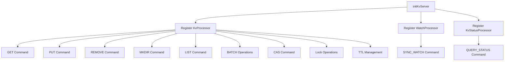
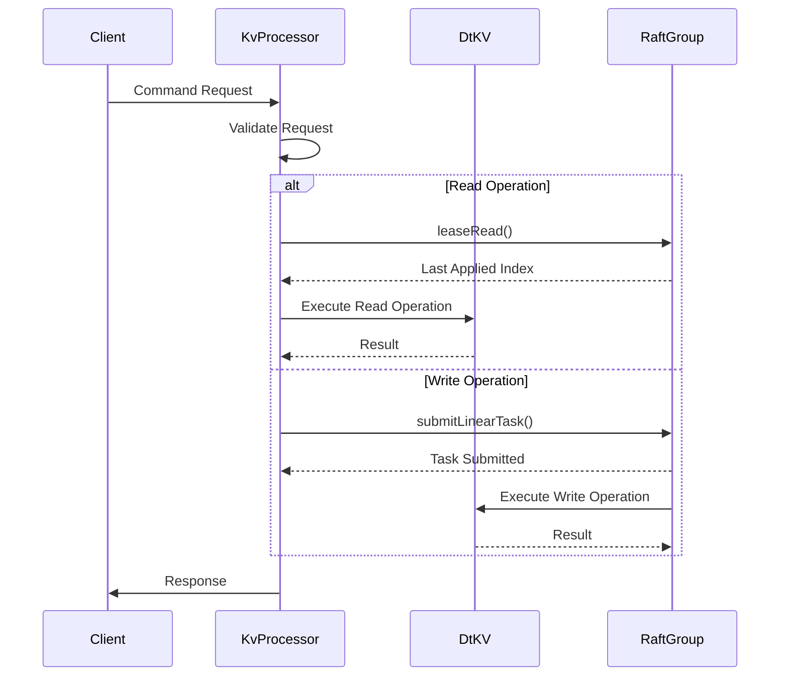
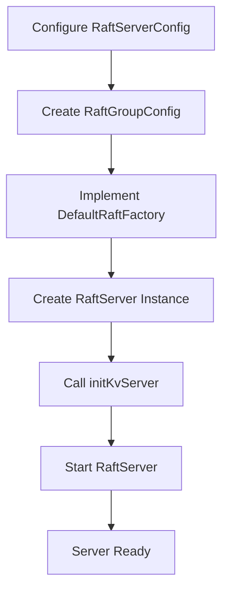

# DtKV Server Setup

<cite>
**Referenced Files in This Document**   
- [KvServerUtil.java](file://server/src/main/java/com/github/dtprj/dongting/dtkv/server/KvServerUtil.java)
- [KvProcessor.java](file://server/src/main/java/com/github/dtprj/dongting/dtkv/server/KvProcessor.java)
- [RaftServer.java](file://server/src/main/java/com/github/dtprj/dongting/raft/server/RaftServer.java)
- [DtKV.java](file://server/src/main/java/com/github/dtprj/dongting/dtkv/server/DtKV.java)
- [KvServerConfig.java](file://server/src/main/java/com/github/dtprj/dongting/dtkv/server/KvServerConfig.java)
- [DemoKvServerBase.java](file://demos/src/main/java/com/github/dtprj/dongting/demos/base/DemoKvServerBase.java)
- [RaftServerConfig.java](file://server/src/main/java/com/github/dtprj/dongting/raft/server/RaftServerConfig.java)
</cite>

## Table of Contents
1. [Introduction](#introduction)
2. [Server Initialization Sequence](#server-initialization-sequence)
3. [Command Processor Registration](#command-processor-registration)
4. [KvProcessor Command Routing](#kvprocessor-command-routing)
5. [Error Handling and Common Pitfalls](#error-handling-and-common-pitfalls)
6. [Extending with Custom Command Processors](#extending-with-custom-command-processors)
7. [Complete Setup Example](#complete-setup-example)

## Introduction
This document details the initialization and setup procedures for the DtKV server, a distributed key-value store built on the Raft consensus algorithm. The server provides distributed data storage with support for key-value operations, distributed locks, TTL management, and watch/notify functionality. The initialization process involves creating a RaftServer instance, registering command processors through the initKvServer method, and starting the server to begin accepting client requests. This document explains the proper sequence of operations, the registration of various command processors, and the routing mechanism that connects client commands to the appropriate state machine methods.

## Server Initialization Sequence
The DtKV server initialization follows a strict sequence to ensure proper setup of the distributed system. The process begins with creating a RaftServerConfig object that defines the server's configuration, including node ID, replication port, service port, and cluster topology. Next, RaftGroupConfig objects are created for each raft group that the server will participate in, specifying the group ID and member nodes.

The RaftServer instance is then created using the configuration objects and a DefaultRaftFactory that provides the state machine implementation. After the RaftServer is instantiated, the initKvServer method is called to register all DtKV command processors with the underlying NioServer. Finally, the RaftServer.start() method is invoked to begin the server operation, which starts the replication server, client connections, and fiber groups for asynchronous processing.

This sequence is critical because command processors must be registered before the server starts accepting connections. The RaftServer handles the complex coordination of distributed consensus, while the DtKV state machine manages the key-value store operations on top of this foundation.

**Section sources**
- [RaftServer.java](file://server/src/main/java/com/github/dtprj/dongting/raft/server/RaftServer.java#L109-L188)
- [DemoKvServerBase.java](file://demos/src/main/java/com/github/dtprj/dongting/demos/base/DemoKvServerBase.java#L38-L73)

## Command Processor Registration
The initKvServer method in KvServerUtil is responsible for registering all DtKV command processors with the NioServer. This method must be called after the RaftServer is created but before it is started. The registration process connects specific command codes to their corresponding processor implementations, enabling the server to handle various types of client requests.

The method registers processors for core key-value operations including GET, PUT, REMOVE, MKDIR, and LIST commands. It also registers processors for batch operations (BATCH_GET, BATCH_PUT, BATCH_REMOVE), compare-and-swap (CAS) operations, and distributed lock operations (TRY_LOCK, UPDATE_LOCK_LEASE). Additionally, processors for TTL management (PUT_TEMP_NODE, MAKE_TEMP_DIR, UPDATE_TTL) and watch/notify functionality (SYNC_WATCH) are registered.

The KvProcessor handles most commands, routing them to the appropriate DtKV state machine methods. Specialized processors like WatchProcessor and KvStatusProcessor handle watch operations and status queries respectively. Each command is registered with the NioServer using the register method, which associates a command code with a processor instance and an optional executor.

**Diagram sources **
- [KvServerUtil.java](file://server/src/main/java/com/github/dtprj/dongting/dtkv/server/KvServerUtil.java#L52-L76)

**Section sources**
- [KvServerUtil.java](file://server/src/main/java/com/github/dtprj/dongting/dtkv/server/KvServerUtil.java#L52-L76)

## KvProcessor Command Routing
The KvProcessor class is the central component that routes incoming commands to the appropriate DtKV state machine methods. As a RaftProcessor implementation, it handles requests in the IO thread and dispatches them to the correct business logic based on the command type. The processor uses a switch statement to route commands to specific handler methods, ensuring that each operation is processed according to its semantics.

For read operations like GET and LIST, the processor uses the leaseRead mechanism to ensure linearizable reads while maintaining performance. Write operations such as PUT, REMOVE, and MKDIR are submitted as linear tasks through the Raft consensus algorithm to ensure consistency across the cluster. The processor also handles validation for TTL operations and distributed locks before submitting them to the state machine.

The command routing process involves extracting the request body, validating parameters, and then invoking the appropriate state machine method. For successful operations, the processor creates response packets with the appropriate status codes and business results. Error handling is centralized in the processor, which catches exceptions and converts them to appropriate error responses that are sent back to clients.

**Diagram sources **
- [KvProcessor.java](file://server/src/main/java/com/github/dtprj/dongting/dtkv/server/KvProcessor.java#L71-L140)

**Section sources**
- [KvProcessor.java](file://server/src/main/java/com/github/dtprj/dongting/dtkv/server/KvProcessor.java#L71-L140)

## Error Handling and Common Pitfalls
Proper error handling is critical during DtKV server initialization to ensure system stability and reliability. The initialization process includes several validation checks that can result in exceptions if configuration parameters are invalid. For example, duplicate server IDs, invalid node configurations, or missing required parameters will cause IllegalArgumentExceptions during RaftServer construction.

A common pitfall is attempting to register command processors after the server has been started. Since the NioServer's registration mechanism is only available before startup, calling initKvServer after RaftServer.start() will result in commands not being properly registered and clients receiving connection errors. Another potential issue is failing to properly configure the Raft group membership, which can prevent the server from achieving quorum and becoming operational.

The system handles errors through a combination of immediate validation during setup and graceful degradation during operation. Configuration errors typically result in RuntimeExceptions that prevent the server from starting, while runtime errors are handled through the Raft consensus mechanism and appropriate error responses to clients. The fiber-based architecture provides isolation between different processing components, preventing errors in one area from affecting the entire system.

**Section sources**
- [RaftServer.java](file://server/src/main/java/com/github/dtprj/dongting/raft/server/RaftServer.java#L126-L139)
- [KvServerUtil.java](file://server/src/main/java/com/github/dtprj/dongting/dtkv/server/KvServerUtil.java#L50-L51)

## Extending with Custom Command Processors
The DtKV server architecture supports extension through custom command processors, allowing developers to add new functionality to the distributed system. To create a custom processor, implement the RaftProcessor interface and register it with the NioServer before starting the RaftServer. Custom processors can handle specialized operations that extend beyond the standard key-value, lock, and watch functionality.

When designing custom processors, consider whether the operation requires consensus (write operation) or can be handled as a read operation. Write operations should be submitted as linear tasks through the Raft consensus algorithm to ensure consistency, while read operations can use the leaseRead mechanism for better performance. The processor should validate input parameters and handle errors appropriately, converting exceptions to meaningful error responses for clients.

Custom processors can leverage existing components like the DtKV state machine, TtlManager, and ServerWatchManager to implement complex functionality while maintaining consistency with the overall system architecture. By following the same patterns used in the built-in processors, custom extensions can seamlessly integrate with the DtKV server's distributed coordination and fault tolerance mechanisms.

**Section sources**
- [KvProcessor.java](file://server/src/main/java/com/github/dtprj/dongting/dtkv/server/KvProcessor.java#L51-L54)
- [RaftServer.java](file://server/src/main/java/com/github/dtprj/dongting/raft/server/RaftServer.java#L163-L184)

## Complete Setup Example
The complete DtKV server setup process is demonstrated in the DemoKvServerBase class, which provides a template for initializing and starting the server. The process begins by configuring the RaftServerConfig with node-specific parameters such as node ID, replication port, and service port. The cluster topology is defined by specifying the list of servers and their network addresses.

After configuring the server, one or more RaftGroupConfig objects are created to define the raft groups that the server will participate in. A DefaultRaftFactory is then implemented to provide the DtKV state machine instances for each group. The RaftServer is instantiated with these configuration objects, and the initKvServer method is called to register all DtKV command processors.

Finally, the server is started by calling the start() method, which initializes all components and begins accepting client connections. This complete setup process ensures that the DtKV server is properly configured for distributed operation with all command processors registered and ready to handle client requests.

**Diagram sources **
- [DemoKvServerBase.java](file://demos/src/main/java/com/github/dtprj/dongting/demos/base/DemoKvServerBase.java#L38-L73)

**Section sources**
- [DemoKvServerBase.java](file://demos/src/main/java/com/github/dtprj/dongting/demos/base/DemoKvServerBase.java#L38-L73)