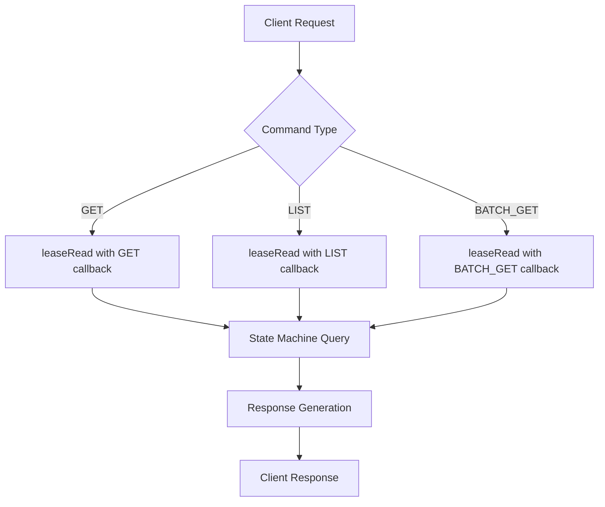
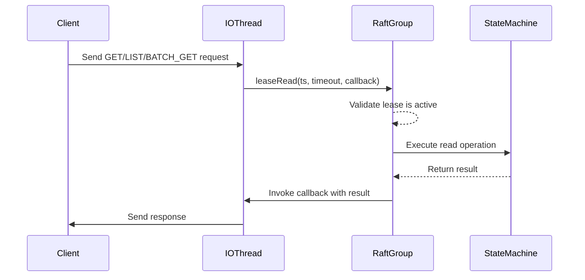
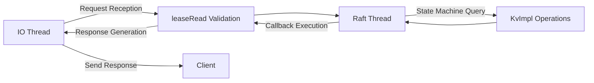
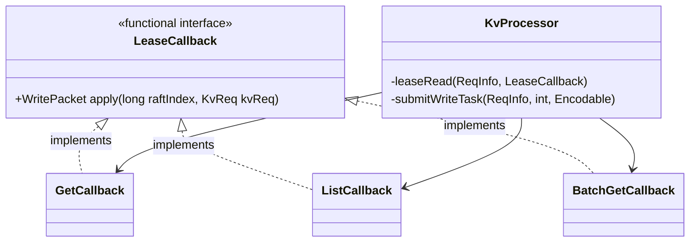
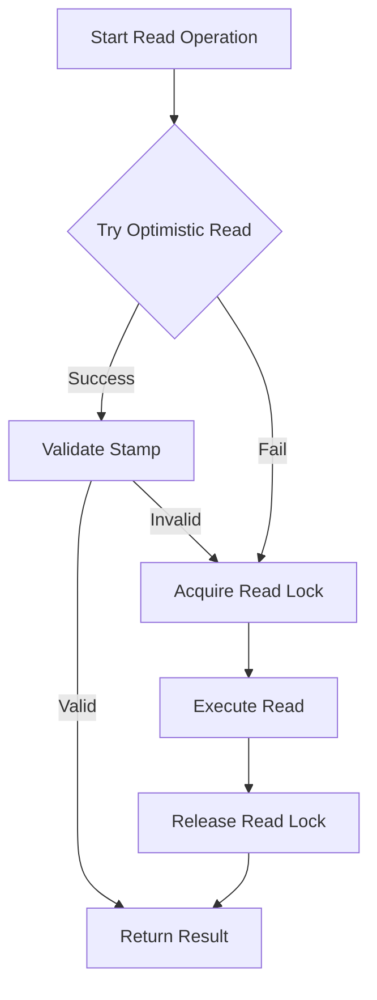
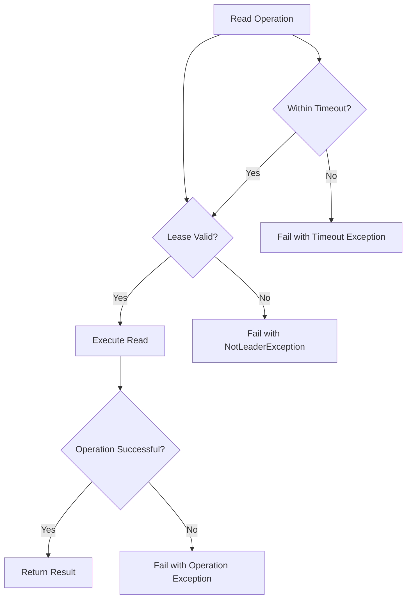

# Read Operations Processing

<cite>
**Referenced Files in This Document**   
- [KvProcessor.java](file://server/src/main/java/com/github/dtprj/dongting/dtkv/server/KvProcessor.java)
- [DtKV.java](file://server/src/main/java/com/github/dtprj/dongting/dtkv/server/DtKV.java)
- [KvImpl.java](file://server/src/main/java/com/github/dtprj/dongting/dtkv/server/KvImpl.java)
- [RaftGroup.java](file://server/src/main/java/com/github/dtprj/dongting/raft/server/RaftGroup.java)
- [RaftProcessor.java](file://server/src/main/java/com/github/dtprj/dongting/raft/server/RaftProcessor.java)
- [devlogs/2024_07_26_raft算法的工程实现秘笈.md](file://devlogs/2024_07_26_raft算法的工程实现秘笈.md)
</cite>

## Table of Contents
1. [Introduction](#introduction)
2. [Read Operations Overview](#read-operations-overview)
3. [Lease-Based Consistency Mechanism](#lease-based-consistency-mechanism)
4. [Request Processing Flow](#request-processing-flow)
5. [LeaseCallback Implementation](#leasecallback-implementation)
6. [Thread Safety and Performance](#thread-safety-and-performance)
7. [Error Handling and Timeout Scenarios](#error-handling-and-timeout-scenarios)
8. [Conclusion](#conclusion)

## Introduction
This document provides a comprehensive analysis of read operations processing in the DtKV system, focusing on the implementation of linearizable reads through lease-based consistency. The document explains how GET, LIST, and BATCH_GET commands are handled via the leaseRead() method in KvProcessor, detailing the complete flow from request reception in the IO thread to state machine query in the raft thread. The analysis covers thread safety considerations, performance implications, and error handling mechanisms for failed read operations.

## Read Operations Overview

The DtKV system implements three primary read operations: GET, LIST, and BATCH_GET, all processed through the leaseRead() mechanism in the KvProcessor class. These operations are designed to provide linearizable consistency while maintaining high performance.

The KvProcessor class handles incoming requests and routes them based on command type. For read operations, it invokes the leaseRead() method with appropriate LeaseCallback implementations that define the specific read logic for each operation type.

**Diagram sources**
- [KvProcessor.java](file://server/src/main/java/com/github/dtprj/dongting/dtkv/server/KvProcessor.java#L82-L110)

**Section sources**
- [KvProcessor.java](file://server/src/main/java/com/github/dtprj/dongting/dtkv/server/KvProcessor.java#L51-L145)

## Lease-Based Consistency Mechanism

The DtKV system implements linearizable reads using a lease-based consistency model, which provides strong consistency guarantees while optimizing for performance. This mechanism allows the leader to serve read requests locally without contacting followers, reducing latency compared to traditional read-index approaches.

The leaseRead() method in RaftGroup is the core of this mechanism, which validates that the current node is still the legitimate leader by ensuring its lease has not expired. The implementation takes advantage of the fact that the system time is reasonably synchronized across nodes, allowing the leader to determine a safe time window during which it can serve linearizable reads.

**Diagram sources**
- [RaftGroup.java](file://server/src/main/java/com/github/dtprj/dongting/raft/server/RaftGroup.java#L52-L53)
- [KvProcessor.java](file://server/src/main/java/com/github/dtprj/dongting/dtkv/server/KvProcessor.java#L177-L192)

**Section sources**
- [RaftGroup.java](file://server/src/main/java/com/github/dtprj/dongting/raft/server/RaftGroup.java#L37-L53)
- [devlogs/2024_07_26_raft算法的工程实现秘笈.md](file://devlogs/2024_07_26_raft算法的工程实现秘笈.md#L238-L241)

## Request Processing Flow

The read operation processing flow spans multiple threads and components, starting from request reception in the IO thread and culminating in state machine query in the raft thread. This multi-threaded architecture enables high throughput while maintaining consistency guarantees.

The flow begins when a client request arrives at the IO thread, where the KvProcessor's doProcess() method is invoked. This method immediately calls leaseRead() with a callback that will be executed once the lease validation is complete. The actual state machine query occurs in the context of the raft thread, ensuring proper synchronization with write operations.

**Diagram sources**
- [KvProcessor.java](file://server/src/main/java/com/github/dtprj/dongting/dtkv/server/KvProcessor.java#L71-L145)
- [DtKV.java](file://server/src/main/java/com/github/dtprj/dongting/dtkv/server/DtKV.java#L217-L247)

**Section sources**
- [KvProcessor.java](file://server/src/main/java/com/github/dtprj/dongting/dtkv/server/KvProcessor.java#L71-L145)
- [DtKV.java](file://server/src/main/java/com/github/dtprj/dongting/dtkv/server/DtKV.java#L217-L247)

## LeaseCallback Implementation

The LeaseCallback interface is a functional interface that defines how read operations are executed once lease validation is complete. Different implementations of this callback handle the specific logic for GET, LIST, and BATCH_GET operations.

For GET operations, the callback invokes the get() method on the DtKV instance, which in turn queries the KvImpl state machine. For LIST operations, it calls the list() method, and for BATCH_GET operations, it invokes batchGet(). Each callback implementation is responsible for creating the appropriate response packet and returning it to the IO thread for transmission to the client.

**Diagram sources**
- [KvProcessor.java](file://server/src/main/java/com/github/dtprj/dongting/dtkv/server/KvProcessor.java#L194-L197)
- [KvProcessor.java](file://server/src/main/java/com/github/dtprj/dongting/dtkv/server/KvProcessor.java#L85-L110)

**Section sources**
- [KvProcessor.java](file://server/src/main/java/com/github/dtprj/dongting/dtkv/server/KvProcessor.java#L177-L197)

## Thread Safety and Performance

The DtKV read operations are designed with thread safety as a primary concern, using the StampedLock from java.util.concurrent.locks to protect the state machine data. The implementation employs optimistic reading for high-performance scenarios, falling back to pessimistic locking when contention is detected.

Performance is optimized through several mechanisms:
1. Lease-based reads eliminate the need for round-trip communication with followers
2. Optimistic locking reduces contention in read-heavy workloads
3. The system reads the latest snapshot rather than a specific raft index, simplifying the implementation
4. Callback-based asynchronous processing enables non-blocking operations

The StampedLock provides three modes of access: optimistic reading, read locking, and write locking. Read operations first attempt optimistic reading, which is very fast when there is no concurrent modification. If the optimistic read is invalidated by a concurrent write, the operation falls back to a regular read lock.

**Diagram sources**
- [KvImpl.java](file://server/src/main/java/com/github/dtprj/dongting/dtkv/server/KvImpl.java#L240-L253)
- [devlogs/2024_07_26_raft算法的工程实现秘笈.md](file://devlogs/2024_07_26_raft算法的工程实现秘笈.md#L238-L241)

**Section sources**
- [KvImpl.java](file://server/src/main/java/com/github/dtprj/dongting/dtkv/server/KvImpl.java#L229-L300)

## Error Handling and Timeout Scenarios

The DtKV system implements comprehensive error handling for read operations, addressing various failure scenarios including lease expiration, node failures, and client timeouts. When a read operation fails, the system provides appropriate error responses that help clients understand the nature of the failure.

For timeout scenarios, the system uses the client-provided timeout value to determine how long to wait for lease validation. If the lease cannot be validated within this timeframe, the operation fails with a timeout exception. Similarly, if the current node is not the leader or the lease has expired, the operation fails with a NotLeaderException.

The error handling is implemented through the callback mechanism in leaseRead(), where exceptions are caught and converted to appropriate error responses. This ensures that all failure modes are handled consistently, regardless of the specific read operation being performed.

**Diagram sources**
- [KvProcessor.java](file://server/src/main/java/com/github/dtprj/dongting/dtkv/server/KvProcessor.java#L180-L191)
- [RaftGroup.java](file://server/src/main/java/com/github/dtprj/dongting/raft/server/RaftGroup.java#L48-L51)

**Section sources**
- [KvProcessor.java](file://server/src/main/java/com/github/dtprj/dongting/dtkv/server/KvProcessor.java#L141-L144)
- [RaftGroup.java](file://server/src/main/java/com/github/dtprj/dongting/raft/server/RaftGroup.java#L48-L51)

## Conclusion
The DtKV system implements an efficient and robust mechanism for processing read operations through lease-based consistency. By leveraging the leaseRead() method in KvProcessor, the system provides linearizable reads with optimal performance characteristics. The design effectively balances consistency, availability, and performance, making it suitable for distributed environments where low-latency reads are critical. The implementation demonstrates careful attention to thread safety, error handling, and performance optimization, resulting in a reliable and scalable read operations processing system.