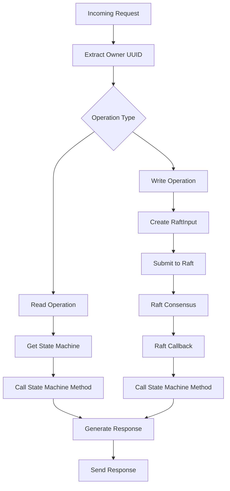
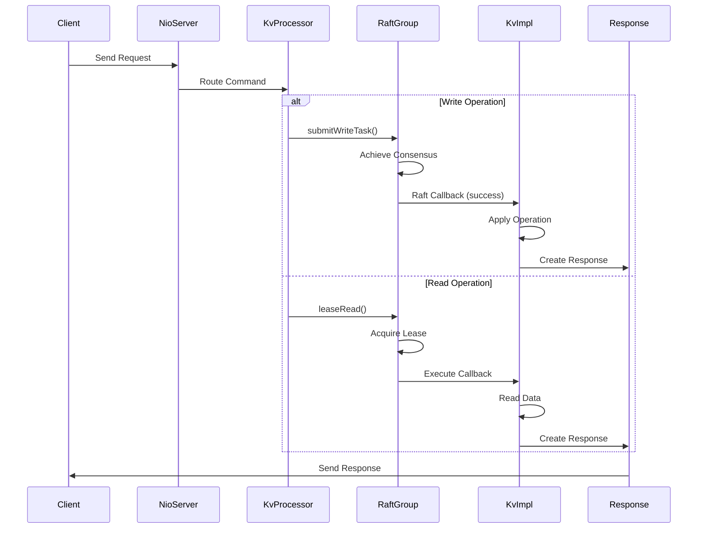
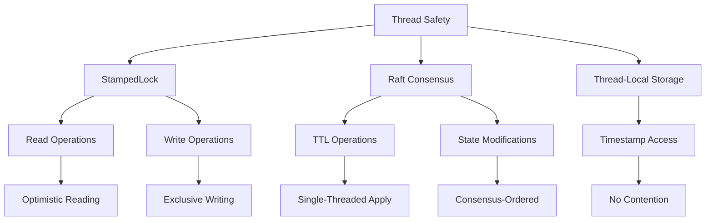

# Request Routing and Processing

<cite>
**Referenced Files in This Document**   
- [KvProcessor.java](file://server/src/main/java/com/github/dtprj/dongting/dtkv/server/KvProcessor.java)
- [KvImpl.java](file://server/src/main/java/com/github/dtprj/dongting/dtkv/server/KvImpl.java)
- [TtlManager.java](file://server/src/main/java/com/github/dtprj/dongting/dtkv/server/TtlManager.java)
- [KvReq.java](file://client/src/main/java/com/github/dtprj/dongting/dtkv/KvReq.java)
- [KvResp.java](file://client/src/main/java/com/github/dtprj/dongting/dtkv/KvResp.java)
- [KvServerUtil.java](file://server/src/main/java/com/github/dtprj/dongting/dtkv/server/KvServerUtil.java)
- [Commands.java](file://client/src/main/java/com/github/dtprj/dongting/net/Commands.java)
- [ReqContext.java](file://client/src/main/java/com/github/dtprj/dongting/net/ReqContext.java)
</cite>

## Table of Contents
1. [Introduction](#introduction)
2. [Request Routing Mechanism](#request-routing-mechanism)
3. [Read and Write Operation Processing](#read-and-write-operation-processing)
4. [TTL-Enabled Operations](#ttl-enabled-operations)
5. [Owner UUID Extraction and State Machine Interaction](#owner-uuid-extraction-and-state-machine-interaction)
6. [Request Flow Example](#request-flow-example)
7. [Error Handling Mechanisms](#error-handling-mechanisms)
8. [Thread Safety Considerations](#thread-safety-considerations)
9. [Conclusion](#conclusion)

## Introduction
The DtKV request routing and processing pipeline is a critical component of the distributed key-value store system, responsible for handling incoming client requests, routing them based on command type, and ensuring proper execution through the Raft consensus algorithm. This document provides a comprehensive analysis of how the KvProcessor receives and processes requests, distinguishing between read and write operations, handling TTL-enabled operations, and maintaining thread safety throughout the processing pipeline. The system is designed to provide linearizable consistency while efficiently handling various types of operations including GET, PUT, REMOVE, and specialized operations like distributed locking and TTL management.

**Section sources**
- [KvProcessor.java](file://server/src/main/java/com/github/dtprj/dongting/dtkv/server/KvProcessor.java#L51-L278)

## Request Routing Mechanism
The request routing mechanism in DtKV is centered around the KvProcessor class, which extends RaftProcessor and handles incoming requests through a switch statement on the frame.command field. When a request arrives, the KvProcessor's doProcess method is invoked, which uses a switch statement to route the request to the appropriate handling logic based on the command type.

The routing mechanism distinguishes between various command types defined in the Commands interface, with commands in the range 70-99 reserved for DtKV operations. The processor handles commands such as DTKV_GET (72), DTKV_PUT (74), DTKV_REMOVE (75), DTKV_LIST (73), DTKV_BATCH_GET (73), and various specialized commands for TTL management and distributed locking. Each command is routed to either a read operation handler using leaseRead() or a write operation handler using submitWriteTask(), depending on whether the operation modifies the state of the key-value store.

The routing process begins with the RaftProcessor's process method, which performs initial validation including checking if the request has a body, verifying the correct port is being used, ensuring the Raft server is ready, and validating that the specified Raft group exists. Once these preliminary checks pass, control is transferred to the KvProcessor's doProcess method where the actual command routing occurs.

```mermaid
flowchart TD
A[Incoming Request] --> B{Has Body?}
B --> |No| C[Return Client Error]
B --> |Yes| D{Correct Port?}
D --> |No| E[Return Command Not Supported]
D --> |Yes| F{Raft Server Ready?}
F --> |No| G[Return Not Initialized]
F --> |Yes| H{Raft Group Exists?}
H --> |No| I[Return Group Not Found]
H --> |Yes| J[Route by Command Type]
J --> K{Read Operation?}
K --> |Yes| L[leaseRead()]
K --> |No| M{TTL-Enabled?}
M --> |Yes| N[checkTtlAndSubmit()]
M --> |No| O[submitWriteTask()]
```

**Diagram sources **
- [KvProcessor.java](file://server/src/main/java/com/github/dtprj/dongting/dtkv/server/KvProcessor.java#L83-L139)
- [RaftProcessor.java](file://server/src/main/java/com/github/dtprj/dongting/raft/server/RaftProcessor.java#L80-L130)

**Section sources**
- [KvProcessor.java](file://server/src/main/java/com/github/dtprj/dongting/dtkv/server/KvProcessor.java#L83-L139)
- [Commands.java](file://client/src/main/java/com/github/dtprj/dongting/net/Commands.java#L51-L69)

## Read and Write Operation Processing
The DtKV system distinguishes between read and write operations in its processing pipeline, using different execution paths to optimize performance and maintain consistency. Read operations, including GET, LIST, and BATCH_GET, are handled through the leaseRead() method, while write operations such as PUT, REMOVE, CAS, and others are processed through the submitWriteTask() method.

Read operations are designed to be fast and non-blocking, leveraging the Raft lease mechanism to provide linearizable reads without requiring consensus. When a read request is received, the leaseRead() method is invoked, which calls the Raft group's leaseRead() method with a callback. This callback is executed once the lease is acquired, allowing the read operation to proceed on the latest committed state. The read operations include DTKV_GET, which retrieves a single key-value pair; DTKV_LIST, which returns all children of a directory key; and DTKV_BATCH_GET, which retrieves multiple key-value pairs in a single request.

Write operations, on the other hand, require consensus through the Raft algorithm and are processed using the submitWriteTask() method. This method creates a RaftInput object (RC) containing the operation details and submits it to the Raft group's linear task queue. The write operations include DTKV_PUT for creating or updating key-value pairs, DTKV_REMOVE for deleting keys, DTKV_BATCH_PUT and DTKV_BATCH_REMOVE for bulk operations, and DTKV_CAS for compare-and-swap operations. The RC class implements the RaftCallback interface, which defines success() and fail() methods that are called when the Raft consensus is reached or when the operation fails.

```mermaid
flowchart TD
A[Operation Type] --> B{Read Operation?}
B --> |Yes| C[GET Operation]
B --> |No| D[Write Operation]
C --> E[leaseRead()]
C --> F[LIST Operation]
C --> G[BATCH_GET Operation]
F --> E
G --> E
D --> H[PUT Operation]
D --> I[REMOVE Operation]
D --> J[CAS Operation]
D --> K[BATCH Operations]
H --> L[submitWriteTask()]
I --> L
J --> L
K --> L
```

**Diagram sources **
- [KvProcessor.java](file://server/src/main/java/com/github/dtprj/dongting/dtkv/server/KvProcessor.java#L84-L116)
- [KvProcessor.java](file://server/src/main/java/com/github/dtprj/dongting/dtkv/server/KvProcessor.java#L199-L202)

**Section sources**
- [KvProcessor.java](file://server/src/main/java/com/github/dtprj/dongting/dtkv/server/KvProcessor.java#L84-L116)
- [KvProcessor.java](file://server/src/main/java/com/github/dtprj/dongting/dtkv/server/KvProcessor.java#L199-L202)

## TTL-Enabled Operations
TTL-enabled operations in DtKV are handled through the specialized checkTtlAndSubmit() method, which provides an additional validation layer before submitting write tasks to the Raft consensus process. This method is used for operations that involve time-to-live functionality, including DTKV_PUT_TEMP_NODE, DTKV_MAKE_TEMP_DIR, DTKV_UPDATE_TTL, DTKV_TRY_LOCK, and DTKV_UPDATE_LOCK_LEASE.

The checkTtlAndSubmit() method first validates the TTL parameters by calling KvImpl.checkTtl(), which performs several checks including ensuring the TTL value is within acceptable bounds (not exceeding 100 years), verifying that the TTL is positive for non-lock operations, and checking that lock operations have appropriate hold TTL values. If the TTL validation fails, an error response is sent directly to the client without involving the Raft consensus process, improving efficiency by avoiding unnecessary consensus overhead for invalid requests.

When the TTL validation passes, the method proceeds to call submitWriteTask() to submit the operation to the Raft group for consensus processing. This two-step process ensures that only valid TTL operations participate in the consensus process, reducing the load on the Raft algorithm and improving overall system performance. The TtlManager class is responsible for managing the TTL lifecycle, maintaining a TreeSet of TtlInfo objects ordered by expiration time, and processing expired keys through a background task.

```mermaid
flowchart TD
A[TTL-Enabled Operation] --> B[checkTtlAndSubmit()]
B --> C{Valid TTL?}
C --> |No| D[Send Error Response]
C --> |Yes| E[submitWriteTask()]
E --> F[Raft Consensus]
F --> G[TtlManager Scheduling]
G --> H{Key Expired?}
H --> |Yes| I[Expire Callback]
H --> |No| J[Continue Monitoring]
```

**Diagram sources **
- [KvProcessor.java](file://server/src/main/java/com/github/dtprj/dongting/dtkv/server/KvProcessor.java#L147-L157)
- [TtlManager.java](file://server/src/main/java/com/github/dtprj/dongting/dtkv/server/TtlManager.java#L137-L144)

**Section sources**
- [KvProcessor.java](file://server/src/main/java/com/github/dtprj/dongting/dtkv/server/KvProcessor.java#L147-L157)
- [TtlManager.java](file://server/src/main/java/com/github/dtprj/dongting/dtkv/server/TtlManager.java#L137-L144)
- [KvImpl.java](file://server/src/main/java/com/github/dtprj/dongting/dtkv/server/KvImpl.java#L939-L964)

## Owner UUID Extraction and State Machine Interaction
The DtKV system extracts the owner UUID from the request context and passes it to the state machine for operations that require ownership tracking, such as distributed locking and TTL management. This extraction occurs in the doProcess method of KvProcessor, where the owner UUID is retrieved from the ReqContext using reqInfo.reqContext.getDtChannel().getRemoteUuid() and assigned to the request's ownerUuid field.

The owner UUID is crucial for operations that need to track which client owns a particular resource, such as temporary nodes or distributed locks. When a request is processed, the owner UUID is passed through the Raft consensus process and ultimately used by the state machine implementation (KvImpl) to validate ownership during operations like unlocking a distributed lock or updating a TTL. This ensures that only the client that created a resource can modify or delete it, providing security and preventing race conditions.

The interaction with the state machine follows a consistent pattern: the KvProcessor retrieves the state machine from the Raft group using KvServerUtil.getStateMachine(), then invokes the appropriate method on the state machine based on the operation type. For read operations, the state machine methods are called directly within the leaseRead callback, while for write operations, the operation details are packaged into a RaftInput object and submitted to the Raft group for consensus processing. Once consensus is reached, the Raft callback's success() method is invoked, which then calls the appropriate state machine method to apply the operation and generate a response.



**Diagram sources **
- [KvProcessor.java](file://server/src/main/java/com/github/dtprj/dongting/dtkv/server/KvProcessor.java#L80-L81)
- [KvProcessor.java](file://server/src/main/java/com/github/dtprj/dongting/dtkv/server/KvProcessor.java#L72-L73)
- [KvServerUtil.java](file://server/src/main/java/com/github/dtprj/dongting/dtkv/server/KvServerUtil.java#L78-L87)

**Section sources**
- [KvProcessor.java](file://server/src/main/java/com/github/dtprj/dongting/dtkv/server/KvProcessor.java#L80-L81)
- [KvProcessor.java](file://server/src/main/java/com/github/dtprj/dongting/dtkv/server/KvProcessor.java#L72-L73)
- [KvServerUtil.java](file://server/src/main/java/com/github/dtprj/dongting/dtkv/server/KvServerUtil.java#L78-L87)
- [ReqContext.java](file://client/src/main/java/com/github/dtprj/dongting/net/ReqContext.java#L27-L31)

## Request Flow Example
The complete request flow in DtKV follows a well-defined path from network reception to state machine invocation. When a client sends a request, it is first received by the NioServer, which parses the network packet and creates a ReadPacket containing the request data. The packet is then routed to the appropriate processor based on the command type, with DtKV commands being handled by the KvProcessor.

For a write operation like PUT, the flow begins with the RaftProcessor's process method performing initial validation, then transferring control to KvProcessor's doProcess method. The command is identified as DTKV_PUT through the switch statement, and since it's a write operation, submitWriteTask() is called. This creates an RC (RaftInput) object containing the operation details and submits it to the Raft group's linear task queue. The Raft algorithm then works to achieve consensus among the cluster nodes.

Once consensus is reached, the Raft callback's success() method is invoked on the leader node. This method calls the appropriate state machine method (put in this case) on the KvImpl instance, passing the raft index and operation parameters. The state machine applies the operation to its internal data structures, updates the key-value store, and creates a response object. The response is then sent back to the client through the ReqContext's writeRespInBizThreads() method.

For a read operation like GET, the flow is more direct. After initial validation, the leaseRead() method is called, which acquires a read lease from the Raft group. Once the lease is acquired, the callback is executed, calling the get method on the KvImpl state machine. The result is then packaged into a response and sent back to the client, all without requiring full Raft consensus.



**Diagram sources **
- [KvProcessor.java](file://server/src/main/java/com/github/dtprj/dongting/dtkv/server/KvProcessor.java#L71-L144)
- [KvImpl.java](file://server/src/main/java/com/github/dtprj/dongting/dtkv/server/KvImpl.java#L235-L253)
- [KvProcessor.java](file://server/src/main/java/com/github/dtprj/dongting/dtkv/server/KvProcessor.java#L214-L263)

**Section sources**
- [KvProcessor.java](file://server/src/main/java/com/github/dtprj/dongting/dtkv/server/KvProcessor.java#L71-L144)
- [KvImpl.java](file://server/src/main/java/com/github/dtprj/dongting/dtkv/server/KvImpl.java#L235-L253)

## Error Handling Mechanisms
The DtKV system implements comprehensive error handling mechanisms throughout the request processing pipeline to ensure robustness and provide meaningful feedback to clients. Errors are handled at multiple levels, from network-level issues to application-specific validation errors and Raft consensus failures.

The primary error handling occurs in the doProcess method of KvProcessor, which wraps the command routing logic in a try-catch block. When an exception is caught, the writeErrorResp() method is called to generate an appropriate error response. This method analyzes the root cause of the exception and maps it to specific error codes. For example, RaftTimeoutException results in a warning log but no response (as the client will timeout), FlowControlException maps to CmdCodes.FLOW_CONTROL, and NotLeaderException maps to CmdCodes.NOT_RAFT_LEADER with the current leader's information included in the response.

Application-level validation errors are handled differently depending on the operation type. For TTL-enabled operations, the checkTtlAndSubmit() method performs validation before submitting to Raft consensus, returning immediate error responses for invalid TTL values. This prevents unnecessary consensus overhead for invalid requests. The KvImpl.checkTtl() method returns descriptive error messages for various TTL validation failures, such as "ttl too large", "ttl must be positive", or "hold ttl less than ttl".

The system also handles errors in the Raft callback's fail() method, which is called when a consensus operation fails. This method calls writeErrorResp() to send an error response to the client, ensuring that clients are informed of operation failures. Additionally, the TtlManager includes error handling in its background task, catching and logging exceptions that occur during TTL processing while continuing to process other expiration events.

```mermaid
flowchart TD
A[Error Occurs] --> B{Error Source}
B --> C[Application Validation]
B --> D[Raft Consensus]
B --> E[Network/IO]
C --> F[Immediate Response]
D --> G[Raft Callback fail()]
E --> H[RaftProcessor writeErrorResp()]
F --> I[Send Error Code]
G --> H
H --> I
I --> J[Client Notification]
```

**Diagram sources **
- [KvProcessor.java](file://server/src/main/java/com/github/dtprj/dongting/dtkv/server/KvProcessor.java#L141-L143)
- [KvProcessor.java](file://server/src/main/java/com/github/dtprj/dongting/raft/server/RaftProcessor.java#L135-L158)
- [KvProcessor.java](file://server/src/main/java/com/github/dtprj/dongting/dtkv/server/KvProcessor.java#L268-L275)
- [KvImpl.java](file://server/src/main/java/com/github/dtprj/dongting/dtkv/server/KvImpl.java#L939-L964)

**Section sources**
- [KvProcessor.java](file://server/src/main/java/com/github/dtprj/dongting/dtkv/server/KvProcessor.java#L141-L143)
- [RaftProcessor.java](file://server/src/main/java/com/github/dtprj/dongting/raft/server/RaftProcessor.java#L135-L158)
- [KvImpl.java](file://server/src/main/java/com/github/dtprj/dongting/dtkv/server/KvImpl.java#L939-L964)

## Thread Safety Considerations
The DtKV request processing pipeline incorporates several thread safety mechanisms to ensure data consistency and prevent race conditions in a concurrent environment. The system is designed to handle requests across multiple threads, including IO threads, Raft consensus threads, and business logic threads, requiring careful synchronization.

The primary synchronization mechanism in the KvImpl state machine is the StampedLock, which provides both read and write locks with optimistic read capabilities. Read operations use tryOptimisticRead() for high-performance reads when there is no contention, falling back to a regular read lock when validation fails. Write operations acquire a write lock to ensure exclusive access during modifications. This approach optimizes for the common case of read-heavy workloads while ensuring consistency for write operations.

The TtlManager uses a different approach, relying on the thread-safety of TreeSet and external synchronization through the Raft consensus process. Since TTL operations are submitted as Raft commands, the actual modification of TTL state occurs in a single-threaded context (the Raft leader's apply thread), eliminating the need for explicit locking within the TtlManager itself. The background TTL task runs periodically and processes expirations, with synchronization handled by the task scheduling mechanism.

The KvProcessor and associated components are designed to be thread-safe by minimizing shared mutable state. The RC class (RaftInput implementation) uses instance variables that are only accessed by the Raft callback threads, with references set to null in finally blocks to prevent memory leaks. The system also uses thread-local storage for timestamps, accessed via WorkerThread.ts, to avoid contention on time operations.



**Diagram sources **
- [KvImpl.java](file://server/src/main/java/com/github/dtprj/dongting/dtkv/server/KvImpl.java#L66-L68)
- [KvImpl.java](file://server/src/main/java/com/github/dtprj/dongting/dtkv/server/KvImpl.java#L240-L252)
- [TtlManager.java](file://server/src/main/java/com/github/dtprj/dongting/dtkv/server/TtlManager.java#L38-L39)
- [KvProcessor.java](file://server/src/main/java/com/github/dtprj/dongting/dtkv/server/KvProcessor.java#L179-L180)

**Section sources**
- [KvImpl.java](file://server/src/main/java/com/github/dtprj/dongting/dtkv/server/KvImpl.java#L66-L68)
- [TtlManager.java](file://server/src/main/java/com/github/dtprj/dongting/dtkv/server/TtlManager.java#L38-L39)
- [KvProcessor.java](file://server/src/main/java/com/github/dtprj/dongting/dtkv/server/KvProcessor.java#L179-L180)

## Conclusion
The DtKV request routing and processing pipeline demonstrates a sophisticated design that balances performance, consistency, and reliability in a distributed environment. By leveraging the Raft consensus algorithm for write operations and Raft leases for read operations, the system achieves linearizable consistency while optimizing for common access patterns. The clear separation between read and write operations, with read operations using leaseRead() and write operations using submitWriteTask(), allows for appropriate handling of each operation type based on its consistency requirements.

The pipeline's handling of TTL-enabled operations through the checkTtlAndSubmit() method provides an efficient validation mechanism that prevents invalid requests from consuming consensus resources. The extraction of the owner UUID from the request context and its propagation to the state machine enables secure ownership tracking for operations like distributed locking and temporary node management. Comprehensive error handling throughout the pipeline ensures that clients receive meaningful feedback for both transient and permanent failures.

Thread safety is maintained through a combination of explicit locking with StampedLock for the state machine, reliance on Raft consensus for operation ordering, and careful design to minimize shared mutable state. The system's architecture demonstrates how complex distributed systems can be built with clear separation of concerns, where network handling, consensus, and state management are cleanly separated while working together to provide a robust key-value store service.