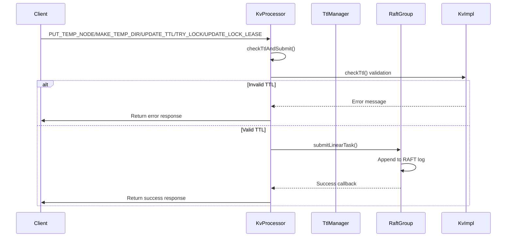
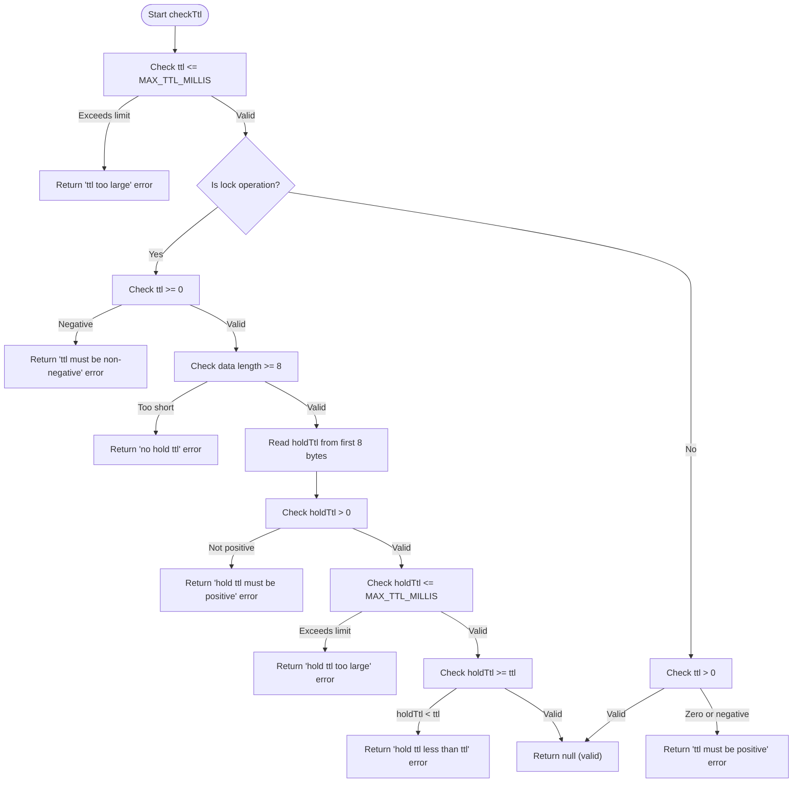
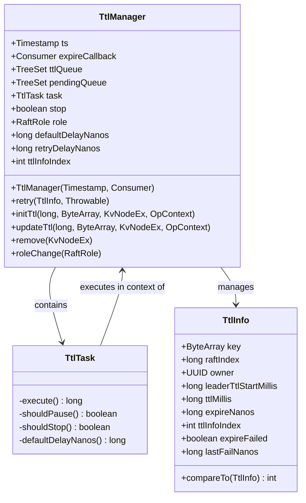
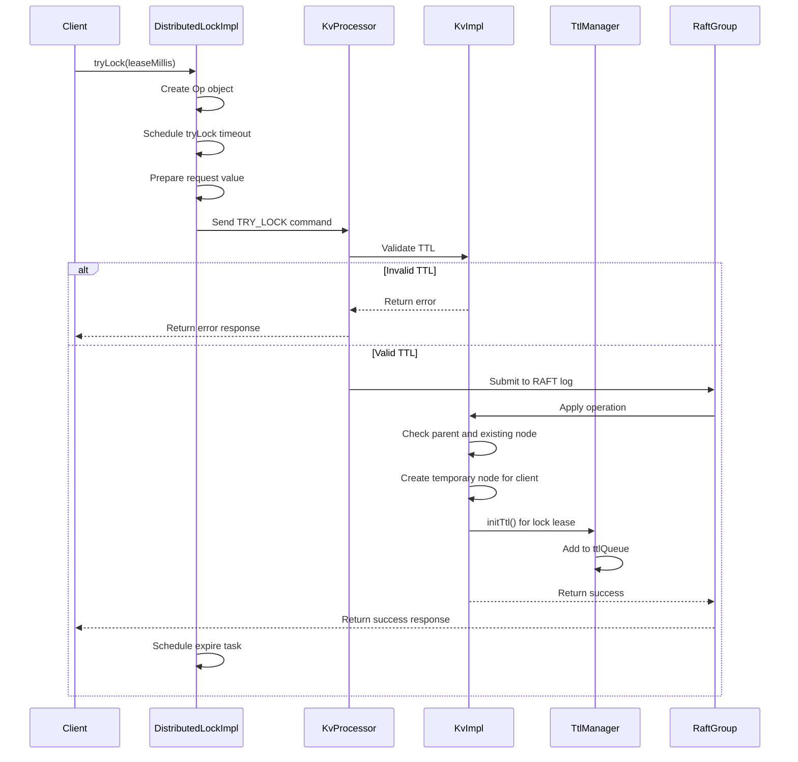
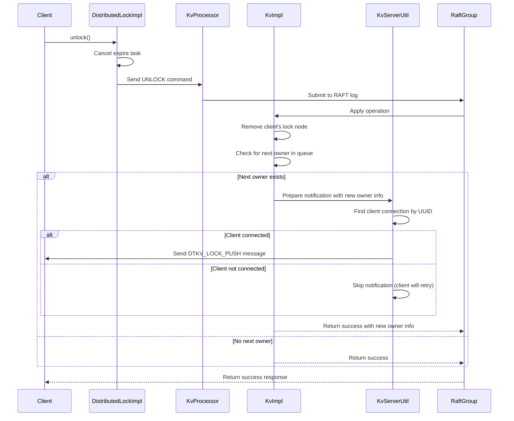
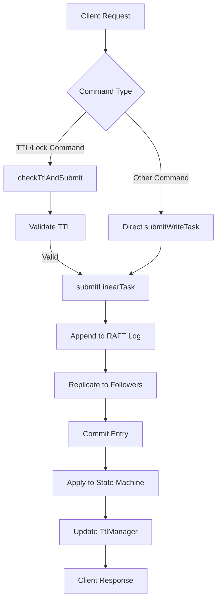

# TTL and Lock Operations Processing

<cite>
**Referenced Files in This Document**   
- [KvProcessor.java](file://server/src/main/java/com/github/dtprj/dongting/dtkv/server/KvProcessor.java)
- [KvImpl.java](file://server/src/main/java/com/github/dtprj/dongting/dtkv/server/KvImpl.java)
- [TtlManager.java](file://server/src/main/java/com/github/dtprj/dongting/dtkv/server/TtlManager.java)
- [KvServerUtil.java](file://server/src/main/java/com/github/dtprj/dongting/dtkv/server/KvServerUtil.java)
- [DistributedLockImpl.java](file://client/src/main/java/com/github/dtprj/dongting/dtkv/DistributedLockImpl.java)
- [LockManager.java](file://client/src/main/java/com/github/dtprj/dongting/dtkv/LockManager.java)
</cite>

## Table of Contents
1. [Introduction](#introduction)
2. [TTL and Lock Command Processing](#ttl-and-lock-command-processing)
3. [TTL Validation and Error Handling](#ttl-validation-and-error-handling)
4. [TTL Manager and Expiration Processing](#ttl-manager-and-expiration-processing)
5. [Distributed Lock Operations](#distributed-lock-operations)
6. [UNLOCK Operation and Notification Mechanism](#unlock-operation-and-notification-mechanism)
7. [RAFT Log Integration and Consistency](#raft-log-integration-and-consistency)
8. [Lease Renewal and Expiration Handling](#lease-renewal-and-expiration-handling)
9. [Conclusion](#conclusion)

## Introduction
This document provides a comprehensive analysis of the TTL (Time-To-Live) and distributed lock operations processing in the Dongting KV storage system. The system implements a robust mechanism for handling temporary nodes, directories, and distributed locks with TTL-based expiration and lease management. The core functionality is centered around the `KvProcessor` class, which handles various commands through the `checkTtlAndSubmit()` method, ensuring proper validation and processing of TTL values before submitting operations to the RAFT log for consistency. The integration between request processing, `TtlManager`, and `LockManager` components ensures reliable operation of temporary entities and distributed locks across the cluster.

**Section sources**
- [KvProcessor.java](file://server/src/main/java/com/github/dtprj/dongting/dtkv/server/KvProcessor.java#L1-L279)

## TTL and Lock Command Processing
The `KvProcessor` class serves as the central command processor for all KV operations, including those related to TTL and distributed locks. Commands such as `PUT_TEMP_NODE`, `MAKE_TEMP_DIR`, `UPDATE_TTL`, `TRY_LOCK`, and `UPDATE_LOCK_LEASE` are specifically handled through the `checkTtlAndSubmit()` method, which performs TTL validation before submitting the operation to the RAFT log.

When a client sends a command related to TTL or locks, the `doProcess()` method in `KvProcessor` routes the request based on the command type. For TTL-related commands, instead of directly submitting the task, it invokes `checkTtlAndSubmit()`, which first validates the TTL value before proceeding. This ensures that only valid TTL operations are submitted to the consensus algorithm, maintaining data integrity across the cluster.

**Diagram sources**
- [KvProcessor.java](file://server/src/main/java/com/github/dtprj/dongting/dtkv/server/KvProcessor.java#L147-L157)
- [KvImpl.java](file://server/src/main/java/com/github/dtprj/dongting/dtkv/server/KvImpl.java#L939-L965)

**Section sources**
- [KvProcessor.java](file://server/src/main/java/com/github/dtprj/dongting/dtkv/server/KvProcessor.java#L120-L137)
- [KvProcessor.java](file://server/src/main/java/com/github/dtprj/dongting/dtkv/server/KvProcessor.java#L147-L157)

## TTL Validation and Error Handling
The TTL validation logic is implemented in the `KvImpl.checkTtl()` method, which performs comprehensive validation of TTL values for both temporary nodes/directories and distributed locks. The validation process differs slightly between regular TTL operations and lock operations due to the additional requirements of the distributed locking mechanism.

For regular TTL operations (PUT_TEMP_NODE, MAKE_TEMP_DIR, UPDATE_TTL), the TTL value must be positive and cannot exceed the maximum allowed value of 100 years in milliseconds. If the TTL value violates these constraints, the method returns an appropriate error message describing the issue.

For lock operations (TRY_LOCK, UPDATE_LOCK_LEASE), the validation is more complex. The TTL value represents the lease duration and must be non-negative. Additionally, the method validates the lock value format, which contains the hold TTL (maximum lease duration) as the first 8 bytes in big-endian format. The validation ensures that the hold TTL is positive, within the maximum limit, and greater than or equal to the requested lease duration.

**Diagram sources**
- [KvImpl.java](file://server/src/main/java/com/github/dtprj/dongting/dtkv/server/KvImpl.java#L939-L965)

**Section sources**
- [KvImpl.java](file://server/src/main/java/com/github/dtprj/dongting/dtkv/server/KvImpl.java#L939-L965)

## TTL Manager and Expiration Processing
The `TtlManager` class is responsible for managing the expiration of temporary nodes and directories, as well as the lease expiration of distributed locks. It maintains two priority queues: `ttlQueue` for active TTL entries and `pendingQueue` for entries that failed to expire and need to be retried.

The `TtlManager` operates as a background task that periodically checks for expired entries. When an entry's expiration time is reached, it is moved from `ttlQueue` to `pendingQueue` and the expiration callback is invoked. If the expiration process fails (e.g., due to a temporary error), the entry remains in `pendingQueue` and will be retried after a configurable delay. This ensures reliable expiration processing even in the face of transient failures.

The expiration process is leader-specific, as only the RAFT leader is responsible for initiating expiration operations. When a node transitions to leader role, it takes all pending expiration tasks from the `pendingQueue` and processes them. This design ensures that expiration operations are processed exactly once across the cluster, maintaining consistency.

**Diagram sources**
- [TtlManager.java](file://server/src/main/java/com/github/dtprj/dongting/dtkv/server/TtlManager.java#L33-L242)

**Section sources**
- [TtlManager.java](file://server/src/main/java/com/github/dtprj/dongting/dtkv/server/TtlManager.java#L33-L242)

## Distributed Lock Operations
Distributed locks in the Dongting system are implemented using a combination of temporary nodes and TTL-based leases. When a client attempts to acquire a lock using the `TRY_LOCK` command, the system creates a temporary node under the lock directory with a TTL representing the lease duration.

The lock acquisition process involves several steps. First, the client sends a `TRY_LOCK` request with the lock key and a value containing the lease duration, lock ID, and operation ID. The server validates the TTL value and, if valid, creates a temporary node for the client under the lock directory. The node's key includes the client's UUID to uniquely identify the lock holder.

The lock directory maintains a queue of waiting clients using the `peekNextOwner()` mechanism. When a client attempts to acquire a lock, it is added to the end of the queue. Only the first client in the queue can acquire the lock when it becomes available. This ensures fair access to the lock and prevents starvation.

**Diagram sources**
- [DistributedLockImpl.java](file://client/src/main/java/com/github/dtprj/dongting/dtkv/DistributedLockImpl.java#L372-L415)
- [KvImpl.java](file://server/src/main/java/com/github/dtprj/dongting/dtkv/server/KvImpl.java#L457-L464)

**Section sources**
- [DistributedLockImpl.java](file://client/src/main/java/com/github/dtprj/dongting/dtkv/DistributedLockImpl.java#L372-L415)
- [KvImpl.java](file://server/src/main/java/com/github/dtprj/dongting/dtkv/server/KvImpl.java#L457-L464)

## UNLOCK Operation and Notification Mechanism
The `UNLOCK` operation has special handling requirements as it may need to notify the next client in the lock queue that it can now acquire the lock. When a client releases a lock, the server not only removes the client's temporary node but also checks if there are any waiting clients in the queue.

If there is a next client waiting for the lock, the server prepares a notification message containing information about the new lock owner and sends it directly to the client. This push-based notification mechanism reduces latency compared to polling and ensures that clients are notified promptly when the lock becomes available.

The notification process is implemented in the `KvServerUtil.notifyNewLockOwner()` method, which constructs a `DTKV_LOCK_PUSH` message and sends it to the new lock owner's connection. The message includes the lock key, the new owner's data, and the server-side wait time. If the client is not currently connected, the notification is skipped, and the client will discover the lock availability through subsequent attempts.

**Diagram sources**
- [KvProcessor.java](file://server/src/main/java/com/github/dtprj/dongting/dtkv/server/KvProcessor.java#L244-L255)
- [KvServerUtil.java](file://server/src/main/java/com/github/dtprj/dongting/dtkv/server/KvServerUtil.java#L162-L200)

**Section sources**
- [KvProcessor.java](file://server/src/main/java/com/github/dtprj/dongting/dtkv/server/KvProcessor.java#L244-L255)
- [KvServerUtil.java](file://server/src/main/java/com/github/dtprj/dongting/dtkv/server/KvServerUtil.java#L162-L200)

## RAFT Log Integration and Consistency
All TTL and lock operations are integrated with the RAFT consensus algorithm to ensure consistency across the cluster. Operations are submitted to the RAFT log using the `submitLinearTask()` method, which ensures that they are processed in order and replicated to all nodes in the group.

The integration with RAFT provides several consistency guarantees. First, all operations are atomic and durable once committed to the log. Second, the leader election process ensures that only one node can process expiration operations at a time, preventing race conditions. Third, the log-based replication ensures that all nodes have the same view of temporary nodes and locks.

When a snapshot is taken, the `TtlManager` state is not directly included in the snapshot. Instead, TTL information is stored with each `KvNodeEx` and reconstructed when the snapshot is loaded. This ensures that the TTL state is consistent with the data state and can be accurately restored after a restart.

**Diagram sources**
- [KvProcessor.java](file://server/src/main/java/com/github/dtprj/dongting/dtkv/server/KvProcessor.java#L199-L202)
- [KvProcessor.java](file://server/src/main/java/com/github/dtprj/dongting/dtkv/server/KvProcessor.java#L147-L157)

**Section sources**
- [KvProcessor.java](file://server/src/main/java/com/github/dtprj/dongting/dtkv/server/KvProcessor.java#L199-L202)

## Lease Renewal and Expiration Handling
Lease renewal for distributed locks is handled through the `UPDATE_LOCK_LEASE` command, which allows a client to extend its lock lease without releasing and reacquiring the lock. This prevents unnecessary churn in the lock queue and reduces the risk of losing the lock due to network delays.

When a client calls `updateLease()`, the client library validates the new lease duration and sends an `UPDATE_LOCK_LEASE` command to the server. The server validates the TTL value and, if valid, updates the TTL for the client's lock node in the `TtlManager`. This extends the expiration time of the lock, allowing the client to continue holding it.

Expiration handling is performed by the `TtlManager` background task, which periodically checks for expired entries. When a lock lease expires, the corresponding temporary node is removed, and if there are waiting clients, the next client in the queue is notified. The expiration process is designed to be idempotent and fault-tolerant, with failed expiration attempts being retried after a delay.

The system also handles edge cases such as leader changes and network partitions. When a node becomes leader, it processes any pending expiration tasks from the `pendingQueue`. During network partitions, clients may lose their locks if they cannot renew their leases, ensuring that the system eventually reaches a consistent state.

**Section sources**
- [DistributedLockImpl.java](file://client/src/main/java/com/github/dtprj/dongting/dtkv/DistributedLockImpl.java#L514-L559)
- [TtlManager.java](file://server/src/main/java/com/github/dtprj/dongting/dtkv/server/TtlManager.java#L59-L125)

## Conclusion
The Dongting KV storage system provides a robust implementation of TTL and distributed lock operations through a well-designed integration of request processing, TTL management, and RAFT consensus. The `checkTtlAndSubmit()` method in `KvProcessor` serves as the entry point for all TTL-related commands, ensuring proper validation before submitting operations to the RAFT log.

The system's design ensures consistency and reliability through several key mechanisms: TTL validation prevents invalid operations, the `TtlManager` provides reliable expiration processing, and RAFT integration guarantees consistency across the cluster. The distributed lock implementation uses temporary nodes with TTL-based leases and a fair queuing mechanism to provide reliable distributed synchronization.

Special handling of the `UNLOCK` operation with push-based notifications to the next lock owner reduces latency and improves performance. The lease renewal mechanism allows clients to extend their locks without releasing them, reducing churn and improving reliability.

Overall, the system demonstrates a sophisticated approach to distributed coordination, balancing performance, consistency, and reliability through careful design and implementation.