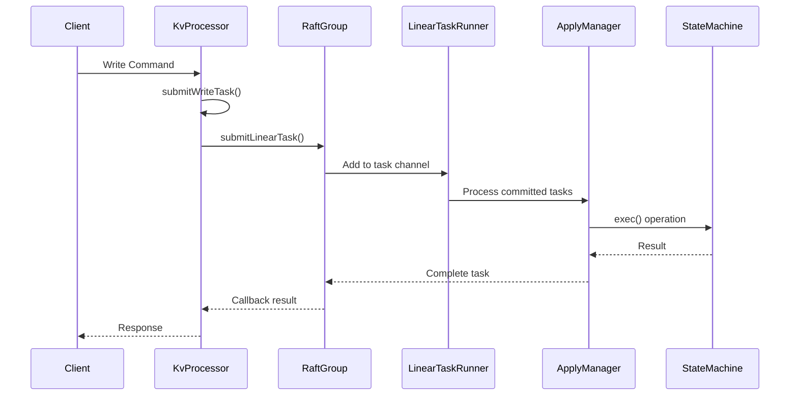
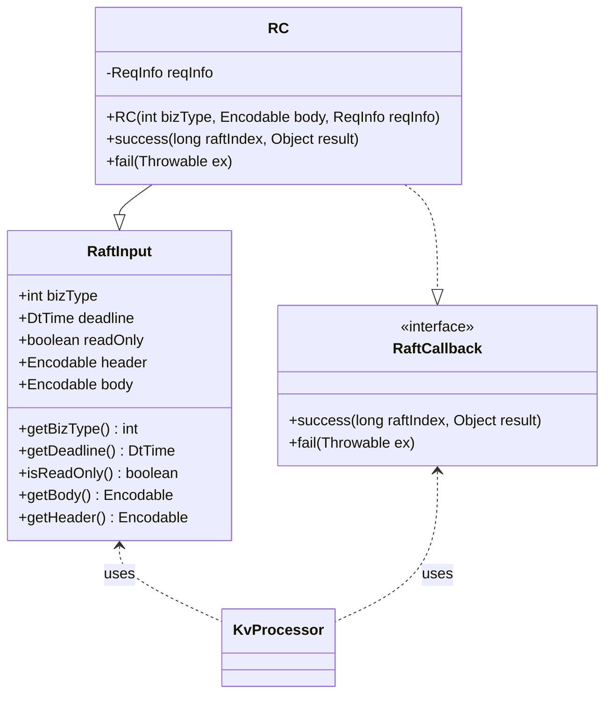
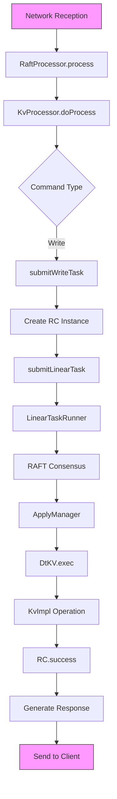

# Write Operations Processing

<cite>
**Referenced Files in This Document**   
- [KvProcessor.java](file://server/src/main/java/com/github/dtprj/dongting/dtkv/server/KvProcessor.java)
- [DtKV.java](file://server/src/main/java/com/github/dtprj/dongting/dtkv/server/DtKV.java)
- [RaftProcessor.java](file://server/src/main/java/com/github/dtprj/dongting/raft/server/RaftProcessor.java)
- [RaftInput.java](file://server/src/main/java/com/github/dtprj/dongting/raft/server/RaftInput.java)
- [RaftCallback.java](file://server/src/main/java/com/github/dtprj/dongting/raft/server/RaftCallback.java)
- [RaftGroup.java](file://server/src/main/java/com/github/dtprj/dongting/raft/server/RaftGroup.java)
- [KvImpl.java](file://server/src/main/java/com/github/dtprj/dongting/dtkv/server/KvImpl.java)
- [ApplyManager.java](file://server/src/main/java/com/github/dtprj/dongting/raft/impl/ApplyManager.java)
- [LinearTaskRunner.java](file://server/src/main/java/com/github/dtprj/dongting/raft/impl/LinearTaskRunner.java)
</cite>

## Table of Contents
1. [Introduction](#introduction)
2. [Write Operation Handling in KvProcessor](#write-operation-handling-in-kvprocessor)
3. [Linear Task Submission Process](#linear-task-submission-process)
4. [RC Inner Class as RaftInput and RaftCallback](#rc-inner-class-as-raftinput-and-raftcallback)
5. [Write Path from Network to State Machine](#write-path-from-network-to-state-machine)
6. [Operation Encoding and Processing](#operation-encoding-and-processing)
7. [Thread Safety and Error Handling](#thread-safety-and-error-handling)
8. [Response Generation Patterns](#response-generation-patterns)

## Introduction
This document details the processing of write operations in the DtKV system, focusing on how various write commands are handled through the `submitWriteTask()` method in `KvProcessor`. The document explains the complete write path from network reception to consensus commitment and state machine application, covering the linear task submission process to RAFT consensus via `submitLinearTask()`. It also details the role of the RC inner class as both `RaftInput` and `RaftCallback`, thread safety considerations, error handling for failed writes, and response generation patterns.

## Write Operation Handling in KvProcessor

The `KvProcessor` class handles various write operations including PUT, REMOVE, MKDIR, CAS, BATCH_PUT, BATCH_REMOVE, and UNLOCK commands. These operations are processed in the `doProcess()` method which runs in the IO thread. When a write command is received, the processor extracts the `DtKV` state machine from the request information and processes the command based on its type.

For write operations, the processor calls the `submitWriteTask()` method with the appropriate business type and request body. This method creates an instance of the RC inner class (which implements both `RaftInput` and `RaftCallback`) and submits it to the RAFT group for linear consensus processing. The write operations are distinguished by their business types defined in the `DtKV` class, such as `BIZ_TYPE_PUT` (0), `BIZ_TYPE_REMOVE` (2), `BIZ_TYPE_MKDIR` (3), `BIZ_TYPE_BATCH_PUT` (6), `BIZ_TYPE_BATCH_REMOVE` (7), `BIZ_TYPE_CAS` (8), and `BIZ_TYPE_UNLOCK` (16).

Operations that require TTL (time-to-live) validation, such as `PUT_TEMP_NODE`, `MAKE_TEMP_DIR`, `UPDATE_TTL`, `TRY_LOCK`, and `UPDATE_LOCK_LEASE`, first go through the `checkTtlAndSubmit()` method which validates the TTL parameters before submitting the write task.

**Section sources**
- [KvProcessor.java](file://server/src/main/java/com/github/dtprj/dongting/dtkv/server/KvProcessor.java#L71-L157)

## Linear Task Submission Process

The linear task submission process begins with the `submitWriteTask()` method in `KvProcessor`, which creates an instance of the RC inner class and submits it to the RAFT group via `submitLinearTask()`. This method ensures that write operations are processed in a linearizable manner through the RAFT consensus algorithm.

The `submitLinearTask()` method is defined in the `RaftGroup` abstract class and implemented by `RaftGroupImpl`. When a linear task is submitted, it is placed in a task channel that is processed by the `LinearTaskRunner`. The `LinearTaskRunner` runs in a dedicated fiber thread and processes tasks in batches using the `takeAll()` method on the task channel.

Each task is wrapped in a `RaftTask` object that contains the `RaftInput` (the task itself) and a `RaftCallback` (for handling the result). The tasks are then processed by the RAFT consensus algorithm, which ensures that they are committed in a consistent order across all replicas in the RAFT group.

Once a task is committed by the RAFT leader, it is applied to the state machine in the order of their commit indices. The `ApplyManager` is responsible for applying committed log entries to the state machine, ensuring that operations are executed in the correct sequence.

**Diagram sources **
- [KvProcessor.java](file://server/src/main/java/com/github/dtprj/dongting/dtkv/server/KvProcessor.java#L199-L202)
- [RaftGroup.java](file://server/src/main/java/com/github/dtprj/dongting/raft/server/RaftGroup.java#L35)
- [LinearTaskRunner.java](file://server/src/main/java/com/github/dtprj/dongting/raft/impl/LinearTaskRunner.java#L77-L82)
- [ApplyManager.java](file://server/src/main/java/com/github/dtprj/dongting/raft/impl/ApplyManager.java#L159-L198)

**Section sources**
- [KvProcessor.java](file://server/src/main/java/com/github/dtprj/dongting/dtkv/server/KvProcessor.java#L199-L202)
- [RaftGroup.java](file://server/src/main/java/com/github/dtprj/dongting/raft/server/RaftGroup.java#L35)
- [LinearTaskRunner.java](file://server/src/main/java/com/github/dtprj/dongting/raft/impl/LinearTaskRunner.java#L77-L82)

## RC Inner Class as RaftInput and RaftCallback

The RC inner class in `KvProcessor` serves a dual role as both `RaftInput` and `RaftCallback`, implementing the necessary interfaces for RAFT consensus processing. As a `RaftInput`, it provides the data and metadata for the write operation, including the business type, request body, timeout deadline, and read-only flag.

The RC class extends `RaftInput` and implements the `RaftCallback` interface, allowing it to receive notifications when the consensus process completes. When constructed, it takes the business type, request body, and request information, passing the essential parameters to the `RaftInput` constructor.

As a `RaftCallback`, the RC class implements two methods: `success()` and `fail()`. The `success()` method is called when the write operation is successfully committed by the RAFT consensus algorithm. It processes the result from the state machine and generates an appropriate response packet based on the original command type. The response is then sent back to the client through the request context.

The `fail()` method handles cases where the consensus process fails, typically due to leadership changes, timeouts, or other RAFT-related errors. It delegates error handling to the `writeErrorResp()` method, which generates an appropriate error response based on the exception type.

This dual role design allows for efficient correlation between the submitted task and its result, maintaining the request context throughout the consensus process while ensuring proper cleanup of resources.

**Diagram sources **
- [KvProcessor.java](file://server/src/main/java/com/github/dtprj/dongting/dtkv/server/KvProcessor.java#L204-L276)
- [RaftInput.java](file://server/src/main/java/com/github/dtprj/dongting/raft/server/RaftInput.java#L25)
- [RaftCallback.java](file://server/src/main/java/com/github/dtprj/dongting/raft/server/RaftCallback.java#L23)

**Section sources**
- [KvProcessor.java](file://server/src/main/java/com/github/dtprj/dongting/dtkv/server/KvProcessor.java#L204-L276)

## Write Path from Network to State Machine Application

The write path in DtKV follows a well-defined sequence from network reception to state machine application. When a write command is received over the network, it is first processed by the `RaftProcessor` in the IO thread. The `process()` method in `RaftProcessor` performs initial validation, checks the request port, verifies the RAFT group readiness, and creates a `ReqInfo` object containing the request frame and context.

The request is then passed to the `doProcess()` method in `KvProcessor`, which identifies the command type and routes it appropriately. For write operations, the `submitWriteTask()` method is called, creating an RC instance that encapsulates both the input data and callback logic.

The RC instance is submitted to the RAFT group via `submitLinearTask()`, which places it in a task channel for the `LinearTaskRunner`. The `LinearTaskRunner` processes tasks in batches, ensuring efficient throughput while maintaining the order of operations.

Once the task is committed by the RAFT consensus algorithm, the `ApplyManager` applies it to the state machine. The `exec()` method in `DtKV` (the state machine implementation) is called with the commit index, timestamp, and the `RaftInput` (RC instance). This method executes the appropriate operation on the `KvImpl` data structure based on the business type.

After the operation is completed, the result is passed back through the `RaftCallback` mechanism. The `success()` method in the RC class processes the result, creates an appropriate response packet, and sends it back to the client through the request context. For certain operations like `UNLOCK`, additional processing may occur, such as notifying the new lock owner.

**Diagram sources **
- [RaftProcessor.java](file://server/src/main/java/com/github/dtprj/dongting/raft/server/RaftProcessor.java#L80-L130)
- [KvProcessor.java](file://server/src/main/java/com/github/dtprj/dongting/dtkv/server/KvProcessor.java#L71-L144)
- [DtKV.java](file://server/src/main/java/com/github/dtprj/dongting/dtkv/server/DtKV.java#L152-L214)
- [ApplyManager.java](file://server/src/main/java/com/github/dtprj/dongting/raft/impl/ApplyManager.java#L159-L198)

**Section sources**
- [RaftProcessor.java](file://server/src/main/java/com/github/dtprj/dongting/raft/server/RaftProcessor.java#L80-L130)
- [KvProcessor.java](file://server/src/main/java/com/github/dtprj/dongting/dtkv/server/KvProcessor.java#L71-L144)
- [DtKV.java](file://server/src/main/java/com/github/dtprj/dongting/dtkv/server/DtKV.java#L152-L214)

## Operation Encoding and Processing

Different write operations are encoded and processed according to their specific requirements. Each operation is identified by a business type constant defined in the `DtKV` class, which is stored as a single byte in the RAFT log for efficiency.

The `KvReq` class serves as the request container for all operations, containing fields such as key, value, expected value (for CAS operations), keys and values (for batch operations), and TTL information. When a write operation is submitted, the `RaftInput` wrapper contains the `KvReq` as its body, along with the business type that determines how the operation should be processed.

In the `DtKV.exec()` method, the business type is used in a switch statement to route the operation to the appropriate method in `KvImpl`. For example, `BIZ_TYPE_PUT` calls `kv.put()`, `BIZ_TYPE_REMOVE` calls `kv.remove()`, and `BIZ_TYPE_CAS` calls `kv.compareAndSet()`. Batch operations like `BIZ_TYPE_BATCH_PUT` and `BIZ_TYPE_BATCH_REMOVE` process multiple keys in a single operation.

The `KvImpl` class maintains the actual key-value data structure using a `ConcurrentHashMap` with `ByteArray` keys and `KvNodeHolder` values. Write operations are protected by a `StampedLock` to ensure thread safety during modifications. The lock allows multiple readers or a single writer, preventing race conditions during concurrent access.

For operations that modify the data structure, the `KvImpl` methods perform necessary validations, such as checking parent directory existence for PUT operations, verifying TTL constraints, and ensuring proper lock ownership. The results of these operations are returned as `KvResult` objects or `Pair<Integer, List<KvResult>>` for batch operations, which are then packaged into response packets.

**Section sources**
- [DtKV.java](file://server/src/main/java/com/github/dtprj/dongting/dtkv/server/DtKV.java#L64-L83)
- [KvImpl.java](file://server/src/main/java/com/github/dtprj/dongting/dtkv/server/KvImpl.java#L59-L66)
- [KvReq.java](file://client/src/main/java/com/github/dtprj/dongting/dtkv/KvReq.java)

## Thread Safety and Error Handling

Thread safety in the write operations processing is ensured through multiple mechanisms. The `KvImpl` class uses a `StampedLock` to protect write operations on the underlying data structure, allowing concurrent reads while ensuring exclusive access for writes. This design prevents race conditions when multiple operations attempt to modify the same data.

The `ConcurrentHashMap` used for storing key-value pairs provides inherent thread safety for basic operations, but additional locking is required for complex operations that involve multiple steps or validations. The `StampedLock` is acquired for the duration of these operations to maintain consistency.

Error handling is implemented through the `RaftCallback` mechanism. When a write operation fails, the `fail()` method of the RC class is invoked with the appropriate exception. This method calls `writeErrorResp()` which categorizes the error and generates an appropriate response. Timeout exceptions are logged but not returned to the client, while flow control exceptions and "not leader" exceptions are converted to specific error codes in the response.

The system also handles RAFT-specific errors such as leadership changes. When a node is not the leader, a `NotLeaderException` is thrown, and the response includes information about the current leader to facilitate client redirection. This allows clients to automatically reconnect to the correct leader node.

Resource cleanup is handled in both the `success()` and `fail()` methods of the RC class, where the `reqInfo` reference is set to null to allow garbage collection. This prevents memory leaks that could occur if request context references were retained after processing is complete.

**Section sources**
- [KvImpl.java](file://server/src/main/java/com/github/dtprj/dongting/dtkv/server/KvImpl.java#L66)
- [KvProcessor.java](file://server/src/main/java/com/github/dtprj/dongting/dtkv/server/KvProcessor.java#L268-L275)
- [RaftProcessor.java](file://server/src/main/java/com/github/dtprj/dongting/raft/server/RaftProcessor.java#L135-L158)

## Response Generation Patterns

Response generation in DtKV follows consistent patterns based on the operation type and outcome. For successful write operations, the `success()` method in the RC class creates an `EncodableBodyWritePacket` containing a `KvResp` object with the result from the state machine execution.

Different operation types generate different response structures. Single operations like PUT, REMOVE, and MKDIR return a `KvResp` containing a single `KvResult` in a list. Batch operations like BATCH_PUT and BATCH_REMOVE return a `KvResp` with multiple `KvResult` objects, preserving the order of the input keys.

The response packet includes the RAFT index of the committed operation, which can be used by clients for consistency guarantees. The business code from the `KvResult` is copied to the packet's `bizCode` field, allowing clients to understand the specific outcome of the operation (e.g., `SUCCESS`, `SUCCESS_OVERWRITE`, `NOT_FOUND`).

For the `UNLOCK` operation, a special pattern is followed where the response is sent immediately, and then additional processing occurs to notify the new lock owner if applicable. This is implemented by calling `writeRespInBizThreads()` before performing the notification, ensuring that the client receives a timely response.

Error responses are generated through the `writeErrorResp()` method, which creates `EmptyBodyRespPacket` instances with appropriate error codes and messages. The error codes include `SYS_ERROR` for internal errors, `FLOW_CONTROL` for rate limiting, and `NOT_RAFT_LEADER` for redirection to the current leader.

All responses are sent through the request context using `writeRespInBizThreads()`, which ensures that the response is written from a business thread rather than the IO thread, preventing blocking of the IO processing pipeline.

**Section sources**
- [KvProcessor.java](file://server/src/main/java/com/github/dtprj/dongting/dtkv/server/KvProcessor.java#L214-L266)
- [RaftProcessor.java](file://server/src/main/java/com/github/dtprj/dongting/raft/server/RaftProcessor.java#L135-L158)
- [KvResp.java](file://client/src/main/java/com/github/dtprj/dongting/dtkv/KvResp.java)