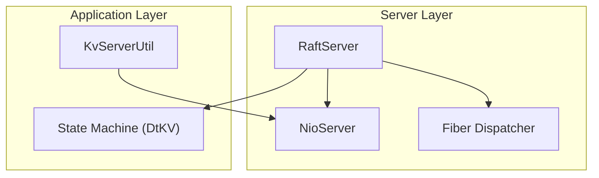
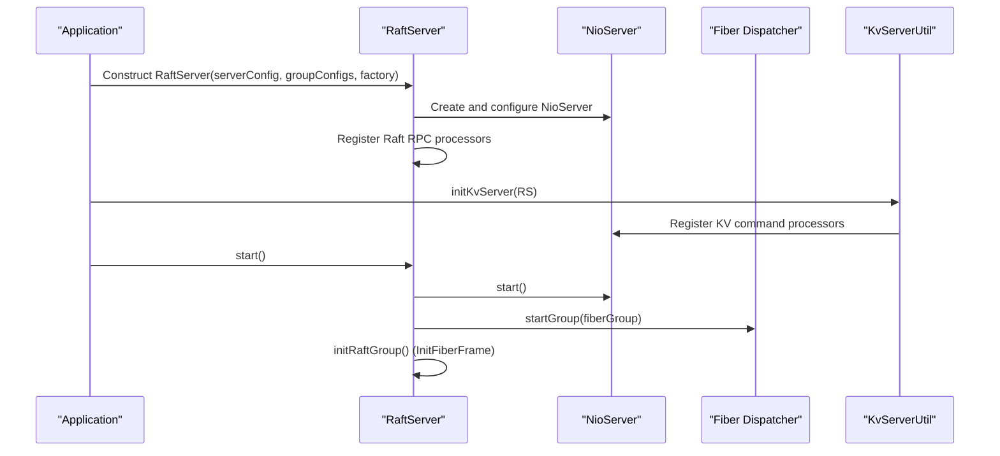
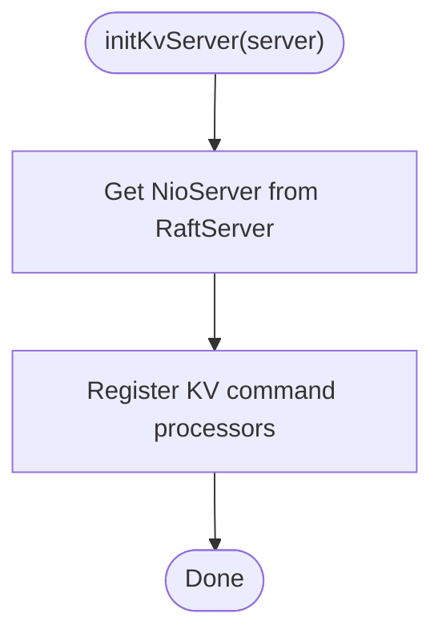
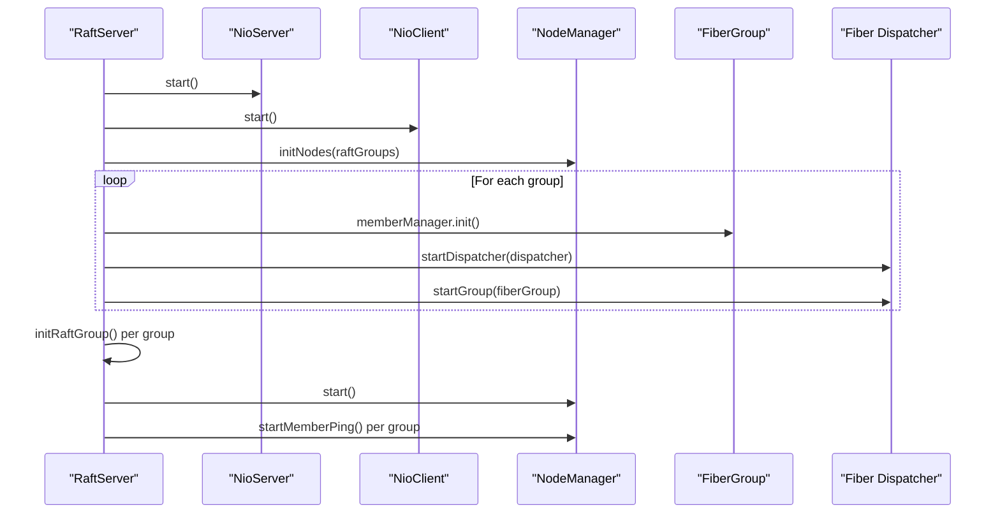
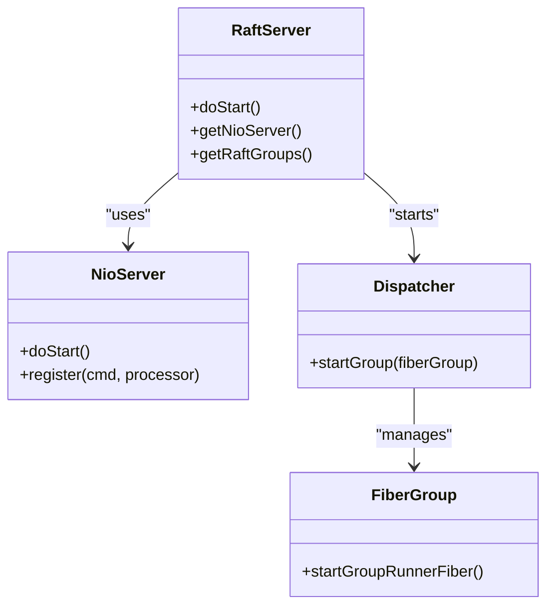
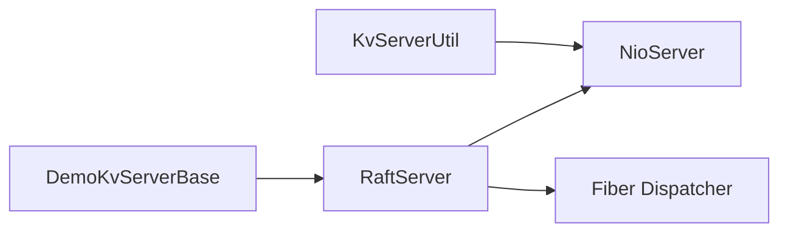

# Server Initialization Process

<cite>
**Referenced Files in This Document**
- [RaftServer.java](file://server/src/main/java/com/github/dtprj/dongting/raft/server/RaftServer.java)
- [KvServerUtil.java](file://server/src/main/java/com/github/dtprj/dongting/dtkv/server/KvServerUtil.java)
- [DemoKvServerBase.java](file://demos/src/main/java/com/github/dtprj/dongting/demos/base/DemoKvServerBase.java)
- [NioServer.java](file://client/src/main/java/com/github/dtprj/dongting/net/NioServer.java)
- [Dispatcher.java](file://server/src/main/java/com/github/dtprj/dongting/fiber/Dispatcher.java)
- [RaftServerConfig.java](file://server/src/main/java/com/github/dtprj/dongting/raft/server/RaftServerConfig.java)
- [InitFiberFrame.java](file://server/src/main/java/com/github/dtprj/dongting/raft/impl/InitFiberFrame.java)
</cite>

## Table of Contents
1. [Introduction](#introduction)
2. [Project Structure](#project-structure)
3. [Core Components](#core-components)
4. [Architecture Overview](#architecture-overview)
5. [Detailed Component Analysis](#detailed-component-analysis)
6. [Dependency Analysis](#dependency-analysis)
7. [Performance Considerations](#performance-considerations)
8. [Troubleshooting Guide](#troubleshooting-guide)
9. [Conclusion](#conclusion)

## Introduction
This document explains the DtKV server initialization sequence with a focus on the three-step process:
1. Creating the RaftServer instance
2. Calling KvServerUtil.initKvServer() to register command processors
3. Starting the server with RaftServer.start()

It also documents the requirement that initKvServer must be called after RaftServer initialization but before starting the server, describes how RaftServer orchestrates the underlying NioServer and fiber dispatcher during initialization, and outlines error handling strategies and thread safety considerations.

## Project Structure
The server initialization involves several key modules:
- RaftServer: constructs and starts the replication network and Raft subsystem
- NioServer: the underlying IO server used by Raft replication and client RPC
- Fiber Dispatcher: the cooperative scheduling engine for Raft and KV tasks
- KvServerUtil: registers KV command processors onto the NioServer
- DemoKvServerBase: demonstrates the correct initialization order in practice

**Diagram sources**
- [RaftServer.java](file://server/src/main/java/com/github/dtprj/dongting/raft/server/RaftServer.java#L141-L188)
- [NioServer.java](file://client/src/main/java/com/github/dtprj/dongting/net/NioServer.java#L101-L121)
- [Dispatcher.java](file://server/src/main/java/com/github/dtprj/dongting/fiber/Dispatcher.java#L115-L129)
- [KvServerUtil.java](file://server/src/main/java/com/github/dtprj/dongting/dtkv/server/KvServerUtil.java#L52-L76)

**Section sources**
- [RaftServer.java](file://server/src/main/java/com/github/dtprj/dongting/raft/server/RaftServer.java#L141-L188)
- [NioServer.java](file://client/src/main/java/com/github/dtprj/dongting/net/NioServer.java#L101-L121)
- [Dispatcher.java](file://server/src/main/java/com/github/dtprj/dongting/fiber/Dispatcher.java#L115-L129)
- [KvServerUtil.java](file://server/src/main/java/com/github/dtprj/dongting/dtkv/server/KvServerUtil.java#L52-L76)

## Core Components
- RaftServer: constructs NioServer/NioClient, registers Raft RPC processors, creates Raft groups, initializes fiber dispatchers, and orchestrates startup phases.
- NioServer: accepts connections, manages IO workers, and dispatches requests to registered processors.
- Fiber Dispatcher: runs FiberGroup tasks, schedules fibers, and coordinates lifecycle transitions.
- KvServerUtil: registers KV command processors onto the NioServer after RaftServer construction.
- DemoKvServerBase: shows the correct initialization order in a real-world example.

**Section sources**
- [RaftServer.java](file://server/src/main/java/com/github/dtprj/dongting/raft/server/RaftServer.java#L141-L188)
- [NioServer.java](file://client/src/main/java/com/github/dtprj/dongting/net/NioServer.java#L101-L121)
- [Dispatcher.java](file://server/src/main/java/com/github/dtprj/dongting/fiber/Dispatcher.java#L115-L129)
- [KvServerUtil.java](file://server/src/main/java/com/github/dtprj/dongting/dtkv/server/KvServerUtil.java#L52-L76)
- [DemoKvServerBase.java](file://demos/src/main/java/com/github/dtprj/dongting/demos/base/DemoKvServerBase.java#L68-L74)

## Architecture Overview
The initialization sequence ensures that:
- RaftServer is constructed with NioServer/NioClient and Raft processors
- KV processors are registered on NioServer via KvServerUtil.initKvServer()
- RaftServer.start() begins IO, dispatcher, and Raft group initialization

**Diagram sources**
- [RaftServer.java](file://server/src/main/java/com/github/dtprj/dongting/raft/server/RaftServer.java#L141-L188)
- [RaftServer.java](file://server/src/main/java/com/github/dtprj/dongting/raft/server/RaftServer.java#L330-L372)
- [InitFiberFrame.java](file://server/src/main/java/com/github/dtprj/dongting/raft/impl/InitFiberFrame.java#L74-L90)
- [KvServerUtil.java](file://server/src/main/java/com/github/dtprj/dongting/dtkv/server/KvServerUtil.java#L52-L76)
- [NioServer.java](file://client/src/main/java/com/github/dtprj/dongting/net/NioServer.java#L101-L121)
- [Dispatcher.java](file://server/src/main/java/com/github/dtprj/dongting/fiber/Dispatcher.java#L115-L129)

## Detailed Component Analysis

### Step 1: Create the RaftServer Instance
- RaftServer constructor sets up NioServer and NioClient, registers Raft RPC processors, and creates Raft groups.
- It validates server configuration and node membership lists.

Key behaviors:
- Creates NioServer with configured ports and IO threads
- Registers Raft processors (e.g., NODE_PING, RAFT_PING, AppendProcessor, VoteProcessor, etc.)
- Builds Raft groups and prepares GroupComponents for each group

**Section sources**
- [RaftServer.java](file://server/src/main/java/com/github/dtprj/dongting/raft/server/RaftServer.java#L141-L188)
- [RaftServer.java](file://server/src/main/java/com/github/dtprj/dongting/raft/server/RaftServer.java#L212-L302)
- [RaftServerConfig.java](file://server/src/main/java/com/github/dtprj/dongting/raft/server/RaftServerConfig.java#L21-L40)

### Step 2: Register Command Processors with KvServerUtil.initKvServer()
- KvServerUtil.initKvServer() registers KV command processors onto the NioServer obtained from RaftServer.
- This must be called after RaftServer construction but before RaftServer.start().

Common registrations include:
- DTKV_GET, PUT, REMOVE, MKDIR, LIST, BATCH_* operations
- WATCH and KV status processors
- TTL and lock-related commands

**Diagram sources**
- [KvServerUtil.java](file://server/src/main/java/com/github/dtprj/dongting/dtkv/server/KvServerUtil.java#L52-L76)

**Section sources**
- [KvServerUtil.java](file://server/src/main/java/com/github/dtprj/dongting/dtkv/server/KvServerUtil.java#L52-L76)

### Step 3: Start the Server with RaftServer.start()
- RaftServer.start() performs a multi-phase initialization:
  1) Starts NioServer and NioClient
  2) Initializes node manager and member managers
  3) Starts fiber dispatchers and fiber groups
  4) Initializes Raft logs and state machines
  5) Starts node/member pings and waits for readiness

**Diagram sources**
- [RaftServer.java](file://server/src/main/java/com/github/dtprj/dongting/raft/server/RaftServer.java#L330-L424)
- [InitFiberFrame.java](file://server/src/main/java/com/github/dtprj/dongting/raft/impl/InitFiberFrame.java#L74-L90)
- [Dispatcher.java](file://server/src/main/java/com/github/dtprj/dongting/fiber/Dispatcher.java#L115-L129)

**Section sources**
- [RaftServer.java](file://server/src/main/java/com/github/dtprj/dongting/raft/server/RaftServer.java#L330-L424)
- [InitFiberFrame.java](file://server/src/main/java/com/github/dtprj/dongting/raft/impl/InitFiberFrame.java#L74-L90)
- [Dispatcher.java](file://server/src/main/java/com/github/dtprj/dongting/fiber/Dispatcher.java#L115-L129)

### Requirement: Correct Initialization Order
- Construct RaftServer
- Call KvServerUtil.initKvServer(RaftServer)
- Call RaftServer.start()

This order is demonstrated in the demo base class.

**Section sources**
- [DemoKvServerBase.java](file://demos/src/main/java/com/github/dtprj/dongting/demos/base/DemoKvServerBase.java#L68-L74)

### Orchestrating NioServer and Fiber Dispatcher
- NioServer.start() initializes selector, IO workers, and accept thread.
- Fiber Dispatcher.startGroup() adds a FiberGroup and starts the group runner fiber.
- RaftServer.start() calls these in sequence and waits for group startup completion.

**Diagram sources**
- [RaftServer.java](file://server/src/main/java/com/github/dtprj/dongting/raft/server/RaftServer.java#L330-L372)
- [NioServer.java](file://client/src/main/java/com/github/dtprj/dongting/net/NioServer.java#L101-L121)
- [Dispatcher.java](file://server/src/main/java/com/github/dtprj/dongting/fiber/Dispatcher.java#L115-L129)

**Section sources**
- [NioServer.java](file://client/src/main/java/com/github/dtprj/dongting/net/NioServer.java#L101-L121)
- [Dispatcher.java](file://server/src/main/java/com/github/dtprj/dongting/fiber/Dispatcher.java#L115-L129)
- [RaftServer.java](file://server/src/main/java/com/github/dtprj/dongting/raft/server/RaftServer.java#L330-L372)

### Error Handling Strategies
- Initialization failures are caught and wrapped as RaftException, logged, and propagated.
- Futures are chained to complete exceptions when errors occur during readiness checks.
- Node manager and member pings handle timeouts and exceptions during startup.

Recommended practices:
- Wrap initialization in try-catch around RaftServer.start()
- Monitor allMemberReadyFuture and allGroupReadyFuture for completion or exceptional completion
- Validate RaftServerConfig and group configurations before constructing RaftServer

**Section sources**
- [RaftServer.java](file://server/src/main/java/com/github/dtprj/dongting/raft/server/RaftServer.java#L368-L372)
- [RaftServer.java](file://server/src/main/java/com/github/dtprj/dongting/raft/server/RaftServer.java#L361-L367)
- [RaftServer.java](file://server/src/main/java/com/github/dtprj/dongting/raft/server/RaftServer.java#L392-L406)
- [RaftServer.java](file://server/src/main/java/com/github/dtprj/dongting/raft/server/RaftServer.java#L408-L424)

### Thread Safety Considerations
- RaftServer.start() uses CompletableFuture.allOf(...) to synchronize group initialization and readiness.
- NodeManager uses explicit locking around node collections during initialization.
- Fiber dispatchers coordinate group lifecycles and ensure fibers execute in a controlled environment.

Guidelines:
- Do not call KvServerUtil.initKvServer() after RaftServer.start() because processors must be registered before IO and Raft initialization begins.
- Avoid concurrent modifications to node collections without holding the appropriate locks.

**Section sources**
- [RaftServer.java](file://server/src/main/java/com/github/dtprj/dongting/raft/server/RaftServer.java#L330-L372)
- [RaftServer.java](file://server/src/main/java/com/github/dtprj/dongting/raft/server/RaftServer.java#L408-L424)
- [RaftServer.java](file://server/src/main/java/com/github/dtprj/dongting/raft/server/RaftServer.java#L475-L502)

## Dependency Analysis
- RaftServer depends on NioServer for replication and client IO, and on Fiber Dispatcher for scheduling.
- KvServerUtil depends on NioServer to register KV processors.
- DemoKvServerBase orchestrates the correct initialization order.

**Diagram sources**
- [DemoKvServerBase.java](file://demos/src/main/java/com/github/dtprj/dongting/demos/base/DemoKvServerBase.java#L68-L74)
- [RaftServer.java](file://server/src/main/java/com/github/dtprj/dongting/raft/server/RaftServer.java#L141-L188)
- [KvServerUtil.java](file://server/src/main/java/com/github/dtprj/dongting/dtkv/server/KvServerUtil.java#L52-L76)

**Section sources**
- [DemoKvServerBase.java](file://demos/src/main/java/com/github/dtprj/dongting/demos/base/DemoKvServerBase.java#L68-L74)
- [RaftServer.java](file://server/src/main/java/com/github/dtprj/dongting/raft/server/RaftServer.java#L141-L188)
- [KvServerUtil.java](file://server/src/main/java/com/github/dtprj/dongting/dtkv/server/KvServerUtil.java#L52-L76)

## Performance Considerations
- Use appropriate IO threads and ports in RaftServerConfig to balance throughput and latency.
- Keep Raft initialization short by avoiding heavy synchronous operations during start().
- Ensure KV processors are lightweight and delegate heavy work to fiber executors when needed.

[No sources needed since this section provides general guidance]

## Troubleshooting Guide
Common issues and resolutions:
- Attempting to register processors after server start: This will not work because NioServer has already started and may reject late registrations. Always call KvServerUtil.initKvServer() before RaftServer.start().
- Startup hangs or timeouts: Verify that all group members are reachable and that RaftServerConfig ports are open. Check readiness futures for exceptions.
- Node connectivity problems: Inspect NodeManager initialization and self-check results.

**Section sources**
- [RaftServer.java](file://server/src/main/java/com/github/dtprj/dongting/raft/server/RaftServer.java#L330-L372)
- [RaftServer.java](file://server/src/main/java/com/github/dtprj/dongting/raft/server/RaftServer.java#L392-L424)
- [KvServerUtil.java](file://server/src/main/java/com/github/dtprj/dongting/dtkv/server/KvServerUtil.java#L52-L76)

## Conclusion
The correct initialization sequence is:
1) Construct RaftServer
2) Call KvServerUtil.initKvServer(RaftServer)
3) Call RaftServer.start()

RaftServer orchestrates NioServer and Fiber Dispatcher to bring up replication, Raft groups, and KV services. Proper error handling and thread safety practices ensure robust startup and operation.