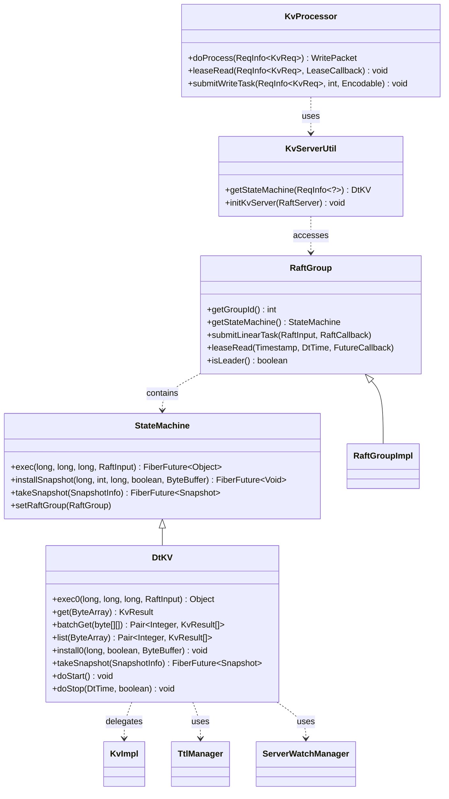
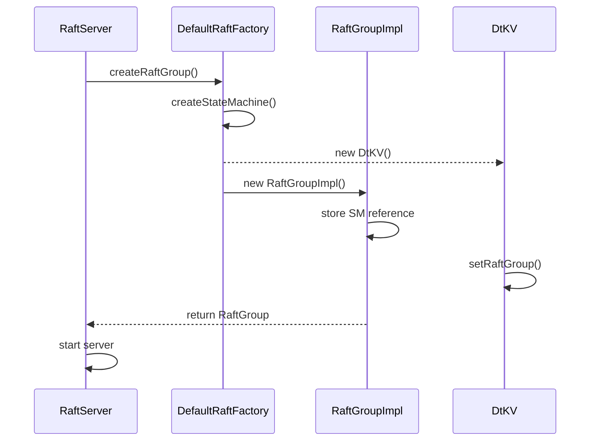
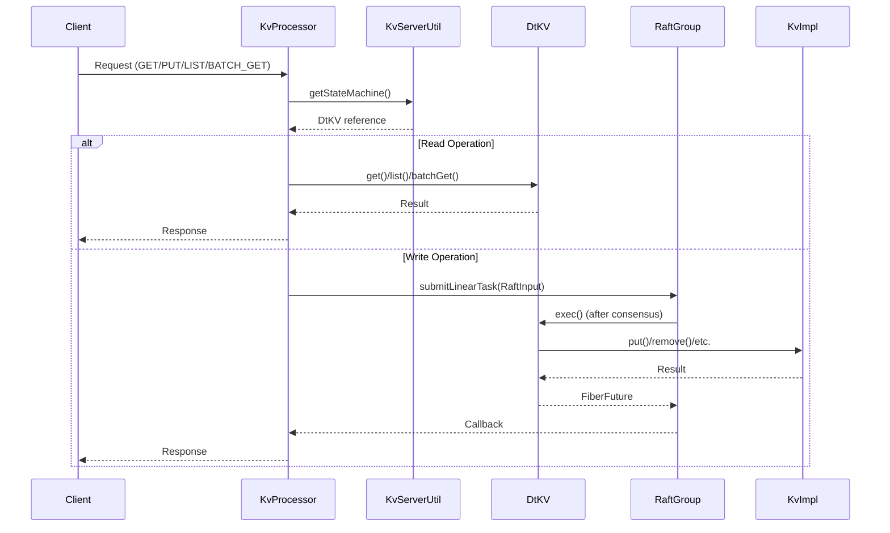
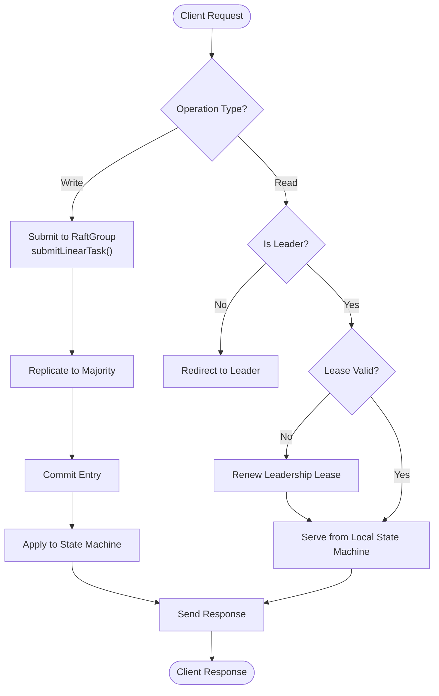

# State Machine Integration

<cite>
**Referenced Files in This Document**   
- [KvServerUtil.java](file://server/src/main/java/com/github/dtprj/dongting/dtkv/server/KvServerUtil.java)
- [DtKV.java](file://server/src/main/java/com/github/dtprj/dongting/dtkv/server/DtKV.java)
- [StateMachine.java](file://server/src/main/java/com/github/dtprj/dongting/raft/sm/StateMachine.java)
- [RaftGroup.java](file://server/src/main/java/com/github/dtprj/dongting/raft/server/RaftGroup.java)
- [RaftGroupImpl.java](file://server/src/main/java/com/github/dtprj/dongting/raft/impl/RaftGroupImpl.java)
- [KvProcessor.java](file://server/src/main/java/com/github/dtprj/dongting/dtkv/server/KvProcessor.java)
- [DefaultRaftFactory.java](file://server/src/main/java/com/github/dtprj/dongting/raft/server/DefaultRaftFactory.java)
- [DemoKvServerBase.java](file://demos/src/main/java/com/github/dtprj/dongting/demos/base/DemoKvServerBase.java)
</cite>

## Table of Contents
1. [Introduction](#introduction)
2. [State Machine Integration Architecture](#state-machine-integration-architecture)
3. [Safe State Machine Casting and Error Handling](#safe-state-machine-casting-and-error-handling)
4. [Relationship Between RaftGroup, StateMachine, and DtKV](#relationship-between-raftgroup-statemachine-and-dtkv)
5. [Business Logic Invocation Through State Machine](#business-logic-invocation-through-state-machine)
6. [Linearizable Read and Write Coordination](#linearizable-read-and-write-coordination)
7. [Best Practices for State Machine Implementation](#best-practices-for-state-machine-implementation)
8. [Error Propagation from State Machine to Client Responses](#error-propagation-from-state-machine-to-client-responses)
9. [Conclusion](#conclusion)

## Introduction
This document provides a comprehensive analysis of the DtKV state machine integration with the RAFT consensus layer in the Dongting distributed system. The integration enables consistent and fault-tolerant key-value storage by coordinating state changes across a cluster of nodes using the RAFT consensus algorithm. The state machine serves as the bridge between the consensus layer and the business logic, ensuring that all operations are executed in a deterministic order and that the system maintains linearizable consistency. This documentation explains the mechanisms for safely casting the RAFT group's state machine to the DtKV interface, handling type mismatches, and coordinating linearizable reads and writes. It also covers best practices for implementing state machines and propagating errors from the state machine to client responses.

**Section sources**
- [KvServerUtil.java](file://server/src/main/java/com/github/dtprj/dongting/dtkv/server/KvServerUtil.java#L1-L202)
- [DtKV.java](file://server/src/main/java/com/github/dtprj/dongting/dtkv/server/DtKV.java#L1-L413)

## State Machine Integration Architecture

**Diagram sources**
- [RaftGroup.java](file://server/src/main/java/com/github/dtprj/dongting/raft/server/RaftGroup.java#L1-L106)
- [StateMachine.java](file://server/src/main/java/com/github/dtprj/dongting/raft/sm/StateMachine.java#L1-L50)
- [DtKV.java](file://server/src/main/java/com/github/dtprj/dongting/dtkv/server/DtKV.java#L1-L413)
- [KvProcessor.java](file://server/src/main/java/com/github/dtprj/dongting/dtkv/server/KvProcessor.java#L1-L279)
- [KvServerUtil.java](file://server/src/main/java/com/github/dtprj/dongting/dtkv/server/KvServerUtil.java#L1-L202)

## Safe State Machine Casting and Error Handling

The `KvServerUtil.getStateMachine()` method provides a safe mechanism for casting the RAFT group's state machine to the DtKV interface. This method is critical for ensuring type safety when accessing DtKV-specific functionality from within the RAFT processing pipeline. The implementation follows a defensive programming approach by catching `ClassCastException` and converting it into an appropriate error response.

When a `ClassCastException` occurs, the method creates an `EmptyBodyRespPacket` with a `CLIENT_ERROR` response code and a descriptive error message that includes the actual type of the state machine. This error response is then written back to the client through the request context, ensuring that clients receive meaningful feedback when type mismatches occur. The method returns `null` to indicate that the casting failed, allowing the calling code to handle the error appropriately.

This error handling approach follows the principle of failing gracefully and providing clear diagnostic information. Instead of allowing the exception to propagate and potentially crash the server thread, it is converted into a structured error response that can be properly handled by the client. This design ensures system stability while maintaining transparency about type mismatches in the state machine implementation.

**Section sources**
- [KvServerUtil.java](file://server/src/main/java/com/github/dtprj/dongting/dtkv/server/KvServerUtil.java#L78-L87)

## Relationship Between RaftGroup, StateMachine, and DtKV

The integration between `RaftGroup`, `StateMachine`, and `DtKV` implementations follows a well-defined architectural pattern that separates consensus concerns from business logic. The `RaftGroup` serves as the container for the consensus algorithm, managing leadership, log replication, and membership changes. It holds a reference to a `StateMachine` instance, which represents the application-specific logic that processes committed log entries.

The `DtKV` class implements the `StateMachine` interface, providing the key-value store functionality on top of the RAFT consensus layer. When a `RaftGroup` is created, the `DefaultRaftFactory` is responsible for instantiating the appropriate `StateMachine` implementation. In the case of DtKV, this is done through a custom `DefaultRaftFactory` implementation that overrides the `createStateMachine()` method to return a new `DtKV` instance.

The relationship is established during the RAFT server initialization process. The `RaftGroupImpl` constructor takes a `GroupComponents` object that contains the `StateMachine` instance, which is then stored as a field. The `getStateMachine()` method provides access to this instance, allowing other components to interact with the state machine. The `setRaftGroup()` method in `DtKV` establishes a bidirectional relationship, giving the state machine access to the `RaftGroup` for operations like leadership checks and log submissions.

This design enables a clean separation of concerns while maintaining the necessary coupling between the consensus layer and the application state. The `RaftGroup` handles the distributed consensus aspects, while the `DtKV` implementation focuses on the key-value store semantics, with well-defined interfaces for their interaction.

**Diagram sources**
- [RaftGroupImpl.java](file://server/src/main/java/com/github/dtprj/dongting/raft/impl/RaftGroupImpl.java#L1-L200)
- [DtKV.java](file://server/src/main/java/com/github/dtprj/dongting/dtkv/server/DtKV.java#L1-L413)
- [DefaultRaftFactory.java](file://server/src/main/java/com/github/dtprj/dongting/raft/server/DefaultRaftFactory.java#L1-L124)
- [DemoKvServerBase.java](file://demos/src/main/java/com/github/dtprj/dongting/demos/base/DemoKvServerBase.java#L1-L84)

**Section sources**
- [RaftGroupImpl.java](file://server/src/main/java/com/github/dtprj/dongting/raft/impl/RaftGroupImpl.java#L1-L200)
- [DtKV.java](file://server/src/main/java/com/github/dtprj/dongting/dtkv/server/DtKV.java#L1-L413)
- [DefaultRaftFactory.java](file://server/src/main/java/com/github/dtprj/dongting/raft/server/DefaultRaftFactory.java#L1-L124)

## Business Logic Invocation Through State Machine

The state machine reference is used to invoke business logic methods such as `get()`, `put()`, `list()`, and `batchGet()` through a well-defined execution pipeline. When a client request arrives, the `KvProcessor` handles the request in the IO thread and uses `KvServerUtil.getStateMachine()` to obtain a reference to the `DtKV` state machine. For read operations, the processor calls the appropriate read method on the `DtKV` instance, which directly accesses the in-memory state.

For write operations, the process is more complex and involves the RAFT consensus algorithm. The `KvProcessor` creates a `RaftInput` object containing the operation details and submits it to the `RaftGroup` using `submitLinearTask()`. This submission triggers the RAFT consensus process, where the operation is replicated to other nodes in the cluster. Once the operation is committed, the `exec()` method of the `DtKV` state machine is called in the RAFT thread, which then delegates to the appropriate business logic method like `put()` or `remove()`.

The `exec()` method in `DtKV` acts as a dispatcher, routing operations to the appropriate handler based on the business type. It maintains an operation context that tracks metadata about the current operation, such as the client identifier and timestamp. This context is used to enforce business rules and maintain consistency. The method returns a `FiberFuture` that represents the asynchronous completion of the operation, allowing the RAFT layer to coordinate the response back to the client.

This design ensures that all state changes go through the consensus layer, maintaining consistency across the cluster, while allowing read operations to be served directly from the local state machine for better performance.

**Diagram sources**
- [KvProcessor.java](file://server/src/main/java/com/github/dtprj/dongting/dtkv/server/KvProcessor.java#L1-L279)
- [DtKV.java](file://server/src/main/java/com/github/dtprj/dongting/dtkv/server/DtKV.java#L1-L413)
- [KvServerUtil.java](file://server/src/main/java/com/github/dtprj/dongting/dtkv/server/KvServerUtil.java#L1-L202)

**Section sources**
- [KvProcessor.java](file://server/src/main/java/com/github/dtprj/dongting/dtkv/server/KvProcessor.java#L1-L279)
- [DtKV.java](file://server/src/main/java/com/github/dtprj/dongting/dtkv/server/DtKV.java#L1-L413)

## Linearizable Read and Write Coordination

Linearizable reads and writes are coordinated through the state machine using different mechanisms optimized for performance and consistency. For write operations, linearizability is ensured by the RAFT consensus algorithm itself. When a client submits a write request, it is packaged as a `RaftInput` and submitted to the `RaftGroup` via `submitLinearTask()`. The RAFT leader replicates this entry to a majority of nodes before committing it, ensuring that all nodes apply the operation in the same order. Once committed, the operation is applied to the state machine, and the client receives confirmation.

For read operations, the system employs a lease-based read optimization to achieve linearizability without the overhead of full consensus. When a client issues a read request, the `KvProcessor` calls `leaseRead()` on the `RaftGroup`. This method verifies that the current node is the leader and that its leadership lease is still valid. If both conditions are met, the read can be served directly from the local state machine, as the lease guarantees that no other node can be accepting writes for the same term.

The `DtKV` implementation takes advantage of this optimization by implementing methods like `get()`, `list()`, and `batchGet()` as direct state accesses. These methods check if a snapshot installation is in progress and otherwise return data from the current `KvImpl` instance. The lease read mechanism ensures that these reads are linearizable by preventing stale reads from followers and ensuring that reads reflect all previously committed writes.

This two-tiered approach provides excellent performance for read-heavy workloads while maintaining strong consistency guarantees. The system can serve reads at local speed when the leader lease is valid, falling back to the full consensus process only for write operations and reads during leadership transitions.

**Diagram sources**
- [KvProcessor.java](file://server/src/main/java/com/github/dtprj/dongting/dtkv/server/KvProcessor.java#L1-L279)
- [RaftGroup.java](file://server/src/main/java/com/github/dtprj/dongting/raft/server/RaftGroup.java#L1-L106)
- [DtKV.java](file://server/src/main/java/com/github/dtprj/dongting/dtkv/server/DtKV.java#L1-L413)

**Section sources**
- [KvProcessor.java](file://server/src/main/java/com/github/dtprj/dongting/dtkv/server/KvProcessor.java#L1-L279)
- [RaftGroup.java](file://server/src/main/java/com/github/dtprj/dongting/raft/server/RaftGroup.java#L1-L106)

## Best Practices for State Machine Implementation

Implementing a state machine for the RAFT consensus layer requires adherence to several best practices to ensure correctness, performance, and maintainability. First, state machine implementations should be deterministic, producing the same output for the same input sequence. The `DtKV` class achieves this by using immutable data structures and ensuring that all operations are applied in the order they are committed by the RAFT algorithm.

Second, state machines should be designed to handle snapshotting efficiently. The `DtKV` implementation supports this through the `installSnapshot()` and `takeSnapshot()` methods, which allow the system to compact the RAFT log and recover quickly from restarts. The state machine maintains metadata about open snapshots to ensure consistency during the snapshotting process.

Third, proper error handling is essential. The state machine should validate inputs and handle exceptional conditions gracefully, converting internal exceptions into meaningful error responses. The `KvServerUtil.getStateMachine()` method demonstrates this by catching `ClassCastException` and returning an appropriate error response rather than allowing the exception to propagate.

Fourth, performance considerations are critical. The `DtKV` implementation uses a `ConcurrentHashMap` for the main data store, allowing concurrent access while maintaining thread safety. It also employs a separate executor for background tasks like watch dispatch and TTL expiration, preventing these operations from blocking the main RAFT processing thread.

Finally, state machines should be designed with lifecycle management in mind. The `DtKV` class extends `AbstractLifeCircle`, providing standardized start and stop methods that integrate with the RAFT server's lifecycle. This ensures proper resource cleanup and graceful shutdown.

**Section sources**
- [DtKV.java](file://server/src/main/java/com/github/dtprj/dongting/dtkv/server/DtKV.java#L1-L413)
- [KvServerUtil.java](file://server/src/main/java/com/github/dtprj/dongting/dtkv/server/KvServerUtil.java#L1-L202)

## Error Propagation from State Machine to Client Responses

Error propagation from the state machine to client responses follows a structured approach that ensures clients receive meaningful feedback while maintaining system stability. When an error occurs in the state machine, it is captured and transformed into an appropriate response that is sent back to the client through the request context.

For type-related errors, such as when `KvServerUtil.getStateMachine()` encounters a `ClassCastException`, the error is converted into a client error response with a descriptive message. This response includes both a generic response code (`CLIENT_ERROR`) and a business-specific code that provides more detailed information about the nature of the error.

For business logic errors, such as invalid TTL values or permission violations, the state machine methods return `KvResult` objects with appropriate error codes. These results are then packaged into response packets by the `KvProcessor` and sent back to the client. The processor's `RC` inner class, which implements `RaftCallback`, handles both success and failure cases, ensuring that errors from the RAFT consensus process are also properly propagated.

The error handling is designed to be comprehensive, covering various failure modes including network issues, consensus failures, and application-level validation errors. Each error type is mapped to an appropriate response code, allowing clients to distinguish between different kinds of failures and take appropriate action. This structured error propagation ensures that the system remains robust while providing clients with the information they need to handle errors effectively.

**Section sources**
- [KvServerUtil.java](file://server/src/main/java/com/github/dtprj/dongting/dtkv/server/KvServerUtil.java#L78-L87)
- [KvProcessor.java](file://server/src/main/java/com/github/dtprj/dongting/dtkv/server/KvProcessor.java#L1-L279)

## Conclusion
The integration of the DtKV state machine with the RAFT consensus layer demonstrates a robust and efficient approach to building distributed key-value storage systems. By leveraging the RAFT algorithm for consensus and implementing a well-designed state machine, the system achieves strong consistency guarantees while maintaining high performance. The safe casting mechanism in `KvServerUtil.getStateMachine()` ensures type safety, while the comprehensive error handling provides clear feedback to clients. The separation of concerns between the consensus layer and business logic allows for modular design and easier maintenance. The implementation of linearizable reads through lease-based optimization demonstrates a sophisticated understanding of distributed systems trade-offs, providing excellent performance for read operations while maintaining strong consistency. Overall, this integration serves as an excellent example of how to build reliable distributed systems using the RAFT consensus algorithm.