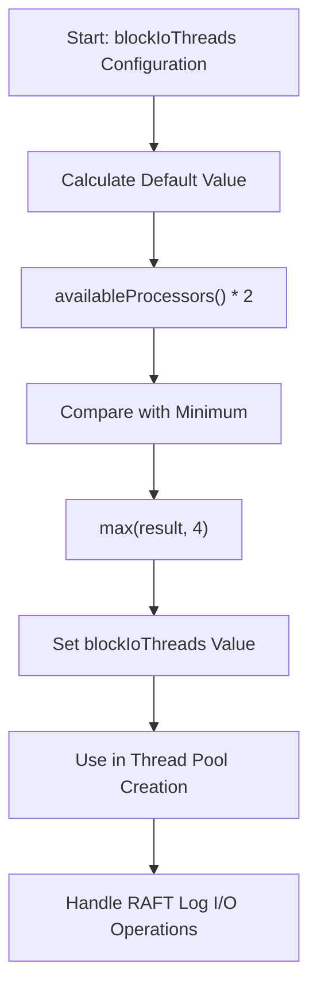
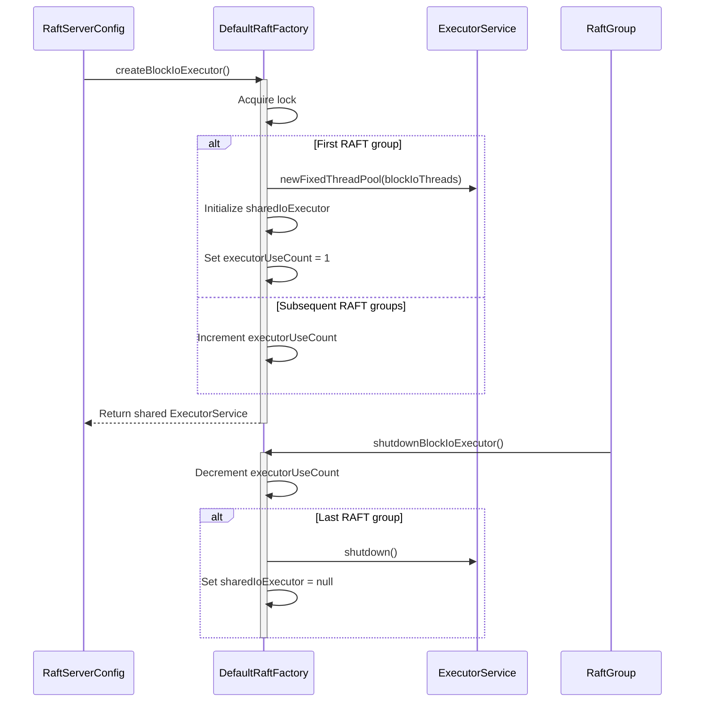
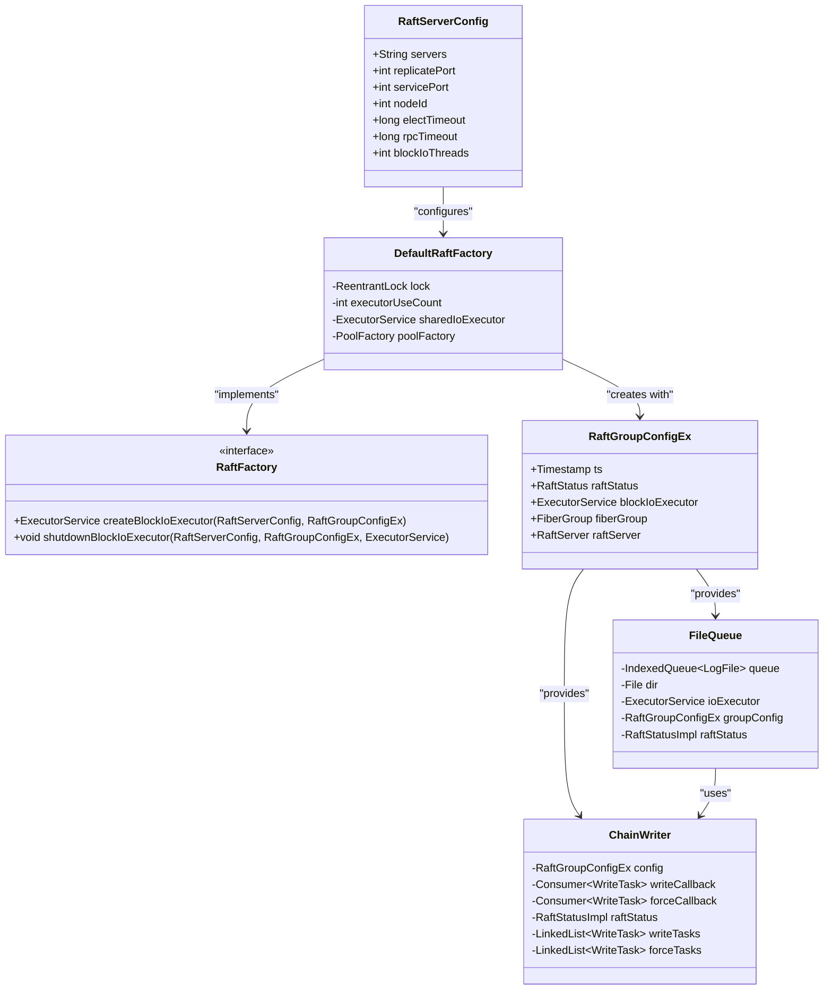
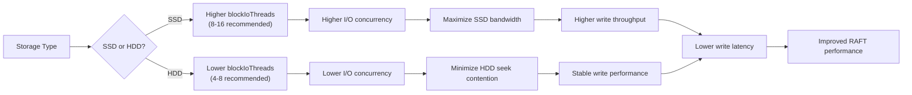
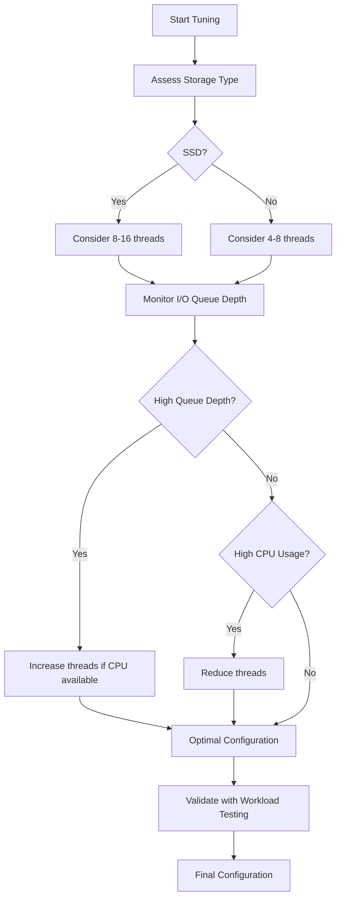
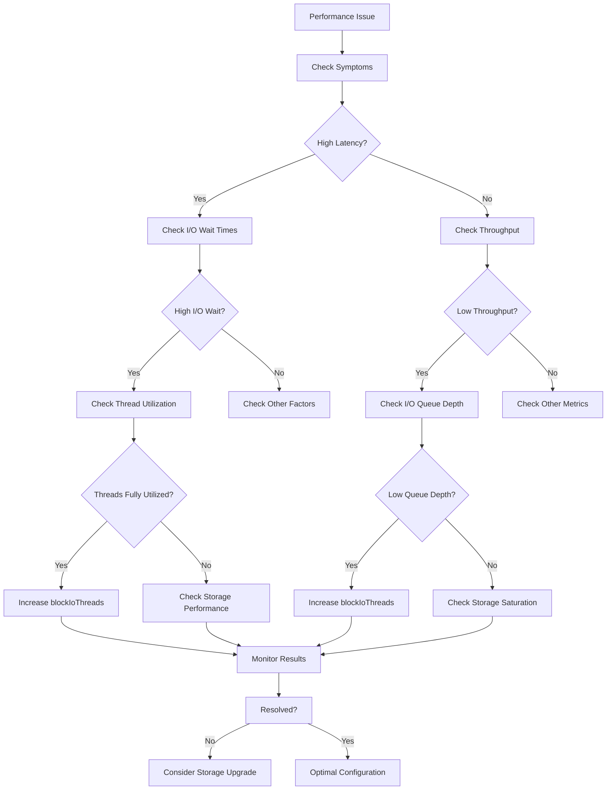

# Block I/O Threads

<cite>
**Referenced Files in This Document**   
- [RaftServerConfig.java](file://server/src/main/java/com/github/dtprj/dongting/raft/server/RaftServerConfig.java)
- [DefaultRaftFactory.java](file://server/src/main/java/com/github/dtprj/dongting/raft/server/DefaultRaftFactory.java)
- [RaftGroupConfigEx.java](file://server/src/main/java/com/github/dtprj/dongting/raft/server/RaftGroupConfigEx.java)
- [FileQueue.java](file://server/src/main/java/com/github/dtprj/dongting/raft/store/FileQueue.java)
- [ChainWriter.java](file://server/src/main/java/com/github/dtprj/dongting/raft/store/ChainWriter.java)
- [DefaultRaftLog.java](file://server/src/main/java/com/github/dtprj/dongting/raft/store/DefaultRaftLog.java)
</cite>

## Table of Contents
1. [Introduction](#introduction)
2. [Configuration Parameter Details](#configuration-parameter-details)
3. [Thread Pool Creation and Management](#thread-pool-creation-and-management)
4. [Integration with RAFT Log Storage Subsystem](#integration-with-raft-log-storage-subsystem)
5. [Performance Impact Analysis](#performance-impact-analysis)
6. [Tuning Guidelines](#tuning-guidelines)
7. [Troubleshooting Common Issues](#troubleshooting-common-issues)
8. [Conclusion](#conclusion)

## Introduction
The `blockIoThreads` configuration parameter in `RaftServerConfig` plays a critical role in the performance and reliability of the RAFT consensus algorithm implementation. This parameter controls the number of dedicated threads assigned to handle blocking I/O operations, specifically for persisting RAFT log entries to disk. Proper configuration of this parameter is essential for achieving optimal write throughput and maintaining low latency in distributed systems that rely on RAFT for consistency.

This document provides a comprehensive analysis of the `blockIoThreads` parameter, including its default calculation, thread pool creation mechanism, integration with the RAFT log storage subsystem, and practical guidance for tuning based on system characteristics and workload patterns.

**Section sources**
- [RaftServerConfig.java](file://server/src/main/java/com/github/dtprj/dongting/raft/server/RaftServerConfig.java#L37)

## Configuration Parameter Details
The `blockIoThreads` parameter is defined as a public integer field in the `RaftServerConfig` class, which configures the server-wide settings for a RAFT node. This parameter determines the size of the thread pool dedicated to handling blocking disk I/O operations required for RAFT log persistence.

The default value is calculated using the formula: `Math.max(Runtime.getRuntime().availableProcessors() * 2, 4)`. This calculation ensures that the thread pool size scales with the available CPU resources while maintaining a minimum of 4 threads to provide adequate concurrency even on systems with fewer cores. The rationale behind multiplying the number of CPU cores by 2 is to account for the fact that I/O threads spend significant time waiting for disk operations to complete, allowing additional threads to make progress during these wait periods.

The parameter directly influences the system's ability to handle concurrent write operations to the RAFT log, affecting both throughput and latency characteristics. A properly sized thread pool helps prevent I/O bottlenecks that could otherwise degrade consensus performance and increase leader election timeouts.

**Diagram sources**
- [RaftServerConfig.java](file://server/src/main/java/com/github/dtprj/dongting/raft/server/RaftServerConfig.java#L37)

**Section sources**
- [RaftServerConfig.java](file://server/src/main/java/com/github/dtprj/dongting/raft/server/RaftServerConfig.java#L37)

## Thread Pool Creation and Management
The thread pool for blocking I/O operations is created through the `RaftFactory` interface, specifically implemented by the `DefaultRaftFactory` class. The creation process is centralized and managed to ensure efficient resource utilization across multiple RAFT groups within the same server instance.

The `createBlockIoExecutor` method in `DefaultRaftFactory` implements a shared thread pool pattern. When the first RAFT group is initialized, the method creates a fixed-size thread pool using `Executors.newFixedThreadPool()` with the size determined by the `blockIoThreads` configuration parameter. Subsequent RAFT groups reuse the same thread pool, incrementing a reference count to track usage. This approach prevents resource exhaustion that could occur if each RAFT group created its own dedicated I/O thread pool.

Thread naming follows the pattern "raft-io-N" where N is a sequentially assigned number, facilitating monitoring and debugging. The thread pool creation is protected by a `ReentrantLock` to ensure thread safety during initialization. When RAFT groups are shut down, the `shutdownBlockIoExecutor` method decrements the reference count and only shuts down the thread pool when the count reaches zero, ensuring that active RAFT groups continue to have access to I/O threads.

**Diagram sources**
- [DefaultRaftFactory.java](file://server/src/main/java/com/github/dtprj/dongting/raft/server/DefaultRaftFactory.java#L58-L87)

**Section sources**
- [DefaultRaftFactory.java](file://server/src/main/java/com/github/dtprj/dongting/raft/server/DefaultRaftFactory.java#L58-L87)

## Integration with RAFT Log Storage Subsystem
The blocking I/O thread pool is deeply integrated with the RAFT log storage subsystem, specifically through the `FileQueue` class hierarchy and the `ChainWriter` component. When a RAFT group is initialized, the `RaftGroupConfigEx` object is populated with the shared I/O executor, which is then passed down to storage components responsible for disk operations.

The `FileQueue` base class, which serves as the foundation for both log and index file management, accepts the `blockIoExecutor` as a constructor parameter and stores it in the `ioExecutor` field. This executor is used by derived classes like `LogFileQueue` and `IdxFileQueue` to offload blocking write and force (fsync) operations to the dedicated thread pool, preventing these operations from blocking the main RAFT processing fibers.

The `ChainWriter` class acts as the primary interface between the RAFT log append operations and the underlying file I/O system. It uses the configured I/O executor to submit write tasks that perform the actual disk operations. This separation allows the RAFT consensus algorithm to continue processing other operations while log persistence occurs asynchronously on the dedicated I/O threads.

**Diagram sources**
- [RaftGroupConfigEx.java](file://server/src/main/java/com/github/dtprj/dongting/raft/server/RaftGroupConfigEx.java#L30)
- [FileQueue.java](file://server/src/main/java/com/github/dtprj/dongting/raft/store/FileQueue.java#L57)
- [ChainWriter.java](file://server/src/main/java/com/github/dtprj/dongting/raft/store/ChainWriter.java#L45)

**Section sources**
- [RaftGroupConfigEx.java](file://server/src/main/java/com/github/dtprj/dongting/raft/server/RaftGroupConfigEx.java#L30)
- [FileQueue.java](file://server/src/main/java/com/github/dtprj/dongting/raft/store/FileQueue.java#L57)
- [ChainWriter.java](file://server/src/main/java/com/github/dtprj/dongting/raft/store/ChainWriter.java#L45)

## Performance Impact Analysis
The `blockIoThreads` parameter has a significant impact on both write throughput and latency in the RAFT consensus algorithm. The relationship between thread count and performance follows a typical pattern where increasing the number of threads improves throughput up to a point, after which additional threads may provide diminishing returns or even degrade performance due to context switching overhead.

On systems with high-performance storage such as SSDs, a larger number of I/O threads can effectively saturate the storage bandwidth, maximizing write throughput. SSDs can handle multiple concurrent I/O operations efficiently, making additional threads beneficial for overlapping I/O operations and maintaining high queue depths. In contrast, on HDD-based systems, the benefits of additional threads are more limited due to the mechanical nature of disk seeks, and too many threads may actually increase seek contention and reduce overall throughput.

The parameter also affects latency characteristics. With insufficient I/O threads, write operations may experience queuing delays as they wait for an available thread, increasing end-to-end latency. However, with an excessive number of threads, the overhead of thread scheduling and potential resource contention can also increase latency. The default calculation of `max(cores * 2, 4)` strikes a balance that generally works well across different hardware configurations, providing enough concurrency to hide I/O latency without creating excessive overhead.

The interaction between the I/O thread pool and the underlying storage subsystem is critical. Modern storage systems with deep command queues benefit from multiple concurrent operations, while traditional storage may perform better with fewer, larger operations. The `blockIoThreads` parameter allows tuning this concurrency level to match the characteristics of the underlying storage.

**Diagram sources**
- [RaftServerConfig.java](file://server/src/main/java/com/github/dtprj/dongting/raft/server/RaftServerConfig.java#L37)
- [DefaultRaftFactory.java](file://server/src/main/java/com/github/dtprj/dongting/raft/server/DefaultRaftFactory.java#L64)

**Section sources**
- [RaftServerConfig.java](file://server/src/main/java/com/github/dtprj/dongting/raft/server/RaftServerConfig.java#L37)
- [DefaultRaftFactory.java](file://server/src/main/java/com/github/dtprj/dongting/raft/server/DefaultRaftFactory.java#L64)

## Tuning Guidelines
Optimal configuration of the `blockIoThreads` parameter depends on several factors including storage performance characteristics, write load patterns, and available system resources. The following guidelines provide recommendations for tuning this parameter in different scenarios:

For **SSD storage**, which can handle high I/O concurrency, consider increasing the thread count beyond the default calculation. A value of 8-16 threads is often appropriate for high-performance NVMe SSDs, allowing the system to fully utilize the storage bandwidth. Monitor I/O queue depths and adjust the thread count to maintain optimal queue utilization without excessive context switching.

For **HDD storage**, where seek operations are expensive, a more conservative approach is recommended. The default value is often sufficient, but in some cases reducing the thread count to 4-8 may improve performance by reducing seek contention. Sequential write patterns benefit less from high thread counts compared to random I/O patterns.

Under **high write loads** with frequent small operations, increasing the thread count can improve throughput by allowing more operations to be processed concurrently. However, ensure that the system has sufficient CPU resources to handle the additional threads, as each thread consumes memory and CPU for context switching.

When **multiple RAFT groups** are running on the same server, the shared nature of the I/O thread pool means that the total thread count serves all groups. In this scenario, the thread count should be based on the aggregate I/O requirements of all groups rather than individual group needs.

System resource constraints should also be considered. Each thread consumes memory for its stack and adds overhead for context switching. On memory-constrained systems, reducing the thread count may be necessary to prevent excessive memory usage.

Performance optimization tips:
- Monitor I/O wait times and thread utilization to identify bottlenecks
- Use storage-specific benchmarks to determine optimal concurrency levels
- Consider the write pattern (sequential vs. random) when selecting thread count
- Balance I/O thread count with CPU core count to avoid oversubscription
- Test different configurations under realistic workloads

**Diagram sources**
- [RaftServerConfig.java](file://server/src/main/java/com/github/dtprj/dongting/raft/server/RaftServerConfig.java#L37)
- [DefaultRaftFactory.java](file://server/src/main/java/com/github/dtprj/dongting/raft/server/DefaultRaftFactory.java#L64)

**Section sources**
- [RaftServerConfig.java](file://server/src/main/java/com/github/dtprj/dongting/raft/server/RaftServerConfig.java#L37)
- [DefaultRaftFactory.java](file://server/src/main/java/com/github/dtprj/dongting/raft/server/DefaultRaftFactory.java#L64)

## Troubleshooting Common Issues
Several common issues can arise from improper configuration of the `blockIoThreads` parameter, including I/O bottlenecks, thread starvation, and disk contention. Understanding these issues and their symptoms is essential for effective troubleshooting and system optimization.

**I/O Bottlenecks** occur when the number of I/O threads is insufficient to handle the write load, causing operations to queue and increasing latency. Symptoms include high I/O wait times in system monitoring, increased RAFT log append latency, and potential timeouts in consensus operations. To resolve this, monitor the I/O thread utilization and increase the `blockIoThreads` value if threads are consistently busy. However, ensure that the underlying storage can actually benefit from additional concurrency.

**Thread Starvation** happens when I/O threads are blocked for extended periods, preventing other operations from making progress. This can occur if the thread count is too low relative to the I/O load or if individual I/O operations take too long to complete. Symptoms include uneven performance, periodic stalls, and degraded responsiveness. Solutions include increasing the thread count, optimizing I/O operation size, or upgrading to faster storage.

**Disk Contention** occurs when multiple processes or threads compete for disk access, leading to reduced throughput and increased latency. This is particularly problematic when the RAFT log storage shares physical disks with other high-I/O applications. Symptoms include inconsistent I/O performance and higher than expected latency. Mitigation strategies include dedicating separate physical storage for RAFT logs, using storage with better concurrency characteristics, or reducing the I/O thread count to minimize seek contention on HDDs.

Additional troubleshooting steps:
- Monitor system I/O metrics (await, svctm, %util) to identify bottlenecks
- Check thread pool utilization and queue lengths
- Analyze RAFT log append and force latencies
- Verify that fsync operations complete within expected timeframes
- Consider the impact of filesystem and mount options on I/O performance

**Diagram sources**
- [RaftServerConfig.java](file://server/src/main/java/com/github/dtprj/dongting/raft/server/RaftServerConfig.java#L37)
- [DefaultRaftFactory.java](file://server/src/main/java/com/github/dtprj/dongting/raft/server/DefaultRaftFactory.java#L64)
- [FileQueue.java](file://server/src/main/java/com/github/dtprj/dongting/raft/store/FileQueue.java#L57)

**Section sources**
- [RaftServerConfig.java](file://server/src/main/java/com/github/dtprj/dongting/raft/server/RaftServerConfig.java#L37)
- [DefaultRaftFactory.java](file://server/src/main/java/com/github/dtprj/dongting/raft/server/DefaultRaftFactory.java#L64)
- [FileQueue.java](file://server/src/main/java/com/github/dtprj/dongting/raft/store/FileQueue.java#L57)

## Conclusion
The `blockIoThreads` configuration parameter in `RaftServerConfig` is a critical tuning knob for optimizing the performance and reliability of RAFT-based distributed systems. By controlling the number of threads dedicated to blocking I/O operations for RAFT log persistence, this parameter directly influences write throughput, latency, and overall system responsiveness.

The default calculation of `max(cores * 2, 4)` provides a reasonable starting point that balances concurrency needs with resource constraints. However, optimal configuration requires consideration of specific system characteristics, including storage type (SSD vs. HDD), write load patterns, and available system resources. The shared thread pool implementation through `RaftFactory` ensures efficient resource utilization across multiple RAFT groups while preventing resource exhaustion.

Proper tuning of this parameter can significantly improve system performance, while misconfiguration can lead to I/O bottlenecks, thread starvation, and disk contention issues. Monitoring system metrics and understanding the interaction between the I/O thread pool and the underlying storage subsystem are essential for effective troubleshooting and optimization.

When adjusting this parameter, it is recommended to make incremental changes and validate the impact under realistic workloads, ensuring that the configuration supports the desired performance characteristics while maintaining system stability.

**Section sources**
- [RaftServerConfig.java](file://server/src/main/java/com/github/dtprj/dongting/raft/server/RaftServerConfig.java#L37)
- [DefaultRaftFactory.java](file://server/src/main/java/com/github/dtprj/dongting/raft/server/DefaultRaftFactory.java#L58-L87)