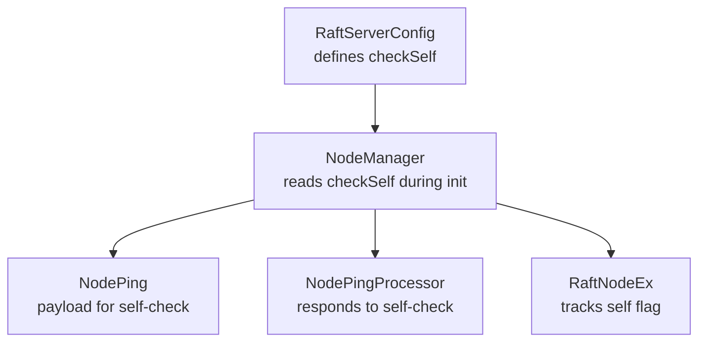
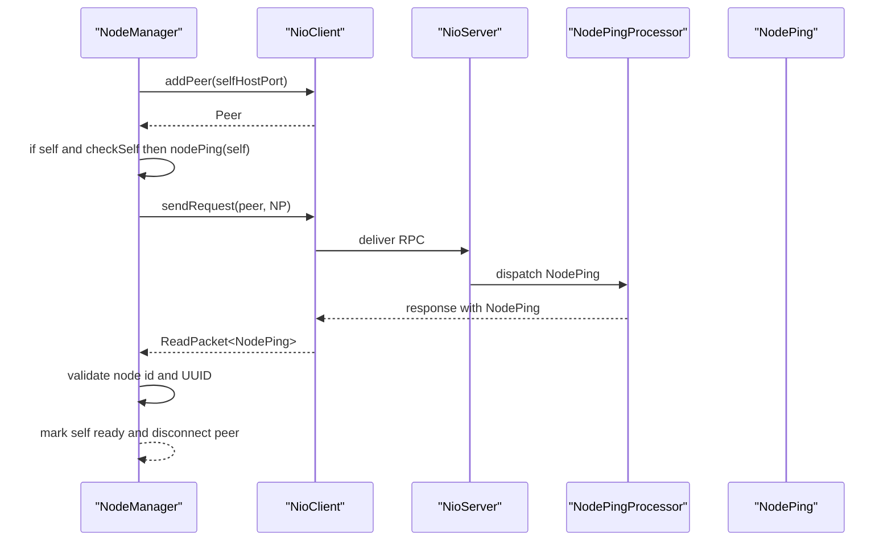
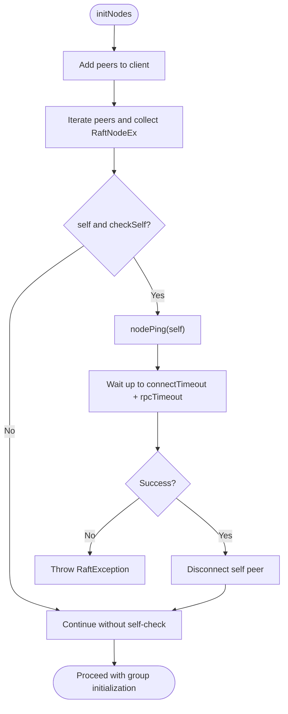
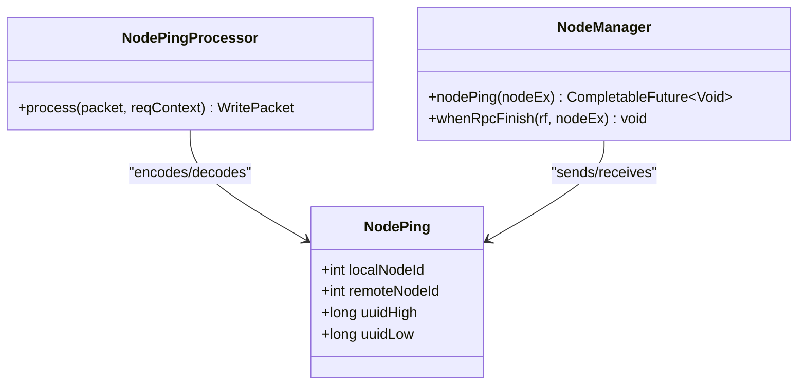
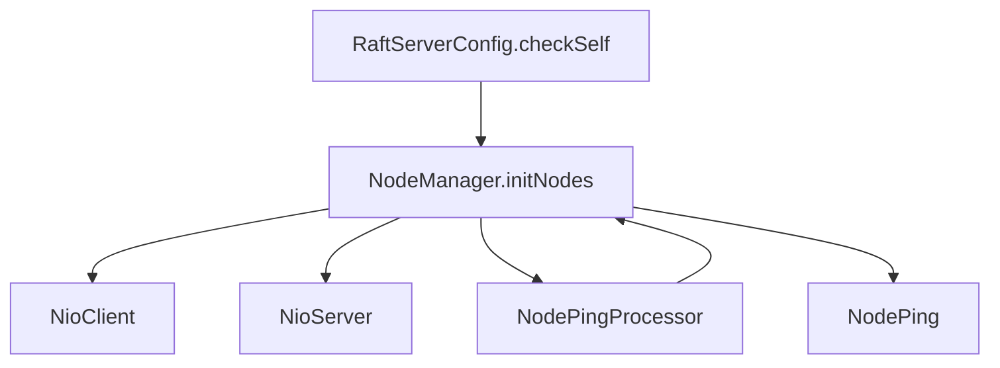

# Check Self Configuration

<cite>
**Referenced Files in This Document**
- [RaftServerConfig.java](file://server/src/main/java/com/github/dtprj/dongting/raft/server/RaftServerConfig.java)
- [NodeManager.java](file://server/src/main/java/com/github/dtprj/dongting/raft/impl/NodeManager.java)
- [NodePing.java](file://server/src/main/java/com/github/dtprj/dongting/raft/rpc/NodePing.java)
- [NodePingProcessor.java](file://server/src/main/java/com/github/dtprj/dongting/raft/rpc/NodePingProcessor.java)
- [RaftNodeEx.java](file://server/src/main/java/com/github/dtprj/dongting/raft/impl/RaftNodeEx.java)
- [NodeManagerTest.java](file://server/src/test/java/com/github/dtprj/dongting/raft/impl/NodeManagerTest.java)
- [服务器配置.md](file://.qoder/repowiki/zh/content/安装与配置/服务器配置.md)
</cite>

## Table of Contents
1. [Introduction](#introduction)
2. [Project Structure](#project-structure)
3. [Core Components](#core-components)
4. [Architecture Overview](#architecture-overview)
5. [Detailed Component Analysis](#detailed-component-analysis)
6. [Dependency Analysis](#dependency-analysis)
7. [Performance Considerations](#performance-considerations)
8. [Troubleshooting Guide](#troubleshooting-guide)
9. [Conclusion](#conclusion)

## Introduction
This document explains the checkSelf configuration parameter in RaftServerConfig and its role in enabling or disabling self-connectivity checks during cluster initialization. When enabled (default), the node verifies it can connect to itself through the network stack, which helps detect configuration issues early. We describe how this setting affects NodeManager’s initialization process, why it matters in complex networking environments, and provide use cases for disabling it (such as certain containerized environments). We also include troubleshooting guidance for connectivity issues that may be revealed by this check and examples of configuration scenarios where this setting is particularly relevant.

## Project Structure
The checkSelf feature spans several core classes:
- RaftServerConfig defines the configuration surface, including checkSelf.
- NodeManager orchestrates initialization and performs the self-connectivity verification.
- NodePing and NodePingProcessor define the protocol and handler for the self-check RPC.
- RaftNodeEx represents a node entry with a self flag used during initialization.

**Diagram sources**
- [RaftServerConfig.java](file://server/src/main/java/com/github/dtprj/dongting/raft/server/RaftServerConfig.java#L21-L38)
- [NodeManager.java](file://server/src/main/java/com/github/dtprj/dongting/raft/impl/NodeManager.java#L127-L170)
- [NodePing.java](file://server/src/main/java/com/github/dtprj/dongting/raft/rpc/NodePing.java#L24-L83)
- [NodePingProcessor.java](file://server/src/main/java/com/github/dtprj/dongting/raft/rpc/NodePingProcessor.java#L26-L54)
- [RaftNodeEx.java](file://server/src/main/java/com/github/dtprj/dongting/raft/impl/RaftNodeEx.java#L21-L36)

**Section sources**
- [RaftServerConfig.java](file://server/src/main/java/com/github/dtprj/dongting/raft/server/RaftServerConfig.java#L21-L38)
- [NodeManager.java](file://server/src/main/java/com/github/dtprj/dongting/raft/impl/NodeManager.java#L127-L170)
- [NodePing.java](file://server/src/main/java/com/github/dtprj/dongting/raft/rpc/NodePing.java#L24-L83)
- [NodePingProcessor.java](file://server/src/main/java/com/github/dtprj/dongting/raft/rpc/NodePingProcessor.java#L26-L54)
- [RaftNodeEx.java](file://server/src/main/java/com/github/dtprj/dongting/raft/impl/RaftNodeEx.java#L21-L36)

## Core Components
- RaftServerConfig.checkSelf: A boolean flag controlling whether the node performs a self-connectivity check during initialization. Default is enabled.
- NodeManager.initNodes: Iterates peers, registers them with the client, and conditionally triggers a self-check if checkSelf is true.
- NodePing and NodePingProcessor: The protocol and handler used to verify connectivity and correctness of self identity and UUID.
- RaftNodeEx.self: A marker indicating the local node among registered peers.

Key behaviors:
- If checkSelf is true and the local node is present in the configured servers list, NodeManager sends a NodePing RPC to itself and waits up to connectTimeout + rpcTimeout for completion.
- On success, NodeManager disconnects the self peer and proceeds; on failure, it throws a RaftException wrapping the underlying cause.

**Section sources**
- [RaftServerConfig.java](file://server/src/main/java/com/github/dtprj/dongting/raft/server/RaftServerConfig.java#L21-L38)
- [NodeManager.java](file://server/src/main/java/com/github/dtprj/dongting/raft/impl/NodeManager.java#L127-L170)
- [NodePing.java](file://server/src/main/java/com/github/dtprj/dongting/raft/rpc/NodePing.java#L24-L83)
- [NodePingProcessor.java](file://server/src/main/java/com/github/dtprj/dongting/raft/rpc/NodePingProcessor.java#L26-L54)
- [RaftNodeEx.java](file://server/src/main/java/com/github/dtprj/dongting/raft/impl/RaftNodeEx.java#L21-L36)

## Architecture Overview
The self-connectivity check is part of NodeManager’s initialization pipeline. It ensures that the node can establish a successful RPC to itself using the configured ports and network stack before proceeding with group initialization.

**Diagram sources**
- [NodeManager.java](file://server/src/main/java/com/github/dtprj/dongting/raft/impl/NodeManager.java#L127-L170)
- [NodePing.java](file://server/src/main/java/com/github/dtprj/dongting/raft/rpc/NodePing.java#L24-L83)
- [NodePingProcessor.java](file://server/src/main/java/com/github/dtprj/dongting/raft/rpc/NodePingProcessor.java#L26-L54)

## Detailed Component Analysis

### RaftServerConfig.checkSelf
- Purpose: Enable or disable the self-connectivity check performed by NodeManager during initialization.
- Default: Enabled.
- Effect: When true, NodeManager performs a NodePing RPC to itself and enforces strict validation of node identity and UUID.

Operational impact:
- Initialization cost increases slightly due to an extra RPC and validation.
- Early detection of misconfiguration (wrong port, wrong host, firewall issues).

**Section sources**
- [RaftServerConfig.java](file://server/src/main/java/com/github/dtprj/dongting/raft/server/RaftServerConfig.java#L21-L38)

### NodeManager Initialization and Self-Check
- During initNodes, NodeManager:
  - Registers all peers with NioClient.
  - Collects RaftNodeEx entries and tracks the self node when checkSelf is true.
  - Sends a NodePing RPC to the self node and waits up to connectTimeout + rpcTimeout.
  - Throws a RaftException on failure; otherwise disconnects the self peer and continues.

Validation performed:
- Node ID must match the expected self node ID.
- UUID must match the NodeManager’s generated UUID for self; mismatch indicates incorrect configuration.

**Diagram sources**
- [NodeManager.java](file://server/src/main/java/com/github/dtprj/dongting/raft/impl/NodeManager.java#L127-L170)

**Section sources**
- [NodeManager.java](file://server/src/main/java/com/github/dtprj/dongting/raft/impl/NodeManager.java#L127-L170)

### NodePing Protocol and Validation
- NodePing carries:
  - localNodeId: the target node ID.
  - remoteNodeId: the sender node ID.
  - uuidHigh/uuidLow: a UUID split into two 64-bit parts.
- NodePingProcessor validates the request and responds with a NodePing containing the local node’s UUID.
- NodeManager validates:
  - Node ID equality.
  - UUID correctness for self vs non-self.

**Diagram sources**
- [NodePing.java](file://server/src/main/java/com/github/dtprj/dongting/raft/rpc/NodePing.java#L24-L83)
- [NodePingProcessor.java](file://server/src/main/java/com/github/dtprj/dongting/raft/rpc/NodePingProcessor.java#L26-L54)
- [NodeManager.java](file://server/src/main/java/com/github/dtprj/dongting/raft/impl/NodeManager.java#L189-L228)

**Section sources**
- [NodePing.java](file://server/src/main/java/com/github/dtprj/dongting/raft/rpc/NodePing.java#L24-L83)
- [NodePingProcessor.java](file://server/src/main/java/com/github/dtprj/dongting/raft/rpc/NodePingProcessor.java#L26-L54)
- [NodeManager.java](file://server/src/main/java/com/github/dtprj/dongting/raft/impl/NodeManager.java#L189-L228)

### RaftNodeEx and Self Flag
- RaftNodeEx extends RaftNode and adds:
  - self: indicates whether this is the local node.
  - pinging: indicates ongoing ping operation.
  - status: NodeStatus tracking readiness.
- NodeManager uses self to decide whether to perform the self-check and to manage the self peer lifecycle.

**Section sources**
- [RaftNodeEx.java](file://server/src/main/java/com/github/dtprj/dongting/raft/impl/RaftNodeEx.java#L21-L36)
- [NodeManager.java](file://server/src/main/java/com/github/dtprj/dongting/raft/impl/NodeManager.java#L127-L170)

## Dependency Analysis
- RaftServerConfig.checkSelf is consumed by NodeManager.initNodes to gate the self-check.
- NodeManager depends on NioClient for peer registration and RPC sending, and on NioServer for the business executor.
- NodePingProcessor depends on NodeManager to handle the response path and on RaftServerConfig for port validation.

**Diagram sources**
- [RaftServerConfig.java](file://server/src/main/java/com/github/dtprj/dongting/raft/server/RaftServerConfig.java#L21-L38)
- [NodeManager.java](file://server/src/main/java/com/github/dtprj/dongting/raft/impl/NodeManager.java#L127-L170)
- [NodePingProcessor.java](file://server/src/main/java/com/github/dtprj/dongting/raft/rpc/NodePingProcessor.java#L26-L54)
- [NodePing.java](file://server/src/main/java/com/github/dtprj/dongting/raft/rpc/NodePing.java#L24-L83)

**Section sources**
- [RaftServerConfig.java](file://server/src/main/java/com/github/dtprj/dongting/raft/server/RaftServerConfig.java#L21-L38)
- [NodeManager.java](file://server/src/main/java/com/github/dtprj/dongting/raft/impl/NodeManager.java#L127-L170)
- [NodePingProcessor.java](file://server/src/main/java/com/github/dtprj/dongting/raft/rpc/NodePingProcessor.java#L26-L54)
- [NodePing.java](file://server/src/main/java/com/github/dtprj/dongting/raft/rpc/NodePing.java#L24-L83)

## Performance Considerations
- Enabling checkSelf introduces an extra RPC and validation during startup. This is typically negligible compared to the benefits of catching misconfiguration early.
- The total wait time for the self-check is bounded by connectTimeout + rpcTimeout, so tune these parameters according to network conditions to balance safety and startup latency.
- In high-latency or unreliable networks, increasing connectTimeout and rpcTimeout reduces false positives but may delay startup.

[No sources needed since this section provides general guidance]

## Troubleshooting Guide
Common symptoms and causes:
- Initialization fails immediately with a RaftException shortly after startup:
  - Likely a self-connectivity issue (wrong port, wrong host, firewall, or routing problem).
  - Verify that replicatePort/servicePort is reachable locally and that the configured nodeId appears in the servers list.
- Frequent timeouts during self-check:
  - Network latency or resource contention; increase connectTimeout and/or rpcTimeout.
  - Check for excessive load on the NioServer or NioClient threads.
- Unexpected leader flapping or frequent elections:
  - While not directly caused by checkSelf, misconfiguration detected by checkSelf can mask deeper issues. Ensure all nodes agree on servers and ports.

Steps to diagnose:
- Temporarily disable checkSelf to confirm whether the failure is self-connectivity-related; re-enable it in production.
- Verify that the local endpoint resolves correctly and that the port is open.
- Confirm that NodePingProcessor is registered on the server and that the command is supported.
- Review logs around the self-check window for explicit validation failures (node ID mismatch or UUID mismatch).

Use cases for disabling checkSelf:
- Containerized environments where localhost routing differs from external endpoints, and the self-check would otherwise fail despite correct configuration.
- Single-node deployments where the self-check is redundant.
- Testing or CI environments where strict self-connectivity is not required for basic validation.

**Section sources**
- [NodeManager.java](file://server/src/main/java/com/github/dtprj/dongting/raft/impl/NodeManager.java#L127-L170)
- [NodePingProcessor.java](file://server/src/main/java/com/github/dtprj/dongting/raft/rpc/NodePingProcessor.java#L26-L54)
- [NodeManagerTest.java](file://server/src/test/java/com/github/dtprj/dongting/raft/impl/NodeManagerTest.java#L42-L161)

## Conclusion
The checkSelf configuration parameter in RaftServerConfig provides a valuable safety mechanism during cluster initialization by verifying that the node can connect to itself. NodeManager implements this by sending a NodePing RPC to the local endpoint and enforcing strict identity and UUID validation. While enabling checkSelf adds minimal startup overhead, it helps prevent subtle misconfigurations from propagating into operational issues. In complex networking environments, carefully tuning connectTimeout and rpcTimeout, and understanding when to temporarily disable checkSelf, enables reliable deployment across diverse infrastructures.