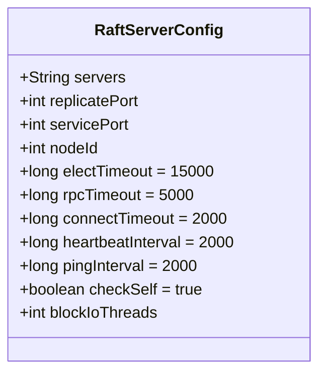
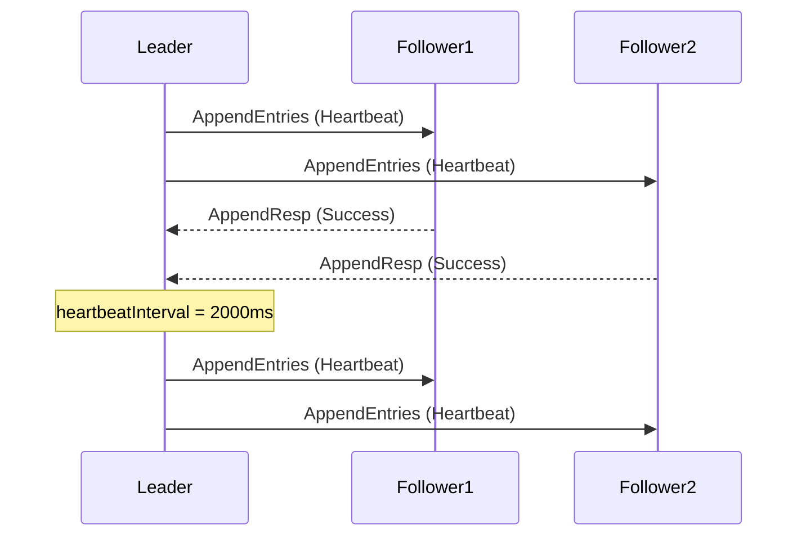
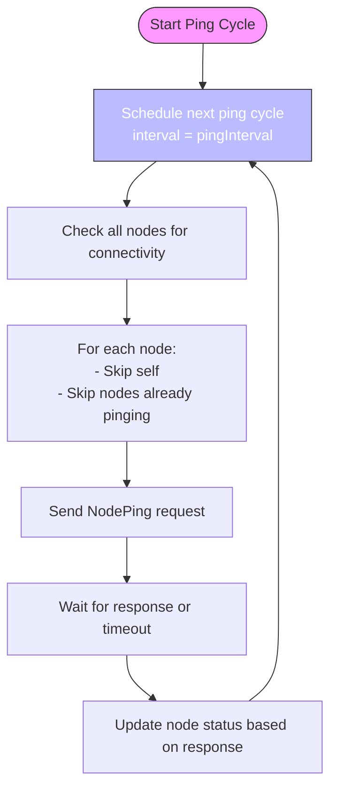
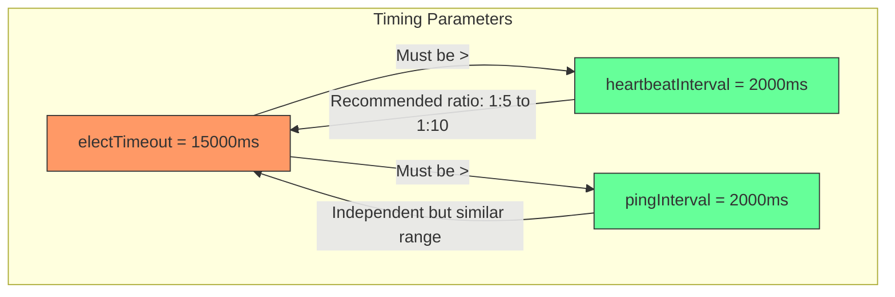
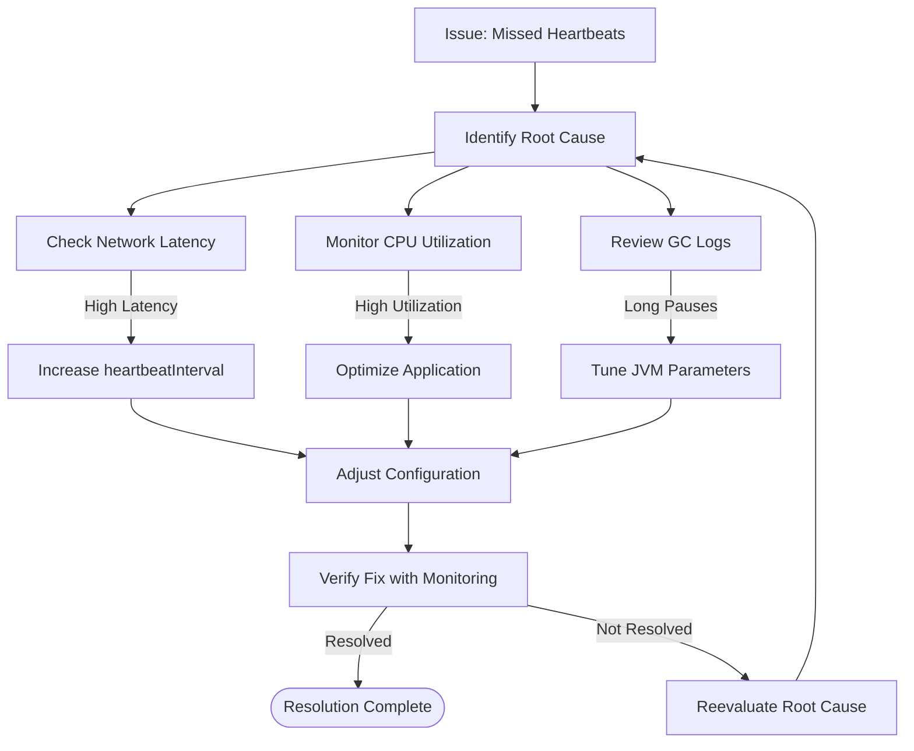

# Heartbeat and Ping Intervals

<cite>
**Referenced Files in This Document**   
- [RaftServerConfig.java](file://server/src/main/java/com/github/dtprj/dongting/raft/server/RaftServerConfig.java)
- [NodeManager.java](file://server/src/main/java/com/github/dtprj/dongting/raft/impl/NodeManager.java)
- [LinearTaskRunner.java](file://server/src/main/java/com/github/dtprj/dongting/raft/impl/LinearTaskRunner.java)
- [ReplicateManager.java](file://server/src/main/java/com/github/dtprj/dongting/raft/impl/ReplicateManager.java)
- [RaftStatusImpl.java](file://server/src/main/java/com/github/dtprj/dongting/raft/impl/RaftStatusImpl.java)
</cite>

## Table of Contents
1. [Introduction](#introduction)
2. [Configuration Parameters](#configuration-parameters)
3. [Heartbeat Interval in Leader Operations](#heartbeat-interval-in-leader-operations)
4. [Ping Interval in Node Health Monitoring](#ping-interval-in-node-health-monitoring)
5. [Impact on Network and Performance](#impact-on-network-and-performance)
6. [Relationship with Election Timeout](#relationship-with-election-timeout)
7. [Tuning Guidelines](#tuning-guidelines)
8. [Troubleshooting](#troubleshooting)
9. [Conclusion](#conclusion)

## Introduction
This document provides a comprehensive analysis of the `heartbeatInterval` and `pingInterval` configuration parameters in the Raft consensus algorithm implementation. These parameters are critical for maintaining cluster stability, ensuring timely failure detection, and balancing network overhead. The analysis is based on the RaftServerConfig class and related components in the codebase, focusing on how these intervals affect leader-follower communication and node health monitoring.

**Section sources**
- [RaftServerConfig.java](file://server/src/main/java/com/github/dtprj/dongting/raft/server/RaftServerConfig.java#L21-L39)

## Configuration Parameters
The `heartbeatInterval` and `pingInterval` are two key configuration parameters defined in the `RaftServerConfig` class. Both parameters have a default value of 2000 milliseconds (2 seconds), which serves as a balanced starting point for most deployment scenarios.

**Diagram sources**
- [RaftServerConfig.java](file://server/src/main/java/com/github/dtprj/dongting/raft/server/RaftServerConfig.java#L21-L39)

**Section sources**
- [RaftServerConfig.java](file://server/src/main/java/com/github/dtprj/dongting/raft/server/RaftServerConfig.java#L21-L39)

## Heartbeat Interval in Leader Operations
The `heartbeatInterval` parameter controls how frequently the leader node sends AppendEntries messages to its followers. This mechanism is essential for maintaining cluster stability and preventing unnecessary leader elections.

When a node becomes the leader, it initiates periodic heartbeat messages to all followers. The frequency of these messages is determined by the `heartbeatInterval` value. In the implementation, this is managed through the `LinearTaskRunner` class, which uses the heartbeat interval as a timeout parameter for collecting tasks from a channel.

**Diagram sources**
- [LinearTaskRunner.java](file://server/src/main/java/com/github/dtprj/dongting/raft/impl/LinearTaskRunner.java#L96-L97)
- [ReplicateManager.java](file://server/src/main/java/com/github/dtprj/dongting/raft/impl/ReplicateManager.java#L380-L415)

**Section sources**
- [LinearTaskRunner.java](file://server/src/main/java/com/github/dtprj/dongting/raft/impl/LinearTaskRunner.java#L96-L97)
- [ReplicateManager.java](file://server/src/main/java/com/github/dtprj/dongting/raft/impl/ReplicateManager.java#L380-L415)

## Ping Interval in Node Health Monitoring
The `pingInterval` parameter governs how frequently nodes check the connectivity and health of their peers in the cluster. This mechanism is implemented through the `NodeManager` class, which schedules periodic ping operations to verify node availability.

The node health monitoring process works as follows:
1. The `NodeManager` initializes with the `pingInterval` value from the server configuration
2. It schedules a recurring task that executes at the specified interval
3. During each execution, it sends ping requests to all non-self nodes that are not currently being pinged
4. The results update the node status and readiness information

**Diagram sources**
- [NodeManager.java](file://server/src/main/java/com/github/dtprj/dongting/raft/impl/NodeManager.java#L83-L119)
- [NodeManager.java](file://server/src/main/java/com/github/dtprj/dongting/raft/impl/NodeManager.java#L172-L188)

**Section sources**
- [NodeManager.java](file://server/src/main/java/com/github/dtprj/dongting/raft/impl/NodeManager.java#L83-L119)

## Impact on Network and Performance
The values of `heartbeatInterval` and `pingInterval` have significant implications for network overhead and failure detection speed. These parameters represent a trade-off between timely cluster responsiveness and network resource utilization.

### Network Overhead vs. Failure Detection
| Parameter | Shorter Interval | Longer Interval |
|---------|----------------|----------------|
| **Network Overhead** | Higher | Lower |
| **Failure Detection Speed** | Faster | Slower |
| **CPU Utilization** | Higher | Lower |
| **Memory Usage** | Slightly Higher | Slightly Lower |

When both intervals are set to their default value of 2000ms, the system achieves a balance between responsiveness and resource efficiency. Shorter intervals (e.g., 500-1000ms) provide faster failure detection but increase network traffic and CPU usage, while longer intervals (e.g., 5000-10000ms) reduce overhead but delay the detection of node failures.

The heartbeat mechanism contributes to network overhead through regular AppendEntries messages, even when there is no actual data to replicate. The ping mechanism adds additional overhead through dedicated health check messages that do not contribute to log replication but are essential for maintaining an accurate view of cluster membership and node status.

**Section sources**
- [RaftServerConfig.java](file://server/src/main/java/com/github/dtprj/dongting/raft/server/RaftServerConfig.java#L31-L33)
- [NodeManager.java](file://server/src/main/java/com/github/dtprj/dongting/raft/impl/NodeManager.java#L83-L119)

## Relationship with Election Timeout
The `heartbeatInterval` parameter has a critical relationship with the `electTimeout` parameter, which determines how long a follower will wait before initiating a leader election. This relationship is fundamental to the stability of the Raft cluster.

The general rule is that the `heartbeatInterval` should be significantly shorter than the `electTimeout` to prevent unnecessary leader elections. In the current implementation, the default `electTimeout` is 15,000ms (15 seconds), while the default `heartbeatInterval` is 2,000ms (2 seconds), creating a ratio of approximately 1:7.5.

**Diagram sources**
- [RaftServerConfig.java](file://server/src/main/java/com/github/dtprj/dongting/raft/server/RaftServerConfig.java#L28-L33)
- [RaftStatusImpl.java](file://server/src/main/java/com/github/dtprj/dongting/raft/impl/RaftStatusImpl.java#L201-L208)

**Section sources**
- [RaftServerConfig.java](file://server/src/main/java/com/github/dtprj/dongting/raft/server/RaftServerConfig.java#L28-L33)

## Tuning Guidelines
Proper tuning of `heartbeatInterval` and `pingInterval` is essential for optimizing cluster performance in different deployment scenarios. The following guidelines provide recommendations for various use cases:

### High-Throughput Systems
For systems with high transaction volumes and low latency requirements:
- **heartbeatInterval**: 500-1000ms
- **pingInterval**: 1000-1500ms
- Rationale: Faster heartbeat intervals ensure quicker propagation of log entries and more responsive leader failover, which is critical for maintaining high availability in high-throughput environments.

### Resource-Constrained Environments
For systems with limited network bandwidth or CPU resources:
- **heartbeatInterval**: 3000-5000ms
- **pingInterval**: 3000-5000ms
- Rationale: Longer intervals reduce network traffic and CPU usage associated with processing heartbeat and ping messages, conserving resources for application workloads.

### Wide-Area Network (WAN) Deployments
For geographically distributed clusters:
- **heartbeatInterval**: 3000-4000ms
- **pingInterval**: 3000-4000ms
- **electTimeout**: 20000-30000ms
- Rationale: Longer intervals accommodate higher network latency and jitter, preventing false positive failure detection due to temporary network delays.

### General Recommendations
1. Maintain a ratio of at least 1:5 between `heartbeatInterval` and `electTimeout`
2. Keep `heartbeatInterval` and `pingInterval` within the same order of magnitude
3. Monitor network utilization and adjust intervals to balance between responsiveness and overhead
4. Consider the application's consistency and availability requirements when tuning these parameters

**Section sources**
- [RaftServerConfig.java](file://server/src/main/java/com/github/dtprj/dongting/raft/server/RaftServerConfig.java#L28-L33)
- [NodeManager.java](file://server/src/main/java/com/github/dtprj/dongting/raft/impl/NodeManager.java#L83-L119)

## Troubleshooting
This section provides guidance for diagnosing and resolving issues related to heartbeat and ping intervals.

### Network Congestion Issues
When experiencing network congestion due to frequent heartbeat and ping messages:

**Symptoms:**
- High network utilization on inter-node communication channels
- Increased latency for client requests
- CPU spikes on nodes during heartbeat cycles

**Solutions:**
1. Increase both `heartbeatInterval` and `pingInterval` values
2. Monitor the impact on failure detection time
3. Consider implementing QoS policies to prioritize critical traffic

### Missed Heartbeats
When followers frequently miss heartbeats, leading to unnecessary leader elections:

**Common Causes:**
- Network latency exceeding the effective heartbeat interval
- High CPU utilization preventing timely processing of AppendEntries messages
- Garbage collection pauses on the leader or follower nodes

**Diagnostic Steps:**
1. Check network latency between nodes using external tools
2. Monitor CPU utilization on all cluster nodes
3. Review garbage collection logs for long pause times
4. Examine the `lastConfirmReqNanos` field in `RaftMember` to identify timing patterns

**Solutions:**
1. Increase `heartbeatInterval` to accommodate network conditions
2. Increase `electTimeout` to provide more tolerance for delayed heartbeats
3. Optimize application performance to reduce CPU contention
4. Tune JVM parameters to minimize garbage collection pauses

**Diagram sources**
- [ReplicateManager.java](file://server/src/main/java/com/github/dtprj/dongting/raft/impl/ReplicateManager.java#L532-L536)
- [RaftMember.java](file://server/src/main/java/com/github/dtprj/dongting/raft/impl/RaftMember.java#L30-L31)

**Section sources**
- [ReplicateManager.java](file://server/src/main/java/com/github/dtprj/dongting/raft/impl/ReplicateManager.java#L532-L536)
- [RaftMember.java](file://server/src/main/java/com/github/dtprj/dongting/raft/impl/RaftMember.java#L30-L31)

## Conclusion
The `heartbeatInterval` and `pingInterval` parameters are crucial for the proper functioning of the Raft consensus algorithm. With default values of 2000ms, these parameters provide a balanced starting point for most deployments, ensuring reasonable failure detection speed while maintaining acceptable network overhead.

The `heartbeatInterval` directly impacts leader-follower communication and cluster stability, while the `pingInterval` governs node health monitoring and membership management. These parameters must be carefully tuned based on the specific requirements of the deployment environment, considering factors such as network conditions, resource constraints, and application performance requirements.

When adjusting these parameters, it's essential to maintain the proper relationship with `electTimeout` and to monitor the impact on both cluster stability and network performance. Proper configuration of these intervals ensures reliable operation of the Raft cluster while optimizing resource utilization.