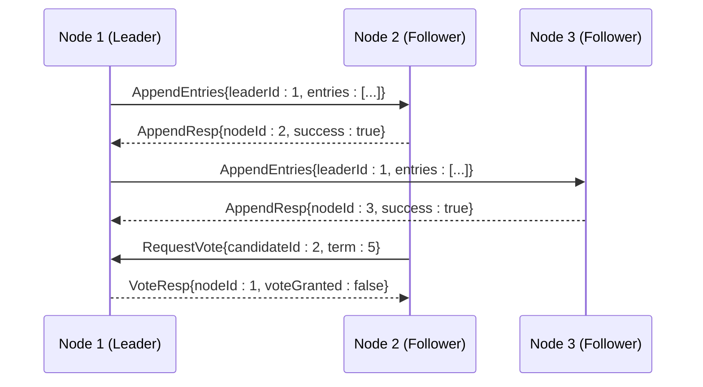
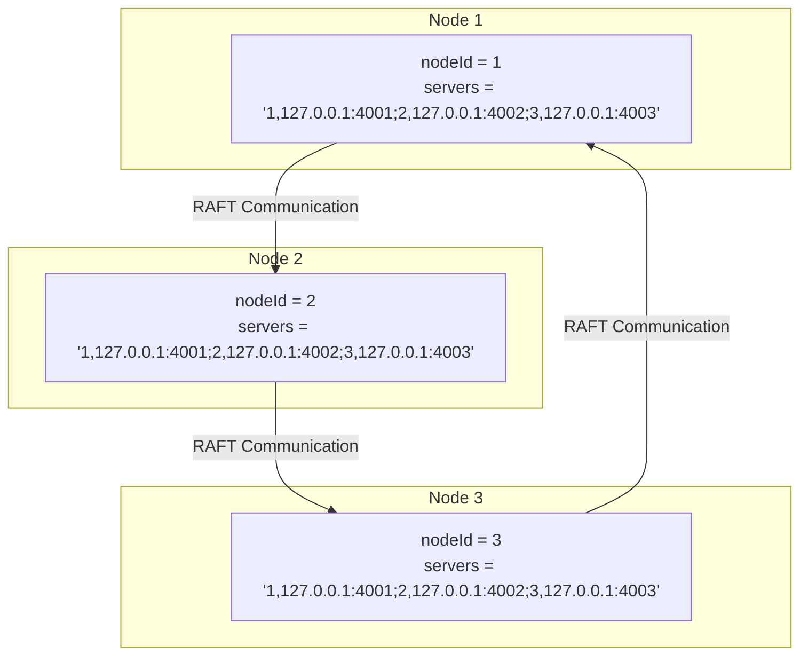

# Node ID Configuration

<cite>
**Referenced Files in This Document**   
- [RaftServerConfig.java](file://server/src/main/java/com/github/dtprj/dongting/raft/server/RaftServerConfig.java)
- [RaftServer.java](file://server/src/main/java/com/github/dtprj/dongting/raft/server/RaftServer.java)
- [DtUtil.java](file://client/src/main/java/com/github/dtprj/dongting/common/DtUtil.java)
- [DemoServer1.java](file://demos/src/main/java/com/github/dtprj/dongting/demos/cluster/DemoServer1.java)
- [DemoServer2.java](file://demos/src/main/java/com/github/dtprj/dongting/demos/cluster/DemoServer2.java)
- [DemoServer3.java](file://demos/src/main/java/com/github/dtprj/dongting/demos/cluster/DemoServer3.java)
</cite>

## Table of Contents
1. [Introduction](#introduction)
2. [Configuration and Validation](#configuration-and-validation)
3. [Role in RAFT Cluster Operations](#role-in-raft-cluster-operations)
4. [Node Membership and Group Management](#node-membership-and-group-management)
5. [Fiber Dispatching and Network Communication](#fiber-dispatching-and-network-communication)
6. [Production Guidelines](#production-guidelines)
7. [Troubleshooting](#troubleshooting)
8. [Code Examples](#code-examples)

## Introduction
The `nodeId` parameter in `RaftServerConfig` serves as the unique identifier for a node within a RAFT consensus cluster. This identifier is fundamental to the distributed system's operation, enabling proper coordination between nodes for leader election, log replication, and message routing. The nodeId establishes the node's identity in the cluster topology and is used across various subsystems including fiber scheduling, network communication, and membership management. Proper configuration of this parameter is critical for cluster stability and correct operation.

## Configuration and Validation
The `nodeId` parameter in `RaftServerConfig` must be a positive integer and must be present in the `servers` list configuration. During initialization, the system validates these requirements through multiple checks. First, `DtUtil.checkPositive()` ensures the nodeId is greater than zero. Second, the system parses the `servers` string (format: "id,host:port;id,host:port") and verifies that the local nodeId exists in this list. If either validation fails, an `IllegalArgumentException` is thrown, preventing the server from starting. This dual validation ensures that each node has a valid, unique identifier that is recognized by all cluster members.

**Section sources**
- [RaftServerConfig.java](file://server/src/main/java/com/github/dtprj/dongting/raft/server/RaftServerConfig.java#L27)
- [RaftServer.java](file://server/src/main/java/com/github/dtprj/dongting/raft/server/RaftServer.java#L123-L139)
- [DtUtil.java](file://client/src/main/java/com/github/dtprj/dongting/common/DtUtil.java#L100-L105)

## Role in RAFT Cluster Operations
The nodeId plays a critical role in core RAFT algorithm operations. During leader election, nodes use their nodeId to identify themselves in vote requests and responses. In log replication, the leader uses nodeIds to track which followers have committed which log entries. For message routing, all inter-node communication packets include source and destination nodeIds to ensure proper delivery. The nodeId is also used in heartbeat and ping mechanisms to monitor node health and connectivity. Without a properly configured nodeId, a node cannot participate in consensus decisions, cannot replicate logs, and cannot communicate effectively with other cluster members.

**Diagram sources**
- [RaftServer.java](file://server/src/main/java/com/github/dtprj/dongting/raft/server/RaftServer.java#L165-L168)
- [RaftServer.java](file://server/src/main/java/com/github/dtprj/dongting/raft/server/RaftServer.java#L168)

## Node Membership and Group Management
The nodeId determines a node's membership in RAFT groups by checking if it appears in the `nodeIdOfMembers` or `nodeIdOfObservers` lists for each group configuration. During `createRaftGroup()`, the system evaluates whether the local nodeId is present in either the members or observers list for the group. If the nodeId is not found in either list, a warning is logged indicating the node is not part of that group. The `NodeManager` class maintains mappings between nodeIds and their corresponding `RaftNodeEx` instances, enabling efficient lookups during cluster operations. This membership system allows for flexible cluster topologies where nodes can participate in multiple groups with different roles.

**Section sources**
- [RaftServer.java](file://server/src/main/java/com/github/dtprj/dongting/raft/server/RaftServer.java#L245-L249)
- [RaftServer.java](file://server/src/main/java/com/github/dtprj/dongting/raft/server/RaftServer.java#L228-L235)
- [NodeManager.java](file://server/src/main/java/com/github/dtprj/dongting/raft/impl/NodeManager.java#L323-L332)

## Fiber Dispatching and Network Communication
The nodeId directly influences fiber dispatching and network communication patterns within the system. Each RAFT group creates a fiber group named "group-{groupId}" that uses the dispatcher associated with the node's configuration. The nodeId is used to differentiate network endpoints and message routing paths. In the NIO server configuration, the nodeId is incorporated into thread names (e.g., "RaftRepServer{nodeId}") for easier debugging and monitoring. When processing requests, the system uses the nodeId to determine which fiber group should handle the operation, ensuring proper isolation between different RAFT groups while maintaining efficient resource utilization across the cluster.

**Section sources**
- [RaftServer.java](file://server/src/main/java/com/github/dtprj/dongting/raft/server/RaftServer.java#L252)
- [RaftServer.java](file://server/src/main/java/com/github/dtprj/dongting/raft/server/RaftServer.java#L142-L143)
- [RaftServer.java](file://server/src/main/java/com/github/dtprj/dongting/raft/server/RaftServer.java#L154)

## Production Guidelines
When selecting nodeIds for production environments, use stable, persistent identifiers that won't change across restarts. Integer values starting from 1 are recommended, with sequential numbering for ease of management. Avoid using dynamic values like IP addresses or hostnames converted to numbers, as these can change and disrupt cluster stability. Ensure all nodeIds in a cluster are unique and plan for future expansion by reserving ranges of IDs. Document the nodeId assignment scheme and maintain a registry of which nodeId corresponds to which physical or virtual machine. When deploying multi-datacenter clusters, consider using numbering schemes that indicate geographic location to simplify operations and troubleshooting.

## Troubleshooting
Common issues with nodeId configuration include: nodeId not present in the servers list, duplicate nodeIds across the cluster, or nodeId set to zero/negative values. These errors prevent the server from starting and are logged with descriptive messages. If a node fails to join the cluster, verify that its nodeId appears in the `servers` configuration string of all other nodes. Check that the nodeId is consistent across restarts, as changing it will cause the node to be treated as a completely different entity. Use the `QueryStatusProcessor` to examine cluster membership and confirm that the local nodeId is recognized by other members. Monitor logs for warnings about nodes not being members or observers of expected groups, which may indicate configuration mismatches.

**Section sources**
- [RaftServer.java](file://server/src/main/java/com/github/dtprj/dongting/raft/server/RaftServer.java#L137-L139)
- [RaftServer.java](file://server/src/main/java/com/github/dtprj/dongting/raft/server/RaftServer.java#L130-L131)
- [RaftServer.java](file://server/src/main/java/com/github/dtprj/dongting/raft/server/RaftServer.java#L247-L249)

## Code Examples
The demo applications demonstrate proper nodeId configuration with three server instances (nodeIds 1, 2, and 3) forming a RAFT cluster. Each server specifies its unique nodeId while sharing the same servers list that includes all three nodes. This pattern ensures each node can communicate with all others and participate in leader election. The configuration shows the servers string format "id,host:port;id,host:port" and how the nodeId is passed to the server startup method. This approach allows for easy scaling by adding new nodes with unique ids while maintaining the complete topology information across all cluster members.

**Diagram sources**
- [DemoServer1.java](file://demos/src/main/java/com/github/dtprj/dongting/demos/cluster/DemoServer1.java#L26-L28)
- [DemoServer2.java](file://demos/src/main/java/com/github/dtprj/dongting/demos/cluster/DemoServer2.java#L26-L28)
- [DemoServer3.java](file://demos/src/main/java/com/github/dtprj/dongting/demos/cluster/DemoServer3.java#L26-L28)

**Section sources**
- [DemoServer1.java](file://demos/src/main/java/com/github/dtprj/dongting/demos/cluster/DemoServer1.java#L26-L30)
- [DemoServer2.java](file://demos/src/main/java/com/github/dtprj/dongting/demos/cluster/DemoServer2.java#L26-L30)
- [DemoServer3.java](file://demos/src/main/java/com/github/dtprj/dongting/demos/cluster/DemoServer3.java#L26-L30)