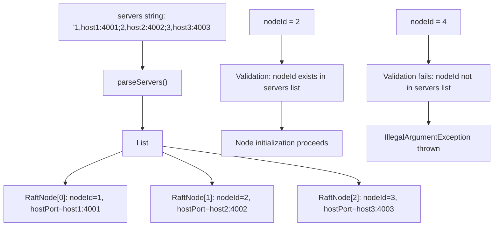
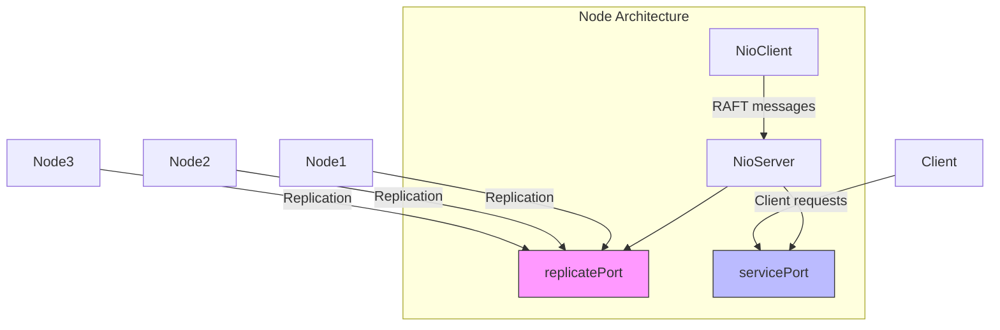
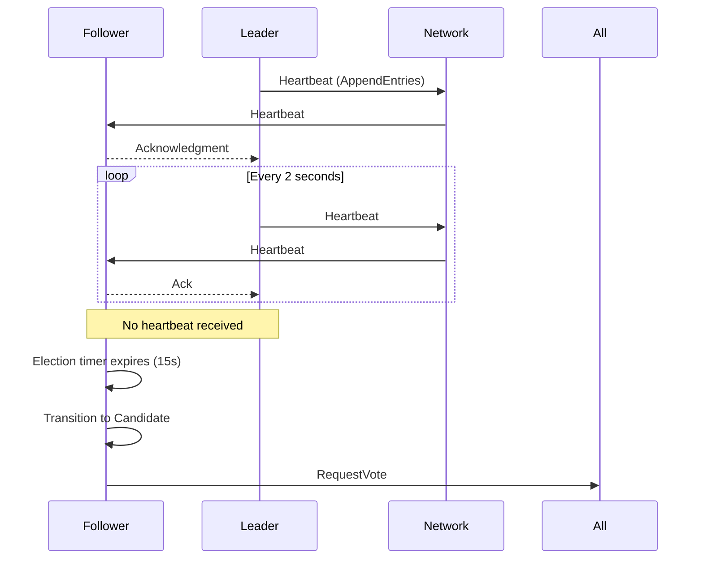
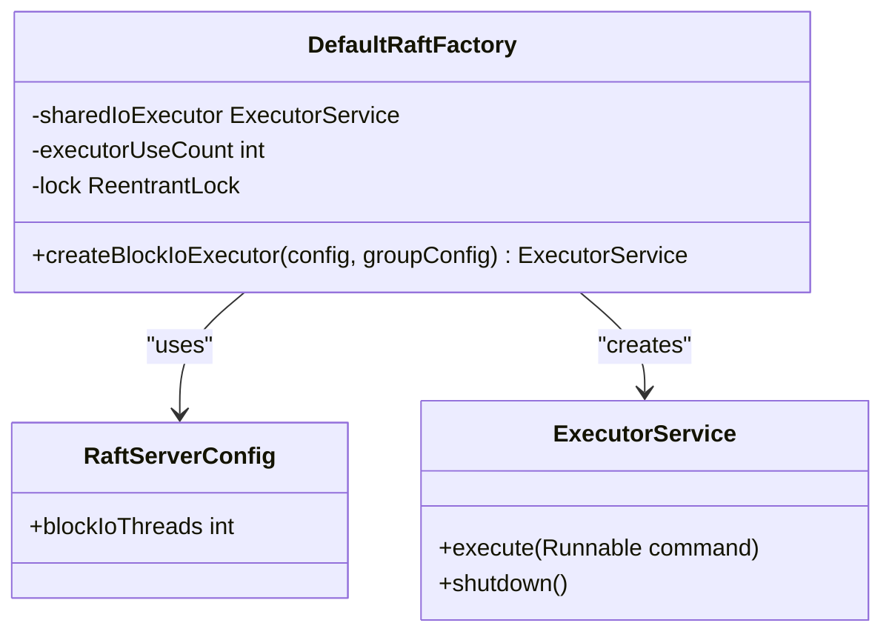
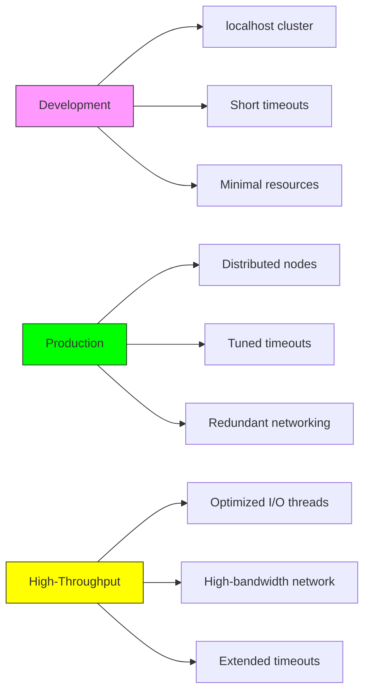

# RAFT Server Configuration

<cite>
**Referenced Files in This Document**   
- [RaftServerConfig.java](file://server/src/main/java/com/github/dtprj/dongting/raft/server/RaftServerConfig.java)
- [RaftNode.java](file://client/src/main/java/com/github/dtprj/dongting/raft/RaftNode.java)
- [RaftServer.java](file://server/src/main/java/com/github/dtprj/dongting/raft/server/RaftServer.java)
- [DemoServer1.java](file://demos/src/main/java/com/github/dtprj/dongting/demos/cluster/DemoServer1.java)
- [DemoServer2.java](file://demos/src/main/java/com/github/dtprj/dongting/demos/cluster/DemoServer2.java)
- [DemoServer3.java](file://demos/src/main/java/com/github/dtprj/dongting/demos/cluster/DemoServer3.java)
- [raft算法的工程实现秘笈.md](file://devlogs/2024_07_26_raft算法的工程实现秘笈.md)
</cite>

## Table of Contents
1. [Introduction](#introduction)
2. [Core Configuration Parameters](#core-configuration-parameters)
3. [Cluster Membership Configuration](#cluster-membership-configuration)
4. [Network and Port Configuration](#network-and-port-configuration)
5. [Timing and Timeout Configuration](#timing-and-timeout-configuration)
6. [Performance Configuration](#performance-configuration)
7. [Configuration Scenarios](#configuration-scenarios)
8. [Configuration Validation and Error Handling](#configuration-validation-and-error-handling)
9. [Best Practices and Recommendations](#best-practices-and-recommendations)
10. [Conclusion](#conclusion)

## Introduction
The RAFT consensus algorithm implementation in the Dongting project provides a robust distributed coordination system for maintaining data consistency across multiple nodes. Proper configuration of the RaftServerConfig parameters is critical for ensuring cluster stability, fault tolerance, and optimal performance. This document provides comprehensive guidance on configuring RAFT server parameters, explaining their impact on cluster behavior, and offering recommendations for different deployment scenarios. The configuration system is designed to balance ease of use with fine-grained control over cluster operations, network behavior, and performance characteristics.

## Core Configuration Parameters

The RaftServerConfig class defines the essential parameters that control the behavior of a RAFT node within a distributed cluster. These parameters determine how nodes discover each other, communicate, and coordinate to maintain consensus. The configuration includes settings for cluster membership, network ports, timing parameters, and performance tuning options. Each parameter plays a specific role in the overall operation of the RAFT cluster, affecting everything from leader election processes to data replication efficiency. Understanding these parameters is essential for deploying and maintaining a stable and performant distributed system.

**Section sources**
- [RaftServerConfig.java](file://server/src/main/java/com/github/dtprj/dongting/raft/server/RaftServerConfig.java#L21-L39)

## Cluster Membership Configuration

### servers Parameter
The `servers` parameter is a string that defines the complete list of nodes in the RAFT cluster, including their unique identifiers and network addresses. This parameter uses a semicolon-separated format where each node is specified as "nodeId,host:port". For example: "1,127.0.0.1:4001;2,127.0.0.1:4002;3,127.0.0.1:4003". This configuration is critical for cluster formation as it enables each node to discover and connect to all other members of the cluster. The RaftNode.parseServers method processes this string to create a list of RaftNode objects that represent the cluster members.

### nodeId Parameter
The `nodeId` parameter specifies the unique identifier of the current node within the cluster. This integer value must be unique across all nodes in the cluster and must be present in the servers list. The nodeId serves as the primary key for identifying nodes during consensus operations, log replication, and leader election processes. During initialization, the RaftServer validates that the configured nodeId exists in the servers list, ensuring that the node is properly included in the cluster configuration.

**Diagram sources**
- [RaftNode.java](file://client/src/main/java/com/github/dtprj/dongting/raft/RaftNode.java#L69-L96)
- [RaftServer.java](file://server/src/main/java/com/github/dtprj/dongting/raft/server/RaftServer.java#L126-L139)

**Section sources**
- [RaftServerConfig.java](file://server/src/main/java/com/github/dtprj/dongting/raft/server/RaftServerConfig.java#L22)
- [RaftServerConfig.java](file://server/src/main/java/com/github/dtprj/dongting/raft/server/RaftServerConfig.java#L27)
- [RaftNode.java](file://client/src/main/java/com/github/dtprj/dongting/raft/RaftNode.java#L69-L96)

## Network and Port Configuration

### replicatePort Parameter
The `replicatePort` parameter specifies the TCP port used for internal RAFT communication between cluster nodes. This port handles log replication traffic, leader election messages, and other consensus-related operations. It is dedicated to server-to-server communication and should be accessible only to other cluster members for security reasons. The port is used by the NioServer component to establish connections for RAFT protocol messages.

### servicePort Parameter
The `servicePort` parameter defines the TCP port used for client access to the RAFT cluster. When set to a positive value, the server starts a service endpoint on this port to handle client requests. Setting this value to 0 disables the client service, which might be appropriate for dedicated follower nodes in certain architectures. When both replicatePort and servicePort are configured, the NioServer binds to both ports, allowing the node to handle both internal RAFT traffic and external client requests.

**Diagram sources**
- [RaftServerConfig.java](file://server/src/main/java/com/github/dtprj/dongting/raft/server/RaftServerConfig.java#L24-L26)
- [RaftServer.java](file://server/src/main/java/com/github/dtprj/dongting/raft/server/RaftServer.java#L148-L158)

**Section sources**
- [RaftServerConfig.java](file://server/src/main/java/com/github/dtprj/dongting/raft/server/RaftServerConfig.java#L24-L26)

## Timing and Timeout Configuration

### electTimeout Parameter
The `electTimeout` parameter determines the duration (in milliseconds) that a follower node waits before initiating a leader election when no heartbeat is received from the current leader. With a default value of 15,000 milliseconds (15 seconds), this timeout is critical for fault detection and leader failover. When a follower's election timer expires, it transitions to candidate state and initiates a new election round. The election timeout includes randomization to prevent split votes during simultaneous elections.

### rpcTimeout Parameter
The `rpcTimeout` parameter sets the maximum time (in milliseconds) that a node waits for a response to a remote procedure call before considering the request failed. With a default value of 5,000 milliseconds (5 seconds), this timeout affects all inter-node communications, including AppendEntries and RequestVote operations. This parameter helps detect network partitions and node failures by establishing a clear boundary for acceptable response times.

### heartbeatInterval Parameter
The `heartbeatInterval` parameter defines how frequently the leader node sends heartbeat messages to followers to maintain its leadership. With a default value of 2,000 milliseconds (2 seconds), this interval must be significantly shorter than the election timeout to prevent unnecessary elections. Heartbeats serve multiple purposes: they prevent followers from starting new elections, replicate empty log entries to advance commit indexes, and provide regular status updates across the cluster.

### pingInterval Parameter
The `pingInterval` parameter controls the frequency of configuration validation checks between nodes, known as "raft ping" in the Dongting system. This mechanism verifies that all nodes in the cluster have consistent configuration parameters, preventing issues caused by configuration drift. The ping operation occurs at the specified interval (default 2,000 milliseconds) and is performed after TCP connection establishment and on reconnection events.

**Diagram sources**
- [RaftServerConfig.java](file://server/src/main/java/com/github/dtprj/dongting/raft/server/RaftServerConfig.java#L28-L33)
- [RaftUtil.java](file://server/src/main/java/com/github/dtprj/dongting/raft/impl/RaftUtil.java#L198-L201)
- [raft算法的工程实现秘笈.md](file://devlogs/2024_07_26_raft算法的工程实现秘笈.md#L81-L86)

**Section sources**
- [RaftServerConfig.java](file://server/src/main/java/com/github/dtprj/dongting/raft/server/RaftServerConfig.java#L28-L34)

## Performance Configuration

### blockIoThreads Parameter
The `blockIoThreads` parameter specifies the number of threads dedicated to blocking I/O operations in the RAFT cluster. The default value is calculated as `Math.max(Runtime.getRuntime().availableProcessors() * 2, 4)`, ensuring at least 4 threads even on systems with fewer cores. These threads handle file system operations for log persistence, snapshot operations, and other disk I/O tasks. The shared thread pool is managed by the DefaultRaftFactory, which creates a fixed thread pool based on this configuration value.

**Diagram sources**
- [RaftServerConfig.java](file://server/src/main/java/com/github/dtprj/dongting/raft/server/RaftServerConfig.java#L37)
- [DefaultRaftFactory.java](file://server/src/main/java/com/github/dtprj/dongting/raft/server/DefaultRaftFactory.java#L58-L73)

**Section sources**
- [RaftServerConfig.java](file://server/src/main/java/com/github/dtprj/dongting/raft/server/RaftServerConfig.java#L37)
- [DefaultRaftFactory.java](file://server/src/main/java/com/github/dtprj/dongting/raft/server/DefaultRaftFactory.java#L58-L73)

## Configuration Scenarios

### Development Configuration
For development and testing environments, a simple three-node cluster configuration is typically used with localhost addresses and minimal timeouts. This allows for rapid testing and debugging of RAFT behavior without requiring complex network setup. The demo servers (DemoServer1, DemoServer2, DemoServer3) illustrate this pattern with nodes running on the same machine with different ports.

### Production Configuration
Production deployments require careful consideration of network topology, fault domains, and performance requirements. The election timeout should be tuned based on network latency measurements, typically set to 3-5 times the average round-trip time between nodes. The heartbeat interval should be set to approximately 1/5 to 1/3 of the election timeout to provide sufficient margin for network fluctuations while ensuring timely failover.

### High-Throughput Configuration
For high-throughput scenarios, the blockIoThreads parameter should be increased to match the I/O capabilities of the underlying storage system. The servicePort and replicatePort should be on high-bandwidth network interfaces, and the rpcTimeout may need adjustment to accommodate higher network loads. Monitoring of heartbeat intervals and election timeouts is critical to ensure stability under heavy load conditions.

**Diagram sources**
- [DemoServer1.java](file://demos/src/main/java/com/github/dtprj/dongting/demos/cluster/DemoServer1.java#L27)
- [DemoServer2.java](file://demos/src/main/java/com/github/dtprj/dongting/demos/cluster/DemoServer2.java#L27)
- [DemoServer3.java](file://demos/src/main/java/com/github/dtprj/dongting/demos/cluster/DemoServer3.java#L27)

**Section sources**
- [DemoServer1.java](file://demos/src/main/java/com/github/dtprj/dongting/demos/cluster/DemoServer1.java#L26-L31)
- [DemoServer2.java](file://demos/src/main/java/com/github/dtprj/dongting/demos/cluster/DemoServer2.java#L26-L31)
- [DemoServer3.java](file://demos/src/main/java/com/github/dtprj/dongting/demos/cluster/DemoServer3.java#L26-L31)

## Configuration Validation and Error Handling

The Dongting RAFT implementation includes robust configuration validation to prevent cluster instability caused by configuration inconsistencies. As documented in the engineering notes, the system performs "raft ping" operations to verify that connected nodes have identical configuration parameters. This check occurs after TCP connection establishment and on reconnection events, ensuring that configuration drift is detected early.

Critical validation checks include:
- Verification that the local nodeId exists in the servers list
- Detection of duplicate nodeIds or host:port combinations
- Validation of positive values for nodeId, replicatePort, and other required parameters
- Consistency checks between nodes via the raft ping mechanism

When configuration errors are detected, the system throws appropriate exceptions such as IllegalArgumentException or RaftException, preventing the node from joining the cluster with incorrect settings. This proactive validation approach helps maintain cluster integrity and prevents the subtle failures that can occur when nodes have mismatched configurations.

**Section sources**
- [RaftServer.java](file://server/src/main/java/com/github/dtprj/dongting/raft/server/RaftServer.java#L130-L138)
- [raft算法的工程实现秘笈.md](file://devlogs/2024_07_26_raft算法的工程实现秘笈.md#L81-L86)

## Best Practices and Recommendations

### Election Timeout Tuning
The election timeout should be tuned based on the specific network conditions of the deployment environment. In low-latency data center networks, the timeout can be reduced to enable faster failover (e.g., 5-10 seconds). In high-latency or unstable network environments, the timeout should be increased to prevent unnecessary leader elections due to transient network issues. A general rule is to set the election timeout to 3-5 times the average round-trip time between the most distant nodes in the cluster.

### Heartbeat Interval Settings
The heartbeat interval should be set to approximately 1/5 to 1/3 of the election timeout value. This provides sufficient margin for network jitter while ensuring timely detection of leader failures. Too frequent heartbeats can create unnecessary network overhead, while infrequent heartbeats increase the time to detect leader failures. Monitoring heartbeat delivery times can help optimize this setting for specific deployment conditions.

### Configuration Consistency
Maintaining identical configuration across all cluster nodes is critical for stable operation. Automated configuration management tools should be used to ensure consistency, and the raft ping mechanism should remain enabled in production environments to detect configuration drift. When configuration changes are necessary, they should be applied systematically across all nodes, preferably during maintenance windows.

### Monitoring and Alerting
Key configuration parameters should be monitored to detect potential issues:
- Heartbeat intervals and delivery times
- Election timeout occurrences
- RPC timeout rates
- Configuration consistency across nodes
Alerts should be configured for abnormal patterns, such as frequent leader elections or increasing RPC timeout rates, which may indicate network or configuration problems.

**Section sources**
- [RaftServerConfig.java](file://server/src/main/java/com/github/dtprj/dongting/raft/server/RaftServerConfig.java#L28-L33)
- [raft算法的工程实现秘笈.md](file://devlogs/2024_07_26_raft算法的工程实现秘笈.md#L81-L86)

## Conclusion
Proper configuration of the RAFT server parameters is essential for achieving a stable, performant, and fault-tolerant distributed system. The RaftServerConfig class provides a comprehensive set of parameters that control cluster membership, network behavior, timing characteristics, and performance tuning. By understanding the role and interaction of these parameters, operators can configure clusters optimized for their specific deployment scenarios, whether development, production, or high-throughput environments. The built-in validation mechanisms, such as raft ping, help maintain configuration consistency and prevent the subtle failures that can occur with mismatched settings. Following best practices for timeout tuning, configuration management, and monitoring ensures reliable cluster operation and quick detection of potential issues.