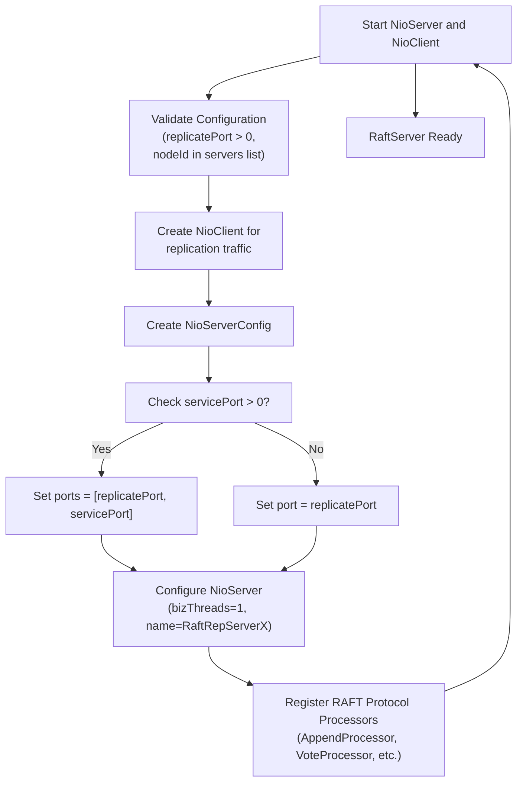
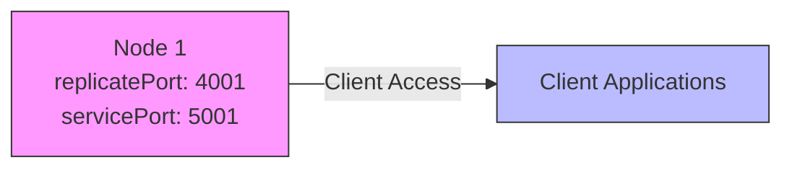

# Replicate and Service Ports

<cite>
**Referenced Files in This Document**   
- [RaftServerConfig.java](file://server/src/main/java/com/github/dtprj/dongting/raft/server/RaftServerConfig.java)
- [RaftServer.java](file://server/src/main/java/com/github/dtprj/dongting/raft/server/RaftServer.java)
- [NioServer.java](file://client/src/main/java/com/github/dtprj/dongting/net/NioServer.java)
- [NioServerConfig.java](file://client/src/main/java/com/github/dtprj/dongting/net/NioServerConfig.java)
- [DemoKvServerBase.java](file://demos/src/main/java/com/github/dtprj/dongting/demos/base/DemoKvServerBase.java)
- [StandaloneDemoServer.java](file://demos/src/main/java/com/github/dtprj/dongting/demos/standalone/StandaloneDemoServer.java)
- [DemoServer1.java](file://demos/src/main/java/com/github/dtprj/dongting/demos/cluster/DemoServer1.java)
- [ConfigChangeDemoServer1.java](file://demos/src/main/java/com/github/dtprj/dongting/demos/configchange/ConfigChangeDemoServer1.java)
</cite>

## Table of Contents
1. [Introduction](#introduction)
2. [replicatePort Configuration](#replicateport-configuration)
3. [servicePort Configuration](#serviceport-configuration)
4. [NioServer Configuration and Port Binding](#nioserver-configuration-and-port-binding)
5. [Network Security and Firewall Considerations](#network-security-and-firewall-considerations)
6. [Deployment Scenarios](#deployment-scenarios)
7. [Troubleshooting Guide](#troubleshooting-guide)
8. [Conclusion](#conclusion)

## Introduction
This document provides comprehensive documentation for the 'replicatePort' and 'servicePort' configuration parameters in the RaftServerConfig class of the Dongting distributed system. These ports serve distinct purposes in the architecture: replicatePort handles internal RAFT consensus protocol communication between server nodes, while servicePort provides client access for key-value operations and distributed coordination. The document explains how these ports are configured in the NioServer instance, their relationship to network security, and provides examples for different deployment scenarios along with troubleshooting guidance.

**Section sources**
- [RaftServerConfig.java](file://server/src/main/java/com/github/dtprj/dongting/raft/server/RaftServerConfig.java#L21-L40)

## replicatePort Configuration
The replicatePort parameter in RaftServerConfig is dedicated to internal RAFT consensus protocol communication between server nodes. This port handles critical RAFT operations including log replication, voting, leader election, and administrative commands. The port must be a positive integer and is validated during RaftServer initialization to ensure proper cluster operation.

The replicatePort facilitates communication for RAFT protocol messages such as AppendEntries requests (log replication), RequestVote messages (leader election), and various administrative commands. These communications are essential for maintaining consistency across the distributed system and ensuring fault tolerance. The port is used exclusively for server-to-server communication within the RAFT cluster, enabling nodes to exchange log entries, participate in leader elections, and coordinate cluster membership changes.

**Section sources**
- [RaftServerConfig.java](file://server/src/main/java/com/github/dtprj/dongting/raft/server/RaftServerConfig.java#L23-L24)
- [RaftServer.java](file://server/src/main/java/com/github/dtprj/dongting/raft/server/RaftServer.java#L124-L125)
- [AppendReq.java](file://server/src/main/java/com/github/dtprj/dongting/raft/rpc/AppendReq.java#L34-L43)
- [VoteReq.java](file://server/src/main/java/com/github/dtprj/dongting/raft/rpc/VoteReq.java#L28-L34)

## servicePort Configuration
The servicePort parameter in RaftServerConfig provides client access to the distributed system for key-value operations and distributed coordination services. This port enables clients to perform CRUD operations on the key-value store, acquire distributed locks, and receive watch notifications. A servicePort value of 0 explicitly disables the client service, meaning the server will only participate in the RAFT consensus protocol without accepting client connections.

When servicePort is set to a positive value, the server exposes an endpoint for client applications to interact with the distributed key-value store (DtKV) and other coordination primitives. This includes operations such as put, get, delete, distributed locking, and watch functionality. The ability to disable client access by setting servicePort to 0 allows for specialized node configurations where certain servers act purely as consensus participants without handling client traffic, which can be useful for scaling the consensus layer independently from the client access layer.

**Section sources**
- [RaftServerConfig.java](file://server/src/main/java/com/github/dtprj/dongting/raft/server/RaftServerConfig.java#L25-L26)
- [RaftServer.java](file://server/src/main/java/com/github/dtprj/dongting/raft/server/RaftServer.java#L149-L153)
- [DemoKvServerBase.java](file://demos/src/main/java/com/github/dtprj/dongting/demos/base/DemoKvServerBase.java#L43-L44)

## NioServer Configuration and Port Binding
The NioServer instance is configured with both replicatePort and servicePort through the RaftServer initialization process. The configuration logic in RaftServer determines how these ports are bound based on the servicePort value. When servicePort is greater than 0, the NioServerConfig is set up with both ports using the ports array, allowing a single NioServer instance to listen on multiple ports. When servicePort is 0, only the replicatePort is configured, simplifying the network configuration for nodes that don't serve client requests.

The NioServer implementation uses Java NIO to handle network communication efficiently, with dedicated I/O worker threads processing incoming connections and requests. The server configuration includes parameters such as ioThreads, backlog, and various performance tuning options that affect how the ports handle incoming connections. The NioServer registers specific processors for different command types, routing RAFT protocol messages (like NODE_PING, RAFT_APPEND_ENTRIES, RAFT_REQUEST_VOTE) to their respective handlers while also supporting client-facing operations when servicePort is enabled.



**Diagram sources **
- [RaftServer.java](file://server/src/main/java/com/github/dtprj/dongting/raft/server/RaftServer.java#L148-L158)
- [NioServer.java](file://client/src/main/java/com/github/dtprj/dongting/net/NioServer.java#L59-L89)
- [NioServerConfig.java](file://client/src/main/java/com/github/dtprj/dongting/net/NioServerConfig.java#L21-L67)

**Section sources**
- [RaftServer.java](file://server/src/main/java/com/github/dtprj/dongting/raft/server/RaftServer.java#L148-L161)
- [NioServer.java](file://client/src/main/java/com/github/dtprj/dongting/net/NioServer.java#L50-L293)
- [NioServerConfig.java](file://client/src/main/java/com/github/dtprj/dongting/net/NioServerConfig.java#L21-L67)

## Network Security and Firewall Considerations
Proper firewall configuration is essential for the reliable operation of the Dongting distributed system. The replicatePort must be accessible between all cluster nodes to ensure uninterrupted RAFT consensus protocol communication. Blocking or restricting this port can lead to leader election failures, log replication issues, and potential cluster partitioning. Network security policies should allow bidirectional communication on the replicatePort between all server nodes in the cluster.

For the servicePort, firewall rules should be configured based on the client access requirements. In production environments, it's recommended to restrict access to trusted client networks and implement additional security measures such as TLS encryption if supported. When servicePort is set to 0, the firewall can completely block external access to that node, enhancing security for consensus-only nodes. Network monitoring should be implemented to detect port conflicts, connection issues, and unusual traffic patterns that might indicate configuration problems or security threats.

**Section sources**
- [RaftServer.java](file://server/src/main/java/com/github/dtprj/dongting/raft/server/RaftServer.java#L148-L158)
- [NioServer.java](file://client/src/main/java/com/github/dtprj/dongting/net/NioServer.java#L91-L98)

## Deployment Scenarios
### Single-Node Development Configuration
In single-node development environments, the configuration typically uses sequential port numbers based on the node ID. For example, a standalone server might use replicatePort 4001 and servicePort 5001. This pattern is demonstrated in the StandaloneDemoServer where the ports are calculated as 4000 + nodeId and 5000 + nodeId, providing a predictable and conflict-free configuration for development purposes.



**Diagram sources **
- [StandaloneDemoServer.java](file://demos/src/main/java/com/github/dtprj/dongting/demos/standalone/StandaloneDemoServer.java#L27-L28)
- [DemoKvServerBase.java](file://demos/src/main/java/com/github/dtprj/dongting/demos/base/DemoKvServerBase.java#L42-L43)

### Multi-Node Production Configuration
In multi-node production environments, the configuration scales to accommodate multiple servers in a cluster. Each node has a unique replicatePort (e.g., 4001, 4002, 4003) while maintaining corresponding servicePorts (e.g., 5001, 5002, 5003). The servers list in RaftServerConfig specifies all nodes in the cluster with their respective replicatePorts, enabling proper node discovery and communication. This pattern is exemplified in the cluster demo configuration where three nodes operate on ports 4001-4003 for replication and 5001-5003 for client services.

```mermaid
graph LR
A["Node 1\nreplicatePort: 4001\nservicePort: 5001"] < --> B["Node 2\nreplicatePort: 4002\nservicePort: 5002"]
B < --> C["Node 3\nreplicatePort: 4003\nservicePort: 5003"]
A < --> C
A --> D["Client Applications"]
B --> D
C --> D
style A fill:#f9f,stroke:#333
style B fill:#f9f,stroke:#333
style C fill:#f9f,stroke:#333
style D fill:#bbf,stroke:#333
```

**Diagram sources **
- [DemoServer1.java](file://demos/src/main/java/com/github/dtprj/dongting/demos/cluster/DemoServer1.java#L27-L28)
- [DemoServer2.java](file://demos/src/main/java/com/github/dtprj/dongting/demos/cluster/DemoServer2.java#L27-L28)
- [DemoServer3.java](file://demos/src/main/java/com/github/dtprj/dongting/demos/cluster/DemoServer3.java#L27-L28)

### Configuration Change Scenario
In dynamic cluster environments, the port configuration supports runtime changes to cluster membership. The configchange demo shows a four-node setup (ports 4001-4004) where membership can be modified from nodes 1,2,3 to 2,3,4. This demonstrates how the port configuration remains stable while the cluster composition changes, allowing for seamless maintenance and scaling operations without requiring port reconfiguration.

```mermaid
graph LR
subgraph "Initial Configuration"
A1["Node 1\n4001/5001"] < --> A2["Node 2\n4002/5002"]
A2 < --> A3["Node 3\n4003/5003"]
A1 < --> A3
end
subgraph "After Change"
B2["Node 2\n4002/5002"] < --> B3["Node 3\n4003/5003"]
B3 < --> B4["Node 4\n4004/5004"]
B2 < --> B4
end
style A1 fill:#f9f,stroke:#333
style A2 fill:#f9f,stroke:#333
style A3 fill:#f9f,stroke:#333
style B2 fill:#f9f,stroke:#333
style B3 fill:#f9f,stroke:#333
style B4 fill:#f9f,stroke:#333
```

**Diagram sources **
- [ConfigChangeDemoServer1.java](file://demos/src/main/java/com/github/dtprj/dongting/demos/configchange/ConfigChangeDemoServer1.java#L26-L27)
- [ConfigChangeDemoServer2.java](file://demos/src/main/java/com/github/dtprj/dongting/demos/configchange/ConfigChangeDemoServer2.java#L26-L27)
- [ConfigChangeDemoServer3.java](file://demos/src/main/java/com/github/dtprj/dongting/demos/configchange/ConfigChangeDemoServer3.java#L26-L27)

**Section sources**
- [StandaloneDemoServer.java](file://demos/src/main/java/com/github/dtprj/dongting/demos/standalone/StandaloneDemoServer.java#L27-L30)
- [DemoServer1.java](file://demos/src/main/java/com/github/dtprj/dongting/demos/cluster/DemoServer1.java#L27-L30)
- [ConfigChangeDemoServer1.java](file://demos/src/main/java/com/github/dtprj/dongting/demos/configchange/ConfigChangeDemoServer1.java#L26-L30)

## Troubleshooting Guide
### Port Conflict Resolution
Port conflicts occur when multiple processes attempt to bind to the same port. To resolve this issue, verify that no other instances of the application are running on the same machine, and check for other services using the required ports. Use system tools like netstat or lsof to identify processes occupying the ports. The recommended approach is to use unique port numbers for each node in the cluster, typically calculated as base_port + node_id to avoid conflicts.

### Connection Refused Errors
Connection refused errors indicate that the target port is not accepting connections. Verify that the RaftServer is properly started and that the NioServer has successfully bound to the specified ports. Check server logs for any binding errors or exceptions during startup. Ensure that the servers list in RaftServerConfig correctly specifies the IP address and replicatePort for each node. Validate network connectivity between nodes using tools like ping and telnet to confirm reachability.

### Network Isolation Issues
Network isolation can prevent proper cluster formation and operation. Symptoms include failed leader elections, inability to replicate logs, and timeout errors. To diagnose these issues, verify firewall rules allow traffic on both replicatePort and servicePort between all cluster nodes. Check network configuration for any routing issues or network segmentation. Use network monitoring tools to verify that RAFT protocol messages (such as AppendEntries and RequestVote) are being transmitted between nodes. Ensure clock synchronization across all nodes, as significant time differences can affect timeout calculations and cluster stability.

**Section sources**
- [RaftServer.java](file://server/src/main/java/com/github/dtprj/dongting/raft/server/RaftServer.java#L122-L139)
- [NioServer.java](file://client/src/main/java/com/github/dtprj/dongting/net/NioServer.java#L118-L120)
- [DemoKvServerBase.java](file://demos/src/main/java/com/github/dtprj/dongting/demos/base/DemoKvServerBase.java#L38-L44)

## Conclusion
The replicatePort and servicePort configuration parameters in RaftServerConfig provide a flexible and robust networking model for the Dongting distributed system. By separating internal RAFT consensus traffic from client access traffic, the architecture enables optimized network configurations for different deployment scenarios. The ability to disable client services by setting servicePort to 0 allows for specialized node roles within the cluster, enhancing both performance and security. Proper configuration and network management of these ports are essential for maintaining a reliable and scalable distributed system.