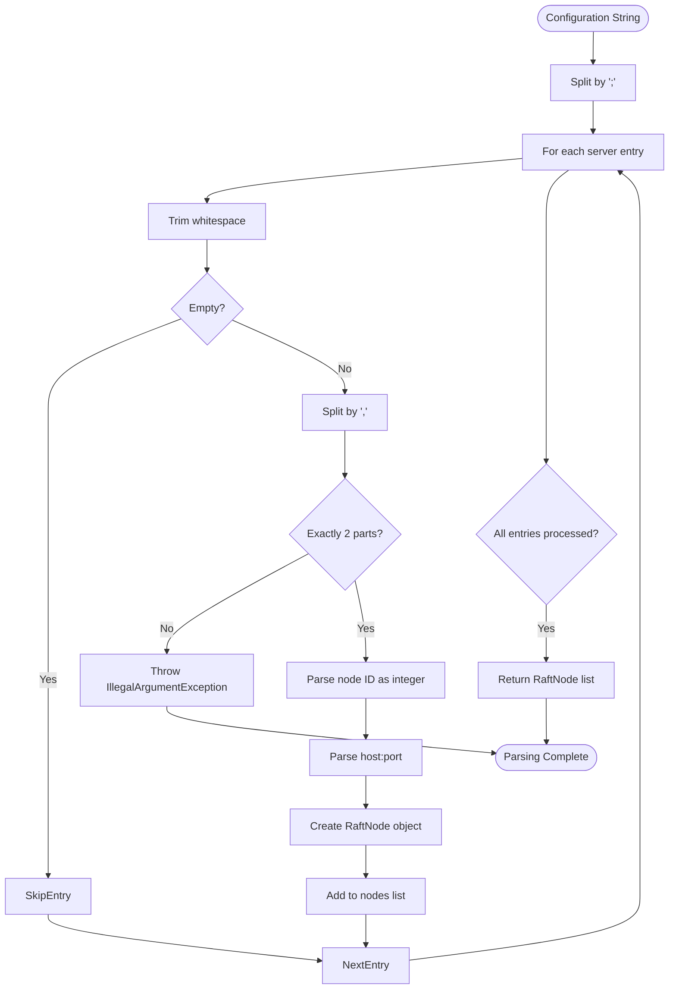
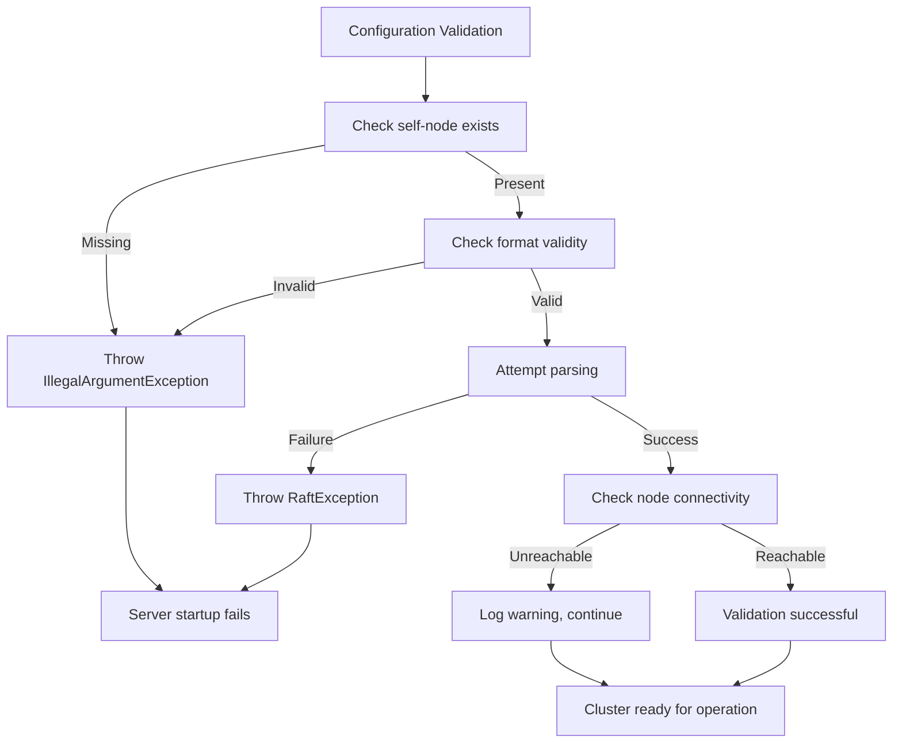

# Servers Configuration

<cite>
**Referenced Files in This Document**   
- [RaftServerConfig.java](file://server/src/main/java/com/github/dtprj/dongting/raft/server/RaftServerConfig.java)
- [RaftNode.java](file://client/src/main/java/com/github/dtprj/dongting/raft/RaftNode.java)
- [NodeManager.java](file://server/src/main/java/com/github/dtprj/dongting/raft/impl/NodeManager.java)
- [MemberManager.java](file://server/src/main/java/com/github/dtprj/dongting/raft/impl/MemberManager.java)
- [DemoKvServerBase.java](file://demos/src/main/java/com/github/dtprj/dongting/demos/base/DemoKvServerBase.java)
</cite>

## Table of Contents
1. [Introduction](#introduction)
2. [Configuration Format and Syntax](#configuration-format-and-syntax)
3. [Parsing and Validation Process](#parsing-and-validation-process)
4. [Cluster Topology Definition](#cluster-topology-definition)
5. [Error Handling and Validation Rules](#error-handling-and-validation-rules)
6. [Dynamic Membership Integration](#dynamic-membership-integration)
7. [Troubleshooting Configuration Issues](#troubleshooting-configuration-issues)
8. [Best Practices and Examples](#best-practices-and-examples)

## Introduction

The `servers` configuration parameter in `RaftServerConfig` plays a critical role in defining the cluster topology for a Raft-based distributed system. This parameter specifies all node IDs and their corresponding host:port addresses as a comma-separated string, forming the complete membership list for the Raft cluster. The configuration is essential for cluster formation, node discovery, and inter-node communication during consensus operations.

This document provides comprehensive details about the `servers` parameter, including its format requirements, parsing mechanism, validation rules, and impact on cluster behavior. It also covers common configuration errors, troubleshooting strategies, and integration with dynamic membership changes.

**Section sources**
- [RaftServerConfig.java](file://server/src/main/java/com/github/dtprj/dongting/raft/server/RaftServerConfig.java#L22-L39)

## Configuration Format and Syntax

The `servers` parameter follows a specific format that combines node identifiers with network addresses. The syntax requires a semicolon-separated list of server entries, where each entry consists of a node ID and host:port combination separated by a comma.

The correct format is: `nodeId,host:port;nodeId,host:port;...`

For example: `1,127.0.0.1:8081;2,127.0.0.1:8082;3,127.0.0.1:8083`

Each server entry must contain exactly two components:
- **Node ID**: An integer identifier that uniquely identifies the node within the cluster
- **Host:Port**: The network address where the node listens for Raft replication traffic

The delimiter between server entries is a semicolon (`;`), not a comma as mentioned in the documentation objective. This is evident from the `parseServers` method in `RaftNode.java` which splits the input string by semicolons.

**Section sources**
- [RaftNode.java](file://client/src/main/java/com/github/dtprj/dongting/raft/RaftNode.java#L69-L96)

## Parsing and Validation Process

The parsing of the `servers` configuration occurs through the `RaftNode.parseServers()` method, which converts the string representation into a list of `RaftNode` objects. This process involves several validation steps to ensure the configuration's correctness.

The parsing workflow is as follows:
1. Split the input string by semicolon (`;`) to separate individual server entries
2. For each server entry, split by comma (`,`) to separate node ID and host:port
3. Validate that each entry has exactly two components
4. Parse the node ID as an integer
5. Parse the host:port using `NioNet.parseHostPort()`
6. Create a `RaftNode` object for each valid entry

During initialization, the NodeManager validates that the local node's ID exists in the servers list. This is enforced by a check in the NodeManager constructor that throws an `IllegalArgumentException` if the self node ID is not found in the provided servers list.



**Diagram sources**
- [RaftNode.java](file://client/src/main/java/com/github/dtprj/dongting/raft/RaftNode.java#L69-L96)
- [NodeManager.java](file://server/src/main/java/com/github/dtprj/dongting/raft/impl/NodeManager.java#L89-L92)

**Section sources**
- [RaftNode.java](file://client/src/main/java/com/github/dtprj/dongting/raft/RaftNode.java#L69-L96)
- [NodeManager.java](file://server/src/main/java/com/github/dtprj/dongting/raft/impl/NodeManager.java#L89-L92)

## Cluster Topology Definition

The `servers` parameter defines the complete topology of the Raft cluster by specifying all participating nodes. This list serves as the authoritative source for cluster membership and is used for various purposes including:

- **Node Discovery**: Each node uses this list to establish connections with other cluster members
- **Leader Election**: The complete membership list is required for the election process
- **Log Replication**: The leader uses this information to replicate logs to all followers
- **Health Monitoring**: Nodes perform periodic ping operations to monitor the health of other members

The configuration is typically consistent across all nodes in the cluster, ensuring that each node has the same view of the cluster topology. This consistency is verified during the handshake process and through periodic configuration checks.

The NodeManager maintains a map of all nodes (`allNodesEx`) and tracks their status, including connectivity and readiness. The `startReadyQuorum` parameter determines how many nodes must be reachable before the cluster can start operating.

**Section sources**
- [NodeManager.java](file://server/src/main/java/com/github/dtprj/dongting/raft/impl/NodeManager.java#L55-L453)

## Error Handling and Validation Rules

The system enforces several validation rules to ensure the integrity of the `servers` configuration. These rules are applied during initialization and can prevent the server from starting if violations are detected.

Key validation rules include:
- **Self-node inclusion**: The local node's ID must be present in the servers list
- **Unique node IDs**: Each node must have a unique identifier
- **Valid host:port format**: Network addresses must follow the correct format
- **Non-empty list**: The servers list cannot be null or empty

When validation fails, the system throws appropriate exceptions:
- `IllegalArgumentException` for missing self-node or format errors
- `RaftException` for empty servers list or parsing failures
- `NumberFormatException` for invalid node ID formats

The NodeManager performs additional runtime validation through periodic ping operations to verify node connectivity and configuration consistency.



**Diagram sources**
- [NodeManager.java](file://server/src/main/java/com/github/dtprj/dongting/raft/impl/NodeManager.java#L89-L92)
- [RaftNode.java](file://client/src/main/java/com/github/dtprj/dongting/raft/RaftNode.java#L70-L96)

**Section sources**
- [NodeManager.java](file://server/src/main/java/com/github/dtprj/dongting/raft/impl/NodeManager.java#L89-L92)
- [RaftNode.java](file://client/src/main/java/com/github/dtprj/dongting/raft/RaftNode.java#L70-L96)

## Dynamic Membership Integration

The `servers` configuration serves as the initial cluster topology, but the system supports dynamic membership changes through administrative operations. While the static `servers` list defines the initial membership, the cluster can evolve through runtime configuration changes.

The MemberManager component handles joint consensus operations for membership changes, allowing the cluster to transition between configurations safely. The `checkRemoteConfig` method in MemberManager verifies configuration consistency between nodes during these operations.

Key aspects of dynamic membership:
- **Prepared configurations**: The system supports transitional states during membership changes
- **Configuration validation**: Remote configuration changes are validated against the initial topology
- **Rollback capability**: Failed configuration changes can be aborted and rolled back

The initial `servers` list remains the reference point for validating all subsequent membership changes, ensuring that only nodes defined in the original configuration can join the cluster.

**Section sources**
- [MemberManager.java](file://server/src/main/java/com/github/dtprj/dongting/raft/impl/MemberManager.java#L291-L316)

## Troubleshooting Configuration Issues

Common issues with the `servers` configuration and their troubleshooting steps:

### Missing Self-Node
**Symptom**: Server fails to start with "self node id not exist in servers" error
**Solution**: Ensure the local node's ID is included in the servers list
**Prevention**: Double-check the nodeId configuration matches one of the entries

### Format Errors
**Symptom**: "not 'id,host:port' format" or "bad servers list" errors
**Solution**: Verify the format uses semicolons to separate entries and commas to separate ID from address
**Prevention**: Use consistent formatting and validate before deployment

### Connectivity Issues
**Symptom**: Nodes cannot communicate despite correct configuration
**Solution**: Check network connectivity, firewall settings, and port availability
**Prevention**: Test connectivity between nodes before starting the cluster

### Configuration Inconsistency
**Symptom**: Cluster fails to form quorum or experiences split-brain
**Solution**: Ensure identical servers configuration across all nodes
**Prevention**: Use configuration management tools to maintain consistency

The system provides diagnostic information through log messages that can help identify configuration issues, such as node ping failures or configuration mismatches.

**Section sources**
- [NodeManager.java](file://server/src/main/java/com/github/dtprj/dongting/raft/impl/NodeManager.java#L235-L242)
- [MemberManager.java](file://server/src/main/java/com/github/dtprj/dongting/raft/impl/MemberManager.java#L296-L311)

## Best Practices and Examples

### Correct Configuration Examples

**Three-node cluster:**
```
1,192.168.1.10:8081;2,192.168.1.11:8081;3,192.168.1.12:8081
```

**Single-node cluster (development):**
```
1,127.0.0.1:8081
```

### Incorrect Configuration Examples

**Wrong delimiter (using commas instead of semicolons):**
```
1,127.0.0.1:8081,2,127.0.0.1:8082,3,127.0.0.1:8083
```
*This will be parsed as a single invalid entry.*

**Missing self-node:**
```
1,127.0.0.1:8081;2,127.0.0.1:8082
```
*When running on node 3, this configuration will fail.*

**Duplicate node IDs:**
```
1,127.0.0.1:8081;1,127.0.0.1:8082
```
*This creates ambiguity about which address belongs to node 1.*

### Best Practices

1. **Consistent configuration**: Use identical servers lists across all cluster nodes
2. **Proper formatting**: Always use semicolons to separate server entries
3. **Include self-node**: Ensure each node's ID appears in its own configuration
4. **Use stable addresses**: Prefer static IP addresses or DNS names over dynamic ones
5. **Validate before deployment**: Test the configuration format before starting nodes
6. **Document the topology**: Maintain documentation of the cluster configuration

The DemoKvServerBase class provides a working example of how to configure the servers parameter correctly in a real application.

**Section sources**
- [DemoKvServerBase.java](file://demos/src/main/java/com/github/dtprj/dongting/demos/base/DemoKvServerBase.java#L38-L43)
- [RaftNode.java](file://client/src/main/java/com/github/dtprj/dongting/raft/RaftNode.java#L69-L96)