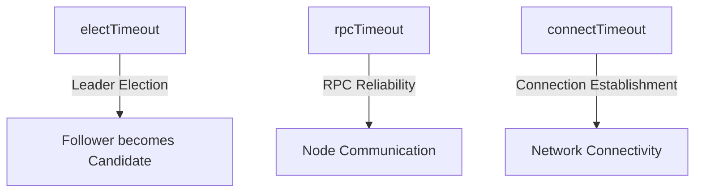
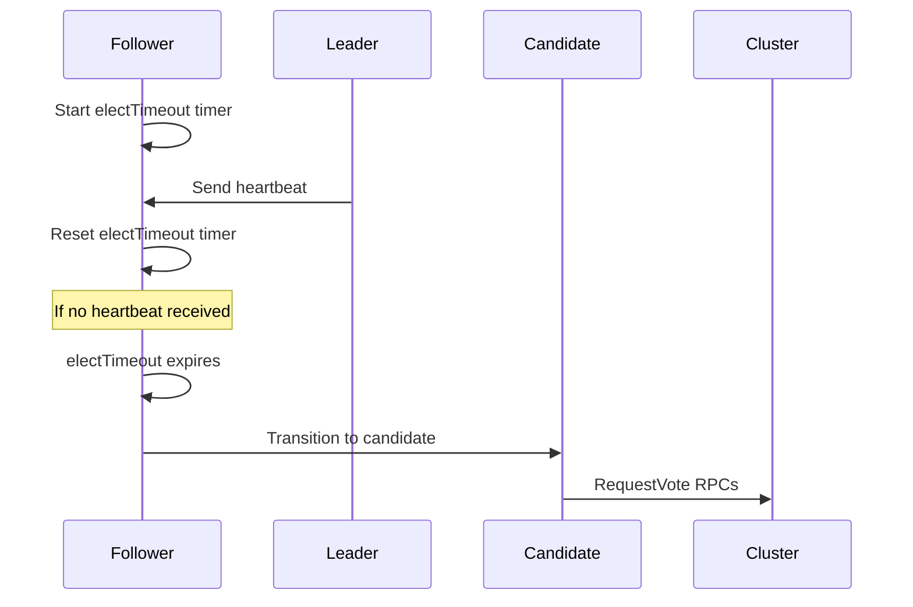
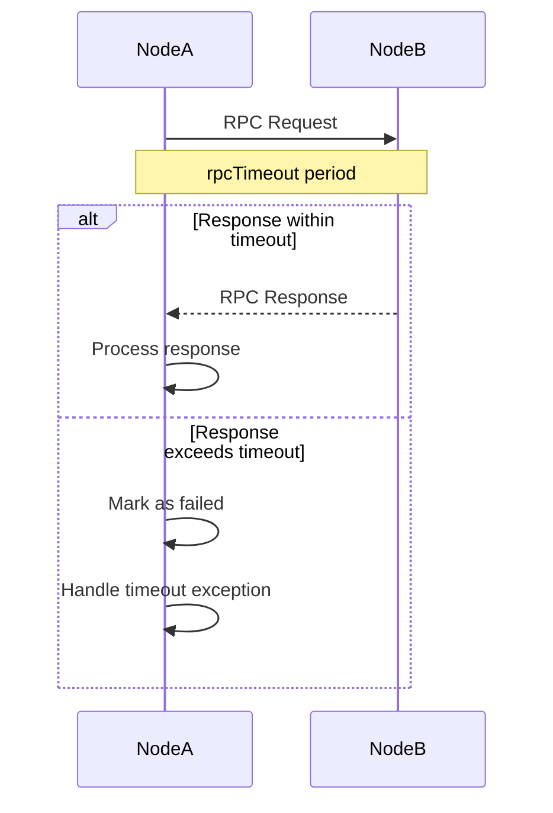
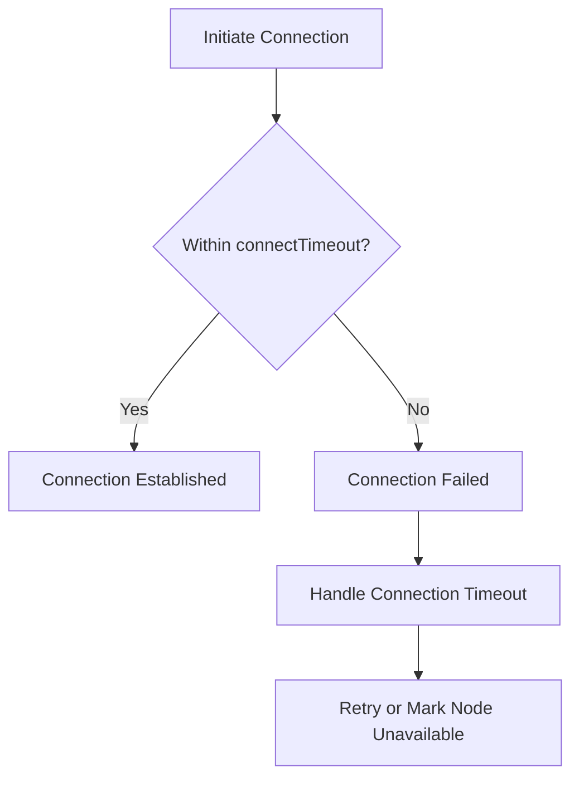

# Timeout Parameters

<cite>
**Referenced Files in This Document**   
- [RaftServerConfig.java](file://server/src/main/java/com/github/dtprj/dongting/raft/server/RaftServerConfig.java)
- [VoteManager.java](file://server/src/main/java/com/github/dtprj/dongting/raft/impl/VoteManager.java)
- [RaftUtil.java](file://server/src/main/java/com/github/dtprj/dongting/raft/impl/RaftUtil.java)
- [RaftStatusImpl.java](file://server/src/main/java/com/github/dtprj/dongting/raft/impl/RaftStatusImpl.java)
- [NioClient.java](file://client/src/main/java/com/github/dtprj/dongting/net/NioClient.java)
- [RaftClient.java](file://client/src/main/java/com/github/dtprj/dongting/raft/RaftClient.java)
</cite>

## Table of Contents
1. [Introduction](#introduction)
2. [Core Timeout Parameters](#core-timeout-parameters)
3. [electTimeout Configuration](#electtimeout-configuration)
4. [rpcTimeout Configuration](#rpctimeout-configuration)
5. [connectTimeout Configuration](#connecttimeout-configuration)
6. [Configuration Examples](#configuration-examples)
7. [Troubleshooting Common Issues](#troubleshooting-common-issues)
8. [Conclusion](#conclusion)

## Introduction
This document provides comprehensive guidance on the timeout-related configuration parameters in the Raft consensus algorithm implementation within the Dongting project. The focus is on three critical timeout parameters: electTimeout, rpcTimeout, and connectTimeout. These parameters play essential roles in maintaining cluster stability, ensuring reliable communication, and preventing false node failures. Understanding their proper configuration is crucial for deploying Raft-based systems in various network environments and performance requirements.

**Section sources**
- [RaftServerConfig.java](file://server/src/main/java/com/github/dtprj/dongting/raft/server/RaftServerConfig.java#L28-L30)

## Core Timeout Parameters
The Raft consensus algorithm relies on several timeout parameters to maintain cluster stability and ensure proper leader election and communication. The three primary timeout parameters are:

- **electTimeout**: Controls the duration a follower waits before initiating a leader election
- **rpcTimeout**: Determines the maximum time to wait for RPC responses between cluster nodes
- **connectTimeout**: Sets the maximum time to establish new network connections

These parameters have default values of 15 seconds, 5 seconds, and 2 seconds respectively, which are suitable for typical data center environments but may require adjustment based on specific deployment scenarios.



**Diagram sources**
- [RaftServerConfig.java](file://server/src/main/java/com/github/dtprj/dongting/raft/server/RaftServerConfig.java#L28-L30)

**Section sources**
- [RaftServerConfig.java](file://server/src/main/java/com/github/dtprj/dongting/raft/server/RaftServerConfig.java#L28-L30)

## electTimeout Configuration
The electTimeout parameter is critical for the leader election process in the Raft consensus algorithm. It determines how long a follower node waits without receiving a heartbeat from the current leader before transitioning to a candidate state and initiating a new election.

When a follower's electTimeout expires without receiving a valid heartbeat, it increments its term, votes for itself, and sends RequestVote RPCs to other cluster members. The default value of 15 seconds provides stability in typical network conditions, but this value should be tuned based on network latency and cluster size.

The electTimeout is also used to calculate the heartbeat interval, which is typically set to 40% of the electTimeout value. This relationship ensures that followers receive heartbeats before their election timers expire under normal conditions.



**Diagram sources**
- [VoteManager.java](file://server/src/main/java/com/github/dtprj/dongting/raft/impl/VoteManager.java#L275-L306)
- [RaftUtil.java](file://server/src/main/java/com/github/dtprj/dongting/raft/impl/RaftUtil.java#L198-L200)

**Section sources**
- [RaftServerConfig.java](file://server/src/main/java/com/github/dtprj/dongting/raft/server/RaftServerConfig.java#L28)
- [VoteManager.java](file://server/src/main/java/com/github/dtprj/dongting/raft/impl/VoteManager.java#L275-L306)
- [RaftUtil.java](file://server/src/main/java/com/github/dtprj/dongting/raft/impl/RaftUtil.java#L198-L200)

## rpcTimeout Configuration
The rpcTimeout parameter governs the reliability of remote procedure calls between Raft cluster nodes. It specifies the maximum time a node waits for a response to RPC requests such as AppendEntries and RequestVote messages.

With a default value of 5 seconds, rpcTimeout balances responsiveness with tolerance for network delays. When an RPC call exceeds this timeout, the calling node typically treats the request as failed and may retry or take appropriate action based on the context.

The rpcTimeout is used in various RPC operations throughout the Raft implementation, including vote requests, log replication, and status queries. Proper configuration of this parameter is essential to prevent false node failures due to transient network issues while maintaining cluster responsiveness.



**Diagram sources**
- [VoteManager.java](file://server/src/main/java/com/github/dtprj/dongting/raft/impl/VoteManager.java#L178-L193)
- [RaftClient.java](file://client/src/main/java/com/github/dtprj/dongting/raft/RaftClient.java#L582-L584)

**Section sources**
- [RaftServerConfig.java](file://server/src/main/java/com/github/dtprj/dongting/raft/server/RaftServerConfig.java#L29)
- [VoteManager.java](file://server/src/main/java/com/github/dtprj/dongting/raft/impl/VoteManager.java#L178-L193)
- [RaftClient.java](file://client/src/main/java/com/github/dtprj/dongting/raft/RaftClient.java#L582-L584)

## connectTimeout Configuration
The connectTimeout parameter controls the maximum time allowed for establishing new network connections between cluster nodes. With a default value of 2 seconds, it affects both initial connection establishment and reconnection attempts after network disruptions.

This timeout is particularly important during cluster startup, node recovery, or network partition recovery scenarios. When a connection attempt exceeds this timeout, the system typically treats it as a failed connection and may retry according to its reconnection strategy.

The connectTimeout is used by the NioClient component when establishing connections to peer nodes. Proper configuration of this parameter helps balance between quickly detecting unreachable nodes and allowing for temporary network congestion.



**Diagram sources**
- [NioClient.java](file://client/src/main/java/com/github/dtprj/dongting/net/NioClient.java#L79-L82)
- [RaftServerConfig.java](file://server/src/main/java/com/github/dtprj/dongting/raft/server/RaftServerConfig.java#L30)

**Section sources**
- [RaftServerConfig.java](file://server/src/main/java/com/github/dtprj/dongting/raft/server/RaftServerConfig.java#L30)
- [NioClient.java](file://client/src/main/java/com/github/dtprj/dongting/net/NioClient.java#L79-L82)

## Configuration Examples
### High-Latency Network Configuration
For networks with higher latency such as WAN deployments or cloud environments with cross-region communication:

```java
RaftServerConfig config = new RaftServerConfig();
config.electTimeout = 30 * 1000;  // 30 seconds
config.rpcTimeout = 10 * 1000;    // 10 seconds  
config.connectTimeout = 5000;     // 5 seconds
config.heartbeatInterval = 12000; // 12 seconds (40% of electTimeout)
```

### Low-Latency Data Center Configuration
For high-performance, low-latency environments such as dedicated data centers with optimized networking:

```java
RaftServerConfig config = new RaftServerConfig();
config.electTimeout = 8 * 1000;   // 8 seconds
config.rpcTimeout = 2 * 1000;     // 2 seconds
config.connectTimeout = 1000;     // 1 second
config.heartbeatInterval = 3200;  // 3.2 seconds (40% of electTimeout)
```

**Section sources**
- [RaftServerConfig.java](file://server/src/main/java/com/github/dtprj/dongting/raft/server/RaftServerConfig.java#L28-L30)
- [RaftBenchmark.java](file://benchmark/src/main/java/com/github/dtprj/dongting/bench/raft/RaftBenchmark.java#L91-L93)

## Troubleshooting Common Issues

### Frequent Leader Elections
Frequent leader elections typically indicate that electTimeout is set too low for the network conditions. Symptoms include:
- Constant leader changes in the cluster
- Increased log entries about election timeouts
- Reduced overall cluster throughput

**Solutions:**
- Increase electTimeout value to account for network latency
- Ensure heartbeatInterval is approximately 40% of electTimeout
- Monitor network latency between cluster nodes

### False Node Failures
False node failures occur when nodes are incorrectly marked as unavailable due to timeout settings that are too aggressive. This can happen when:
- rpcTimeout is shorter than typical RPC response times
- connectTimeout doesn't account for connection establishment overhead
- Network jitter causes occasional delays

**Solutions:**
- Increase rpcTimeout to accommodate peak response times
- Implement exponential backoff for reconnection attempts
- Monitor actual RPC latencies and set timeouts accordingly

### Connection Establishment Problems
Issues with establishing connections between nodes may stem from connectTimeout settings that are too short. This is particularly common in:
- High-latency network environments
- Systems under heavy load
- Cloud environments with variable network performance

**Solutions:**
- Increase connectTimeout to allow for slower connection establishment
- Implement connection pooling where appropriate
- Monitor connection success rates and adjust timeouts accordingly

**Section sources**
- [VoteManager.java](file://server/src/main/java/com/github/dtprj/dongting/raft/impl/VoteManager.java#L275-L306)
- [NioClient.java](file://client/src/main/java/com/github/dtprj/dongting/net/NioClient.java#L79-L82)
- [RaftClient.java](file://client/src/main/java/com/github/dtprj/dongting/raft/RaftClient.java#L582-L584)

## Conclusion
Proper configuration of timeout parameters is essential for the stability and performance of Raft-based distributed systems. The electTimeout, rpcTimeout, and connectTimeout parameters must be tuned according to the specific network characteristics, cluster size, and performance requirements of the deployment environment.

Key takeaways:
- electTimeout should be set based on expected network latency and desired leader election frequency
- rpcTimeout should accommodate typical RPC response times with margin for network variability
- connectTimeout should allow sufficient time for connection establishment in the target environment
- These parameters should be adjusted together, maintaining appropriate relationships between them
- Monitoring actual network performance is crucial for optimal timeout configuration

By carefully tuning these timeout parameters, operators can achieve a balance between cluster responsiveness and stability, minimizing unnecessary leader elections while maintaining fault tolerance.