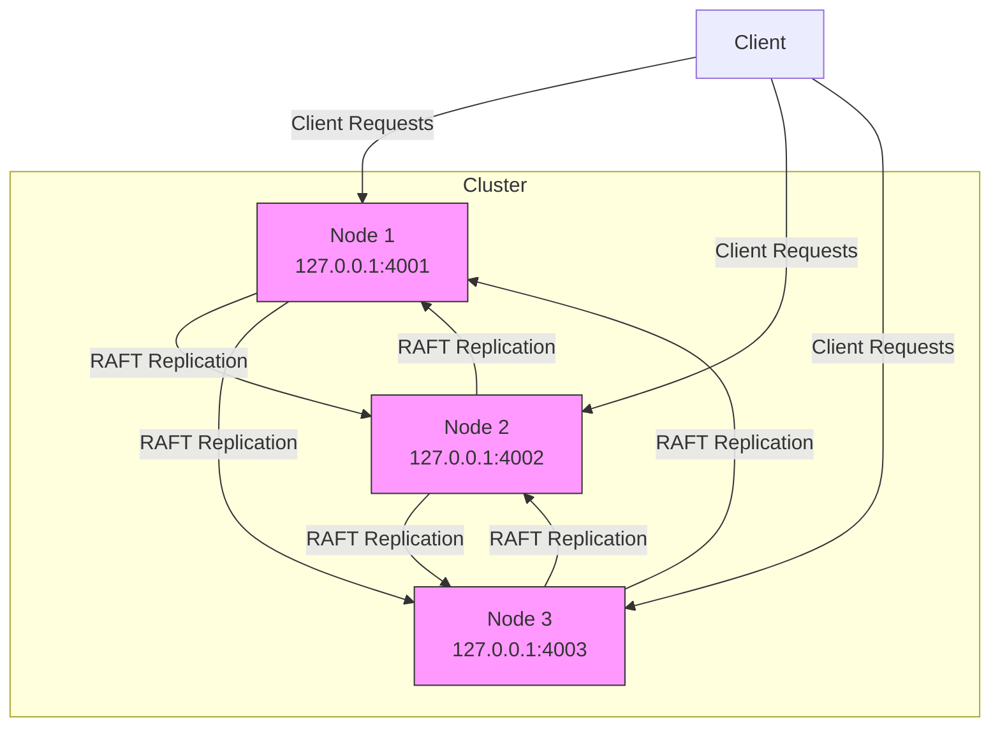

# Server Configuration and Deployment

<cite>
**Referenced Files in This Document**   
- [RaftServer.java](file://server/src/main/java/com/github/dtprj/dongting/raft/server/RaftServer.java)
- [RaftServerConfig.java](file://server/src/main/java/com/github/dtprj/dongting/raft/server/RaftServerConfig.java)
- [RaftGroupConfig.java](file://server/src/main/java/com/github/dtprj/dongting/raft/server/RaftGroupConfig.java)
- [KvServerUtil.java](file://server/src/main/java/com/github/dtprj/dongting/dtkv/server/KvServerUtil.java)
- [KvServerConfig.java](file://server/src/main/java/com/github/dtprj/dongting/dtkv/server/KvServerConfig.java)
- [DefaultRaftFactory.java](file://server/src/main/java/com/github/dtprj/dongting/raft/server/DefaultRaftFactory.java)
- [DemoKvServerBase.java](file://demos/src/main/java/com/github/dtprj/dongting/demos/base/DemoKvServerBase.java)
- [DemoServer1.java](file://demos/src/main/java/com/github/dtprj/dongting/demos/cluster/DemoServer1.java)
- [logback-server.xml](file://dist/src/conf/logback-server.xml)
</cite>

## Table of Contents
1. [Introduction](#introduction)
2. [Raft Server Configuration](#raft-server-configuration)
3. [RAID Group Configuration](#raid-group-configuration)
4. [Server Initialization and Shutdown](#server-initialization-and-shutdown)
5. [Multi-Node Cluster Configuration](#multi-node-cluster-configuration)
6. [Storage and Persistence](#storage-and-persistence)
7. [Resource Allocation and Performance Tuning](#resource-allocation-and-performance-tuning)
8. [Monitoring and Metrics](#monitoring-and-metrics)
9. [High Availability and Disaster Recovery](#high-availability-and-disaster-recovery)
10. [Logging Configuration](#logging-configuration)
11. [Sample Configuration Files](#sample-configuration-files)

## Introduction
This document provides comprehensive guidance on configuring and deploying the Dongting server in production environments. It covers the core configuration parameters for the Raft consensus algorithm, server initialization procedures, multi-node cluster setup, and production deployment best practices. The document focuses on the RaftServer and KvServer components, detailing their configuration options, initialization sequences, and operational parameters for building reliable distributed systems.

## Raft Server Configuration
The RaftServer configuration is managed through the RaftServerConfig class, which defines the fundamental parameters for server operation, network communication, and consensus algorithm behavior. Key configuration parameters include election timeouts, heartbeat intervals, network ports, and node identification.

The RaftServerConfig class contains several critical parameters that control the behavior of the Raft consensus algorithm. The `electTimeout` parameter (default: 15,000ms) determines the duration a follower will wait before initiating a leader election when no heartbeat is received. The `heartbeatInterval` parameter (default: 2,000ms) controls how frequently the leader sends heartbeats to maintain its leadership. These parameters should be tuned based on network conditions and desired failover times.

Network configuration is handled through the `replicatePort` (used for inter-server communication and admin commands) and `servicePort` (used for client access, with 0 indicating no client service). The `nodeId` uniquely identifies each server in the cluster, while the `servers` parameter contains the list of all server addresses in the format "nodeId,host:port;...". The `rpcTimeout` (default: 5,000ms) and `connectTimeout` (default: 2,000ms) parameters control RPC communication timeouts.


**Diagram sources**
- [RaftServerConfig.java](file://server/src/main/java/com/github/dtprj/dongting/raft/server/RaftServerConfig.java#L21-L39)

**Section sources**
- [RaftServerConfig.java](file://server/src/main/java/com/github/dtprj/dongting/raft/server/RaftServerConfig.java#L21-L39)
- [RaftServer.java](file://server/src/main/java/com/github/dtprj/dongting/raft/server/RaftServer.java#L95-L119)

## RAID Group Configuration
RAID group configuration is managed through the RaftGroupConfig class, which defines parameters for individual RAFT groups including storage paths, replication settings, and performance tuning options. Each RAFT group operates independently with its own configuration, allowing for flexible deployment topologies.

The RaftGroupConfig class defines several important parameters for group operation. The `groupId` uniquely identifies the group, while `nodeIdOfMembers` and `nodeIdOfObservers` specify the member and observer nodes respectively. Storage configuration is controlled by the `dataDir` parameter (default: "./data") which specifies the directory for storing RAFT logs and snapshots, and `statusFile` (default: "raft.status") for storing node status information.

Performance and reliability parameters include `syncForce` (default: true) which controls whether fsync is called after writes for durability, and various cache and buffer settings. The `maxReplicateItems` (default: 50,000) and `maxReplicateBytes` (default: 16MB) parameters control batch replication size, while `maxPendingTasks` (default: 2,000) and `maxPendingTaskBytes` (default: 256MB) limit the in-memory queue size for pending operations.


**Diagram sources**
- [RaftGroupConfig.java](file://server/src/main/java/com/github/dtprj/dongting/raft/server/RaftGroupConfig.java#L24-L75)

**Section sources**
- [RaftGroupConfig.java](file://server/src/main/java/com/github/dtprj/dongting/raft/server/RaftGroupConfig.java#L24-L75)
- [RaftServer.java](file://server/src/main/java/com/github/dtprj/dongting/raft/server/RaftServer.java#L212-L250)

## Server Initialization and Shutdown
Server initialization and shutdown are managed through the KvServerUtil helper class, which provides methods for integrating the KV server functionality with the Raft server. The initialization process follows a specific sequence to ensure proper setup of all components before the server becomes operational.

The KvServerUtil class provides the `initKvServer` method which registers all KV-related RPC processors with the Raft server's NioServer. This method must be called after RaftServer initialization but before starting the server. It registers processors for various KV operations including GET, PUT, REMOVE, MKDIR, LIST, BATCH operations, CAS, lock management, and watch functionality.

The server startup sequence involves creating the RaftServer instance with appropriate configurations, initializing the KV server components via KvServerUtil.initKvServer(), and then starting the server. The shutdown process is handled automatically by the RaftServer's doStop method, which gracefully terminates all fiber groups, saves snapshots if configured, and closes all resources in the proper order.


**Diagram sources**
- [KvServerUtil.java](file://server/src/main/java/com/github/dtprj/dongting/dtkv/server/KvServerUtil.java#L52-L76)
- [RaftServer.java](file://server/src/main/java/com/github/dtprj/dongting/raft/server/RaftServer.java#L331-L372)

**Section sources**
- [KvServerUtil.java](file://server/src/main/java/com/github/dtprj/dongting/dtkv/server/KvServerUtil.java#L52-L76)
- [RaftServer.java](file://server/src/main/java/com/github/dtprj/dongting/raft/server/RaftServer.java#L331-L372)

## Multi-Node Cluster Configuration
Multi-node cluster configuration is achieved through proper setup of server addresses, node roles, and network parameters. The system supports both member nodes that participate in consensus and observer nodes that receive replicated data without voting rights.

The cluster configuration is defined through the `servers` parameter in RaftServerConfig, which lists all nodes in the cluster with their IDs and network addresses in the format "nodeId,host:port;...". Each node in the cluster must have a unique `nodeId` that matches one of the IDs in the servers list. The `replicatePort` is used for inter-node communication for RAFT replication and administrative commands.

For multi-node deployment, each server instance must be configured with the complete list of servers in the cluster, its own node ID, and the appropriate replicate and service ports. Member nodes are specified in the `nodeIdOfMembers` parameter of RaftGroupConfig, while observer nodes are specified in `nodeIdOfObservers`. The system automatically handles node discovery and connection management through periodic ping operations.



**Diagram sources**
- [DemoServer1.java](file://demos/src/main/java/com/github/dtprj/dongting/demos/cluster/DemoServer1.java#L27-L30)
- [DemoServer2.java](file://demos/src/main/java/com/github/dtprj/dongting/demos/cluster/DemoServer2.java#L27-L30)
- [DemoServer3.java](file://demos/src/main/java/com/github/dtprj/dongting/demos/cluster/DemoServer3.java#L27-L30)

**Section sources**
- [DemoKvServerBase.java](file://demos/src/main/java/com/github/dtprj/dongting/demos/base/DemoKvServerBase.java#L38-L47)
- [RaftServer.java](file://server/src/main/java/com/github/dtprj/dongting/raft/server/RaftServer.java#L126-L139)

## Storage and Persistence
Storage and persistence configuration focuses on durable data storage, snapshot management, and log retention policies. The system provides configurable options for data directory location, snapshot frequency, and log compaction to balance performance and durability requirements.

Data persistence is managed through the `dataDir` parameter in RaftGroupConfig, which specifies the directory for storing RAFT logs, snapshots, and status information. The system automatically creates subdirectories for each RAFT group within the specified data directory. The `statusFile` parameter (default: "raft.status") specifies the file name for storing node status information.

Snapshot management is controlled by several parameters: `saveSnapshotSeconds` (default: 3600) determines how frequently snapshots are automatically saved, `maxKeepSnapshots` (default: 2) limits the number of recent snapshots to retain, and `saveSnapshotWhenClose` (default: true) controls whether a snapshot is saved during graceful shutdown. The `deleteLogsAfterTakeSnapshot` parameter (default: true) enables log compaction after successful snapshot creation.


**Diagram sources**
- [RaftGroupConfig.java](file://server/src/main/java/com/github/dtprj/dongting/raft/server/RaftGroupConfig.java#L28-L30)
- [RaftGroupConfig.java](file://server/src/main/java/com/github/dtprj/dongting/raft/server/RaftGroupConfig.java#L59-L65)
- [DefaultRaftFactory.java](file://server/src/main/java/com/github/dtprj/dongting/raft/server/DefaultRaftFactory.java#L94-L99)

**Section sources**
- [RaftGroupConfig.java](file://server/src/main/java/com/github/dtprj/dongting/raft/server/RaftGroupConfig.java#L28-L30)
- [RaftGroupConfig.java](file://server/src/main/java/com/github/dtprj/dongting/raft/server/RaftGroupConfig.java#L59-L65)
- [DefaultRaftFactory.java](file://server/src/main/java/com/github/dtprj/dongting/raft/server/DefaultRaftFactory.java#L94-L99)

## Resource Allocation and Performance Tuning
Resource allocation and performance tuning involve configuring thread pools, memory usage, and I/O parameters to optimize server performance for specific workloads and hardware configurations. The system provides several parameters to control resource utilization and performance characteristics.

The `blockIoThreads` parameter in RaftServerConfig (default: max(availableProcessors * 2, 4)) controls the number of threads dedicated to blocking I/O operations such as disk reads and writes. This shared thread pool is used across all RAFT groups on the server. The DefaultRaftFactory manages this shared executor, incrementing its usage count when new groups are created and shutting it down when the last group is removed.

Performance tuning parameters in RaftGroupConfig include various cache sizes and thresholds. The `idxCacheSize` (default: 16,000) and `idxFlushThreshold` (default: 8,000) control the in-memory index cache for log entries, while `maxCacheTasks` (default: 50,000) and `maxCacheTaskBytes` (default: 256MB) limit the memory used for caching pending tasks. The `snapshotConcurrency` and `diskSnapshotConcurrency` parameters control parallelism during snapshot operations.


**Diagram sources**
- [RaftServerConfig.java](file://server/src/main/java/com/github/dtprj/dongting/raft/server/RaftServerConfig.java#L37)
- [RaftGroupConfig.java](file://server/src/main/java/com/github/dtprj/dongting/raft/server/RaftGroupConfig.java#L39-L43)
- [RaftGroupConfig.java](file://server/src/main/java/com/github/dtprj/dongting/raft/server/RaftGroupConfig.java#L53-L57)
- [DefaultRaftFactory.java](file://server/src/main/java/com/github/dtprj/dongting/raft/server/DefaultRaftFactory.java#L58-L73)

**Section sources**
- [RaftServerConfig.java](file://server/src/main/java/com/github/dtprj/dongting/raft/server/RaftServerConfig.java#L37)
- [RaftGroupConfig.java](file://server/src/main/java/com/github/dtprj/dongting/raft/server/RaftGroupConfig.java#L39-L43)
- [RaftGroupConfig.java](file://server/src/main/java/com/github/dtprj/dongting/raft/server/RaftGroupConfig.java#L53-L57)
- [DefaultRaftFactory.java](file://server/src/main/java/com/github/dtprj/dongting/raft/server/DefaultRaftFactory.java#L58-L73)

## Monitoring and Metrics
Monitoring and performance metrics are supported through the PerfCallback mechanism and server status endpoints. The system provides built-in monitoring capabilities to track server health, performance, and operational metrics.

The RaftGroupConfig class includes a `perfCallback` parameter (default: NoopPerfCallback.INSTANCE) that allows for custom performance monitoring. Implementations of PerfCallback can capture various performance metrics such as request processing times, queue lengths, and system throughput. The system also provides built-in status endpoints accessible through the RaftServer's queryRaftGroupStatus method, which returns detailed information about the current state of each RAFT group.

The KvServerConfig class includes several parameters related to monitoring and performance: `watchDispatchIntervalMillis` (default: 500) controls how frequently watch events are dispatched, `watchTimeoutMillis` (default: 120,000) sets the timeout for watch connections, and `watchMaxBatchSize` (default: 100) limits the number of watch events sent in a single batch. These parameters help prevent resource exhaustion from high-frequency watch operations.


**Diagram sources**
- [KvServerConfig.java](file://server/src/main/java/com/github/dtprj/dongting/dtkv/server/KvServerConfig.java#L21-L29)
- [RaftGroupConfig.java](file://server/src/main/java/com/github/dtprj/dongting/raft/server/RaftGroupConfig.java#L49)
- [RaftServer.java](file://server/src/main/java/com/github/dtprj/dongting/raft/server/RaftServer.java#L696-L713)

**Section sources**
- [KvServerConfig.java](file://server/src/main/java/com/github/dtprj/dongting/dtkv/server/KvServerConfig.java#L21-L29)
- [RaftGroupConfig.java](file://server/src/main/java/com/github/dtprj/dongting/raft/server/RaftGroupConfig.java#L49)
- [RaftServer.java](file://server/src/main/java/com/github/dtprj/dongting/raft/server/RaftServer.java#L696-L713)

## High Availability and Disaster Recovery
High availability and disaster recovery are ensured through the RAFT consensus algorithm's inherent fault tolerance, configurable quorum requirements, and automated failover mechanisms. The system provides features for node management, configuration changes, and backup strategies to maintain service continuity.

The system supports dynamic cluster reconfiguration through administrative APIs for adding and removing nodes and groups. The RaftServer provides methods such as `addNode`, `removeNode`, `addGroup`, and `removeGroup` that allow for runtime modification of the cluster topology. These operations are performed asynchronously and return CompletableFuture instances to monitor their completion.

For disaster recovery, the system relies on persistent storage of RAFT logs and periodic snapshots. The `saveSnapshotWhenClose` parameter ensures that a snapshot is saved during graceful shutdown, providing a recovery point. The `autoDeleteLogDelaySeconds` parameter (default: 60) introduces a delay before deleting logs after snapshot creation, providing a safety window for backup operations.


**Diagram sources**
- [RaftServer.java](file://server/src/main/java/com/github/dtprj/dongting/raft/server/RaftServer.java#L552-L666)
- [NodeManager.java](file://server/src/main/java/com/github/dtprj/dongting/raft/impl/NodeManager.java)

**Section sources**
- [RaftServer.java](file://server/src/main/java/com/github/dtprj/dongting/raft/server/RaftServer.java#L552-L666)

## Logging Configuration
Logging is configured through Logback with different configuration files for server and administrative components. The system provides structured logging with configurable output formats, levels, and destinations to support operational monitoring and troubleshooting.

The production logging configuration is defined in logback-server.xml, which sets up file-based logging with rolling file appender. The configuration writes logs to ${LOG_DIR}/dongting-server.log with automatic rotation when the file reaches 100MB, keeping up to 10 archived files. The log pattern includes timestamp, thread name, log level, logger name, and message for comprehensive diagnostic information.

The root logging level is set to INFO, providing a balance between verbosity and signal-to-noise ratio for production environments. Specific components can have different log levels configured as needed. The rolling file appender ensures that disk space usage is controlled while maintaining historical log data for troubleshooting and auditing purposes.

```xml
<configuration>
    <appender name="FILE" class="ch.qos.logback.core.rolling.RollingFileAppender">
        <file>${LOG_DIR}/dongting-server.log</file>
        <rollingPolicy class="ch.qos.logback.core.rolling.FixedWindowRollingPolicy">
            <fileNamePattern>${LOG_DIR}/dongting-server.%i.log</fileNamePattern>
            <minIndex>1</minIndex>
            <maxIndex>10</maxIndex>
        </rollingPolicy>
        <triggeringPolicy class="ch.qos.logback.core.rolling.SizeBasedTriggeringPolicy">
            <maxFileSize>100MB</maxFileSize>
        </triggeringPolicy>
        <encoder>
            <pattern>%d{yyyy-MM-dd HH:mm:ss.SSS} [%thread] %-5level %logger{36} - %msg%n</pattern>
        </encoder>
    </appender>

    <root level="INFO">
        <appender-ref ref="FILE"/>
    </root>
</configuration>
```

**Section sources**
- [logback-server.xml](file://dist/src/conf/logback-server.xml#L1-L37)

## Sample Configuration Files
This section provides sample configuration files for different deployment environments, demonstrating how to configure the server for development, testing, and production scenarios.

For production deployment, the following RaftServerConfig settings are recommended:
- `electTimeout`: 15000 (15 seconds) for stable networks
- `heartbeatInterval`: 2000 (2 seconds) for timely leader detection
- `syncForce`: true for data durability
- `blockIoThreads`: default (auto-calculated) for optimal I/O parallelism
- `servicePort`: 5000+nodeId for client access
- `replicatePort`: 4000+nodeId for inter-node communication

For development and testing environments, more aggressive timeouts can be used to speed up election processes:
- `electTimeout`: 3000 (3 seconds) for faster failover
- `heartbeatInterval`: 1000 (1 second) for frequent heartbeats
- `syncForce`: false for improved performance (at the cost of durability)
- `watchTimeoutMillis`: 30000 (30 seconds) for shorter watch timeouts

The demo applications in the cluster package demonstrate a complete three-node cluster configuration with each node running on localhost with different ports. This configuration is suitable for development and testing, with each node having a unique nodeId, replicatePort, and servicePort, while sharing the same group configuration.

**Section sources**
- [DemoKvServerBase.java](file://demos/src/main/java/com/github/dtprj/dongting/demos/base/DemoKvServerBase.java#L38-L47)
- [RaftServerConfig.java](file://server/src/main/java/com/github/dtprj/dongting/raft/server/RaftServerConfig.java#L28-L37)
- [RaftGroupConfig.java](file://server/src/main/java/com/github/dtprj/dongting/raft/server/RaftGroupConfig.java#L31)
- [logback-server.xml](file://dist/src/conf/logback-server.xml#L1-L37)