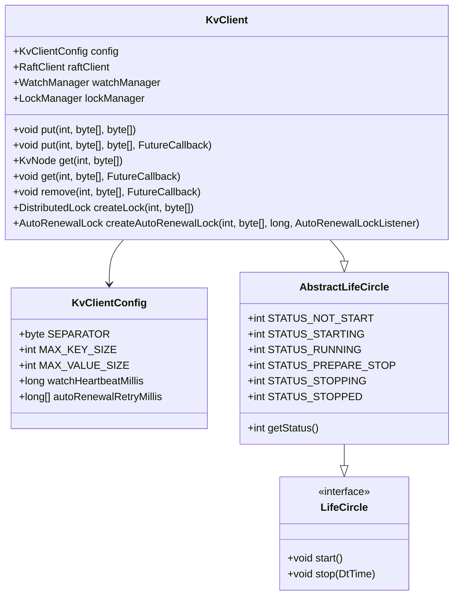
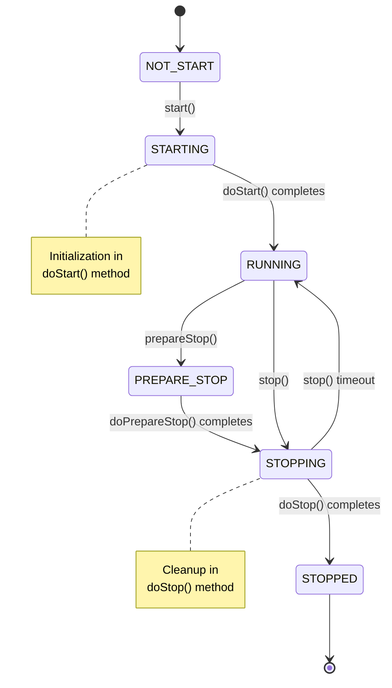
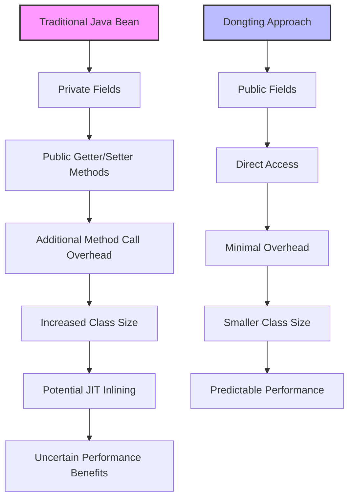
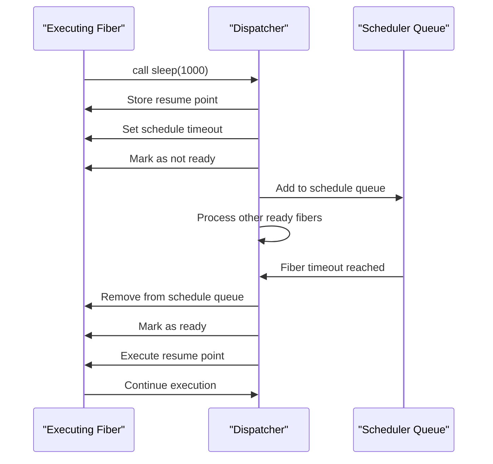
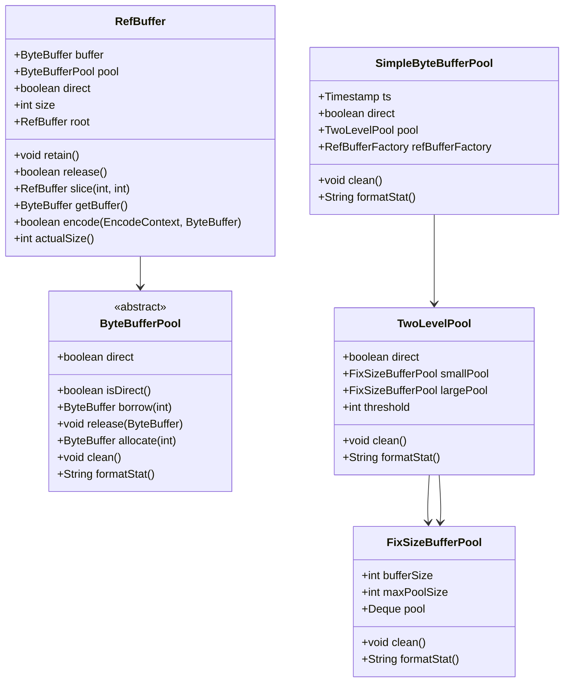
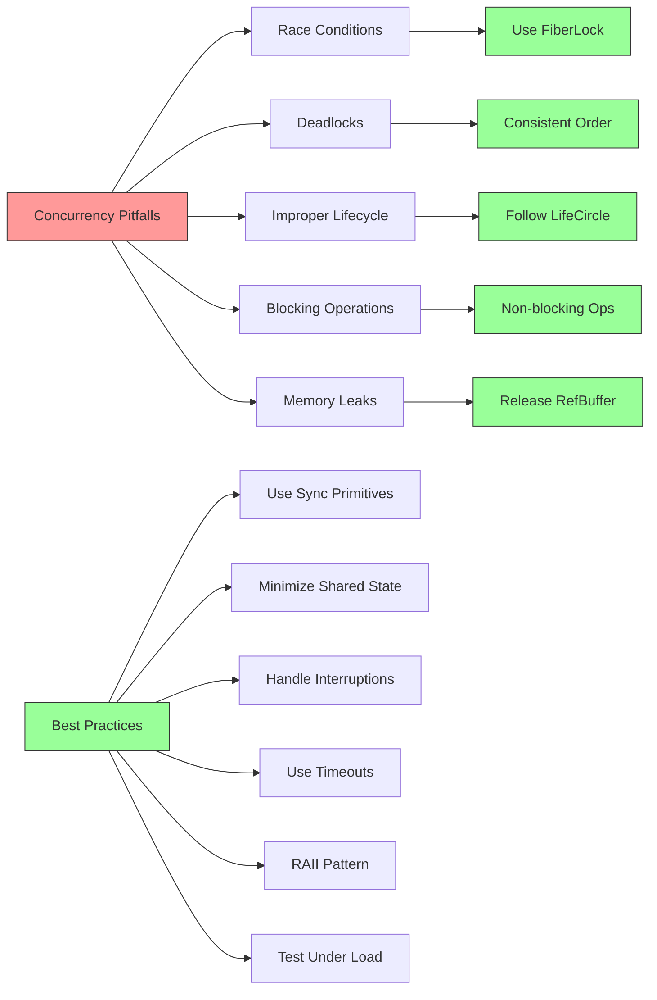
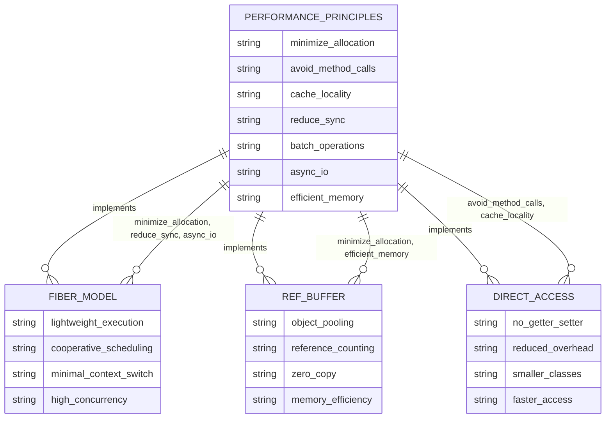

# API Usage and Concurrency Best Practices

<cite>
**Referenced Files in This Document**   
- [KvClient.java](file://client/src/main/java/com/github/dtprj/dongting/dtkv/KvClient.java)
- [KvClientConfig.java](file://client/src/main/java/com/github/dtprj/dongting/dtkv/KvClientConfig.java)
- [Fiber.java](file://server/src/main/java/com/github/dtprj/dongting/fiber/Fiber.java)
- [FiberGroup.java](file://server/src/main/java/com/github/dtprj/dongting/fiber/FiberGroup.java)
- [Dispatcher.java](file://server/src/main/java/com/github/dtprj/dongting/fiber/Dispatcher.java)
- [AbstractLifeCircle.java](file://client/src/main/java/com/github/dtprj/dongting/common/AbstractLifeCircle.java)
- [LifeCircle.java](file://client/src/main/java/com/github/dtprj/dongting/common/LifeCircle.java)
- [RefBuffer.java](file://client/src/main/java/com/github/dtprj/dongting/buf/RefBuffer.java)
- [ByteBufferPool.java](file://client/src/main/java/com/github/dtprj/dongting/buf/ByteBufferPool.java)
- [FiberException.java](file://server/src/main/java/com/github/dtprj/dongting/fiber/FiberException.java)
- [2025_03_21_关于getter和setter.md](file://devlogs/2025_03_21_关于getter和setter.md)
</cite>

## Table of Contents
1. [Introduction](#introduction)
2. [KvClient API Usage Patterns](#kvclient-api-usage-patterns)
3. [Fiber Concurrency Model](#fiber-concurrency-model)
4. [Lifecycle Management](#lifecycle-management)
5. [Direct Field Access Rationale](#direct-field-access-rationale)
6. [Non-blocking Operations and Scheduling](#non-blocking-operations-and-scheduling)
7. [Resource Management with RefBuffer](#resource-management-with-refbuffer)
8. [Error Handling and Exception Propagation](#error-handling-and-exception-propagation)
9. [Concurrency Pitfalls and Best Practices](#concurrency-pitfalls-and-best-practices)
10. [Performance-Oriented Design Principles](#performance-oriented-design-principles)

## Introduction
This document provides comprehensive guidance on proper API usage and concurrency patterns in Dongting applications. It covers best practices for using KvClient, Fiber, and lifecycle management interfaces, explaining the rationale behind direct field access in configuration classes as discussed in devlogs. The document details correct usage patterns for non-blocking operations, fiber scheduling, and resource cleanup, while addressing common concurrency pitfalls such as race conditions, deadlocks, and improper lifecycle management. It also provides guidance on error handling and exception propagation across asynchronous boundaries, with examples of efficient resource management using RefBuffer and object pooling.

**Section sources**
- [2025_03_21_关于getter和setter.md](file://devlogs/2025_03_21_关于getter和setter.md)

## KvClient API Usage Patterns

The KvClient class provides both synchronous and asynchronous methods for interacting with the distributed key-value store. All operations are linearizable and support lease-read semantics. The client offers a comprehensive API for basic operations like put, get, remove, and mkdir, as well as advanced operations like compare-and-set (CAS), batch operations, and distributed locking.

Synchronous methods block until completion and throw exceptions on failure, while asynchronous methods accept FutureCallback parameters that are executed upon completion. The asynchronous callbacks are executed in the NioClient's bizExecutor by default, or in the NioWorker thread if no bizExecutor is configured. This design allows for efficient non-blocking operations while maintaining thread safety.

The KvClient implements the LifeCircle interface, requiring explicit start() and stop() calls for proper lifecycle management. When starting, the client initializes its RaftClient dependency and registers processors for watch and lock notifications. During shutdown, it removes all watches and locks before stopping the underlying RaftClient.



**Diagram sources**
- [KvClient.java](file://client/src/main/java/com/github/dtprj/dongting/dtkv/KvClient.java#L52-L770)
- [KvClientConfig.java](file://client/src/main/java/com/github/dtprj/dongting/dtkv/KvClientConfig.java#L22-L31)
- [AbstractLifeCircle.java](file://client/src/main/java/com/github/dtprj/dongting/common/AbstractLifeCircle.java#L30-L180)
- [LifeCircle.java](file://client/src/main/java/com/github/dtprj/dongting/common/LifeCircle.java#L21-L27)

**Section sources**
- [KvClient.java](file://client/src/main/java/com/github/dtprj/dongting/dtkv/KvClient.java#L52-L770)
- [KvClientConfig.java](file://client/src/main/java/com/github/dtprj/dongting/dtkv/KvClientConfig.java#L22-L31)

## Fiber Concurrency Model

Dongting's fiber-based concurrency model provides a lightweight alternative to traditional thread-based concurrency. The Fiber class represents a lightweight execution unit that runs within a FiberGroup, which is managed by a Dispatcher. This model enables cooperative multitasking with minimal overhead compared to native threads.

A Fiber is created with an entry FiberFrame that defines its initial execution logic. The fiber executes its frames cooperatively, yielding control back to the dispatcher when performing blocking operations like I/O or waiting on conditions. This allows thousands of fibers to run efficiently on a small number of threads, significantly reducing memory overhead and context switching costs.

The FiberGroup manages a collection of fibers and provides synchronization primitives like FiberChannel, FiberCondition, and FiberLock. These primitives are designed to work seamlessly with the fiber execution model, allowing fibers to communicate and synchronize without blocking underlying threads.

```mermaid
classDiagram
class Fiber {
+boolean daemon
+long scheduleTimeout
+long scheduleNanoTime
+boolean started
+boolean ready
+boolean finished
+boolean interrupted
+WaitSource source
+FiberCondition[] sourceConditions
+FiberFrame stackTop
+Object inputObj
+Throwable inputEx
+short signalCountInEachRound
+int roundInfo
+void start()
+boolean isStarted()
+boolean isFinished()
+FrameCallResult join(FrameCall)
+FrameCallResult join(long, FrameCall)
+FiberFuture join()
+void interrupt()
}
class FiberGroup {
+ShareStatusSource shareStatusSource
+String name
+Dispatcher dispatcher
+CompletableFuture shutdownFuture
+FiberCondition shouldStopCondition
+IndexedQueue<Fiber> readyFibers
+IndexedQueue<Fiber> readyFibersNextRound1
+IndexedQueue<Fiber> readyFibersNextRound2
+IdentityHashMap<Fiber, Fiber> normalFibers
+IdentityHashMap<Fiber, Fiber> daemonFibers
+FiberChannel<Runnable> sysChannel
+boolean finished
+boolean ready
+GroupExecutor executor
+Fiber currentFiber
+boolean fireFiber(Fiber)
+boolean fireFiber(String, FiberFrame)
+void requestShutdown()
+FiberCondition newCondition(String)
+FiberFuture newFuture(String)
+FiberChannel newChannel()
+FiberLock newLock(String)
+ScheduledExecutorService getExecutor()
}
class Dispatcher {
+Timestamp ts
+PoolFactory poolFactory
+PerfCallback perfCallback
+FiberQueue shareQueue
+ArrayList<FiberGroup> groups
+ArrayList<FiberGroup> finishedGroups
+IndexedQueue<FiberGroup> readyGroups
+PriorityQueue<Fiber> scheduleQueue
+DispatcherThread thread
+boolean poll
+long pollTimeout
+boolean shouldStop
+long lastCleanNanos
+int round
+Throwable fatalError
+DtTime stopTimeout
+CompletableFuture startGroup(FiberGroup)
+void run()
+void runImpl(ArrayList)
+void processScheduleFibers()
+void cleanPool(long)
+void execGroup(FiberGroup)
+void execFiber(FiberGroup, Fiber)
+void execFrame(Fiber, FiberFrame)
+void setEx(FiberFrame, Throwable)
+void tryHandleEx(FiberFrame, Throwable)
+void call(FiberFrame, FrameCall)
+void resume(Object, Throwable, FrameCall)
+FrameCallResult awaitOn(WaitSource, long, FrameCall)
+FrameCallResult sleep(long, FrameCall)
+FrameCallResult yield(FrameCall)
+void removeFromScheduleQueue(Fiber)
+void interrupt(Fiber)
+void fill(Timestamp, ArrayList)
+boolean doInDispatcherThread(FiberQueueTask)
+int compareFiberByScheduleTime(Fiber, Fiber)
}
class DispatcherThread {
+Dispatcher dispatcher
+Runnable task
+String name
+RefBufferFactory heapPool
+ByteBufferPool directPool
+FiberGroup currentGroup
}
Fiber --> FiberGroup
FiberGroup --> Dispatcher
Dispatcher --> DispatcherThread
```



**Diagram sources**
- [Fiber.java](file://server/src/main/java/com/github/dtprj/dongting/fiber/Fiber.java#L27-L236)
- [FiberGroup.java](file://server/src/main/java/com/github/dtprj/dongting/fiber/FiberGroup.java#L34-L352)
- [Dispatcher.java](file://server/src/main/java/com/github/dtprj/dongting/fiber/Dispatcher.java#L45-L654)

**Section sources**
- [Fiber.java](file://server/src/main/java/com/github/dtprj/dongting/fiber/Fiber.java#L27-L236)
- [FiberGroup.java](file://server/src/main/java/com/github/dtprj/dongting/fiber/FiberGroup.java#L34-L352)
- [Dispatcher.java](file://server/src/main/java/com/github/dtprj/dongting/fiber/Dispatcher.java#L45-L654)

## Lifecycle Management

Dongting applications follow a consistent lifecycle management pattern through the LifeCircle interface and its AbstractLifeCircle implementation. This pattern ensures proper initialization and cleanup of resources, preventing memory leaks and ensuring graceful shutdown.

The lifecycle consists of five states: NOT_START, STARTING, RUNNING, PREPARE_STOP, and STOPPED. Components transition through these states in a controlled manner, with appropriate locking to prevent race conditions. The AbstractLifeCircle base class provides thread-safe state management and ensures that start() and stop() operations are idempotent.

During startup, components perform initialization in the doStart() method, which is called while holding a lock to prevent concurrent access. During shutdown, components first transition to PREPARE_STOP state, allowing them to prepare for shutdown by completing pending operations. They then transition to STOPPING state, where they perform cleanup in the doStop() method before finally reaching the STOPPED state.



**Diagram sources**
- [AbstractLifeCircle.java](file://client/src/main/java/com/github/dtprj/dongting/common/AbstractLifeCircle.java#L33-L38)
- [AbstractLifeCircle.java](file://client/src/main/java/com/github/dtprj/dongting/common/AbstractLifeCircle.java#L51-L72)
- [AbstractLifeCircle.java](file://client/src/main/java/com/github/dtprj/dongting/common/AbstractLifeCircle.java#L73-L136)

**Section sources**
- [AbstractLifeCircle.java](file://client/src/main/java/com/github/dtprj/dongting/common/AbstractLifeCircle.java#L30-L180)
- [LifeCircle.java](file://client/src/main/java/com/github/dtprj/dongting/common/LifeCircle.java#L21-L27)

## Direct Field Access Rationale

Dongting's design philosophy favors direct field access over getter/setter methods for configuration classes and performance-critical components. This approach, as discussed in the devlog "关于getter和setter.md", is motivated by performance considerations and code simplicity.

The primary rationale for direct field access is performance optimization. Getter and setter methods introduce additional method call overhead, which can accumulate significantly in high-throughput systems. While JIT compilers may inline these methods, this is not guaranteed and comes with its own costs in terms of compilation time and memory usage. Additionally, each getter and setter method increases the size of compiled classes, contributing to larger JAR files and increased memory footprint.

Direct field access also improves code readability and maintainability. In IDEs, finding references to a field is straightforward when using direct access, whereas getter/setter methods require searching for multiple method names. This simplifies code navigation and refactoring.

The design decision reflects Dongting's performance-oriented principles, prioritizing efficiency over strict encapsulation in cases where the benefits of encapsulation are minimal. Configuration classes and data transfer objects typically have simple, side-effect-free field access, making them ideal candidates for direct access.



**Diagram sources**
- [2025_03_21_关于getter和setter.md](file://devlogs/2025_03_21_关于getter和setter.md#L1-L41)

**Section sources**
- [2025_03_21_关于getter和setter.md](file://devlogs/2025_03_21_关于getter和setter.md#L1-L41)

## Non-blocking Operations and Scheduling

Dongting's fiber model enables efficient non-blocking operations through cooperative scheduling. Fibers yield control during I/O operations or when waiting for conditions, allowing other fibers to execute on the same thread. This approach maximizes resource utilization while maintaining the simplicity of synchronous programming models.

The Dispatcher class manages the execution of fibers across a single thread, processing ready fibers in each scheduling round. Fibers are scheduled based on their readiness and timeout requirements, with a priority queue managing timed operations. The scheduling algorithm balances fairness and efficiency, ensuring that fibers make progress while minimizing overhead.

Key non-blocking operations include:
- Fiber.sleep(): Suspends the fiber for a specified duration
- Fiber.yield(): Yields control to allow other fibers to run
- Fiber.join(): Waits for another fiber to complete
- Fiber.awaitOn(): Waits on a WaitSource with optional timeout

These operations are implemented through the fiber's execution frame stack, where the current frame's resume point is stored before yielding control. When the fiber becomes ready again, execution resumes at the stored resume point, creating the illusion of synchronous execution while maintaining non-blocking behavior.



**Diagram sources**
- [Fiber.java](file://server/src/main/java/com/github/dtprj/dongting/fiber/Fiber.java#L86-L94)
- [Dispatcher.java](file://server/src/main/java/com/github/dtprj/dongting/fiber/Dispatcher.java#L465-L475)
- [Dispatcher.java](file://server/src/main/java/com/github/dtprj/dongting/fiber/Dispatcher.java#L213-L236)

**Section sources**
- [Fiber.java](file://server/src/main/java/com/github/dtprj/dongting/fiber/Fiber.java#L86-L94)
- [Dispatcher.java](file://server/src/main/java/com/github/dtprj/dongting/fiber/Dispatcher.java#L465-L475)

## Resource Management with RefBuffer

Dongting employs an efficient resource management strategy using RefBuffer and object pooling to minimize garbage collection overhead and memory allocation costs. The RefBuffer class implements reference counting to manage the lifecycle of ByteBuffer resources, allowing for safe sharing and reuse.

RefBuffer instances are created from a ByteBufferPool, which provides pooled direct or heap buffers. Small buffers are allocated directly from the pool, while large buffers are borrowed, enabling efficient memory usage patterns. The reference counting mechanism ensures that buffers are only released back to the pool when no longer referenced, preventing premature deallocation.

The RefBuffer design supports slicing, where multiple RefBuffer instances can share the same underlying ByteBuffer with different views. The reference counting is managed at the root buffer level, ensuring that the underlying buffer is only released when all slices have been released.



**Diagram sources**
- [RefBuffer.java](file://client/src/main/java/com/github/dtprj/dongting/buf/RefBuffer.java#L28-L183)
- [ByteBufferPool.java](file://client/src/main/java/com/github/dtprj/dongting/buf/ByteBufferPool.java#L23-L45)
- [SimpleByteBufferPool.java](file://client/src/main/java/com/github/dtprj/dongting/buf/SimpleByteBufferPool.java)
- [TwoLevelPool.java](file://client/src/main/java/com/github/dtprj/dongting/buf/TwoLevelPool.java)
- [FixSizeBufferPool.java](file://client/src/main/java/com/github/dtprj/dongting/buf/FixSizeBufferPool.java)

**Section sources**
- [RefBuffer.java](file://client/src/main/java/com/github/dtprj/dongting/buf/RefBuffer.java#L28-L183)
- [ByteBufferPool.java](file://client/src/main/java/com/github/dtprj/dongting/buf/ByteBufferPool.java#L23-L45)

## Error Handling and Exception Propagation

Dongting's error handling model is designed to provide clear, actionable error information while maintaining performance. The framework distinguishes between business exceptions (KvException) and system exceptions (NetException, FiberException), allowing applications to handle different error types appropriately.

The FiberException class plays a crucial role in the concurrency model, providing virtual stack traces that show the fiber's execution path rather than the underlying thread's call stack. This is achieved through the addVirtualStackTrace method, which captures the fiber's frame stack and adds it as a suppressed exception. This approach provides meaningful debugging information without the overhead of traditional stack trace collection.

Exception propagation across asynchronous boundaries is handled through callback mechanisms. When an operation fails, the appropriate FutureCallback is invoked with the exception, allowing the application to handle errors in the context of the original operation. This pattern maintains the separation between computation and error handling while ensuring that errors are not silently ignored.

```mermaid
flowchart TD
A[Fiber Execution] --> B{Error Occurs?}
B --> |Yes| C[Create FiberException]
C --> D[Add Virtual Stack Trace]
D --> E[Propagate to Frame]
E --> F[Handle in catch block]
F --> G[Call handle() method]
G --> H{Handled?}
H --> |No| I[Set frameEx]
I --> J[Propagate to Caller]
J --> K[Resume with Exception]
K --> L[Callback with Failure]
B --> |No| M[Continue Execution]
M --> N[Complete Successfully]
N --> O[Callback with Success]
style C fill:#f96,stroke:#333
style D fill:#f96,stroke:#333
style I fill:#f96,stroke:#333
style K fill:#f96,stroke:#333
```

**Diagram sources**
- [FiberException.java](file://server/src/main/java/com/github/dtprj/dongting/fiber/FiberException.java#L23-L84)
- [Fiber.java](file://server/src/main/java/com/github/dtprj/dongting/fiber/Fiber.java#L312-L369)
- [Dispatcher.java](file://server/src/main/java/com/github/dtprj/dongting/fiber/Dispatcher.java#L331-L370)

**Section sources**
- [FiberException.java](file://server/src/main/java/com/github/dtprj/dongting/fiber/FiberException.java#L23-L84)
- [Fiber.java](file://server/src/main/java/com/github/dtprj/dongting/fiber/Fiber.java#L312-L369)

## Concurrency Pitfalls and Best Practices

When developing Dongting applications, several concurrency pitfalls should be avoided to ensure correct and efficient operation. Understanding these pitfalls and following best practices is essential for building reliable distributed systems.

Common concurrency pitfalls include:
- **Race conditions**: Occur when multiple fibers access shared state without proper synchronization. Use FiberLock or other synchronization primitives to protect critical sections.
- **Deadlocks**: Can occur when fibers wait for resources held by each other. Always acquire locks in a consistent order and use timeouts when possible.
- **Improper lifecycle management**: Starting or stopping components without proper coordination can lead to resource leaks or undefined behavior. Always follow the LifeCircle pattern.
- **Blocking operations in fibers**: Performing blocking I/O or long-running computations in fibers can stall the entire dispatcher thread. Use non-blocking operations or offload work to thread pools.
- **Memory leaks**: Failing to release RefBuffer instances or not properly cleaning up resources can lead to memory exhaustion. Always ensure proper resource cleanup.

Best practices for Dongting applications include:
- Use fiber-local storage instead of thread-local storage
- Minimize shared state between fibers
- Use the provided synchronization primitives (FiberChannel, FiberCondition, FiberLock)
- Handle interruptions properly in long-running operations
- Use timeouts for all blocking operations
- Follow the RAII pattern for resource management
- Test under high load to identify performance bottlenecks



**Section sources**
- [Fiber.java](file://server/src/main/java/com/github/dtprj/dongting/fiber/Fiber.java#L138-L142)
- [FiberGroup.java](file://server/src/main/java/com/github/dtprj/dongting/fiber/FiberGroup.java#L132-L136)
- [AbstractLifeCircle.java](file://client/src/main/java/com/github/dtprj/dongting/common/AbstractLifeCircle.java#L74-L136)
- [RefBuffer.java](file://client/src/main/java/com/github/dtprj/dongting/buf/RefBuffer.java#L92-L121)

## Performance-Oriented Design Principles

Dongting's architecture embodies several performance-oriented design principles that contribute to its efficiency and scalability. These principles guide the implementation of all components and should be followed when developing applications on the platform.

Key design principles include:
- **Minimize object allocation**: Use object pooling and reuse patterns to reduce GC pressure
- **Avoid unnecessary method calls**: Use direct field access and inline critical paths
- **Optimize for cache locality**: Structure data and code to maximize CPU cache utilization
- **Reduce synchronization overhead**: Use lock-free or low-contention synchronization where possible
- **Batch operations**: Combine multiple operations to amortize overhead costs
- **Asynchronous I/O**: Use non-blocking operations to maximize throughput
- **Efficient memory management**: Use direct buffers and reference counting for zero-copy operations

The fiber concurrency model exemplifies these principles by providing lightweight execution units that minimize context switching and memory overhead. The RefBuffer system demonstrates efficient memory management through pooling and reference counting. Direct field access in configuration classes reduces method call overhead and class size.

These principles work together to create a high-performance foundation for distributed applications, enabling Dongting to achieve low latency and high throughput in demanding environments.



**Diagram sources**
- [Fiber.java](file://server/src/main/java/com/github/dtprj/dongting/fiber/Fiber.java)
- [RefBuffer.java](file://client/src/main/java/com/github/dtprj/dongting/buf/RefBuffer.java)
- [2025_03_21_关于getter和setter.md](file://devlogs/2025_03_21_关于getter和setter.md)

**Section sources**
- [Fiber.java](file://server/src/main/java/com/github/dtprj/dongting/fiber/Fiber.java)
- [RefBuffer.java](file://client/src/main/java/com/github/dtprj/dongting/buf/RefBuffer.java)
- [2025_03_21_关于getter和setter.md](file://devlogs/2025_03_21_关于getter和setter.md)