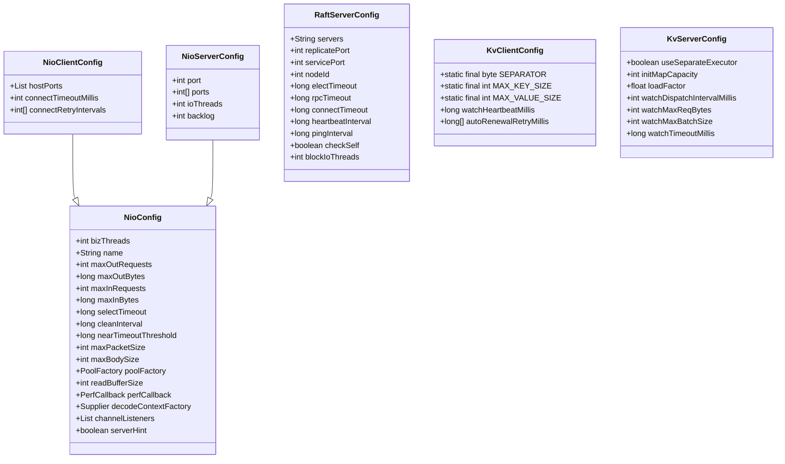
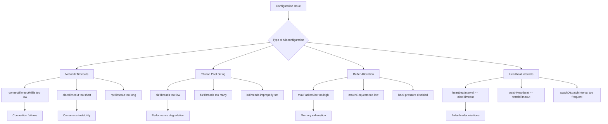
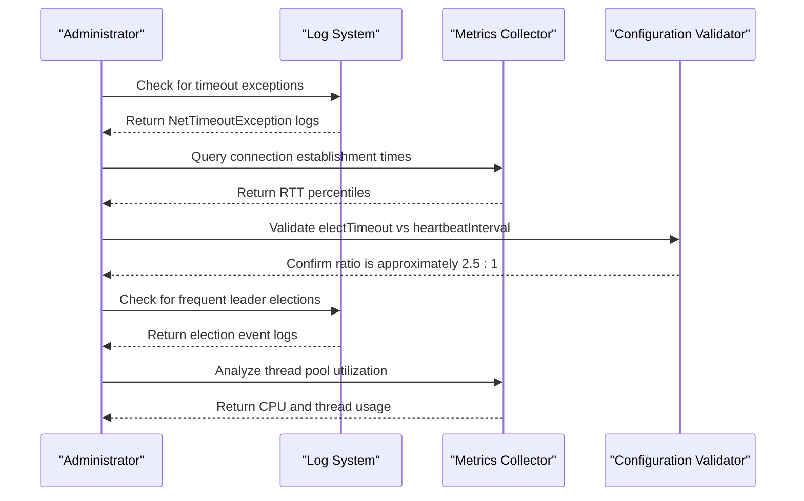
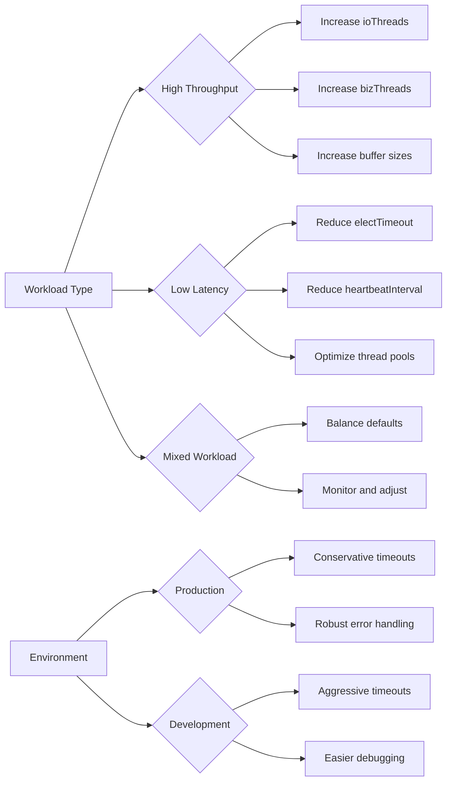

# Configuration Troubleshooting

<cite>
**Referenced Files in This Document**   
- [NioClientConfig.java](file://client/src/main/java/com/github/dtprj/dongting/net/NioClientConfig.java)
- [NioServerConfig.java](file://client/src/main/java/com/github/dtprj/dongting/net/NioServerConfig.java)
- [RaftServerConfig.java](file://server/src/main/java/com/github/dtprj/dongting/raft/server/RaftServerConfig.java)
- [KvClientConfig.java](file://client/src/main/java/com/github/dtprj/dongting/dtkv/KvClientConfig.java)
- [KvServerConfig.java](file://server/src/main/java/com/github/dtprj/dongting/dtkv/server/KvServerConfig.java)
- [NioConfig.java](file://client/src/main/java/com/github/dtprj/dongting/net/NioConfig.java)
- [RaftClientConfig.java](file://client/src/main/java/com/github/dtprj/dongting/raft/RaftClientConfig.java)
- [ServerWatchManager.java](file://server/src/main/java/com/github/dtprj/dongting/dtkv/server/ServerWatchManager.java)
- [2025_03_21_关于getter和setter.md](file://devlogs/2025_03_21_关于getter和setter.md)
- [AGENTS.md](file://AGENTS.md)
</cite>

## Table of Contents
1. [Introduction](#introduction)
2. [Configuration Architecture](#configuration-architecture)
3. [Common Misconfigurations](#common-misconfigurations)
4. [Diagnostic Methods](#diagnostic-methods)
5. [Best Practices](#best-practices)
6. [Public Field Access Implications](#public-field-access-implications)
7. [Build and Test Configuration](#build-and-test-configuration)
8. [Conclusion](#conclusion)

## Introduction

Dongting is a high-performance distributed system that relies heavily on proper configuration for stable operation. This document addresses configuration-related issues in Dongting, focusing on common misconfigurations in client and server setups. The analysis covers critical parameters such as network timeouts, thread pool sizing, buffer allocation, and heartbeat intervals that can significantly impact system stability and performance. Improper configuration values can lead to connection failures, consensus instability, or performance degradation. The document provides diagnostic steps for identifying configuration problems through log analysis and runtime metrics, along with best practices for setting key parameters based on workload and environment. It also examines the implications of public field access in configuration classes as discussed in development logs, and how this affects runtime behavior and debugging.

**Section sources**
- [NioClientConfig.java](file://client/src/main/java/com/github/dtprj/dongting/net/NioClientConfig.java#L1-L44)
- [NioServerConfig.java](file://client/src/main/java/com/github/dtprj/dongting/net/NioServerConfig.java#L1-L67)
- [RaftServerConfig.java](file://server/src/main/java/com/github/dtprj/dongting/raft/server/RaftServerConfig.java#L1-L40)

## Configuration Architecture

Dongting's configuration system is organized hierarchically with base configuration classes extended by specific components. The core configuration architecture consists of several key classes that govern different aspects of the system's behavior.

The `NioConfig` class serves as the base configuration for network operations, containing common parameters for both client and server configurations. It defines back pressure settings, buffer sizes, and performance monitoring callbacks. The `NioClientConfig` extends `NioConfig` with client-specific parameters such as connection timeout and retry intervals, while `NioServerConfig` extends it with server-specific parameters like port configuration and IO thread count.

For the Raft consensus algorithm, `RaftServerConfig` defines critical parameters including election timeout, RPC timeout, heartbeat interval, and ping interval. These parameters are essential for maintaining cluster stability and ensuring proper leader election. The distributed key-value store components use `KvClientConfig` and `KvServerConfig` to manage watch-related parameters such as heartbeat intervals, timeout values, and batch processing limits.

**Diagram sources**
- [NioConfig.java](file://client/src/main/java/com/github/dtprj/dongting/net/NioConfig.java#L1-L60)
- [NioClientConfig.java](file://client/src/main/java/com/github/dtprj/dongting/net/NioClientConfig.java#L1-L44)
- [NioServerConfig.java](file://client/src/main/java/com/github/dtprj/dongting/net/NioServerConfig.java#L1-L67)
- [RaftServerConfig.java](file://server/src/main/java/com/github/dtprj/dongting/raft/server/RaftServerConfig.java#L1-L40)
- [KvClientConfig.java](file://client/src/main/java/com/github/dtprj/dongting/dtkv/KvClientConfig.java#L1-L32)
- [KvServerConfig.java](file://server/src/main/java/com/github/dtprj/dongting/dtkv/server/KvServerConfig.java#L1-L30)

**Section sources**
- [NioConfig.java](file://client/src/main/java/com/github/dtprj/dongting/net/NioConfig.java#L1-L60)
- [NioClientConfig.java](file://client/src/main/java/com/github/dtprj/dongting/net/NioClientConfig.java#L1-L44)
- [NioServerConfig.java](file://client/src/main/java/com/github/dtprj/dongting/net/NioServerConfig.java#L1-L67)
- [RaftServerConfig.java](file://server/src/main/java/com/github/dtprj/dongting/raft/server/RaftServerConfig.java#L1-L40)
- [KvClientConfig.java](file://client/src/main/java/com/github/dtprj/dongting/dtkv/KvClientConfig.java#L1-L32)
- [KvServerConfig.java](file://server/src/main/java/com/github/dtprj/dongting/dtkv/server/KvServerConfig.java#L1-L30)

## Common Misconfigurations

### Network Timeouts

Improper timeout configurations are among the most common issues in Dongting deployments. The `connectTimeoutMillis` parameter in `NioClientConfig` defaults to 3000 milliseconds, which may be insufficient in high-latency networks. Setting this value too low can cause frequent connection failures during startup or network fluctuations. Conversely, setting it too high can delay the detection of actual network issues, prolonging recovery times.

The `electTimeout` parameter in `RaftServerConfig` (default: 15,000 milliseconds) and `rpcTimeout` (default: 5,000 milliseconds) must be carefully balanced. If the election timeout is too short relative to the RPC timeout, it can lead to unnecessary leader elections and consensus instability. The relationship between these parameters should maintain the principle that RPC operations should complete well within the election timeout period to prevent false leader elections.

### Thread Pool Sizing

Thread pool configuration is critical for system performance. The `bizThreads` parameter in both client and server configurations is automatically calculated based on available processors, with client defaulting to 4-8 threads and server to 6-16 threads. Misconfigurations occur when users override these defaults without considering their workload characteristics. Setting too few business threads can create bottlenecks under high load, while excessive threads can cause context switching overhead and memory pressure.

The `ioThreads` parameter in `NioServerConfig` is calculated based on processor count, with a maximum of 8 threads even on systems with more than 100 processors. This conservative approach prevents excessive thread creation but may be suboptimal for high-throughput scenarios. Users sometimes incorrectly increase this value without understanding the underlying NIO selector model, leading to diminishing returns or even performance degradation.

### Buffer Allocation

Buffer configuration parameters such as `maxPacketSize` (5MB default) and `maxBodySize` (4MB default) in `NioConfig` can cause issues when misconfigured. Setting these values too high can lead to excessive memory consumption, especially under high connection concurrency. Setting them too low can prevent legitimate large messages from being processed, causing protocol errors.

The back pressure configuration parameters (`maxOutRequests`, `maxOutBytes`, `maxInRequests`, `maxInBytes`) control flow control between peers. The server configuration sets `maxOutRequests` and `maxOutBytes` to zero (unlimited) while limiting inbound requests, which is appropriate for server roles. Misconfiguring these values, particularly on clients, can lead to resource exhaustion or denial of service conditions.

### Heartbeat Intervals

Heartbeat configuration is crucial for distributed system stability. The `heartbeatInterval` in `RaftServerConfig` (2000 milliseconds default) should be approximately 40% of the `electTimeout` to ensure timely leader detection without excessive network traffic. The watch mechanism uses `watchHeartbeatMillis` in `KvClientConfig` (60,000 milliseconds) and `watchTimeoutMillis` in `KvServerConfig` (120,000 milliseconds), with the server timeout required to be greater than the client heartbeat interval.

Common misconfigurations include setting the client heartbeat interval equal to or greater than the server timeout, which causes legitimate clients to be prematurely disconnected. Another issue is configuring the `watchDispatchIntervalMillis` (500 milliseconds default) too aggressively, causing excessive CPU usage in the dispatch loop.

**Diagram sources**
- [NioClientConfig.java](file://client/src/main/java/com/github/dtprj/dongting/net/NioClientConfig.java#L1-L44)
- [NioServerConfig.java](file://client/src/main/java/com/github/dtprj/dongting/net/NioServerConfig.java#L1-L67)
- [RaftServerConfig.java](file://server/src/main/java/com/github/dtprj/dongting/raft/server/RaftServerConfig.java#L1-L40)
- [KvClientConfig.java](file://client/src/main/java/com/github/dtprj/dongting/dtkv/KvClientConfig.java#L1-L32)
- [KvServerConfig.java](file://server/src/main/java/com/github/dtprj/dongting/dtkv/server/KvServerConfig.java#L1-L30)

**Section sources**
- [NioClientConfig.java](file://client/src/main/java/com/github/dtprj/dongting/net/NioClientConfig.java#L1-L44)
- [NioServerConfig.java](file://client/src/main/java/com/github/dtprj/dongting/net/NioServerConfig.java#L1-L67)
- [RaftServerConfig.java](file://server/src/main/java/com/github/dtprj/dongting/raft/server/RaftServerConfig.java#L1-L40)
- [KvClientConfig.java](file://client/src/main/java/com/github/dtprj/dongting/dtkv/KvClientConfig.java#L1-L32)
- [KvServerConfig.java](file://server/src/main/java/com/github/dtprj/dongting/dtkv/server/KvServerConfig.java#L1-L30)

## Diagnostic Methods

### Log Analysis

Dongting's logging system, configured through AGENTS.md to use `com.github.dtprj.dongting.log.DtLog`, provides critical insights for diagnosing configuration issues. Key log patterns to monitor include:

- Connection timeout messages indicating `NetTimeoutException` when `connectTimeoutMillis` is too low
- Leader election logs showing frequent elections, suggesting improper `electTimeout` and `heartbeatInterval` ratios
- Back pressure warnings when inbound request limits are reached
- Watch disconnection messages indicating heartbeat interval mismatches

The `ServerWatchManager` class contains extensive logging for watch-related operations, including notification failures and retry attempts. Monitoring these logs helps identify configuration issues with `watchHeartbeatMillis`, `watchTimeoutMillis`, and `autoRenewalRetryMillis`.

### Runtime Metrics

Runtime metrics can be accessed through the `PerfCallback` interface configured in `NioConfig`. Key metrics to monitor include:

- Connection establishment times to validate `connectTimeoutMillis` appropriateness
- RPC round-trip times to ensure they are well below `rpcTimeout` values
- Thread pool utilization to verify `bizThreads` and `ioThreads` adequacy
- Memory usage patterns related to buffer allocation settings

The `ServerWatchManager` maintains internal state tracking for active watches, including failure counts and retry schedules. These metrics can be used to detect configuration issues with watch-related parameters.

### Configuration Validation

Dongting performs runtime validation of critical configuration parameters. For example, `RaftServer` validates that `serverConfig.servers` is not null and that `nodeId` and `replicatePort` are positive values. The `watchHeartbeatMillis` in `KvClientConfig` should be less than `watchTimeoutMillis` in `KvServerConfig`, as documented in the code comments.

When diagnosing configuration issues, examine the initialization patterns in test classes like `ServerTestBase` which demonstrate proper configuration setup. The test code shows how `heartbeatInterval` is typically set to 40% of `electTimeout` to maintain stability.

**Diagram sources**
- [ServerWatchManager.java](file://server/src/main/java/com/github/dtprj/dongting/dtkv/server/ServerWatchManager.java#L1-L735)
- [RaftServer.java](file://server/src/main/java/com/github/dtprj/dongting/raft/server/RaftServer.java#L103-L124)
- [ServerTestBase.java](file://server/src/test/java/com/github/dtprj/dongting/raft/server/ServerTestBase.java#L82-L115)

**Section sources**
- [ServerWatchManager.java](file://server/src/main/java/com/github/dtprj/dongting/dtkv/server/ServerWatchManager.java#L1-L735)
- [RaftServer.java](file://server/src/main/java/com/github/dtprj/dongting/raft/server/RaftServer.java#L103-L124)
- [ServerTestBase.java](file://server/src/test/java/com/github/dtprj/dongting/raft/server/ServerTestBase.java#L82-L115)
- [ConnectTest.java](file://client/src/test/java/com/github/dtprj/dongting/net/ConnectTest.java#L62-L91)

## Best Practices

### Network Timeout Configuration

For network timeouts, follow these guidelines:

- Set `connectTimeoutMillis` to at least 3-5 times the average network round-trip time
- Configure `electTimeout` between 10-30 seconds for production environments
- Ensure `rpcTimeout` is 2-3 times the 99th percentile RPC latency
- Maintain the relationship: `rpcTimeout` < `heartbeatInterval` < `electTimeout`

The default values in `RaftServerConfig` provide a good starting point, with `electTimeout` at 15 seconds and `heartbeatInterval` at 2 seconds (approximately 13% of election timeout, well below the recommended 40% threshold).

### Thread Pool Sizing

For thread pool configuration:

- Use the default `bizThreads` calculations unless specific workload characteristics require adjustment
- For high-throughput scenarios, consider increasing `ioThreads` but monitor for diminishing returns
- Ensure `blockIoThreads` in `RaftServerConfig` is at least 4, even on systems with few processors
- Monitor thread pool utilization and adjust based on actual workload patterns

The automatic calculation of `ioThreads` based on processor count in `NioServerConfig.calcIoThreads()` provides a balanced approach that prevents excessive thread creation while ensuring adequate concurrency.

### Buffer and Memory Configuration

For buffer and memory settings:

- Keep `maxPacketSize` and `maxBodySize` within reasonable limits (5MB and 4MB defaults are appropriate for most use cases)
- Configure `maxInRequests` and `maxInBytes` based on available memory and expected concurrency
- Use the server's default of unlimited outbound requests (`maxOutRequests = 0`) to prevent back pressure issues
- Set `readBufferSize` (128KB default) based on typical message sizes

### Heartbeat and Watch Configuration

For heartbeat and watch parameters:

- Ensure `watchHeartbeatMillis` (60 seconds default) is less than `watchTimeoutMillis` (120 seconds default)
- Configure `watchDispatchIntervalMillis` (500ms default) based on acceptable notification latency
- Set `watchMaxBatchSize` (100 default) to balance between efficiency and memory usage
- Use the default `autoRenewalRetryMillis` pattern of exponential backoff with {1000, 10000, 30000, 60000} milliseconds

The hierarchical relationship between client and server watch timeouts is critical: client heartbeat must be shorter than server timeout to maintain active connections, as documented in the code comments.

**Diagram sources**
- [NioClientConfig.java](file://client/src/main/java/com/github/dtprj/dongting/net/NioClientConfig.java#L1-L44)
- [NioServerConfig.java](file://client/src/main/java/com/github/dtprj/dongting/net/NioServerConfig.java#L1-L67)
- [RaftServerConfig.java](file://server/src/main/java/com/github/dtprj/dongting/raft/server/RaftServerConfig.java#L1-L40)
- [KvClientConfig.java](file://client/src/main/java/com/github/dtprj/dongting/dtkv/KvClientConfig.java#L1-L32)
- [KvServerConfig.java](file://server/src/main/java/com/github/dtprj/dongting/dtkv/server/KvServerConfig.java#L1-L30)

**Section sources**
- [NioClientConfig.java](file://client/src/main/java/com/github/dtprj/dongting/net/NioClientConfig.java#L1-L44)
- [NioServerConfig.java](file://client/src/main/java/com/github/dtprj/dongting/net/NioServerConfig.java#L1-L67)
- [RaftServerConfig.java](file://server/src/main/java/com/github/dtprj/dongting/raft/server/RaftServerConfig.java#L1-L40)
- [KvClientConfig.java](file://client/src/main/java/com/github/dtprj/dongting/dtkv/KvClientConfig.java#L1-L32)
- [KvServerConfig.java](file://server/src/main/java/com/github/dtprj/dongting/dtkv/server/KvServerConfig.java#L1-L30)

## Public Field Access Implications

The Dongting project deliberately uses public fields in configuration classes rather than traditional getter/setter methods, as discussed in the devlog "2025_03_21_关于getter和setter.md". This design choice has significant implications for both performance and debugging.

According to the devlog, the primary motivations for this approach are:

1. **Performance**: Direct field access eliminates the overhead of method calls, which is particularly important in high-performance systems. While JIT may inline simple getter/setter methods, this is not guaranteed and adds analysis overhead.

2. **Jar Size**: Eliminating getter/setter methods reduces the size of compiled classes. The devlog cites an example where adding getters/setters to `NioConfig` increased the class file size from 2,125 to 5,848 bytes.

3. **Development Efficiency**: Direct field access simplifies code navigation in IDEs, allowing easy finding of field references without searching through getter/setter methods.

4. **Philosophical Alignment**: The author argues that for simple data transfer objects like configuration classes, the traditional encapsulation benefits of getters/setters are minimal, especially when the classes are already exposed publicly.

The devlog acknowledges that this approach represents a departure from conventional Java practices but justifies it based on Dongting's goals of being "small and fast." The author notes that while getters/setters could theoretically allow adding logic like logging or validation, such use cases are rare in practice and often represent poor design ("flying wires").

This design choice affects debugging in several ways:

- **Easier Tracing**: Field access can be directly traced without intercepting getter/setter calls
- **Simpler Reflection**: Configuration inspection and modification through reflection is more straightforward
- **Reduced Complexity**: Call stacks are cleaner without getter/setter method invocations
- **Potential Risk**: The lack of encapsulation means invalid values can be assigned without validation, though this is mitigated by runtime validation in critical components

The devlog reveals that this was not an initial design decision but evolved over time as the author reconsidered the value of traditional encapsulation patterns in the context of high-performance systems.

**Section sources**
- [2025_03_21_关于getter和setter.md](file://devlogs/2025_03_21_关于getter和setter.md#L1-L41)
- [NioClientConfig.java](file://client/src/main/java/com/github/dtprj/dongting/net/NioClientConfig.java#L1-L44)
- [NioServerConfig.java](file://client/src/main/java/com/github/dtprj/dongting/net/NioServerConfig.java#L1-L67)

## Build and Test Configuration

The AGENTS.md file specifies the build and test configuration requirements for Dongting:

- **Codebase**: Java 11 (Java 8 for client module), Apache Maven 3.9, JUnit 5.13
- **Build**: `mvn clean package -DskipTests -Pmerge`
- **Test**: `mvn clean test -Dtick=5`
- **Logging**: Uses `com.github.dtprj.dongting.log.DtLog` with factory `com.github.dtprj.dongting.log.DtLogs`

These configuration requirements ensure consistent builds across environments. The use of different Java versions for client (Java 8) and the rest of the codebase (Java 11) reflects compatibility requirements with various deployment environments.

The test configuration includes the `-Dtick=5` parameter, which likely controls timing-related aspects of the tests, such as timeouts or retry intervals. This suggests that test configurations may need adjustment based on the execution environment's performance characteristics.

The logging configuration is particularly important for troubleshooting, as it determines the verbosity and format of diagnostic output. The specified logger implementation (`DtLog`) and factory (`DtLogs`) provide the foundation for the diagnostic methods described in the previous sections.

**Section sources**
- [AGENTS.md](file://AGENTS.md#L1-L12)

## Conclusion

Proper configuration is essential for the stable and efficient operation of Dongting. This document has covered the key configuration parameters related to network timeouts, thread pool sizing, buffer allocation, and heartbeat intervals, explaining how improper values can lead to connection failures, consensus instability, or performance degradation.

The diagnostic methods outlined—log analysis, runtime metrics monitoring, and configuration validation—provide a systematic approach to identifying and resolving configuration issues. By following the best practices for different workload types and environments, administrators can optimize Dongting's performance and reliability.

The unconventional use of public fields in configuration classes, as documented in the development logs, reflects Dongting's prioritization of performance and simplicity over traditional Java encapsulation patterns. While this approach may seem controversial, it aligns with the project's goals of being small and fast, and provides tangible benefits in terms of reduced overhead and simpler debugging.

By understanding these configuration aspects and their implications, users can effectively deploy and maintain Dongting systems that are both high-performing and resilient.