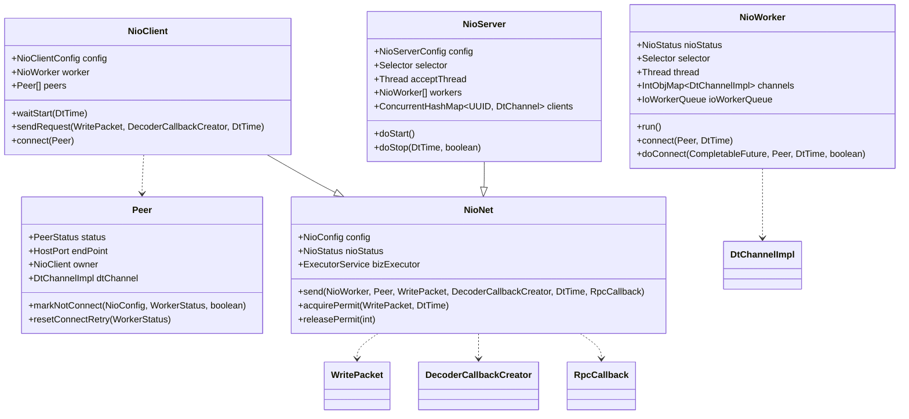
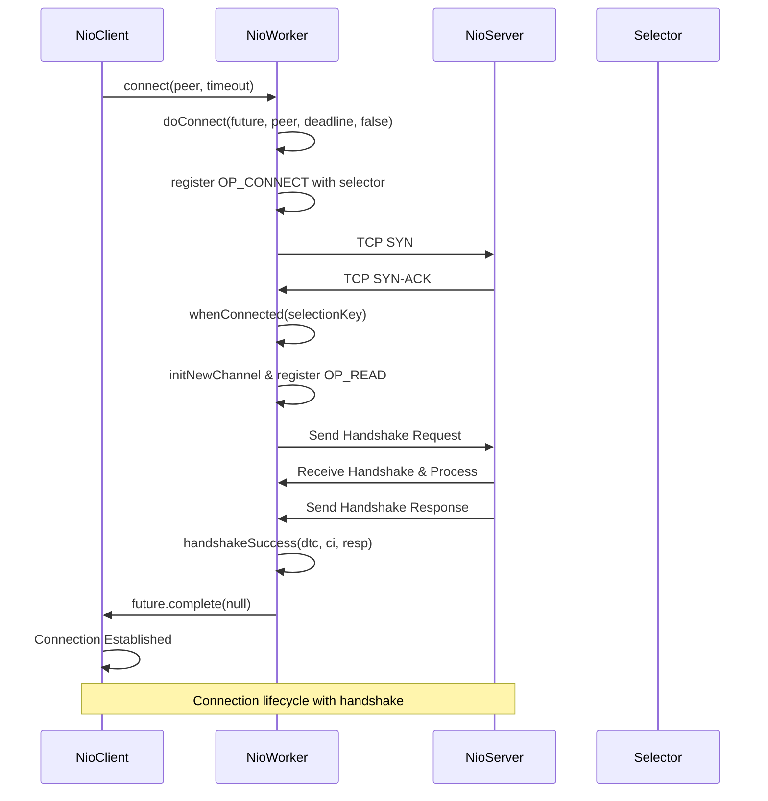
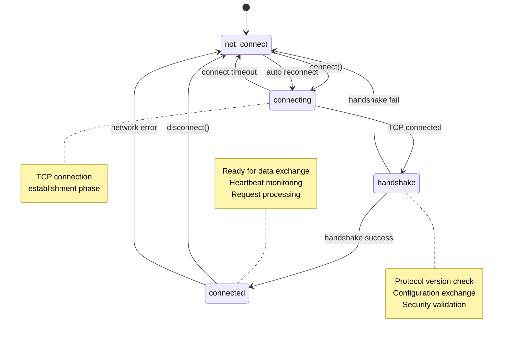
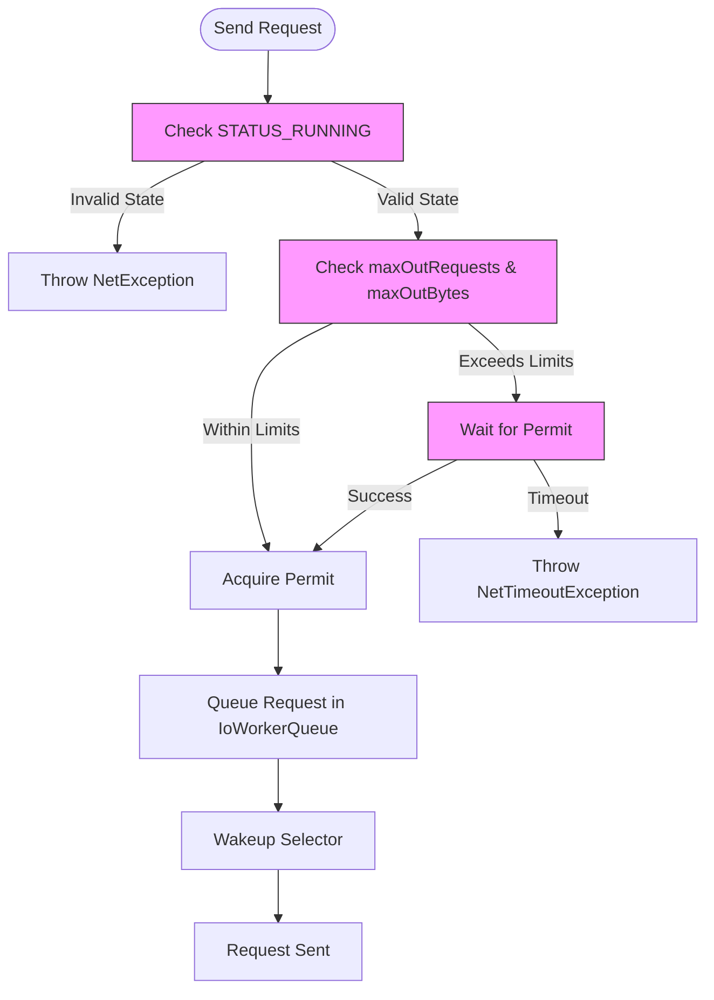

# Network Connectivity Issues

<cite>
**Referenced Files in This Document**   
- [NioClient.java](file://client/src/main/java/com/github/dtprj/dongting/net/NioClient.java)
- [NioServer.java](file://client/src/main/java/com/github/dtprj/dongting/net/NioServer.java)
- [NioWorker.java](file://client/src/main/java/com/github/dtprj/dongting/net/NioWorker.java)
- [NioNet.java](file://client/src/main/java/com/github/dtprj/dongting/net/NioNet.java)
- [Peer.java](file://client/src/main/java/com/github/dtprj/dongting/net/Peer.java)
- [ConnectTest.java](file://client/src/test/java/com/github/dtprj/dongting/net/ConnectTest.java)
- [TimeoutTest.java](file://client/src/test/java/com/github/dtprj/dongting/net/TimeoutTest.java)
- [HandshakeBody.java](file://client/src/main/java/com/github/dtprj/dongting/net/HandshakeBody.java)
- [ConfigBody.java](file://client/src/main/java/com/github/dtprj/dongting/net/ConfigBody.java)
- [NetException.java](file://client/src/main/java/com/github/dtprj/dongting/net/NetException.java)
- [NetTimeoutException.java](file://client/src/main/java/com/github/dtprj/dongting/net/NetTimeoutException.java)
- [NioClientConfig.java](file://client/src/main/java/com/github/dtprj/dongting/net/NioClientConfig.java)
- [NioServerConfig.java](file://client/src/main/java/com/github/dtprj/dongting/net/NioServerConfig.java)
- [2023_07_20_现代硬件下的IO程序开发.txt](file://devlogs/2023_07_20_现代硬件下的IO程序开发.txt)
</cite>

## Table of Contents
1. [Introduction](#introduction)
2. [Connection Management Architecture](#connection-management-architecture)
3. [Common Network Issues and Diagnostics](#common-network-issues-and-diagnostics)
4. [Handshake and Connection Lifecycle](#handshake-and-connection-lifecycle)
5. [Timeout and Flow Control Mechanisms](#timeout-and-flow-control-mechanisms)
6. [Configuration and Tuning](#configuration-and-tuning)
7. [Troubleshooting Procedures](#troubleshooting-procedures)
8. [Performance Optimization](#performance-optimization)
9. [Conclusion](#conclusion)

## Introduction

This document provides comprehensive guidance for diagnosing and resolving network connectivity problems in Dongting deployments. It covers critical issues such as connection timeouts, handshake failures, packet loss, and IO errors, with a focus on the NioClient and NioServer components that manage network connections. The document explains how to interpret network-related exceptions and logs to identify root causes, and provides troubleshooting procedures for common network issues including firewall, DNS, and latency problems. It also includes guidance on TCP settings and buffer size tuning for optimal performance, incorporating insights from modern hardware IO development as documented in the devlogs.

**Section sources**
- [NioClient.java](file://client/src/main/java/com/github/dtprj/dongting/net/NioClient.java#L1-L363)
- [NioServer.java](file://client/src/main/java/com/github/dtprj/dongting/net/NioServer.java#L1-L293)

## Connection Management Architecture

The Dongting network architecture is built around two primary components: NioClient and NioServer, which handle client-server communication using non-blocking I/O. The NioWorker class represents a single thread that manages multiple connections through a selector-based event loop. Each NioWorker maintains a selector for monitoring socket events and processes incoming and outgoing data.

The NioClient manages outbound connections to one or more servers, represented by Peer objects that track connection status and retry logic. The NioServer handles incoming connections, with multiple worker threads (NioWorker instances) distributing the load. The architecture uses a two-layer approach: the NioNet base class provides common functionality, while NioClient and NioServer extend it with client-specific and server-specific behaviors.

Connection state is managed through a well-defined lifecycle with states including not_connect, connecting, handshake, and connected. The system implements automatic reconnection with configurable retry intervals, allowing recovery from transient network failures.



**Diagram sources**
- [NioClient.java](file://client/src/main/java/com/github/dtprj/dongting/net/NioClient.java#L1-L363)
- [NioServer.java](file://client/src/main/java/com/github/dtprj/dongting/net/NioServer.java#L1-L293)
- [NioWorker.java](file://client/src/main/java/com/github/dtprj/dongting/net/NioWorker.java#L1-L809)
- [Peer.java](file://client/src/main/java/com/github/dtprj/dongting/net/Peer.java#L1-L132)
- [NioNet.java](file://client/src/main/java/com/github/dtprj/dongting/net/NioNet.java#L1-L301)

**Section sources**
- [NioClient.java](file://client/src/main/java/com/github/dtprj/dongting/net/NioClient.java#L1-L363)
- [NioServer.java](file://client/src/main/java/com/github/dtprj/dongting/net/NioServer.java#L1-L293)
- [NioWorker.java](file://client/src/main/java/com/github/dtprj/dongting/net/NioWorker.java#L1-L809)
- [Peer.java](file://client/src/main/java/com/github/dtprj/dongting/net/Peer.java#L1-L132)

## Common Network Issues and Diagnostics

### Connection Timeouts
Connection timeouts occur when a client cannot establish a connection to a server within the specified timeout period. The NioClient uses the connectTimeoutMillis configuration parameter (default 3000ms) to control this timeout. When a connection attempt exceeds this duration, a NetTimeoutException is thrown with the message "connect timeout".

The ConnectTest class demonstrates various timeout scenarios, including manual reconnection after timeout and automatic reconnection with retry intervals. The test cases show that when connectTimeoutMillis is set to a negative value, the connection attempt will fail immediately with a NetTimeoutException.

### Handshake Failures
Handshake failures occur during the initial protocol negotiation between client and server. The handshake process involves exchanging version information, UUIDs, and configuration parameters. Failures can result from:
- Version incompatibility (major/minor version mismatch)
- Magic number verification failure
- Invalid configuration parameters
- Network interruption during handshake

The HandshakeBody class contains the handshake protocol implementation, using magic numbers (MAGIC1 and MAGIC2) for protocol validation. If these values don't match, a NetException is thrown with "handshake failed" message.

### Packet Loss and IO Errors
Packet loss and IO errors are typically detected through socket exceptions during read or write operations. The NioWorker handles these in the processOneSelectionKey method, where IOExceptions trigger connection closure. The system logs these errors with context about the operation stage (e.g., "process socket read error").

IO errors can also occur during buffer management, particularly when using direct memory pools. The NioWorker uses ByteBufferPool instances for efficient buffer allocation and recycling, and errors in this process can lead to connection instability.



**Diagram sources**
- [NioClient.java](file://client/src/main/java/com/github/dtprj/dongting/net/NioClient.java#L1-L363)
- [NioWorker.java](file://client/src/main/java/com/github/dtprj/dongting/net/NioWorker.java#L1-L809)
- [NioServer.java](file://client/src/main/java/com/github/dtprj/dongting/net/NioServer.java#L1-L293)
- [HandshakeBody.java](file://client/src/main/java/com/github/dtprj/dongting/net/HandshakeBody.java#L1-L151)

**Section sources**
- [NioClient.java](file://client/src/main/java/com/github/dtprj/dongting/net/NioClient.java#L1-L363)
- [NioWorker.java](file://client/src/main/java/com/github/dtprj/dongting/net/NioWorker.java#L1-L809)
- [NioServer.java](file://client/src/main/java/com/github/dtprj/dongting/net/NioServer.java#L1-L293)
- [HandshakeBody.java](file://client/src/main/java/com/github/dtprj/dongting/net/HandshakeBody.java#L1-L151)
- [NetException.java](file://client/src/main/java/com/github/dtprj/dongting/net/NetException.java#L1-L42)
- [NetTimeoutException.java](file://client/src/main/java/com/github/dtprj/dongting/net/NetTimeoutException.java#L1-L32)

## Handshake and Connection Lifecycle

The connection lifecycle in Dongting follows a well-defined sequence of states managed by the Peer class and NioWorker components. The lifecycle begins when a client initiates a connection to a server, progressing through several states before reaching a stable connected state.

### Connection States
The Peer class defines four primary connection states:
- **not_connect**: Initial state when no connection attempt has been made
- **connecting**: State during TCP connection establishment
- **handshake**: State after TCP connection but before protocol handshake completion
- **connected**: Fully established connection ready for data exchange

### Handshake Process
The handshake process serves multiple purposes: protocol version negotiation, identity verification, and configuration exchange. When a connection is established, the client immediately sends a handshake request containing:
- Protocol version (major and minor)
- Client UUID (for identification)
- Configuration parameters (buffer sizes, request limits)

The server validates these parameters and responds with its own configuration. The client then adjusts its configuration based on server hints, as implemented in the processServerConfigHint method of NioClient. This allows the server to influence client behavior, such as reducing packet sizes or request limits based on server capacity.

### Connection Management
The NioWorker class manages the connection lifecycle through several key methods:
- **connect**: Initiates a connection to a peer
- **doConnect**: Internal method that handles the actual connection logic
- **whenConnected**: Called when TCP connection is established
- **handshakeSuccess**: Called when handshake completes successfully
- **close**: Terminates a connection and cleans up resources

Automatic reconnection is handled by the tryReconnect method, which checks peers marked for auto-reconnection and initiates new connection attempts based on retry intervals configured in connectRetryIntervals.



**Diagram sources**
- [Peer.java](file://client/src/main/java/com/github/dtprj/dongting/net/Peer.java#L1-L132)
- [NioWorker.java](file://client/src/main/java/com/github/dtprj/dongting/net/NioWorker.java#L1-L809)
- [NioClient.java](file://client/src/main/java/com/github/dtprj/dongting/net/NioClient.java#L1-L363)

**Section sources**
- [Peer.java](file://client/src/main/java/com/github/dtprj/dongting/net/Peer.java#L1-L132)
- [NioWorker.java](file://client/src/main/java/com/github/dtprj/dongting/net/NioWorker.java#L1-L809)
- [NioClient.java](file://client/src/main/java/com/github/dtprj/dongting/net/NioClient.java#L1-L363)
- [HandshakeBody.java](file://client/src/main/java/com/github/dtprj/dongting/net/HandshakeBody.java#L1-L151)

## Timeout and Flow Control Mechanisms

Dongting implements comprehensive timeout and flow control mechanisms to ensure system stability and prevent resource exhaustion. These mechanisms operate at multiple levels, from connection establishment to request processing.

### Timeout Types
The system handles several types of timeouts, each with specific error conditions:

**Acquisition Timeout**: Occurs when a client cannot acquire a request permit due to flow control limits. This happens when either maxOutRequests or maxOutBytes thresholds are exceeded. The TimeoutTest class demonstrates this with acquireTimeoutTest1 and acquireTimeoutTest2, where attempts to send requests beyond these limits result in NetTimeoutException with messages indicating "too many pending requests" or "too many pending bytes".

**Request Timeout**: Occurs when a request exceeds its deadline before receiving a response. This is detected by the nearTimeoutThreshold mechanism, which monitors request age. The processTimeoutTest in TimeoutTest verifies this behavior by sending requests with deadlines slightly beyond the threshold.

**Connection Timeout**: Occurs when establishing a TCP connection takes longer than connectTimeoutMillis. The ConnectTest class demonstrates this with connectTimeoutAndManualReconnect, where setting connectTimeoutMillis to -1 forces an immediate timeout.

### Flow Control Implementation
Flow control is implemented through a permit-based system in the NioNet class. Before sending a request, the client must acquire a permit by calling acquirePermit, which checks two conditions:
- Number of pending requests doesn't exceed maxOutRequests
- Estimated bytes of pending requests doesn't exceed maxOutBytes

The implementation uses a lock with two conditions (pendingReqCond and pendingBytesCond) to block threads when limits are reached. Permits are released when responses are received or requests time out, using the releasePermit method.

### Timeout Configuration
Key timeout-related configuration parameters include:
- **connectTimeoutMillis**: Timeout for establishing TCP connections (default 3000ms)
- **nearTimeoutThreshold**: Threshold for detecting near-expiration requests
- **selectTimeout**: Timeout for selector operations in NioWorker
- **cleanInterval**: Interval for cleaning up expired connections



**Diagram sources**
- [NioNet.java](file://client/src/main/java/com/github/dtprj/dongting/net/NioNet.java#L1-L301)
- [TimeoutTest.java](file://client/src/test/java/com/github/dtprj/dongting/net/TimeoutTest.java#L1-L261)
- [ConnectTest.java](file://client/src/test/java/com/github/dtprj/dongting/net/ConnectTest.java#L1-L128)

**Section sources**
- [NioNet.java](file://client/src/main/java/com/github/dtprj/dongting/net/NioNet.java#L1-L301)
- [TimeoutTest.java](file://client/src/test/java/com/github/dtprj/dongting/net/TimeoutTest.java#L1-L261)
- [ConnectTest.java](file://client/src/test/java/com/github/dtprj/dongting/net/ConnectTest.java#L1-L128)

## Configuration and Tuning

Proper configuration is critical for optimal network performance and reliability in Dongting deployments. The system provides several configuration options for tuning network behavior.

### Client Configuration
The NioClientConfig class defines key client-side parameters:

**Connection Parameters:**
- **hostPorts**: List of server addresses to connect to
- **connectTimeoutMillis**: Timeout for connection attempts (default 3000ms)
- **connectRetryIntervals**: Array of retry intervals in milliseconds (default [100, 1000, 5000, 10000, 20000, 30000, 60000])

**Flow Control Parameters:**
- **maxOutRequests**: Maximum number of pending outbound requests (default 2000)
- **maxOutBytes**: Maximum bytes of pending outbound requests (default 32MB)
- **maxInRequests**: Maximum number of pending inbound requests (default 100)
- **maxInBytes**: Maximum bytes of pending inbound requests (default 32MB)

### Server Configuration
The NioServerConfig class defines server-side parameters:

**Thread Configuration:**
- **ioThreads**: Number of I/O worker threads (automatically calculated based on CPU cores)
- **bizThreads**: Number of business logic threads (default 6-16 based on CPU cores)

**Backpressure Configuration:**
- **maxOutRequests**: Set to 0 by default (no outbound flow control on server)
- **maxOutBytes**: Set to 0 by default
- **maxInRequests**: Maximum pending inbound requests (default 100,000)
- **maxInBytes**: Maximum bytes of pending inbound requests (default 512MB)

### Buffer Configuration
The system uses configurable buffer sizes for network operations:
- **readBufferSize**: Size of direct memory buffer for reading (configured in NioConfig)
- **poolFactory**: Factory for creating ByteBufferPool instances for efficient buffer management

### Configuration Hints
The system supports configuration hints where the server can influence client behavior during handshake. The processServerConfigHint method in NioClient adjusts client limits based on server configuration, allowing the server to prevent overload by reducing client request rates.

```mermaid
erDiagram
NioClientConfig {
List~HostPort~ hostPorts PK
int connectTimeoutMillis
int[] connectRetryIntervals
int maxOutRequests
long maxOutBytes
int maxInRequests
long maxInBytes
int readBufferSize
int selectTimeout
int cleanInterval
}
NioServerConfig {
int port PK
int[] ports
int ioThreads
int bizThreads
int backlog
int maxOutRequests
long maxOutBytes
int maxInRequests
long maxInBytes
}
ConfigBody {
int maxPacketSize
int maxBodySize
int maxInPending
long maxInPendingBytes
int maxOutPending
long maxOutPendingBytes
}
NioClientConfig ||--o{ ConfigBody : "sends in handshake"
NioServerConfig ||--o{ ConfigBody : "sends in handshake"
NioClientConfig }|--|| NioServerConfig : "communicates via"
class NioClientConfig "Client Configuration"
class NioServerConfig "Server Configuration"
class ConfigBody "Handshake Configuration"
```

**Diagram sources**
- [NioClientConfig.java](file://client/src/main/java/com/github/dtprj/dongting/net/NioClientConfig.java#L1-L44)
- [NioServerConfig.java](file://client/src/main/java/com/github/dtprj/dongting/net/NioServerConfig.java#L1-L67)
- [ConfigBody.java](file://client/src/main/java/com/github/dtprj/dongting/net/ConfigBody.java#L1-L92)

**Section sources**
- [NioClientConfig.java](file://client/src/main/java/com/github/dtprj/dongting/net/NioClientConfig.java#L1-L44)
- [NioServerConfig.java](file://client/src/main/java/com/github/dtprj/dongting/net/NioServerConfig.java#L1-L67)
- [ConfigBody.java](file://client/src/main/java/com/github/dtprj/dongting/net/ConfigBody.java#L1-L92)

## Troubleshooting Procedures

### Diagnosing Connection Issues
When diagnosing connection problems, follow this systematic approach:

1. **Check Connection Status**: Use the Peer.status field to determine the current connection state. Log messages from NioWorker indicate state transitions.

2. **Review Logs for Timeout Errors**: Look for "connect timeout" messages in logs, which indicate TCP connection failures. These are typically caused by firewall rules, incorrect host/port configuration, or network connectivity issues.

3. **Verify Handshake Success**: Check for "handshake failed" messages, which indicate protocol-level issues. These may be caused by version incompatibilities or configuration mismatches.

4. **Monitor Reconnection Attempts**: The Peer class logs reconnection attempts with messages like "peer connect fail, Xth retry after Yms". Excessive retry logging indicates persistent connectivity issues.

### Firewall and DNS Issues
Firewall issues typically manifest as connection timeouts rather than immediate connection refused errors. To diagnose:
- Use telnet or nc to test basic connectivity to the target port
- Verify that both inbound and outbound rules allow traffic on the configured ports
- Check for security groups or network ACLs in cloud environments

DNS issues can cause hostname resolution failures. The system uses HostPort objects that should be validated before connection attempts. Ensure that hostnames can be resolved using standard DNS tools.

### Network Latency Problems
High network latency can trigger various timeout conditions. To diagnose:
- Use ping and traceroute to measure round-trip times
- Monitor the nearTimeoutThreshold to ensure it's appropriate for network conditions
- Consider increasing connectTimeoutMillis for high-latency networks

The devlog "现代硬件下的IO程序开发" (Modern Hardware IO Development) notes that cloud network latencies can be significantly higher than local SSD latencies, sometimes 10x higher, which should be accounted for in timeout configurations.

### Common Failure Patterns
Based on test cases like ConnectTest and TimeoutTest, common failure patterns include:

**Connection Timeout with Auto-Reconnect**: When a connection attempt fails due to timeout, the system automatically retries based on connectRetryIntervals. This is demonstrated in ConnectTest.connectAutoReconnect1 and connectAutoReconnect2.

**Flow Control Timeouts**: When the client exceeds maxOutRequests or maxOutBytes limits, subsequent requests fail with "too many pending requests" or "too many pending bytes" errors. This is tested in TimeoutTest.acquireTimeoutTest1 and acquireTimeoutTest2.

**Pre-send Timeouts**: Requests can fail before being sent if their deadline has already expired. This is tested in TimeoutTest.dropBeforeRequestSendTest, which verifies that such requests are properly cleaned up.

**Section sources**
- [ConnectTest.java](file://client/src/test/java/com/github/dtprj/dongting/net/ConnectTest.java#L1-L128)
- [TimeoutTest.java](file://client/src/test/java/com/github/dtprj/dongting/net/TimeoutTest.java#L1-L261)
- [2023_07_20_现代硬件下的IO程序开发.txt](file://devlogs/2023_07_20_现代硬件下的IO程序开发.txt#L1-L15)

## Performance Optimization

### TCP Settings Tuning
Optimal TCP settings depend on the network environment and workload characteristics. Key considerations include:

**TCP_NODELAY**: Enabled by default in Dongting (setOption(StandardSocketOptions.TCP_NODELAY, true)). This disables Nagle's algorithm, reducing latency for small messages at the cost of increased network overhead. This is appropriate for RPC workloads with frequent small messages.

**SO_KEEPALIVE**: Disabled by default. For long-lived connections in unstable networks, consider enabling keepalive to detect dead connections.

**Buffer Sizes**: The system uses configurable readBufferSize for direct memory buffers. For high-throughput scenarios, increasing this value can reduce the number of system calls, but at the cost of higher memory usage.

### Buffer Size Optimization
The devlog "现代硬件下的IO程序开发" provides insights into modern hardware performance characteristics that inform buffer size decisions:

- **SSD Performance**: Modern SSDs have random access performance close to sequential access, with 4K random IOPS reaching 100 million per second. This reduces the need for large sequential buffers.
- **Memory vs. Storage Latency**: While SSD sequential throughput is close to memory bandwidth (7GB/s vs 50GB/s), latency remains significantly higher (50μs vs 65ns). This favors smaller, more frequent operations over large batched operations.
- **Cloud Considerations**: Cloud network latencies can be 10x higher than local SSD latencies, requiring careful timeout configuration.

### Connection Pooling and Multiplexing
The NioWorker architecture inherently supports connection multiplexing, with each worker thread handling multiple connections. For optimal performance:
- Configure ioThreads in NioServerConfig based on CPU core count
- Use appropriate maxOutRequests and maxOutBytes values to prevent overwhelming servers
- Consider the trade-off between connection count and per-connection throughput

### Modern Hardware Considerations
As noted in the devlog, modern hardware trends favor different optimization strategies:
- **Multi-core Systems**: With dozens of CPU cores, thread-per-connection models are less efficient than event-driven architectures like Dongting's NioWorker
- **SSD Adoption**: The performance gap between memory and storage has narrowed significantly, making in-memory processing more viable
- **Cloud Networking**: Network performance in cloud environments can be less predictable, requiring more robust timeout and retry mechanisms

The devlog suggests that for cloud deployments, using instances with local SSDs can provide better performance at lower cost compared to cloud disks, though this requires implementing fault tolerance at the application level.

**Section sources**
- [NioWorker.java](file://client/src/main/java/com/github/dtprj/dongting/net/NioWorker.java#L1-L809)
- [2023_07_20_现代硬件下的IO程序开发.txt](file://devlogs/2023_07_20_现代硬件下的IO程序开发.txt#L1-L15)
- [NioClientConfig.java](file://client/src/main/java/com/github/dtprj/dongting/net/NioClientConfig.java#L1-L44)
- [NioServerConfig.java](file://client/src/main/java/com/github/dtprj/dongting/net/NioServerConfig.java#L1-L67)

## Conclusion

This document has provided comprehensive guidance for diagnosing and resolving network connectivity issues in Dongting deployments. The architecture centered around NioClient and NioServer provides a robust foundation for reliable network communication, with sophisticated mechanisms for handling timeouts, flow control, and connection management.

Key takeaways include:
- Understanding the connection lifecycle and state transitions is crucial for diagnosing connectivity issues
- Proper configuration of timeout and flow control parameters prevents system overload while maintaining responsiveness
- The handshake process enables dynamic configuration adjustment between client and server
- Modern hardware characteristics, particularly SSD performance and cloud network behavior, should inform tuning decisions

By following the troubleshooting procedures and optimization guidelines outlined in this document, operators can effectively resolve network issues and tune Dongting deployments for optimal performance in various environments.

[No sources needed since this section summarizes without analyzing specific files]