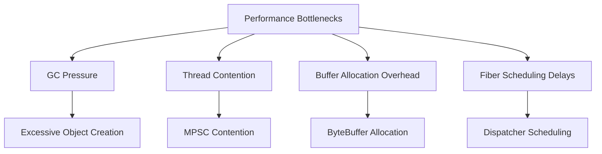
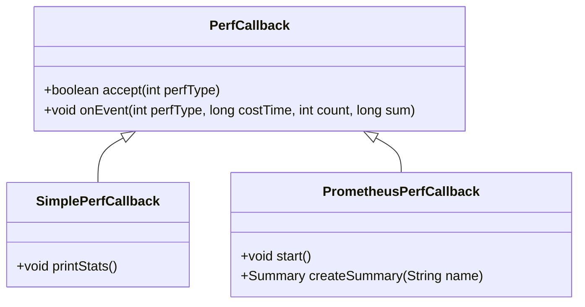
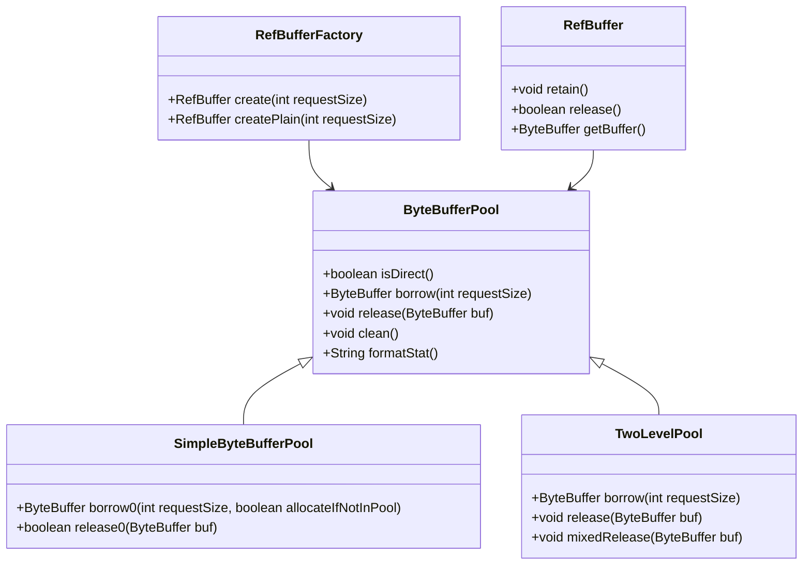
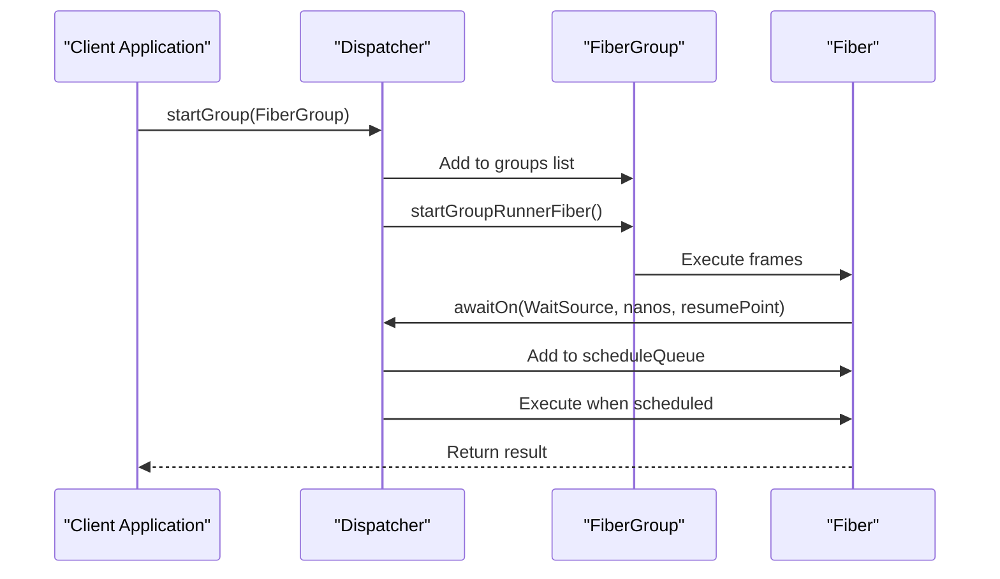
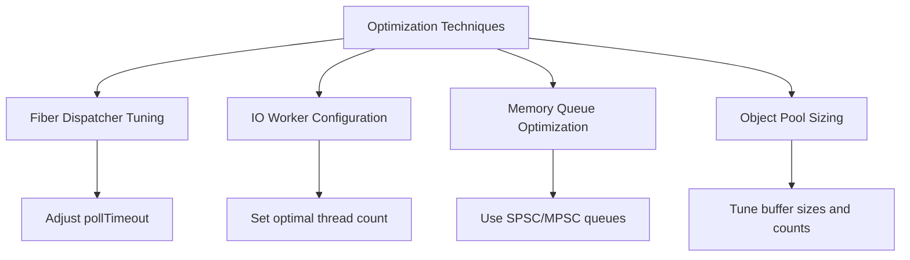
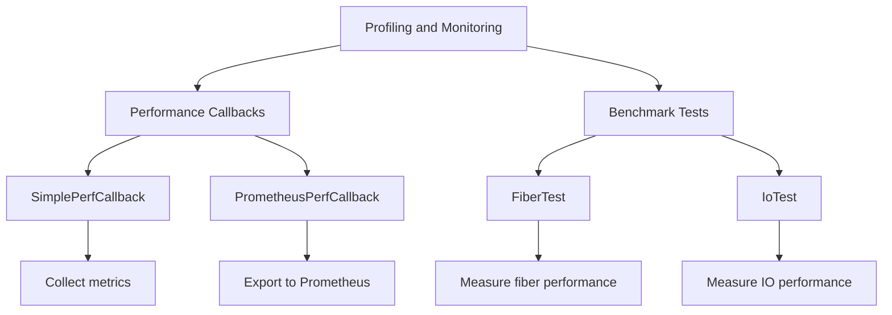
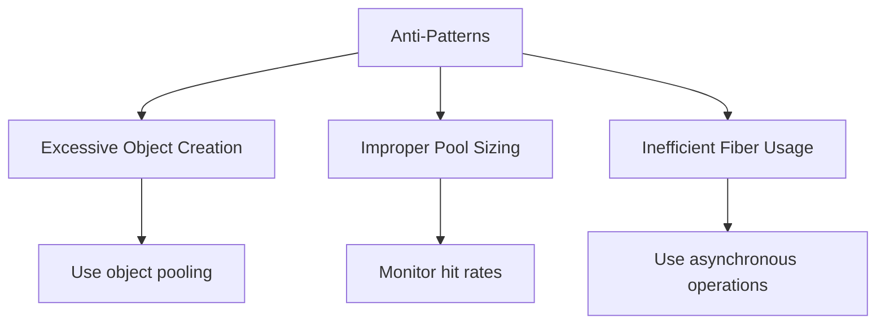

# Performance Bottlenecks

<cite>
**Referenced Files in This Document**   
- [PrometheusPerfCallback.java](file://benchmark/src/main/java/com/github/dtprj/dongting/bench/common/PrometheusPerfCallback.java)
- [SimplePerfCallback.java](file://benchmark/src/main/java/com/github/dtprj/dongting/bench/common/SimplePerfCallback.java)
- [ByteBufferPool.java](file://client/src/main/java/com/github/dtprj/dongting/buf/ByteBufferPool.java)
- [SimpleByteBufferPool.java](file://client/src/main/java/com/github/dtprj/dongting/buf/SimpleByteBufferPool.java)
- [TwoLevelPool.java](file://client/src/main/java/com/github/dtprj/dongting/buf/TwoLevelPool.java)
- [RefBuffer.java](file://client/src/main/java/com/github/dtprj/dongting/buf/RefBuffer.java)
- [RefBufferFactory.java](file://client/src/main/java/com/github/dtprj/dongting/buf/RefBufferFactory.java)
- [Dispatcher.java](file://server/src/main/java/com/github/dtprj/dongting/fiber/Dispatcher.java)
- [Fiber.java](file://server/src/main/java/com/github/dtprj/dongting/fiber/Fiber.java)
- [FiberQueue.java](file://server/src/main/java/com/github/dtprj/dongting/fiber/FiberQueue.java)
- [FiberTest.java](file://benchmark/src/main/java/com/github/dtprj/dongting/bench/fiber/FiberTest.java)
- [IoTest.java](file://benchmark/src/main/java/com/github/dtprj/dongting/bench/io/IoTest.java)
- [2023_07_28_dongting的对象池.txt](file://devlogs/2023_07_28_dongting的对象池.txt)
- [2023_07_26_dongting线程模型.txt](file://devlogs/2023_07_26_dongting线程模型.txt)
- [2022_11_25_构建高性能的内存队列.md](file://devlogs/2022_11_25_构建高性能的内存队列.md)
</cite>

## Table of Contents
1. [Introduction](#introduction)
2. [Common Performance Bottlenecks](#common-performance-bottlenecks)
3. [Performance Measurement and Benchmarking](#performance-measurement-and-benchmarking)
4. [Object Pooling Strategies](#object-pooling-strategies)
5. [Performance-Critical Components](#performance-critical-components)
6. [Optimization Techniques](#optimization-techniques)
7. [Profiling and Monitoring](#profiling-and-monitoring)
8. [Anti-Patterns and Best Practices](#anti-patterns-and-best-practices)
9. [Conclusion](#conclusion)

## Introduction

This document provides a comprehensive analysis of performance bottlenecks in the Dongting system, focusing on critical areas such as garbage collection pressure, thread contention, buffer allocation overhead, and fiber scheduling delays. The analysis is based on the codebase structure, performance-related components, and developer insights documented in devlogs. The document aims to guide developers in identifying and resolving performance issues through benchmarking, object pooling strategies, and optimization techniques for fiber dispatchers, IO workers, and memory queues.

**Section sources**
- [2023_07_26_dongting线程模型.txt](file://devlogs/2023_07_26_dongting线程模型.txt#L1-L15)
- [2023_07_28_dongting的对象池.txt](file://devlogs/2023_07_28_dongting的对象池.txt#L1-L10)

## Common Performance Bottlenecks

The Dongting system faces several common performance bottlenecks that can impact system throughput and latency. These include:

- **GC Pressure**: Excessive object creation can lead to frequent garbage collection cycles, causing pauses and reduced throughput. The system mitigates this through object pooling strategies, particularly for ByteBuffer instances.
- **Thread Contention**: Multi-threaded access to shared resources can lead to contention, especially in scenarios with multiple producers and single consumers (MPSC). The system uses specialized memory queues to reduce contention.
- **Buffer Allocation Overhead**: Frequent allocation and deallocation of ByteBuffer instances can be costly, especially for large buffers. Object pooling is employed to reuse buffers and reduce allocation overhead.
- **Fiber Scheduling Delays**: Delays in fiber scheduling can affect the responsiveness of asynchronous operations. The Dispatcher component manages fiber execution and scheduling to minimize delays.

The devlogs highlight that for small objects, direct allocation might be more efficient than pooling due to the overhead of maintaining thread-safe pools. However, for larger buffers (e.g., 1KB and above), pooling is beneficial to avoid the high cost of allocation and garbage collection.

**Diagram sources**
- [2023_07_28_dongting的对象池.txt](file://devlogs/2023_07_28_dongting的对象池.txt#L1-L10)
- [2023_07_26_dongting线程模型.txt](file://devlogs/2023_07_26_dongting线程模型.txt#L1-L15)

**Section sources**
- [2023_07_28_dongting的对象池.txt](file://devlogs/2023_07_28_dongting的对象池.txt#L1-L10)
- [2023_07_26_dongting线程模型.txt](file://devlogs/2023_07_26_dongting线程模型.txt#L1-L15)

## Performance Measurement and Benchmarking

Performance measurement in Dongting relies on benchmark tests and performance callbacks to quantify system throughput and latency. The `SimplePerfCallback` and `PrometheusPerfCallback` classes are used to collect and report performance metrics.

The `SimplePerfCallback` class provides a mechanism to record various performance events, such as RPC acquisition, worker queue processing, and fiber work. It aggregates statistics like invocation count, average time, and maximum time for each performance type. The `PrometheusPerfCallback` extends this functionality by integrating with Prometheus for monitoring and visualization.

Benchmark tests, such as `FiberTest` and `IoTest`, simulate real-world scenarios to measure performance under different conditions. These tests help establish baseline performance expectations and identify areas for optimization.

**Diagram sources**
- [SimplePerfCallback.java](file://benchmark/src/main/java/com/github/dtprj/dongting/bench/common/SimplePerfCallback.java#L29-L152)
- [PrometheusPerfCallback.java](file://benchmark/src/main/java/com/github/dtprj/dongting/bench/common/PrometheusPerfCallback.java#L31-L103)

**Section sources**
- [SimplePerfCallback.java](file://benchmark/src/main/java/com/github/dtprj/dongting/bench/common/SimplePerfCallback.java#L29-L152)
- [PrometheusPerfCallback.java](file://benchmark/src/main/java/com/github/dtprj/dongting/bench/common/PrometheusPerfCallback.java#L31-L103)
- [FiberTest.java](file://benchmark/src/main/java/com/github/dtprj/dongting/bench/fiber/FiberTest.java#L32-L89)
- [IoTest.java](file://benchmark/src/main/java/com/github/dtprj/dongting/bench/io/IoTest.java#L34-L196)

## Object Pooling Strategies

Object pooling is a critical strategy in Dongting to reduce garbage collection pressure and allocation overhead. The system employs different pooling strategies based on buffer size and usage patterns.

The `SimpleByteBufferPool` is a non-thread-safe pool designed for single-threaded contexts, such as raft threads and IO threads. It categorizes buffers into different sizes and provides fast allocation with low time complexity. However, it may suffer from low space utilization, especially for large buffers.

For larger buffers, the `TwoLevelPool` is used, which combines thread-local pools for small objects with a global pool for large objects. This approach improves space utilization and hit rates while managing the trade-off between allocation speed and memory overhead.

The `RefBuffer` class, in conjunction with `RefBufferFactory`, enables reference counting for pooled buffers, ensuring that buffers are properly released and reused. This is particularly important in multi-threaded scenarios where buffers may be shared across threads.

**Diagram sources**
- [ByteBufferPool.java](file://client/src/main/java/com/github/dtprj/dongting/buf/ByteBufferPool.java#L23-L46)
- [SimpleByteBufferPool.java](file://client/src/main/java/com/github/dtprj/dongting/buf/SimpleByteBufferPool.java#L32-L347)
- [TwoLevelPool.java](file://client/src/main/java/com/github/dtprj/dongting/buf/TwoLevelPool.java#L26-L146)
- [RefBuffer.java](file://client/src/main/java/com/github/dtprj/dongting/buf/RefBuffer.java#L28-L184)
- [RefBufferFactory.java](file://client/src/main/java/com/github/dtprj/dongting/buf/RefBufferFactory.java#L21-L42)

**Section sources**
- [2023_07_28_dongting的对象池.txt](file://devlogs/2023_07_28_dongting的对象池.txt#L1-L10)
- [SimpleByteBufferPool.java](file://client/src/main/java/com/github/dtprj/dongting/buf/SimpleByteBufferPool.java#L32-L347)
- [TwoLevelPool.java](file://client/src/main/java/com/github/dtprj/dongting/buf/TwoLevelPool.java#L26-L146)
- [RefBuffer.java](file://client/src/main/java/com/github/dtprj/dongting/buf/RefBuffer.java#L28-L184)
- [RefBufferFactory.java](file://client/src/main/java/com/github/dtprj/dongting/buf/RefBufferFactory.java#L21-L42)

## Performance-Critical Components

The performance of Dongting is heavily influenced by key components such as the `ByteBufferPool` and `Dispatcher`. These components are optimized to handle high-throughput and low-latency requirements.

The `ByteBufferPool` manages the allocation and release of ByteBuffer instances, reducing the overhead of frequent allocations. The `SimpleByteBufferPool` is optimized for speed with a simple allocation algorithm, while the `TwoLevelPool` balances space utilization and allocation efficiency for larger buffers.

The `Dispatcher` is responsible for managing fiber execution and scheduling. It uses a priority queue to schedule fibers based on their timeout, ensuring timely execution. The dispatcher also handles task submission and execution, coordinating between different fiber groups and managing the lifecycle of fibers.

**Diagram sources**
- [Dispatcher.java](file://server/src/main/java/com/github/dtprj/dongting/fiber/Dispatcher.java#L45-L655)
- [Fiber.java](file://server/src/main/java/com/github/dtprj/dongting/fiber/Fiber.java#L27-L237)

**Section sources**
- [Dispatcher.java](file://server/src/main/java/com/github/dtprj/dongting/fiber/Dispatcher.java#L45-L655)
- [Fiber.java](file://server/src/main/java/com/github/dtprj/dongting/fiber/Fiber.java#L27-L237)
- [FiberQueue.java](file://server/src/main/java/com/github/dtprj/dongting/fiber/FiberQueue.java#L29-L138)

## Optimization Techniques

To optimize the performance of Dongting, several techniques can be applied to tune fiber dispatchers, IO workers, and memory queues.

- **Fiber Dispatcher Tuning**: Adjust the poll timeout and scheduling frequency to balance responsiveness and CPU usage. The dispatcher's `pollTimeout` can be tuned based on the workload to minimize unnecessary polling.
- **IO Worker Configuration**: Configure the number of IO worker threads based on the CPU core count, but avoid setting it too high to prevent thread contention. The devlogs suggest that IO threads should be fewer than CPU cores to leave resources for business logic.
- **Memory Queue Optimization**: Use specialized memory queues like SPSC (Single Producer Single Consumer) or MPSC (Multiple Producer Single Consumer) based on the access pattern. The devlogs discuss the use of Lamport’s circular buffer for SPSC queues, which offers high performance with minimal overhead.
- **Object Pool Sizing**: Properly size object pools to balance memory usage and allocation efficiency. The `SimpleByteBufferPool` uses predefined buffer sizes and counts, which can be adjusted based on application requirements.

**Diagram sources**
- [Dispatcher.java](file://server/src/main/java/com/github/dtprj/dongting/fiber/Dispatcher.java#L45-L655)
- [2022_11_25_构建高性能的内存队列.md](file://devlogs/2022_11_25_构建高性能的内存队列.md#L1-L115)

**Section sources**
- [Dispatcher.java](file://server/src/main/java/com/github/dtprj/dongting/fiber/Dispatcher.java#L45-L655)
- [2022_11_25_构建高性能的内存队列.md](file://devlogs/2022_11_25_构建高性能的内存队列.md#L1-L115)
- [2023_07_26_dongting线程模型.txt](file://devlogs/2023_07_26_dongting线程模型.txt#L1-L15)

## Profiling and Monitoring

Profiling and monitoring are essential for maintaining system health and identifying performance issues. Dongting uses performance callbacks and benchmark tests to collect metrics on system throughput, latency, and resource utilization.

The `SimplePerfCallback` and `PrometheusPerfCallback` classes provide detailed statistics on various performance events, which can be used to monitor system behavior over time. These metrics include invocation counts, average times, and quantiles, which help in understanding the distribution of latencies.

Regular profiling using benchmark tests helps establish baseline performance and detect regressions. The `IoTest` benchmark, for example, measures the performance of asynchronous file operations, providing insights into IO throughput and latency.

**Diagram sources**
- [SimplePerfCallback.java](file://benchmark/src/main/java/com/github/dtprj/dongting/bench/common/SimplePerfCallback.java#L29-L152)
- [PrometheusPerfCallback.java](file://benchmark/src/main/java/com/github/dtprj/dongting/bench/common/PrometheusPerfCallback.java#L31-L103)
- [FiberTest.java](file://benchmark/src/main/java/com/github/dtprj/dongting/bench/fiber/FiberTest.java#L32-L89)
- [IoTest.java](file://benchmark/src/main/java/com/github/dtprj/dongting/bench/io/IoTest.java#L34-L196)

**Section sources**
- [SimplePerfCallback.java](file://benchmark/src/main/java/com/github/dtprj/dongting/bench/common/SimplePerfCallback.java#L29-L152)
- [PrometheusPerfCallback.java](file://benchmark/src/main/java/com/github/dtprj/dongting/bench/common/PrometheusPerfCallback.java#L31-L103)
- [FiberTest.java](file://benchmark/src/main/java/com/github/dtprj/dongting/bench/fiber/FiberTest.java#L32-L89)
- [IoTest.java](file://benchmark/src/main/java/com/github/dtprj/dongting/bench/io/IoTest.java#L34-L196)

## Anti-Patterns and Best Practices

Identifying and avoiding anti-patterns is crucial for maintaining high performance in Dongting. Common anti-patterns include excessive object creation, improper pool sizing, and inefficient fiber usage.

- **Excessive Object Creation**: Creating objects unnecessarily can lead to increased GC pressure. Use object pooling for frequently used objects like ByteBuffers.
- **Improper Pool Sizing**: Setting pool sizes too small can lead to frequent allocations, while setting them too large can waste memory. Monitor pool hit rates and adjust sizes accordingly.
- **Inefficient Fiber Usage**: Blocking operations within fibers can delay other fibers. Use asynchronous operations and yield control appropriately to maintain responsiveness.

Best practices include using the appropriate object pool for the context, monitoring performance metrics regularly, and tuning system parameters based on workload characteristics.

**Diagram sources**
- [2023_07_28_dongting的对象池.txt](file://devlogs/2023_07_28_dongting的对象池.txt#L1-L10)
- [Dispatcher.java](file://server/src/main/java/com/github/dtprj/dongting/fiber/Dispatcher.java#L45-L655)

**Section sources**
- [2023_07_28_dongting的对象池.txt](file://devlogs/2023_07_28_dongting的对象池.txt#L1-L10)
- [Dispatcher.java](file://server/src/main/java/com/github/dtprj/dongting/fiber/Dispatcher.java#L45-L655)

## Conclusion

This document has outlined the key performance bottlenecks in the Dongting system and provided strategies for identifying and resolving them. By leveraging object pooling, optimizing fiber dispatchers, and using performance callbacks for monitoring, developers can maintain high system throughput and low latency. Regular benchmarking and profiling are essential to ensure that performance remains optimal as the system evolves.

**Section sources**
- [2023_07_28_dongting的对象池.txt](file://devlogs/2023_07_28_dongting的对象池.txt#L1-L10)
- [2023_07_26_dongting线程模型.txt](file://devlogs/2023_07_26_dongting线程模型.txt#L1-L15)
- [2022_11_25_构建高性能的内存队列.md](file://devlogs/2022_11_25_构建高性能的内存队列.md#L1-L115)