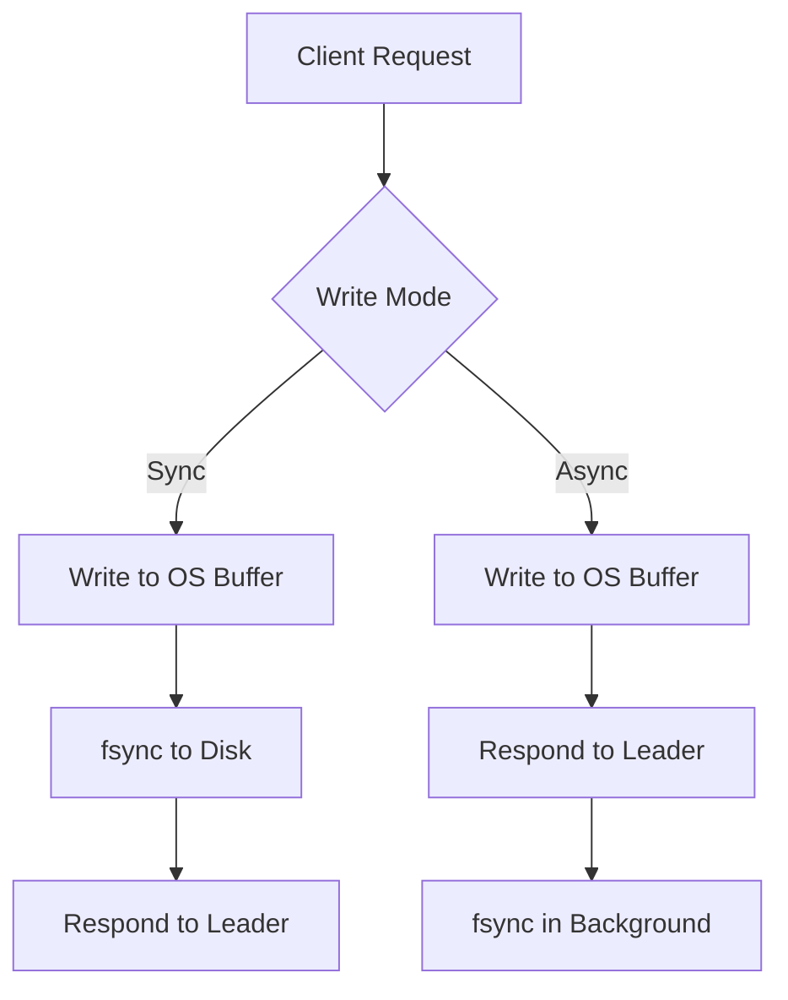
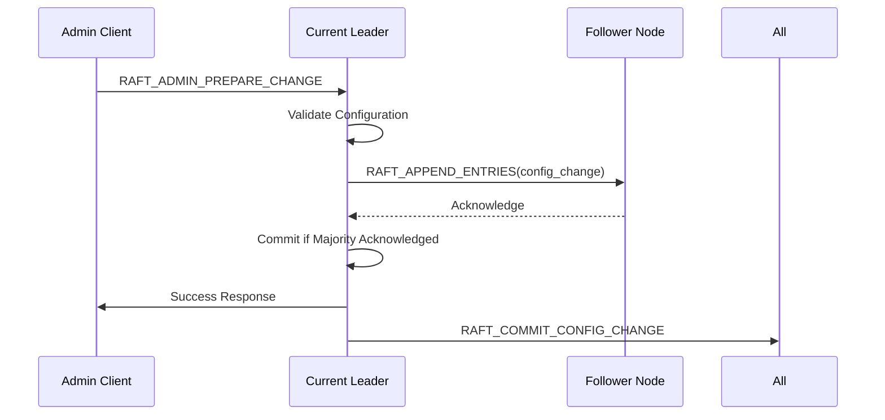
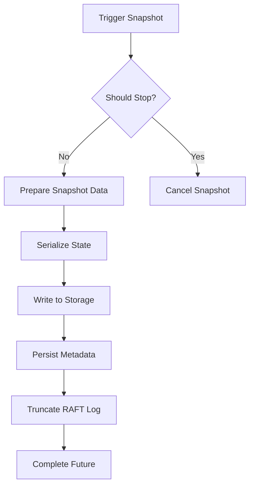
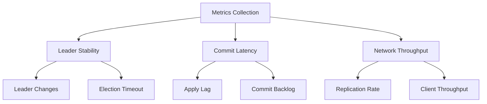

# Production Deployment Best Practices

<cite>
**Referenced Files in This Document**   
- [AGENTS.md](file://AGENTS.md)
- [README.md](file://README.md)
- [RaftServerConfig.java](file://server/src/main/java/com/github/dtprj/dongting/raft/server/RaftServerConfig.java)
- [KvServerConfig.java](file://server/src/main/java/com/github/dtprj/dongting/dtkv/server/KvServerConfig.java)
- [RaftGroupConfig.java](file://server/src/main/java/com/github/dtprj/dongting/raft/server/RaftGroupConfig.java)
- [RaftServer.java](file://server/src/main/java/com/github/dtprj/dongting/raft/server/RaftServer.java)
- [DtKV.java](file://server/src/main/java/com/github/dtprj/dongting/dtkv/server/DtKV.java)
- [RaftLog.java](file://server/src/main/java/com/github/dtprj/dongting/raft/store/RaftLog.java)
- [SnapshotManager.java](file://server/src/main/java/com/github/dtprj/dongting/raft/sm/SnapshotManager.java)
- [ApplyManager.java](file://server/src/main/java/com/github/dtprj/dongting/raft/impl/ApplyManager.java)
</cite>

## Table of Contents
1. [Introduction](#introduction)
2. [Resource Allocation Guidelines](#resource-allocation-guidelines)
3. [Configuration Management for Multi-Node Clusters](#configuration-management-for-multi-node-clusters)
4. [Backup and Disaster Recovery](#backup-and-disaster-recovery)
5. [Monitoring Key Metrics](#monitoring-key-metrics)
6. [Upgrade Procedures and Rollback Strategies](#upgrade-procedures-and-rollback-strategies)
7. [Security Considerations](#security-considerations)
8. [Zero-Dependency Principle](#zero-dependency-principle)

## Introduction

Dongting is a high-performance distributed system engine that integrates RAFT consensus, distributed key-value storage (DtKV), and low-level RPC capabilities. Designed for linearizability and fault tolerance, Dongting supports multi-RAFT groups, dynamic configuration changes, distributed locks, and watch mechanisms. This document outlines production deployment best practices, focusing on resource allocation, configuration management, backup and recovery, monitoring, upgrades, and security.

Despite its high performance—demonstrating over 900,000 TPS in 3-node RAFT configurations with async storage writes—Dongting remains in alpha (v0.8.x-ALPHA) and requires thorough internal testing before production use. The system emphasizes simplicity and reliability through a zero-dependency architecture, requiring only Java 11 for the server and Java 8 for the client.

**Section sources**
- [README.md](file://README.md#L4-L141)

## Resource Allocation Guidelines

### CPU Allocation
Dongting's fiber-based concurrency model efficiently utilizes CPU resources. The default block I/O thread count is set to `max(availableProcessors * 2, 4)`, ensuring sufficient threads for I/O operations without excessive context switching. For production workloads, allocate at least 4 CPU cores per node, scaling horizontally with workload demands.

### Memory Allocation
Memory requirements depend on workload characteristics:
- **Small key-value operations**: 4GB heap is sufficient for most use cases
- **High-throughput scenarios**: Scale heap size proportionally to pending task limits
- **Snapshot operations**: Ensure adequate off-heap memory for snapshot serialization

The system uses object pooling (ByteBufferPool, TwoLevelPool) to minimize GC pressure. Configure JVM with ZGC (`-XX:+UseZGC`) for low-latency garbage collection, especially in high-throughput environments.

### Storage Configuration
Storage performance significantly impacts RAFT commit latency. Key configuration parameters include:

- **syncForce**: When `true`, ensures data durability by calling `fsync()` after writes. Recommended for production despite performance impact.
- **dataDir**: Directory for RAFT log storage. Use fast SSDs for optimal performance.
- **statusFile**: Persistent storage for RAFT node status.

For high-performance deployments, consider the trade-off between sync and async write modes:
- **Sync mode**: Provides strong durability guarantees with higher latency
- **Async mode**: Offers lower latency with minimal data loss risk in case of power failure

**Diagram sources**
- [RaftGroupConfig.java](file://server/src/main/java/com/github/dtprj/dongting/raft/server/RaftGroupConfig.java#L31)
- [RaftServerConfig.java](file://server/src/main/java/com/github/dtprj/dongting/raft/server/RaftServerConfig.java#L37)

**Section sources**
- [RaftGroupConfig.java](file://server/src/main/java/com/github/dtprj/dongting/raft/server/RaftGroupConfig.java#L28-L31)
- [README.md](file://README.md#L33-L38)

## Configuration Management for Multi-Node Clusters

### Cluster Configuration
Multi-node clusters are configured through the `RaftServerConfig` and `RaftGroupConfig` classes. Key parameters include:

- **servers**: Comma-separated list of all cluster nodes with host:port
- **nodeId**: Unique identifier for the current node
- **replicatePort**: Port for RAFT replication traffic
- **servicePort**: Port for client access

Cluster membership is defined through `nodeIdOfMembers` (voting members) and `nodeIdOfObservers` (non-voting observers). The system validates configuration consistency, ensuring no duplicate node IDs or hosts.

### Dynamic Configuration Changes
Dongting supports runtime configuration changes through administrative commands:
- **Add/Remove Nodes**: Modify cluster membership without downtime
- **Transfer Leadership**: Initiate leader transfer to a specific node
- **Add/Remove RAFT Groups**: Support for multi-RAFT group architectures

The configuration change process follows the RAFT protocol:
1. Prepare configuration change
2. Replicate to majority
3. Commit new configuration

**Diagram sources**
- [RaftServer.java](file://server/src/main/java/com/github/dtprj/dongting/raft/server/RaftServer.java#L173-L176)
- [RaftServer.java](file://server/src/main/java/com/github/dtprj/dongting/raft/server/RaftServer.java#L572-L622)

**Section sources**
- [RaftServer.java](file://server/src/main/java/com/github/dtprj/dongting/raft/server/RaftServer.java#L173-L183)
- [RaftServer.java](file://server/src/main/java/com/github/dtprj/dongting/raft/server/RaftServer.java#L572-L666)

## Backup and Disaster Recovery

### RAFT Log Management
Dongting implements automatic log compaction and snapshotting to manage storage growth:

- **Snapshot Frequency**: Configured via `saveSnapshotSeconds` (default: 3600)
- **Snapshot Retention**: Controlled by `maxKeepSnapshots` (default: 2)
- **Log Deletion**: Enabled by `deleteLogsAfterTakeSnapshot` (default: true)

The system automatically marks logs for deletion after snapshots are taken, with a configurable delay (`autoDeleteLogDelaySeconds`) to ensure replication completeness.

### Snapshot Mechanism
Snapshots are created through the `SnapshotManager` interface, which coordinates with the state machine to capture consistent application state. The process involves:

1. State machine prepares snapshot data
2. Snapshot is serialized and written to storage
3. RAFT log is truncated to the snapshot index
4. Snapshot metadata is persisted

**Diagram sources**
- [DtKV.java](file://server/src/main/java/com/github/dtprj/dongting/dtkv/server/DtKV.java#L308-L319)
- [SnapshotManager.java](file://server/src/main/java/com/github/dtprj/dongting/raft/sm/SnapshotManager.java#L34)

**Section sources**
- [RaftGroupConfig.java](file://server/src/main/java/com/github/dtprj/dongting/raft/server/RaftGroupConfig.java#L59-L64)
- [DtKV.java](file://server/src/main/java/com/github/dtprj/dongting/dtkv/server/DtKV.java#L308-L319)

## Monitoring Key Metrics

### Leader Stability
Monitor leader stability through:
- **Leader Changes**: Track frequency of leadership elections
- **Election Timeout**: Default 15 seconds; adjust based on network conditions
- **Heartbeat Interval**: Default 2 seconds; should be significantly shorter than election timeout

The system exposes RAFT role changes through status listeners, enabling external monitoring integration.

### Commit Latency
Commit latency is influenced by:
- Network round-trip time between nodes
- Storage write performance (especially with `syncForce`)
- System load and CPU availability

Key metrics to monitor:
- `applyLagNanos`: Time between commit and application
- `commitIndex` vs `lastApplied`: Indicates processing backlog
- RAFT round-trip times for append entries

### Network Throughput
Network performance is critical for RAFT consensus. Monitor:
- Replication traffic between nodes
- Client request throughput
- Message batching effectiveness

The system uses configurable batching parameters:
- `maxReplicateItems`: Maximum items per replication batch
- `maxReplicateBytes`: Maximum bytes per replication batch
- `singleReplicateLimit`: Size limit for individual replication messages

**Diagram sources**
- [ApplyManager.java](file://server/src/main/java/com/github/dtprj/dongting/raft/impl/ApplyManager.java#L325-L337)
- [RaftServerConfig.java](file://server/src/main/java/com/github/dtprj/dongting/raft/server/RaftServerConfig.java#L28-L33)

**Section sources**
- [RaftServerConfig.java](file://server/src/main/java/com/github/dtprj/dongting/raft/server/RaftServerConfig.java#L28-L35)
- [ApplyManager.java](file://server/src/main/java/com/github/dtprj/dongting/raft/impl/ApplyManager.java#L325-L337)

## Upgrade Procedures and Rollback Strategies

### Rolling Upgrades
Dongting supports rolling upgrades with minimal downtime:

1. Drain traffic from node (if applicable)
2. Stop the node gracefully
3. Deploy new version
4. Start the node
5. Repeat for remaining nodes

The system's zero-dependency nature simplifies upgrades, as there are no transitive dependency conflicts to manage.

### Graceful Shutdown
Nodes should be stopped gracefully to ensure proper state persistence:
- Save snapshots if configured (`saveSnapshotWhenClose`)
- Close RAFT log and status files
- Shutdown fiber dispatchers and I/O threads

The shutdown process respects timeout configurations and ensures all pending operations are completed or appropriately canceled.

### Rollback Strategy
In case of upgrade issues:
1. Immediately stop deploying to additional nodes
2. Roll back problematic nodes to previous stable version
3. Verify cluster stability
4. Investigate and resolve the issue before retrying

Since configuration and data are stored in version-compatible formats, rolling back to previous versions is generally safe.

**Section sources**
- [RaftServer.java](file://server/src/main/java/com/github/dtprj/dongting/raft/server/RaftServer.java#L476-L502)
- [RaftGroupConfig.java](file://server/src/main/java/com/github/dtprj/dongting/raft/server/RaftGroupConfig.java#L61)

## Security Considerations

### Network Communication
Dongting currently lacks built-in encryption for network communication. In production environments, deploy the system within trusted networks or use external encryption mechanisms such as:
- Network-level encryption (IPSec, WireGuard)
- TLS termination proxies
- Virtual private clouds with strict firewall rules

### Access Control
The system does not implement built-in authentication or authorization. Security should be enforced at the application layer or through network controls:
- Restrict access to service ports using firewalls
- Implement client authentication in the application layer
- Use network segmentation to isolate RAFT replication traffic from client access

Future versions may incorporate security features, but the current focus remains on core functionality and performance.

**Section sources**
- [README.md](file://README.md#L48-L69)
- [RaftServerConfig.java](file://server/src/main/java/com/github/dtprj/dongting/raft/server/RaftServerConfig.java#L24-L26)

## Zero-Dependency Principle

### Architecture Implications
Dongting's zero-dependency principle has significant implications for deployment:

- **Simplicity**: No dependency management issues or version conflicts
- **Reliability**: Reduced attack surface and failure points
- **Portability**: Can run on any system with appropriate Java version
- **Size Efficiency**: Total JAR size under 1MB

The only optional dependency is SLF4J for logging; if unavailable, the system falls back to JDK logging.

### Deployment Benefits
The zero-dependency design enables:
- Easy embedding into existing applications
- Minimal image sizes in containerized environments
- Compatibility with constrained environments (Raspberry Pi, embedded systems)
- Freedom from Linux kernel parameter tuning

This principle aligns with the project's goal of providing a simple, reliable distributed system engine that "just works" without complex configuration requirements.

**Section sources**
- [AGENTS.md](file://AGENTS.md#L1-L5)
- [README.md](file://README.md#L47-L69)