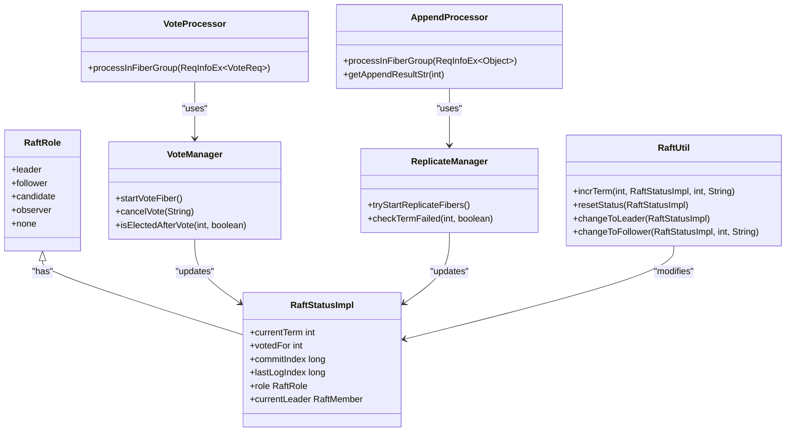
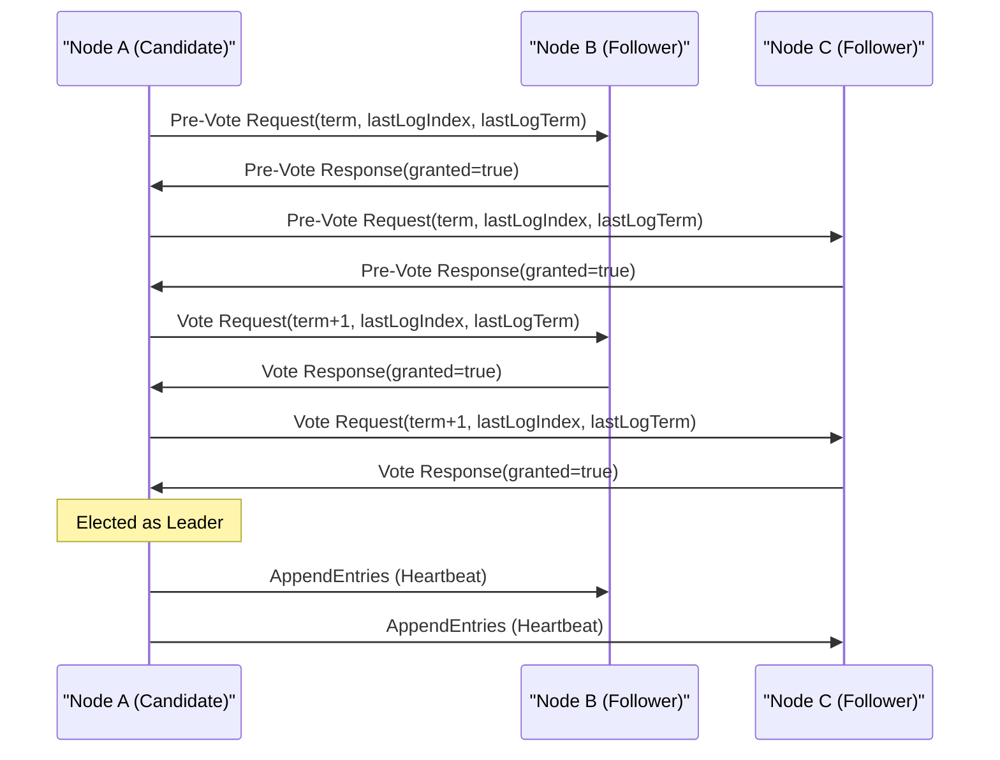
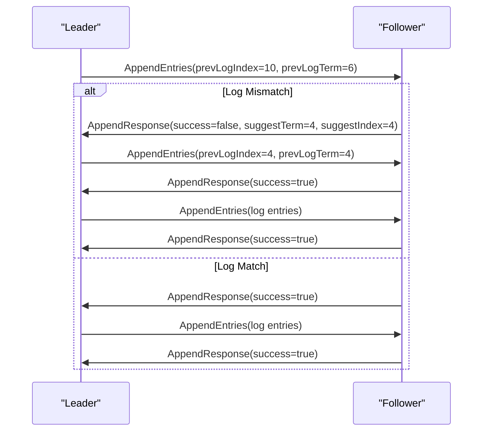
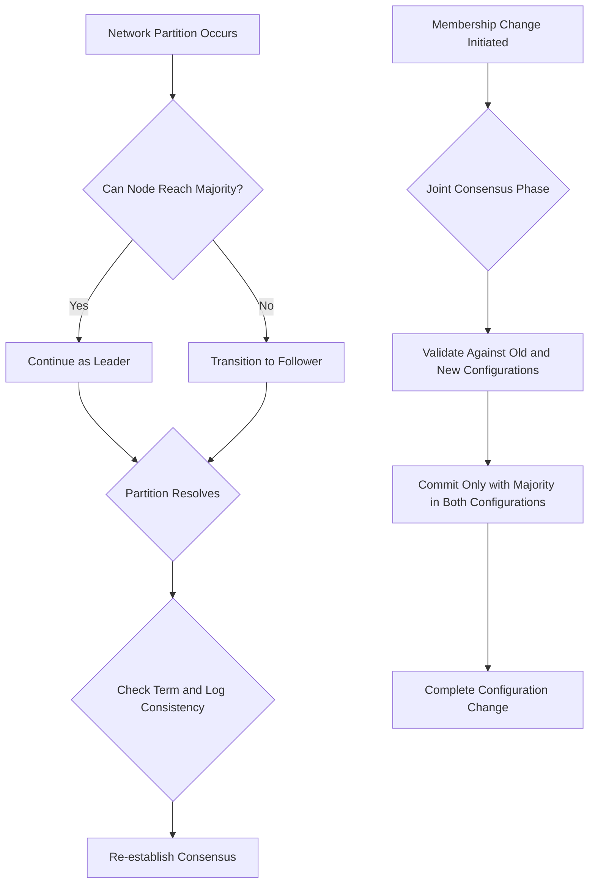
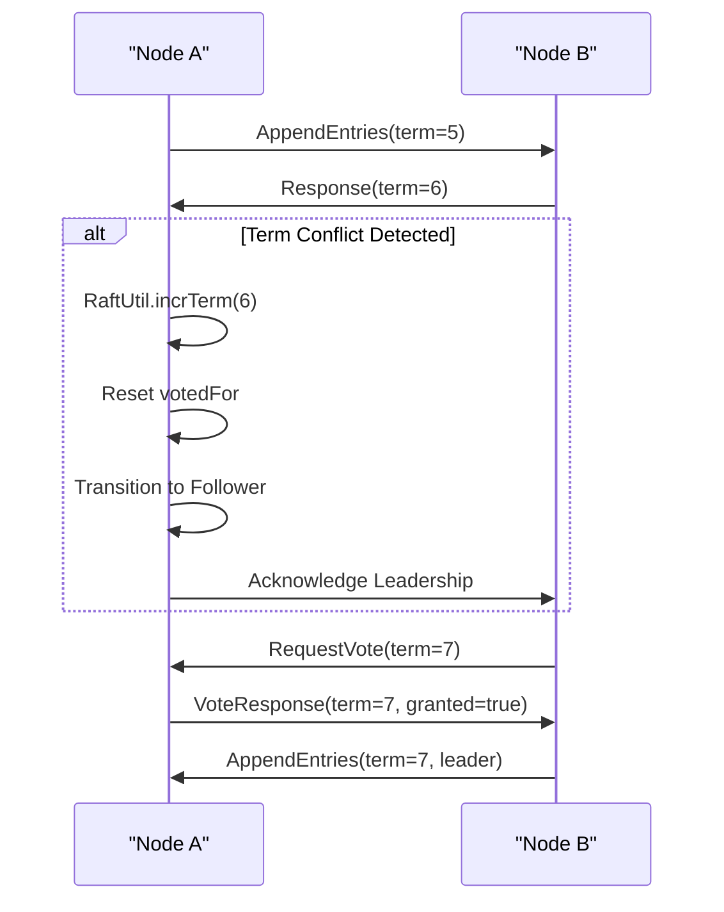

# RAFT Consensus Failures

<cite>
**Referenced Files in This Document**   
- [RaftRole.java](file://server/src/main/java/com/github/dtprj/dongting/raft/impl/RaftRole.java)
- [VoteProcessor.java](file://server/src/main/java/com/github/dtprj/dongting/raft/rpc/VoteProcessor.java)
- [AppendProcessor.java](file://server/src/main/java/com/github/dtprj/dongting/raft/rpc/AppendProcessor.java)
- [VoteManager.java](file://server/src/main/java/com/github/dtprj/dongting/raft/impl/VoteManager.java)
- [ReplicateManager.java](file://server/src/main/java/com/github/dtprj/dongting/raft/impl/ReplicateManager.java)
- [RaftStatusImpl.java](file://server/src/main/java/com/github/dtprj/dongting/raft/impl/RaftStatusImpl.java)
- [RaftUtil.java](file://server/src/main/java/com/github/dtprj/dongting/raft/impl/RaftUtil.java)
- [StatusManager.java](file://server/src/main/java/com/github/dtprj/dongting/raft/store/StatusManager.java)
- [raft算法的工程实现秘笈.md](file://devlogs/2024_07_26_raft算法的工程实现秘笈.md)
</cite>

## Table of Contents
1. [Introduction](#introduction)
2. [Core Components](#core-components)
3. [Leader Election Failures](#leader-election-failures)
4. [Log Replication Stalls](#log-replication-stalls)
5. [Split-Brain Conditions](#split-brain-conditions)
6. [Term Conflicts](#term-conflicts)
7. [Diagnostic Procedures](#diagnostic-procedures)
8. [Recovery Procedures](#recovery-procedures)
9. [Conclusion](#conclusion)

## Introduction
This document provides comprehensive guidance for diagnosing and resolving RAFT consensus failures in Dongting clusters. The analysis is based on the implementation details found in the codebase and development logs, focusing on critical components such as RaftRole, VoteProcessor, and AppendProcessor. The document covers failure scenarios including leader election failures, log replication stalls, split-brain conditions, and term conflicts. It provides diagnostic procedures for examining term mismatches, commit index discrepancies, and membership configuration problems, along with recovery procedures for restoring cluster health after consensus breakdown.

**Section sources**
- [raft算法的工程实现秘笈.md](file://devlogs/2024_07_26_raft算法的工程实现秘笈.md#L1-L343)

## Core Components

The Dongting RAFT implementation consists of several key components that work together to maintain cluster stability and ensure consensus. The RaftRole enum defines the possible states of a node (leader, follower, candidate, observer, none), while the VoteProcessor and AppendProcessor handle the core RAFT RPCs for leader election and log replication respectively. The VoteManager coordinates the voting process during leader elections, and the ReplicateManager manages log replication from leader to followers. The RaftStatusImpl class maintains the current state of the RAFT group, including term information, commit indexes, and role status.

**Diagram sources**
- [RaftRole.java](file://server/src/main/java/com/github/dtprj/dongting/raft/impl/RaftRole.java#L1-L24)
- [VoteProcessor.java](file://server/src/main/java/com/github/dtprj/dongting/raft/rpc/VoteProcessor.java#L1-L204)
- [AppendProcessor.java](file://server/src/main/java/com/github/dtprj/dongting/raft/rpc/AppendProcessor.java#L1-L579)
- [VoteManager.java](file://server/src/main/java/com/github/dtprj/dongting/raft/impl/VoteManager.java#L1-L492)
- [ReplicateManager.java](file://server/src/main/java/com/github/dtprj/dongting/raft/impl/ReplicateManager.java#L1-L792)
- [RaftStatusImpl.java](file://server/src/main/java/com/github/dtprj/dongting/raft/impl/RaftStatusImpl.java#L1-L257)
- [RaftUtil.java](file://server/src/main/java/com/github/dtprj/dongting/raft/impl/RaftUtil.java#L1-L366)

**Section sources**
- [RaftRole.java](file://server/src/main/java/com/github/dtprj/dongting/raft/impl/RaftRole.java#L1-L24)
- [VoteProcessor.java](file://server/src/main/java/com/github/dtprj/dongting/raft/rpc/VoteProcessor.java#L1-L204)
- [AppendProcessor.java](file://server/src/main/java/com/github/dtprj/dongting/raft/rpc/AppendProcessor.java#L1-L579)
- [VoteManager.java](file://server/src/main/java/com/github/dtprj/dongting/raft/impl/VoteManager.java#L1-L492)
- [ReplicateManager.java](file://server/src/main/java/com/github/dtprj/dongting/raft/impl/ReplicateManager.java#L1-L792)
- [RaftStatusImpl.java](file://server/src/main/java/com/github/dtprj/dongting/raft/impl/RaftStatusImpl.java#L1-L257)

## Leader Election Failures

Leader election failures in Dongting clusters can occur due to various factors including network partitions, node failures, or configuration issues. The VoteProcessor handles vote requests and responses, while the VoteManager coordinates the voting process. When a node detects an election timeout, it transitions to candidate state and initiates a pre-vote phase to determine if it should proceed with a full election.

The pre-vote mechanism helps prevent unnecessary term increments when a leader is still functioning but experiencing network issues. If a node receives a vote request with a higher term, it updates its term and transitions to follower state. The election process involves checking if sufficient nodes are ready and reachable before initiating a vote.

**Diagram sources**
- [VoteProcessor.java](file://server/src/main/java/com/github/dtprj/dongting/raft/rpc/VoteProcessor.java#L51-L153)
- [VoteManager.java](file://server/src/main/java/com/github/dtprj/dongting/raft/impl/VoteManager.java#L136-L157)

**Section sources**
- [VoteProcessor.java](file://server/src/main/java/com/github/dtprj/dongting/raft/rpc/VoteProcessor.java#L51-L153)
- [VoteManager.java](file://server/src/main/java/com/github/dtprj/dongting/raft/impl/VoteManager.java#L136-L157)

## Log Replication Stalls

Log replication stalls occur when the leader is unable to successfully replicate log entries to a majority of followers. The AppendProcessor handles append entries requests and responses, while the ReplicateManager manages the replication process. When a follower receives an append request with a mismatched previous log index or term, it responds with a failure indication containing suggested term and index values.

The leader uses these suggestions to find the correct replication point through a two-phase matching algorithm. If the follower cannot find a matching point, it requests an installation of a snapshot. The ReplicateManager handles flow control and manages multiple concurrent replication fibers to different followers.

**Diagram sources**
- [AppendProcessor.java](file://server/src/main/java/com/github/dtprj/dongting/raft/rpc/AppendProcessor.java#L277-L300)
- [ReplicateManager.java](file://server/src/main/java/com/github/dtprj/dongting/raft/impl/ReplicateManager.java#L309-L358)

**Section sources**
- [AppendProcessor.java](file://server/src/main/java/com/github/dtprj/dongting/raft/rpc/AppendProcessor.java#L277-L300)
- [ReplicateManager.java](file://server/src/main/java/com/github/dtprj/dongting/raft/impl/ReplicateManager.java#L309-L358)

## Split-Brain Conditions

Split-brain conditions in Dongting clusters are prevented through the RAFT consensus algorithm's requirement for a majority quorum. The system uses joint consensus for membership changes, which ensures that any configuration change requires approval from both the old and new configurations. This prevents the formation of two independent majorities that could both elect leaders.

The RaftStatusImpl maintains information about both current and pending configurations (members, observers, preparedMembers, preparedObservers), allowing the system to validate votes and log replication requests against both configurations during transitions. The electQuorum and rwQuorum values are calculated based on the size of the membership sets to ensure majority requirements are met.

**Diagram sources**
- [RaftStatusImpl.java](file://server/src/main/java/com/github/dtprj/dongting/raft/impl/RaftStatusImpl.java#L44-L54)
- [RaftUtil.java](file://server/src/main/java/com/github/dtprj/dongting/raft/impl/RaftUtil.java#L72-L82)
- [raft算法的工程实现秘笈.md](file://devlogs/2024_07_26_raft算法的工程实现秘笈.md#L281-L331)

**Section sources**
- [RaftStatusImpl.java](file://server/src/main/java/com/github/dtprj/dongting/raft/impl/RaftStatusImpl.java#L44-L54)
- [RaftUtil.java](file://server/src/main/java/com/github/dtprj/dongting/raft/impl/RaftUtil.java#L72-L82)
- [raft算法的工程实现秘笈.md](file://devlogs/2024_07_26_raft算法的工程实现秘笈.md#L281-L331)

## Term Conflicts

Term conflicts arise when nodes have inconsistent term values, potentially leading to leadership disputes. The RaftStatusImpl maintains the currentTerm value, which is updated when a node receives a request or response with a higher term. The RaftUtil.incrTerm method handles term updates and ensures proper state transitions.

When a node receives a request with a higher term, it updates its term, resets its votedFor field, and transitions to follower state. The StatusManager persists term changes asynchronously to disk, ensuring durability across restarts. Term conflicts are resolved by the election process, where the candidate with the most up-to-date log (highest term and index) is more likely to receive votes.

**Diagram sources**
- [RaftStatusImpl.java](file://server/src/main/java/com/github/dtprj/dongting/raft/impl/RaftStatusImpl.java#L65-L67)
- [RaftUtil.java](file://server/src/main/java/com/github/dtprj/dongting/raft/impl/RaftUtil.java#L102-L128)
- [StatusManager.java](file://server/src/main/java/com/github/dtprj/dongting/raft/store/StatusManager.java#L163-L166)

**Section sources**
- [RaftStatusImpl.java](file://server/src/main/java/com/github/dtprj/dongting/raft/impl/RaftStatusImpl.java#L65-L67)
- [RaftUtil.java](file://server/src/main/java/com/github/dtprj/dongting/raft/impl/RaftUtil.java#L102-L128)
- [StatusManager.java](file://server/src/main/java/com/github/dtprj/dongting/raft/store/StatusManager.java#L163-L166)

## Diagnostic Procedures

Diagnosing RAFT consensus issues in Dongting clusters involves examining several key areas: Raft state transitions, vote requests, append entries, term mismatches, commit index discrepancies, and membership configuration problems. The following procedures can help identify and resolve consensus failures:

### Analyzing Raft State Transitions
Monitor the RaftRole changes through the roleChangeListener in RaftStatusImpl. Examine logs for state transition messages indicating role changes (e.g., "change to candidate", "change to leader"). Verify that state transitions follow the RAFT protocol rules and that nodes are not oscillating between states.

### Examining Vote Requests and Responses
Analyze VoteProcessor logs to trace the vote request/response flow. Look for patterns such as repeated pre-vote requests, vote denials due to log inconsistencies, or nodes voting for candidates with outdated logs. Check the term values in vote requests to ensure they are monotonically increasing.

### Analyzing Append Entries
Examine AppendProcessor logs to track log replication success and failures. Pay attention to "log not match" messages which indicate replication point mismatches. Monitor the suggestTerm and suggestIndex values in failure responses to understand where replication is failing.

### Checking Term Mismatches
Compare the currentTerm values across all nodes in the cluster. Significant term differences indicate potential network partitions or failed elections. Use the StatusManager to verify that term changes are being persisted correctly to disk.

### Verifying Commit Index Consistency
Compare the commitIndex values across nodes. Large discrepancies suggest replication stalls or network issues. Check if the leader is able to advance the commit index by receiving successful append responses from a majority of followers.

### Validating Membership Configuration
Ensure all nodes have consistent membership configurations. The raft ping mechanism checks configuration consistency when connections are established. Verify that the members, observers, preparedMembers, and preparedObservers lists are identical across all nodes.

**Section sources**
- [RaftStatusImpl.java](file://server/src/main/java/com/github/dtprj/dongting/raft/impl/RaftStatusImpl.java#L71-L73)
- [VoteProcessor.java](file://server/src/main/java/com/github/dtprj/dongting/raft/rpc/VoteProcessor.java#L91-L97)
- [AppendProcessor.java](file://server/src/main/java/com/github/dtprj/dongting/raft/rpc/AppendProcessor.java#L289-L292)
- [RaftUtil.java](file://server/src/main/java/com/github/dtprj/dongting/raft/impl/RaftUtil.java#L102-L128)
- [StatusManager.java](file://server/src/main/java/com/github/dtprj/dongting/raft/store/StatusManager.java#L163-L166)
- [raft算法的工程实现秘笈.md](file://devlogs/2024_07_26_raft算法的工程实现秘笈.md#L75-L87)

## Recovery Procedures

Recovering from RAFT consensus failures requires careful procedures to restore cluster health while maintaining data consistency. The following recovery procedures address common failure scenarios:

### Leader Recovery
When a leader fails, the remaining nodes will detect the absence of heartbeat messages and initiate leader election after their election timeout expires. The recovery process involves:
1. Nodes transition to candidate state and initiate pre-vote
2. If pre-vote succeeds, nodes proceed with full election
3. The candidate receiving votes from a majority becomes the new leader
4. The new leader establishes leadership by sending heartbeat messages

### Follower Recovery
When a follower falls behind or becomes isolated:
1. The follower detects it is no longer receiving heartbeats
2. It remains in follower state but does not initiate elections
3. When connectivity is restored, it accepts leadership from the current leader
4. The leader replicates any missing log entries to bring the follower up to date

### Network Partition Recovery
When a network partition heals:
1. Nodes in the minority partition detect the higher term of the majority partition's leader
2. They update their term and transition to follower state
3. The leader from the majority partition incorporates the recovered nodes
4. Log replication brings the recovered nodes up to date

### Configuration Change Recovery
For failed or incomplete configuration changes:
1. Verify the status of preparedMembers and preparedObservers
2. If a configuration change was partially applied, use admin commands to either commit or abort the change
3. Ensure all nodes have consistent configuration before proceeding
4. Restart the configuration change process if necessary

### Data Recovery from Snapshots
When log replication cannot be established:
1. The leader initiates snapshot installation on the problematic follower
2. The follower receives the snapshot and installs it
3. The follower's state is reset to the snapshot point
4. Log replication resumes from the snapshot index

**Section sources**
- [RaftUtil.java](file://server/src/main/java/com/github/dtprj/dongting/raft/impl/RaftUtil.java#L254-L292)
- [AppendProcessor.java](file://server/src/main/java/com/github/dtprj/dongting/raft/rpc/AppendProcessor.java#L461-L571)
- [raft算法的工程实现秘笈.md](file://devlogs/2024_07_26_raft算法的工程实现秘笈.md#L281-L331)

## Conclusion
RAFT consensus failures in Dongting clusters can be effectively diagnosed and resolved by understanding the core components and their interactions. The RaftRole, VoteProcessor, and AppendProcessor work together to maintain cluster stability through proper leader election, log replication, and state management. By following the diagnostic procedures outlined in this document, operators can identify the root causes of consensus issues and apply appropriate recovery procedures. The implementation's attention to detail, including pre-vote mechanisms, joint consensus for membership changes, and careful state management, provides a robust foundation for maintaining consistency even in the face of network partitions and node failures.

**Section sources**
- [raft算法的工程实现秘笈.md](file://devlogs/2024_07_26_raft算法的工程实现秘笈.md#L1-L343)