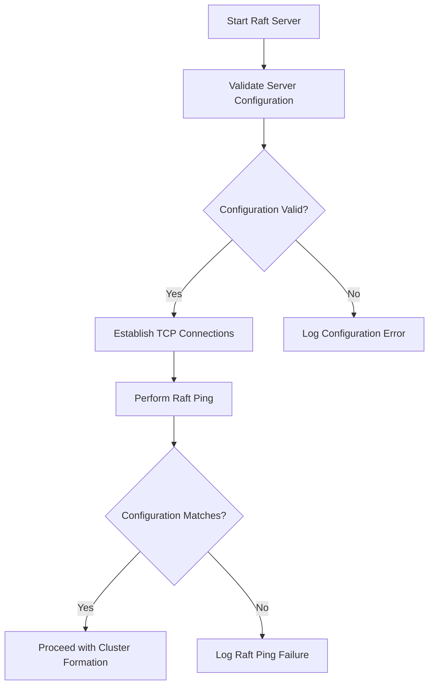
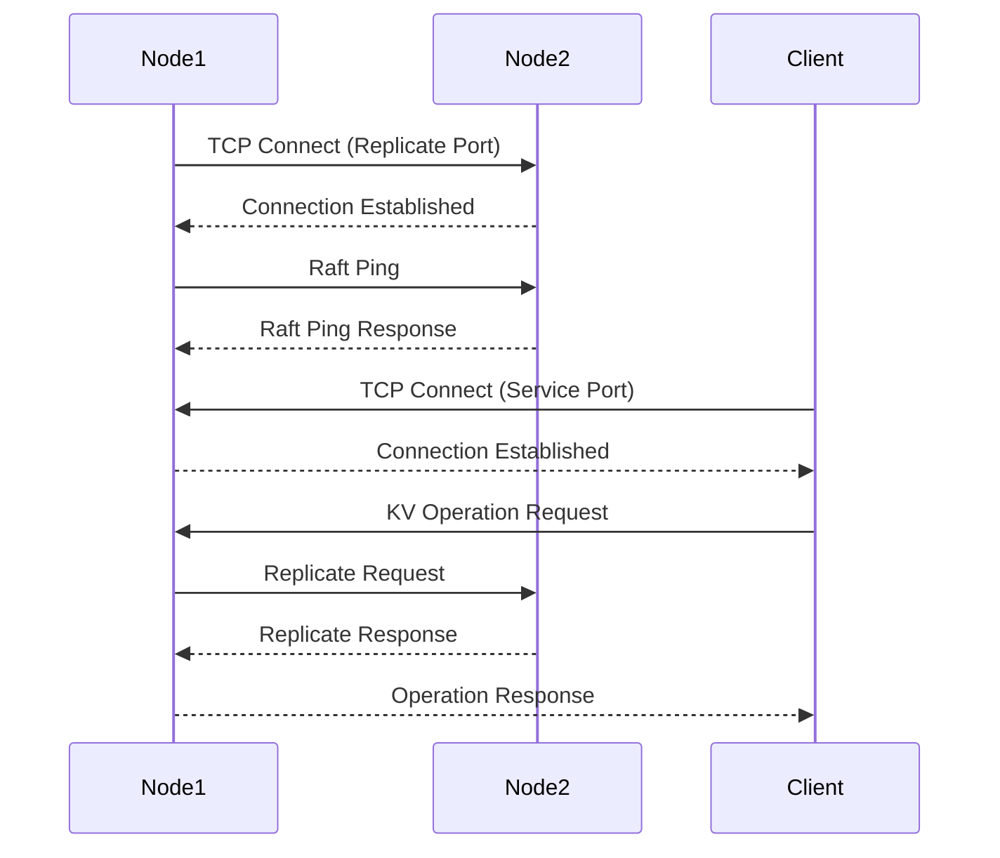
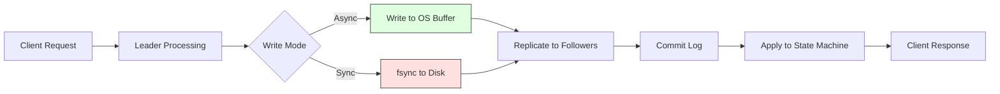
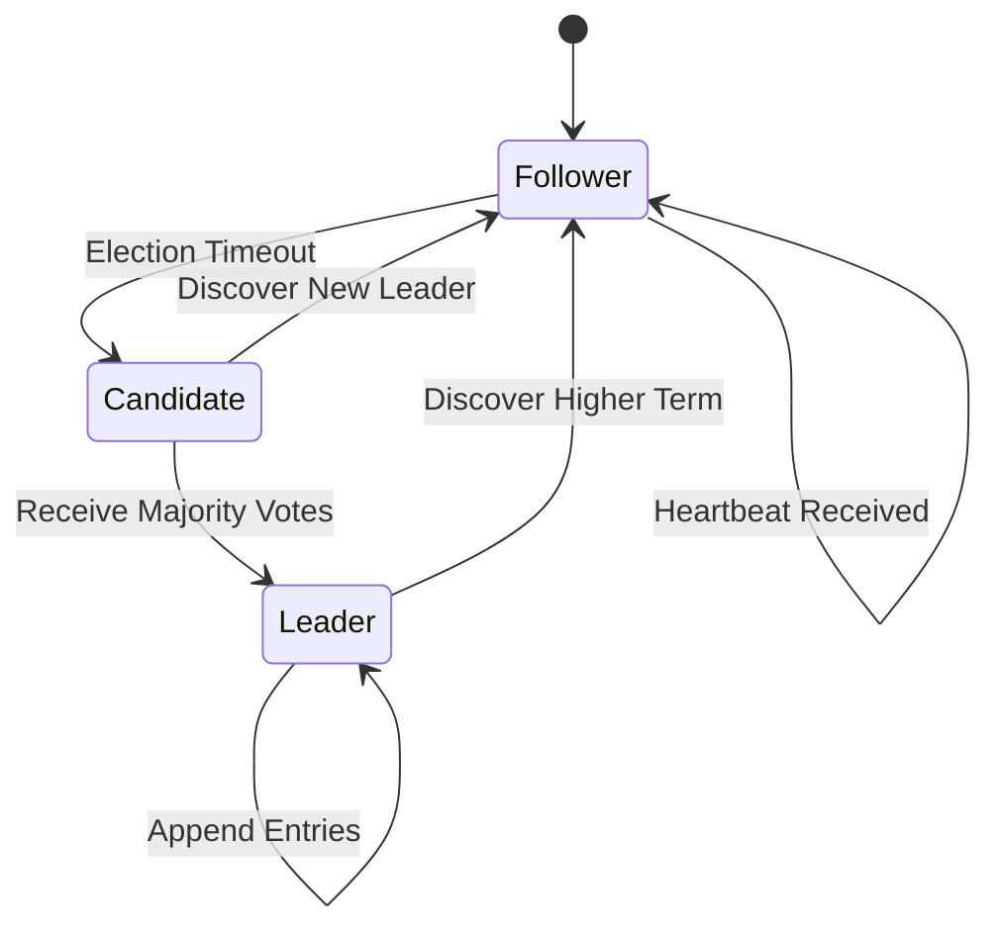

# Troubleshooting and Best Practices

<cite>
**Referenced Files in This Document**   
- [RaftServer.java](file://server/src/main/java/com/github/dtprj/dongting/raft/server/RaftServer.java)
- [KvClient.java](file://client/src/main/java/com/github/dtprj/dongting/dtkv/KvClient.java)
- [KvImpl.java](file://server/src/main/java/com/github/dtprj/dongting/dtkv/server/KvImpl.java)
- [AdminConfigChangeProcessor.java](file://server/src/main/java/com/github/dtprj/dongting/raft/rpc/AdminConfigChangeProcessor.java)
- [RaftServerConfig.java](file://server/src/main/java/com/github/dtprj/dongting/raft/server/RaftServerConfig.java)
- [RaftGroupConfig.java](file://server/src/main/java/com/github/dtprj/dongting/raft/server/RaftGroupConfig.java)
- [KvClientConfig.java](file://client/src/main/java/com/github/dtprj/dongting/dtkv/KvClientConfig.java)
- [2024_07_26_raft算法的工程实现秘笈.md](file://devlogs/2024_07_26_raft算法的工程实现秘笈.md)
- [2023_07_25_再论线性一致性.md](file://devlogs/2023_07_25_再论线性一致性.md)
- [README.md](file://README.md)
- [AGENTS.md](file://AGENTS.md)
- [docs/README.md](file://docs/README.md)
</cite>

## Table of Contents
1. [Introduction](#introduction)
2. [Common Issues and Diagnostic Procedures](#common-issues-and-diagnostic-procedures)
   - [Configuration Errors](#configuration-errors)
   - [Network Connectivity Problems](#network-connectivity-problems)
   - [Performance Bottlenecks](#performance-bottlenecks)
   - [Consensus Failures](#consensus-failures)
3. [Best Practices for Production Deployments](#best-practices-for-production-deployments)
   - [Configuration Management](#configuration-management)
   - [Resource Allocation](#resource-allocation)
   - [Backup Strategies](#backup-strategies)
   - [Upgrade Procedures](#upgrade-procedures)
4. [Operational Procedures](#operational-procedures)
   - [Cluster Maintenance](#cluster-maintenance)
   - [Node Replacement](#node-replacement)
   - [Disaster Recovery](#disaster-recovery)
5. [Performance Anti-Patterns and Solutions](#performance-anti-patterns-and-solutions)
6. [API Usage and Concurrency Best Practices](#api-usage-and-concurrency-best-practices)
7. [Deployment Validation and Performance Tuning Checklists](#deployment-validation-and-performance-tuning-checklists)
8. [Conclusion](#conclusion)

## Introduction

Dongting is a high-performance engine that integrates RAFT consensus, distributed configuration server (DtKV), low-level RPC, and planned message queue capabilities. The system is designed for linearizability and high throughput, with performance benchmarks showing over 1.7 million TPS in async write mode on commodity hardware. However, as noted in the project documentation, Dongting is currently in alpha stage (v0.8.x-ALPHA) and requires careful deployment and monitoring.

This document provides comprehensive troubleshooting guidance and best practices for Dongting deployments, drawing from source code analysis, devlogs, and operational experience. The content covers common issues such as configuration errors, network connectivity problems, performance bottlenecks, and consensus failures, along with diagnostic procedures, log analysis techniques, and monitoring indicators. It also documents best practices for production deployments, operational procedures, and performance optimization.

**Section sources**
- [README.md](file://README.md#L4-L141)
- [docs/README.md](file://docs/README.md#L1-L108)

## Common Issues and Diagnostic Procedures

### Configuration Errors

Configuration errors are among the most common issues in Dongting deployments. The system performs rigorous configuration validation through a process called "raft ping" that occurs after TCP connection establishment between nodes.

**Common Configuration Issues:**
- **Inconsistent server configurations**: When nodes have different server lists, the raft ping process will fail, preventing cluster formation. This is detected in `RaftServer` during initialization when validating the server list against the node's own ID.
- **Invalid port configurations**: Confusion between replicate port (for internal raft communication) and service port (for client access) can prevent proper operation. The replicate port is used for internal communication between raft nodes, while the service port is used for client connections like `KvClient`.
- **Incorrect member specifications**: When defining raft groups, member IDs must exist in the server list. The system validates this in `RaftServer.createRaftGroup()` by checking that all member IDs are present in the server list.

**Diagnostic Procedures:**
1. Check logs for raft ping failures, which indicate configuration mismatches between nodes.
2. Verify that each node's configuration matches across the cluster, particularly the `servers` parameter in `RaftServerConfig`.
3. Ensure that the replicate port and service port are correctly specified and not conflicting with other services.
4. Validate that member IDs in `RaftGroupConfig` correspond to actual node IDs in the server list.

**Monitoring Indicators:**
- `allMemberReadyFuture` completion status in `RaftServer` indicates whether all members have passed configuration validation.
- Log messages containing "raft ping" can indicate configuration validation progress or failures.

**Diagram sources**
- [RaftServer.java](file://server/src/main/java/com/github/dtprj/dongting/raft/server/RaftServer.java#L122-L139)
- [docs/README.md](file://docs/README.md#L36-L40)

**Section sources**
- [RaftServer.java](file://server/src/main/java/com/github/dtprj/dongting/raft/server/RaftServer.java#L122-L139)
- [docs/README.md](file://docs/README.md#L36-L40)

### Network Connectivity Problems

Network connectivity issues can prevent proper cluster formation and operation. Dongting uses a two-port architecture: replicate port for internal raft communication and service port for client access.

**Common Network Issues:**
- **Firewall blocking**: The replicate port (default 4000) and service port (default 5000) must be accessible between nodes and clients.
- **TCP connection failures**: Network instability can cause TCP connections to drop, requiring reconnection and raft ping validation.
- **Latency issues**: High network latency can affect raft election timeouts and performance.

**Diagnostic Procedures:**
1. Use network diagnostic tools (ping, telnet, netstat) to verify connectivity between nodes on both replicate and service ports.
2. Check `RaftServer` logs for connection establishment and raft ping messages.
3. Monitor the `nodeManager` in `RaftServer` for node status changes and connection retries.
4. Verify that the `connectTimeout` in `RaftServerConfig` is appropriate for the network conditions.

**Log Analysis Techniques:**
- Search for "NODE_PING" messages in logs to verify inter-node communication.
- Look for connection timeout or retry messages in the NioClient/NioServer components.
- Monitor the frequency of raft leader elections, which may indicate network instability.

**Monitoring Indicators:**
- `nodeManager.getNodePingReadyFuture()` completion indicates successful node connectivity.
- Frequency of raft leader elections can indicate network stability issues.
- Network round-trip times between nodes should be significantly less than the election timeout (default 15 seconds).

**Diagram sources**
- [RaftServer.java](file://server/src/main/java/com/github/dtprj/dongting/raft/server/RaftServer.java#L163-L167)
- [docs/README.md](file://docs/README.md#L36-L40)

**Section sources**
- [RaftServer.java](file://server/src/main/java/com/github/dtprj/dongting/raft/server/RaftServer.java#L163-L167)
- [docs/README.md](file://docs/README.md#L36-L40)

### Performance Bottlenecks

Performance bottlenecks in Dongting deployments can stem from various sources, including I/O limitations, resource constraints, and suboptimal configuration.

**Common Performance Issues:**
- **Disk I/O limitations**: The performance benchmarks show significant differences between sync and async write modes, indicating that disk I/O is often the bottleneck. With sync writes, performance drops from 1.7M TPS to 700K TPS in single-server mode.
- **CPU resource constraints**: The raft algorithm and fiber-based concurrency model can be CPU-intensive, especially during leader elections or configuration changes.
- **Memory pressure**: The system uses object pooling and memory queues to minimize GC pressure, but improper configuration can still lead to memory issues.

**Diagnostic Procedures:**
1. Monitor system metrics (CPU, memory, disk I/O) during operation to identify resource bottlenecks.
2. Analyze the performance difference between sync and async write modes to assess disk I/O impact.
3. Check for excessive garbage collection in JVM metrics, which may indicate memory pressure.
4. Use the performance callback mechanism in `RaftGroupConfig` to monitor internal performance metrics.

**Log Analysis Techniques:**
- Search for performance-related log messages, particularly those related to fsync/fdatasync operations.
- Monitor the frequency and duration of raft operations in logs.
- Analyze the timing of fiber execution and task processing.

**Monitoring Indicators:**
- Disk I/O utilization, particularly write latency and throughput.
- CPU utilization across all cores, as Dongting is designed to utilize multiple cores effectively.
- Memory usage patterns, watching for signs of memory leaks or excessive allocation.
- Network throughput between nodes, as this affects replication performance.

**Diagram sources**
- [README.md](file://README.md#L33-L45)
- [2024_07_26_raft算法的工程实现秘笈.md](file://devlogs/2024_07_26_raft算法的工程实现秘笈.md#L150-L166)

**Section sources**
- [README.md](file://README.md#L33-L45)
- [2024_07_26_raft算法的工程实现秘笈.md](file://devlogs/2024_07_26_raft算法的工程实现秘笈.md#L150-L166)

### Consensus Failures

Consensus failures in Dongting can occur due to network partitions, node failures, or configuration issues. The system uses the RAFT consensus algorithm with joint consensus for membership changes.

**Common Consensus Issues:**
- **Leader election failures**: When no node can achieve majority quorum, leader election fails. This can occur during network partitions or when too many nodes are down.
- **Joint consensus complications**: During membership changes using joint consensus, improper sequencing of prepare, commit, and abort phases can lead to inconsistent states.
- **Log replication failures**: When followers cannot keep up with the leader's log replication, it can lead to consistency issues.

**Diagnostic Procedures:**
1. Check the leader status of each node using the `queryRaftGroupStatus` API.
2. Monitor the `allGroupReadyFuture` in `RaftServer` to determine if groups have achieved consensus readiness.
3. Analyze logs for vote requests and responses to understand election dynamics.
4. Verify that joint consensus operations follow the correct sequence: prepare → commit (or abort).

**Log Analysis Techniques:**
- Search for "REQUEST_VOTE" and "VOTE" messages to trace election processes.
- Look for "APPEND_ENTRIES" and response messages to monitor log replication.
- Monitor "JOINT_CONSENSUS" related messages during membership changes.

**Monitoring Indicators:**
- Leader stability, measured by the frequency of leader elections.
- Log replication lag between leader and followers.
- Quorum status, ensuring that a majority of nodes are available and communicating.
- Election timeout occurrences, which may indicate network or performance issues.

**Diagram sources**
- [2024_07_26_raft算法的工程实现秘笈.md](file://devlogs/2024_07_26_raft算法的工程实现秘笈.md#L281-L331)
- [RaftServer.java](file://server/src/main/java/com/github/dtprj/dongting/raft/server/RaftServer.java#L696-L714)

**Section sources**
- [2024_07_26_raft算法的工程实现秘笈.md](file://devlogs/2024_07_26_raft算法的工程实现秘笈.md#L281-L331)
- [RaftServer.java](file://server/src/main/java/com/github/dtprj/dongting/raft/server/RaftServer.java#L696-L714)

## Best Practices for Production Deployments

### Configuration Management

Proper configuration management is critical for stable Dongting deployments. The system uses several configuration classes that must be carefully tuned for the deployment environment.

**Key Configuration Parameters:**
- **RaftServerConfig**: Controls server-wide settings including ports, timeouts, and thread counts.
  - `electTimeout` (default 15s): Should be set based on network latency and disk I/O performance.
  - `rpcTimeout` (default 5s): Should be less than election timeout to prevent unnecessary elections.
  - `blockIoThreads`: Automatically set to max of (2 * CPU cores, 4) to balance I/O processing.
- **RaftGroupConfig**: Controls group-specific settings including storage, replication, and snapshot policies.
  - `syncForce` (default true): Controls whether fsync is called synchronously (higher durability, lower performance).
  - `saveSnapshotSeconds` (default 3600): Interval for automatic snapshot creation.
  - `maxKeepSnapshots` (default 2): Number of snapshots to retain.
- **KvClientConfig**: Controls client behavior including watch heartbeats and retry policies.
  - `watchHeartbeatMillis` (default 60s): Should be less than server's watch timeout.

**Best Practices:**
1. Use consistent configuration across all nodes in a cluster to prevent raft ping failures.
2. Set election timeout based on the 99th percentile of round-trip times between nodes.
3. Configure `syncForce` based on durability requirements: use async mode for higher throughput when some data loss on power failure is acceptable.
4. Regularly test configuration changes in a staging environment before applying to production.

**Section sources**
- [RaftServerConfig.java](file://server/src/main/java/com/github/dtprj/dongting/raft/server/RaftServerConfig.java#L1-L40)
- [RaftGroupConfig.java](file://server/src/main/java/com/github/dtprj/dongting/raft/server/RaftGroupConfig.java#L1-L76)
- [KvClientConfig.java](file://client/src/main/java/com/github/dtprj/dongting/dtkv/KvClientConfig.java#L1-L32)

### Resource Allocation

Effective resource allocation is essential for optimal Dongting performance. The system is designed to be resource-efficient with zero external dependencies.

**CPU Allocation:**
- Dongting can utilize multiple CPU cores effectively through its fiber-based concurrency model.
- The `blockIoThreads` parameter in `RaftServerConfig` should be set to leverage available CPU resources for I/O operations.
- For high-throughput deployments, ensure that CPU resources are not oversubscribed, as this can impact raft timing and stability.

**Memory Allocation:**
- The system uses object pooling (ByteBufferPool) to minimize garbage collection overhead.
- Memory allocation should consider the maximum expected load, including pending requests and cache sizes.
- JVM heap size should be sufficient to handle the working set without excessive GC pauses.

**Storage Allocation:**
- Use fast storage devices (SSDs) for optimal performance, though the system can run on HDDs.
- Allocate sufficient disk space for raft logs and snapshots, considering the log retention policy.
- For critical deployments, use storage with power-loss protection to ensure fsync reliability.

**Network Allocation:**
- Ensure sufficient network bandwidth between nodes to handle replication traffic.
- Use low-latency network connections to minimize raft election timeouts and improve performance.
- Consider network topology when deploying across data centers or availability zones.

**Best Practices:**
1. Monitor resource utilization under load to identify bottlenecks.
2. Use the performance testing framework to determine optimal resource allocation for your workload.
3. Allocate resources with headroom for peak loads and failover scenarios.
4. Regularly review and adjust resource allocation based on usage patterns and performance metrics.

**Section sources**
- [README.md](file://README.md#L19-L23)
- [RaftServerConfig.java](file://server/src/main/java/com/github/dtprj/dongting/raft/server/RaftServerConfig.java#L37-L39)
- [RaftGroupConfig.java](file://server/src/main/java/com/github/dtprj/dongting/raft/server/RaftGroupConfig.java#L59-L62)

### Backup Strategies

Backup strategies for Dongting should focus on ensuring data durability and enabling disaster recovery.

**Snapshot-Based Backups:**
- The system automatically creates snapshots at intervals defined by `saveSnapshotSeconds` (default 1 hour).
- Snapshots can be manually triggered using the admin API.
- Multiple snapshots are retained (controlled by `maxKeepSnapshots`) to provide recovery points.

**Log-Based Backups:**
- Raft logs provide a complete history of state changes and can be used for point-in-time recovery.
- Logs are automatically deleted after snapshots are taken (controlled by `deleteLogsAfterTakeSnapshot`).
- For long-term retention, logs should be archived before deletion.

**Backup Best Practices:**
1. Implement regular snapshot backups with retention policies that meet business requirements.
2. Store backups in durable, geographically distributed storage to protect against data center failures.
3. Test backup restoration procedures regularly to ensure recoverability.
4. Monitor backup completion and verify integrity of backup files.
5. Consider using incremental backups to reduce storage requirements and backup windows.

**Section sources**
- [RaftGroupConfig.java](file://server/src/main/java/com/github/dtprj/dongting/raft/server/RaftGroupConfig.java#L59-L62)
- [RaftServer.java](file://server/src/main/java/com/github/dtprj/dongting/raft/server/RaftServer.java#L519-L522)

### Upgrade Procedures

Upgrade procedures for Dongting should minimize downtime and ensure cluster stability.

**Rolling Upgrades:**
- Upgrade nodes one at a time, ensuring each node is healthy before proceeding to the next.
- Monitor cluster health and performance during the upgrade process.
- Use the same version across all nodes to prevent compatibility issues.

**Configuration Changes:**
- Use the admin API for runtime configuration changes rather than restarting nodes.
- Test configuration changes in a staging environment before applying to production.
- Document all configuration changes and their rationale.

**Version Compatibility:**
- Ensure backward compatibility when upgrading, particularly for storage formats and network protocols.
- Test upgrades thoroughly in a staging environment that mirrors production.
- Have a rollback plan in case of upgrade issues.

**Best Practices:**
1. Schedule upgrades during maintenance windows with minimal impact on users.
2. Monitor system metrics closely during and after upgrades.
3. Use health checks to verify node and cluster status after each upgrade step.
4. Document the upgrade process and lessons learned for future reference.

**Section sources**
- [RaftServer.java](file://server/src/main/java/com/github/dtprj/dongting/raft/server/RaftServer.java#L572-L666)
- [AdminConfigChangeProcessor.java](file://server/src/main/java/com/github/dtprj/dongting/raft/rpc/AdminConfigChangeProcessor.java#L1-L104)

## Operational Procedures

### Cluster Maintenance

Regular cluster maintenance is essential for long-term stability and performance.

**Routine Maintenance Tasks:**
- Monitor cluster health and performance metrics.
- Review logs for warnings and errors.
- Verify backup completion and integrity.
- Check disk space and other resource utilization.

**Maintenance Best Practices:**
1. Implement automated monitoring and alerting for key metrics.
2. Schedule regular maintenance windows for proactive tasks.
3. Document all maintenance activities and their outcomes.
4. Use the provided demos and testing framework to validate cluster functionality.

**Section sources**
- [README.md](file://README.md#L79-L111)
- [demos](file://demos)

### Node Replacement

Node replacement procedures should ensure minimal disruption to cluster operations.

**Replacement Process:**
1. Add the new node as an observer to allow log synchronization.
2. Once the new node is caught up, promote it to a full member.
3. Remove the old node from the cluster configuration.
4. Verify cluster stability after the replacement.

**Best Practices:**
1. Replace nodes one at a time to maintain quorum.
2. Monitor replication lag during the synchronization phase.
3. Use the same configuration for replacement nodes to prevent issues.
4. Test the replacement procedure in a staging environment first.

**Section sources**
- [2024_07_26_raft算法的工程实现秘笈.md](file://devlogs/2024_07_26_raft算法的工程实现秘笈.md#L67-L73)
- [README.md](file://README.md#L95-L101)

### Disaster Recovery

Disaster recovery planning is critical for ensuring business continuity.

**Recovery Strategies:**
- **Full cluster recovery**: Restore from backups when all nodes are lost.
- **Partial recovery**: Recover individual nodes from backups or by rejoining the cluster.
- **Data center failover**: Switch to a geographically distributed cluster in another location.

**Recovery Best Practices:**
1. Regularly test disaster recovery procedures to ensure they work as expected.
2. Maintain up-to-date documentation of the recovery process.
3. Store backups in multiple locations to protect against site failures.
4. Implement monitoring to detect failures quickly and initiate recovery.

**Section sources**
- [RaftGroupConfig.java](file://server/src/main/java/com/github/dtprj/dongting/raft/server/RaftGroupConfig.java#L59-L62)
- [RaftServer.java](file://server/src/main/java/com/github/dtprj/dongting/raft/server/RaftServer.java#L519-L522)

## Performance Anti-Patterns and Solutions

### Anti-Pattern: Blocking Operations in Async Callbacks

**Problem:** Performing blocking or CPU-intensive operations in asynchronous callbacks can stall the raft thread or IO threads, leading to performance degradation and potential consensus failures.

**Solution:** As documented in the developer guide, callbacks for asynchronous operations may be executed on raft threads or IO threads. Therefore, never perform blocking or CPU-intensive operations within these callbacks. Use the synchronous interface if unsure.

**Section sources**
- [docs/README.md](file://docs/README.md#L41-L45)

### Anti-Pattern: Inadequate Election Timeout Configuration

**Problem:** Setting election timeout too low can cause unnecessary leader elections due to transient network delays. Setting it too high increases failover time.

**Solution:** Configure election timeout based on network conditions and disk I/O performance. The devlog on lease calculation recommends setting lease time slightly less than election timeout to ensure stability.

**Section sources**
- [2024_07_26_raft算法的工程实现秘笈.md](file://devlogs/2024_07_26_raft算法的工程实现秘笈.md#L247-L248)
- [RaftServerConfig.java](file://server/src/main/java/com/github/dtprj/dongting/raft/server/RaftServerConfig.java#L28-L29)

### Anti-Pattern: Synchronous Operations with Insufficient Threads

**Problem:** Using synchronous operations with insufficient threads can limit throughput, as synchronous operations require many threads to reach higher throughput.

**Solution:** For maximum throughput with a single `KvClient`, use asynchronous operations. If using synchronous operations, ensure sufficient threads are available to handle the workload.

**Section sources**
- [docs/README.md](file://docs/README.md#L41-L42)

## API Usage and Concurrency Best Practices

### Proper API Usage

**Synchronous vs Asynchronous Interfaces:**
- Use asynchronous interfaces for maximum throughput with a single client.
- Use synchronous interfaces when the complexity of handling callbacks is undesirable.
- Never perform blocking operations in asynchronous callbacks.

**Key API Considerations:**
- The `KvClient` provides both synchronous and asynchronous interfaces for all operations.
- Callbacks are executed on raft threads or IO threads, so they should be lightweight.
- Use the appropriate timeout settings for operations to prevent hanging requests.

**Section sources**
- [KvClient.java](file://client/src/main/java/com/github/dtprj/dongting/dtkv/KvClient.java#L41-L45)
- [docs/README.md](file://docs/README.md#L41-L45)

### Concurrency Pitfalls and Solutions

**Fiber-Based Concurrency:**
- Dongting uses a fiber-based concurrency model (documented in "3000行代码实现fiber.md") to achieve high performance.
- Fibers are lightweight threads that allow for efficient concurrent processing.
- Avoid blocking operations within fibers to maintain performance.

**Thread Safety:**
- The system uses StampedLock in `KvImpl` for efficient read-write synchronization.
- Custom implementations should follow similar patterns for thread safety.
- Be aware of the different thread contexts (raft threads, IO threads, fiber threads) when designing applications.

**Best Practices:**
1. Design applications to be non-blocking and asynchronous where possible.
2. Use the provided concurrency primitives rather than implementing custom solutions.
3. Test concurrency patterns under load to identify potential issues.
4. Monitor for thread contention and adjust designs as needed.

**Section sources**
- [KvImpl.java](file://server/src/main/java/com/github/dtprj/dongting/dtkv/server/KvImpl.java#L66-L69)
- [2024_07_16_3000行代码实现fiber.md](file://devlogs/2024_07_16_3000行代码实现fiber.md)

## Deployment Validation and Performance Tuning Checklists

### Deployment Validation Checklist

- [ ] Verify network connectivity between all nodes on both replicate and service ports
- [ ] Confirm consistent configuration across all nodes
- [ ] Validate that each node can resolve hostnames and IP addresses correctly
- [ ] Test raft ping between all nodes
- [ ] Verify that the cluster can elect a leader
- [ ] Test basic read/write operations through the client
- [ ] Confirm backup and snapshot mechanisms are working
- [ ] Validate monitoring and alerting configurations
- [ ] Test failover scenarios
- [ ] Verify disaster recovery procedures

**Section sources**
- [README.md](file://README.md#L79-L111)
- [RaftServer.java](file://server/src/main/java/com/github/dtprj/dongting/raft/server/RaftServer.java#L467-L473)

### Performance Tuning Checklist

- [ ] Measure baseline performance with the provided benchmark tools
- [ ] Tune election timeout based on network latency
- [ ] Evaluate sync vs async write modes for durability/performance trade-offs
- [ ] Adjust block IO threads based on CPU resources
- [ ] Optimize snapshot frequency and retention
- [ ] Monitor and tune memory usage and garbage collection
- [ ] Validate network bandwidth is sufficient for replication
- [ ] Test under peak load conditions
- [ ] Implement and test scaling procedures
- [ ] Document performance characteristics and tuning decisions

**Section sources**
- [README.md](file://README.md#L27-L45)
- [RaftServerConfig.java](file://server/src/main/java/com/github/dtprj/dongting/raft/server/RaftServerConfig.java#L28-L32)
- [RaftGroupConfig.java](file://server/src/main/java/com/github/dtprj/dongting/raft/server/RaftGroupConfig.java#L31-L38)

## Conclusion

Dongting provides a high-performance, zero-dependency foundation for distributed systems requiring RAFT consensus, distributed configuration, and low-level RPC capabilities. While the system demonstrates impressive performance characteristics, with over 1.7 million TPS in optimal conditions, it requires careful deployment and management to achieve reliable operation.

This document has outlined comprehensive troubleshooting guidance and best practices for Dongting deployments, covering common issues such as configuration errors, network connectivity problems, performance bottlenecks, and consensus failures. It has provided diagnostic procedures, log analysis techniques, and monitoring indicators for each problem category, along with best practices for production deployments, operational procedures, and performance optimization.

Key takeaways include the importance of consistent configuration management, proper resource allocation, and careful tuning of consensus parameters. The system's fiber-based concurrency model and efficient I/O handling enable high throughput, but also require adherence to best practices regarding non-blocking operations and thread usage.

As Dongting continues to evolve from its current alpha stage, ongoing attention to these operational considerations will be essential for successful production deployments. Regular monitoring, proactive maintenance, and thorough testing of disaster recovery procedures will help ensure the reliability and performance of Dongting-based systems.

**Section sources**
- [README.md](file://README.md#L124-L128)
- [2024_07_26_raft算法的工程实现秘笈.md](file://devlogs/2024_07_26_raft算法的工程实现秘笈.md#L333-L343)