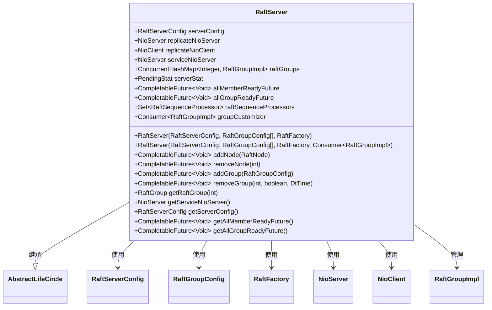
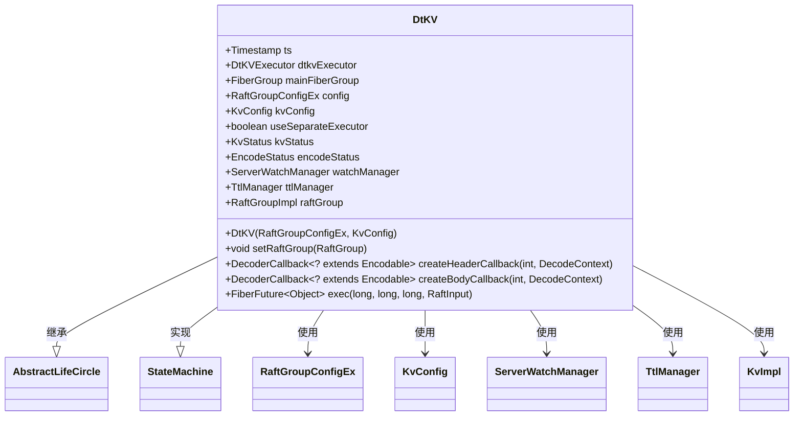
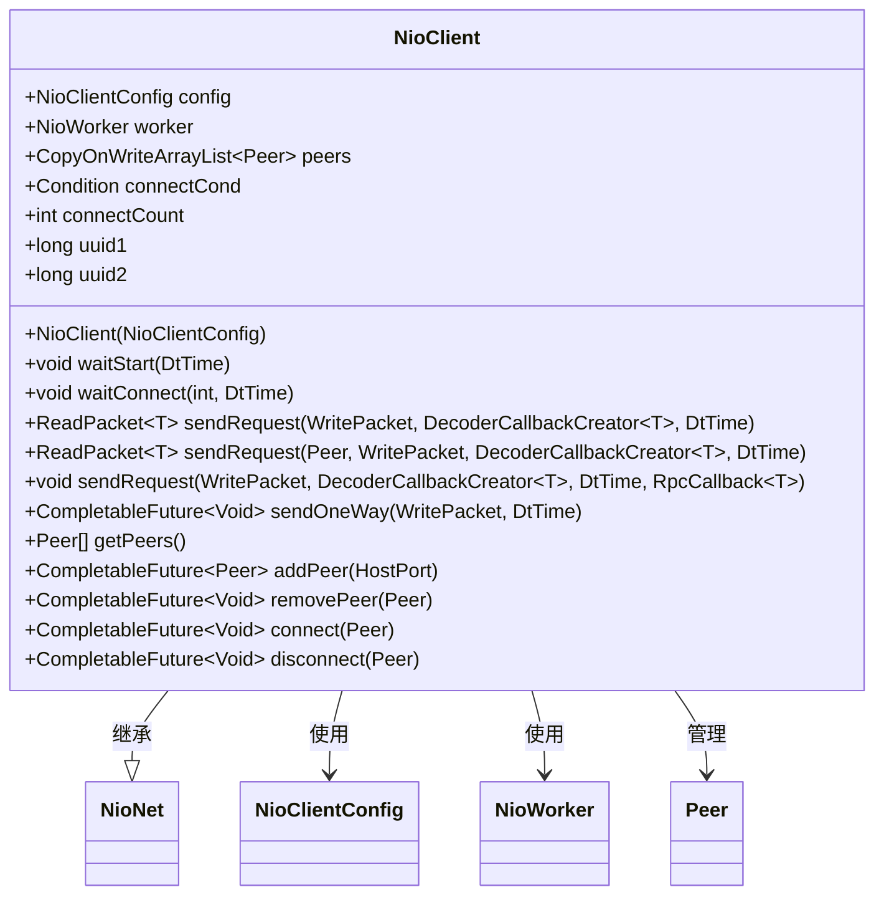
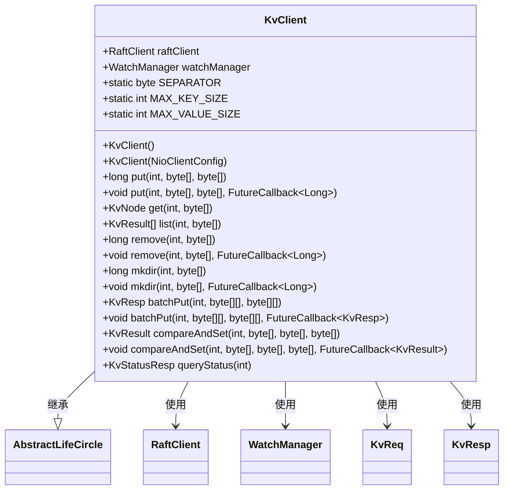

# API参考

<cite>
**本文档中引用的文件**  
- [RaftServer.java](file://server/src/main/java/com/github/dtprj/dongting/raft/server/RaftServer.java)
- [DtKV.java](file://server/src/main/java/com/github/dtprj/dongting/dtkv/server/DtKV.java)
- [NioClient.java](file://client/src/main/java/com/github/dtprj/dongting/net/NioClient.java)
- [KvClient.java](file://client/src/main/java/com/github/dtprj/dongting/dtkv/KvClient.java)
- [RaftServerConfig.java](file://server/src/main/java/com/github/dtprj/dongting/raft/server/RaftServerConfig.java)
- [KvConfig.java](file://server/src/main/java/com/github/dtprj/dongting/dtkv/server/KvConfig.java)
- [Commands.java](file://client/src/main/java/com/github/dtprj/dongting/net/Commands.java)
</cite>

## 目录
1. [简介](#简介)
2. [核心类API](#核心类api)
   1. [RaftServer](#raftserver)
   2. [DtKV](#dtkv)
   3. [NioClient](#nioclient)
   4. [KvClient](#kvclient)
3. [配置类](#配置类)
   1. [RaftServerConfig](#raftserverconfig)
   2. [KvConfig](#kvconfig)
4. [常量与命令](#常量与命令)
5. [使用示例](#使用示例)

## 简介
本文档提供了Dongting分布式系统核心API的详细参考，涵盖RaftServer、DtKV、NioClient等关键类。文档采用Javadoc风格，对每个类、方法、参数和返回值进行精确描述，明确指出线程安全性、可能抛出的异常以及使用约束，并为每个API提供简洁的使用示例。

## 核心类API

### RaftServer
RaftServer是Dongting系统的核心服务端组件，负责管理Raft一致性协议的运行，包括日志复制、领导者选举和状态机应用。它作为Raft集群的主控节点，协调多个Raft组的运行。



**Diagram sources**
- [RaftServer.java](file://server/src/main/java/com/github/dtprj/dongting/raft/server/RaftServer.java#L104-L123)

**Section sources**
- [RaftServer.java](file://server/src/main/java/com/github/dtprj/dongting/raft/server/RaftServer.java#L104-L663)

#### 构造函数
- **`RaftServer(RaftServerConfig serverConfig, List<RaftGroupConfig> groupConfig, RaftFactory raftFactory)`**
  - **描述**: 使用指定的服务器配置、组配置和工厂创建RaftServer实例。
  - **参数**:
    - `serverConfig`: Raft服务器的配置，包含节点ID、端口等信息。
    - `groupConfig`: Raft组的配置列表，定义了每个Raft组的成员和观察者。
    - `raftFactory`: 用于创建各种组件（如调度器、状态机）的工厂。
  - **异常**: 如果任一参数为null，抛出`IllegalArgumentException`。
  - **线程安全性**: 构造函数本身是线程安全的，但创建的实例需要在单线程中初始化。

- **`RaftServer(RaftServerConfig serverConfig, List<RaftGroupConfig> groupConfig, RaftFactory raftFactory, Consumer<RaftGroupImpl> groupCustomizer)`**
  - **描述**: 与上述构造函数类似，但允许提供一个自定义器，在Raft组创建后对其进行自定义。
  - **参数**:
    - `groupCustomizer`: 在Raft组创建后调用的消费者，可用于注入自定义逻辑。
  - **使用约束**: `groupCustomizer`在Raft组初始化期间调用，应避免执行耗时操作。

#### 核心方法
- **`CompletableFuture<Void> addNode(RaftNode node)`**
  - **描述**: 动态添加一个新的节点到集群中。这是一个管理API，可能阻塞。
  - **参数**: `node` - 要添加的Raft节点。
  - **返回值**: 当新节点连接成功后完成的`CompletableFuture`。
  - **线程安全性**: 方法是线程安全的，可在任意线程调用。
  - **使用示例**: 
    ```java
    RaftNode newNode = new RaftNode(4, new HostPort("127.0.0.1", 5004));
    CompletableFuture<Void> future = raftServer.addNode(newNode);
    future.get(); // 等待添加完成
    ```

- **`CompletableFuture<Void> removeNode(int nodeId)`**
  - **描述**: 从集群中移除一个节点。这是一个管理API，可能阻塞。
  - **参数**: `nodeId` - 要移除的节点ID。
  - **返回值**: 当节点成功移除后完成的`CompletableFuture`。
  - **异常**: 如果节点的引用计数不为0，future将异常完成。
  - **使用约束**: 该操作是幂等的，如果节点不存在，future将正常完成。

- **`CompletableFuture<Void> addGroup(RaftGroupConfig groupConfig)`**
  - **描述**: 动态添加一个新的Raft组。这不是幂等操作。
  - **参数**: `groupConfig` - 新Raft组的配置。
  - **返回值**: 当Raft组初始化完成后完成的`CompletableFuture`。
  - **使用约束**: 调用者必须等待返回的`CompletableFuture`以确保Raft组已正确初始化。

- **`CompletableFuture<Void> removeGroup(int groupId, boolean saveSnapshot, DtTime shutdownTimeout)`**
  - **描述**: 移除一个Raft组。这是一个管理API，是幂等的。
  - **参数**:
    - `groupId` - 要移除的组ID。
    - `saveSnapshot` - 是否在关闭前保存快照。
    - `shutdownTimeout` - 关闭超时时间。
  - **返回值**: 当组成功移除后完成的`CompletableFuture`。
  - **使用示例**:
    ```java
    DtTime timeout = new DtTime(5, TimeUnit.SECONDS);
    CompletableFuture<Void> future = raftServer.removeGroup(101, true, timeout);
    future.get(); // 等待移除完成
    ```

- **`RaftGroup getRaftGroup(int groupId)`**
  - **描述**: 根据组ID获取Raft组实例。
  - **参数**: `groupId` - 目标Raft组的ID。
  - **返回值**: 对应的Raft组实例，如果不存在则返回null。
  - **线程安全性**: 方法是线程安全的。

- **`NioServer getServiceNioServer()`**
  - **描述**: 获取用于客户端访问的服务NioServer实例。
  - **返回值**: 服务NioServer实例，如果`servicePort`为0则返回null。
  - **使用约束**: 该方法返回的服务器在`RaftServer`启动后才可用。

### DtKV
DtKV是基于Raft协议的分布式键值存储状态机实现。它作为Raft协议的状态机，处理所有与键值存储相关的读写操作，并保证数据的线性一致性。



**Diagram sources**
- [DtKV.java](file://server/src/main/java/com/github/dtprj/dongting/dtkv/server/DtKV.java#L0-L200)

**Section sources**
- [DtKV.java](file://server/src/main/java/com/github/dtprj/dongting/dtkv/server/DtKV.java#L0-L402)

#### 构造函数
- **`DtKV(RaftGroupConfigEx config, KvConfig kvConfig)`**
  - **描述**: 创建DtKV状态机实例。
  - **参数**:
    - `config`: Raft组的扩展配置。
    - `kvConfig`: 键值存储的特定配置。
  - **内部组件**: 初始化`ServerWatchManager`用于监听通知，`TtlManager`用于管理过期键。

#### 核心方法
- **`void setRaftGroup(RaftGroup raftGroup)`**
  - **描述**: 设置该状态机所属的Raft组。
  - **参数**: `raftGroup` - 所属的Raft组。
  - **使用约束**: 此方法由Raft框架调用，不应由用户直接调用。

- **`DecoderCallback<? extends Encodable> createBodyCallback(int bizType, DecodeContext context)`**
  - **描述**: 为指定的业务类型创建解码回调，用于解析网络请求体。
  - **参数**:
    - `bizType`: 业务类型，如`BIZ_TYPE_PUT`、`BIZ_TYPE_REMOVE`等。
    - `context`: 解码上下文。
  - **返回值**: 用于解析请求体的解码回调。
  - **线程安全性**: 方法是线程安全的。

- **`FiberFuture<Object> exec(long index, long leaderCreateTimeMillis, long localCreateNanos, RaftInput input)`**
  - **描述**: 执行一个Raft日志条目，这是状态机的核心方法。
  - **参数**:
    - `index`: 日志条目的索引。
    - `leaderCreateTimeMillis`: 领导者创建日志条目的时间。
    - `localCreateNanos`: 本地创建日志条目的纳秒时间。
    - `input`: Raft输入，包含业务类型和请求体。
  - **返回值**: 表示执行结果的`FiberFuture`。
  - **内部逻辑**: 根据`bizType`分发到不同的处理方法，如`put`、`remove`、`batchPut`等。
  - **线程安全性**: 方法内部处理了线程执行器的切换，确保操作在正确的线程上下文中执行。

### NioClient
NioClient是Dongting系统的网络客户端组件，负责与远程服务器建立连接并发送请求。它基于NIO实现，支持异步和同步的网络通信。



**Diagram sources**
- [NioClient.java](file://client/src/main/java/com/github/dtprj/dongting/net/NioClient.java#L0-L300)

**Section sources**
- [NioClient.java](file://client/src/main/java/com/github/dtprj/dongting/net/NioClient.java#L0-L345)

#### 构造函数
- **`NioClient(NioClientConfig config)`**
  - **描述**: 使用指定的配置创建NioClient实例。
  - **参数**: `config` - 客户端配置，包含主机端口列表、连接超时等。
  - **初始化**: 创建`NioWorker`并注册`PingProcessor`用于心跳检测。

#### 核心方法
- **`void waitStart(DtTime timeout)`**
  - **描述**: 等待客户端启动完成，确保至少与一个服务器建立连接。
  - **参数**: `timeout` - 等待超时时间。
  - **异常**: 如果超时或被中断，抛出`NetTimeoutException`或`NetException`。
  - **使用示例**:
    ```java
    NioClient client = new NioClient(config);
    client.start();
    DtTime timeout = new DtTime(5, TimeUnit.SECONDS);
    client.waitStart(timeout); // 等待连接建立
    ```

- **`ReadPacket<T> sendRequest(WritePacket request, DecoderCallbackCreator<T> decoder, DtTime timeout)`**
  - **描述**: 同步发送一个请求并等待响应。
  - **参数**:
    - `request`: 要发送的写包。
    - `decoder`: 用于解码响应的回调创建器。
    - `timeout` - 请求超时时间。
  - **返回值**: 响应数据包。
  - **线程安全性**: 方法是线程安全的，但会阻塞调用线程。

- **`void sendRequest(WritePacket request, DecoderCallbackCreator<T> decoder, DtTime timeout, RpcCallback<T> callback)`**
  - **描述**: 异步发送一个请求，通过回调处理响应。
  - **参数**:
    - `callback` - 响应或异常发生时调用的回调。
  - **使用约束**: 回调可能在NioClient的工作线程上执行，因此不应执行阻塞或CPU密集型操作。

- **`CompletableFuture<Void> sendOneWay(WritePacket request, DtTime timeout)`**
  - **描述**: 发送一个单向请求（不需要响应）。
  - **参数**: `request` - 要发送的写包。
  - **返回值**: 当请求成功发送到网络后完成的`CompletableFuture`。
  - **使用场景**: 适用于日志记录、监控数据上报等不需要确认的场景。

- **`CompletableFuture<Peer> addPeer(HostPort hostPort)`**
  - **描述**: 动态添加一个新的对等节点。
  - **参数**: `hostPort` - 新对等节点的主机和端口。
  - **返回值**: 当对等节点添加并连接成功后完成的`CompletableFuture`。
  - **线程安全性**: 方法是线程安全的。

### KvClient
KvClient是DtKV键值存储的客户端API，为用户提供了一套简洁的接口来访问分布式键值存储。它封装了底层的Raft和网络通信细节。



**Diagram sources**
- [KvClient.java](file://client/src/main/java/com/github/dtprj/dongting/dtkv/KvClient.java#L0-L200)

**Section sources**
- [KvClient.java](file://client/src/main/java/com/github/dtprj/dongting/dtkv/KvClient.java#L0-L750)

#### 构造函数
- **`KvClient()`**
  - **描述**: 使用默认的NioClient配置创建KvClient实例。
  - **内部组件**: 创建`RaftClient`并注册`WatchProcessor`用于处理监听通知。

- **`KvClient(NioClientConfig nioConfig)`**
  - **描述**: 使用指定的NioClient配置创建KvClient实例。
  - **参数**: `nioConfig` - 网络客户端配置。

#### 核心方法
- **`long put(int groupId, byte[] key, byte[] value)`**
  - **描述**: 同步地将键值对存入存储。
  - **参数**:
    - `groupId` - Raft组ID。
    - `key` - 键，不能为空，使用'.'作为路径分隔符。
    - `value` - 值，不能为空。
  - **返回值**: 该写操作的Raft索引。
  - **异常**: 
    - `KvException`: 如果键已存在且为临时节点，抛出`IS_TEMP_NODE`错误。
    - `NetException`: 网络错误、超时或中断。
  - **使用示例**:
    ```java
    KvClient client = new KvClient();
    client.start();
    try {
        long index = client.put(101, "user.name".getBytes(), "Alice".getBytes());
        System.out.println("Put successful at index: " + index);
    } finally {
        client.stop(new DtTime(1, TimeUnit.SECONDS));
    }
    ```

- **`void put(int groupId, byte[], byte[], FutureCallback<Long>)`**
  - **描述**: 异步地将键值对存入存储。
  - **参数**: `callback` - 操作完成时调用的回调。
  - **线程安全性**: 回调在NioClient工作线程上执行，应避免阻塞操作。

- **`KvNode get(int groupId, byte[] key)`**
  - **描述**: 同步获取指定键的值。
  - **参数**: `key` - 要获取的键。
  - **返回值**: `KvNode`对象，如果键不存在则返回null。
  - **线程安全性**: 方法是线程安全的。

- **`long remove(int groupId, byte[] key)`**
  - **描述**: 同步删除指定的键。
  - **参数**: `key` - 要删除的键。
  - **返回值**: 删除操作的Raft索引。
  - **异常**: `KvException`如果键不存在或为目录。

- **`KvResp batchPut(int groupId, List<byte[]> keys, List<byte[]> values)`**
  - **描述**: 批量插入多个键值对。
  - **参数**: `keys`和`values` - 键和值的列表，必须等长。
  - **返回值**: 包含每个操作结果的`KvResp`。
  - **使用约束**: 所有操作作为一个原子批次执行。

- **`KvResult compareAndSet(int groupId, byte[] key, byte[] expectedValue, byte[] newValue)`**
  - **描述**: 比较并设置操作，实现CAS语义。
  - **参数**: `expectedValue` - 期望的当前值。
  - **返回值**: 操作结果，包含业务码和节点信息。
  - **使用场景**: 实现乐观锁或条件更新。

## 配置类

### RaftServerConfig
RaftServerConfig类定义了Raft服务器的基本配置参数。

**Section sources**
- [RaftServerConfig.java](file://server/src/main/java/com/github/dtprj/dongting/raft/server/RaftServerConfig.java#L0-L37)

#### 字段
- **`String servers`**: 集群中所有服务器的列表，格式为`id,host:port;id,host:port;...`。
- **`int replicatePort`**: 用于服务器间日志复制的端口。
- **`int servicePort`**: 用于客户端访问的服务端口，0表示不启动服务。
- **`int nodeId`**: 当前服务器的唯一ID。
- **`long electTimeout`**: 选举超时时间（毫秒），默认15秒。
- **`long rpcTimeout`**: RPC调用超时时间（毫秒），默认5秒。
- **`long connectTimeout`**: 连接超时时间（毫秒），默认2秒。
- **`long heartbeatInterval`**: 心跳间隔（毫秒），默认2秒。
- **`boolean checkSelf`**: 是否检查自身配置的有效性，默认true。
- **`int blockIoThreads`**: 用于阻塞I/O操作的线程数，默认为CPU核心数的两倍，最少4个。

### KvConfig
KvConfig类定义了DtKV键值存储的特定配置。

**Section sources**
- [KvConfig.java](file://server/src/main/java/com/github/dtprj/dongting/dtkv/server/KvConfig.java#L0-L28)

#### 字段
- **`boolean useSeparateExecutor`**: 是否使用独立的执行器处理DtKV操作，默认false。
- **`int initMapCapacity`**: 内部哈希表的初始容量，默认16384。
- **`float loadFactor`**: 哈希表的负载因子，默认0.75。
- **`int watchDispatchIntervalMillis`**: 监听事件分发的间隔时间（毫秒），默认500。
- **`int watchMaxReqBytes`**: 单个监听请求的最大字节数，默认80KB。
- **`int watchMaxBatchSize`**: 单次推送的最大监听事件数，默认100。

## 常量与命令
Commands类定义了系统中所有RPC命令的常量。

**Section sources**
- [Commands.java](file://client/src/main/java/com/github/dtprj/dongting/net/Commands.java#L29-L65)

#### 常量
- **`NODE_PING = 40`**: 节点间心跳检测命令。
- **`RAFT_PING = 41`**: Raft组内成员心跳命令。
- **`RAFT_REQUEST_VOTE = 42`**: 请求投票命令。
- **`RAFT_INSTALL_SNAPSHOT = 43`**: 安装快照命令。
- **`RAFT_ADMIN_TRANSFER_LEADER = 44`**: 管理员发起的领导者转移命令。
- **`RAFT_TRANSFER_LEADER = 45`**: 领导者之间的领导者转移命令。
- **`RAFT_QUERY_STATUS = 46`**: 查询Raft状态命令。
- **`DTKV_REMOVE = 70`**: 删除键值对命令。
- **`DTKV_MKDIR = 71`**: 创建目录命令。
- **`DTKV_BATCH_PUT = 74`**: 批量插入命令。
- **`DTKV_CAS = 76`**: 比较并设置命令。
- **`DTKV_WATCH_NOTIFY_PUSH = 78`**: 监听事件推送命令。

## 使用示例
以下是一个完整的使用示例，展示如何启动一个Raft服务器并使用KvClient进行操作。

```java
// 1. 配置Raft服务器
RaftServerConfig serverConfig = new RaftServerConfig();
serverConfig.servers = "1,127.0.0.1:4001;2,127.0.0.1:4002;3,127.0.0.1:4003";
serverConfig.nodeId = 1;
serverConfig.replicatePort = 4001;
serverConfig.servicePort = 5001;

// 2. 配置Raft组
List<RaftGroupConfig> groupConfigs = new ArrayList<>();
RaftGroupConfig groupConfig = RaftGroupConfig.newInstance(101, "1,2,3", null);
groupConfig.dataDir = "target/raft_data_group101_node1";
groupConfigs.add(groupConfig);

// 3. 创建Raft工厂并指定状态机
DefaultRaftFactory raftFactory = new DefaultRaftFactory() {
    @Override
    public StateMachine createStateMachine(RaftGroupConfigEx groupConfig) {
        return new DtKV(groupConfig, new KvConfig());
    }
};

// 4. 创建并启动Raft服务器
RaftServer raftServer = new RaftServer(serverConfig, groupConfigs, raftFactory);
KvServerUtil.initKvServer(raftServer); // 注册DtKV处理器
raftServer.start();

// 5. 使用KvClient进行操作
KvClient client = new KvClient();
client.start();
try {
    // 等待服务器准备就绪
    raftServer.getAllGroupReadyFuture().get();
    
    // 执行键值操作
    client.put(101, "test.key".getBytes(), "test.value".getBytes());
    KvNode result = client.get(101, "test.key".getBytes());
    System.out.println("Get result: " + new String(result.data));
} finally {
    client.stop(new DtTime(1, TimeUnit.SECONDS));
    raftServer.stop(new DtTime(5, TimeUnit.SECONDS), true);
}
```