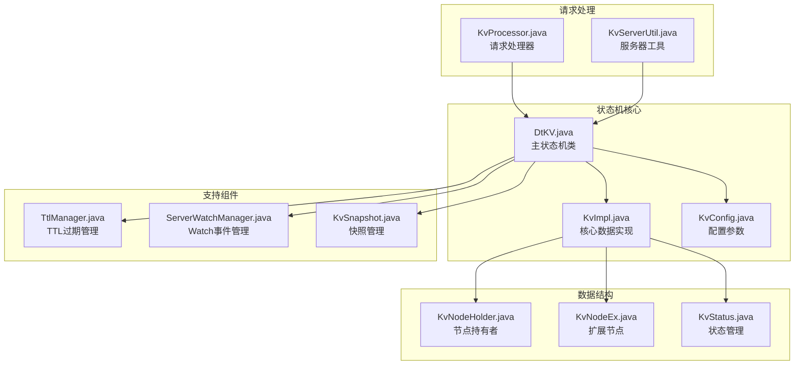
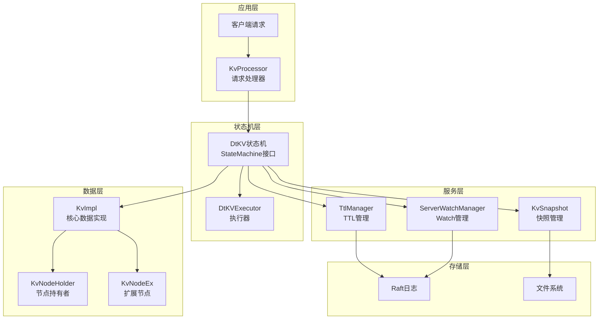
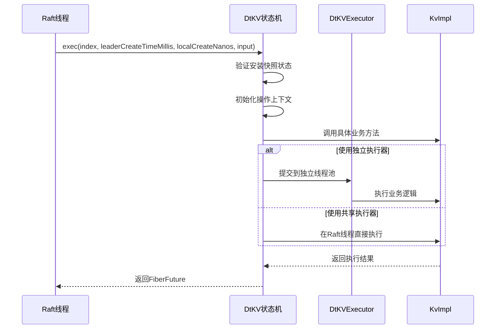
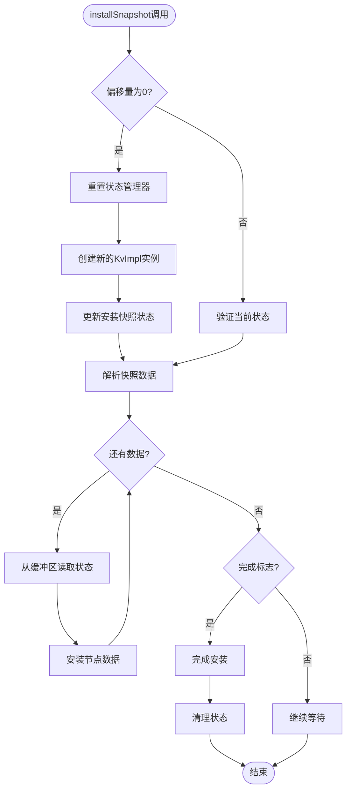
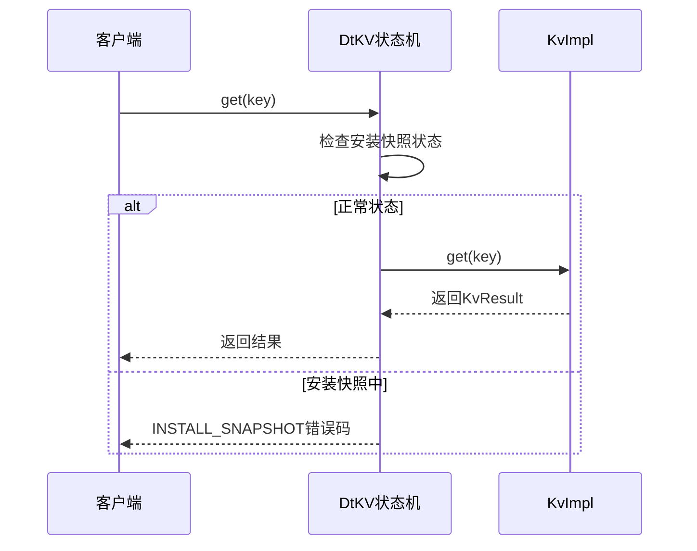
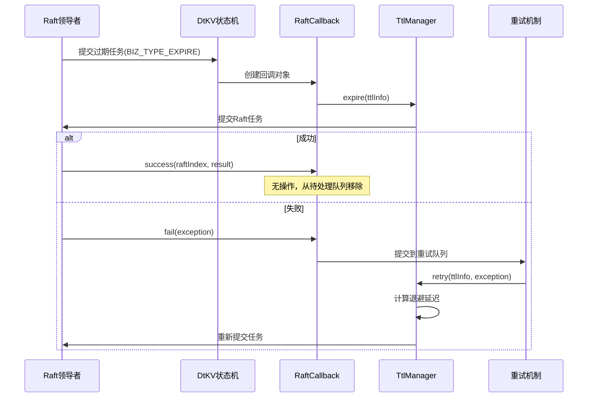
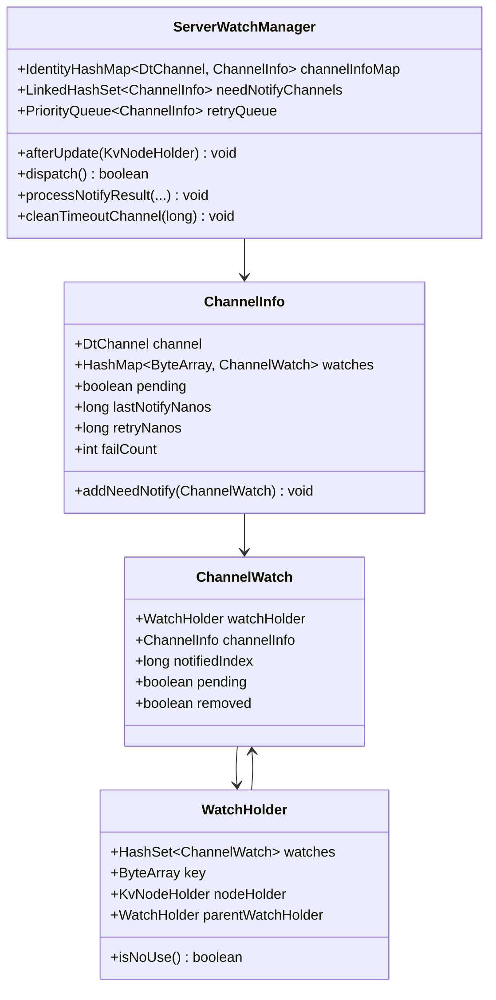
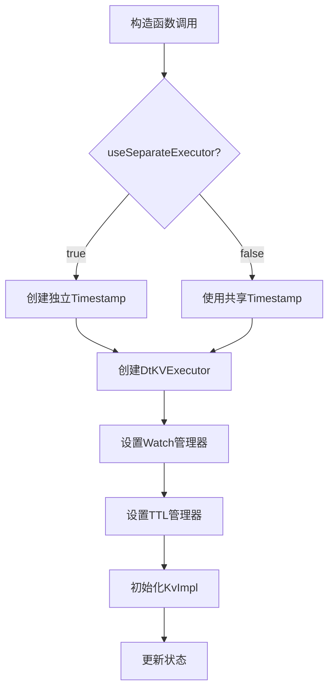
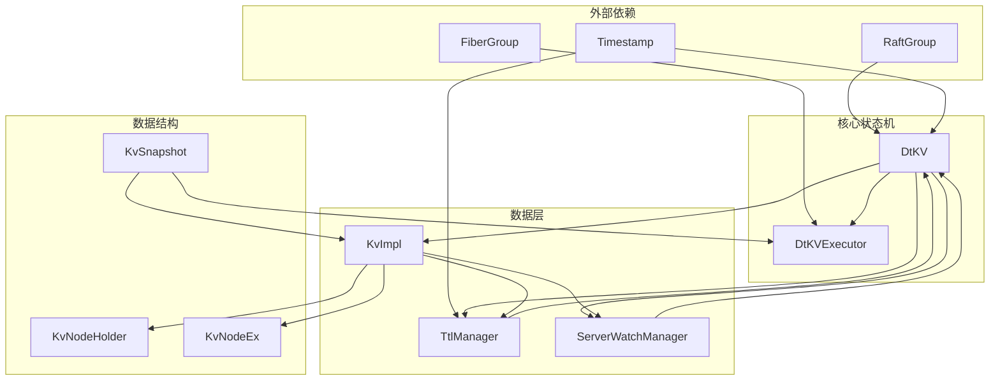

# DtKV状态机类API文档

<cite>
**本文档引用的文件**
- [DtKV.java](file://server/src/main/java/com/github/dtprj/dongting/dtkv/server/DtKV.java)
- [KvImpl.java](file://server/src/main/java/com/github/dtprj/dongting/dtkv/server/KvImpl.java)
- [KvConfig.java](file://server/src/main/java/com/github/dtprj/dongting/dtkv/server/KvConfig.java)
- [TtlManager.java](file://server/src/main/java/com/github/dtprj/dongting/dtkv/server/TtlManager.java)
- [KvSnapshot.java](file://server/src/main/java/com/github/dtprj/dongting/dtkv/server/KvSnapshot.java)
- [KvNodeHolder.java](file://server/src/main/java/com/github/dtprj/dongting/dtkv/server/KvNodeHolder.java)
- [KvNodeEx.java](file://server/src/main/java/com/github/dtprj/dongting/dtkv/server/KvNodeEx.java)
- [KvProcessor.java](file://server/src/main/java/com/github/dtprj/dongting/dtkv/server/KvProcessor.java)
- [ServerWatchManager.java](file://server/src/main/java/com/github/dtprj/dongting/dtkv/server/ServerWatchManager.java)
- [KvStatus.java](file://server/src/main/java/com/github/dtprj/dongting/dtkv/server/KvStatus.java)
- [KvServerUtil.java](file://server/src/main/java/com/github/dtprj/dongting/dtkv/server/KvServerUtil.java)
</cite>

## 目录
1. [简介](#简介)
2. [项目结构](#项目结构)
3. [核心组件](#核心组件)
4. [架构概览](#架构概览)
5. [详细组件分析](#详细组件分析)
6. [依赖关系分析](#依赖关系分析)
7. [性能考虑](#性能考虑)
8. [故障排除指南](#故障排除指南)
9. [结论](#结论)

## 简介

DtKV是一个基于Raft共识算法的分布式键值存储系统，实现了StateMachine接口作为Raft状态机。该系统提供了完整的分布式数据管理功能，包括线性一致的读写操作、TTL过期处理、Watch事件通知机制以及快照恢复功能。

本文档详细阐述了DtKV状态机类的核心实现，包括其与Raft协议的集成方式、业务类型常量映射、线性一致性读操作的保证机制、TTL过期处理流程以及Watch机制的实现原理。

## 项目结构

DtKV状态机相关的核心文件组织如下：



**图表来源**
- [DtKV.java](file://server/src/main/java/com/github/dtprj/dongting/dtkv/server/DtKV.java#L1-L402)
- [KvImpl.java](file://server/src/main/java/com/github/dtprj/dongting/dtkv/server/KvImpl.java#L1-L957)
- [KvConfig.java](file://server/src/main/java/com/github/dtprj/dongting/dtkv/server/KvConfig.java#L1-L29)

## 核心组件

### 主要业务类型常量

DtKV定义了一系列业务类型常量，用于标识不同的操作类型：

```java
// 写操作类型
public static final int BIZ_TYPE_PUT = 0;              // 普通键值对设置
public static final int BIZ_TYPE_REMOVE = 2;           // 删除操作
public static final int BIZ_TYPE_MKDIR = 3;            // 创建目录
public static final int BIZ_TYPE_BATCH_PUT = 6;        // 批量设置
public static final int BIZ_TYPE_BATCH_REMOVE = 7;     // 批量删除
public static final int BIZ_TYPE_CAS = 8;              // 比较并交换
public static final int BIZ_TYPE_PUT_TEMP_NODE = 11;   // 临时节点设置
public static final int BIZ_MK_TEMP_DIR = 12;          // 临时目录创建
public static final int BIZ_TYPE_UPDATE_TTL = 14;      // 更新TTL
public static final int BIZ_TYPE_LOCK = 15;            // 加锁
public static final int BIZ_TYPE_TRY_LOCK = 16;        // 尝试加锁
public static final int BIZ_TYPE_UNLOCK = 17;          // 解锁

// 特殊操作类型
public static final int BIZ_TYPE_EXPIRE = 13;          // 过期处理（由Raft领导者发起）
```

这些业务类型与Raft日志类型的映射关系确保了不同操作在状态机中的正确执行顺序和一致性保证。

**章节来源**
- [DtKV.java](file://server/src/main/java/com/github/dtprj/dongting/dtkv/server/DtKV.java#L57-L85)

## 架构概览

DtKV状态机采用分层架构设计，与Raft协议紧密集成：



**图表来源**
- [DtKV.java](file://server/src/main/java/com/github/dtprj/dongting/dtkv/server/DtKV.java#L100-L122)
- [KvProcessor.java](file://server/src/main/java/com/github/dtprj/dongting/dtkv/server/KvProcessor.java#L44-L81)

## 详细组件分析

### StateMachine接口实现

DtKV实现了StateMachine接口的三个核心方法：

#### exec方法 - 业务逻辑执行



**图表来源**
- [DtKV.java](file://server/src/main/java/com/github/dtprj/dongting/dtkv/server/DtKV.java#L124-L172)
- [DtKV.java](file://server/src/main/java/com/github/dtprj/dongting/dtkv/server/DtKV.java#L174-L200)

exec方法的调用时机：
- **Raft日志应用时**：当Raft领导者将日志条目复制到大多数节点后，在提交阶段调用
- **线性一致性读取**：虽然主要为写操作，但也会处理某些只读操作
- **领导者变更**：在领导者选举过程中可能触发

#### installSnapshot方法 - 快照安装



**图表来源**
- [DtKV.java](file://server/src/main/java/com/github/dtprj/dongting/dtkv/server/DtKV.java#L280-L310)

#### takeSnapshot方法 - 快照创建

快照创建过程涉及以下关键步骤：

1. **状态检查**：确保不在安装快照过程中
2. **版本控制**：使用epoch计数器防止并发问题
3. **异步处理**：在专用线程池中执行快照创建
4. **数据序列化**：将内存中的键值对序列化为二进制格式
5. **流式传输**：支持大快照的分块传输

**章节来源**
- [DtKV.java](file://server/src/main/java/com/github/dtprj/dongting/dtkv/server/DtKV.java#L280-L310)
- [DtKV.java](file://server/src/main/java/com/github/dtprj/dongting/dtkv/server/DtKV.java#L312-L325)

### 线性一致性读操作

DtKV提供了三种线性一致性的读操作：

#### get方法 - 单键读取



**图表来源**
- [DtKV.java](file://server/src/main/java/com/github/dtprj/dongting/dtkv/server/DtKV.java#L202-L212)

#### batchGet方法 - 批量读取

批量读取操作允许一次性获取多个键的值，提高网络效率：

```java
public Pair<Integer, List<KvResult>> batchGet(List<byte[]> keys) {
    KvStatus kvStatus = this.kvStatus;
    if (kvStatus.installSnapshot) {
        return new Pair<>(KvCodes.INSTALL_SNAPSHOT, null);
    }
    return kvStatus.kvImpl.batchGet(keys);
}
```

#### list方法 - 列出子节点

列出指定路径下的所有子节点：

```java
public Pair<Integer, List<KvResult>> list(ByteArray key) {
    KvStatus kvStatus = this.kvStatus;
    if (kvStatus.installSnapshot) {
        return new Pair<>(KvCodes.INSTALL_SNAPSHOT, null);
    }
    return kvStatus.kvImpl.list(key);
}
```

这些读操作都利用了Raft的租约读机制，可以在任何线程中安全执行，且不违反线性一致性保证。

**章节来源**
- [DtKV.java](file://server/src/main/java/com/github/dtprj/dongting/dtkv/server/DtKV.java#L214-L240)

### TTL过期处理机制

TTL（生存时间）过期处理是DtKV的重要特性，通过RaftCallback实现可靠的任务重试：



**图表来源**
- [DtKV.java](file://server/src/main/java/com/github/dtprj/dongting/dtkv/server/DtKV.java#L380-L401)

TTL过期处理的关键特点：

1. **可靠性**：通过RaftCallback确保任务最终被执行
2. **重试机制**：失败时自动重试，支持指数退避
3. **领导者感知**：只有领导者才能发起过期操作
4. **幂等性**：支持重复执行而不产生副作用

**章节来源**
- [DtKV.java](file://server/src/main/java/com/github/dtprj/dongting/dtkv/server/DtKV.java#L380-L401)
- [TtlManager.java](file://server/src/main/java/com/github/dtprj/dongting/dtkv/server/TtlManager.java#L1-L242)

### Watch事件通知机制

Watch机制允许客户端监听特定键的变化：



**图表来源**
- [ServerWatchManager.java](file://server/src/main/java/com/github/dtprj/dongting/dtkv/server/ServerWatchManager.java#L45-L731)

Watch机制的工作流程：

1. **注册监听**：客户端发送同步请求注册Watch
2. **事件捕获**：当节点更新时触发事件
3. **批处理通知**：将多个事件合并成单个通知包
4. **可靠传输**：支持失败重试和超时处理
5. **状态同步**：维护客户端已知的最新状态

**章节来源**
- [ServerWatchManager.java](file://server/src/main/java/com/github/dtprj/dongting/dtkv/server/ServerWatchManager.java#L45-L731)

### 构造函数与配置

DtKV的构造函数接受两个主要参数：

#### KvConfig参数详解

```java
public class KvConfig {
    public boolean useSeparateExecutor = false;        // 是否使用独立执行器
    public int initMapCapacity = 16 * 1024;           // 初始哈希表容量
    public float loadFactor = 0.75f;                  // 负载因子
    public int watchDispatchIntervalMillis = 500;     // Watch分发间隔
    public int watchMaxReqBytes = 80 * 1024;         // 最大通知请求字节数
    public int watchMaxBatchSize = 100;               // 最大批处理大小
}
```

#### 执行器选择策略



**图表来源**
- [DtKV.java](file://server/src/main/java/com/github/dtprj/dongting/dtkv/server/DtKV.java#L100-L122)

**章节来源**
- [KvConfig.java](file://server/src/main/java/com/github/dtprj/dongting/dtkv/server/KvConfig.java#L1-L29)
- [DtKV.java](file://server/src/main/java/com/github/dtprj/dongting/dtkv/server/DtKV.java#L100-L122)

## 依赖关系分析

DtKV状态机的依赖关系图展示了各组件间的交互：



**图表来源**
- [DtKV.java](file://server/src/main/java/com/github/dtprj/dongting/dtkv/server/DtKV.java#L100-L122)
- [KvImpl.java](file://server/src/main/java/com/github/dtprj/dongting/dtkv/server/KvImpl.java#L1-L200)

**章节来源**
- [DtKV.java](file://server/src/main/java/com/github/dtprj/dongting/dtkv/server/DtKV.java#L100-L122)

## 性能考虑

### 线程模型

DtKV采用混合线程模型：

1. **Raft线程**：执行状态机方法，保持低延迟
2. **独立执行器**：处理耗时的业务逻辑，避免阻塞Raft线程
3. **Fiber组**：支持协程式的异步编程模式

### 内存管理

- **哈希表容量**：可配置的初始容量和负载因子
- **快照缓存**：支持多个快照同时打开
- **GC机制**：定期清理过期的TTL信息

### 网络优化

- **批处理**：Watch通知支持批量传输
- **压缩**：二进制序列化减少网络开销
- **重试**：指数退避算法优化网络异常处理

## 故障排除指南

### 常见问题与解决方案

#### 1. 安装快照期间的读取错误

**症状**：get/batchGet/list操作返回INSTALL_SNAPSHOT错误码

**原因**：系统正在安装快照，不允许读取操作

**解决方案**：等待快照安装完成或重试操作

#### 2. TTL过期失败

**症状**：TTL节点未按预期过期

**原因**：Raft任务提交失败或网络异常

**解决方案**：检查网络连接，确认领导者状态

#### 3. Watch通知丢失

**症状**：客户端未收到预期的Watch事件

**原因**：网络分区或客户端超时

**解决方案**：重新同步Watch状态，检查网络连通性

**章节来源**
- [DtKV.java](file://server/src/main/java/com/github/dtprj/dongting/dtkv/server/DtKV.java#L202-L240)
- [TtlManager.java](file://server/src/main/java/com/github/dtprj/dongting/dtkv/server/TtlManager.java#L100-L150)

## 结论

DtKV状态机是一个功能完整、设计精良的分布式键值存储系统。它成功地将Raft共识算法与实际业务需求相结合，提供了：

1. **强一致性保证**：通过Raft协议确保数据的一致性和可用性
2. **高性能读写**：支持线性一致的读操作和高效的写入处理
3. **灵活的扩展性**：通过配置参数适应不同的部署场景
4. **可靠的容错机制**：完善的错误处理和重试策略
5. **丰富的功能特性**：TTL过期、Watch事件通知等高级功能

该系统的设计充分体现了分布式系统的核心理念，为构建高可用、高性能的分布式存储服务提供了优秀的参考实现。