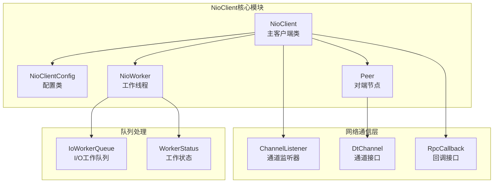
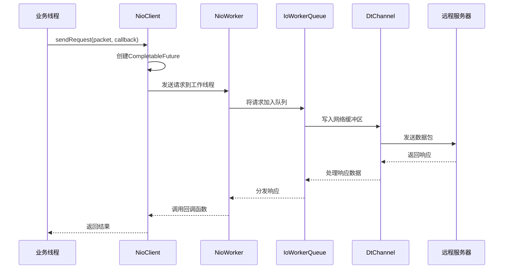
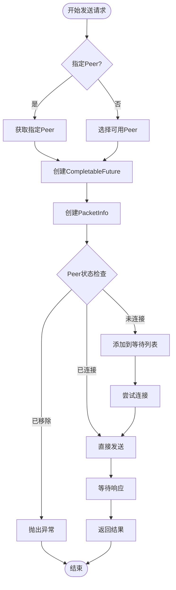
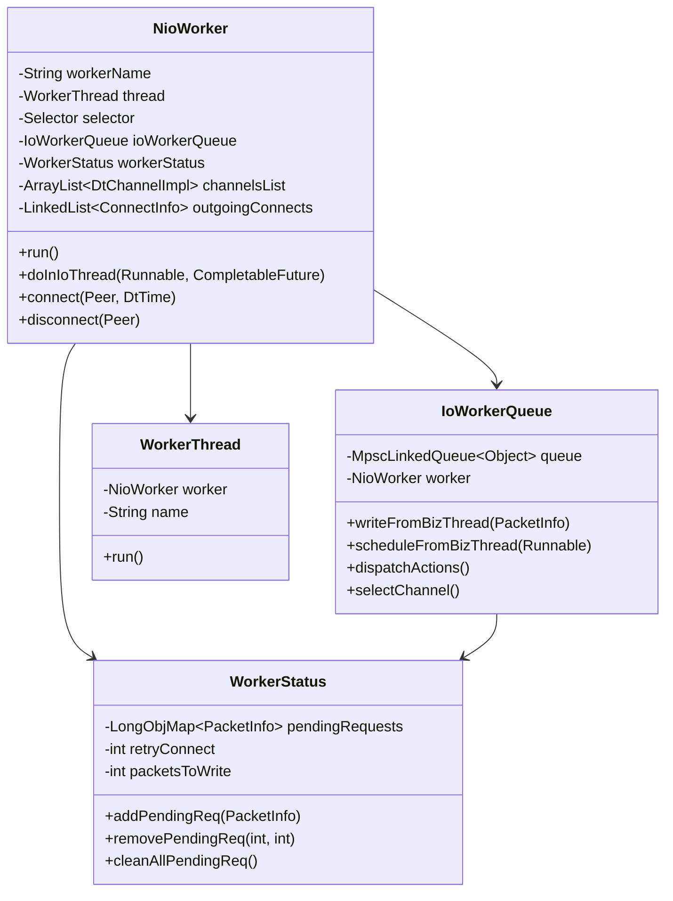
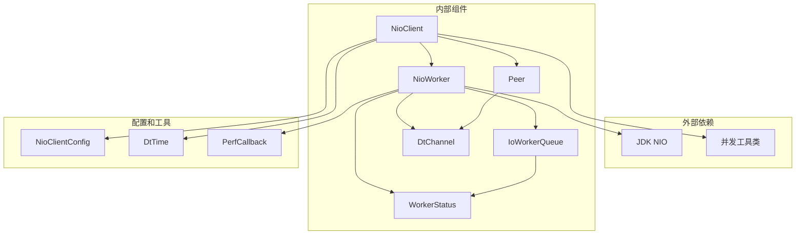

# NioClient API 参考文档

<cite>
**本文档中引用的文件**
- [NioClient.java](file://client/src/main/java/com/github/dtprj/dongting/net/NioClient.java)
- [NioClientConfig.java](file://client/src/main/java/com/github/dtprj/dongting/net/NioClientConfig.java)
- [NioWorker.java](file://client/src/main/java/com/github/dtprj/dongting/net/NioWorker.java)
- [Peer.java](file://client/src/main/java/com/github/dtprj/dongting/net/Peer.java)
- [ChannelListener.java](file://client/src/main/java/com/github/dtprj/dongting/net/ChannelListener.java)
- [RpcCallback.java](file://client/src/main/java/com/github/dtprj/dongting/net/RpcCallback.java)
- [IoWorkerQueue.java](file://client/src/main/java/com/github/dtprj/dongting/net/IoWorkerQueue.java)
- [WorkerStatus.java](file://client/src/main/java/com/github/dtprj/dongting/net/WorkerStatus.java)
- [DtChannel.java](file://client/src/main/java/com/github/dtprj/dongting/net/DtChannel.java)
</cite>

## 目录
1. [简介](#简介)
2. [项目结构](#项目结构)
3. [核心组件](#核心组件)
4. [架构概览](#架构概览)
5. [详细组件分析](#详细组件分析)
6. [依赖关系分析](#依赖关系分析)
7. [性能考虑](#性能考虑)
8. [故障排除指南](#故障排除指南)
9. [结论](#结论)

## 简介

NioClient是Dongting框架中的高性能NIO网络客户端，专为异步RPC通信设计。它基于Java NIO技术构建，提供了强大的异步消息发送能力、动态连接管理和完善的错误处理机制。该客户端支持同步和异步两种消息发送模式，具备自动重连、超时控制和请求队列管理等功能。

NioClient的核心特性包括：
- 基于NIO的异步通信模型
- 支持同步和异步消息发送
- 动态Peer连接管理
- 完善的超时控制机制
- 自动重连和故障恢复
- 高性能的请求队列处理

## 项目结构

NioClient作为Dongting框架的一部分，位于`client/src/main/java/com/github/dtprj/dongting/net/`目录下。其主要文件组织如下：



**图表来源**
- [NioClient.java](file://client/src/main/java/com/github/dtprj/dongting/net/NioClient.java#L37-L73)
- [NioWorker.java](file://client/src/main/java/com/github/dtprj/dongting/net/NioWorker.java#L50-L115)

**章节来源**
- [NioClient.java](file://client/src/main/java/com/github/dtprj/dongting/net/NioClient.java#L1-L50)
- [NioClientConfig.java](file://client/src/main/java/com/github/dtprj/dongting/net/NioClientConfig.java#L1-L38)

## 核心组件

### NioClient 主类

NioClient是整个网络客户端的核心类，继承自NioNet并实现了ChannelListener接口。它负责协调各个组件的工作，提供对外的API接口。

```java
public class NioClient extends NioNet implements ChannelListener {
    private final NioClientConfig config;
    final NioWorker worker;
    private final CopyOnWriteArrayList<Peer> peers;
    private final Condition connectCond = lock.newCondition();
    private int connectCount;
}
```

### NioWorker 工作线程

NioWorker是NioClient的核心执行单元，每个工作线程代表一个独立的I/O处理线程。它负责处理所有的网络I/O操作、请求队列管理和连接状态维护。

```java
class NioWorker extends AbstractLifeCircle implements Runnable {
    private final String workerName;
    final WorkerThread thread;
    private final NioStatus nioStatus;
    private final NioConfig config;
    final NioNet owner;
    private Selector selector;
    final WorkerStatus workerStatus;
}
```

### Peer 对端节点

Peer表示一个远程服务器节点，包含连接状态、重连策略和待发送请求队列等信息。

```java
public class Peer {
    public volatile PeerStatus status;
    public final HostPort endPoint;
    public int connectRetryCount;
    final NioClient owner;
    DtChannelImpl dtChannel;
    NioWorker.ConnectInfo connectInfo;
    boolean autoReconnect;
    long lastRetryNanos;
    private LinkedList<PacketInfo> waitConnectList;
}
```

**章节来源**
- [NioClient.java](file://client/src/main/java/com/github/dtprj/dongting/net/NioClient.java#L37-L73)
- [NioWorker.java](file://client/src/main/java/com/github/dtprj/dongting/net/NioWorker.java#L50-L115)
- [Peer.java](file://client/src/main/java/com/github/dtprj/dongting/net/Peer.java#L25-L43)

## 架构概览

NioClient采用多线程架构，通过工作线程模型实现高性能的异步网络通信。



**图表来源**
- [NioClient.java](file://client/src/main/java/com/github/dtprj/dongting/net/NioClient.java#L114-L173)
- [IoWorkerQueue.java](file://client/src/main/java/com/github/dtprj/dongting/net/IoWorkerQueue.java#L40-L80)

### 消息发送流程

NioClient支持多种消息发送模式，每种模式都有其特定的使用场景：

1. **同步发送（sendRequest）**：阻塞等待直到收到响应
2. **异步发送（sendRequest with callback）**：非阻塞方式，通过回调处理响应
3. **单向发送（sendOneWay）**：无需等待响应的发送方式



**图表来源**
- [NioClient.java](file://client/src/main/java/com/github/dtprj/dongting/net/NioClient.java#L114-L173)
- [IoWorkerQueue.java](file://client/src/main/java/com/github/dtprj/dongting/net/IoWorkerQueue.java#L60-L100)

## 详细组件分析

### 消息发送方法

#### 同步请求发送（sendRequest）

同步发送是最常用的请求方式，会阻塞当前线程直到收到响应或超时。

```java
public <T> ReadPacket<T> sendRequest(WritePacket request, DecoderCallbackCreator<T> decoder, DtTime timeout) {
    Objects.requireNonNull(decoder);
    CompletableFuture<ReadPacket<T>> f = new CompletableFuture<>();
    sendRequest(null, request, decoder, timeout, RpcCallback.fromFuture(f));
    return waitFuture(f, timeout);
}
```

#### 异步请求发送

异步发送通过回调函数处理响应，不会阻塞当前线程。

```java
public <T> void sendRequest(WritePacket request, DecoderCallbackCreator<T> decoder,
                            DtTime timeout, RpcCallback<T> callback) {
    Objects.requireNonNull(decoder);
    send(worker, null, request, decoder, timeout, callback);
}
```

#### 单向发送（sendOneWay）

单向发送用于不需要响应的场景，如心跳检测、日志上报等。

```java
public CompletableFuture<Void> sendOneWay(WritePacket request, DtTime timeout) {
    return sendOneWay(null, request, timeout);
}

public CompletableFuture<Void> sendOneWay(Peer peer, WritePacket request, DtTime timeout) {
    CompletableFuture<Void> f = new CompletableFuture<>();
    send(worker, peer, request, null, timeout, RpcCallback.fromUnwrapFuture(f));
    return f;
}
```

**章节来源**
- [NioClient.java](file://client/src/main/java/com/github/dtprj/dongting/net/NioClient.java#L114-L173)
- [RpcCallback.java](file://client/src/main/java/com/github/dtprj/dongting/net/RpcCallback.java#L20-L46)

### Peer连接管理

#### 添加Peer节点

动态添加新的Peer节点，支持运行时扩展集群规模。

```java
public CompletableFuture<Peer> addPeer(HostPort hostPort) {
    Objects.requireNonNull(hostPort);
    Peer peer = new Peer(hostPort, this);
    CompletableFuture<Peer> f = new CompletableFuture<>();
    worker.doInIoThread(() -> {
        for (Peer p : peers) {
            if (p.endPoint.equals(hostPort)) {
                f.complete(p);
                return;
            }
        }
        peers.add(peer);
        f.complete(peer);
    }, f);
    return f;
}
```

#### 移除Peer节点

安全地移除Peer节点，确保所有待处理请求得到妥善处理。

```java
public CompletableFuture<Void> removePeer(Peer peer) {
    checkOwner(peer);
    CompletableFuture<Void> f = new CompletableFuture<>();
    worker.doInIoThread(() -> {
        if (!peers.contains(peer)) {
            f.complete(null);
            return;
        }
        removePeer(peer, f);
    }, f);
    return f;
}
```

#### 连接和断开操作

```java
public CompletableFuture<Void> connect(Peer peer) {
    checkOwner(peer);
    return worker.connect(peer, new DtTime(config.connectTimeoutMillis, TimeUnit.MILLISECONDS));
}

public CompletableFuture<Void> disconnect(Peer peer) {
    checkOwner(peer);
    return worker.disconnect(peer);
}
```

**章节来源**
- [NioClient.java](file://client/src/main/java/com/github/dtprj/dongting/net/NioClient.java#L250-L310)

### ChannelListener事件回调

NioClient实现了ChannelListener接口，提供连接状态变化的通知机制。

```java
@Override
public void onConnected(DtChannel dtc) {
    lock.lock();
    try {
        connectCount++;
        connectCond.signalAll();
    } finally {
        lock.unlock();
    }
}

@Override
public void onDisconnected(DtChannel dtc) {
    lock.lock();
    try {
        connectCount--;
        connectCond.signalAll();
    } finally {
        lock.unlock();
    }
}
```

#### 事件触发条件

- **onConnected**：当与远程服务器成功建立连接时触发
- **onDisconnected**：当连接断开或发生错误时触发

#### 线程上下文

- 所有事件回调都在NioWorker工作线程中执行
- 使用锁机制保证线程安全
- 支持条件变量进行同步等待

**章节来源**
- [NioClient.java](file://client/src/main/java/com/github/dtprj/dongting/net/NioClient.java#L80-L95)
- [ChannelListener.java](file://client/src/main/java/com/github/dtprj/dongting/net/ChannelListener.java#L20-L26)

### Worker线程模型

#### 工作线程架构



**图表来源**
- [NioWorker.java](file://client/src/main/java/com/github/dtprj/dongting/net/NioWorker.java#L50-L115)
- [IoWorkerQueue.java](file://client/src/main/java/com/github/dtprj/dongting/net/IoWorkerQueue.java#L30-L50)
- [WorkerStatus.java](file://client/src/main/java/com/github/dtprj/dongting/net/WorkerStatus.java#L30-L60)

#### 请求队列处理

IoWorkerQueue负责在业务线程和工作线程之间传递请求数据：

```java
public void writeFromBizThread(PacketInfo data) {
    data.perfTimeOrAddOrder = perfCallback.takeTime(PerfConsts.RPC_D_WORKER_QUEUE);
    if (!queue.offer(data)) {
        data.callFail(true, new NetException("IoQueue closed"));
    }
}

public void dispatchActions() {
    Object data;
    while ((data = queue.relaxedPoll()) != null) {
        if (data instanceof PacketInfo) {
            processWriteData((PacketInfo) data);
        } else {
            ((Runnable) data).run();
        }
    }
}
```

**章节来源**
- [IoWorkerQueue.java](file://client/src/main/java/com/github/dtprj/dongting/net/IoWorkerQueue.java#L40-L80)
- [NioWorker.java](file://client/src/main/java/com/github/dtprj/dongting/net/NioWorker.java#L150-L200)

### 超时控制机制

#### 等待启动方法

```java
public void waitStart(DtTime timeout) {
    if (config.hostPorts != null && !config.hostPorts.isEmpty()) {
        waitConnect(1, timeout);
    }
}

public void waitConnect(int targetConnectCount, DtTime timeout) {
    lock.lock();
    try {
        while (connectCount < targetConnectCount) {
            if (!connectCond.await(timeout.rest(TimeUnit.MILLISECONDS), TimeUnit.MILLISECONDS)) {
                throw new NetTimeoutException("NioClient wait start timeout. timeout="
                        + timeout.getTimeout(TimeUnit.MILLISECONDS) + "ms, connectCount=" + connectCount);
            }
        }
    } catch (InterruptedException e) {
        DtUtil.restoreInterruptStatus();
        throw new NetException("Interrupted while NioClient waiting for connect", e);
    } finally {
        lock.unlock();
    }
}
```

#### 超时处理策略

- **连接超时**：连接建立失败时抛出NetTimeoutException
- **请求超时**：请求处理超时自动取消并清理资源
- **优雅关闭**：支持预停机阶段的超时控制

**章节来源**
- [NioClient.java](file://client/src/main/java/com/github/dtprj/dongting/net/NioClient.java#L97-L113)

## 依赖关系分析

NioClient的组件间依赖关系复杂但设计合理，确保了系统的稳定性和可扩展性。



**图表来源**
- [NioClient.java](file://client/src/main/java/com/github/dtprj/dongting/net/NioClient.java#L1-L30)
- [NioWorker.java](file://client/src/main/java/com/github/dtprj/dongting/net/NioWorker.java#L1-L40)

### 关键依赖说明

1. **JDK NIO**：提供底层的非阻塞I/O支持
2. **并发工具**：使用CompletableFuture、Condition等实现异步编程
3. **对象池**：ByteBufferPool用于内存管理
4. **队列实现**：MpscLinkedQueue提供高性能的无锁队列

**章节来源**
- [NioClient.java](file://client/src/main/java/com/github/dtprj/dongting/net/NioClient.java#L1-L30)
- [NioWorker.java](file://client/src/main/java/com/github/dtprj/dongting/net/NioWorker.java#L1-L40)

## 性能考虑

### 线程模型优化

NioClient采用了多线程架构来最大化性能：

- **工作线程隔离**：I/O操作和业务逻辑分离
- **无锁队列**：使用MPSC队列减少锁竞争
- **批量处理**：批量处理多个请求提高吞吐量

### 内存管理

- **对象池化**：使用ByteBufferPool复用缓冲区
- **引用计数**：通过RefBuffer实现高效的内存管理
- **及时释放**：自动清理超时和失败的请求

### 连接管理优化

- **连接复用**：支持多个请求共享同一连接
- **智能重连**：指数退避算法避免频繁重连
- **连接池**：维护多个可用连接提高并发能力

## 故障排除指南

### 常见问题及解决方案

#### 连接超时问题

**症状**：`NetTimeoutException: NioClient wait start timeout`

**原因**：
- 目标服务器不可达
- 网络配置错误
- 防火墙阻止连接

**解决方案**：
```java
// 增加连接超时时间
config.connectTimeoutMillis = 10000;

// 检查网络连通性
// 验证防火墙设置
// 确认目标端口正确
```

#### 请求超时问题

**症状**：请求处理时间过长或超时

**原因**：
- 网络延迟过高
- 服务器负载过大
- 请求队列积压

**解决方案**：
```java
// 调整请求超时时间
DtTime timeout = new DtTime(5000, TimeUnit.MILLISECONDS);

// 监控系统性能指标
// 优化服务器资源配置
// 实现请求限流
```

#### 内存泄漏问题

**症状**：内存使用持续增长

**原因**：
- 缓冲区未正确释放
- 回调函数持有引用
- 连接未正确关闭

**解决方案**：
```java
// 确保正确释放RefBuffer
RefBuffer buffer = response.getBody();
try {
    // 使用buffer
} finally {
    buffer.release();
}

// 正确关闭客户端
client.stop(new DtTime(5000, TimeUnit.MILLISECONDS), false);
```

**章节来源**
- [NioClient.java](file://client/src/main/java/com/github/dtprj/dongting/net/NioClient.java#L114-L143)

## 结论

NioClient是一个功能强大、设计精良的高性能网络客户端，具有以下优势：

### 核心优势

1. **高性能异步通信**：基于NIO的非阻塞I/O模型，支持高并发请求处理
2. **灵活的消息发送模式**：支持同步、异步和单向三种发送方式
3. **完善的连接管理**：动态Peer管理、自动重连和故障恢复
4. **可靠的超时控制**：多层次的超时机制确保系统稳定性
5. **优秀的扩展性**：支持运行时添加和移除Peer节点

### 最佳实践建议

1. **合理配置参数**：根据实际需求调整连接数、超时时间和队列大小
2. **监控系统状态**：定期检查连接状态、请求成功率和性能指标
3. **异常处理**：实现完善的异常处理和重试机制
4. **资源管理**：及时释放资源，避免内存泄漏
5. **性能调优**：根据负载情况调整线程数和缓冲区大小

NioClient为构建高性能分布式系统提供了坚实的基础，其设计理念和实现方式值得深入学习和借鉴。通过合理使用其提供的API和遵循最佳实践，可以构建出稳定、高效的网络应用程序。