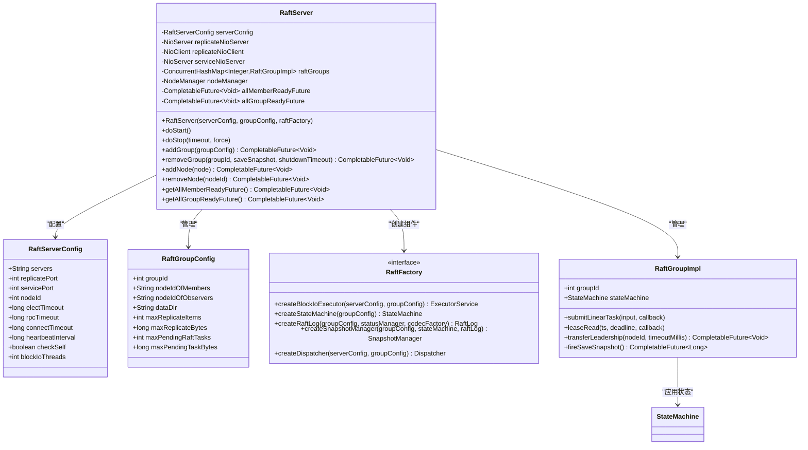
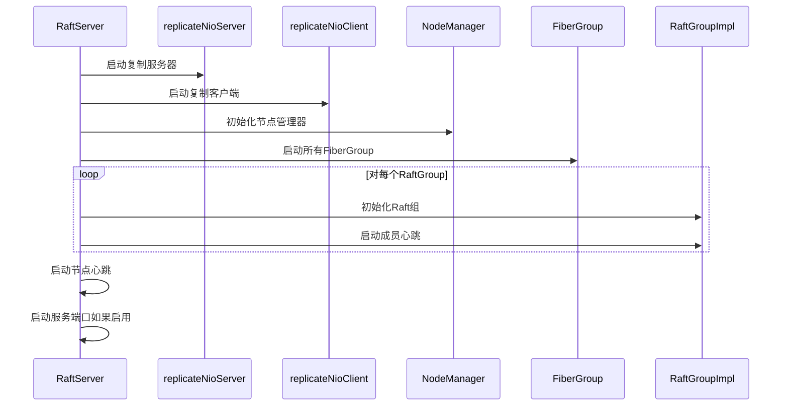
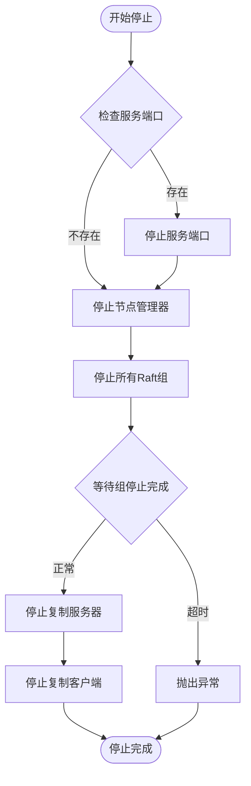
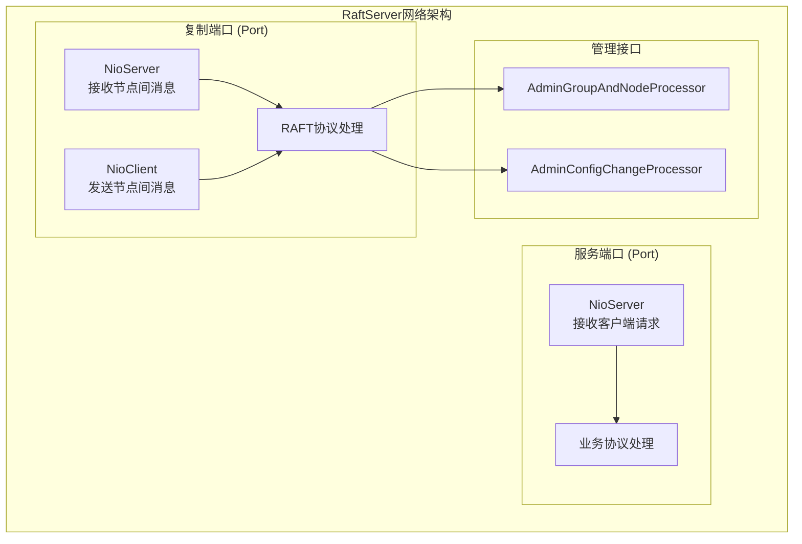
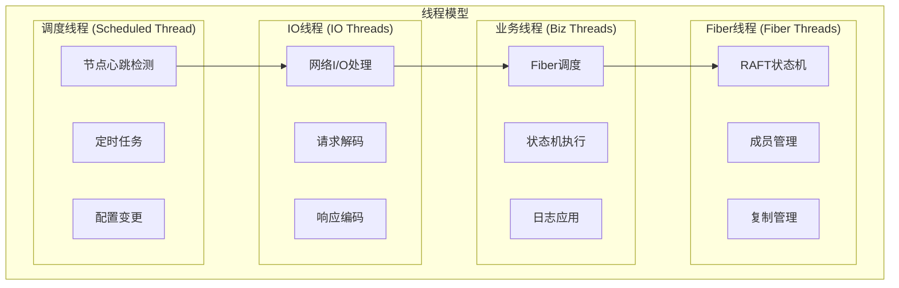

# RaftServer API 文档

<cite>
**本文档中引用的文件**
- [RaftServer.java](file://server/src/main/java/com/github/dtprj/dongting/raft/server/RaftServer.java)
- [RaftServerConfig.java](file://server/src/main/java/com/github/dtprj/dongting/raft/server/RaftServerConfig.java)
- [RaftGroupConfig.java](file://server/src/main/java/com/github/dtprj/dongting/raft/server/RaftGroupConfig.java)
- [RaftFactory.java](file://server/src/main/java/com/github/dtprj/dongting/raft/server/RaftFactory.java)
- [RaftGroupImpl.java](file://server/src/main/java/com/github/dtprj/dongting/raft/impl/RaftGroupImpl.java)
- [NodeManager.java](file://server/src/main/java/com/github/dtprj/dongting/raft/impl/NodeManager.java)
- [MemberManager.java](file://server/src/main/java/com/github/dtprj/dongting/raft/impl/MemberManager.java)
- [AdminGroupAndNodeProcessor.java](file://server/src/main/java/com/github/dtprj/dongting/raft/rpc/AdminGroupAndNodeProcessor.java)
</cite>

## 目录
1. [简介](#简介)
2. [核心架构概览](#核心架构概览)
3. [构造函数详解](#构造函数详解)
4. [生命周期方法](#生命周期方法)
5. [管理接口详解](#管理接口详解)
6. [状态同步机制](#状态同步机制)
7. [网络通道设计](#网络通道设计)
8. [使用示例](#使用示例)
9. [线程安全性](#线程安全性)
10. [故障排除指南](#故障排除指南)

## 简介

RaftServer是Dongting框架中RAFT集群的核心管理组件，负责协调多个RAFT组的运行、管理集群成员关系、处理节点间通信以及维护整个集群的状态同步。它提供了完整的集群生命周期管理、动态节点添加移除、组管理等功能。

## 核心架构概览



**图表来源**
- [RaftServer.java](file://server/src/main/java/com/github/dtprj/dongting/raft/server/RaftServer.java#L104-L123)
- [RaftServerConfig.java](file://server/src/main/java/com/github/dtprj/dongting/raft/server/RaftServerConfig.java#L20-L37)
- [RaftGroupConfig.java](file://server/src/main/java/com/github/dtprj/dongting/raft/server/RaftGroupConfig.java#L20-L73)

## 构造函数详解

### 主构造函数

```java
public RaftServer(RaftServerConfig serverConfig, List<RaftGroupConfig> groupConfig, RaftFactory raftFactory)
```

**参数说明：**

- `serverConfig`: 服务器配置对象，包含节点标识、端口配置等基础信息
- `groupConfig`: RAFT组配置列表，定义每个组的成员和观察者节点
- `raftFactory`: RAFT工厂，用于创建各种组件（状态机、日志、快照管理器等）

### 高级构造函数

```java
RaftServer(RaftServerConfig serverConfig, List<RaftGroupConfig> groupConfig, 
           RaftFactory raftFactory, Consumer<RaftGroupImpl> groupCustomizer)
```

**新增参数：**
- `groupCustomizer`: 组自定义回调，在创建每个RaftGroupImpl时调用，允许用户自定义组行为

**配置验证：**
- 检查服务器列表中是否包含当前节点ID
- 验证端口配置的有效性
- 确保节点ID和主机地址不重复

**章节来源**
- [RaftServer.java](file://server/src/main/java/com/github/dtprj/dongting/raft/server/RaftServer.java#L104-L123)
- [RaftServer.java](file://server/src/main/java/com/github/dtprj/dongting/raft/server/RaftServer.java#L125-L180)

## 生命周期方法

### doStart() 方法

`doStart()`方法负责启动RaftServer的所有组件，执行严格的初始化序列：



**图表来源**
- [RaftServer.java](file://server/src/main/java/com/github/dtprj/dongting/raft/server/RaftServer.java#L320-L380)

**执行流程：**

1. **网络组件启动**: 先启动复制服务器和客户端
2. **节点初始化**: 初始化NodeManager并建立连接
3. **FiberGroup启动**: 并行启动所有Raft组的FiberGroup
4. **Raft组初始化**: 异步初始化各个Raft组
5. **心跳启动**: 启动节点和成员心跳检测
6. **服务端口启动**: 如果启用了servicePort，则启动服务端口

### doStop() 方法

`doStop()`方法负责优雅关闭RaftServer：



**图表来源**
- [RaftServer.java](file://server/src/main/java/com/github/dtprj/dongting/raft/server/RaftServer.java#L420-L450)

**章节来源**
- [RaftServer.java](file://server/src/main/java/com/github/dtprj/dongting/raft/server/RaftServer.java#L320-L450)

## 管理接口详解

### addGroup() 方法

```java
public CompletableFuture<Void> addGroup(RaftGroupConfig groupConfig)
```

**特性：**
- **非幂等性**: 不能重复添加相同ID的组
- **阻塞操作**: 在返回CompletableFuture之前可能阻塞
- **异步完成**: 使用调度线程执行实际添加逻辑

**使用场景：**
- 动态添加新的Raft组到现有集群
- 支持在线扩容

### removeGroup() 方法

```java
public CompletableFuture<Void> removeGroup(int groupId, boolean saveSnapshot, DtTime shutdownTimeout)
```

**特性：**
- **幂等性**: 可以多次调用删除不存在的组
- **保存快照**: 可选择是否在关闭前保存快照
- **超时控制**: 支持设置关闭超时时间

**使用场景：**
- 动态移除不需要的Raft组
- 集群缩容操作

### addNode() 方法

```java
public CompletableFuture<Void> addNode(RaftNode node)
```

**特性：**
- **幂等性**: 如果节点已存在且连接正常，立即完成
- **阻塞操作**: 可能阻塞直到新节点连接成功
- **异步完成**: 返回CompletableFuture表示操作结果

**使用场景：**
- 添加新的集群节点
- 扩容集群规模

### removeNode() 方法

```java
public CompletableFuture<Void> removeNode(int nodeId)
```

**特性：**
- **幂等性**: 如果节点不存在，立即完成
- **引用计数检查**: 如果节点被其他组使用，会拒绝删除
- **异常完成**: 如果引用计数不为0，返回异常

**使用场景：**
- 移除不再需要的集群节点
- 集群节点故障恢复

**章节来源**
- [RaftServer.java](file://server/src/main/java/com/github/dtprj/dongting/raft/server/RaftServer.java#L452-L520)
- [AdminGroupAndNodeProcessor.java](file://server/src/main/java/com/github/dtprj/dongting/raft/rpc/AdminGroupAndNodeProcessor.java#L70-L121)

## 状态同步机制

### getAllMemberReadyFuture()

```java
public CompletableFuture<Void> getAllMemberReadyFuture()
```

**功能：**
- 表示所有Raft组都具备足够成员数量（达到选举法定人数）且节点心跳正常的复合状态
- 用于确保集群达到稳定状态后才接受客户端请求

**使用示例：**
```java
// 等待集群稳定后再接受客户端请求
raftServer.getAllMemberReadyFuture().thenRun(() -> {
    // 开始处理客户端请求
    clientHandler.start();
});
```

### getAllGroupReadyFuture()

```java
public CompletableFuture<Void> getAllGroupReadyFuture()
```

**功能：**
- 表示所有Raft组都已应用到groupReadyIndex，并且服务端口已启动
- 是集群完全可用的最终标志

**使用示例：**
```java
// 等待集群完全启动
raftServer.getAllGroupReadyFuture().thenRun(() -> {
    // 集群完全可用，可以开始业务处理
    businessLogic.start();
});
```

**章节来源**
- [RaftServer.java](file://server/src/main/java/com/github/dtprj/dongting/raft/server/RaftServer.java#L380-L420)

## 网络通道设计

### 复制端口 (Replicate Port)

**用途：**
- 节点间日志复制通信
- 管理命令传输
- 心跳检测

**特点：**
- 单向连接：客户端模式
- 高吞吐：专门优化的日志复制
- 低延迟：快速响应节点间通信

### 服务端口 (Service Port)

**用途：**
- 客户端请求处理
- 查询状态
- 管理接口访问

**特点：**
- 双向连接：支持客户端和服务端模式
- 业务逻辑处理：承载应用层协议
- 可选配置：可通过设置为0禁用



**图表来源**
- [RaftServer.java](file://server/src/main/java/com/github/dtprj/dongting/raft/server/RaftServer.java#L180-L220)

**章节来源**
- [RaftServer.java](file://server/src/main/java/com/github/dtprj/dongting/raft/server/RaftServer.java#L180-L220)

## 使用示例

### 基本配置示例

```java
// 创建服务器配置
RaftServerConfig serverConfig = new RaftServerConfig();
serverConfig.nodeId = 1;
serverConfig.servers = "127.0.0.1:5000,127.0.0.1:5001,127.0.0.1:5002";
serverConfig.replicatePort = 5000;
serverConfig.servicePort = 5001;
serverConfig.electTimeout = 15000;
serverConfig.rpcTimeout = 5000;

// 创建组配置
List<RaftGroupConfig> groupConfigs = new ArrayList<>();
RaftGroupConfig groupConfig = RaftGroupConfig.newInstance(100, "1,2,3", "");
groupConfigs.add(groupConfig);

// 创建Raft工厂
RaftFactory factory = new DefaultRaftFactory();

// 创建RaftServer
RaftServer server = new RaftServer(serverConfig, groupConfigs, factory);

// 启动服务器
server.start();

// 等待集群就绪
server.getAllGroupReadyFuture().join();

// 获取特定组
RaftGroup group = server.getRaftGroup(100);
```

### 动态扩缩容示例

```java
// 添加新节点
RaftNode newNode = new RaftNode(4, new HostPort("127.0.0.1", 5003));
server.addNode(newNode).join();

// 添加新组
RaftGroupConfig newGroup = RaftGroupConfig.newInstance(101, "1,2,3,4", "");
server.addGroup(newGroup).join();

// 移除节点（前提：引用计数为0）
server.removeNode(4).join();

// 移除组
DtTime timeout = new DtTime(30, TimeUnit.SECONDS);
server.removeGroup(101, true, timeout).join();
```

### 状态监控示例

```java
// 监控集群状态
CompletableFuture.allOf(
    server.getAllMemberReadyFuture(),
    server.getAllGroupReadyFuture()
).thenRun(() -> {
    System.out.println("集群已完全启动");
    
    // 获取所有组的状态
    server.raftGroups.forEach((groupId, group) -> {
        if (group.isLeader()) {
            System.out.println("节点是组 " + groupId + " 的领导者");
        }
    });
});
```

## 线程安全性

### 内部线程模型



### 关键线程安全保证

1. **并发访问保护**: 使用ConcurrentHashMap保护raftGroups
2. **原子操作**: 使用原子变量进行状态同步
3. **Fiber隔离**: 每个Raft组在独立的FiberGroup中执行
4. **内存屏障**: 使用版本工厂确保内存可见性

**章节来源**
- [RaftServer.java](file://server/src/main/java/com/github/dtprj/dongting/raft/server/RaftServer.java#L320-L450)

## 故障排除指南

### 常见问题及解决方案

#### 1. 启动失败

**症状**: `RaftException: start raft server failed`

**可能原因**:
- 端口冲突或权限不足
- 服务器配置错误
- 数据目录不可写

**解决方案**:
```java
// 检查端口配置
serverConfig.replicatePort = 5000;
serverConfig.servicePort = 5001;

// 验证数据目录
groupConfig.dataDir = "/path/to/data";

// 检查服务器列表格式
serverConfig.servers = "host1:port1,host2:port2,host3:port3";
```

#### 2. 集群无法达成共识

**症状**: `allMemberReadyFuture`长时间未完成

**可能原因**:
- 节点间网络不通
- 时间戳不同步
- 配置不一致

**解决方案**:
```java
// 检查节点连通性
// 验证时间同步
// 确保所有节点配置一致
```

#### 3. 组管理失败

**症状**: `addGroup`或`removeGroup`返回异常

**可能原因**:
- 组ID重复
- 节点引用计数不为0
- 工厂创建组件失败

**解决方案**:
```java
// 确保组ID唯一
// 检查节点引用计数
// 验证工厂实现
```

### 性能调优建议

1. **网络优化**: 调整心跳间隔和超时时间
2. **磁盘I/O**: 优化日志和快照存储配置
3. **内存使用**: 调整缓冲区大小和批处理参数
4. **并发控制**: 根据负载调整FiberGroup配置

**章节来源**
- [RaftServer.java](file://server/src/main/java/com/github/dtprj/dongting/raft/server/RaftServer.java#L320-L450)
- [RaftGroupConfig.java](file://server/src/main/java/com/github/dtprj/dongting/raft/server/RaftGroupConfig.java#L20-L73)