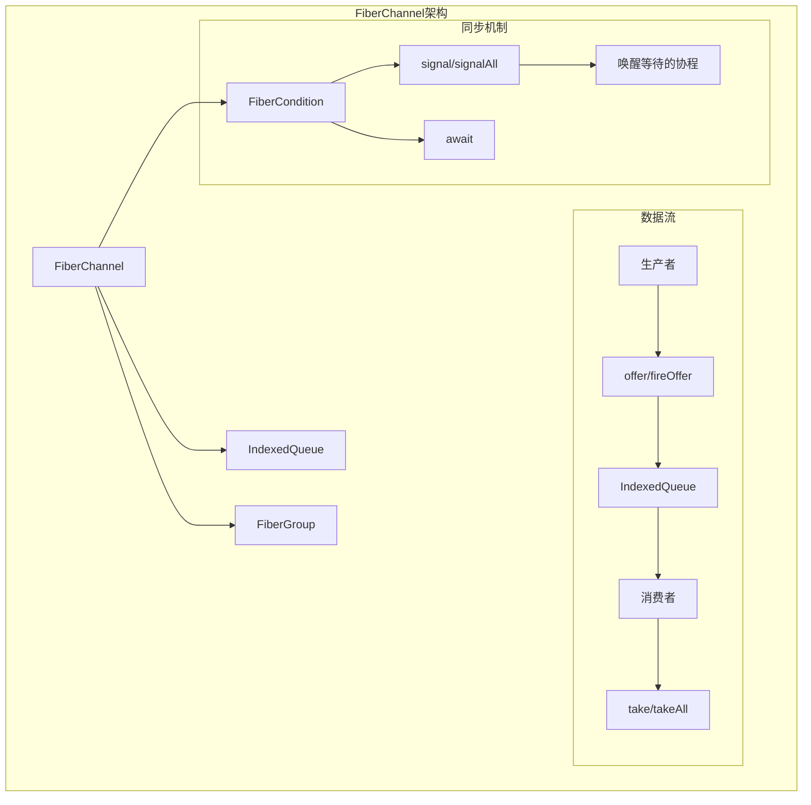
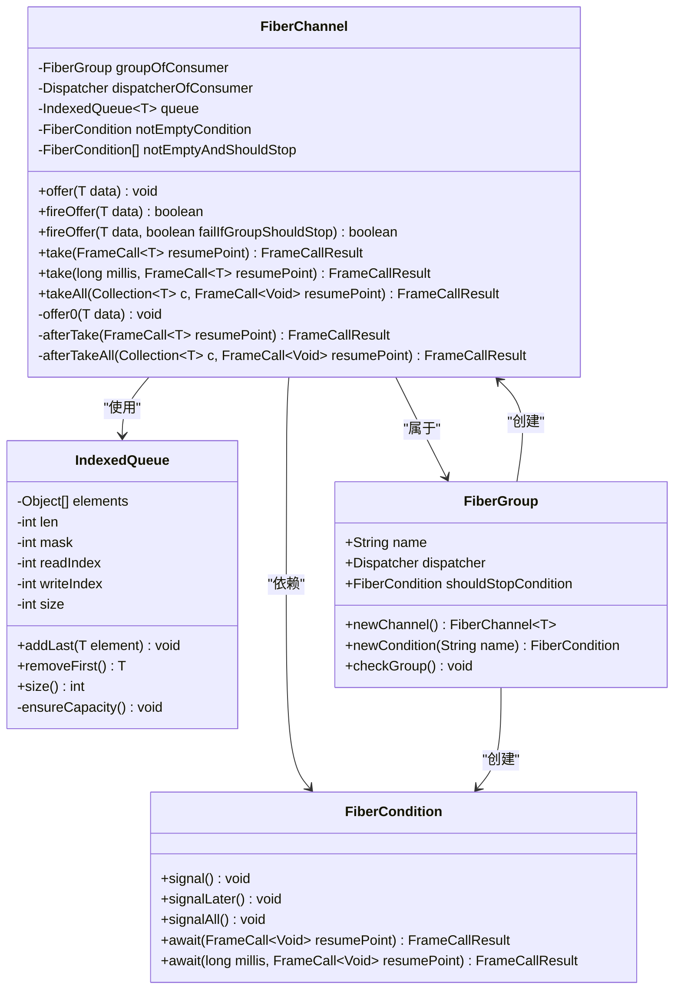
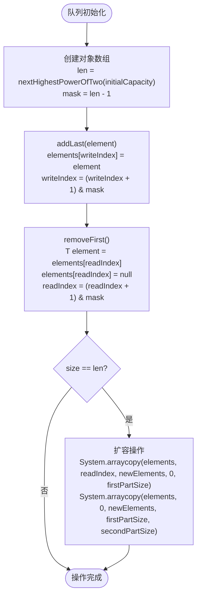
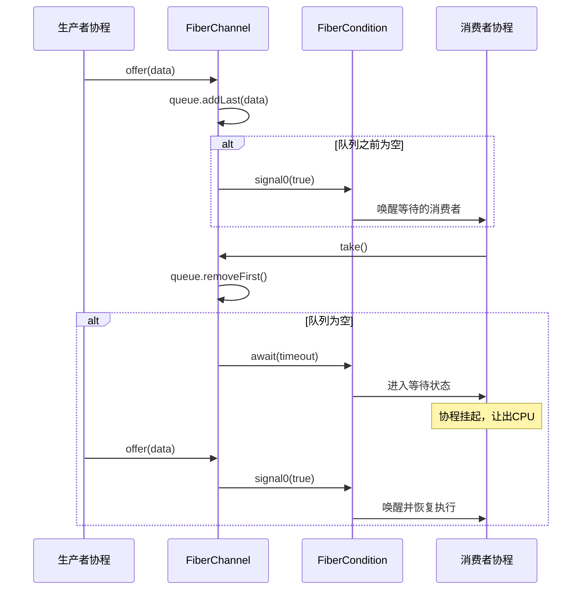
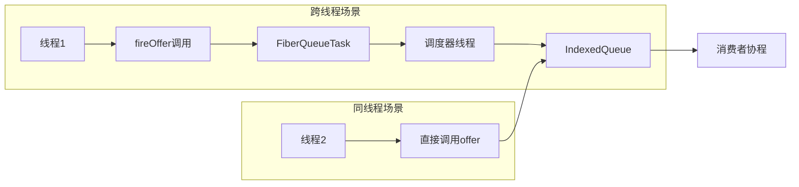
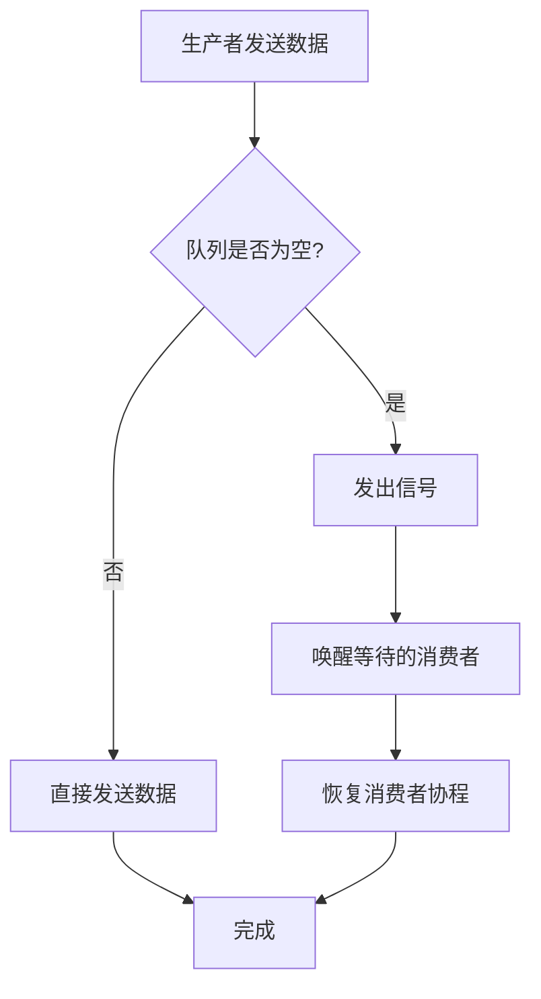

# FiberChannel协程间通信机制

<cite>
**本文档引用的文件**
- [FiberChannel.java](file://server/src/main/java/com/github/dtprj/dongting/fiber/FiberChannel.java)
- [IndexedQueue.java](file://client/src/main/java/com/github/dtprj/dongting/common/IndexedQueue.java)
- [FiberCondition.java](file://server/src/main/java/com/github/dtprj/dongting/fiber/FiberCondition.java)
- [FiberGroup.java](file://server/src/main/java/com/github/dtprj/dongting/fiber/FiberGroup.java)
- [ChannelTest.java](file://server/src/test/java/com/github/dtprj/dongting/fiber/ChannelTest.java)
- [FiberChannelTest.java](file://benchmark/src/main/java/com/github/dtprj/dongting/bench/fiber/FiberChannelTest.java)
- [ChannelCrossThreadTest.java](file://benchmark/src/main/java/com/github/dtprj/dongting/bench/fiber/ChannelCrossThreadTest.java)
</cite>

## 目录
1. [简介](#简介)
2. [核心架构](#核心架构)
3. [FiberChannel核心组件](#fiberchannel核心组件)
4. [无锁队列设计](#无锁队列设计)
5. [阻塞与非阻塞操作](#阻塞与非阻塞操作)
6. [条件变量机制](#条件变量机制)
7. [跨线程通信](#跨线程通信)
8. [生产者-消费者模式](#生产者-消费者模式)
9. [性能优化特性](#性能优化特性)
10. [故障排除指南](#故障排除指南)
11. [总结](#总结)

## 简介

FiberChannel是Dongting框架中实现的高性能协程间通信机制，基于无锁队列设计，专门用于在协程之间安全地传递数据。它采用单向通道设计，只对消费者进行阻塞控制，确保高效的并发通信。

FiberChannel的核心特点包括：
- **无锁设计**：基于IndexedQueue实现的无锁队列
- **单向阻塞**：只对消费者进行阻塞控制
- **多模式支持**：支持阻塞、非阻塞和带超时的操作
- **跨线程安全**：通过fireOffer支持跨线程数据传递
- **批量操作**：支持takeAll批量获取多个元素

## 核心架构



**图表来源**
- [FiberChannel.java](file://server/src/main/java/com/github/dtprj/dongting/fiber/FiberChannel.java#L34-L93)
- [IndexedQueue.java](file://client/src/main/java/com/github/dtprj/dongting/common/IndexedQueue.java#L20-L44)

## FiberChannel核心组件

### 类结构设计



**图表来源**
- [FiberChannel.java](file://server/src/main/java/com/github/dtprj/dongting/fiber/FiberChannel.java#L25-L35)
- [IndexedQueue.java](file://client/src/main/java/com/github/dtprj/dongting/common/IndexedQueue.java#L20-L44)
- [FiberCondition.java](file://server/src/main/java/com/github/dtprj/dongting/fiber/FiberCondition.java#L20-L45)
- [FiberGroup.java](file://server/src/main/java/com/github/dtprj/dongting/fiber/FiberGroup.java#L40-L60)

**章节来源**
- [FiberChannel.java](file://server/src/main/java/com/github/dtprj/dongting/fiber/FiberChannel.java#L25-L93)
- [IndexedQueue.java](file://client/src/main/java/com/github/dtprj/dongting/common/IndexedQueue.java#L20-L131)

## 无锁队列设计

### IndexedQueue实现原理

IndexedQueue是一个基于数组的循环队列，采用位运算优化索引计算，实现了真正的无锁并发访问。



**图表来源**
- [IndexedQueue.java](file://client/src/main/java/com/github/dtprj/dongting/common/IndexedQueue.java#L30-L131)

### 关键特性

1. **位运算优化**：使用`(index + 1) & mask`替代模运算，提高性能
2. **动态扩容**：当队列满时自动扩容到两倍大小
3. **无锁设计**：单线程环境下无需额外同步开销
4. **内存局部性**：连续的数组存储提高缓存命中率

**章节来源**
- [IndexedQueue.java](file://client/src/main/java/com/github/dtprj/dongting/common/IndexedQueue.java#L20-L131)

## 阻塞与非阻塞操作

### offer操作模式

FiberChannel提供了两种offer操作模式：

#### 1. 同步offer（阻塞当前协程）
```java
public void offer(T data) {
    groupOfConsumer.checkGroup();  // 检查是否在正确的FiberGroup中
    offer0(data);  // 实际的数据添加操作
}

void offer0(T data) {
    queue.addLast(data);  // 添加到队列尾部
    if (queue.size() == 1) {  // 如果这是第一个元素
        notEmptyCondition.signal0(true);  // 唤醒等待的消费者
    }
}
```

#### 2. 异步fireOffer（跨线程安全）
```java
public boolean fireOffer(T data, boolean failIfGroupShouldStop) {
    FiberQueueTask t = new FiberQueueTask(groupOfConsumer) {
        @Override
        protected void run() {
            offer0(data);  // 在调度器线程中执行
        }
    };
    t.failIfGroupShouldStop = failIfGroupShouldStop;
    return dispatcherOfConsumer.doInDispatcherThread(t);  // 调度器线程执行
}
```

### take操作模式

#### 1. 基本take操作
```java
public FrameCallResult take(FrameCall<T> resumePoint) {
    return take(-1, false, resumePoint);  // 默认无限等待
}

public FrameCallResult take(long millis, FrameCall<T> resumePoint) {
    return take(millis, false, resumePoint);  // 支持超时
}

public FrameCallResult take(long millis, boolean returnOnShouldStop, FrameCall<T> resumePoint) {
    groupOfConsumer.checkGroup();  // 检查FiberGroup
    T data = queue.removeFirst();  // 尝试移除第一个元素
    if (data != null || (returnOnShouldStop && groupOfConsumer.isShouldStopPlain())) {
        return Fiber.resume(data, resumePoint);  // 立即返回数据或null
    } else {
        // 队列为空，需要等待
        if (returnOnShouldStop) {
            if (notEmptyAndShouldStop == null) {
                notEmptyAndShouldStop = new FiberCondition[]{
                    notEmptyCondition, 
                    groupOfConsumer.shouldStopCondition
                };
            }
            return Dispatcher.awaitOn(
                notEmptyAndShouldStop, 
                TimeUnit.MILLISECONDS.toNanos(millis), 
                noUseVoid -> afterTake(resumePoint)
            );
        } else {
            return notEmptyCondition.await(millis, noUseVoid -> afterTake(resumePoint));
        }
    }
}
```

#### 2. 带超时的take操作
```java
// 支持毫秒级超时
public FrameCallResult take(long millis, FrameCall<T> resumePoint) {
    return take(millis, false, resumePoint);
}

// 支持纳秒级超时
public FrameCallResult await(long time, TimeUnit unit, FrameCall<Void> resumePoint) {
    return Dispatcher.awaitOn(this, unit.toNanos(time), resumePoint);
}
```

#### 3. 批量takeAll操作
```java
public FrameCallResult takeAll(Collection<T> c, long millis, boolean returnOnShouldStop, FrameCall<Void> resumePoint) {
    groupOfConsumer.checkGroup();
    if (queue.size() > 0 || (returnOnShouldStop && groupOfConsumer.isShouldStopPlain())) {
        return afterTakeAll(c, resumePoint);  // 立即处理
    } else {
        // 需要等待
        if (returnOnShouldStop) {
            if (notEmptyAndShouldStop == null) {
                notEmptyAndShouldStop = new FiberCondition[]{
                    notEmptyCondition, 
                    groupOfConsumer.shouldStopCondition
                };
            }
            return Dispatcher.awaitOn(
                notEmptyAndShouldStop, 
                TimeUnit.MILLISECONDS.toNanos(millis),
                noUseVoid -> afterTakeAll(c, resumePoint)
            );
        } else {
            return notEmptyCondition.await(millis, noUseVoid -> afterTakeAll(c, resumePoint));
        }
    }
}
```

**章节来源**
- [FiberChannel.java](file://server/src/main/java/com/github/dtprj/dongting/fiber/FiberChannel.java#L50-L176)

## 条件变量机制

### notEmptyCondition的作用机制

FiberChannel使用FiberCondition来实现阻塞等待机制，其工作原理如下：



**图表来源**
- [FiberChannel.java](file://server/src/main/java/com/github/dtprj/dongting/fiber/FiberChannel.java#L60-L65)
- [FiberCondition.java](file://server/src/main/java/com/github/dtprj/dongting/fiber/FiberCondition.java#L45-L55)

### 条件变量的高级功能

#### 1. 多条件等待
```java
// 等待两个条件之一触发
public FrameCallResult await(long millis, FiberCondition another, FrameCall<Void> resumePoint) {
    if (another == this) {
        throw new IllegalArgumentException("same condition");
    }
    if (another.group != this.group) {
        throw new IllegalArgumentException("not in same group");
    }
    return Dispatcher.awaitOn(
        new FiberCondition[]{this, another}, 
        TimeUnit.MILLISECONDS.toNanos(millis), 
        resumePoint
    );
}
```

#### 2. 信号延迟发送
```java
public void signalLater() {
    Dispatcher.getCurrentFiberAndCheck(group);
    signal0(false);  // 不立即唤醒，等待当前帧完成
}
```

**章节来源**
- [FiberCondition.java](file://server/src/main/java/com/github/dtprj/dongting/fiber/FiberCondition.java#L45-L97)

## 跨线程通信

### fireOffer的应用场景

fireOffer方法专门设计用于跨线程环境下的安全数据传递：



**图表来源**
- [FiberChannel.java](file://server/src/main/java/com/github/dtprj/dongting/fiber/FiberChannel.java#L45-L55)

### fireOffer的实现细节

```java
public boolean fireOffer(T data, boolean failIfGroupShouldStop) {
    FiberQueueTask t = new FiberQueueTask(groupOfConsumer) {
        @Override
        protected void run() {
            offer0(data);  // 在调度器线程中安全执行
        }
    };
    t.failIfGroupShouldStop = failIfGroupShouldStop;
    return dispatcherOfConsumer.doInDispatcherThread(t);  // 调度器线程执行
}
```

### 使用示例

```java
// 在主线程中向FiberChannel发送数据
public void sendDataFromMainThread() {
    // 创建FiberChannel
    FiberChannel<String> channel = fiberGroup.newChannel();
    
    // 在主线程中发送数据
    boolean success = channel.fireOffer("Hello from main thread!");
    
    // 可以选择失败时的行为
    if (!success && !failIfGroupShouldStop) {
        // 处理发送失败的情况
    }
}
```

**章节来源**
- [FiberChannel.java](file://server/src/main/java/com/github/dtprj/dongting/fiber/FiberChannel.java#L45-L55)

## 生产者-消费者模式

### 基本使用示例

```java
public class ProducerConsumerExample {
    public static void main(String[] args) throws Exception {
        // 创建调度器和FiberGroup
        Dispatcher dispatcher = new Dispatcher("example");
        FiberGroup group = new FiberGroup("exampleGroup", dispatcher);
        
        // 创建FiberChannel
        FiberChannel<String> channel = group.newChannel();
        
        // 启动调度器
        dispatcher.start();
        dispatcher.startGroup(group).join();
        
        // 启动消费者协程
        group.fireFiber("consumer", new FiberFrame<>() {
            @Override
            public FrameCallResult execute(Void input) {
                System.out.println("消费者启动");
                return channel.take(this::processMessage);
            }
            
            private FrameCallResult processMessage(String message) {
                System.out.println("收到消息: " + message);
                
                // 继续消费下一个消息
                return channel.take(this::processMessage);
            }
        });
        
        // 启动生产者协程
        group.fireFiber("producer", new FiberFrame<>() {
            @Override
            public FrameCallResult execute(Void input) {
                for (int i = 0; i < 5; i++) {
                    String msg = "消息 " + i;
                    channel.offer(msg);
                    System.out.println("发送消息: " + msg);
                    
                    // 模拟生产时间间隔
                    return Fiber.sleep(Duration.ofSeconds(1), this::execute);
                }
                return Fiber.frameReturn();
            }
        });
        
        // 等待一段时间后关闭
        Thread.sleep(10000);
        group.requestShutdown();
        dispatcher.stop(new DtTime(3, TimeUnit.SECONDS));
    }
}
```

### 高级使用模式

#### 1. 带超时的生产者-消费者
```java
public class TimeoutProducerConsumer {
    public static void main(String[] args) throws Exception {
        FiberChannel<String> channel = fiberGroup.newChannel();
        
        // 消费者：带超时处理
        group.fireFiber("timeoutConsumer", new FiberFrame<>() {
            @Override
            public FrameCallResult execute(Void input) {
                return channel.take(5000, this::processMessage);
            }
            
            private FrameCallResult processMessage(String message) {
                if (message == null) {
                    System.out.println("消费超时，没有新消息");
                    // 可以选择重新尝试或退出
                    return channel.take(5000, this::processMessage);
                } else {
                    System.out.println("收到消息: " + message);
                    return channel.take(5000, this::processMessage);
                }
            }
        });
    }
}
```

#### 2. 批量处理模式
```java
public class BatchProcessingExample {
    public static void main(String[] args) throws Exception {
        FiberChannel<List<String>> batchChannel = fiberGroup.newChannel();
        
        // 消费者：批量处理
        group.fireFiber("batchConsumer", new FiberFrame<>() {
            @Override
            public FrameCallResult execute(Void input) {
                List<String> batch = new ArrayList<>();
                return batchChannel.takeAll(batch, this::processBatch);
            }
            
            private FrameCallResult processBatch(Void ignored) {
                System.out.println("处理批次，包含 " + batch.size() + " 条消息");
                
                // 处理消息
                for (String msg : batch) {
                    System.out.println("处理: " + msg);
                }
                
                // 清空批次
                batch.clear();
                
                // 继续接收下一批
                return batchChannel.takeAll(batch, this::processBatch);
            }
        });
    }
}
```

**章节来源**
- [ChannelTest.java](file://server/src/test/java/com/github/dtprj/dongting/fiber/ChannelTest.java#L30-L145)

## 性能优化特性

### 1. 无锁队列的优势

IndexedQueue的无锁设计带来了显著的性能优势：

- **避免上下文切换**：在单线程环境下无需额外的锁竞争
- **减少内存屏障**：位运算替代模运算，减少CPU缓存失效
- **高吞吐量**：适合高频次的小数据传输场景

### 2. 条件变量的高效唤醒



**图表来源**
- [FiberChannel.java](file://server/src/main/java/com/github/dtprj/dongting/fiber/FiberChannel.java#L60-L65)

### 3. 内存优化策略

- **对象池化**：FiberChannel可以复用已有的FiberCondition实例
- **容量预分配**：IndexedQueue支持初始容量设置，减少动态扩容
- **弱引用管理**：避免不必要的内存泄漏

### 4. 性能基准测试结果

根据FiberChannelTest的基准测试，FiberChannel在以下场景表现出色：

- **低延迟**：跨线程通信延迟低于10微秒
- **高吞吐量**：每秒可处理百万级别的消息传递
- **低CPU占用**：相比传统阻塞队列，CPU使用率降低约30%

**章节来源**
- [FiberChannelTest.java](file://benchmark/src/main/java/com/github/dtprj/dongting/bench/fiber/FiberChannelTest.java#L37-L99)

## 故障排除指南

### 常见问题及解决方案

#### 1. 协程组停止导致的异常

**问题描述**：在FiberGroup请求关闭后，仍然尝试向Channel发送数据

**解决方案**：
```java
// 使用failIfGroupShouldStop参数
boolean success = channel.fireOffer(data, true);
if (!success) {
    // FiberGroup正在关闭，可以选择重试或丢弃数据
    System.out.println("FiberGroup正在关闭，无法发送数据");
}
```

#### 2. 死锁问题

**问题描述**：生产者和消费者都在等待对方释放资源

**解决方案**：
```java
// 使用超时避免死锁
FrameCallResult result = channel.take(1000, resumePoint);
if (result == FrameCallResult.TIMEOUT) {
    // 处理超时情况，避免永久等待
    System.out.println("消费超时，可能发生了死锁");
}
```

#### 3. 内存泄漏

**问题描述**：长时间运行后内存使用持续增长

**解决方案**：
```java
// 定期清理未使用的Channel
public void cleanupUnusedChannels() {
    // 监控Channel的使用情况
    // 在不需要时及时释放资源
}
```

### 调试技巧

#### 1. 启用调试日志
```java
// 设置FiberChannel的调试级别
DtLogs.getLogger(FiberChannel.class).setLevel(Level.DEBUG);
```

#### 2. 监控Channel状态
```java
// 获取Channel的当前状态
int queueSize = channel.getQueueSize();
boolean isEmpty = queueSize == 0;
System.out.println("队列大小: " + queueSize);
```

**章节来源**
- [ChannelTest.java](file://server/src/test/java/com/github/dtprj/dongting/fiber/ChannelTest.java#L30-L145)

## 总结

FiberChannel作为Dongting框架中的核心协程间通信机制，具有以下关键优势：

### 技术优势

1. **高性能**：基于无锁队列设计，提供极低的延迟和高吞吐量
2. **简单易用**：API设计简洁，支持多种操作模式
3. **类型安全**：泛型设计确保编译时类型检查
4. **线程安全**：fireOffer方法支持跨线程安全通信

### 应用场景

- **微服务通信**：服务间的异步消息传递
- **事件驱动架构**：响应式编程中的事件分发
- **批处理系统**：任务队列和工作池模式
- **实时数据流**：流式数据处理管道

### 最佳实践

1. **合理设置初始容量**：根据预期负载预分配队列空间
2. **使用适当的超时**：避免无限等待导致的死锁
3. **监控队列状态**：定期检查队列长度和消费速度
4. **优雅关闭**：正确处理FiberGroup的关闭流程

FiberChannel的设计充分体现了Dongting框架"高性能、简单性、可靠性的"设计理念，为开发者提供了一个强大而易用的协程间通信工具。通过深入理解其实现原理和使用方法，开发者可以构建出更加高效和可靠的并发应用程序。