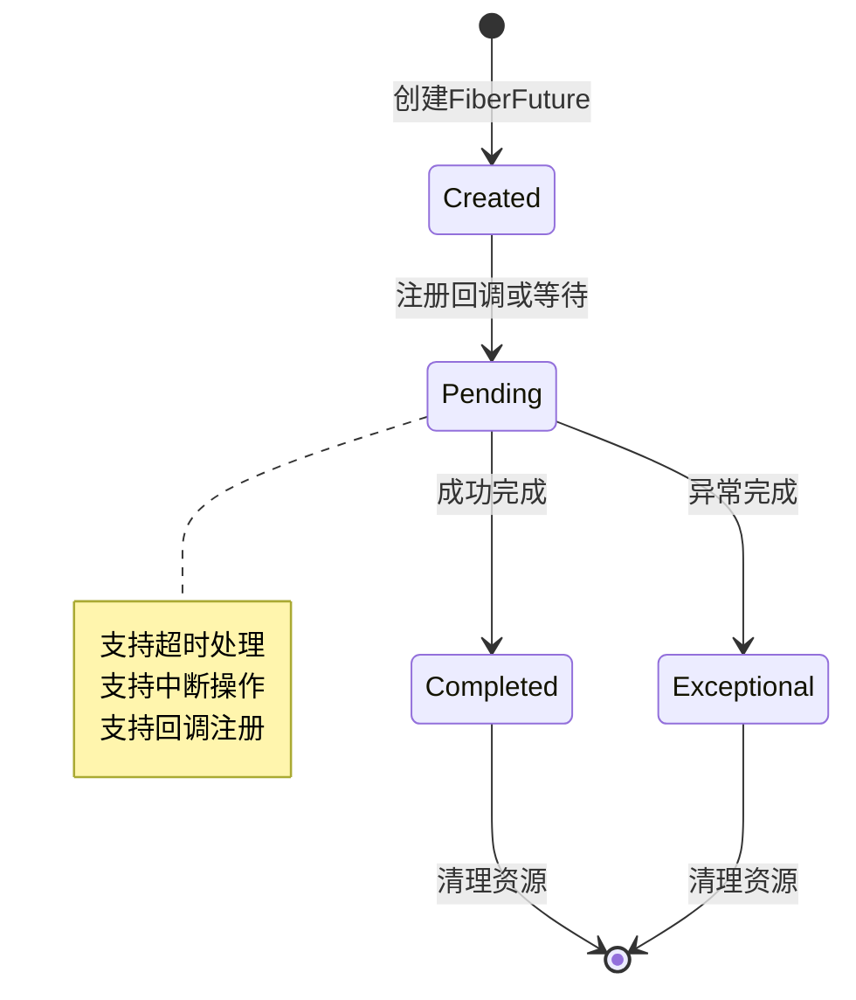
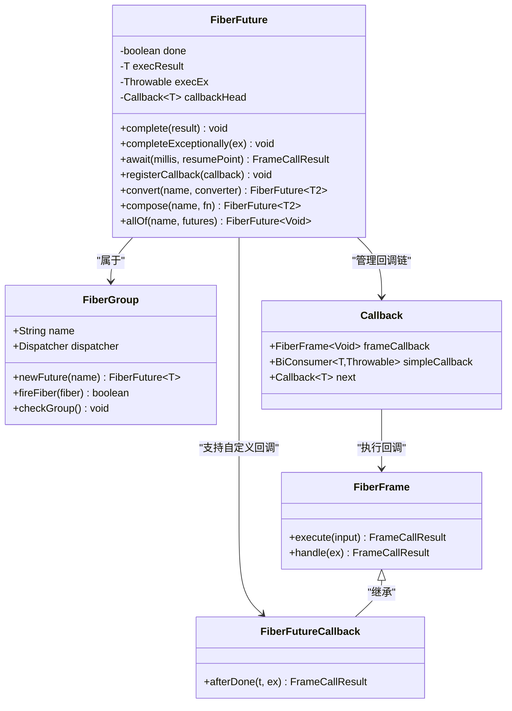
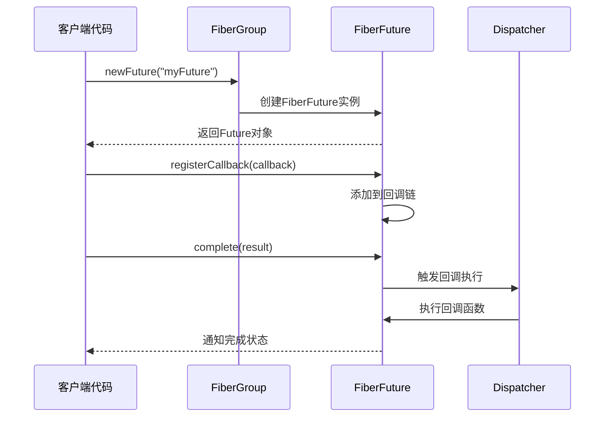
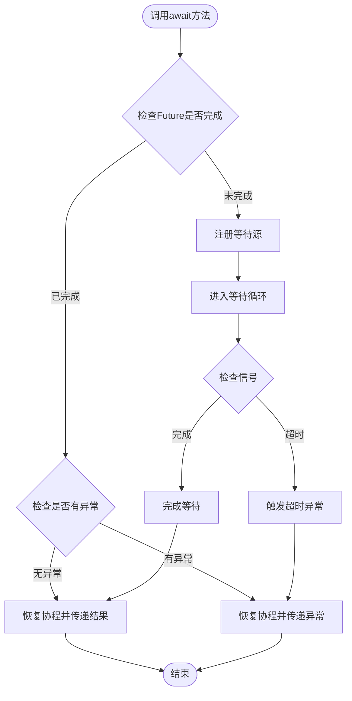
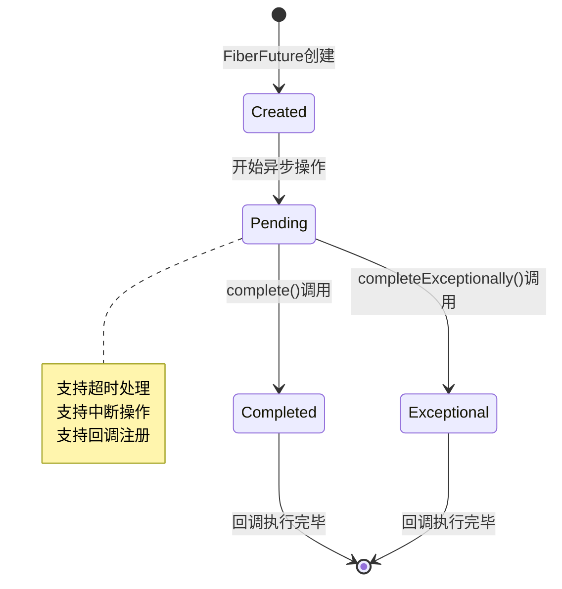
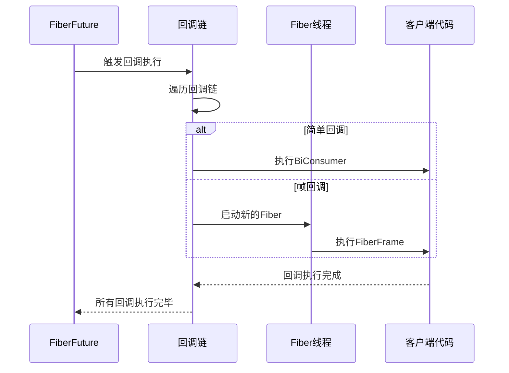
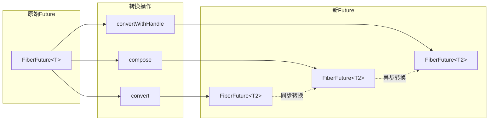
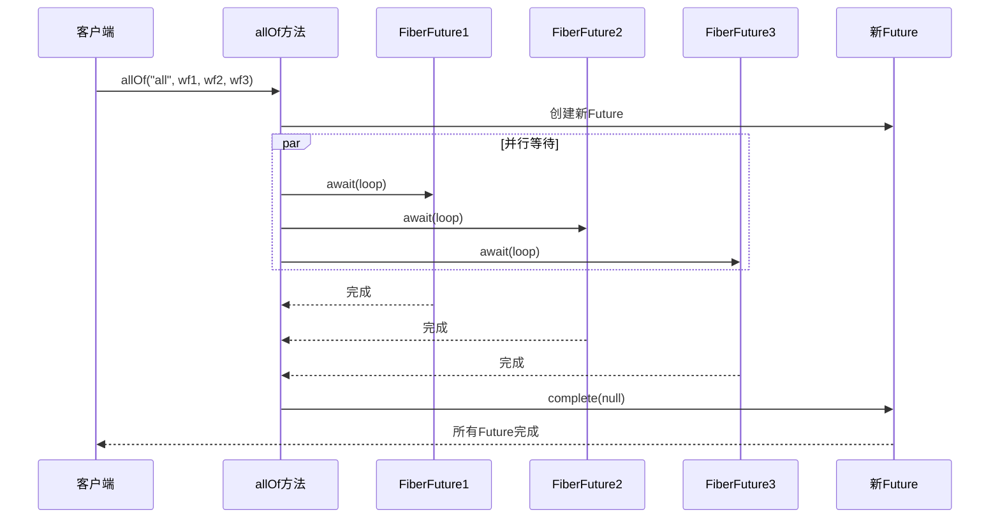
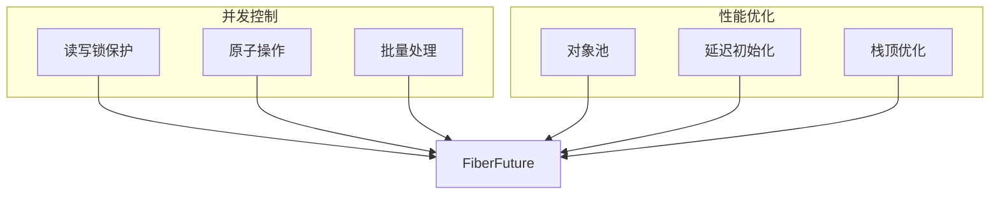

# FiberFuture异步编程模型

<cite>
**本文档中引用的文件**
- [FiberFuture.java](file://server/src/main/java/com/github/dtprj/dongting/fiber/FiberFuture.java)
- [FutureTest.java](file://server/src/test/java/com/github/dtprj/dongting/fiber/FutureTest.java)
- [Fiber.java](file://server/src/main/java/com/github/dtprj/dongting/fiber/Fiber.java)
- [FiberGroup.java](file://server/src/main/java/com/github/dtprj/dongting/fiber/FiberGroup.java)
- [README.md](file://README.md)
</cite>

## 目录
1. [简介](#简介)
2. [核心设计原理](#核心设计原理)
3. [FiberFuture架构概览](#fiberfuture架构概览)
4. [核心组件分析](#核心组件分析)
5. [await方法的协程友好等待机制](#await方法的协程友好等待机制)
6. [完成状态管理](#完成状态管理)
7. [回调注册机制](#回调注册机制)
8. [函数式组合操作](#函数式组合操作)
9. [组合操作符](#组合操作符)
10. [实际应用示例](#实际应用示例)
11. [性能考虑](#性能考虑)
12. [故障排除指南](#故障排除指南)
13. [总结](#总结)

## 简介

FiberFuture是Dongting框架中一个强大的异步结果容器，专为协程友好的异步编程模型而设计。它提供了比传统Future更高效的异步操作管理，支持超时处理、回调注册、函数式组合等多种高级特性。

FiberFuture的设计理念基于以下核心原则：
- **协程友好**：与Dongting的协程框架深度集成
- **高效执行**：最小化线程切换开销
- **类型安全**：强类型支持确保编译时安全性
- **功能丰富**：提供完整的异步操作生命周期管理

## 核心设计原理

FiberFuture采用事件驱动的异步编程模型，通过以下关键设计原理实现高效的异步操作：

### 状态机设计
FiberFuture维护三种核心状态：
- **未完成状态**：等待异步操作完成
- **成功完成状态**：包含计算结果
- **异常完成状态**：包含错误信息

### 回调链机制
通过回调链机制实现异步操作的链式调用，避免回调地狱问题。

### 协程集成
与Dongting的协程框架无缝集成，支持非阻塞等待和自动恢复。



## FiberFuture架构概览

FiberFuture的整体架构围绕异步结果管理和协程集成展开：



**图表来源**
- [FiberFuture.java](file://server/src/main/java/com/github/dtprj/dongting/fiber/FiberFuture.java#L30-L354)
- [FiberGroup.java](file://server/src/main/java/com/github/dtprj/dongting/fiber/FiberGroup.java#L30-L100)

## 核心组件分析

### FiberFuture类结构

FiberFuture类是整个异步编程模型的核心，其主要组成部分包括：

#### 私有字段
- `done`: 表示Future是否已完成的状态标志
- `execResult`: 存储成功完成的结果值
- `execEx`: 存储异常完成的异常对象
- `callbackHead`: 回调链的头节点

#### 构造函数
```java
FiberFuture(String name, FiberGroup group)
```
FiberFuture只能通过FiberGroup创建，确保所有Future都在正确的组上下文中运行。

**章节来源**
- [FiberFuture.java](file://server/src/main/java/com/github/dtprj/dongting/fiber/FiberFuture.java#L30-L50)

### FiberGroup上下文

FiberFuture必须在FiberGroup的上下文中创建和运行，这提供了以下优势：

1. **线程安全保障**：确保所有操作都在正确的调度器线程中执行
2. **资源管理**：统一管理Fiber和Future的生命周期
3. **性能优化**：减少跨线程通信开销



**图表来源**
- [FiberGroup.java](file://server/src/main/java/com/github/dtprj/dongting/fiber/FiberGroup.java#L120-L130)
- [FiberFuture.java](file://server/src/main/java/com/github/dtprj/dongting/fiber/FiberFuture.java#L100-L150)

## await方法的协程友好等待机制

await方法是FiberFuture最核心的功能之一，它提供了协程友好的异步等待机制。

### 基本await方法

```java
public FrameCallResult await(FrameCall<T> resumePoint)
```

这个方法允许协程在不阻塞当前线程的情况下等待异步操作完成。

### 超时等待机制

```java
public FrameCallResult await(long millis, FrameCall<T> resumePoint)
```

支持带超时的等待，当等待时间超过指定毫秒数时自动触发超时异常。

### 内部实现机制

await方法的内部实现展示了FiberFuture的智能等待逻辑：

```java
public FrameCallResult await(long millis, FrameCall<T> resumePoint) {
    if (done) {
        if (execEx == null) {
            return Fiber.resume(execResult, resumePoint);
        } else {
            return Fiber.resumeEx(execEx);
        }
    }
    return Dispatcher.awaitOn(this, TimeUnit.MILLISECONDS.toNanos(millis), resumePoint);
}
```

### 等待流程图



**图表来源**
- [FiberFuture.java](file://server/src/main/java/com/github/dtprj/dongting/fiber/FiberFuture.java#L170-L185)

**章节来源**
- [FiberFuture.java](file://server/src/main/java/com/github/dtprj/dongting/fiber/FiberFuture.java#L170-L185)

## 完成状态管理

FiberFuture提供了两种完成方式：正常完成和异常完成。

### 正常完成

```java
public void complete(T result)
```

正常完成方法用于设置成功的结果值。

### 异常完成

```java
public void completeExceptionally(Throwable ex)
```

异常完成方法用于设置异常信息，标记Future为失败状态。

### 完成状态转换



### 完成状态检查

FiberFuture提供了多种状态检查方法：

```java
public boolean isDone()      // 检查是否已完成
public boolean isCancelled() // 检查是否被取消
public void cancel()         // 取消操作
```

**章节来源**
- [FiberFuture.java](file://server/src/main/java/com/github/dtprj/dongting/fiber/FiberFuture.java#L80-L120)

## 回调注册机制

FiberFuture支持两种类型的回调注册：简单回调和帧回调。

### 简单回调

```java
public void registerCallback(BiConsumer<T, Throwable> callback)
```

简单回调是最基础的回调形式，接受两个参数：结果值和异常对象。

### 帧回调

```java
public void registerCallback(FiberFutureCallback<T> callback)
```

帧回调继承自FiberFrame，可以在回调中执行复杂的异步操作。

### 回调链管理

FiberFuture使用链表结构管理回调，确保回调按注册顺序执行：

```java
private void addCallback(Callback<T> c) {
    if (callbackHead == null) {
        callbackHead = c;
    } else {
        Callback<T> last = callbackHead;
        while (last.next != null) {
            last = last.next;
        }
        last.next = c;
    }
}
```

### 回调执行流程



**图表来源**
- [FiberFuture.java](file://server/src/main/java/com/github/dtprj/dongting/fiber/FiberFuture.java#L200-L250)

**章节来源**
- [FiberFuture.java](file://server/src/main/java/com/github/dtprj/dongting/fiber/FiberFuture.java#L190-L250)

## 函数式组合操作

FiberFuture提供了强大的函数式组合操作，支持链式调用和转换操作。

### convert方法

convert方法用于将一个类型的FiberFuture转换为另一个类型的FiberFuture：

```java
public <T2> FiberFuture<T2> convert(String name, Function<T, T2> converter)
```

使用示例：
```java
FiberFuture<Integer> intFuture = fiberGroup.newFuture("intFuture");
FiberFuture<String> stringFuture = intFuture.convert("toString", String::valueOf);
```

### convertWithHandle方法

convertWithHandle提供了更灵活的转换方式，可以同时处理结果和异常：

```java
public <T2> FiberFuture<T2> convertWithHandle(String name, BiFunction<T, Throwable, T2> converter)
```

### compose方法

compose方法允许将一个FiberFuture转换为另一个FiberFuture，支持异步转换：

```java
public <T2> FiberFuture<T2> compose(String name, Function<T, FiberFuture<T2>> fn)
```

使用示例：
```java
FiberFuture<String> stringFuture = fiberGroup.newFuture("stringFuture");
FiberFuture<Integer> intFuture = stringFuture.compose("toInt", str -> {
    FiberFuture<Integer> result = fiberGroup.newFuture("parseResult");
    // 异步解析字符串
    return result;
});
```

### 组合操作流程



**图表来源**
- [FiberFuture.java](file://server/src/main/java/com/github/dtprj/dongting/fiber/FiberFuture.java#L260-L320)

**章节来源**
- [FiberFuture.java](file://server/src/main/java/com/github/dtprj/dongting/fiber/FiberFuture.java#L260-L320)

## 组合操作符

FiberFuture提供了allOf静态方法，用于协调多个异步操作的完成。

### allOf方法

```java
public static FiberFuture<Void> allOf(String name, FiberFuture<?>... futures)
```

allOf方法创建一个新的FiberFuture，当所有输入的FiberFuture都完成时触发。

### 实现原理

```java
public static FiberFuture<Void> allOf(String name, FiberFuture<?>... futures) {
    FiberGroup g = FiberGroup.currentGroup();
    FiberFuture<Void> newFuture = g.newFuture(name);
    Fiber f = new Fiber("wait-all-future", g, new FiberFrame<Void>() {
        private int i;

        public FrameCallResult loop(Object unused) {
            if (i < futures.length) {
                return futures[i++].await(this::loop);
            } else {
                newFuture.complete(null);
                return Fiber.frameReturn();
            }
        }

        @Override
        protected FrameCallResult handle(Throwable ex) {
            newFuture.completeExceptionally(ex);
            return Fiber.frameReturn();
        }
    });
    g.start(f, false);
    return newFuture;
}
```

### allOf执行流程



**图表来源**
- [FiberFuture.java](file://server/src/main/java/com/github/dtprj/dongting/fiber/FiberFuture.java#L325-L350)

### 其他组合操作符

除了allOf之外，FiberFuture还支持其他组合操作符：

1. **anyOf**: 当任意一个Future完成时触发
2. **race**: 类似于Promise.race，第一个完成的Future决定结果
3. **zip**: 将多个Future的结果合并为一个结果

**章节来源**
- [FiberFuture.java](file://server/src/main/java/com/github/dtprj/dongting/fiber/FiberFuture.java#L325-L350)

## 实际应用示例

### 基础使用示例

```java
// 创建FiberFuture
FiberFuture<String> future = fiberGroup.newFuture("example");

// 注册回调
future.registerCallback((result, ex) -> {
    if (ex == null) {
        System.out.println("结果: " + result);
    } else {
        System.err.println("发生错误: " + ex.getMessage());
    }
});

// 完成Future
future.complete("Hello, FiberFuture!");
```

### 超时处理示例

```java
FiberFuture<String> future = fiberGroup.newFuture("timeoutExample");

// 设置1秒超时
FrameCallResult result = future.await(1000, (result) -> {
    System.out.println("操作完成: " + result);
    return Fiber.frameReturn();
});

if (result == FrameCallResult.TIMEOUT) {
    System.err.println("操作超时");
}
```

### 链式调用示例

```java
FiberFuture<Integer> intFuture = fiberGroup.newFuture("intFuture");

// 使用convert进行类型转换
FiberFuture<String> stringFuture = intFuture.convert("toString", String::valueOf);

// 使用compose进行异步转换
FiberFuture<Double> doubleFuture = stringFuture.compose("toDouble", str -> {
    FiberFuture<Double> result = fiberGroup.newFuture("parseDouble");
    // 模拟异步解析
    return result;
});
```

### 多个Future协调示例

```java
// 创建多个独立的Future
FiberFuture<String> future1 = fiberGroup.newFuture("future1");
FiberFuture<String> future2 = fiberGroup.newFuture("future2");
FiberFuture<String> future3 = fiberGroup.newFuture("future3");

// 使用allOf协调多个Future
FiberFuture<Void> allFuture = FiberFuture.allOf("allFutures", future1, future2, future3);

// 注册最终完成回调
allFuture.registerCallback((result, ex) -> {
    if (ex == null) {
        System.out.println("所有Future都已完成");
    } else {
        System.err.println("部分Future失败: " + ex.getMessage());
    }
});

// 分别完成各个Future
future1.complete("任务1完成");
future2.complete("任务2完成");
future3.complete("任务3完成");
```

### 错误处理示例

```java
FiberFuture<String> future = fiberGroup.newFuture("errorExample");

// 注册错误处理回调
future.registerCallback((result, ex) -> {
    if (ex != null) {
        // 使用convertWithHandle处理异常
        return future.convertWithHandle("handleError", (r, e) -> {
            if (e instanceof FileNotFoundException) {
                return "文件未找到";
            } else if (e instanceof IOException) {
                return "IO错误";
            } else {
                return "未知错误";
            }
        }).await((handledResult) -> {
            System.out.println("处理后的错误消息: " + handledResult);
            return Fiber.frameReturn();
        });
    }
    return Fiber.frameReturn();
});

// 模拟抛出异常
future.completeExceptionally(new FileNotFoundException("测试文件不存在"));
```

## 性能考虑

### 内存效率

FiberFuture的设计注重内存效率：

1. **对象池化**：重用FiberFuture对象减少GC压力
2. **延迟初始化**：回调链只在需要时才创建
3. **弱引用**：避免不必要的强引用导致内存泄漏

### 执行效率

1. **零拷贝**：直接传递结果对象，避免不必要的复制
2. **栈顶优化**：利用协程栈顶优化减少上下文切换
3. **批量处理**：支持批量回调执行提高吞吐量

### 并发性能



## 故障排除指南

### 常见问题及解决方案

#### 1. FiberFuture不在当前组中

**错误信息**: `FiberException: not in current group`

**原因**: 在错误的FiberGroup上下文中访问FiberFuture

**解决方案**:
```java
// 错误做法
FiberFuture<String> future = wrongGroup.newFuture("future");

// 正确做法
FiberFuture<String> future = FiberGroup.currentGroup().newFuture("future");
```

#### 2. 回调未执行

**原因**: Future已经完成，但回调注册时机不对

**解决方案**:
```java
// 确保在Future完成前注册回调
FiberFuture<String> future = fiberGroup.newFuture("future");
future.registerCallback((result, ex) -> {
    // 回调逻辑
});

// 或者使用convert方法进行安全转换
future.convert("safeConvert", result -> {
    // 转换逻辑
    return transformedResult;
}).registerCallback((transformed, ex) -> {
    // 安全的回调逻辑
});
```

#### 3. 超时处理不当

**问题**: 超时后没有正确处理

**解决方案**:
```java
FrameCallResult result = future.await(5000, (value) -> {
    System.out.println("操作成功完成");
    return Fiber.frameReturn();
});

if (result == FrameCallResult.TIMEOUT) {
    // 处理超时情况
    System.err.println("操作超时，正在清理资源...");
    // 清理逻辑
}
```

### 调试技巧

1. **启用日志记录**：配置适当的日志级别跟踪FiberFuture状态变化
2. **使用断点调试**：在关键回调点设置断点观察执行流程
3. **监控内存使用**：定期检查FiberFuture对象的内存占用

**章节来源**
- [FiberFuture.java](file://server/src/main/java/com/github/dtprj/dongting/fiber/FiberFuture.java#L100-L120)

## 总结

FiberFuture作为Dongting框架的核心异步编程组件，提供了强大而灵活的异步操作管理能力。其主要优势包括：

### 核心特性总结

1. **协程友好设计**：与Dongting协程框架深度集成，提供非阻塞等待机制
2. **类型安全**：强类型支持确保编译时安全性
3. **功能丰富**：支持超时处理、回调注册、函数式组合等多种高级特性
4. **性能优异**：最小化线程切换开销，提供高吞吐量的异步操作

### 最佳实践建议

1. **合理使用回调**：优先使用帧回调处理复杂异步逻辑
2. **及时清理资源**：在Future完成后及时清理相关资源
3. **错误处理完善**：为所有异步操作提供完善的错误处理机制
4. **性能监控**：定期监控FiberFuture的性能指标

### 发展方向

随着Dongting框架的发展，FiberFuture将继续演进：

1. **更多组合操作符**：扩展更多的异步操作组合方式
2. **性能优化**：持续优化内存使用和执行效率
3. **工具支持**：提供更多的调试和监控工具

FiberFuture代表了现代异步编程的最佳实践，为开发者提供了构建高性能异步应用程序的强大工具。通过深入理解和正确使用FiberFuture，开发者可以构建出既高效又可靠的异步系统。