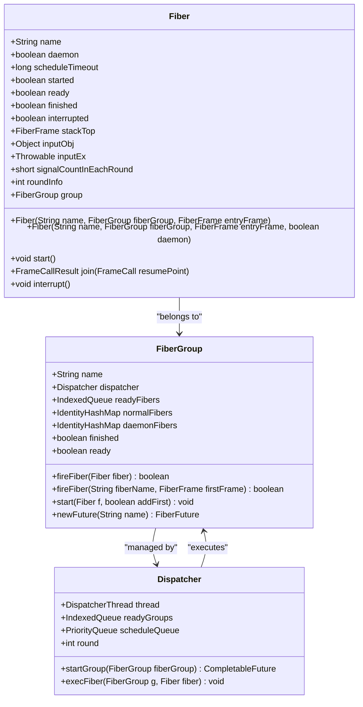
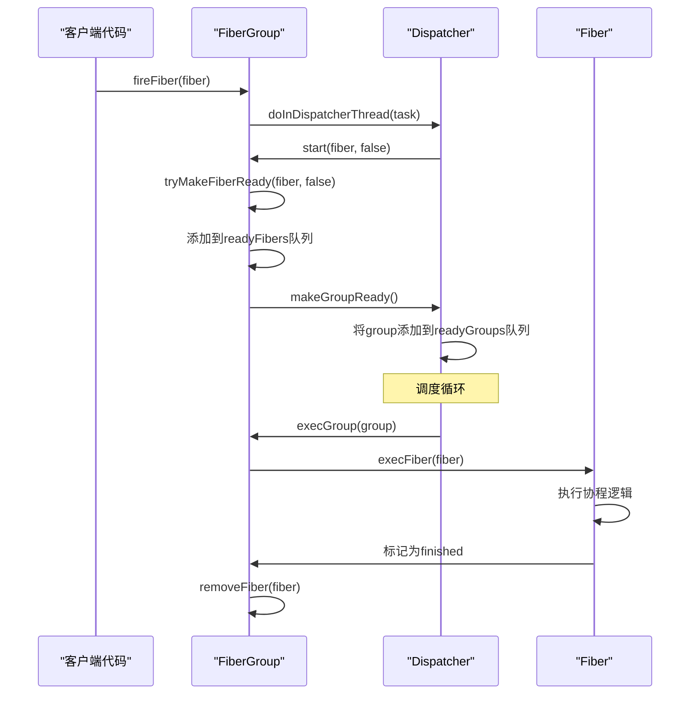
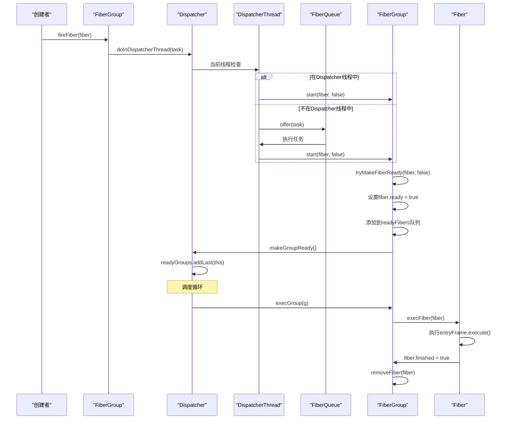
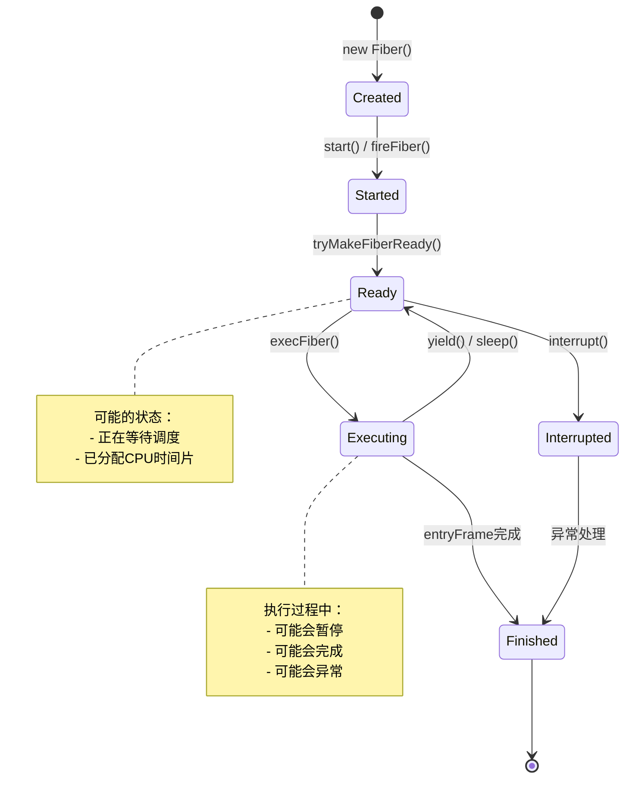

# Fiber创建与启动机制详细文档

<cite>
**本文档引用的文件**
- [Fiber.java](file://server/src/main/java/com/github/dtprj/dongting/fiber/Fiber.java)
- [FiberGroup.java](file://server/src/main/java/com/github/dtprj/dongting/fiber/FiberGroup.java)
- [Dispatcher.java](file://server/src/main/java/com/github/dtprj/dongting/fiber/Dispatcher.java)
- [CreateFiberTest.java](file://benchmark/src/main/java/com/github/dtprj/dongting/bench/fiber/CreateFiberTest.java)
- [FiberLifeCycleTest.java](file://server/src/test/java/com/github/dtprj/dongting/fiber/FiberLifeCycleTest.java)
- [FiberChannelTest.java](file://benchmark/src/main/java/com/github/dtprj/dongting/bench/fiber/FiberChannelTest.java)
- [FiberTest.java](file://benchmark/src/main/java/com/github/dtprj/dongting/bench/fiber/FiberTest.java)
</cite>

## 目录
1. [简介](#简介)
2. [Fiber核心概念](#fiber核心概念)
3. [Fiber构造函数详解](#fiber构造函数详解)
4. [FiberGroup管理机制](#fiberGroup管理机制)
5. [Fiber启动流程](#fiber启动流程)
6. [Fiber生命周期状态](#fiber生命周期状态)
7. [创建与启动示例](#创建与启动示例)
8. [最佳实践指南](#最佳实践指南)
9. [常见错误排查](#常见错误排查)
10. [总结](#总结)

## 简介

Dongting框架中的Fiber是一种轻量级的协程实现，提供了高效的并发编程能力。Fiber的创建与启动机制是整个协程系统的核心，涉及多个组件的协调工作：Fiber构造器负责创建协程实例，FiberGroup负责管理协程组，Dispatcher负责调度和执行协程。

本文档将深入解析Fiber的创建过程、启动机制以及相关的生命周期管理，帮助开发者理解和正确使用Dongting的协程功能。

## Fiber核心概念

### Fiber类结构

Fiber类继承自WaitSource，是Dongting协程系统的基本单元。每个Fiber实例都包含以下关键属性：



**图表来源**
- [Fiber.java](file://server/src/main/java/com/github/dtprj/dongting/fiber/Fiber.java#L25-L237)
- [FiberGroup.java](file://server/src/main/java/com/github/dtprj/dongting/fiber/FiberGroup.java#L35-L366)
- [Dispatcher.java](file://server/src/main/java/com/github/dtprj/dongting/fiber/Dispatcher.java#L45-L655)

## Fiber构造函数详解

### 构造函数重载

Fiber提供了三个构造函数重载版本，允许灵活配置协程的初始状态：

```java
// 基本构造函数
public Fiber(String name, FiberGroup fiberGroup, FiberFrame<Void> entryFrame)

// 包含daemon标志的构造函数
public Fiber(String name, FiberGroup fiberGroup, FiberFrame<Void> entryFrame, boolean daemon)

// 完整构造函数，包含信号计数参数
public Fiber(String name, FiberGroup fiberGroup, FiberFrame<Void> entryFrame, boolean daemon,
             int signalCountInEachRound)
```

### 参数详解

#### name参数
- **类型**: `String`
- **作用**: 协程的名称标识符，用于调试和日志记录
- **特点**: 必须唯一标识协程，便于跟踪和问题定位

#### FiberGroup参数
- **类型**: `FiberGroup`
- **作用**: 指定协程所属的协程组，控制协程的生命周期和资源管理
- **特点**: 协程组是协程的容器，负责协程的调度和清理

#### entryFrame参数
- **类型**: `FiberFrame<Void>`
- **作用**: 协程的入口帧，定义协程的初始执行逻辑
- **特点**: 是协程执行的起点，包含协程的主要业务逻辑

#### daemon参数
- **类型**: `boolean`
- **作用**: 标识协程是否为守护协程
- **特点**: 
  - 守护协程在协程组关闭时会被自动终止
  - 非守护协程需要显式等待其完成
  - 默认值为`false`

#### signalCountInEachRound参数
- **类型**: `int`
- **作用**: 每轮调度中协程可接收的信号数量
- **特点**:
  - 控制协程的调度频率
  - 较高的值意味着更频繁的调度
  - 默认值为1

**章节来源**
- [Fiber.java](file://server/src/main/java/com/github/dtprj/dongting/fiber/Fiber.java#L50-L70)

## FiberGroup管理机制

### FiberGroup职责

FiberGroup是协程的管理容器，负责协程的创建、启动、调度和清理：



**图表来源**
- [FiberGroup.java](file://server/src/main/java/com/github/dtprj/dongting/fiber/FiberGroup.java#L146-L180)
- [Dispatcher.java](file://server/src/main/java/com/github/dtprj/dongting/fiber/Dispatcher.java#L279-L311)

### fireFiber方法

`fireFiber`方法是启动协程的核心接口，支持两种调用方式：

#### 直接启动Fiber
```java
public boolean fireFiber(Fiber fiber) {
    if (fiber.group != this) {
        throw new DtException("fiber not in group");
    }
    return dispatcher.doInDispatcherThread(new FiberQueueTask(this) {
        @Override
        protected void run() {
            start(fiber, false);
        }
    });
}
```

#### 创建并启动新Fiber
```java
public boolean fireFiber(String fiberName, FiberFrame<Void> firstFrame) {
    return fireFiber(new Fiber(fiberName, this, firstFrame));
}
```

### start方法

`start`方法负责将协程标记为已启动并加入调度队列：

```java
void start(Fiber f, boolean addFirst) {
    if (f.group.finished) {
        log.warn("group finished, ignore fiber start: {}", f.name);
        return;
    }
    if (f.started) {
        BugLog.getLog().error("fiber already started: {}", f.name);
        return;
    }
    f.started = true;
    if (f.daemon) {
        daemonFibers.put(f, f);
    } else {
        normalFibers.put(f, f);
    }
    tryMakeFiberReady(f, addFirst);
}
```

**章节来源**
- [FiberGroup.java](file://server/src/main/java/com/github/dtprj/dongting/fiber/FiberGroup.java#L85-L180)

## Fiber启动流程

### 启动序列图



**图表来源**
- [Dispatcher.java](file://server/src/main/java/com/github/dtprj/dongting/fiber/Dispatcher.java#L279-L311)
- [FiberGroup.java](file://server/src/main/java/com/github/dtprj/dongting/fiber/FiberGroup.java#L146-L180)

### 调度机制

Dispatcher采用基于轮次的调度机制：

1. **轮次计算**: 每轮调度更新round变量
2. **信号计数**: 每个协程维护signalCountInEachRound计数
3. **队列管理**: 
   - `readyFibers`: 当前轮次的就绪协程
   - `readyFibersNextRound1`: 下一轮次的优先协程
   - `readyFibersNextRound2`: 下一轮次的普通协程

```java
void tryMakeFiberReady(Fiber f, boolean addFirst) {
    if (finished) {
        log.warn("group finished, ignore makeReady: {}", f.name);
        return;
    }
    if (f.finished) {
        log.warn("fiber already finished, ignore makeReady: {}", f.name);
        return;
    }
    if (!f.ready) {
        f.ready = true;
        if ((f.roundInfo >>> 16) != (dispatcher.round & 0xFFFF)) {
            f.roundInfo = (dispatcher.round << 16) | f.signalCountInEachRound;
        }
        if ((f.roundInfo & 0xFFFF) == 0) {
            if (addFirst) {
                readyFibersNextRound1.addLast(f);
            } else {
                readyFibersNextRound2.addLast(f);
            }
        } else {
            if (addFirst) {
                readyFibers.addFirst(f);
            } else {
                readyFibers.addLast(f);
            }
            f.roundInfo--;
        }
        makeGroupReady();
    }
}
```

**章节来源**
- [FiberGroup.java](file://server/src/main/java/com/github/dtprj/dongting/fiber/FiberGroup.java#L182-L210)

## Fiber生命周期状态

### 状态转换图



### 状态字段详解

#### started字段
- **类型**: `boolean`
- **作用**: 标识协程是否已启动
- **设置时机**: 在`start()`方法中设置为`true`

#### ready字段
- **类型**: `boolean`
- **作用**: 标识协程是否已准备好执行
- **设置时机**: 在`tryMakeFiberReady()`方法中设置为`true`

#### finished字段
- **类型**: `boolean`
- **作用**: 标识协程是否已完成执行
- **设置时机**: 在协程的entryFrame执行完成后设置为`true`

#### interrupted字段
- **类型**: `boolean`
- **作用**: 标识协程是否被中断
- **设置时机**: 在`interrupt()`方法中设置为`true`

### 状态检查方法

```java
public void start() {
    group.checkGroup();
    group.start(Fiber.this, false);
}

public boolean isStarted() {
    group.checkGroup();
    return started;
}

public boolean isFinished() {
    group.checkGroup();
    return finished;
}
```

**章节来源**
- [Fiber.java](file://server/src/main/java/com/github/dtprj/dongting/fiber/Fiber.java#L180-L200)

## 创建与启动示例

### 基本创建示例

#### 同步启动方式

```java
// 创建FiberGroup
FiberGroup group = new FiberGroup("my-group", dispatcher);

// 创建Fiber实例
Fiber fiber = new Fiber("my-fiber", group, new FiberFrame<>() {
    @Override
    public FrameCallResult execute(Void input) {
        System.out.println("Hello from fiber!");
        return Fiber.frameReturn();
    }
});

// 同步启动
fiber.start();
```

#### 异步启动方式

```java
// 使用fireFiber异步启动
group.fireFiber("async-fiber", new FiberFrame<>() {
    @Override
    public FrameCallResult execute(Void input) {
        System.out.println("Async fiber started!");
        return Fiber.frameReturn();
    }
});
```

### 复杂创建示例

#### 包含daemon属性的Fiber

```java
// 创建守护协程
Fiber daemonFiber = new Fiber("daemon-worker", group, new FiberFrame<>() {
    @Override
    public FrameCallResult execute(Void input) {
        // 守护协程逻辑
        while (!group.isShouldStop()) {
            // 执行工作
            return Fiber.sleep(1000, this);
        }
        return Fiber.frameReturn();
    }
}, true); // daemon=true

group.fireFiber(daemonFiber);
```

#### 自定义信号计数的Fiber

```java
// 创建高频率调度的Fiber
Fiber highFreqFiber = new Fiber("high-freq", group, new FiberFrame<>() {
    @Override
    public FrameCallResult execute(Void input) {
        // 高频调度逻辑
        return Fiber.frameReturn();
    }
}, false, 10); // signalCountInEachRound=10

group.fireFiber(highFreqFiber);
```

### 测试示例

#### 创建Fiber的基准测试

```java
private Fiber createTask() {
    return new Fiber("worker", group, new FiberFrame<>() {
        @Override
        public FrameCallResult execute(Void input) {
            if (++count == LOOP) {
                System.out.println("Time: " + (System.currentTimeMillis() - startTime) + "ms");
            }
            return Fiber.frameReturn();
        }
    });
}
```

#### 通道通信示例

```java
// 生产者Fiber
group.fireFiber("producer", new FiberFrame<>() {
    @Override
    public FrameCallResult execute(Void input) {
        FiberChannel<String> channel = group.newChannel();
        
        for (int i = 0; i < 10; i++) {
            String message = "Message " + i;
            channel.write(message);
            return Fiber.sleep(100, this);
        }
        return Fiber.frameReturn();
    }
});

// 消费者Fiber
Fiber consumer = new Fiber("consumer", group, new FiberFrame<>() {
    @Override
    public FrameCallResult execute(Void input) {
        FiberChannel<String> channel = group.newChannel();
        
        while (true) {
            String message = channel.read();
            System.out.println("Received: " + message);
            
            if (message.equals("Message 9")) {
                break;
            }
        }
        return Fiber.frameReturn();
    }
});
group.fireFiber(consumer);
```

**章节来源**
- [CreateFiberTest.java](file://benchmark/src/main/java/com/github/dtprj/dongting/bench/fiber/CreateFiberTest.java#L70-L81)
- [FiberChannelTest.java](file://benchmark/src/main/java/com/github/dtprj/dongting/bench/fiber/FiberChannelTest.java#L49-L81)

## 最佳实践指南

### Fiber创建最佳实践

#### 1. 合理选择daemon属性

```java
// 对于后台服务，使用daemon=true
Fiber backgroundWorker = new Fiber("background", group, new FiberFrame<>() {
    @Override
    public FrameCallResult execute(Void input) {
        while (!group.isShouldStop()) {
            // 执行后台任务
            return Fiber.sleep(1000, this);
        }
        return Fiber.frameReturn();
    }
}, true); // 守护协程，随组关闭

// 对于关键业务逻辑，使用daemon=false
Fiber criticalTask = new Fiber("critical", group, new FiberFrame<>() {
    @Override
    public FrameCallResult execute(Void input) {
        // 关键业务逻辑
        return Fiber.frameReturn();
    }
}, false); // 非守护协程，需要显式等待
```

#### 2. 优化信号计数参数

```java
// 对于高频调度需求
Fiber highFreqFiber = new Fiber("high-freq", group, new FiberFrame<>() {
    @Override
    public FrameCallResult execute(Void input) {
        // 高频调度逻辑
        return Fiber.frameReturn();
    }
}, false, 100); // 每轮100次信号

// 对于低频调度需求
Fiber lowFreqFiber = new Fiber("low-freq", group, new FiberFrame<>() {
    @Override
    public FrameCallResult execute(Void input) {
        // 低频调度逻辑
        return Fiber.frameReturn();
    }
}, false, 1); // 每轮1次信号
```

#### 3. 合理使用fireFiber方法

```java
// 推荐：使用fireFiber创建并启动
group.fireFiber("simple-task", new FiberFrame<>() {
    @Override
    public FrameCallResult execute(Void input) {
        // 简单任务逻辑
        return Fiber.frameReturn();
    }
});

// 不推荐：先创建再启动
Fiber fiber = new Fiber("manual-start", group, new FiberFrame<>() {
    @Override
    public FrameCallResult execute(Void input) {
        // 手动启动逻辑
        return Fiber.frameReturn();
    }
});
// 需要手动调用fiber.start()，容易遗漏
```

### 错误处理最佳实践

#### 1. 异常处理

```java
Fiber fiber = new Fiber("error-prone", group, new FiberFrame<>() {
    @Override
    public FrameCallResult execute(Void input) {
        try {
            // 可能抛出异常的代码
            riskyOperation();
            return Fiber.frameReturn();
        } catch (Exception e) {
            // 记录异常并处理
            log.error("Fiber execution error", e);
            return Fiber.frameReturn();
        }
    }
});
```

#### 2. 资源清理

```java
Fiber resourceFiber = new Fiber("resource-manager", group, new FiberFrame<>() {
    @Override
    public FrameCallResult execute(Void input) {
        Resource resource = acquireResource();
        try {
            // 使用资源
            return Fiber.frameReturn();
        } finally {
            // 确保资源释放
            if (resource != null) {
                resource.release();
            }
        }
    }
});
```

### 性能优化建议

#### 1. 减少Fiber创建开销

```java
// 推荐：复用Fiber实例
class ReusableFiber {
    private final Fiber fiber;
    
    public ReusableFiber(FiberGroup group) {
        this.fiber = new Fiber("reusable", group, new FiberFrame<>() {
            @Override
            public FrameCallResult execute(Void input) {
                // 重用逻辑
                return Fiber.frameReturn();
            }
        });
    }
    
    public void execute() {
        group.fireFiber(fiber);
    }
}
```

#### 2. 合理设置调度参数

```java
// 根据业务特点调整信号计数
public class FiberScheduler {
    public static final int HIGH_FREQUENCY = 100;
    public static final int NORMAL_FREQUENCY = 10;
    public static final int LOW_FREQUENCY = 1;
    
    public static Fiber createHighFreqFiber(FiberGroup group) {
        return new Fiber("high-freq", group, createFrame(), false, HIGH_FREQUENCY);
    }
    
    public static Fiber createNormalFiber(FiberGroup group) {
        return new Fiber("normal", group, createFrame(), false, NORMAL_FREQUENCY);
    }
}
```

## 常见错误排查

### 1. FiberAlreadyStartedException

**错误现象**: 抛出`BugLog.getLog().error("fiber already started: {}", f.name)`异常

**原因分析**: 同一个Fiber实例被多次调用`start()`或`fireFiber()`

**解决方案**:
```java
// 错误做法
Fiber fiber = new Fiber("test", group, frame);
fiber.start();
fiber.start(); // 第二次调用会失败

// 正确做法
Fiber fiber = new Fiber("test", group, frame);
group.fireFiber(fiber); // 或 fiber.start()
// 不要重复启动同一个实例
```

### 2. FiberGroupFinishedException

**错误现象**: 日志显示`group finished, ignore fiber start`

**原因分析**: 在协程组已经完成的情况下尝试启动新的Fiber

**解决方案**:
```java
// 检查协程组状态
if (!group.finished) {
    group.fireFiber(new Fiber("new-fiber", group, frame));
} else {
    // 创建新的协程组
    FiberGroup newGroup = new FiberGroup("new-group", dispatcher);
    newGroup.fireFiber(new Fiber("new-fiber", newGroup, frame));
}
```

### 3. CurrentFiberNullException

**错误现象**: 抛出`current fiber is null`异常

**原因分析**: 在非Fiber上下文中调用Fiber相关方法

**解决方案**:
```java
// 错误做法
public void wrongMethod() {
    Fiber.sleep(1000, null); // 在非Fiber线程中调用
}

// 正确做法
public void correctMethod(FiberGroup group) {
    group.fireFiber("timer", new FiberFrame<>() {
        @Override
        public FrameCallResult execute(Void input) {
            Fiber.sleep(1000, this);
            return Fiber.frameReturn();
        }
    });
}
```

### 4. MemoryLeak风险

**问题描述**: 不正确的Fiber管理可能导致内存泄漏

**预防措施**:
```java
// 正确的Fiber生命周期管理
public class ManagedFiber {
    private Fiber fiber;
    private boolean started = false;
    
    public void start(FiberGroup group) {
        if (started) return;
        
        fiber = new Fiber("managed", group, new FiberFrame<>() {
            @Override
            public FrameCallResult execute(Void input) {
                // 业务逻辑
                return Fiber.frameReturn();
            }
        });
        
        group.fireFiber(fiber);
        started = true;
    }
    
    public void cleanup() {
        // 确保Fiber正确结束
        if (fiber != null && !fiber.isFinished()) {
            fiber.interrupt();
        }
    }
}
```

### 5. 调度死锁

**问题描述**: 不当的调度参数可能导致协程无法执行

**诊断方法**:
```java
// 检查Fiber状态
public void diagnoseFiber(Fiber fiber) {
    System.out.println("Started: " + fiber.isStarted());
    System.out.println("Ready: " + fiber.isReady());
    System.out.println("Finished: " + fiber.isFinished());
    System.out.println("Signal count: " + fiber.signalCountInEachRound);
}
```

**解决方案**:
```java
// 调整调度参数
Fiber fiber = new Fiber("diagnosed", group, frame, false, 10); // 增加信号计数
group.fireFiber(fiber);
```

### 6. 异常堆栈追踪问题

**问题描述**: Fiber异常的堆栈信息不完整

**解决方案**:
```java
// 使用FiberException捕获和处理异常
try {
    // 可能抛出异常的代码
} catch (FiberException e) {
    // Fiber异常会自动添加虚拟堆栈信息
    throw e;
} catch (Exception e) {
    // 其他异常需要手动包装
    throw Fiber.fatal(e);
}
```

## 总结

Dongting的Fiber创建与启动机制是一个精心设计的协程系统，具有以下特点：

### 核心优势

1. **轻量级设计**: Fiber作为轻量级协程，相比传统线程具有更低的内存开销和切换成本
2. **灵活调度**: 支持基于轮次的调度机制，可调节协程的调度频率
3. **强类型安全**: 通过严格的类型检查和状态验证，减少运行时错误
4. **优雅关闭**: 支持守护协程和正常协程的不同关闭策略

### 关键概念总结

- **Fiber构造函数**: 提供多种重载方式，支持不同的初始化需求
- **daemon属性**: 控制协程的生命周期行为
- **signalCountInEachRound**: 调节协程的调度频率
- **FiberGroup管理**: 统一管理协程的创建、启动和清理
- **调度机制**: 基于轮次的公平调度算法

### 使用建议

1. **合理选择daemon属性**: 根据业务需求选择合适的协程类型
2. **优化调度参数**: 根据实际负载调整信号计数参数
3. **遵循最佳实践**: 使用fireFiber方法，避免重复启动
4. **注意异常处理**: 正确处理Fiber异常，确保系统稳定性
5. **监控性能指标**: 定期检查Fiber的执行状态和性能表现

通过深入理解Fiber的创建与启动机制，开发者可以充分利用Dongting框架的协程特性，构建高效、可靠的并发应用程序。正确的使用方式不仅能提高程序性能，还能简化并发编程的复杂性，降低维护成本。