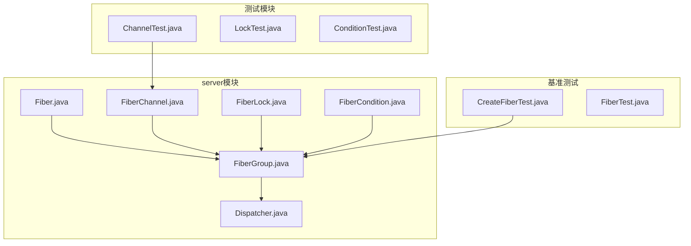
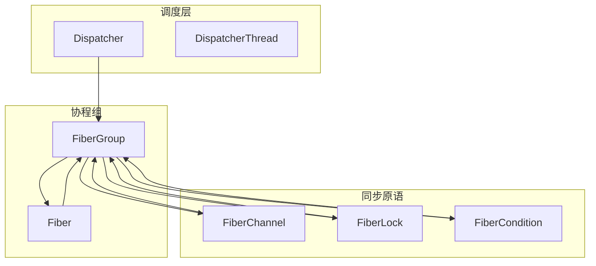
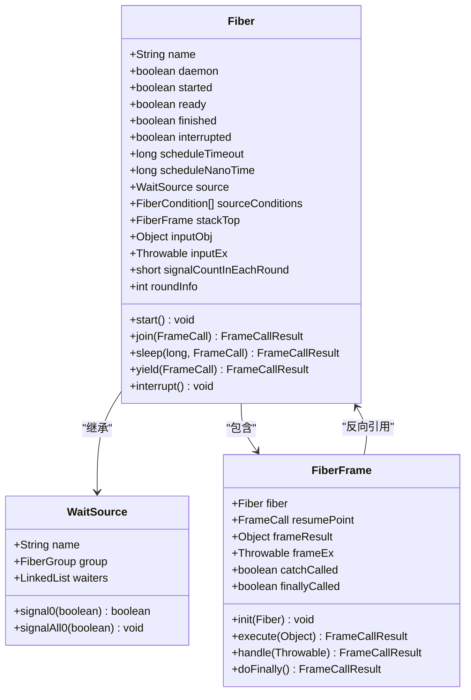
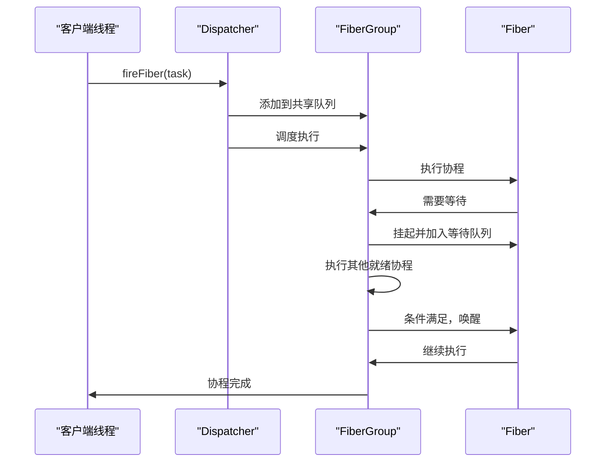
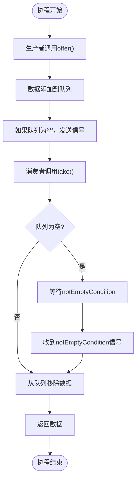
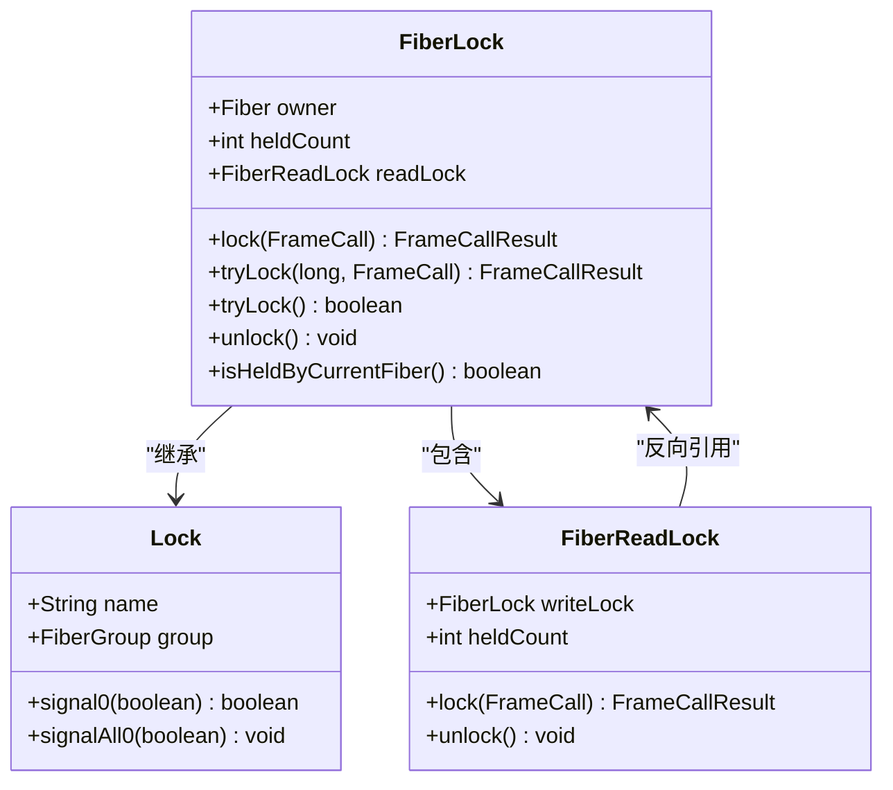
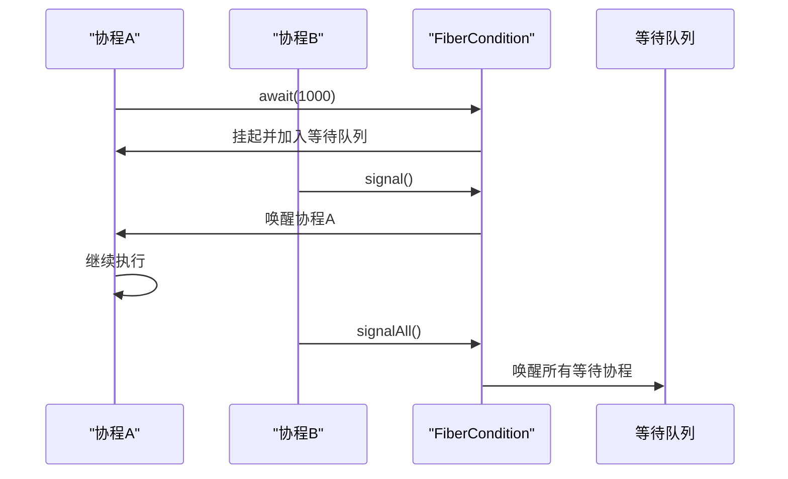

# Fiber协程系统

<cite>
**本文档引用的文件**   
- [Fiber.java](file://server/src/main/java/com/github/dtprj/dongting/fiber/Fiber.java)
- [FiberGroup.java](file://server/src/main/java/com/github/dtprj/dongting/fiber/FiberGroup.java)
- [Dispatcher.java](file://server/src/main/java/com/github/dtprj/dongting/fiber/Dispatcher.java)
- [FiberChannel.java](file://server/src/main/java/com/github/dtprj/dongting/fiber/FiberChannel.java)
- [FiberLock.java](file://server/src/main/java/com/github/dtprj/dongting/fiber/FiberLock.java)
- [FiberCondition.java](file://server/src/main/java/com/github/dtprj/dongting/fiber/FiberCondition.java)
- [CreateFiberTest.java](file://benchmark/src/main/java/com/github/dtprj/dongting/bench/fiber/CreateFiberTest.java)
- [ChannelTest.java](file://server/src/test/java/com/github/dtprj/dongting/fiber/ChannelTest.java)
</cite>

## 目录
1. [简介](#简介)
2. [项目结构](#项目结构)
3. [核心组件](#核心组件)
4. [架构概述](#架构概述)
5. [详细组件分析](#详细组件分析)
6. [依赖分析](#依赖分析)
7. [性能考虑](#性能考虑)
8. [故障排除指南](#故障排除指南)
9. [结论](#结论)

## 简介
Fiber协程系统是Dongting项目中的核心并发编程模型，提供了一种轻量级的协程实现，用于构建高性能的分布式系统。该系统基于"无栈协程"设计，通过虚拟的调用栈帧来管理协程执行流程，避免了传统线程上下文切换的开销。

Fiber系统的主要特点包括：
- **轻量级**：协程的创建和调度开销远小于操作系统线程
- **高效调度**：基于事件驱动的调度机制，避免了线程阻塞
- **同步原语**：提供协程安全的通道、锁和条件变量
- **异常处理**：完善的异常传播和处理机制
- **超时与取消**：支持协程的超时控制和取消操作

本文档将全面介绍Fiber协程系统的使用方法、内部机制和最佳实践，为开发者提供完整的编程指南。

## 项目结构



**图示来源**
- [Fiber.java](file://server/src/main/java/com/github/dtprj/dongting/fiber/Fiber.java#L1-L237)
- [FiberGroup.java](file://server/src/main/java/com/github/dtprj/dongting/fiber/FiberGroup.java#L1-L200)
- [FiberChannel.java](file://server/src/main/java/com/github/dtprj/dongting/fiber/FiberChannel.java#L1-L177)

**本节来源**
- [Fiber.java](file://server/src/main/java/com/github/dtprj/dongting/fiber/Fiber.java#L1-L237)
- [FiberGroup.java](file://server/src/main/java/com/github/dtprj/dongting/fiber/FiberGroup.java#L1-L200)

## 核心组件

Fiber协程系统由多个核心组件构成，每个组件都有明确的职责和功能。这些组件共同协作，实现了高效的协程管理和并发控制。

**本节来源**
- [Fiber.java](file://server/src/main/java/com/github/dtprj/dongting/fiber/Fiber.java#L1-L237)
- [FiberGroup.java](file://server/src/main/java/com/github/dtprj/dongting/fiber/FiberGroup.java#L1-L200)
- [Dispatcher.java](file://server/src/main/java/com/github/dtprj/dongting/fiber/Dispatcher.java#L1-L655)

## 架构概述



**图示来源**
- [Dispatcher.java](file://server/src/main/java/com/github/dtprj/dongting/fiber/Dispatcher.java#L1-L655)
- [FiberGroup.java](file://server/src/main/java/com/github/dtprj/dongting/fiber/FiberGroup.java#L1-L200)
- [Fiber.java](file://server/src/main/java/com/github/dtprj/dongting/fiber/Fiber.java#L1-L237)

## 详细组件分析

### Fiber协程分析

Fiber是Dongting系统中的基本执行单元，相当于虚拟线程。当Fiber挂起时，不会阻塞底层线程，调度器可以将线程用于执行其他Fiber。



**图示来源**
- [Fiber.java](file://server/src/main/java/com/github/dtprj/dongting/fiber/Fiber.java#L1-L237)
- [FiberFrame.java](file://server/src/main/java/com/github/dtprj/dongting/fiber/FiberFrame.java#L1-L50)

**本节来源**
- [Fiber.java](file://server/src/main/java/com/github/dtprj/dongting/fiber/Fiber.java#L1-L237)
- [FiberFrame.java](file://server/src/main/java/com/github/dtprj/dongting/fiber/FiberFrame.java#L1-L50)

### FiberGroup调度机制

FiberGroup是Fiber的容器和调度单元，负责管理一组相关Fiber的生命周期和执行调度。每个FiberGroup由一个Dispatcher线程执行，实现了"单线程执行器"模式。



**图示来源**
- [FiberGroup.java](file://server/src/main/java/com/github/dtprj/dongting/fiber/FiberGroup.java#L1-L200)
- [Dispatcher.java](file://server/src/main/java/com/github/dtprj/dongting/fiber/Dispatcher.java#L1-L655)

**本节来源**
- [FiberGroup.java](file://server/src/main/java/com/github/dtprj/dongting/fiber/FiberGroup.java#L1-L200)
- [Dispatcher.java](file://server/src/main/java/com/github/dtprj/dongting/fiber/Dispatcher.java#L1-L655)

### 同步原语分析

#### FiberChannel通信机制

FiberChannel是协程间通信的主要方式，提供了一个无界但仅阻塞消费者的队列，用于在协程之间传递数据。



**图示来源**
- [FiberChannel.java](file://server/src/main/java/com/github/dtprj/dongting/fiber/FiberChannel.java#L1-L177)
- [FiberCondition.java](file://server/src/main/java/com/github/dtprj/dongting/fiber/FiberCondition.java#L1-L99)

**本节来源**
- [FiberChannel.java](file://server/src/main/java/com/github/dtprj/dongting/fiber/FiberChannel.java#L1-L177)
- [ChannelTest.java](file://server/src/test/java/com/github/dtprj/dongting/fiber/ChannelTest.java#L1-L146)

#### FiberLock同步机制

FiberLock提供了协程安全的互斥锁功能，支持可重入和读写锁模式，确保在并发环境下的数据一致性。



**图示来源**
- [FiberLock.java](file://server/src/main/java/com/github/dtprj/dongting/fiber/FiberLock.java#L1-L116)
- [FiberReadLock.java](file://server/src/main/java/com/github/dtprj/dongting/fiber/FiberReadLock.java#L1-L50)

**本节来源**
- [FiberLock.java](file://server/src/main/java/com/github/dtprj/dongting/fiber/FiberLock.java#L1-L116)
- [FiberReadLock.java](file://server/src/main/java/com/github/dtprj/dongting/fiber/FiberReadLock.java#L1-L50)

#### FiberCondition条件变量

FiberCondition提供了条件等待和通知机制，允许协程在特定条件满足时才继续执行，是实现复杂同步逻辑的基础。



**图示来源**
- [FiberCondition.java](file://server/src/main/java/com/github/dtprj/dongting/fiber/FiberCondition.java#L1-L99)
- [FiberGroup.java](file://server/src/main/java/com/github/dtprj/dongting/fiber/FiberGroup.java#L1-L200)

**本节来源**
- [FiberCondition.java](file://server/src/main/java/com/github/dtprj/dongting/fiber/FiberCondition.java#L1-L99)
- [FiberGroup.java](file://server/src/main/java/com/github/dtprj/dongting/fiber/FiberGroup.java#L1-L200)

## 依赖分析

```mermaid
graph TD
Dispatcher --> FiberGroup : "管理"
FiberGroup --> Fiber : "包含"
FiberGroup --> FiberChannel : "创建"
FiberGroup --> FiberLock : "创建"
FiberGroup --> FiberCondition : "创建"
Fiber --> FiberFrame : "调用栈"
FiberChannel --> FiberCondition : "等待条件"
FiberLock --> FiberCondition : "等待条件"
FiberCondition --> Fiber : "等待队列"
Fiber --> WaitSource : "等待源"
```

**图示来源**
- [Dispatcher.java](file://server/src/main/java/com/github/dtprj/dongting/fiber/Dispatcher.java#L1-L655)
- [FiberGroup.java](file://server/src/main/java/com/github/dtprj/dongting/fiber/FiberGroup.java#L1-L200)
- [Fiber.java](file://server/src/main/java/com/github/dtprj/dongting/fiber/Fiber.java#L1-L237)

**本节来源**
- [Dispatcher.java](file://server/src/main/java/com/github/dtprj/dongting/fiber/Dispatcher.java#L1-L655)
- [FiberGroup.java](file://server/src/main/java/com/github/dtprj/dongting/fiber/FiberGroup.java#L1-L200)

## 性能考虑

Fiber协程系统在设计时充分考虑了性能因素，通过多种优化手段实现了高效的并发处理能力。

1. **无栈协程**：采用无栈实现方式，避免了传统有栈协程的两次栈拷贝开销，提高了性能。
2. **批量调度**：使用IndexedQueue作为就绪队列，支持批量处理就绪协程，减少调度开销。
3. **延迟信号**：提供signalLater方法，将信号操作延迟到当前协程执行完毕后，避免不必要的上下文切换。
4. **对象池**：使用对象池技术管理内存分配，减少GC压力。
5. **高效队列**：基于MpscLinkedQueue实现无锁队列，提高并发性能。

基准测试显示，创建和调度1000万个Fiber的性能表现优异，证明了该系统在高并发场景下的适用性。

**本节来源**
- [CreateFiberTest.java](file://benchmark/src/main/java/com/github/dtprj/dongting/bench/fiber/CreateFiberTest.java#L1-L112)
- [Dispatcher.java](file://server/src/main/java/com/github/dtprj/dongting/fiber/Dispatcher.java#L1-L655)

## 故障排除指南

### 常见问题及解决方案

1. **协程未启动**：确保在正确的FiberGroup中调用start()方法，或使用fireFiber()从任意线程启动。
2. **死锁问题**：检查锁的获取顺序，避免循环等待；使用tryLock()方法设置超时。
3. **内存泄漏**：确保所有创建的Fiber最终都能完成，特别是daemon Fiber。
4. **性能瓶颈**：检查是否存在长时间运行的协程阻塞了整个FiberGroup的执行。
5. **异常未处理**：确保在FiberFrame中正确实现handle()方法处理异常。

### 调试技巧

1. 使用FiberGroup的fireLogGroupInfo()方法输出调试信息。
2. 通过Dispatcher的perfCallback监控系统性能指标。
3. 利用Fiber的虚拟堆栈跟踪功能定位问题。
4. 在测试中使用Tick和WaitUtil工具进行精确的时序控制。

**本节来源**
- [Fiber.java](file://server/src/main/java/com/github/dtprj/dongting/fiber/Fiber.java#L1-L237)
- [FiberGroup.java](file://server/src/main/java/com/github/dtprj/dongting/fiber/FiberGroup.java#L1-L200)
- [test-support模块](file://test-support/src/main/java/com/github/dtprj/dongting/test)

## 结论

Fiber协程系统为Dongting项目提供了一个高效、可靠的并发编程模型。通过无栈协程设计和事件驱动的调度机制，实现了轻量级的并发控制，特别适合构建高性能的分布式系统。

该系统的主要优势包括：
- **高性能**：协程创建和调度开销极小，支持大规模并发
- **易用性**：提供了丰富的同步原语，简化了并发编程
- **可靠性**：完善的异常处理和超时机制，确保系统稳定性
- **可扩展性**：通过Dispatcher和FiberGroup的分层设计，支持水平扩展

开发者可以基于Fiber系统构建复杂的并发应用，充分利用其高性能特性，同时通过丰富的同步原语实现精确的并发控制。随着系统的不断发展，Fiber协程模型将继续优化，为分布式系统开发提供更强大的支持。