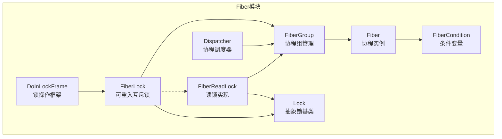
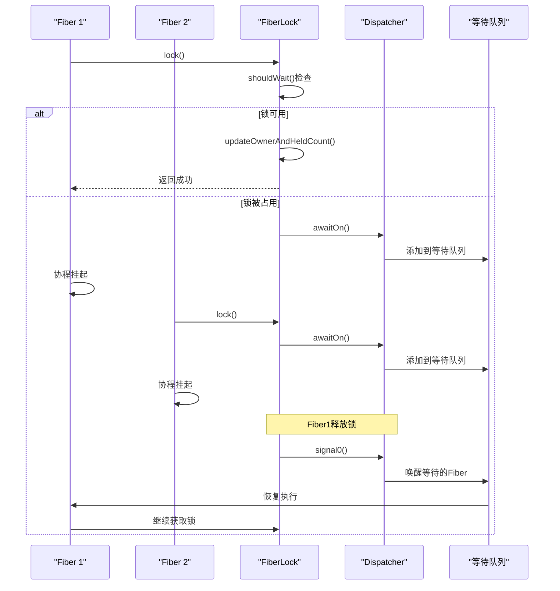
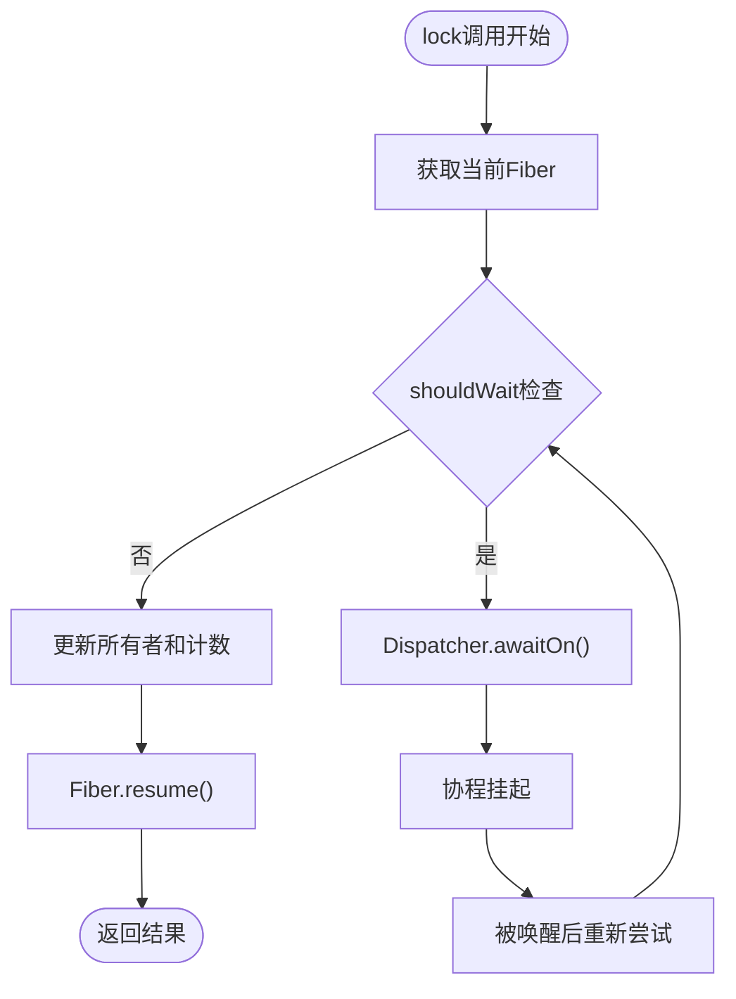
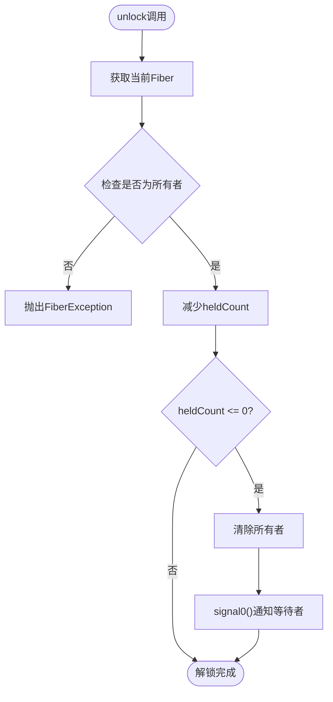
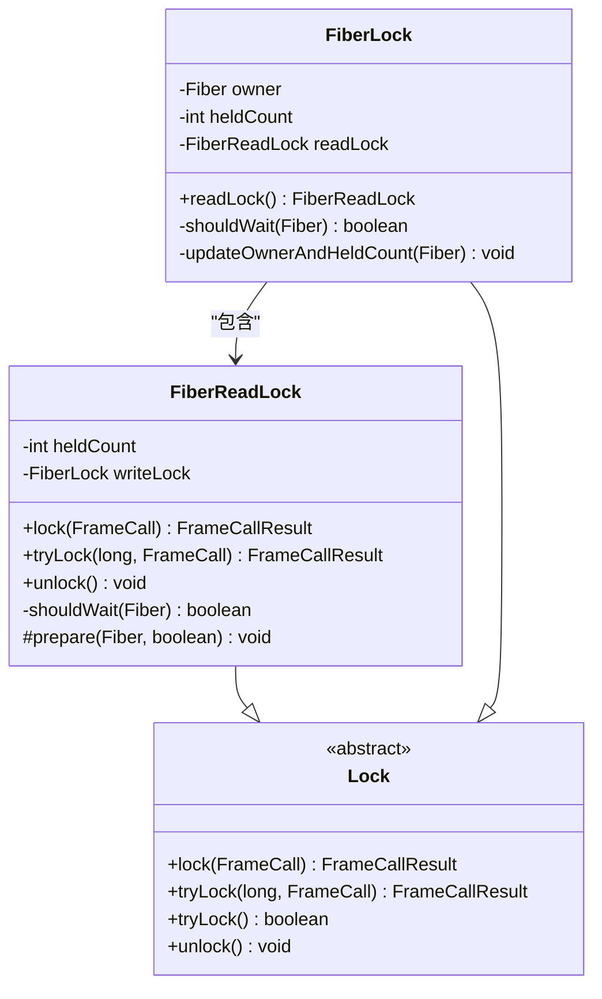
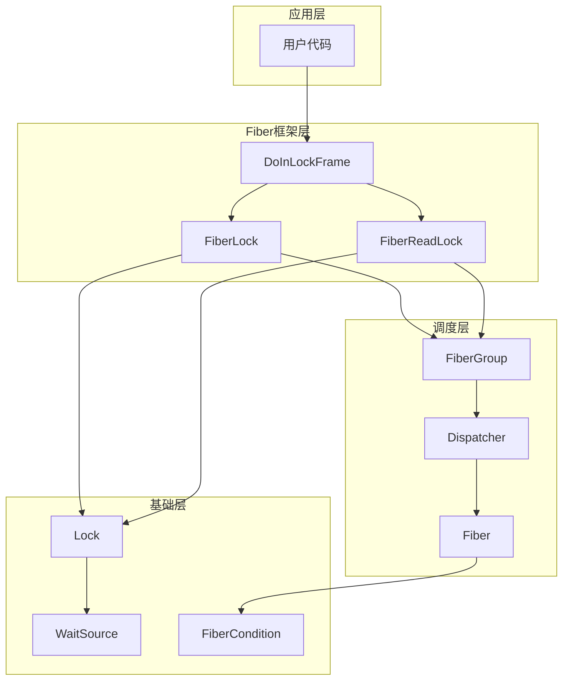

# Fiber锁

<cite>
**本文档引用的文件**
- [FiberLock.java](file://server/src/main/java/com/github/dtprj/dongting/fiber/FiberLock.java)
- [Lock.java](file://server/src/main/java/com/github/dtprj/dongting/fiber/Lock.java)
- [FiberReadLock.java](file://server/src/main/java/com/github/dtprj/dongting/fiber/FiberReadLock.java)
- [Dispatcher.java](file://server/src/main/java/com/github/dtprj/dongting/fiber/Dispatcher.java)
- [FiberGroup.java](file://server/src/main/java/com/github/dtprj/dongting/fiber/FiberGroup.java)
- [Fiber.java](file://server/src/main/java/com/github/dtprj/dongting/fiber/Fiber.java)
- [FiberCondition.java](file://server/src/main/java/com/github/dtprj/dongting/fiber/FiberCondition.java)
- [DoInLockFrame.java](file://server/src/main/java/com/github/dtprj/dongting/fiber/DoInLockFrame.java)
- [LockTest.java](file://server/src/test/java/com/github/dtprj/dongting/fiber/LockTest.java)
</cite>

## 目录
1. [简介](#简介)
2. [项目结构](#项目结构)
3. [核心组件](#核心组件)
4. [架构概览](#架构概览)
5. [详细组件分析](#详细组件分析)
6. [依赖关系分析](#依赖关系分析)
7. [性能考虑](#性能考虑)
8. [故障排除指南](#故障排除指南)
9. [结论](#结论)

## 简介

FiberLock是Dongting项目中的一个可重入互斥锁实现，专为Fiber协程环境设计。它提供了高效的锁机制，在协程调度器的协调下实现线程安全的临界区保护。FiberLock支持可重入特性，允许同一个协程多次获取同一把锁，并通过FiberGroup与Dispatcher调度器紧密集成，确保在协程环境中正确处理锁竞争和等待队列。

该锁机制的核心特点包括：
- **可重入性**：同一个协程可以多次获取同一把锁
- **协程安全**：与Fiber调度器深度集成，支持协程间的同步
- **高效等待**：利用Fiber的非阻塞特性实现高效的锁等待
- **读写分离**：支持读锁和写锁的组合使用

## 项目结构

FiberLock相关的核心文件组织如下：



**图表来源**
- [FiberLock.java](file://server/src/main/java/com/github/dtprj/dongting/fiber/FiberLock.java#L1-L116)
- [Lock.java](file://server/src/main/java/com/github/dtprj/dongting/fiber/Lock.java#L1-L39)
- [FiberReadLock.java](file://server/src/main/java/com/github/dtprj/dongting/fiber/FiberReadLock.java#L1-L94)

## 核心组件

### FiberLock类

FiberLock是可重入互斥锁的核心实现，继承自Lock抽象类，具有以下关键字段：

- **owner**: 当前持有锁的Fiber实例
- **heldCount**: 当前Fiber持有的锁计数
- **readLock**: 关联的读锁对象，用于读写分离

### FiberReadLock类

FiberReadLock实现了读锁功能，允许多个读者同时访问资源：

- **heldCount**: 当前持有的读锁计数
- **writeLock**: 指向关联的写锁对象

### Dispatcher调度器

Dispatcher负责协程的调度和锁的等待队列管理，是整个锁机制的核心协调者。

**章节来源**
- [FiberLock.java](file://server/src/main/java/com/github/dtprj/dongting/fiber/FiberLock.java#L25-L35)
- [FiberReadLock.java](file://server/src/main/java/com/github/dtprj/dongting/fiber/FiberReadLock.java#L25-L30)
- [Dispatcher.java](file://server/src/main/java/com/github/dtprj/dongting/fiber/Dispatcher.java#L1-L50)

## 架构概览

FiberLock的整体架构基于协程调度器的事件驱动模型：



**图表来源**
- [FiberLock.java](file://server/src/main/java/com/github/dtprj/dongting/fiber/FiberLock.java#L55-L70)
- [Dispatcher.java](file://server/src/main/java/com/github/dtprj/dongting/fiber/Dispatcher.java#L1-L100)

## 详细组件分析

### FiberLock核心方法分析

#### lock()方法



**图表来源**
- [FiberLock.java](file://server/src/main/java/com/github/dtprj/dongting/fiber/FiberLock.java#L55-L70)

lock()方法的实现展示了FiberLock的协程安全特性：

1. **获取当前Fiber**：通过`Dispatcher.getCurrentFiberAndCheck()`确保在正确的FiberGroup中
2. **检查等待条件**：调用`shouldWait()`判断是否需要等待
3. **立即获取**：如果锁可用，直接更新所有者和计数
4. **协程等待**：如果锁被占用，调用`Dispatcher.awaitOn()`将协程挂起并加入等待队列

#### tryLock()方法

tryLock()方法提供了非阻塞的锁获取机制：

```java
@Override
public FrameCallResult tryLock(long millis, FrameCall<Boolean> resumePoint) {
    DtUtil.checkPositive(millis, "millis");
    Fiber fiber = Dispatcher.getCurrentFiberAndCheck(group);
    if (shouldWait(fiber)) {
        return Dispatcher.awaitOn(fiber, this, TimeUnit.MILLISECONDS.toNanos(millis), resumePoint);
    } else {
        updateOwnerAndHeldCount(fiber);
        return Fiber.resume(Boolean.TRUE, resumePoint);
    }
}
```

这个方法支持超时机制，允许协程在指定时间内尝试获取锁。

#### unlock()方法



**图表来源**
- [FiberLock.java](file://server/src/main/java/com/github/dtprj/dongting/fiber/FiberLock.java#L95-L110)

unlock()方法的实现确保了锁的正确释放：

1. **所有权检查**：验证调用者是否为锁的所有者
2. **计数递减**：减少持有的锁计数
3. **完全释放**：当计数为零时，清除所有者状态并通知等待的协程

### FiberReadLock分析

FiberReadLock实现了读写分离的锁机制：



**图表来源**
- [FiberReadLock.java](file://server/src/main/java/com/github/dtprj/dongting/fiber/FiberReadLock.java#L25-L94)
- [FiberLock.java](file://server/src/main/java/com/github/dtprj/dongting/fiber/FiberLock.java#L25-L116)

FiberReadLock的关键特性：

1. **多读者支持**：多个读锁可以同时持有
2. **写者独占**：写锁会阻止所有读锁和写锁
3. **无死锁**：读锁不会阻塞其他读锁

### DoInLockFrame使用模式

DoInLockFrame提供了一种优雅的锁使用模式：

```java
public abstract class DoInLockFrame<O> extends FiberFrame<O> {
    private final Lock lock;
    private boolean locked;

    @Override
    public final FrameCallResult execute(Void input) throws Exception {
        return lock.lock(this::resume);
    }

    private FrameCallResult resume(Void unused) {
        this.locked = true;
        return afterGetLock();
    }

    @Override
    protected final FrameCallResult doFinally() {
        if (locked) {
            lock.unlock();
        }
        locked = false;
        doFinallyAfterTryReleaseLock();
        return Fiber.frameReturn();
    }
}
```

这种模式确保了即使在异常情况下也能正确释放锁。

**章节来源**
- [FiberLock.java](file://server/src/main/java/com/github/dtprj/dongting/fiber/FiberLock.java#L55-L116)
- [FiberReadLock.java](file://server/src/main/java/com/github/dtprj/dongting/fiber/FiberReadLock.java#L45-L94)
- [DoInLockFrame.java](file://server/src/main/java/com/github/dtprj/dongting/fiber/DoInLockFrame.java#L1-L54)

## 依赖关系分析

FiberLock系统的依赖关系图：



**图表来源**
- [FiberLock.java](file://server/src/main/java/com/github/dtprj/dongting/fiber/FiberLock.java#L1-L20)
- [Dispatcher.java](file://server/src/main/java/com/github/dtprj/dongting/fiber/Dispatcher.java#L1-L50)
- [FiberGroup.java](file://server/src/main/java/com/github/dtprj/dongting/fiber/FiberGroup.java#L1-L50)

关键依赖关系：

1. **FiberLock → FiberGroup**：每个锁都属于一个FiberGroup
2. **FiberGroup → Dispatcher**：FiberGroup由Dispatcher管理
3. **Lock → WaitSource**：所有锁都继承自WaitSource，支持等待和信号机制
4. **DoInLockFrame → FiberLock**：提供统一的锁使用模式

**章节来源**
- [FiberLock.java](file://server/src/main/java/com/github/dtprj/dongting/fiber/FiberLock.java#L1-L116)
- [FiberGroup.java](file://server/src/main/java/com/github/dtprj/dongting/fiber/FiberGroup.java#L1-L100)
- [Dispatcher.java](file://server/src/main/java/com/github/dtprj/dongting/fiber/Dispatcher.java#L1-L100)

## 性能考虑

### 锁竞争处理

FiberLock通过以下机制优化性能：

1. **本地检查优先**：在尝试获取锁之前先进行本地检查
2. **协程挂起**：使用协程的非阻塞特性避免CPU浪费
3. **批量处理**：Dispatcher可以批量处理多个等待的协程

### 内存优化

1. **对象池化**：Fiber和锁对象使用对象池减少GC压力
2. **紧凑数据结构**：使用简单的字段存储锁状态
3. **延迟初始化**：读锁等组件按需创建

### 并发性能

1. **读写分离**：读锁允许多个并发读取
2. **细粒度锁**：每个资源可以有自己的独立锁
3. **无自旋等待**：避免忙等待导致的CPU浪费

## 故障排除指南

### 常见问题及解决方案

#### 死锁检测

```java
// 检查锁持有情况
public boolean isHeldByCurrentFiber() {
    return owner == Dispatcher.getCurrentFiberAndCheck(group);
}
```

#### 锁泄漏排查

1. **检查finally块**：确保所有锁操作都在finally块中释放
2. **使用DoInLockFrame**：推荐使用提供的框架类
3. **监控锁持有时间**：记录锁获取和释放的时间差

#### 性能问题诊断

1. **等待队列长度**：监控等待队列的平均长度
2. **锁竞争频率**：统计频繁竞争的锁
3. **协程切换开销**：测量协程挂起和恢复的开销

**章节来源**
- [FiberLock.java](file://server/src/main/java/com/github/dtprj/dongting/fiber/FiberLock.java#L85-L90)
- [DoInLockFrame.java](file://server/src/main/java/com/github/dtprj/dongting/fiber/DoInLockFrame.java#L25-L54)

## 结论

FiberLock是一个设计精良的协程安全锁实现，具有以下优势：

1. **高性能**：充分利用协程的非阻塞特性，避免传统锁的阻塞开销
2. **易用性**：提供简洁的API和优雅的使用模式
3. **可靠性**：通过严格的类型检查和异常处理确保安全性
4. **扩展性**：支持读写分离和多种锁获取策略

在Fiber协程环境中，FiberLock提供了比传统互斥锁更高效的同步机制，特别适合高并发的网络服务场景。通过合理使用FiberLock，开发者可以在保持代码简洁的同时获得卓越的性能表现。