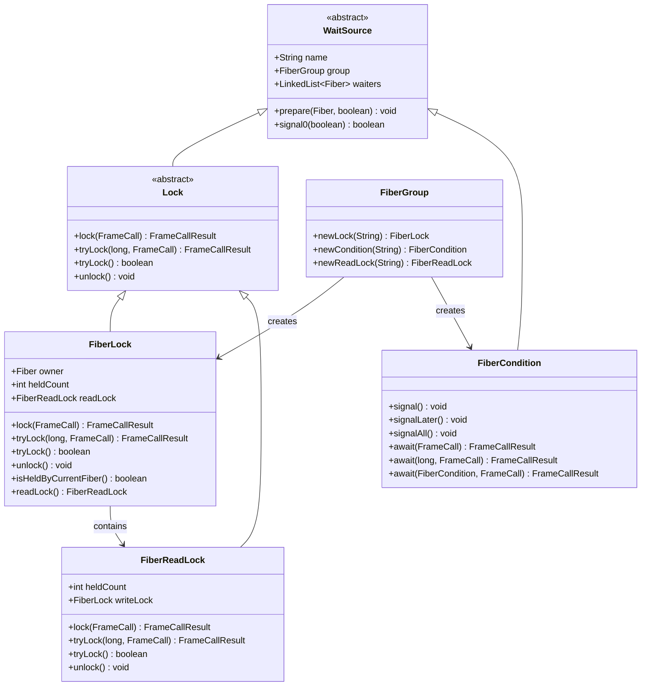
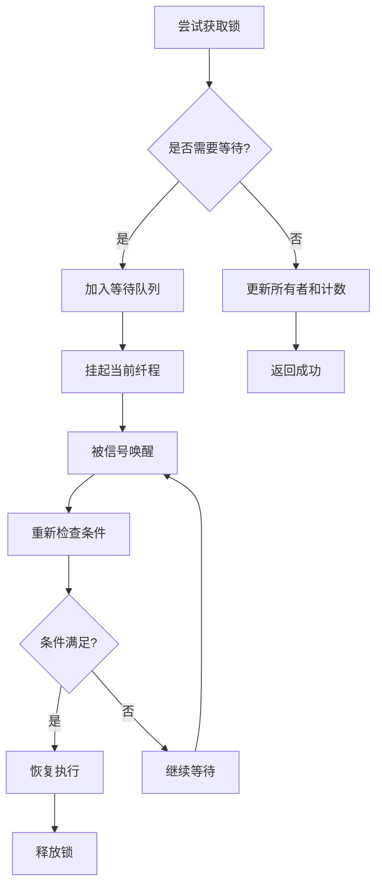
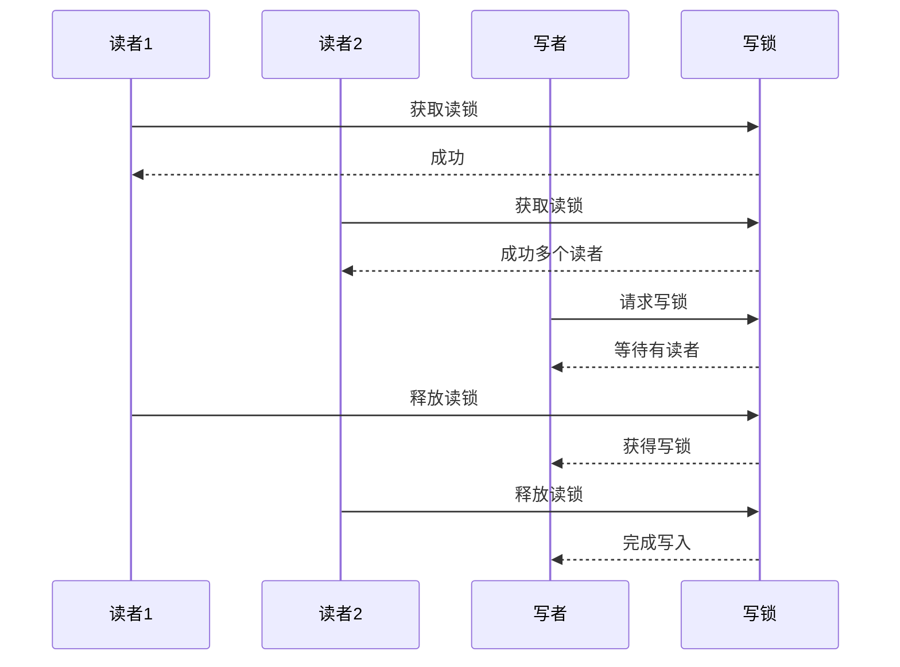
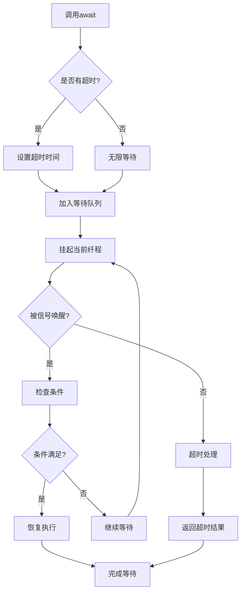

# Fiber同步原语

<cite>
**本文档引用的文件**
- [FiberLock.java](file://server/src/main/java/com/github/dtprj/dongting/fiber/FiberLock.java)
- [FiberReadLock.java](file://server/src/main/java/com/github/dtprj/dongting/fiber/FiberReadLock.java)
- [FiberCondition.java](file://server/src/main/java/com/github/dtprj/dongting/fiber/FiberCondition.java)
- [Lock.java](file://server/src/main/java/com/github/dtprj/dongting/fiber/Lock.java)
- [WaitSource.java](file://server/src/main/java/com/github/dtprj/dongting/fiber/WaitSource.java)
- [Dispatcher.java](file://server/src/main/java/com/github/dtprj/dongting/fiber/Dispatcher.java)
- [FiberGroup.java](file://server/src/main/java/com/github/dtprj/dongting/fiber/FiberGroup.java)
- [LockTest.java](file://server/src/test/java/com/github/dtprj/dongting/fiber/LockTest.java)
- [ConditionTest.java](file://server/src/test/java/com/github/dtprj/dongting/fiber/ConditionTest.java)
</cite>

## 目录
1. [简介](#简介)
2. [核心架构](#核心架构)
3. [FiberLock可重入锁](#fiberlock可重入锁)
4. [FiberReadLock读写锁](#fiberreadlock读写锁)
5. [FiberCondition条件变量](#fibercondition条件变量)
6. [同步原语组合使用](#同步原语组合使用)
7. [最佳实践](#最佳实践)
8. [故障排除](#故障排除)
9. [总结](#总结)

## 简介

Dongting框架中的Fiber同步原语为协程提供了强大的并发控制能力。这些原语包括可重入锁(FiberLock)、读写锁(FiberReadLock)和条件变量(FiberCondition)，它们都基于纤程(Fiber)的非阻塞设计模式，避免了传统线程锁的阻塞问题。

这些同步原语的核心特点：
- **非阻塞设计**：所有操作都是异步的，不会阻塞线程
- **可重入性**：同一个纤程可以多次获取同一把锁
- **超时支持**：所有锁定操作都支持超时机制
- **条件等待**：支持基于条件变量的等待和通知机制
- **组合使用**：可以灵活组合多种同步原语构建复杂并发逻辑

## 核心架构



**图表来源**
- [WaitSource.java](file://server/src/main/java/com/github/dtprj/dongting/fiber/WaitSource.java#L25-L46)
- [Lock.java](file://server/src/main/java/com/github/dtprj/dongting/fiber/Lock.java#L18-L37)
- [FiberLock.java](file://server/src/main/java/com/github/dtprj/dongting/fiber/FiberLock.java#L24-L115)
- [FiberReadLock.java](file://server/src/main/java/com/github/dtprj/dongting/fiber/FiberReadLock.java#L24-L92)
- [FiberCondition.java](file://server/src/main/java/com/github/dtprj/dongting/fiber/FiberCondition.java#L22-L97)

**章节来源**
- [WaitSource.java](file://server/src/main/java/com/github/dtprj/dongting/fiber/WaitSource.java#L1-L46)
- [Lock.java](file://server/src/main/java/com/github/dtprj/dongting/fiber/Lock.java#L1-L37)
- [FiberGroup.java](file://server/src/main/java/com/github/dtprj/dongting/fiber/FiberGroup.java#L120-L140)

## FiberLock可重入锁

### 设计原理

FiberLock是一个可重入的独占锁，它允许同一个纤程多次获取锁而不会发生死锁。当纤程第一次获取锁时，会记录当前纤程为锁的所有者，并增加持有计数。后续的获取操作会直接增加计数而不进行等待。

### 核心特性



**图表来源**
- [FiberLock.java](file://server/src/main/java/com/github/dtprj/dongting/fiber/FiberLock.java#L50-L71)

### 主要方法

#### lock() - 阻塞式锁定
```java
// 阻塞直到获得锁
return lock.lock(v -> resume(true));

// 实现原理
@Override
public FrameCallResult lock(FrameCall<Void> resumePoint) {
    Fiber fiber = Dispatcher.getCurrentFiberAndCheck(group);
    if (shouldWait(fiber)) {
        return Dispatcher.awaitOn(fiber, this, -1, resumePoint);
    } else {
        updateOwnerAndHeldCount(fiber);
        return Fiber.resume(null, resumePoint);
    }
}
```

#### tryLock() - 尝试锁定
```java
// 非阻塞尝试获取锁
return lock.tryLock(100000, this::resume);

// 实现原理
@Override
public FrameCallResult tryLock(long millis, FrameCall<Boolean> resumePoint) {
    DtUtil.checkPositive(millis, "millis");
    Fiber fiber = Dispatcher.getCurrentFiberAndCheck(group);
    if (shouldWait(fiber)) {
        return Dispatcher.awaitOn(fiber, this, TimeUnit.MILLISECONDS.toNanos(millis), resumePoint);
    } else {
        updateOwnerAndHeldCount(fiber);
        return Fiber.resume(Boolean.TRUE, resumePoint);
    }
}
```

#### unlock() - 释放锁
```java
@Override
public void unlock() {
    Fiber fiber = Dispatcher.getCurrentFiberAndCheck(group);
    if (fiber == owner) {
        heldCount--;
        if (heldCount <= 0) {
            owner = null;
            if (!signal0(true)) {
                readLock.signalAll0(true);
            }
        }
    } else {
        throw new FiberException("not owner");
    }
}
```

### 锁竞争处理

FiberLock通过以下机制处理锁竞争：

1. **所有者跟踪**：维护当前锁的所有者纤程
2. **持有计数**：记录同一个纤程重复获取锁的次数
3. **等待队列**：使用FIFO队列管理等待获取锁的纤程
4. **信号传播**：解锁后自动唤醒下一个等待的纤程

**章节来源**
- [FiberLock.java](file://server/src/main/java/com/github/dtprj/dongting/fiber/FiberLock.java#L50-L115)
- [LockTest.java](file://server/src/test/java/com/github/dtprj/dongting/fiber/LockTest.java#L93-L127)

## FiberReadLock读写锁

### 设计理念

FiberReadLock实现了读写锁的分离，允许多个读者同时持有读锁，但写锁具有排他性。这种设计特别适合读多写少的场景。

### 读写锁机制



**图表来源**
- [FiberReadLock.java](file://server/src/main/java/com/github/dtprj/dongting/fiber/FiberReadLock.java#L34-L47)

### 核心实现

#### 读锁获取逻辑
```java
private boolean shouldWait(Fiber currentFiber) {
    return writeLock.owner != null && writeLock.owner != currentFiber;
}

@Override
public FrameCallResult lock(FrameCall<Void> resumePoint) {
    Fiber fiber = Dispatcher.getCurrentFiberAndCheck(group);
    if (shouldWait(fiber)) {
        return Dispatcher.awaitOn(fiber, this, -1, resumePoint);
    } else {
        heldCount++;
        return Fiber.resume(null, resumePoint);
    }
}
```

#### 读锁释放逻辑
```java
@Override
public void unlock() {
    Dispatcher.getCurrentFiberAndCheck(group);
    heldCount--;
    if (heldCount <= 0) {
        writeLock.signal0(true);
    }
}
```

### 使用场景

1. **数据缓存**：多个线程同时读取缓存数据
2. **配置管理**：频繁读取配置信息，偶尔更新
3. **统计系统**：大量只读访问，少量写入操作
4. **日志系统**：多数时间是读取日志状态，少数时间写入新日志

**章节来源**
- [FiberReadLock.java](file://server/src/main/java/com/github/dtprj/dongting/fiber/FiberReadLock.java#L34-L92)
- [LockTest.java](file://server/src/test/java/com/github/dtprj/dongting/fiber/LockTest.java#L42-L61)

## FiberCondition条件变量

### 条件等待机制

FiberCondition提供了基于条件变量的等待和通知机制，支持单条件等待、多条件等待和超时等待。

### 核心功能



**图表来源**
- [FiberCondition.java](file://server/src/main/java/com/github/dtprj/dongting/fiber/FiberCondition.java#L55-L97)

### 主要方法

#### 单条件等待
```java
// 基本等待
public FrameCallResult await(FrameCall<Void> resumePoint) {
    return Dispatcher.awaitOn(this, -1, resumePoint);
}

// 带超时的等待
public FrameCallResult await(long millis, FrameCall<Void> resumePoint) {
    return Dispatcher.awaitOn(this, TimeUnit.MILLISECONDS.toNanos(millis), resumePoint);
}
```

#### 多条件等待
```java
// 等待两个条件
public FrameCallResult await(FiberCondition another, FrameCall<Void> resumePoint) {
    return await(-1, another, resumePoint);
}

// 等待两个条件并带超时
public FrameCallResult await(long millis, FiberCondition another, FrameCall<Void> resumePoint) {
    if (another == this) {
        throw new IllegalArgumentException("same condition");
    }
    if (another.group != this.group) {
        throw new IllegalArgumentException("not in same group");
    }
    return Dispatcher.awaitOn(new FiberCondition[]{this, another}, 
                             TimeUnit.MILLISECONDS.toNanos(millis), resumePoint);
}
```

#### 信号通知
```java
// 通知一个等待的纤程
public void signal() {
    Dispatcher.getCurrentFiberAndCheck(group);
    signal0(true);
}

// 通知所有等待的纤程
public void signalAll() {
    Dispatcher.getCurrentFiberAndCheck(group);
    signalAll0(true);
}

// 延迟通知（不立即唤醒）
public void signalLater() {
    Dispatcher.getCurrentFiberAndCheck(group);
    signal0(false);
}
```

### 条件等待的实现细节

#### 等待准备
```java
@Override
protected void prepare(Fiber waitFiber, boolean timeout) {
    FiberCondition[] cs = waitFiber.sourceConditions;
    if (cs != null) {
        for (FiberCondition c : cs) {
            if (c != this) {
                c.waiters.remove(waitFiber);
            }
        }
    }
    waitFiber.source = null;
    waitFiber.sourceConditions = null;
}
```

#### 多条件协调
当等待多个条件时，FiberCondition会自动清理其他条件的等待状态，确保只有一个条件能够唤醒纤程。

**章节来源**
- [FiberCondition.java](file://server/src/main/java/com/github/dtprj/dongting/fiber/FiberCondition.java#L22-L97)
- [ConditionTest.java](file://server/src/test/java/com/github/dtprj/dongting/fiber/ConditionTest.java#L60-L97)

## 同步原语组合使用

### 经典生产者-消费者模式

```java
// 创建共享资源
FiberLock lock = fiberGroup.newLock("shared");
FiberCondition notEmpty = fiberGroup.newCondition("notEmpty");
FiberCondition notFull = fiberGroup.newCondition("notFull");

// 生产者
Fiber producer = new Fiber("producer", fiberGroup, new FiberFrame<>() {
    @Override
    public FrameCallResult execute(Void input) {
        return lock.lock(v -> produce());
    }
    
    private FrameCallResult produce() {
        // 检查缓冲区是否已满
        while (buffer.isFull()) {
            return notFull.await(this::produce);
        }
        
        // 生产数据
        buffer.produce(data);
        // 通知消费者
        notEmpty.signal();
        return lock.unlock();
    }
});

// 消费者
Fiber consumer = new Fiber("consumer", fiberGroup, new FiberFrame<>() {
    @Override
    public FrameCallResult execute(Void input) {
        return lock.lock(v -> consume());
    }
    
    private FrameCallResult consume() {
        // 检查缓冲区是否为空
        while (buffer.isEmpty()) {
            return notEmpty.await(this::consume);
        }
        
        // 消费数据
        Object item = buffer.consume();
        // 通知生产者
        notFull.signal();
        return lock.unlock();
    }
});
```

### 读写者模式

```java
// 共享数据结构
FiberLock dataLock = fiberGroup.newLock("data");
FiberReadLock readerLock = dataLock.readLock();
FiberCondition dataUpdated = fiberGroup.newCondition("dataUpdated");

// 读者
Fiber reader = new Fiber("reader", fiberGroup, new FiberFrame<>() {
    @Override
    public FrameCallResult execute(Void input) {
        return readerLock.lock(v -> readData());
    }
    
    private FrameCallResult readData() {
        // 读取数据
        Object data = sharedData.getData();
        // 可以同时有多个读者
        return readerLock.unlock();
    }
});

// 写者
Fiber writer = new Fiber("writer", fiberGroup, new FiberFrame<>() {
    @Override
    public FrameCallResult execute(Void input) {
        return dataLock.lock(v -> updateData());
    }
    
    private FrameCallResult updateData() {
        // 更新数据
        sharedData.update(newData);
        // 通知所有等待的读者
        dataUpdated.signalAll();
        return dataLock.unlock();
    }
});
```

### 多条件协调

```java
// 多个条件变量
FiberCondition cond1 = fiberGroup.newCondition("cond1");
FiberCondition cond2 = fiberGroup.newCondition("cond2");
FiberCondition cond3 = fiberGroup.newCondition("cond3");

// 协调多个条件的等待
Fiber coordinator = new Fiber("coordinator", fiberGroup, new FiberFrame<>() {
    @Override
    public FrameCallResult execute(Void input) {
        return cond1.await(cond2, this::step2);
    }
    
    private FrameCallResult step2(Void v) {
        // cond1 和 cond2 都已满足
        return cond3.await(vv -> cond1.await(cond2, this::step3));
    }
    
    private FrameCallResult step3(Void v) {
        // 所有条件都满足，执行最终操作
        return Fiber.frameReturn();
    }
});
```

## 最佳实践

### 锁使用原则

1. **最小化锁范围**
```java
// 好的做法：只在必要时获取锁
public void processData() {
    // 不需要锁的操作
    preProcess();
    
    // 只在修改共享数据时获取锁
    return lock.lock(v -> {
        sharedData.update(processedData);
        return lock.unlock();
    });
}

// 避免的做法：长时间持有锁
public void processData() {
    return lock.lock(v -> {
        // 进行耗时操作
        heavyProcessing();
        sharedData.update(processedData);
        return lock.unlock();
    });
}
```

2. **避免嵌套锁**
```java
// 使用tryLock避免死锁
public void safeOperation() {
    return lock1.tryLock(1000, result -> {
        if (result) {
            // 成功获取第一个锁
            return lock2.tryLock(1000, result2 -> {
                if (result2) {
                    // 成功获取第二个锁
                    return performOperation();
                } else {
                    // 无法获取第二个锁，先释放第一个
                    return lock1.unlock().andThen(() -> Fiber.frameReturn());
                }
            });
        } else {
            // 无法获取第一个锁
            return Fiber.frameReturn();
        }
    });
}
```

### 条件变量使用

1. **正确检查条件**
```java
// 使用while循环而不是if判断
public FrameCallResult waitForCondition() {
    return condition.await(this::checkCondition);
}

private FrameCallResult checkCondition(Void v) {
    // 使用while确保条件真正满足
    while (!expectedCondition()) {
        return condition.await(this::checkCondition);
    }
    return Fiber.frameReturn();
}
```

2. **及时清理资源**
```java
// 在finally块中清理资源
public FrameCallResult safeOperation() {
    return lock.lock(v -> {
        try {
            // 执行操作
            return performOperation();
        } finally {
            // 确保锁被释放
            lock.unlock();
        }
    });
}
```

### 性能优化建议

1. **选择合适的锁类型**
   - 读多写少：使用读写锁
   - 写多读少：使用普通锁
   - 无竞争：考虑使用无锁算法

2. **减少等待时间**
   - 设置合理的超时时间
   - 使用tryLock进行快速失败
   - 考虑使用信号而非等待

3. **批量操作**
```java
// 批量处理数据以减少锁竞争
public FrameCallResult batchProcess(List<Item> items) {
    return lock.lock(v -> {
        // 一次性处理多个项目
        for (Item item : items) {
            processItem(item);
        }
        return lock.unlock();
    });
}
```

## 故障排除

### 常见问题及解决方案

#### 死锁检测

```java
// 检测死锁的工具方法
public boolean detectDeadlock() {
    // 检查锁持有情况
    for (Fiber fiber : fibers) {
        if (fiber.source instanceof FiberLock) {
            FiberLock lock = (FiberLock) fiber.source;
            if (lock.owner != fiber) {
                // 可能存在死锁
                return true;
            }
        }
    }
    return false;
}
```

#### 锁泄漏排查

```java
// 监控锁持有情况
public void monitorLockUsage() {
    fiberGroup.fireFiber("monitor", new FiberFrame<>() {
        @Override
        public FrameCallResult execute(Void input) {
            while (!shouldStop()) {
                logLockStatus();
                return Fiber.sleep(1000, this::execute);
            }
            return Fiber.frameReturn();
        }
        
        private void logLockStatus() {
            // 记录每个锁的持有情况
            for (FiberLock lock : locks) {
                if (lock.owner != null) {
                    log.info("Lock {} held by fiber {}", 
                           lock.name, lock.owner.name);
                }
            }
        }
    });
}
```

#### 条件等待超时

```java
// 处理条件等待超时
public FrameCallResult safeAwait(FiberCondition condition, long timeoutMs) {
    return condition.await(timeoutMs, result -> {
        if (result == Boolean.FALSE) {
            // 超时处理
            handleTimeout();
        } else {
            // 条件满足
            handleConditionMet();
        }
        return Fiber.frameReturn();
    });
}
```

### 调试技巧

1. **启用详细日志**
```java
// 在FiberGroup中启用调试信息
fiberGroup.fireLogGroupInfo("Debug information");
```

2. **监控等待队列**
```java
// 检查等待队列长度
public int getWaitingCount(WaitSource source) {
    return source.waiters != null ? source.waiters.size() : 0;
}
```

3. **追踪锁持有者**
```java
// 获取锁的持有者信息
public String getLockOwnerInfo(FiberLock lock) {
    return lock.owner != null ? 
        "Owner: " + lock.owner.name + ", Held count: " + lock.heldCount : 
        "No owner";
}
```

**章节来源**
- [Dispatcher.java](file://server/src/main/java/com/github/dtprj/dongting/fiber/Dispatcher.java#L543-L582)
- [ConditionTest.java](file://server/src/test/java/com/github/dtprj/dongting/fiber/ConditionTest.java#L136-L167)

## 总结

Dongting的Fiber同步原语为协程编程提供了强大而灵活的并发控制能力。通过合理使用FiberLock、FiberReadLock和FiberCondition，开发者可以构建高效、可靠的并发应用程序。

### 关键要点

1. **非阻塞设计**：所有同步原语都基于纤程的非阻塞特性，避免了传统线程锁的阻塞开销
2. **可重入性**：FiberLock支持同一个纤程多次获取锁，简化了复杂的并发逻辑
3. **读写分离**：FiberReadLock提供了高效的读写分离机制，适合读多写少的场景
4. **条件协调**：FiberCondition支持单条件和多条件等待，可以构建复杂的同步协议
5. **超时支持**：所有操作都支持超时机制，提高了系统的健壮性

### 适用场景

- **高并发服务器**：利用纤程的轻量级特性处理大量并发连接
- **数据流处理**：使用条件变量协调不同阶段的数据处理
- **分布式系统**：在分布式环境中实现高效的锁和条件等待
- **实时系统**：利用超时机制保证系统的实时响应

通过深入理解和正确使用这些同步原语，开发者可以充分发挥Dongting框架的并发优势，构建出高性能、高可靠性的应用程序。