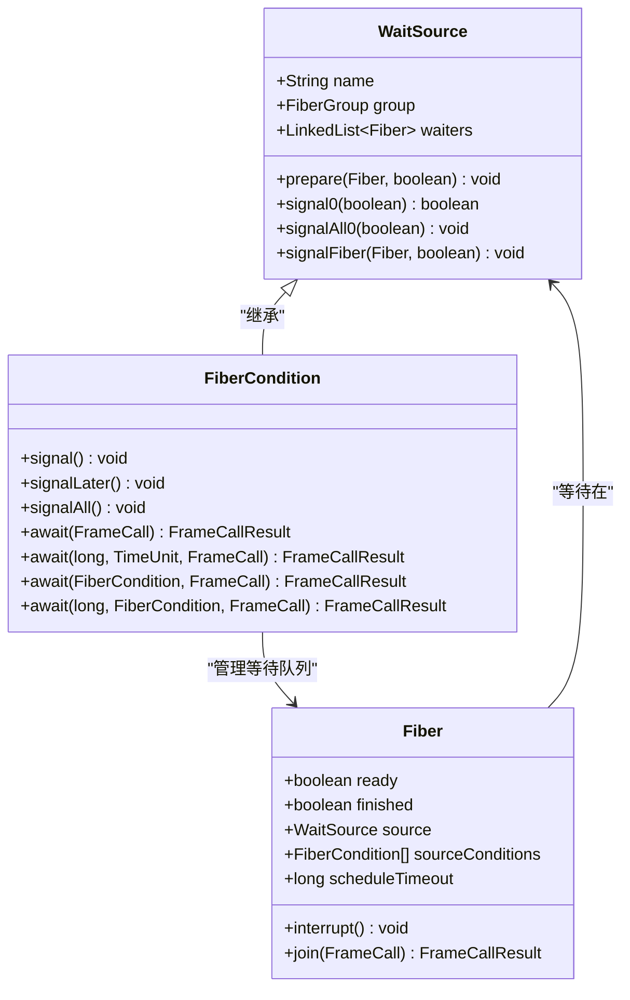
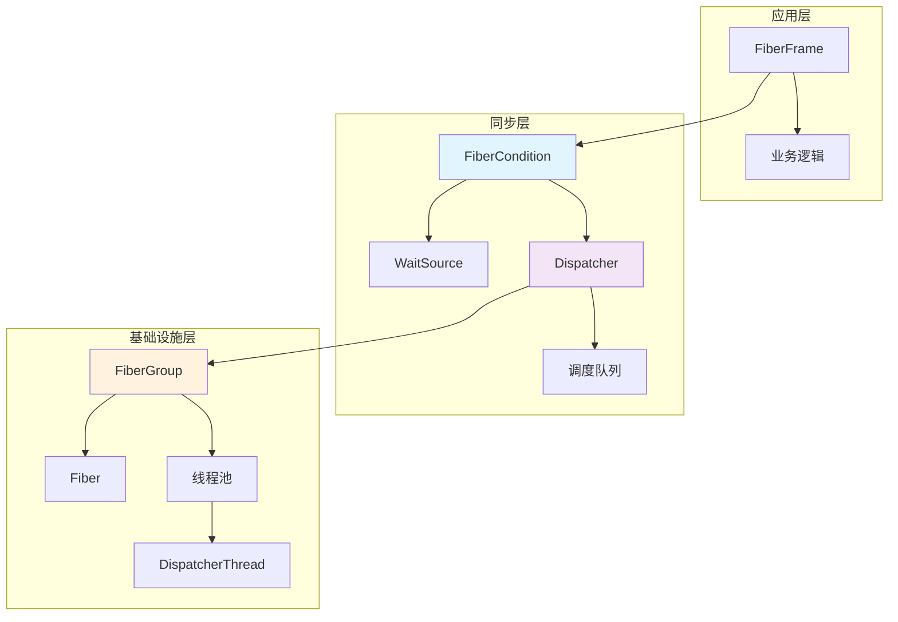
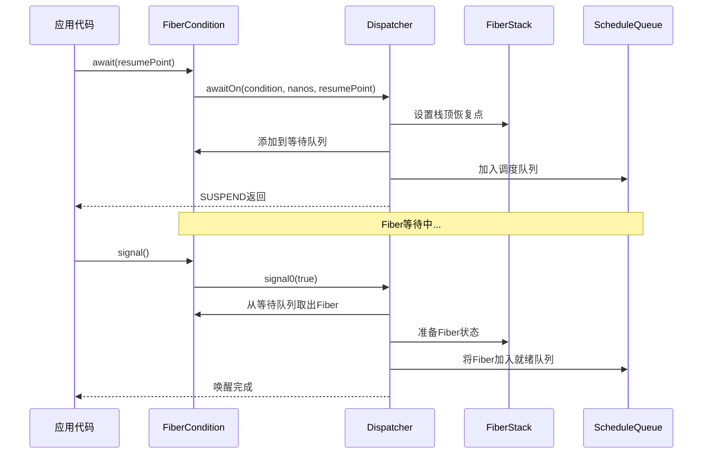
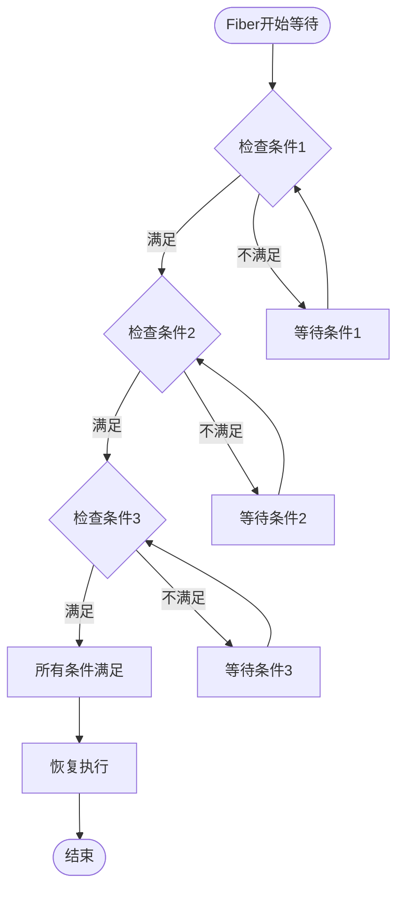
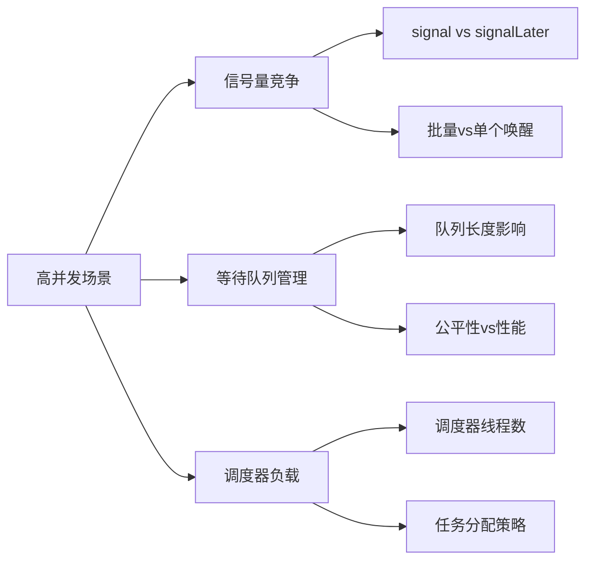

# 条件变量

<cite>
**本文档中引用的文件**
- [FiberCondition.java](file://server/src/main/java/com/github/dtprj/dongting/fiber/FiberCondition.java)
- [WaitSource.java](file://server/src/main/java/com/github/dtprj/dongting/fiber/WaitSource.java)
- [Dispatcher.java](file://server/src/main/java/com/github/dtprj/dongting/fiber/Dispatcher.java)
- [Fiber.java](file://server/src/main/java/com/github/dtprj/dongting/fiber/Fiber.java)
- [ConditionTest.java](file://server/src/test/java/com/github/dtprj/dongting/fiber/ConditionTest.java)
- [CallTest.java](file://server/src/test/java/com/github/dtprj/dongting/fiber/CallTest.java)
</cite>

## 目录
1. [简介](#简介)
2. [核心概念](#核心概念)
3. [架构概览](#架构概览)
4. [详细组件分析](#详细组件分析)
5. [核心方法详解](#核心方法详解)
6. [高级特性](#高级特性)
7. [使用模式](#使用模式)
8. [编程规范](#编程规范)
9. [性能考虑](#性能考虑)
10. [故障排除指南](#故障排除指南)
11. [总结](#总结)

## 简介

FiberCondition是Dongting框架中用于Fiber协程同步的核心组件，它实现了类似于传统操作系统条件变量的功能，但专为无锁异步编程模型设计。条件变量允许协程在特定条件满足之前进入等待状态，并在条件改变时被唤醒继续执行。

与传统的基于锁的条件变量不同，FiberCondition完全基于事件驱动的异步模型，不需要持有任何锁即可安全地进行等待和通知操作。这种设计使得条件变量能够高效地与其他Fiber组件协同工作，特别是在高并发场景下表现出色。

## 核心概念

### 条件变量的基本组成

FiberCondition继承自WaitSource抽象类，具有以下核心属性：

- **名称标识**：每个条件变量都有唯一的名称，便于调试和监控
- **所属组**：所有条件变量都属于特定的FiberGroup，确保线程安全性
- **等待队列**：维护一个Fiber的链表，存储正在等待该条件的所有协程
- **调度器集成**：与Dispatcher紧密协作，实现高效的等待和唤醒机制

### 等待源机制

WaitSource作为抽象基类，定义了条件变量的核心行为：



**图表来源**
- [WaitSource.java](file://server/src/main/java/com/github/dtprj/dongting/fiber/WaitSource.java#L25-L77)
- [FiberCondition.java](file://server/src/main/java/com/github/dtprj/dongting/fiber/FiberCondition.java#L25-L98)

## 架构概览

### 整体架构设计

FiberCondition的架构基于分层设计，从底层到上层依次为：



**图表来源**
- [FiberCondition.java](file://server/src/main/java/com/github/dtprj/dongting/fiber/FiberCondition.java#L25-L30)
- [Dispatcher.java](file://server/src/main/java/com/github/dtprj/dongting/fiber/Dispatcher.java#L442-L471)

### 协作关系图

条件变量与各个组件的协作关系如下：



**图表来源**
- [Dispatcher.java](file://server/src/main/java/com/github/dtprj/dongting/fiber/Dispatcher.java#L442-L471)
- [FiberCondition.java](file://server/src/main/java/com/github/dtprj/dongting/fiber/FiberCondition.java#L50-L55)

## 详细组件分析

### FiberCondition类结构

FiberCondition类提供了完整的条件变量功能，其核心实现包含以下关键部分：

#### 私有构造函数

```java
FiberCondition(String name, FiberGroup group) {
    super(name, group);
}
```

这个私有构造函数确保了条件变量只能通过FiberGroup创建，保证了线程安全性。

#### 状态准备机制

```java
@Override
protected void prepare(Fiber waitFiber, boolean timeout) {
    FiberCondition[] cs = waitFiber.sourceConditions;
    if (cs != null) {
        for (FiberCondition c : cs) {
            if (c != this) {
                c.waiters.remove(waitFiber);
            }
        }
    }
    waitFiber.source = null;
    waitFiber.sourceConditions = null;
}
```

当Fiber被唤醒时，此方法负责清理等待状态，移除不必要的条件引用，确保资源正确释放。

**章节来源**
- [FiberCondition.java](file://server/src/main/java/com/github/dtprj/dongting/fiber/FiberCondition.java#L25-L45)

### WaitSource基础类

WaitSource提供了条件变量的核心信号机制：

#### 单个信号机制

```java
boolean signal0(boolean addFirst) {
    if (group.finished) {
        return false;
    }
    Fiber f;
    if (waiters != null && (f = waiters.pollFirst()) != null) {
        signalFiber(f, addFirst);
        return true;
    } else {
        return false;
    }
}
```

此方法从等待队列头部取出第一个Fiber并唤醒，支持两种调度策略：
- **addFirst=true**：将Fiber插入就绪队列头部，优先执行
- **addFirst=false**：将Fiber插入就绪队列尾部，保持原有顺序

#### 批量信号机制

```java
void signalAll0(boolean addFirst) {
    if (group.finished) {
        return;
    }
    LinkedList<Fiber> waiters = this.waiters;
    if (waiters == null) {
        return;
    }
    Fiber f;
    if (addFirst) {
        while ((f = waiters.pollLast()) != null) {
            signalFiber(f, true);
        }
    } else {
        while ((f = waiters.pollFirst()) != null) {
            signalFiber(f, false);
        }
    }
}
```

signalAll0方法处理批量唤醒，根据addFirst参数决定唤醒顺序。

**章节来源**
- [WaitSource.java](file://server/src/main/java/com/github/dtprj/dongting/fiber/WaitSource.java#L35-L77)

## 核心方法详解

### await方法族

await方法是条件变量的核心等待接口，提供了多种重载形式：

#### 基础等待方法

```java
public FrameCallResult await(FrameCall<Void> resumePoint) {
    return Dispatcher.awaitOn(this, -1, resumePoint);
}
```

- **无限期等待**：timeout=-1表示永久等待，直到被显式唤醒
- **立即返回**：如果当前Fiber不在调度器上下文中，会抛出异常

#### 带超时的等待方法

```java
public FrameCallResult await(long millis, FrameCall<Void> resumePoint) {
    return Dispatcher.awaitOn(this, TimeUnit.MILLISECONDS.toNanos(millis), resumePoint);
}

public FrameCallResult await(long time, TimeUnit unit, FrameCall<Void> resumePoint) {
    return Dispatcher.awaitOn(this, unit.toNanos(time), resumePoint);
}
```

这些方法允许设置明确的超时时间，超时后自动唤醒，避免无限等待。

#### 多条件等待

```java
public FrameCallResult await(FiberCondition another, FrameCall<Void> resumePoint) {
    return await(-1, another, resumePoint);
}

public FrameCallResult await(long millis, FiberCondition another, FrameCall<Void> resumePoint) {
    if (another == this) {
        throw new IllegalArgumentException("same condition");
    }
    if (another.group != this.group) {
        throw new IllegalArgumentException("not in same group");
    }
    return Dispatcher.awaitOn(new FiberCondition[]{this, another}, 
                             TimeUnit.MILLISECONDS.toNanos(millis), resumePoint);
}
```

多条件等待允许多个条件变量同时生效，只有当所有指定条件都满足时才唤醒Fiber。

**章节来源**
- [FiberCondition.java](file://server/src/main/java/com/github/dtprj/dongting/fiber/FiberCondition.java#L62-L97)

### signal系列方法

#### signal方法

```java
public void signal() {
    Dispatcher.getCurrentFiberAndCheck(group);
    signal0(true);
}
```

- **立即唤醒**：将Fiber插入就绪队列头部，获得最高优先级
- **单个唤醒**：每次只唤醒一个等待的Fiber
- **原子操作**：在调度器上下文中执行，确保线程安全

#### signalLater方法

```java
public void signalLater() {
    Dispatcher.getCurrentFiberAndCheck(group);
    signal0(false);
}
```

与signal的区别在于：
- **延迟唤醒**：将Fiber插入就绪队列尾部，保持原有执行顺序
- **批处理友好**：适合需要批量处理的场景
- **公平性**：避免某个Fiber被过度优先处理

#### signalAll方法

```java
public void signalAll() {
    Dispatcher.getCurrentFiberAndCheck(group);
    signalAll0(true);
}
```

- **批量唤醒**：唤醒所有等待的Fiber
- **优先级唤醒**：所有Fiber都被插入就绪队列头部
- **广播机制**：适用于需要通知所有等待者的场景

**章节来源**
- [FiberCondition.java](file://server/src/main/java/com/github/dtprj/dongting/fiber/FiberCondition.java#L47-L60)

### Dispatcher协作机制

Dispatcher是条件变量与调度系统之间的桥梁：

```java
static FrameCallResult awaitOn(FiberCondition[] cs, long nanos, FrameCall resumePoint) {
    Fiber fiber = getCurrentFiberAndCheck(cs[0].group);
    checkInterrupt(fiber);
    checkReentry(fiber);
    fiber.stackTop.resumePoint = resumePoint;
    fiber.source = cs[0];
    fiber.sourceConditions = cs;
    fiber.scheduleTimeout = nanos;
    fiber.ready = false;
    fiber.group.dispatcher.addToScheduleQueue(nanos, fiber);
    for (FiberCondition c : cs) {
        if (c.waiters == null) {
            c.waiters = new LinkedList<>();
        }
        c.waiters.addLast(fiber);
    }
    return FrameCallResult.SUSPEND;
}
```

此方法实现了复杂的等待逻辑：
1. **状态验证**：检查Fiber状态和重入情况
2. **栈顶设置**：保存恢复点信息
3. **条件关联**：建立Fiber与条件变量的关联
4. **队列管理**：将Fiber加入调度队列和等待队列
5. **原子操作**：确保整个过程的原子性

**章节来源**
- [Dispatcher.java](file://server/src/main/java/com/github/dtprj/dongting/fiber/Dispatcher.java#L442-L471)

## 高级特性

### 多条件等待（await with another condition）

多条件等待是FiberCondition的一个重要特性，允许多个条件变量协同工作：



**图表来源**
- [ConditionTest.java](file://server/src/test/java/com/github/dtprj/dongting/fiber/ConditionTest.java#L180-L241)

#### 实现原理

多条件等待通过以下机制实现：

1. **条件数组管理**：将多个条件变量打包成数组
2. **统一等待队列**：所有条件共享同一个等待队列
3. **条件过滤**：当Fiber被唤醒时，自动移除不再相关的条件引用
4. **原子唤醒**：只有当所有条件都满足时才真正唤醒Fiber

#### 使用场景

- **屏障同步**：多个Fiber需要等待所有前置任务完成
- **资源组合**：需要同时满足多个资源可用条件
- **复合状态**：需要检查多个独立的状态标志

### 虚假唤醒处理

虽然FiberCondition本身不会发生传统意义上的虚假唤醒，但在复杂场景下仍需注意：

```java
// 正确的使用模式
FiberCondition condition = fiberGroup.newCondition("dataReady");
AtomicBoolean dataReady = new AtomicBoolean(false);

Fiber waiter = new Fiber("waiter", fiberGroup, new FiberFrame<>() {
    @Override
    public FrameCallResult execute(Void input) {
        while (!dataReady.get()) {
            return condition.await(this::resume);
        }
        // 继续处理数据
        return Fiber.frameReturn();
    }
});
```

**章节来源**
- [ConditionTest.java](file://server/src/test/java/com/github/dtprj/dongting/fiber/ConditionTest.java#L180-L241)

## 使用模式

### 生产者-消费者模式

这是条件变量最常见的使用场景：

```java
public class ProducerConsumerExample {
    private final FiberCondition notEmptyCondition;
    private final FiberCondition notFullCondition;
    private final Queue<Object> buffer;
    private final int capacity;
    
    public ProducerConsumerExample(FiberGroup group, int capacity) {
        this.notEmptyCondition = group.newCondition("notEmpty");
        this.notFullCondition = group.newCondition("notFull");
        this.buffer = new ArrayDeque<>(capacity);
        this.capacity = capacity;
    }
    
    public FrameCallResult produce(Object item) {
        return notFullCondition.await(() -> {
            buffer.offer(item);
            notEmptyCondition.signal();
            return Fiber.frameReturn();
        });
    }
    
    public FrameCallResult consume() {
        return notEmptyCondition.await(() -> {
            Object item = buffer.poll();
            notFullCondition.signal();
            return Fiber.frameReturn();
        });
    }
}
```

### 读写锁模式

条件变量可以实现轻量级的读写锁：

```java
public class ReadWriteLockExample {
    private final FiberCondition readLockCondition;
    private final FiberCondition writeLockCondition;
    private int activeReaders = 0;
    private boolean hasWriter = false;
    
    public ReadWriteLockExample(FiberGroup group) {
        this.readLockCondition = group.newCondition("readLock");
        this.writeLockCondition = group.newCondition("writeLock");
    }
    
    public FrameCallResult acquireReadLock() {
        return readLockCondition.await(() -> {
            while (hasWriter) {
                return readLockCondition.await(this::acquireReadLock);
            }
            activeReaders++;
            return Fiber.frameReturn();
        });
    }
    
    public FrameCallResult releaseReadLock() {
        activeReaders--;
        if (activeReaders == 0) {
            writeLockCondition.signal();
        }
        return Fiber.frameReturn();
    }
}
```

### 屏障同步模式

多个Fiber需要等待所有参与者到达：

```java
public class BarrierExample {
    private final FiberCondition barrierCondition;
    private final AtomicInteger participants;
    private final int targetCount;
    
    public BarrierExample(FiberGroup group, int targetCount) {
        this.barrierCondition = group.newCondition("barrier");
        this.participants = new AtomicInteger(0);
        this.targetCount = targetCount;
    }
    
    public FrameCallResult awaitBarrier() {
        return barrierCondition.await(() -> {
            int count = participants.incrementAndGet();
            if (count < targetCount) {
                return barrierCondition.await(this::awaitBarrier);
            } else {
                // 最后一个参与者唤醒所有人
                barrierCondition.signalAll();
                return Fiber.frameReturn();
            }
        });
    }
}
```

**章节来源**
- [ConditionTest.java](file://server/src/test/java/com/github/dtprj/dongting/fiber/ConditionTest.java#L60-L167)

## 编程规范

### 必须遵循的规则

#### 1. 在锁保护下检查条件谓词

```java
// 错误示例
FiberCondition condition = fiberGroup.newCondition("dataReady");
AtomicBoolean dataReady = new AtomicBoolean(false);

Fiber waiter = new Fiber("waiter", fiberGroup, new FiberFrame<>() {
    @Override
    public FrameCallResult execute(Void input) {
        // 错误：没有锁保护的条件检查
        if (dataReady.get()) {
            // 直接处理数据，可能导致竞争条件
            return Fiber.frameReturn();
        }
        return condition.await(this::resume);
    }
});

// 正确示例
FiberLock lock = fiberGroup.newLock("dataLock");
FiberCondition condition = fiberGroup.newCondition("dataReady");

Fiber waiter = new Fiber("waiter", fiberGroup, new FiberFrame<>() {
    @Override
    public FrameCallResult execute(Void input) {
        return lock.lock(() -> {
            // 正确：在锁保护下检查条件
            while (!dataReady.get()) {
                return condition.await(lock::unlock);
            }
            // 数据已准备好，解锁后继续处理
            return lock.unlock();
        });
    }
});
```

#### 2. 使用适当的等待方法

```java
// 选择合适的等待方法
FiberCondition condition = fiberGroup.newCondition("operationComplete");

// 场景1：需要超时控制
return condition.await(5000, TimeUnit.MILLISECONDS, this::onComplete);

// 场景2：需要多条件协同
return primaryCondition.await(anotherCondition, this::onBothReady);

// 场景3：简单的无限等待
return condition.await(this::onSignal);
```

#### 3. 正确处理中断和异常

```java
FiberCondition condition = fiberGroup.newCondition("operation");

Fiber worker = new Fiber("worker", fiberGroup, new FiberFrame<>() {
    @Override
    public FrameCallResult execute(Void input) {
        try {
            return condition.await(this::onSignal);
        } catch (FiberInterruptException e) {
            // 正确处理中断
            log.info("Operation interrupted: {}", e.getMessage());
            return Fiber.frameReturn();
        } catch (Throwable e) {
            // 处理其他异常
            log.error("Unexpected error", e);
            throw e;
        }
    }
});
```

### 性能最佳实践

#### 1. 合理使用signal和signalLater

```java
// 高优先级场景：立即响应
condition.signal(); // 插入就绪队列头部

// 批量处理场景：保持顺序
condition.signalLater(); // 插入就绪队列尾部
```

#### 2. 避免过度使用多条件等待

```java
// 不推荐：过于复杂的多条件等待
FiberCondition c1 = group.newCondition("c1");
FiberCondition c2 = group.newCondition("c2");
FiberCondition c3 = group.newCondition("c3");
FiberCondition c4 = group.newCondition("c4");

// 推荐：使用单一条件配合状态检查
FiberCondition stateCondition = group.newCondition("state");
AtomicInteger state = new AtomicInteger(0);

// 或者使用更简单的状态机模式
```

#### 3. 及时清理资源

```java
FiberCondition condition = fiberGroup.newCondition("cleanup");

Fiber cleanupFiber = new Fiber("cleanup", fiberGroup, new FiberFrame<>() {
    @Override
    public FrameCallResult execute(Void input) {
        // 确保在finally中清理资源
        try {
            return condition.await(this::onCleanup);
        } finally {
            // 清理逻辑
            cleanupResources();
        }
    }
});
```

## 性能考虑

### 内存使用优化

FiberCondition的设计注重内存效率：

- **延迟初始化**：等待队列只有在需要时才创建
- **弱引用友好**：避免强引用导致的内存泄漏
- **对象池化**：复用Fiber对象减少GC压力

### 并发性能

条件变量在高并发场景下的表现：



### 性能调优建议

1. **合理设置信号频率**：避免频繁的signal操作
2. **使用适当的唤醒策略**：根据业务需求选择signal或signalLater
3. **监控等待队列长度**：过长的等待队列可能影响性能
4. **考虑使用其他同步原语**：在某些场景下，FiberLock可能更合适

## 故障排除指南

### 常见问题及解决方案

#### 1. Fiber未被唤醒

**症状**：Fiber长时间处于等待状态，即使已经发送了signal

**排查步骤**：
```java
// 检查条件变量是否正确
System.out.println("Condition: " + condition);
System.out.println("Waiters size: " + (condition.waiters != null ? condition.waiters.size() : 0));

// 检查Fiber状态
System.out.println("Fiber ready: " + fiber.ready);
System.out.println("Fiber finished: " + fiber.finished);
System.out.println("Fiber interrupted: " + fiber.interrupted);
```

**解决方案**：
- 确保在正确的FiberGroup中使用条件变量
- 检查是否有其他条件阻止了唤醒
- 验证signal调用是否被执行

#### 2. 虚假唤醒问题

**症状**：Fiber被错误地唤醒，条件实际上并未满足

**解决方案**：
```java
// 始终使用循环检查条件
FiberCondition condition = fiberGroup.newCondition("dataReady");

Fiber waiter = new Fiber("waiter", fiberGroup, new FiberFrame<>() {
    @Override
    public FrameCallResult execute(Void input) {
        // 使用while而不是if
        while (!dataReady.get()) {
            return condition.await(this::resume);
        }
        // 条件确实满足，继续处理
        return Fiber.frameReturn();
    }
});
```

#### 3. 内存泄漏

**症状**：应用程序内存使用持续增长，最终导致OOM

**排查方法**：
```java
// 监控等待队列大小
Timer timer = new Timer();
timer.schedule(new TimerTask() {
    @Override
    public void run() {
        System.out.println("Condition waiters: " + condition.waiters.size());
    }
}, 0, 1000);
```

**解决方案**：
- 确保Fiber正常完成或被正确取消
- 及时清理不再使用的条件变量
- 避免创建大量临时条件变量

**章节来源**
- [ConditionTest.java](file://server/src/test/java/com/github/dtprj/dongting/fiber/ConditionTest.java#L26-L167)

## 总结

FiberCondition是Dongting框架中一个精心设计的同步原语，它成功地将传统条件变量的概念适配到了无锁异步编程模型中。通过深入理解其实现原理和使用规范，开发者可以构建出高效、可靠的并发应用程序。

### 关键要点回顾

1. **设计理念**：FiberCondition完全基于事件驱动，无需持有锁即可安全等待和通知
2. **核心方法**：await、signal、signalAll提供了完整的同步语义
3. **高级特性**：多条件等待支持复杂的同步场景
4. **性能优势**：与Fiber调度器深度集成，提供低延迟的同步机制
5. **编程规范**：必须在锁保护下检查条件谓词，避免虚假唤醒

### 最佳实践总结

- 始终在锁保护下检查条件谓词
- 选择合适的等待方法和唤醒策略
- 正确处理中断和异常情况
- 及时清理不再使用的资源
- 根据具体场景选择适当的同步原语

通过遵循这些原则和最佳实践，开发者可以充分发挥FiberCondition的优势，在Dongting框架中构建出高质量的并发应用程序。