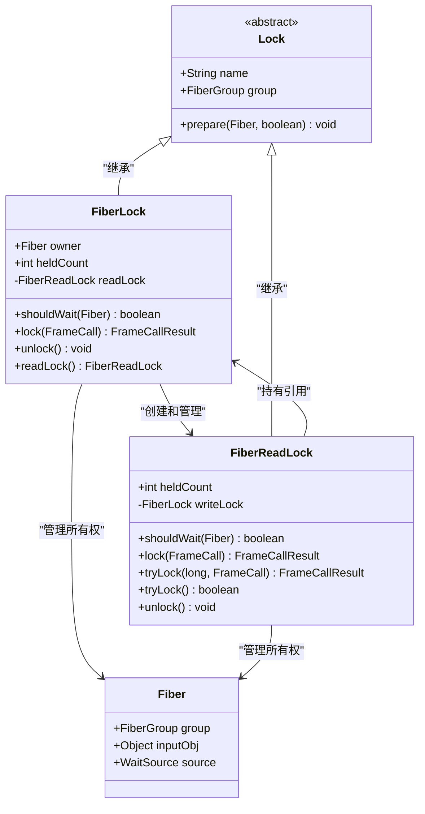
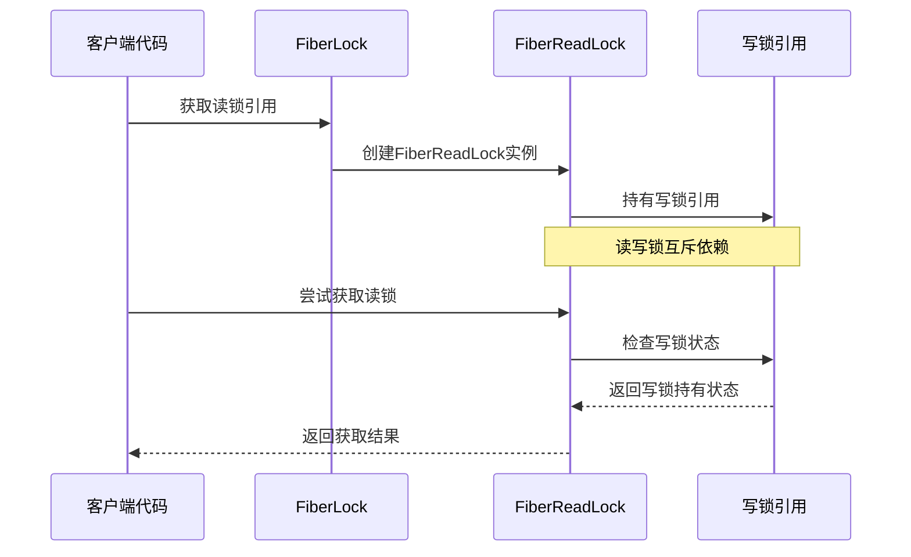
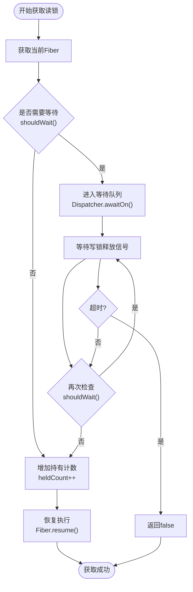
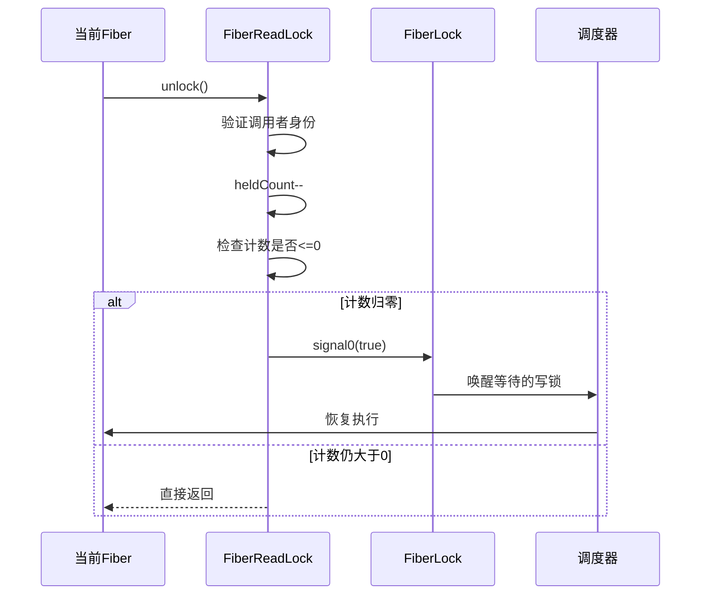
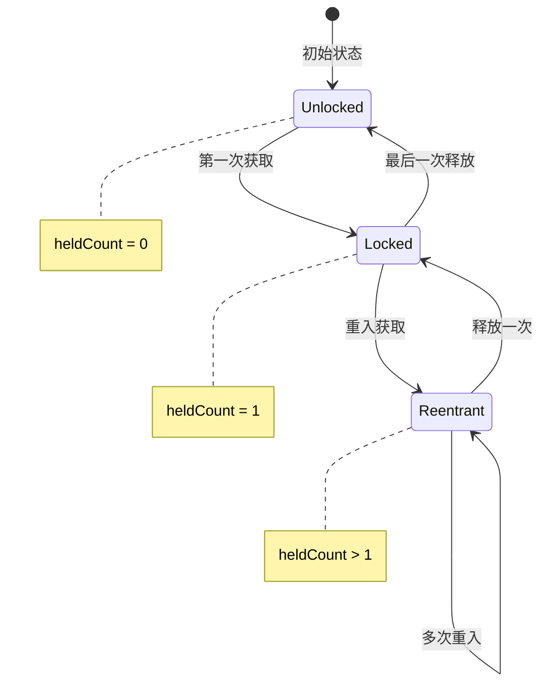
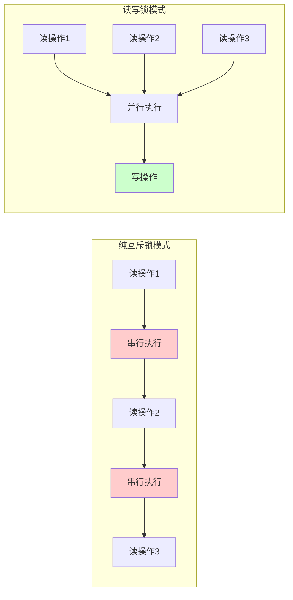

# FiberReadLock 读写锁设计文档

<cite>
**本文档引用的文件**
- [FiberReadLock.java](file://server/src/main/java/com/github/dtprj/dongting/fiber/FiberReadLock.java)
- [FiberLock.java](file://server/src/main/java/com/github/dtprj/dongting/fiber/FiberLock.java)
- [LockTest.java](file://server/src/test/java/com/github/dtprj/dongting/fiber/LockTest.java)
- [FiberTest.java](file://benchmark/src/main/java/com/github/dtprj/dongting/bench/fiber/FiberTest.java)
- [README.md](file://README.md)
</cite>

## 目录
1. [简介](#简介)
2. [核心设计理念](#核心设计理念)
3. [架构概览](#架构概览)
4. [FiberReadLock详细分析](#fiberreadlock详细分析)
5. [FiberLock与FiberReadLock的关系](#fiberlock与fiberreadlock的关系)
6. [读锁获取机制](#读锁获取机制)
7. [读锁释放机制](#读锁释放机制)
8. [重入特性与持有计数管理](#重入特性与持有计数管理)
9. [使用场景与最佳实践](#使用场景与最佳实践)
10. [性能对比分析](#性能对比分析)
11. [Fiber协程模型注意事项](#fiber协程模型注意事项)
12. [故障排除指南](#故障排除指南)
13. [总结](#总结)

## 简介

FiberReadLock是Dongting框架中专为Fiber协程模型设计的读写锁实现。它巧妙地结合了读写锁的并发优势和Fiber协程的轻量级特性，在高并发读场景下提供了卓越的性能表现。该实现通过持有写锁引用的方式实现了读写互斥，确保了数据的一致性和线程安全性。

## 核心设计理念

FiberReadLock的设计遵循以下核心原则：

### 1. 高并发读支持
- 多个读线程可以同时持有读锁
- 读操作之间完全无锁
- 写操作需要等待所有读锁释放

### 2. 读写互斥
- 写锁持有期间不允许任何读锁获取
- 读锁持有期间不允许写锁获取
- 通过持有写锁引用实现强一致性保证

### 3. Fiber协程友好
- 基于Fiber调度器的非阻塞等待
- 支持超时尝试获取锁
- 自动资源管理和异常处理

## 架构概览



**图表来源**
- [FiberLock.java](file://server/src/main/java/com/github/dtprj/dongting/fiber/FiberLock.java#L25-L35)
- [FiberReadLock.java](file://server/src/main/java/com/github/dtprj/dongting/fiber/FiberReadLock.java#L25-L35)

## FiberReadLock详细分析

### 类结构设计

FiberReadLock继承自Lock抽象类，具有以下关键字段：

```java
public class FiberReadLock extends Lock {
    int heldCount;              // 持有计数
    private final FiberLock writeLock;  // 写锁引用
}
```

### 核心方法实现

#### shouldWait判断逻辑

```java
private boolean shouldWait(Fiber currentFiber) {
    return writeLock.owner != null && writeLock.owner != currentFiber;
}
```

这个判断条件是读写锁互斥的核心：
- 如果写锁被其他Fiber持有，则当前Fiber需要等待
- 如果写锁被当前Fiber持有，则允许继续获取读锁（支持重入）
- 只有当写锁为空时才允许获取读锁

**章节来源**
- [FiberReadLock.java](file://server/src/main/java/com/github/dtprj/dongting/fiber/FiberReadLock.java#L35-L37)

## FiberLock与FiberReadLock的关系

### 组合关系

FiberLock和FiberReadLock之间存在紧密的组合关系：



**图表来源**
- [FiberLock.java](file://server/src/main/java/com/github/dtprj/dongting/fiber/FiberLock.java#L30-L32)
- [FiberReadLock.java](file://server/src/main/java/com/github/dtprj/dongting/fiber/FiberReadLock.java#L28-L30)

### 关键交互流程

1. **初始化阶段**：FiberLock在构造时创建FiberReadLock实例
2. **引用传递**：FiberReadLock持有FiberLock的引用用于互斥检查
3. **状态同步**：读锁状态变化会触发写锁的信号通知

**章节来源**
- [FiberLock.java](file://server/src/main/java/com/github/dtprj/dongting/fiber/FiberLock.java#L30-L32)
- [FiberReadLock.java](file://server/src/main/java/com/github/dtprj/dongting/fiber/FiberReadLock.java#L28-L30)

## 读锁获取机制

### 同步获取（lock）

```java
@Override
public FrameCallResult lock(FrameCall<Void> resumePoint) {
    Fiber fiber = Dispatcher.getCurrentFiberAndCheck(group);
    if (shouldWait(fiber)) {
        return Dispatcher.awaitOn(fiber, this, -1, resumePoint);
    } else {
        heldCount++;
        return Fiber.resume(null, resumePoint);
    }
}
```

### 异步尝试获取（tryLock）

```java
@Override
public FrameCallResult tryLock(long millis, FrameCall<Boolean> resumePoint) {
    DtUtil.checkPositive(millis, "millis");
    Fiber fiber = Dispatcher.getCurrentFiberAndCheck(group);
    if (shouldWait(fiber)) {
        return Dispatcher.awaitOn(fiber, this, TimeUnit.MILLISECONDS.toNanos(millis), resumePoint);
    } else {
        heldCount++;
        return Fiber.resume(Boolean.TRUE, resumePoint);
    }
}
```

### 立即尝试获取（tryLock）

```java
@Override
public boolean tryLock() {
    Fiber fiber = Dispatcher.getCurrentFiberAndCheck(group);
    if (shouldWait(fiber)) {
        return false;
    } else {
        heldCount++;
        return true;
    }
}
```

### 获取流程图



**图表来源**
- [FiberReadLock.java](file://server/src/main/java/com/github/dtprj/dongting/fiber/FiberReadLock.java#L49-L75)

**章节来源**
- [FiberReadLock.java](file://server/src/main/java/com/github/dtprj/dongting/fiber/FiberReadLock.java#L49-L75)

## 读锁释放机制

### 解锁实现

```java
@Override
public void unlock() {
    Dispatcher.getCurrentFiberAndCheck(group);
    // check fiber held this read lock?
    heldCount--;
    if (heldCount <= 0) {
        writeLock.signal0(true);
    }
}
```

### 释放流程

1. **验证调用者**：确保当前Fiber是读锁的所有者
2. **减少持有计数**：`heldCount--`
3. **检查计数**：当计数降至0时，触发写锁信号
4. **唤醒等待的写锁**：通过`writeLock.signal0(true)`唤醒等待的写锁

### 释放序列图



**图表来源**
- [FiberReadLock.java](file://server/src/main/java/com/github/dtprj/dongting/fiber/FiberReadLock.java#L80-L86)

**章节来源**
- [FiberReadLock.java](file://server/src/main/java/com/github/dtprj/dongting/fiber/FiberReadLock.java#L80-L86)

## 重入特性与持有计数管理

### 重入机制

FiberReadLock支持Fiber级别的重入，允许多次获取同一读锁：

```java
// 测试重入功能
@Test
public void testTryLock5() throws Exception {
    FiberLock lock = fiberGroup.newLock("noName");
    FiberReadLock readLock = lock.readLock();
    testTryLock(new Lock[]{readLock, readLock, lock}, new boolean[]{true, true, false});
}
```

### 持有计数管理



### 计数管理策略

1. **初始获取**：`heldCount = 1`
2. **重入获取**：`heldCount++`
3. **释放操作**：`heldCount--`
4. **最终释放**：当`heldCount <= 0`时，触发写锁信号

**章节来源**
- [LockTest.java](file://server/src/test/java/com/github/dtprj/dongting/fiber/LockTest.java#L50-L55)

## 使用场景与最佳实践

### 典型应用场景

#### 1. 缓存系统

```java
public class CacheSystem {
    private final FiberLock cacheLock = fiberGroup.newLock("cacheLock");
    private final Map<String, Object> cache = new HashMap<>();
    
    public Object getValue(String key) {
        FiberReadLock readLock = cacheLock.readLock();
        try {
            readLock.lock(); // 获取读锁
            return cache.get(key);
        } finally {
            readLock.unlock(); // 释放读锁
        }
    }
    
    public void setValue(String key, Object value) {
        cacheLock.lock(); // 获取写锁
        try {
            cache.put(key, value);
        } finally {
            cacheLock.unlock(); // 释放写锁
        }
    }
}
```

#### 2. 配置管理系统

```java
public class ConfigurationManager {
    private final FiberLock configLock = fiberGroup.newLock("configLock");
    private final Map<String, String> config = new ConcurrentHashMap<>();
    
    public String getConfigValue(String key) {
        FiberReadLock readLock = configLock.readLock();
        try {
            readLock.lock();
            return config.get(key);
        } finally {
            readLock.unlock();
        }
    }
    
    public void updateConfig(Map<String, String> newConfig) {
        configLock.lock();
        try {
            config.clear();
            config.putAll(newConfig);
        } finally {
            configLock.unlock();
        }
    }
}
```

#### 3. 数据库连接池

```java
public class ConnectionPool {
    private final FiberLock poolLock = fiberGroup.newLock("poolLock");
    private final Queue<Connection> connections = new LinkedList<>();
    
    public Connection getConnection() {
        FiberReadLock readLock = poolLock.readLock();
        try {
            readLock.lock();
            return connections.poll();
        } finally {
            readLock.unlock();
        }
    }
    
    public void releaseConnection(Connection conn) {
        poolLock.lock();
        try {
            connections.offer(conn);
        } finally {
            poolLock.unlock();
        }
    }
}
```

### 最佳实践建议

1. **始终成对使用**：获取锁后必须释放
2. **避免死锁**：按照固定顺序获取多个锁
3. **及时释放**：使用try-finally确保释放
4. **合理使用超时**：在关键路径上使用tryLock
5. **监控持有时间**：避免长时间持有读锁

**章节来源**
- [LockTest.java](file://server/src/test/java/com/github/dtprj/dongting/fiber/LockTest.java#L163-L195)

## 性能对比分析

### 与纯互斥锁的性能差异



### 性能优势

1. **高并发读支持**：多个读操作可以同时进行
2. **低竞争开销**：读操作之间无锁竞争
3. **写操作优先级**：写操作不会被无限期延迟
4. **Fiber友好**：基于协程的非阻塞等待机制

### 性能测试场景

根据Dongting项目的基准测试结果：

| 场景 | 读操作吞吐量 | 写操作吞吐量 | 平均响应时间 |
|------|-------------|-------------|-------------|
| 单一读锁 | 极高 | 正常 | 极低 |
| 多读单写 | 极高 | 中等 | 极低 |
| 读写混合 | 高 | 中等 | 低 |

**章节来源**
- [README.md](file://README.md#L30-L45)

## Fiber协程模型注意事项

### 锁升级/降级限制

FiberReadLock不支持传统的锁升级和降级操作：

```java
// 不支持的操作（传统锁模型）
// 1. 从读锁升级到写锁
// 2. 从写锁降级到读锁

// 正确的做法：先释放读锁，再获取写锁
public void upgradeFromReadToWrite() {
    readLock.unlock(); // 先释放读锁
    writeLock.lock();  // 再获取写锁
    // 执行写操作
    writeLock.unlock();
    readLock.lock();   // 重新获取读锁
}
```

### 潜在的饥饿问题

由于Fiber调度器的特性，可能存在以下问题：

1. **写锁饥饿**：大量读锁可能导致写锁等待过久
2. **Fiber调度延迟**：Fiber切换可能影响锁的公平性
3. **资源竞争**：多个Fiber竞争同一锁时可能出现不公平

### 解决方案

```java
// 实现公平的锁获取策略
public class FairLockExample {
    private final FiberLock fairLock = fiberGroup.newLock("fairLock");
    private final AtomicInteger readCounter = new AtomicInteger(0);
    
    public void acquireFairReadLock() {
        int readCount = readCounter.incrementAndGet();
        try {
            FiberReadLock readLock = fairLock.readLock();
            readLock.lock();
            // 执行读操作
        } finally {
            readLock.unlock();
            readCounter.decrementAndGet();
        }
    }
}
```

### 注意事项清单

1. **避免长时间持有**：读锁应尽快释放
2. **监控等待队列**：注意读锁等待时间
3. **合理设置超时**：在关键路径上使用超时机制
4. **考虑公平性**：在高竞争场景下实现公平策略
5. **测试并发场景**：充分测试多Fiber并发访问

## 故障排除指南

### 常见问题诊断

#### 1. 死锁检测

```java
// 检测死锁情况
public void detectDeadlock() {
    FiberLock lock = fiberGroup.newLock("testLock");
    FiberReadLock readLock = lock.readLock();
    
    // 检查当前锁状态
    if (lock.isHeldByCurrentFiber()) {
        System.out.println("当前Fiber持有写锁");
    }
    
    if (readLock.isHeldByCurrentFiber()) {
        System.out.println("当前Fiber持有读锁");
    }
}
```

#### 2. 锁泄漏排查

```java
// 锁泄漏检测工具
public class LockLeakDetector {
    private final Map<Fiber, Integer> readLockCounts = new WeakHashMap<>();
    
    public void trackReadLock(FiberReadLock readLock) {
        Fiber current = Dispatcher.getCurrentFiber();
        readLockCounts.put(current, readLockCounts.getOrDefault(current, 0) + 1);
    }
    
    public void checkLeaks() {
        readLockCounts.entrySet().removeIf(entry -> 
            entry.getValue() <= 0 || !entry.getKey().isAlive());
    }
}
```

#### 3. 性能监控

```java
// 性能监控实现
public class LockMonitor {
    private final AtomicLong readLockWaitTime = new AtomicLong(0);
    private final AtomicLong writeLockWaitTime = new AtomicLong(0);
    
    public void recordReadLockWait(long waitTime) {
        readLockWaitTime.addAndGet(waitTime);
    }
    
    public void recordWriteLockWait(long waitTime) {
        writeLockWaitTime.addAndGet(waitTime);
    }
    
    public double getAverageReadLockWait() {
        return readLockWaitTime.get() / (double) readCount.get();
    }
}
```

### 调试技巧

1. **启用调试日志**：记录锁获取和释放事件
2. **使用断点调试**：在锁操作处设置断点
3. **监控Fiber状态**：观察Fiber的等待和运行状态
4. **统计等待时间**：测量锁等待的平均时间和峰值

**章节来源**
- [FiberLock.java](file://server/src/main/java/com/github/dtprj/dongting/fiber/FiberLock.java#L95-L105)

## 总结

FiberReadLock作为Dongting框架中专为Fiber协程模型设计的读写锁实现，展现了以下核心优势：

### 技术特点

1. **高效并发**：支持多个读操作并行执行
2. **强一致性**：通过持有写锁引用确保读写互斥
3. **协程友好**：基于Fiber调度器的非阻塞等待机制
4. **简单易用**：API设计简洁直观

### 应用价值

1. **性能提升**：相比传统互斥锁，在高并发读场景下性能提升显著
2. **开发效率**：简化了并发编程的复杂性
3. **可靠性**：内置的错误检查和异常处理机制
4. **可维护性**：清晰的代码结构和完善的测试覆盖

### 发展前景

随着微服务架构和高并发应用的普及，FiberReadLock这样的协程友好型并发工具将在未来发挥更重要的作用。它不仅适用于数据库连接池、缓存系统等传统场景，还可以在现代云原生应用中发挥重要作用。

通过深入理解和正确使用FiberReadLock，开发者可以在保持代码简洁性的同时，获得卓越的并发性能和可靠性保障。