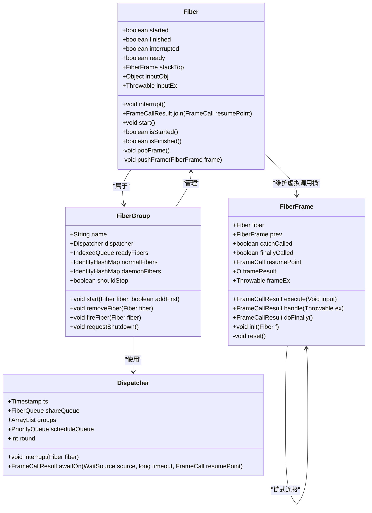
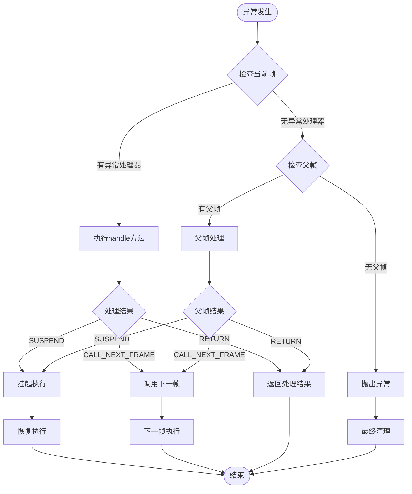
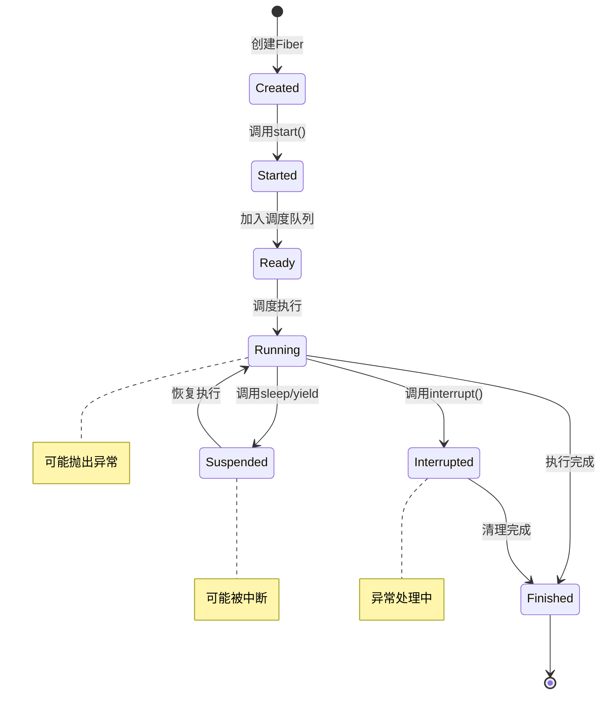
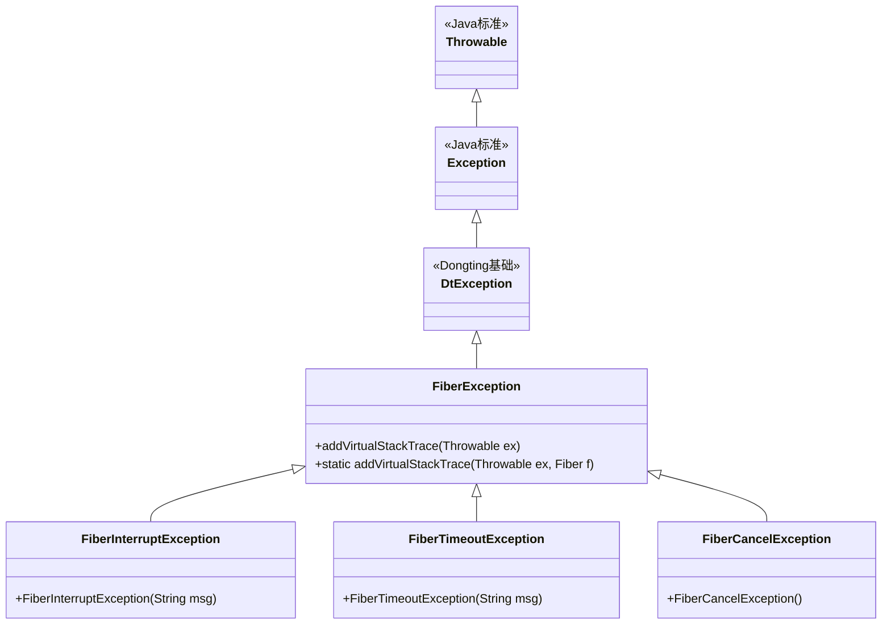
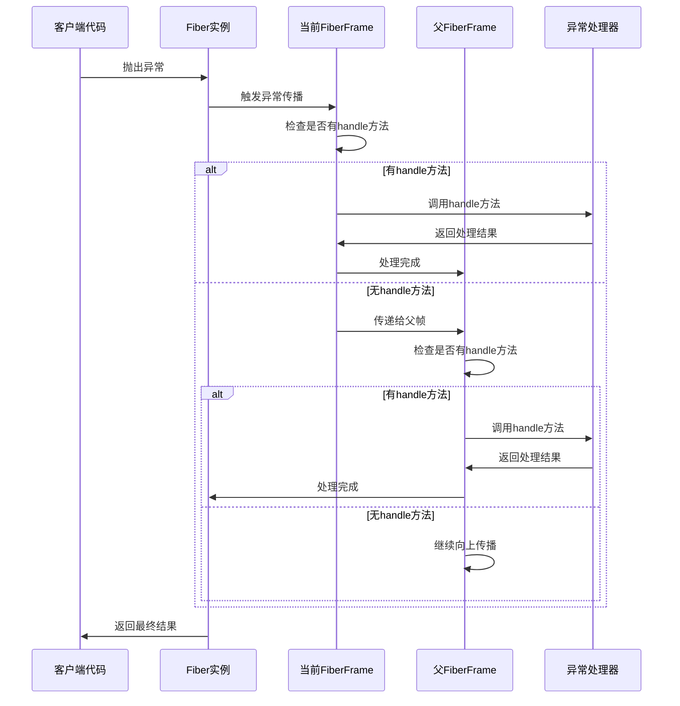

# Fiber异常处理与生命周期管理

<cite>
**本文档引用的文件**
- [FiberFrame.java](file://server/src/main/java/com/github/dtprj/dongting/fiber/FiberFrame.java)
- [Fiber.java](file://server/src/main/java/com/github/dtprj/dongting/fiber/Fiber.java)
- [FiberGroup.java](file://server/src/main/java/com/github/dtprj/dongting/fiber/FiberGroup.java)
- [Dispatcher.java](file://server/src/main/java/com/github/dtprj/dongting/fiber/Dispatcher.java)
- [FiberException.java](file://server/src/main/java/com/github/dtprj/dongting/fiber/FiberException.java)
- [FiberInterruptException.java](file://server/src/main/java/com/github/dtprj/dongting/fiber/FiberInterruptException.java)
- [FiberTimeoutException.java](file://server/src/main/java/com/github/dtprj/dongting/fiber/FiberTimeoutException.java)
- [FiberCancelException.java](file://server/src/main/java/com/github/dtprj/dongting/fiber/FiberCancelException.java)
- [FiberCondition.java](file://server/src/main/java/com/github/dtprj/dongting/fiber/FiberCondition.java)
- [CatchTest.java](file://server/src/test/java/com/github/dtprj/dongting/fiber/CatchTest.java)
- [FinallyTest.java](file://server/src/test/java/com/github/dtprj/dongting/fiber/FinallyTest.java)
- [VirtualExceptionTest.java](file://server/src/test/java/com/github/dtprj/dongting/fiber/VirtualExceptionTest.java)
</cite>

## 目录
1. [简介](#简介)
2. [Fiber核心架构](#fiber核心架构)
3. [异常处理机制](#异常处理机制)
4. [生命周期管理](#生命周期管理)
5. [特定异常类型](#特定异常类型)
6. [异常传播流程](#异常传播流程)
7. [虚拟调用栈与堆栈追踪](#虚拟调用栈与堆栈追踪)
8. [最佳实践与常见陷阱](#最佳实践与常见陷阱)
9. [总结](#总结)

## 简介

Dongting Fiber是一个高性能的协程框架，提供了完整的异常处理和生命周期管理机制。本文档深入分析Fiber的异常传播机制、生命周期状态管理和各种特定异常类型的处理方式。

Fiber的核心设计基于帧式调用栈，每个Fiber实例维护一个FiberFrame链表作为虚拟调用栈。这种设计使得异常能够在帧级别进行精确控制和传播，同时支持复杂的异常处理逻辑。

## Fiber核心架构

### 核心组件关系图



**图表来源**
- [Fiber.java](file://server/src/main/java/com/github/dtprj/dongting/fiber/Fiber.java#L25-L115)
- [FiberFrame.java](file://server/src/main/java/com/github/dtprj/dongting/fiber/FiberFrame.java#L20-L115)
- [FiberGroup.java](file://server/src/main/java/com/github/dtprj/dongting/fiber/FiberGroup.java#L35-L199)
- [Dispatcher.java](file://server/src/main/java/com/github/dtprj/dongting/fiber/Dispatcher.java#L40-L199)

**章节来源**
- [Fiber.java](file://server/src/main/java/com/github/dtprj/dongting/fiber/Fiber.java#L25-L115)
- [FiberFrame.java](file://server/src/main/java/com/github/dtprj/dongting/fiber/FiberFrame.java#L20-L115)
- [FiberGroup.java](file://server/src/main/java/com/github/dtprj/dongting/fiber/FiberGroup.java#L35-L199)

## 异常处理机制

### 帧级异常处理

Fiber的异常处理基于FiberFrame级别的设计，每个帧都可以独立处理异常：

```java
// FiberFrame中的异常处理方法
protected FrameCallResult handle(Throwable ex) throws Throwable {
    throw ex;  // 默认直接抛出异常
}

protected FrameCallResult doFinally() {
    return FrameCallResult.RETURN;  // 默认返回结果
}
```

### 异常处理流程图



**图表来源**
- [FiberFrame.java](file://server/src/main/java/com/github/dtprj/dongting/fiber/FiberFrame.java#L37-L42)
- [CatchTest.java](file://server/src/test/java/com/github/dtprj/dongting/fiber/CatchTest.java#L30-L70)

### 异常捕获示例

以下是一个典型的异常捕获示例：

```java
FiberFrame<Integer> sub = new FiberFrame<>() {
    @Override
    public FrameCallResult execute(Void input) throws Exception {
        throw new Exception("原始异常");
    }
    
    @Override
    protected FrameCallResult handle(Throwable ex) {
        // 捕获并处理异常
        exRef.set(ex);
        setResult(100);  // 设置处理后的结果
        return Fiber.frameReturn();
    }
    
    @Override
    protected FrameCallResult doFinally() {
        subFinallyCalled.set(true);
        return super.doFinally();
    }
};
```

**章节来源**
- [CatchTest.java](file://server/src/test/java/com/github/dtprj/dongting/fiber/CatchTest.java#L30-L70)
- [FiberFrame.java](file://server/src/main/java/com/github/dtprj/dongting/fiber/FiberFrame.java#L37-L42)

## 生命周期管理

### Fiber生命周期状态

Fiber具有明确的生命周期状态，这些状态直接影响异常处理行为：

```java
public class Fiber {
    boolean started;      // 是否已启动
    boolean ready;        // 是否就绪
    boolean finished;     // 是否已完成
    boolean interrupted;  // 是否被中断
}
```

### 生命周期状态转换图



### Fiber启动和管理

```java
// Fiber启动流程
public void start() {
    group.checkGroup();
    group.start(Fiber.this, false);
}

// Fiber组管理
void start(Fiber f, boolean addFirst) {
    if (f.group.finished) {
        log.warn("group finished, ignore fiber start: {}", f.name);
        return;
    }
    if (f.started) {
        BugLog.getLog().error("fiber already started: {}", f.name);
        return;
    }
    f.started = true;
    if (f.daemon) {
        daemonFibers.put(f, f);
    } else {
        normalFibers.put(f, f);
    }
    tryMakeFiberReady(f, addFirst);
}
```

**章节来源**
- [Fiber.java](file://server/src/main/java/com/github/dtprj/dongting/fiber/Fiber.java#L210-L237)
- [FiberGroup.java](file://server/src/main/java/com/github/dtprj/dongting/fiber/FiberGroup.java#L130-L170)

## 特定异常类型

### FiberException基类

所有Fiber相关的异常都继承自FiberException，该类提供了虚拟堆栈跟踪功能：

```java
public class FiberException extends DtException {
    private static final long serialVersionUID = 7000896886981197542L;

    public FiberException() {
        super();
        addVirtualStackTrace(this);
    }

    public FiberException(String message) {
        super(message);
        addVirtualStackTrace(this);
    }

    public FiberException(String message, Throwable cause) {
        super(message, cause);
        addVirtualStackTrace(this);
    }
}
```

### 特定异常类型

#### FiberInterruptException

当Fiber被中断时抛出此异常：

```java
public class FiberInterruptException extends FiberException {
    private static final long serialVersionUID = -8811104740639172480L;
    
    public FiberInterruptException(String msg) {
        super(msg);
    }
}
```

#### FiberTimeoutException

当Fiber操作超时时抛出此异常：

```java
public class FiberTimeoutException extends FiberException {
    private static final long serialVersionUID = -7870794955007854373L;

    public FiberTimeoutException(String msg) {
        super(msg);
    }
}
```

#### FiberCancelException

表示Fiber被取消的异常：

```java
public class FiberCancelException extends FiberException {
    private static final long serialVersionUID = -7778839960847960704L;
}
```

### 异常类型层次结构



**图表来源**
- [FiberException.java](file://server/src/main/java/com/github/dtprj/dongting/fiber/FiberException.java#L20-L85)
- [FiberInterruptException.java](file://server/src/main/java/com/github/dtprj/dongting/fiber/FiberInterruptException.java#L20-L25)
- [FiberTimeoutException.java](file://server/src/main/java/com/github/dtprj/dongting/fiber/FiberTimeoutException.java#L20-L26)
- [FiberCancelException.java](file://server/src/main/java/com/github/dtprj/dongting/fiber/FiberCancelException.java#L20-L22)

**章节来源**
- [FiberException.java](file://server/src/main/java/com/github/dtprj/dongting/fiber/FiberException.java#L20-L85)
- [FiberInterruptException.java](file://server/src/main/java/com/github/dtprj/dongting/fiber/FiberInterruptException.java#L20-L25)
- [FiberTimeoutException.java](file://server/src/main/java/com/github/dtprj/dongting/fiber/FiberTimeoutException.java#L20-L26)
- [FiberCancelException.java](file://server/src/main/java/com/github/dtprj/dongting/fiber/FiberCancelException.java#L20-L22)

## 异常传播流程

### 异常传播机制

Fiber的异常传播遵循以下规则：

1. **帧内传播**：异常首先在当前帧内传播
2. **异常处理**：如果当前帧有handle方法，则调用处理
3. **父帧传递**：如果没有处理或继续抛出，传递给父帧
4. **最终处理**：直到找到处理者或到达根帧

### 异常传播序列图



**图表来源**
- [FiberFrame.java](file://server/src/main/java/com/github/dtprj/dongting/fiber/FiberFrame.java#L37-L42)
- [CatchTest.java](file://server/src/test/java/com/github/dtprj/dongting/fiber/CatchTest.java#L152-L193)

### 异常传播测试示例

以下测试展示了异常传播的不同场景：

```java
@Test
public void testHandlerEx1() {
    Exception ex1 = new Exception("mock ex1");
    Exception ex2 = new Exception("mock ex2");
    AtomicReference<Throwable> exRef = new AtomicReference<>();
    AtomicBoolean subFinallyCalled = new AtomicBoolean();
    AtomicBoolean parentFinallyCalled = new AtomicBoolean();
    
    FiberFrame<Void> sub = new FiberFrame<>() {
        @Override
        public FrameCallResult execute(Void input) throws Exception {
            throw ex1;
        }
        
        @Override
        protected FrameCallResult handle(Throwable ex) throws Throwable {
            throw ex2;  // 在handle中再次抛出异常
        }
        
        @Override
        protected FrameCallResult doFinally() {
            subFinallyCalled.set(true);
            return super.doFinally();
        }
    };
    
    // 异常最终会传播到父帧的handle方法
    // 最终结果是ex2而不是ex1
}
```

**章节来源**
- [CatchTest.java](file://server/src/test/java/com/github/dtprj/dongting/fiber/CatchTest.java#L152-L193)
- [FinallyTest.java](file://server/src/test/java/com/github/dtprj/dongting/fiber/FinallyTest.java#L200-L235)

## 虚拟调用栈与堆栈追踪

### 虚拟调用栈概念

Fiber使用FiberFrame链表模拟Java虚拟机的调用栈，每个FiberFrame代表一个函数调用：

```java
public abstract class FiberFrame<O> implements FrameCall<Void> {
    Fiber fiber;              // 所属Fiber实例
    FiberFrame prev;          // 前一帧，形成链表
    boolean catchCalled;      // 是否已调用过catch
    boolean finallyCalled;    // 是否已调用过finally
    FrameCall resumePoint;    // 恢复点
    O frameResult;            // 帧结果
    Throwable frameEx;        // 帧异常
}
```

### 虚拟堆栈跟踪实现

FiberException类实现了特殊的虚拟堆栈跟踪功能：

```java
private static void addVirtualStackTrace(Throwable ex) {
    Thread t = Thread.currentThread();
    if (!(t instanceof DispatcherThread)) {
        return;
    }
    DispatcherThread dt = (DispatcherThread) t;
    if (dt.currentGroup == null) {
        return;
    }
    Fiber f = dt.currentGroup.currentFiber;
    addVirtualStackTrace(ex, f);
}

static void addVirtualStackTrace(Throwable ex, Fiber f) {
    if (f == null) {
        return;
    }
    FiberFrame<?> ff = f.stackTop;
    if (ff == null) {
        return;
    }
    
    // 计算帧数量
    int frameCount = 0;
    while (ff != null) {
        frameCount++;
        ff = ff.prev;
    }
    
    // 构建虚拟堆栈元素
    ff = f.stackTop;
    StackTraceElement[] stackTrace = new StackTraceElement[frameCount];
    for (int i = 0; i < frameCount; i++) {
        stackTrace[i] = new StackTraceElement(ff.getClass().getName(), "N/A", null, 0);
        ff = ff.prev;
    }
    
    // 添加虚拟异常
    FiberVirtualException fe = new FiberVirtualException();
    fe.setStackTrace(stackTrace);
    ex.addSuppressed(fe);
}
```

### 虚拟堆栈展示

当异常发生时，除了实际的异常堆栈外，还会添加一个FiberVirtualException：

```java
// 异常堆栈示例
java.util.concurrent.ExecutionException: com.github.dtprj.dongting.fiber.FiberException: 
	at java.base/java.util.concurrent.FutureTask.report(FutureTask.java:122)
	at java.base/java.util.concurrent.FutureTask.get(FutureTask.java:191)
Caused by: com.github.dtprj.dongting.fiber.FiberException: 
	at com.github.dtprj.dongting.fiber.FiberException.<init>(FiberException.java:25)
	... 10 more
	Suppressed: com.github.dtprj.dongting.fiber.FiberVirtualException
		at com.github.dtprj.dongting.fiber.FiberException.addVirtualStackTrace(FiberException.java:40)
		at com.github.dtprj.dongting.fiber.FiberException.addVirtualStackTrace(FiberException.java:32)
		at com.github.dtprj.dongting.fiber.FiberException.<init>(FiberException.java:25)
		at com.github.dtprj.dongting.fiber.FiberFrame.execute(FiberFrame.java:100)
		at com.github.dtprj.dongting.fiber.FiberFrame.execute(FiberFrame.java:100)
		at com.github.dtprj.dongting.fiber.FiberFrame.execute(FiberFrame.java:100)
		at com.github.dtprj.dongting.fiber.FiberFrame.execute(FiberFrame.java:100)
```

**章节来源**
- [FiberException.java](file://server/src/main/java/com/github/dtprj/dongting/fiber/FiberException.java#L30-L85)
- [FiberFrame.java](file://server/src/main/java/com/github/dtprj/dongting/fiber/FiberFrame.java#L20-L115)

## 最佳实践与常见陷阱

### 异常处理最佳实践

#### 1. 正确使用handle方法

```java
// 推荐：在handle中正确处理异常
@Override
protected FrameCallResult handle(Throwable ex) {
    if (ex instanceof SpecificException) {
        // 处理特定异常
        processSpecificException((SpecificException) ex);
        return Fiber.frameReturn();  // 返回处理结果
    }
    // 其他异常继续向上抛出
    throw ex;
}

// 避免：在handle中不处理直接抛出
@Override
protected FrameCallResult handle(Throwable ex) {
    throw ex;  // 这会导致无限循环
}
```

#### 2. 使用doFinally进行资源清理

```java
@Override
protected FrameCallResult doFinally() {
    // 确保资源总是被清理
    if (resource != null) {
        resource.close();
        resource = null;
    }
    return super.doFinally();
}
```

#### 3. 避免在finally中抛出新异常

```java
// 推荐：捕获并记录异常
@Override
protected FrameCallResult doFinally() {
    try {
        cleanupResource();
    } catch (Exception e) {
        log.error("Cleanup failed", e);
    }
    return super.doFinally();
}

// 避免：在finally中抛出新异常
@Override
protected FrameCallResult doFinally() {
    cleanupResource();  // 可能抛出异常
    return super.doFinally();
}
```

### 常见陷阱

#### 1. 异常丢失

```java
// 错误：异常被吞掉
@Override
protected FrameCallResult handle(Throwable ex) {
    // 没有处理异常，也没有重新抛出
    // 异常会在这里丢失
}

// 正确：要么处理要么重新抛出
@Override
protected FrameCallResult handle(Throwable ex) {
    // 处理异常
    return Fiber.frameReturn();
}
```

#### 2. 循环异常处理

```java
// 错误：可能导致无限循环
@Override
protected FrameCallResult handle(Throwable ex) {
    throw new RuntimeException("处理失败", ex);  // 再次抛出异常
}

// 正确：避免无限循环
@Override
protected FrameCallResult handle(Throwable ex) {
    if (ex instanceof RecoverableException) {
        // 尝试恢复
        return recover(ex);
    }
    // 不可恢复的异常，重新抛出
    throw ex;
}
```

#### 3. 忘记重置状态

```java
// 错误：忘记重置状态
@Override
protected FrameCallResult handle(Throwable ex) {
    setResult(100);  // 设置结果但没有正确返回
    // 缺少return语句
}

// 正确：确保返回正确的FrameCallResult
@Override
protected FrameCallResult handle(Throwable ex) {
    setResult(100);
    return Fiber.frameReturn();  // 明确返回
}
```

### 中断处理最佳实践

```java
// 正确的中断处理
public FrameCallResult execute(Void input) {
    try {
        // 主要业务逻辑
        return doWork();
    } catch (InterruptedException e) {
        // 正确处理中断
        Thread.currentThread().interrupt();  // 保持中断状态
        throw new FiberInterruptException("Operation interrupted");
    }
}

// 避免：忽略中断状态
public FrameCallResult execute(Void input) {
    try {
        // 主要业务逻辑
        return doWork();
    } catch (InterruptedException e) {
        // 错误：忽略了中断状态
        throw new FiberInterruptException("Operation interrupted");
    }
}
```

**章节来源**
- [CatchTest.java](file://server/src/test/java/com/github/dtprj/dongting/fiber/CatchTest.java#L152-L231)
- [FinallyTest.java](file://server/src/test/java/com/github/dtprj/dongting/fiber/FinallyTest.java#L119-L235)
- [VirtualExceptionTest.java](file://server/src/test/java/com/github/dtprj/dongting/fiber/VirtualExceptionTest.java#L42-L137)

## 总结

Dongting Fiber的异常处理和生命周期管理系统具有以下特点：

### 核心优势

1. **帧级异常控制**：每个FiberFrame都可以独立处理异常，提供细粒度的错误处理能力
2. **虚拟调用栈**：通过FiberFrame链表模拟调用栈，支持复杂的异常传播路径
3. **自动堆栈跟踪**：FiberException自动添加虚拟堆栈跟踪，便于调试
4. **生命周期管理**：清晰的状态管理确保异常处理的正确性

### 设计理念

- **异常不丢失**：通过严格的传播机制确保异常不会被意外吞没
- **资源安全**：doFinally方法保证即使发生异常也能正确清理资源
- **可预测性**：明确的异常处理规则使开发者能够准确预测异常行为

### 应用建议

1. **合理使用异常处理**：根据业务需求选择合适的异常处理策略
2. **重视资源清理**：始终在doFinally中进行必要的资源清理
3. **避免异常循环**：确保异常处理不会导致无限循环
4. **充分利用虚拟堆栈**：利用Fiber的虚拟堆栈跟踪功能提高调试效率

通过深入理解这些机制，开发者可以更好地利用Dongting Fiber的强大功能，构建健壮可靠的异步应用程序。