# Fiber组调度策略

<cite>
**本文档引用的文件**
- [FiberGroup.java](file://server/src/main/java/com/github/dtprj/dongting/fiber/FiberGroup.java)
- [Dispatcher.java](file://server/src/main/java/com/github/dtprj/dongting/fiber/Dispatcher.java)
- [Fiber.java](file://server/src/main/java/com/github/dtprj/dongting/fiber/Fiber.java)
- [GroupExecutor.java](file://server/src/main/java/com/github/dtprj/dongting/fiber/GroupExecutor.java)
- [DispatcherThread.java](file://server/src/main/java/com/github/dtprj/dongting/fiber/DispatcherThread.java)
- [FiberQueue.java](file://server/src/main/java/com/github/dtprj/dongting/fiber/FiberQueue.java)
- [FiberQueueTask.java](file://server/src/main/java/com/github/dtprj/dongting/fiber/FiberQueueTask.java)
- [FiberTestUtil.java](file://server/src/test/java/com/github/dtprj/dongting/fiber/FiberTestUtil.java)
</cite>

## 目录
1. [简介](#简介)
2. [核心组件概述](#核心组件概述)
3. [FiberGroup架构设计](#fiberGroup架构设计)
4. [三级就绪队列机制](#三级就绪队列机制)
5. [调度策略详解](#调度策略详解)
6. [GroupRunnerFiberFrame执行流程](#grouprunnerfiberframe执行流程)
7. [系统级通信机制](#系统级通信机制)
8. [调度时序图](#调度时序图)
9. [性能优化特性](#性能优化特性)
10. [故障排除指南](#故障排除指南)
11. [总结](#总结)

## 简介

Dongting框架中的FiberGroup调度策略是一个高度优化的协程管理系统，它通过精心设计的三级就绪队列和智能调度算法，实现了高效的并发控制和资源管理。FiberGroup作为Fiber的容器和调度单元，不仅管理着Fiber的生命周期，还负责协调多个Fiber之间的执行顺序和优先级。

本文档将深入分析FiberGroup调度策略的核心机制，包括其三级就绪队列的设计原理、调度算法的实现细节，以及与其他组件的协同工作机制。

## 核心组件概述

FiberGroup调度策略涉及以下核心组件：

```mermaid
classDiagram
class FiberGroup {
+String name
+Dispatcher dispatcher
+IndexedQueue readyFibers
+IndexedQueue readyFibersNextRound1
+IndexedQueue readyFibersNextRound2
+IdentityHashMap normalFibers
+IdentityHashMap daemonFibers
+FiberChannel sysChannel
+boolean finished
+boolean ready
+Fiber currentFiber
+tryMakeFiberReady(Fiber, boolean)
+startGroupRunnerFiber()
+updateFinishStatus()
}
class Dispatcher {
+Timestamp ts
+FiberQueue shareQueue
+IndexedQueue readyGroups
+PriorityQueue scheduleQueue
+DispatcherThread thread
+int round
+processScheduleFibers()
+execGroup(FiberGroup)
}
class Fiber {
+String name
+FiberGroup group
+boolean daemon
+boolean started
+boolean ready
+boolean finished
+long roundInfo
+short signalCountInEachRound
+FiberFrame stackTop
+pushFrame(FiberFrame)
+popFrame()
}
class GroupRunnerFiberFrame {
-FiberChannel channel
+execute(Void) FrameCallResult
-afterTake(Runnable) FrameCallResult
}
class FiberQueue {
-ReentrantLock lock
-Condition notEmpty
-FiberQueueTask head
-FiberQueueTask tail
+offer(FiberQueueTask) boolean
+poll(long, TimeUnit) FiberQueueTask
+drainTo(ArrayList)
}
FiberGroup --> Fiber : "manages"
FiberGroup --> Dispatcher : "belongs to"
FiberGroup --> GroupRunnerFiberFrame : "uses"
Dispatcher --> FiberGroup : "executes"
Dispatcher --> FiberQueue : "uses"
Fiber --> FiberFrame : "has stack"
```



**图表来源**
- [FiberGroup.java](file://server/src/main/java/com/github/dtprj/dongting/fiber/FiberGroup.java#L32-L68)
- [Dispatcher.java](file://server/src/main/java/com/github/dtprj/dongting/fiber/Dispatcher.java#L32-L69)
- [Fiber.java](file://server/src/main/java/com/github/dtprj/dongting/fiber/Fiber.java#L25-L50)

## FiberGroup架构设计

FiberGroup采用分层架构设计，每个层级都有明确的职责分工：

### 基础数据结构

FiberGroup维护了多个关键的数据结构来支持其调度功能：

```java
// 三级就绪队列
final IndexedQueue<Fiber> readyFibers = new IndexedQueue<>(64);              // 当前轮次优先队列
final IndexedQueue<Fiber> readyFibersNextRound1 = new IndexedQueue<>(16);   // 下一轮优先队列1
final IndexedQueue<Fiber> readyFibersNextRound2 = new IndexedQueue<>(16);   // 下一轮优先队列2

// Fiber集合管理
private final IdentityHashMap<Fiber, Fiber> normalFibers = new IdentityHashMap<>(128);  // 普通Fiber
private final IdentityHashMap<Fiber, Fiber> daemonFibers = new IdentityHashMap<>(128); // 守护Fiber

// 系统通道用于异步任务处理
final FiberChannel<Runnable> sysChannel;
```

### 关键字段说明

- **readyFibers**: 当前轮次的高优先级队列，存储立即可执行的Fiber
- **readyFibersNextRound1**: 下一轮的优先队列，具有最高优先级
- **readyFibersNextRound2**: 下一轮的普通队列，具有较低优先级
- **normalFibers**: 存储所有非守护Fiber
- **daemonFibers**: 存储所有守护Fiber
- **sysChannel**: 系统级通信通道，用于处理异步任务

**章节来源**
- [FiberGroup.java](file://server/src/main/java/com/github/dtprj/dongting/fiber/FiberGroup.java#L32-L68)

## 三级就绪队列机制

三级就绪队列是FiberGroup调度策略的核心创新，它通过分层设计实现了精细化的优先级控制。

### 队列层次结构


**图表来源**
- [FiberGroup.java](file://server/src/main/java/com/github/dtprj/dongting/fiber/FiberGroup.java#L175-L200)

### roundInfo字段设计

`roundInfo`字段采用位运算巧妙地同时存储轮次数和信号计数器：

```java
// roundInfo格式：(轮次数 << 16) | 信号计数器
if ((f.roundInfo >>> 16) != (dispatcher.round & 0xFFFF)) {
    f.roundInfo = (dispatcher.round << 16) | f.signalCountInEachRound;
}
```

这种设计的优势：
- **紧凑存储**: 单个整数即可存储两个重要信息
- **原子操作**: 支持无锁的并发访问
- **快速比较**: 通过位运算快速判断是否需要更新轮次

### 信号计数器机制

信号计数器(`signalCountInEachRound`)决定了Fiber在下一轮的调度位置：

```java
// 信号计数器为0时，优先级最高
if ((f.roundInfo & 0xFFFF) == 0) {
    if (addFirst) {
        readyFibersNextRound1.addLast(f);  // 最高优先级
    } else {
        readyFibersNextRound2.addLast(f);  // 普通优先级
    }
} else {
    // 减少信号计数器，提高下次调度优先级
    if (addFirst) {
        readyFibers.addFirst(f);
    } else {
        readyFibers.addLast(f);
    }
    f.roundInfo--;  // 递减信号计数器
}
```

**章节来源**
- [FiberGroup.java](file://server/src/main/java/com/github/dtprj/dongting/fiber/FiberGroup.java#L175-L200)

## 调度策略详解

### tryMakeFiberReady方法分析

`tryMakeFiberReady`方法是Fiber调度的核心逻辑，它根据Fiber的状态和配置决定其在哪个队列中等待执行：


**图表来源**
- [FiberGroup.java](file://server/src/main/java/com/github/dtprj/dongting/fiber/FiberGroup.java#L175-L200)

### 调度优先级规则

调度系统遵循以下优先级规则：

1. **当前轮次优先**: 具有最高优先级，立即执行
2. **下一轮优先队列**: 信号计数器为0的Fiber，具有较高优先级
3. **下一轮普通队列**: 信号计数器大于0的Fiber，具有较低优先级

### 调度循环机制

```java
void execGroup(FiberGroup g) {
    thread.currentGroup = g;
    try {
        IndexedQueue<Fiber> readyQueue = g.readyFibers;
        IndexedQueue<Fiber> nextQueue1 = g.readyFibersNextRound1;
        IndexedQueue<Fiber> nextQueue2 = g.readyFibersNextRound2;
        
        // 将下一轮队列合并到当前轮次
        if (nextQueue1.size() > 0) {
            for (int i = 0, size = nextQueue1.size(); i < size; i++) {
                Fiber f = nextQueue1.removeFirst();
                readyQueue.addFirst(f);
            }
        }
        if (nextQueue2.size() > 0) {
            for (int i = 0, size = nextQueue2.size(); i < size; i++) {
                Fiber f = nextQueue2.removeFirst();
                readyQueue.addLast(f);
            }
        }
        
        // 执行当前轮次的所有Fiber
        Fiber fiber = readyQueue.removeFirst();
        while (fiber != null) {
            execFiber(g, fiber);
            fiber = readyQueue.removeFirst();
        }
    } finally {
        thread.currentGroup = null;
    }
}
```

**章节来源**
- [FiberGroup.java](file://server/src/main/java/com/github/dtprj/dongting/fiber/FiberGroup.java#L242-L277)
- [Dispatcher.java](file://server/src/main/java/com/github/dtprj/dongting/fiber/Dispatcher.java#L242-L277)

## GroupRunnerFiberFrame执行流程

`GroupRunnerFiberFrame`是FiberGroup的特殊Fiber，它负责处理系统级任务和异步回调：

### 执行流程


**图表来源**
- [FiberGroup.java](file://server/src/main/java/com/github/dtprj/dongting/fiber/FiberGroup.java#L340-L366)

### 实现细节

```java
class GroupRunnerFiberFrame extends FiberFrame<Void> {
    private final FiberChannel<Runnable> channel;

    public GroupRunnerFiberFrame(FiberChannel<Runnable> channel) {
        this.channel = channel;
    }

    @Override
    public FrameCallResult execute(Void input) {
        return channel.take(this::afterTake);
    }

    private FrameCallResult afterTake(Runnable r) {
        if (r != null) {
            try {
                r.run();
            } catch (Throwable e) {
                log.error("callback error", e);
            }
        }
        return Fiber.resume(null, this);
    }
}
```

这个特殊的Fiber确保系统级任务能够及时得到处理，同时保持调度器的响应性。

**章节来源**
- [FiberGroup.java](file://server/src/main/java/com/github/dtprj/dongting/fiber/FiberGroup.java#L340-L366)

## 系统级通信机制

### sysChannel的作用

`sysChannel`是FiberGroup与外部系统交互的主要通道，它提供了以下功能：

1. **异步任务提交**: 通过`fireOffer()`方法提交任务
2. **系统级事件处理**: 处理来自其他线程的任务请求
3. **资源管理**: 协调内存池和其他系统资源的使用

### 任务队列机制


**图表来源**
- [FiberQueue.java](file://server/src/main/java/com/github/dtprj/dongting/fiber/FiberQueue.java#L25-L50)
- [FiberQueueTask.java](file://server/src/main/java/com/github/dtprj/dongting/fiber/FiberQueueTask.java#L18-L34)

### 线程安全保证

系统通过以下机制确保线程安全：

1. **锁机制**: 使用`ReentrantLock`保护共享数据
2. **条件变量**: 使用`Condition`实现高效的等待/通知机制
3. **原子操作**: 利用`VarHandle`实现无锁的原子操作

**章节来源**
- [FiberGroup.java](file://server/src/main/java/com/github/dtprj/dongting/fiber/FiberGroup.java#L48-L50)
- [FiberQueue.java](file://server/src/main/java/com/github/dtprj/dongting/fiber/FiberQueue.java#L40-L80)

## 调度时序图

### 完整的调度周期


**图表来源**
- [Dispatcher.java](file://server/src/main/java/com/github/dtprj/dongting/fiber/Dispatcher.java#L111-L142)
- [FiberGroup.java](file://server/src/main/java/com/github/dtprj/dongting/fiber/FiberGroup.java#L242-L277)

### 状态转换说明

FiberGroup的状态转换遵循以下模式：

1. **初始化**: 创建FiberGroup并注册到调度器
2. **活跃**: 接受新的Fiber并进行调度
3. **关闭请求**: 收到关闭信号但仍有活动Fiber
4. **关闭完成**: 所有Fiber完成且系统通道为空
5. **清理**: 从调度器中移除

## 性能优化特性

### 内存池优化

FiberGroup集成了高效的内存池管理：

```java
// 创建堆内存池工厂
private RefBufferFactory createHeapPoolFactory() {
    TwoLevelPool heapPool = (TwoLevelPool) poolFactory.createPool(ts, false);
    TwoLevelPool releaseSafePool = heapPool.toReleaseInOtherThreadInstance(
        thread, 
        byteBuffer -> {
            if (byteBuffer != null) {
                shareQueue.offer(new FiberQueueTask(null) {
                    @Override
                    protected void run() {
                        heapPool.getSmallPool().release(byteBuffer);
                    }
                });
            }
        }
    );
    return new RefBufferFactory(releaseSafePool, 800);
}
```

### 批量处理优化

调度器采用批量处理机制减少锁竞争：

```java
private void runImpl(ArrayList<FiberQueueTask> localData) {
    fill(ts, localData);
    PerfCallback c = perfCallback;
    long start = c.takeTime(PerfConsts.FIBER_D_WORK, ts);
    processScheduleFibers();
    
    // 批量执行任务
    for (int len = localData.size(), i = 0; i < len; i++) {
        try {
            FiberQueueTask r = localData.get(i);
            r.run();
        } catch (Throwable e) {
            log.error("dispatcher run task fail", e);
        }
    }
    
    // 批量执行Fiber组
    for (int len = readyGroups.size(), i = 0; i < len; i++) {
        FiberGroup g = readyGroups.removeFirst();
        execGroup(g);
        if (g.ready) {
            readyGroups.addLast(g);
        }
    }
}
```

### 自适应调度

调度器根据负载情况自适应调整：

```java
// 60秒清理一次内存池
cleanPool(60_000_000_000L);

// 性能监控和调整
if (c.accept(PerfConsts.FIBER_D_WORK) || c.accept(PerfConsts.FIBER_D_POLL)) {
    perfCallback.refresh(ts);
} else {
    ts.refresh(1);
}
```

**章节来源**
- [Dispatcher.java](file://server/src/main/java/com/github/dtprj/dongting/fiber/Dispatcher.java#L80-L110)
- [Dispatcher.java](file://server/src/main/java/com/github/dtprj/dongting/fiber/Dispatcher.java#L170-L200)

## 故障排除指南

### 常见问题诊断

1. **Fiber无法启动**
   - 检查FiberGroup是否已正确启动
   - 验证Fiber是否属于正确的Group
   - 查看日志中的警告信息

2. **调度延迟**
   - 检查是否有大量阻塞操作
   - 验证roundInfo是否正确更新
   - 监控队列大小变化

3. **内存泄漏**
   - 检查Fiber是否正确完成
   - 验证daemonFibers和normalFibers集合
   - 监控系统通道队列长度

### 调试工具

FiberGroup提供了丰富的调试功能：

```java
public void fireLogGroupInfo(String msg) {
    if (!log.isInfoEnabled()) {
        return;
    }
    if (Thread.currentThread() == dispatcher.thread) {
        logGroupInfo0(msg);
    } else {
        // 异步日志记录
        CompletableFuture<Void> f = new CompletableFuture<>();
        boolean b = dispatcher.doInDispatcherThread(new FiberQueueTask(this) {
            @Override
            protected void run() {
                logGroupInfo0(msg);
                f.complete(null);
            }
        });
        // 超时处理...
    }
}
```

### 性能监控指标

- **队列长度**: 监控各个队列的大小变化
- **执行时间**: 记录Fiber的执行耗时
- **切换频率**: 统计Fiber之间的切换次数
- **内存使用**: 跟踪内存池的使用情况

**章节来源**
- [FiberGroup.java](file://server/src/main/java/com/github/dtprj/dongting/fiber/FiberGroup.java#L202-L240)

## 总结

Dongting框架的FiberGroup调度策略通过精心设计的三级就绪队列和智能调度算法，实现了高效、灵活的协程管理系统。其主要特点包括：

### 核心优势

1. **精细的优先级控制**: 通过三级队列和信号计数器实现多级优先级调度
2. **高效的内存管理**: 集成两级内存池，支持自动回收和线程安全
3. **强大的扩展性**: 支持daemon Fiber和普通Fiber的混合管理
4. **完善的监控机制**: 提供详细的性能指标和调试信息

### 设计亮点

- **位运算优化**: 使用`roundInfo`字段巧妙地存储轮次和信号计数器
- **无锁设计**: 利用`VarHandle`实现高效的原子操作
- **批量处理**: 减少锁竞争，提高整体吞吐量
- **自适应调度**: 根据负载情况动态调整调度策略

### 应用场景

FiberGroup调度策略特别适用于以下场景：

- **高并发网络服务**: 支持大量并发连接的处理
- **实时数据处理**: 低延迟的数据流处理管道
- **分布式系统**: 协调多个节点间的任务执行
- **微服务架构**: 高效的服务间通信和协调

通过深入理解FiberGroup的调度策略，开发者可以更好地利用Dongting框架构建高性能的并发应用程序。