# Fiber上下文切换机制

<cite>
**本文档中引用的文件**
- [Dispatcher.java](file://server/src/main/java/com/github/dtprj/dongting/fiber/Dispatcher.java)
- [Fiber.java](file://server/src/main/java/com/github/dtprj/dongting/fiber/Fiber.java)
- [FiberFrame.java](file://server/src/main/java/com/github/dtprj/dongting/fiber/FiberFrame.java)
- [FiberGroup.java](file://server/src/main/java/com/github/dtprj/dongting/fiber/FiberGroup.java)
- [DispatcherThread.java](file://server/src/main/java/com/github/dtprj/dongting/fiber/DispatcherThread.java)
- [YieldTest.java](file://server/src/test/java/com/github/dtprj/dongting/fiber/YieldTest.java)
- [FiberException.java](file://server/src/main/java/com/github/dtprj/dongting/fiber/FiberException.java)
</cite>

## 目录
1. [简介](#简介)
2. [系统架构概览](#系统架构概览)
3. [核心组件分析](#核心组件分析)
4. [上下文切换机制详解](#上下文切换机制详解)
5. [Fiber状态管理](#fiber状态管理)
6. [调度器工作原理](#调度器工作原理)
7. [性能优化与开销分析](#性能优化与开销分析)
8. [故障排除指南](#故障排除指南)
9. [总结](#总结)

## 简介

Dongting Fiber是一个高性能的协程框架，实现了轻量级的用户态线程调度。其核心在于高效的上下文切换机制，通过Fiber、FiberFrame和Dispatcher等组件协同工作，实现了类似于Go语言goroutine的并发模型，但具有更低的内存开销和更高的性能。

Fiber上下文切换机制是整个框架的核心，它负责在不同的Fiber实例之间进行高效的状态保存和恢复，确保协程能够正确地暂停和恢复执行。这种机制使得开发者可以编写出既简单又高效的异步代码。

## 系统架构概览

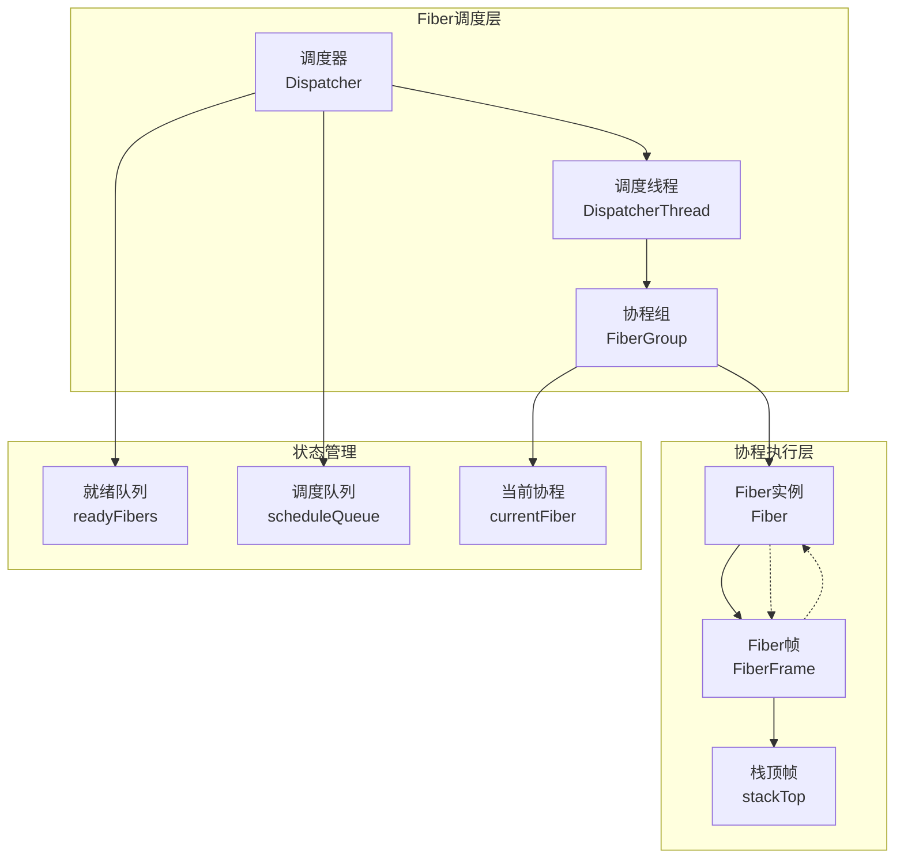

**图表来源**
- [Dispatcher.java](file://server/src/main/java/com/github/dtprj/dongting/fiber/Dispatcher.java#L40-L120)
- [FiberGroup.java](file://server/src/main/java/com/github/dtprj/dongting/fiber/FiberGroup.java#L32-L98)

## 核心组件分析

### Dispatcher调度器

Dispatcher是整个Fiber系统的中央调度器，负责管理所有Fiber的执行和上下文切换。

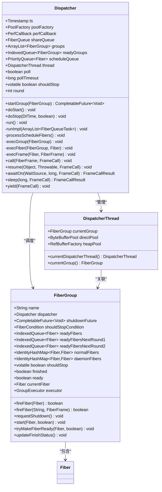

**图表来源**
- [Dispatcher.java](file://server/src/main/java/com/github/dtprj/dongting/fiber/Dispatcher.java#L40-L120)
- [FiberGroup.java](file://server/src/main/java/com/github/dtprj/dongting/fiber/FiberGroup.java#L32-L98)
- [DispatcherThread.java](file://server/src/main/java/com/github/dtprj/dongting/fiber/DispatcherThread.java#L25-L48)

### Fiber实例

Fiber是协程的基本执行单元，每个Fiber都有自己的调用栈和执行状态。

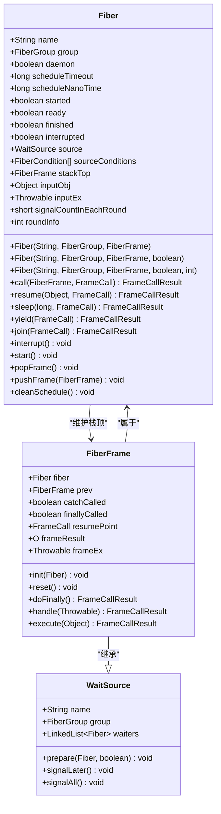

**图表来源**
- [Fiber.java](file://server/src/main/java/com/github/dtprj/dongting/fiber/Fiber.java#L30-L83)
- [FiberFrame.java](file://server/src/main/java/com/github/dtprj/dongting/fiber/FiberFrame.java#L20-L60)

**章节来源**
- [Dispatcher.java](file://server/src/main/java/com/github/dtprj/dongting/fiber/Dispatcher.java#L40-L120)
- [Fiber.java](file://server/src/main/java/com/github/dtprj/dongting/fiber/Fiber.java#L30-L83)
- [FiberFrame.java](file://server/src/main/java/com/github/dtprj/dongting/fiber/FiberFrame.java#L20-L60)
- [FiberGroup.java](file://server/src/main/java/com/github/dtprj/dongting/fiber/FiberGroup.java#L32-L98)

## 上下文切换机制详解

### execFiber方法：核心上下文切换引擎

`execFiber`方法是Fiber上下文切换的核心，它负责执行一个Fiber的所有帧直到该Fiber被暂停或完成。

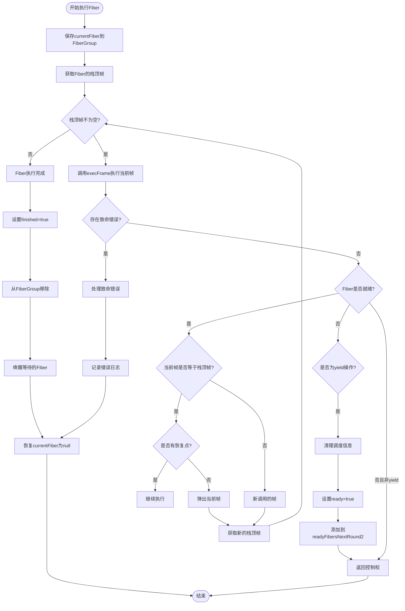

**图表来源**
- [Dispatcher.java](file://server/src/main/java/com/github/dtprj/dongting/fiber/Dispatcher.java#L279-L327)

### execFrame方法：单帧执行引擎

`execFrame`方法负责执行单个FiberFrame的逻辑，并处理可能的异常情况。

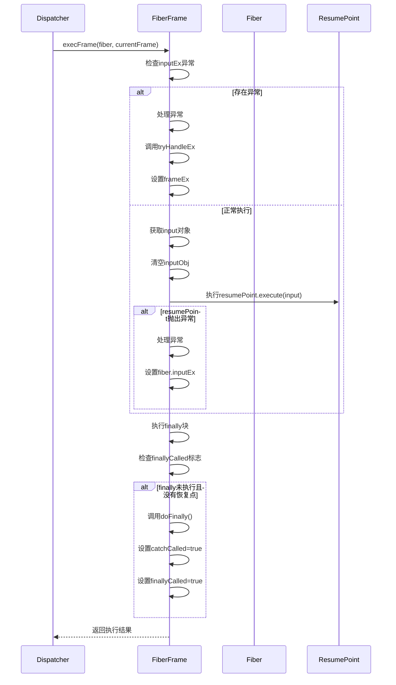

**图表来源**
- [Dispatcher.java](file://server/src/main/java/com/github/dtprj/dongting/fiber/Dispatcher.java#L327-L367)

### FiberFrame栈结构管理

Fiber使用链表结构维护调用栈，每个FiberFrame代表一次函数调用。

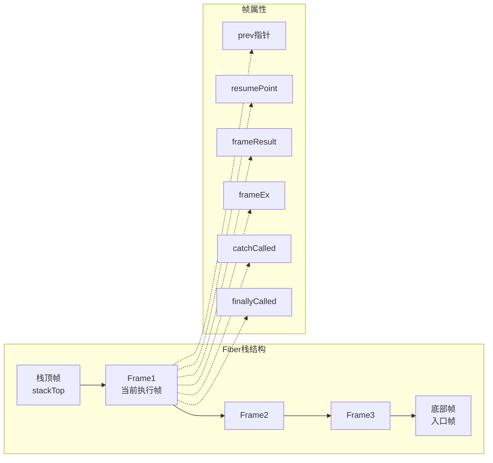

**图表来源**
- [Fiber.java](file://server/src/main/java/com/github/dtprj/dongting/fiber/Fiber.java#L55-L83)
- [FiberFrame.java](file://server/src/main/java/com/github/dtprj/dongting/fiber/FiberFrame.java#L20-L60)

**章节来源**
- [Dispatcher.java](file://server/src/main/java/com/github/dtprj/dongting/fiber/Dispatcher.java#L279-L367)
- [Fiber.java](file://server/src/main/java/com/github/dtprj/dongting/fiber/Fiber.java#L120-L150)

## Fiber状态管理

### 状态转换图

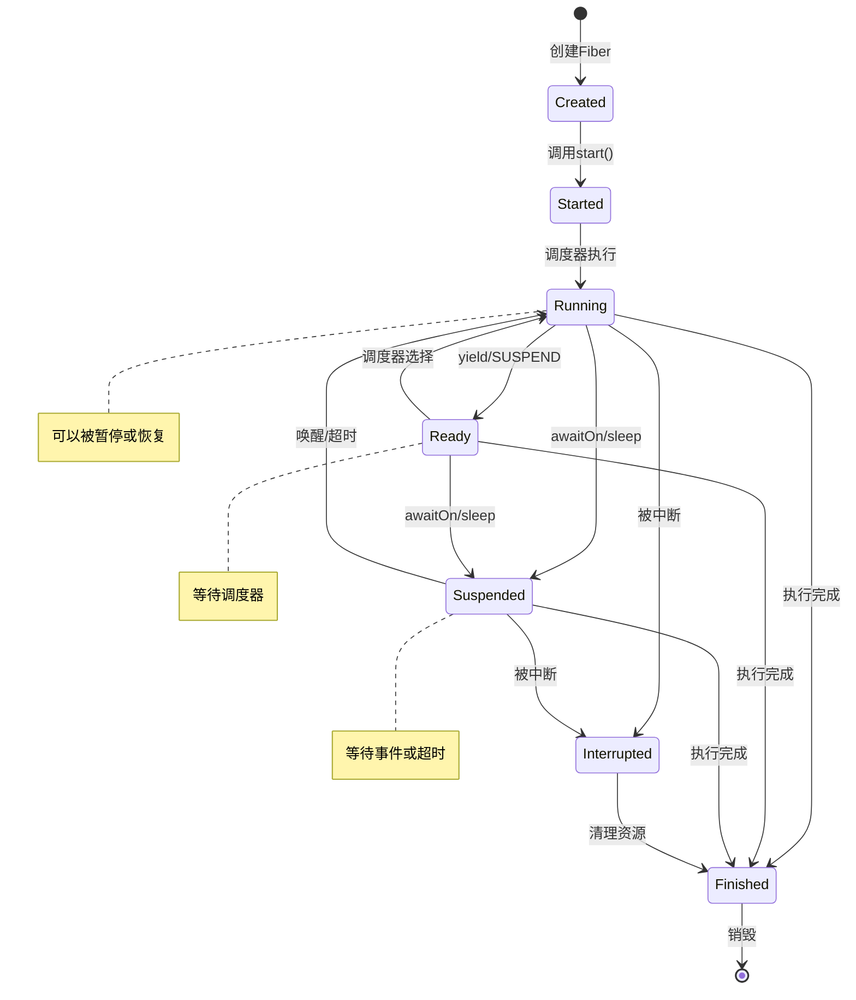

### 暂停（SUSPEND）与恢复机制

Fiber的暂停和恢复通过resumePoint机制实现：

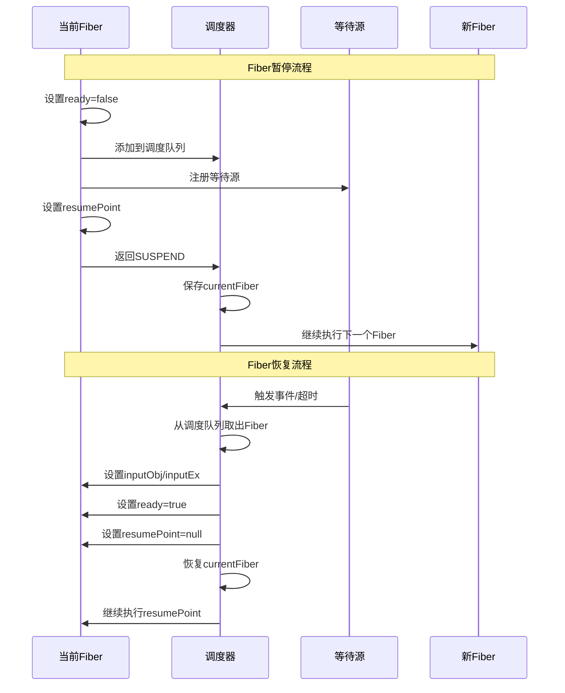

**图表来源**
- [Dispatcher.java](file://server/src/main/java/com/github/dtprj/dongting/fiber/Dispatcher.java#L429-L439)

### Dispatcher的ready标志位管理

Dispatcher通过多个队列管理Fiber的就绪状态：

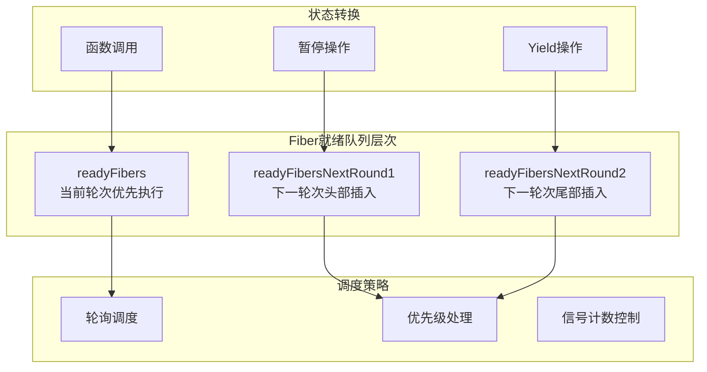

**图表来源**
- [FiberGroup.java](file://server/src/main/java/com/github/dtprj/dongting/fiber/FiberGroup.java#L40-L50)

**章节来源**
- [Dispatcher.java](file://server/src/main/java/com/github/dtprj/dongting/fiber/Dispatcher.java#L429-L439)
- [FiberGroup.java](file://server/src/main/java/com/github/dtprj/dongting/fiber/FiberGroup.java#L200-L250)

## 调度器工作原理

### 调度循环机制

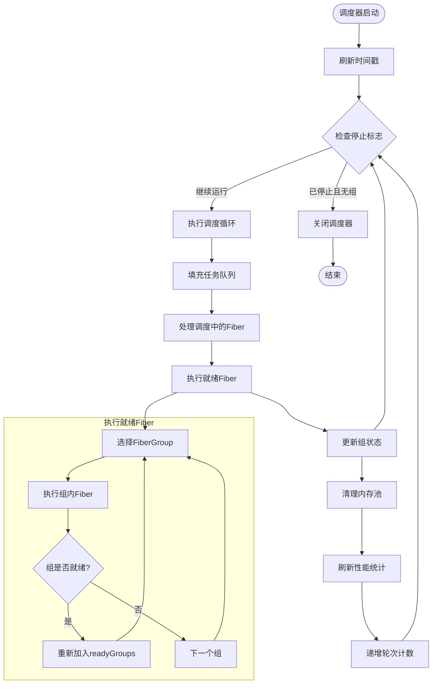

**图表来源**
- [Dispatcher.java](file://server/src/main/java/com/github/dtprj/dongting/fiber/Dispatcher.java#L120-L180)

### 性能监控与优化

调度器集成了详细的性能监控机制：

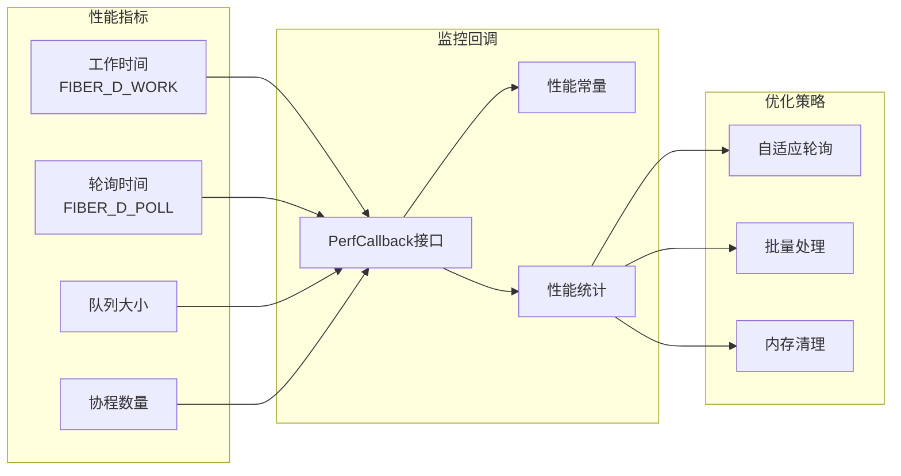

**图表来源**
- [Dispatcher.java](file://server/src/main/java/com/github/dtprj/dongting/fiber/Dispatcher.java#L180-L220)

**章节来源**
- [Dispatcher.java](file://server/src/main/java/com/github/dtprj/dongting/fiber/Dispatcher.java#L120-L220)

## 性能优化与开销分析

### 上下文切换性能开销

Fiber上下文切换相比传统线程切换具有显著优势：

| 操作类型 | 开销级别 | 说明 |
|---------|---------|------|
| Fiber切换 | 微秒级 | 仅需保存/恢复寄存器和栈指针 |
| 线程切换 | 毫秒级 | 需要保存整个CPU上下文 |
| 内存分配 | 取决于池化 | 使用对象池减少分配开销 |
| 锁竞争 | 减少 | 协程间通信避免锁 |

### 优化技术

1. **对象池化**: 使用ByteBufferPool和RefBufferFactory减少GC压力
2. **批量处理**: 通过IndexedQueue和PriorityQueue提高批量操作效率
3. **自适应轮询**: 根据负载动态调整轮询超时时间
4. **内存预分配**: 提前分配常用对象减少运行时分配

### 性能基准测试

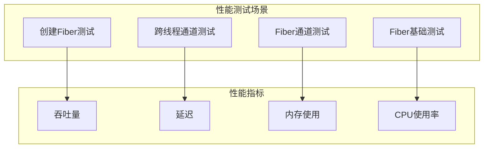

**章节来源**
- [Dispatcher.java](file://server/src/main/java/com/github/dtprj/dongting/fiber/Dispatcher.java#L80-L120)

## 故障排除指南

### 常见问题诊断

1. **Fiber死锁**
   - 检查waiters队列是否为空
   - 验证resumePoint是否正确设置
   - 确认信号量发送是否正常

2. **内存泄漏**
   - 监控FiberGroup中的normalFibers和daemonFibers集合
   - 检查Fiber是否正确标记为finished
   - 验证finally块是否被执行

3. **性能问题**
   - 分析调度器轮询时间占比
   - 检查内存池使用情况
   - 监控Fiber栈深度

### 调试工具

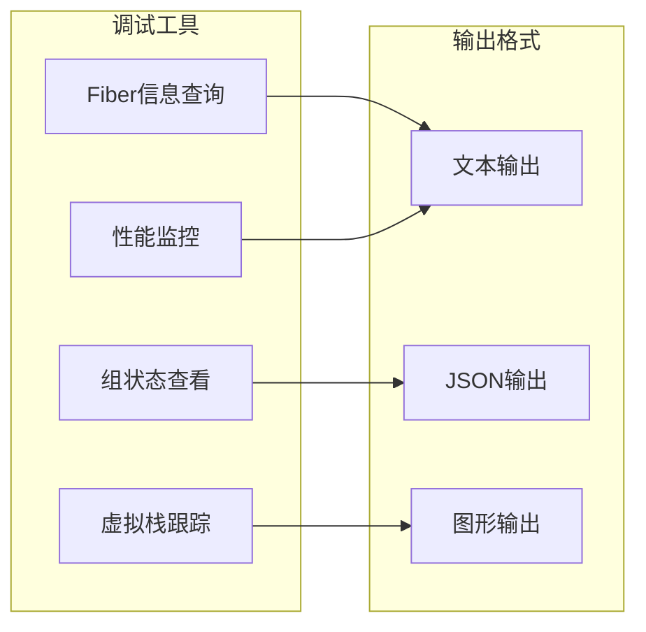

**图表来源**
- [FiberException.java](file://server/src/main/java/com/github/dtprj/dongting/fiber/FiberException.java#L35-L83)

**章节来源**
- [FiberException.java](file://server/src/main/java/com/github/dtprj/dongting/fiber/FiberException.java#L35-L83)

## 总结

Dongting Fiber的上下文切换机制通过精心设计的组件协作，实现了高效、可靠的协程调度。关键特性包括：

1. **高效的上下文切换**: 通过execFiber和execFrame方法实现最小化的状态保存和恢复
2. **灵活的调度策略**: 支持多种调度队列和优先级处理
3. **完善的异常处理**: 提供完整的异常传播和处理机制
4. **优秀的性能表现**: 相比传统线程切换具有显著的性能优势
5. **丰富的调试支持**: 提供详细的日志和性能监控功能

这种设计使得开发者能够编写出既简单又高效的异步代码，同时保持良好的可维护性和可调试性。Fiber上下文切换机制是整个框架性能和可靠性的基石，为构建高性能的分布式系统提供了强有力的支持。