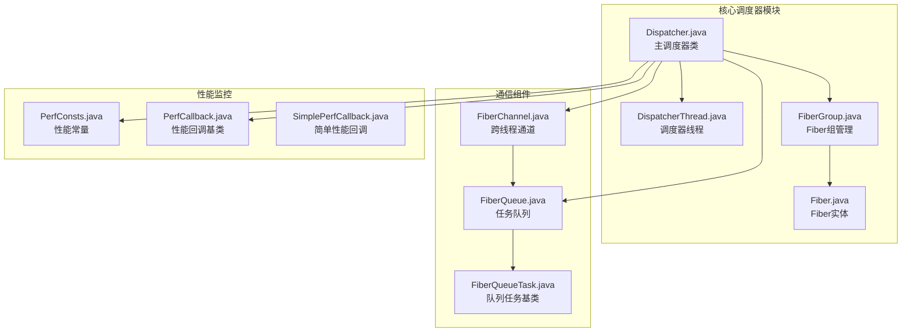
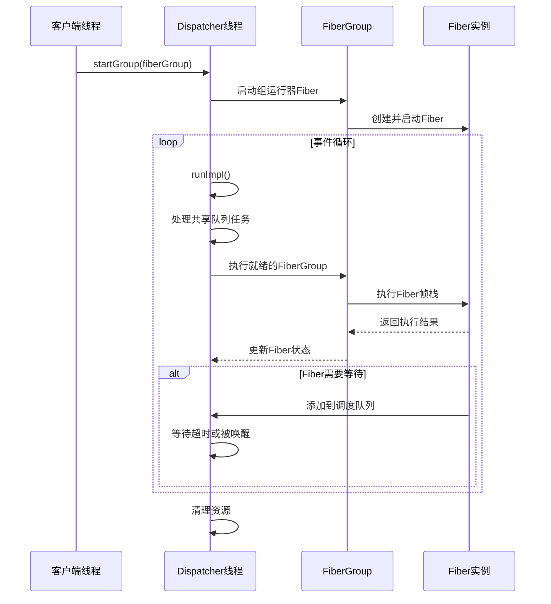
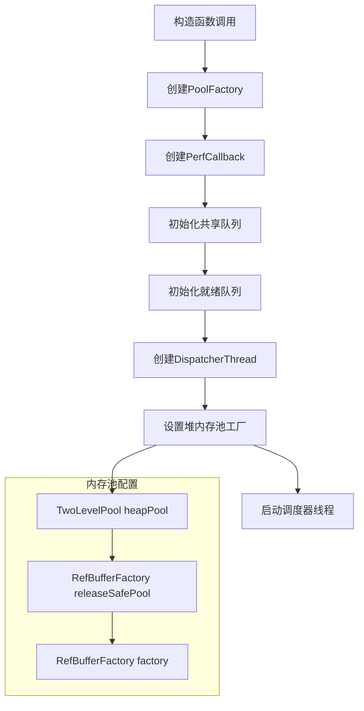
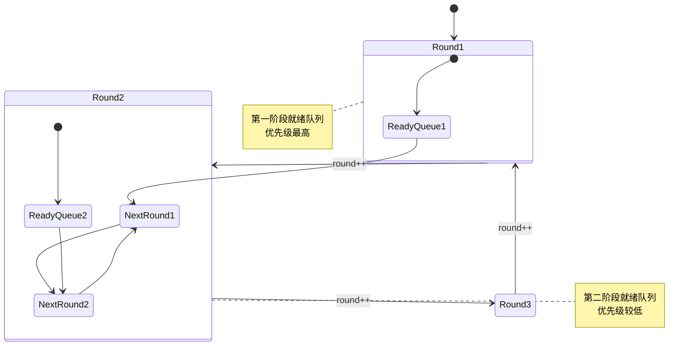
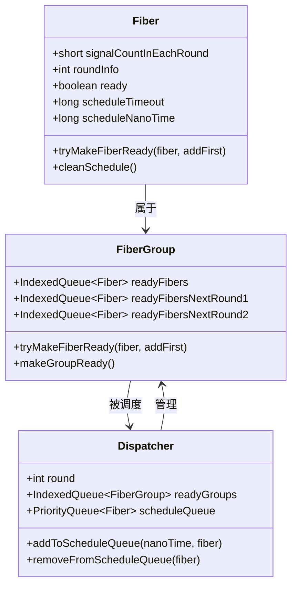
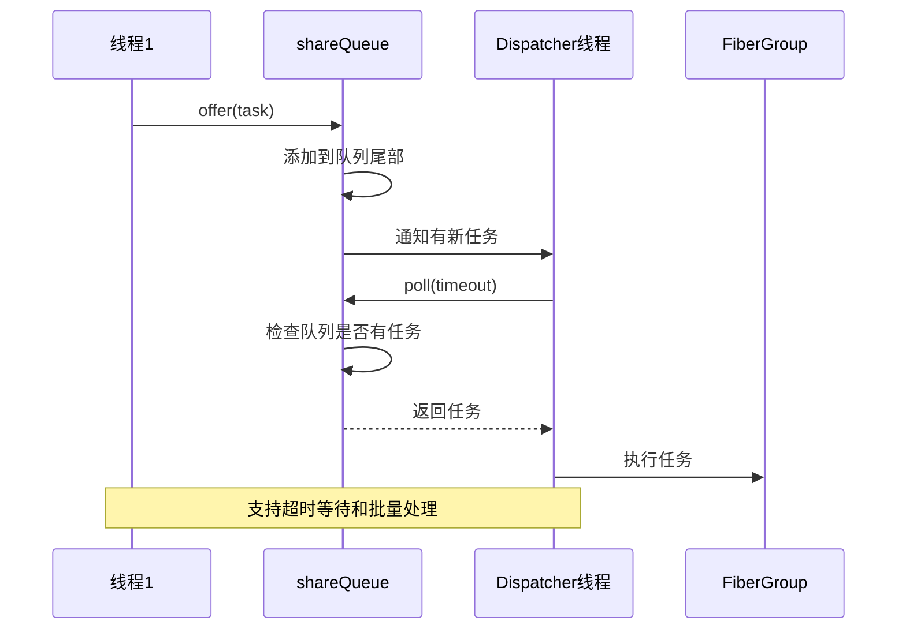
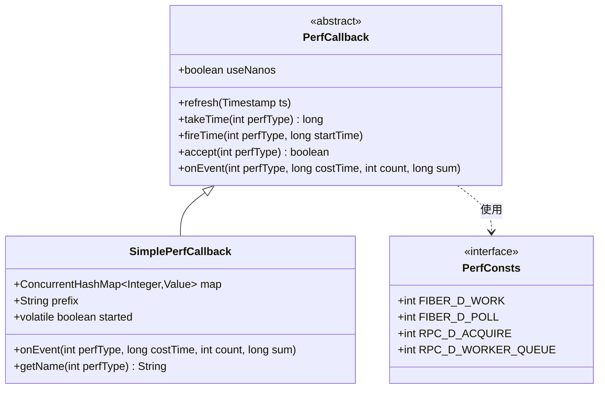
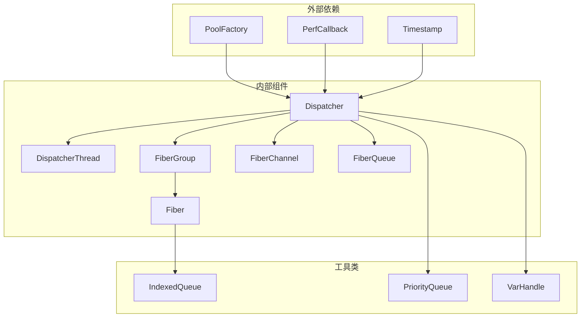

# 核心调度器

<cite>
**本文档引用的文件**
- [Dispatcher.java](file://server/src/main/java/com/github/dtprj/dongting/fiber/Dispatcher.java)
- [DispatcherThread.java](file://server/src/main/java/com/github/dtprj/dongting/fiber/DispatcherThread.java)
- [FiberGroup.java](file://server/src/main/java/com/github/dtprj/dongting/fiber/FiberGroup.java)
- [Fiber.java](file://server/src/main/java/com/github/dtprj/dongting/fiber/Fiber.java)
- [FiberChannel.java](file://server/src/main/java/com/github/dtprj/dongting/fiber/FiberChannel.java)
- [FiberQueue.java](file://server/src/main/java/com/github/dtprj/dongting/fiber/FiberQueue.java)
- [FiberQueueTask.java](file://server/src/main/java/com/github/dtprj/dongting/fiber/FiberQueueTask.java)
- [PerfConsts.java](file://client/src/main/java/com/github/dtprj/dongting/common/PerfConsts.java)
- [PerfCallback.java](file://client/src/main/java/com/github/dtprj/dongting/common/PerfCallback.java)
- [SimplePerfCallback.java](file://benchmark/src/main/java/com/github/dtprj/dongting/bench/common/SimplePerfCallback.java)
</cite>

## 目录
1. [简介](#简介)
2. [项目结构](#项目结构)
3. [核心组件](#核心组件)
4. [架构概览](#架构概览)
5. [详细组件分析](#详细组件分析)
6. [依赖关系分析](#依赖关系分析)
7. [性能考虑](#性能考虑)
8. [故障排除指南](#故障排除指南)
9. [结论](#结论)

## 简介

Dispatcher是Dongting Fiber协程系统的核心调度器组件，采用单线程事件循环模型来管理Fiber的执行。它负责协调多个FiberGroup的执行，管理Fiber的生命周期，并提供高效的跨线程任务提交机制。

Dispatcher的设计基于以下核心理念：
- 单线程事件循环：所有Fiber调度和执行都在同一个线程中进行
- 基于轮次的调度：通过round变量实现分阶段的任务调度
- 跨线程安全：通过shareQueue实现线程间的安全任务传递
- 性能监控：内置perfCallback机制用于性能指标收集

## 项目结构

Dispatcher相关的文件主要位于`server/src/main/java/com/github/dtprj/dongting/fiber/`目录下：

**图表来源**
- [Dispatcher.java](file://server/src/main/java/com/github/dtprj/dongting/fiber/Dispatcher.java#L1-L50)
- [DispatcherThread.java](file://server/src/main/java/com/github/dtprj/dongting/fiber/DispatcherThread.java#L1-L50)

## 核心组件

### Dispatcher类

Dispatcher是整个Fiber系统的中央调度器，负责管理Fiber的执行生命周期。它包含以下关键组件：

- **线程管理**：通过DispatcherThread实现单线程事件循环
- **FiberGroup管理**：维护活跃的FiberGroup列表和已完成的FiberGroup
- **任务队列**：通过shareQueue实现跨线程任务提交
- **调度队列**：通过scheduleQueue管理定时任务调度
- **性能监控**：通过perfCallback收集执行性能数据

### FiberGroup类

FiberGroup是Fiber的逻辑容器，负责管理一组相关的Fiber实例：

- **Fiber生命周期管理**：跟踪Fiber的启动、运行和完成状态
- **就绪队列管理**：维护当前可执行的Fiber队列
- **条件同步**：提供FiberCondition用于Fiber间的同步
- **内存池管理**：为Fiber分配和回收内存资源

**章节来源**
- [Dispatcher.java](file://server/src/main/java/com/github/dtprj/dongting/fiber/Dispatcher.java#L40-L150)
- [FiberGroup.java](file://server/src/main/java/com/github/dtprj/dongting/fiber/FiberGroup.java#L32-L100)

## 架构概览

Dispatcher采用单线程事件循环架构，确保Fiber执行的原子性和线程安全性：

**图表来源**
- [Dispatcher.java](file://server/src/main/java/com/github/dtprj/dongting/fiber/Dispatcher.java#L111-L142)
- [Dispatcher.java](file://server/src/main/java/com/github/dtprj/dongting/fiber/Dispatcher.java#L242-L277)

## 详细组件分析

### 初始化过程

Dispatcher的初始化过程包括线程创建、内存池配置和性能回调机制的设置：

**图表来源**
- [Dispatcher.java](file://server/src/main/java/com/github/dtprj/dongting/fiber/Dispatcher.java#L75-L85)
- [Dispatcher.java](file://server/src/main/java/com/github/dtprj/dongting/fiber/Dispatcher.java#L87-L100)

### 调度周期（Round）机制

Dispatcher使用round变量实现基于轮次的调度机制：

**图表来源**
- [FiberGroup.java](file://server/src/main/java/com/github/dtprj/dongting/fiber/FiberGroup.java#L182-L220)

### Signal计数机制

每个Fiber维护signalCountInEachRound字段，用于跟踪在当前轮次中接收到的信号数量：

**图表来源**
- [Fiber.java](file://server/src/main/java/com/github/dtprj/dongting/fiber/Fiber.java#L40-L50)
- [FiberGroup.java](file://server/src/main/java/com/github/dtprj/dongting/fiber/FiberGroup.java#L182-L220)

### 共享队列（ShareQueue）机制

shareQueue实现了跨线程安全的任务提交：

**图表来源**
- [FiberQueue.java](file://server/src/main/java/com/github/dtprj/dongting/fiber/FiberQueue.java#L82-L138)

### 性能监控接口

Dispatcher提供了完整的性能监控机制，通过perfCallback收集各种性能指标：

**图表来源**
- [PerfCallback.java](file://client/src/main/java/com/github/dtprj/dongting/common/PerfCallback.java#L1-L50)
- [SimplePerfCallback.java](file://benchmark/src/main/java/com/github/dtprj/dongting/bench/common/SimplePerfCallback.java#L1-L40)

**章节来源**
- [Dispatcher.java](file://server/src/main/java/com/github/dtprj/dongting/fiber/Dispatcher.java#L111-L142)
- [Dispatcher.java](file://server/src/main/java/com/github/dtprj/dongting/fiber/Dispatcher.java#L242-L277)
- [FiberGroup.java](file://server/src/main/java/com/github/dtprj/dongting/fiber/FiberGroup.java#L182-L220)

## 依赖关系分析

Dispatcher的依赖关系体现了其作为核心调度器的地位：

**图表来源**
- [Dispatcher.java](file://server/src/main/java/com/github/dtprj/dongting/fiber/Dispatcher.java#L20-L40)

**章节来源**
- [Dispatcher.java](file://server/src/main/java/com/github/dtprj/dongting/fiber/Dispatcher.java#L20-L40)

## 性能考虑

Dispatcher在设计时充分考虑了性能优化：

### 内存池优化
- 使用TwoLevelPool实现高效的内存分配
- 堆内存和直接内存分离管理
- 自动清理机制避免内存泄漏

### 调度优化
- 基于轮次的调度减少上下文切换
- 优先级队列确保高优先级任务及时执行
- 批量处理提高吞吐量

### 性能监控
- 支持纳秒级精度的性能测量
- 提供多种性能指标收集方式
- 可扩展的回调机制支持自定义监控

## 故障排除指南

### 常见问题及解决方案

1. **Fiber调度异常**
   - 检查Fiber的ready状态是否正确设置
   - 验证roundInfo字段的更新逻辑
   - 确认调度队列中没有重复添加

2. **跨线程任务提交失败**
   - 检查FiberGroup是否已请求关闭
   - 验证任务的ownerGroup设置
   - 确认调度器线程是否正常运行

3. **性能监控数据缺失**
   - 检查PerfCallback的实现是否正确
   - 验证accept方法的返回值
   - 确认性能指标类型是否匹配

**章节来源**
- [Dispatcher.java](file://server/src/main/java/com/github/dtprj/dongting/fiber/Dispatcher.java#L543-L582)

## 结论

Dispatcher作为Dongting Fiber系统的核心调度器，通过精心设计的单线程事件循环模型，实现了高效、可靠的Fiber调度机制。其基于轮次的调度策略、跨线程安全的任务提交机制以及完善的性能监控体系，为构建高性能的异步应用程序提供了坚实的基础。

通过深入理解Dispatcher的设计原理和实现细节，开发者可以更好地利用Fiber框架构建高性能的应用程序，并在遇到问题时能够快速定位和解决。