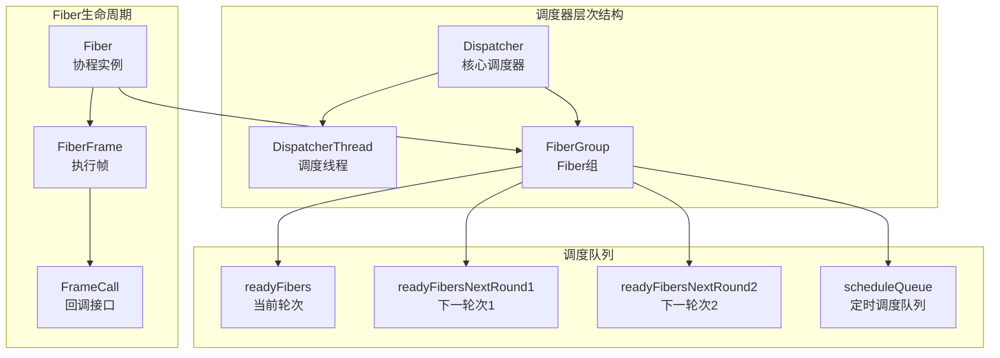
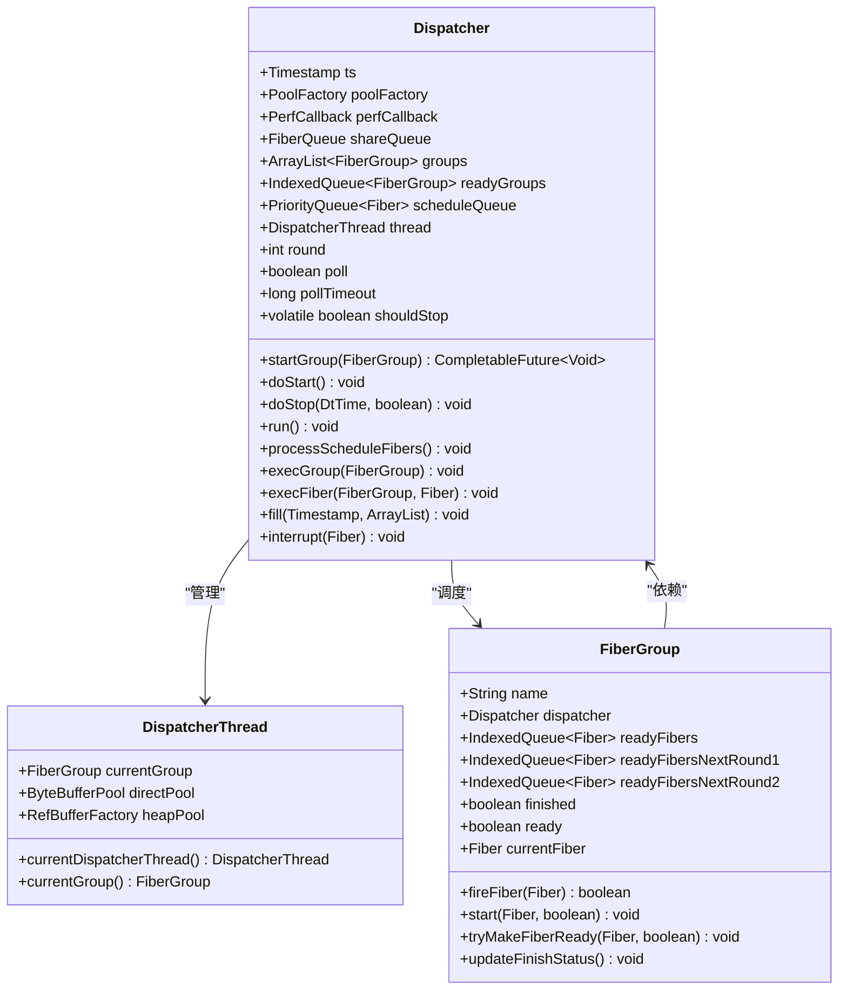
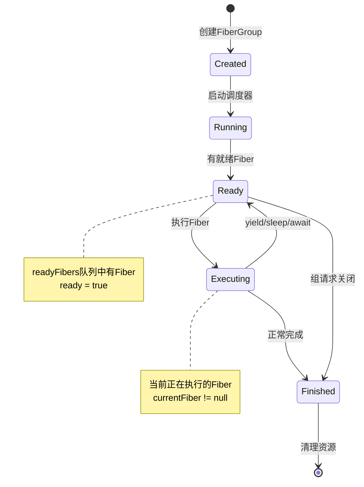
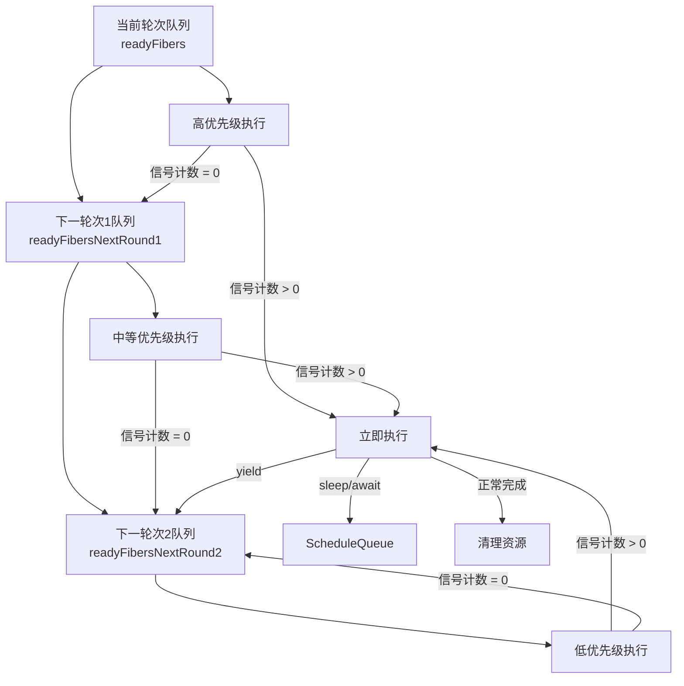
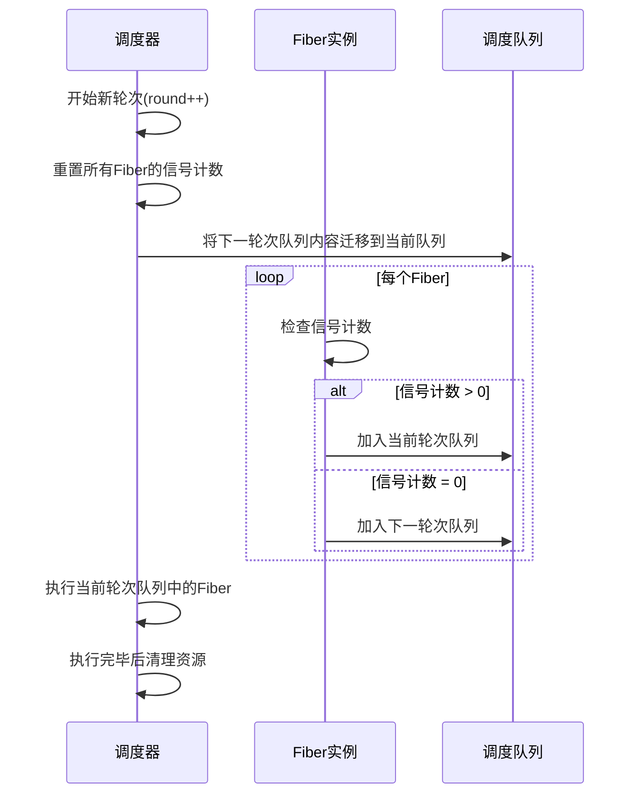
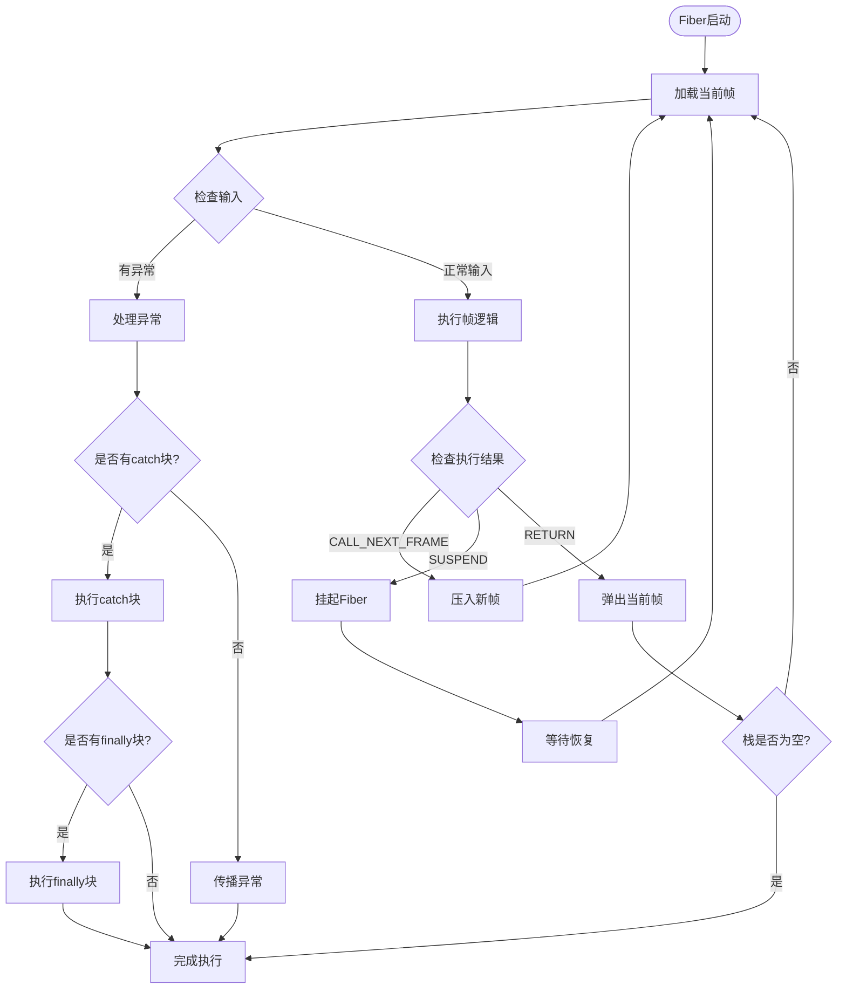
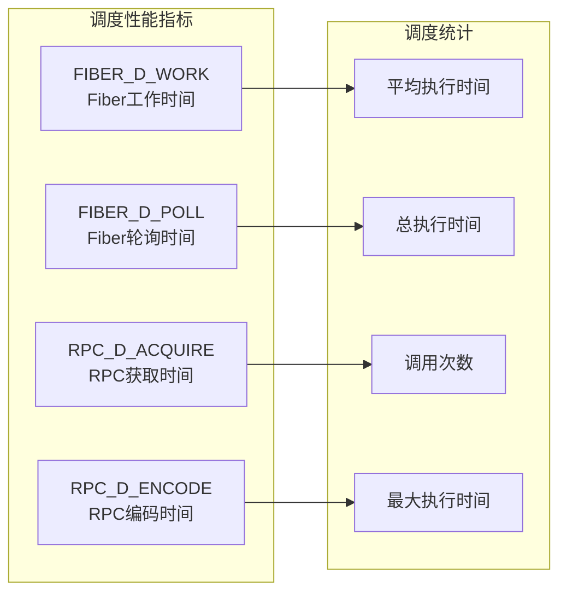
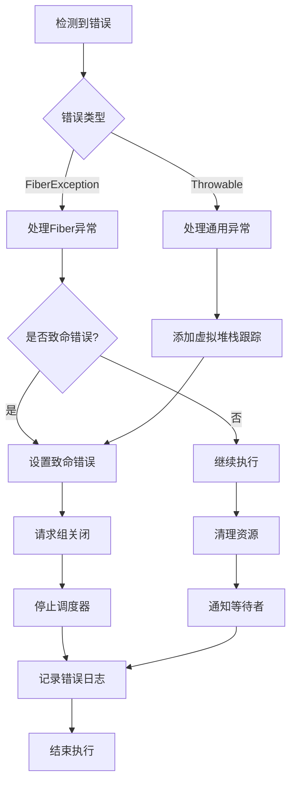

# Fiber调度机制

<cite>
**本文档中引用的文件**
- [Dispatcher.java](file://server/src/main/java/com/github/dtprj/dongting/fiber/Dispatcher.java)
- [DispatcherThread.java](file://server/src/main/java/com/github/dtprj/dongting/fiber/DispatcherThread.java)
- [FiberGroup.java](file://server/src/main/java/com/github/dtprj/dongting/fiber/FiberGroup.java)
- [Fiber.java](file://server/src/main/java/com/github/dtprj/dongting/fiber/Fiber.java)
- [FiberFrame.java](file://server/src/main/java/com/github/dtprj/dongting/fiber/FiberFrame.java)
- [FrameCall.java](file://server/src/main/java/com/github/dtprj/dongting/fiber/FrameCall.java)
- [FrameCallResult.java](file://server/src/main/java/com/github/dtprj/dongting/fiber/FrameCallResult.java)
- [SimplePerfCallback.java](file://benchmark/src/main/java/com/github/dtprj/dongting/bench/common/SimplePerfCallback.java)
</cite>

## 目录
1. [简介](#简介)
2. [核心架构概览](#核心架构概览)
3. [Dispatcher核心调度器](#dispatcher核心调度器)
4. [FiberGroup调度策略](#fiberGroup调度策略)
5. [三级调度队列机制](#三级调度队列机制)
6. [调度周期与信号计数](#调度周期与信号计数)
7. [上下文切换与帧执行](#上下文切换与帧执行)
8. [性能监控与调优](#性能监控与调优)
9. [故障处理与错误恢复](#故障处理与错误恢复)
10. [最佳实践与建议](#最佳实践与建议)

## 简介

Dongting Fiber调度机制是一个高性能的单线程事件循环模型，专为高并发场景设计。该系统通过精心设计的三级调度队列和智能的调度策略，实现了高效的协程调度和资源管理。

核心特点：
- **单线程事件循环**：所有Fiber在单一调度线程中执行
- **三级调度队列**：当前轮次、下一轮次1、下一轮次2的分层调度
- **信号计数机制**：基于信号计数的优先级调度
- **性能监控**：内置的性能回调系统
- **优雅关闭**：支持优雅的调度器停止和组关闭

## 核心架构概览



**图表来源**
- [Dispatcher.java](file://server/src/main/java/com/github/dtprj/dongting/fiber/Dispatcher.java#L67-L109)
- [FiberGroup.java](file://server/src/main/java/com/github/dtprj/dongting/fiber/FiberGroup.java#L32-L68)

## Dispatcher核心调度器

Dispatcher是整个Fiber调度系统的核心，负责协调所有FiberGroup的调度工作。

### 核心组件



**图表来源**
- [Dispatcher.java](file://server/src/main/java/com/github/dtprj/dongting/fiber/Dispatcher.java#L67-L109)
- [DispatcherThread.java](file://server/src/main/java/com/github/dtprj/dongting/fiber/DispatcherThread.java#L20-L49)
- [FiberGroup.java](file://server/src/main/java/com/github/dtprj/dongting/fiber/FiberGroup.java#L32-L68)

### 单线程事件循环模型

Dispatcher采用单线程事件循环模型，确保Fiber的串行执行：

```java
private void run() {
    try {
        ArrayList<FiberQueueTask> localData = new ArrayList<>(64);
        ts.refresh();
        while (!isShouldStopPlain() || !groups.isEmpty()) {
            runImpl(localData);
            if (isShouldStopPlain() && stopTimeout != null && stopTimeout.isTimeout(ts)) {
                long millis = stopTimeout.getTimeout(TimeUnit.MILLISECONDS);
                log.warn("dispatcher stop timeout: {}ms", millis);
                for (FiberGroup g : groups) {
                    g.fireLogGroupInfo("group not finished in " + millis + "ms");
                }
                stopTimeout = null;
            }
            round++;
        }
        shareQueue.shutdown();
        runImpl(localData);
        log.info("fiber dispatcher exit: {}", thread.getName());
    } catch (Throwable e) {
        SHOULD_STOP.setVolatile(this, true);
        log.info("fiber dispatcher exit exceptionally: {}", thread.getName(), e);
    } finally {
        poolFactory.destroyPool(thread.heapPool.getPool());
        poolFactory.destroyPool(thread.directPool);
    }
}
```

**章节来源**
- [Dispatcher.java](file://server/src/main/java/com/github/dtprj/dongting/fiber/Dispatcher.java#L125-L150)

## FiberGroup调度策略

FiberGroup是Fiber的逻辑容器，负责管理一组相关的Fiber，并实现智能的调度策略。

### 调度状态管理



### 三级调度队列

FiberGroup维护三个级别的调度队列，实现智能的优先级调度：

```java
final IndexedQueue<Fiber> readyFibers = new IndexedQueue<>(64);              // 当前轮次
final IndexedQueue<Fiber> readyFibersNextRound1 = new IndexedQueue<>(16);   // 下一轮次1
final IndexedQueue<Fiber> readyFibersNextRound2 = new IndexedQueue<>(16);   // 下一轮次2
```

每个Fiber都有一个信号计数器，控制其在不同轮次中的执行优先级：

```java
// (round << 16) | signalCountInCurrentRound
int roundInfo;

void tryMakeFiberReady(Fiber f, boolean addFirst) {
    if (finished) {
        log.warn("group finished, ignore makeReady: {}", f.name);
        return;
    }
    if (f.finished) {
        log.warn("fiber already finished, ignore makeReady: {}", f.name);
        return;
    }
    if (!f.ready) {
        f.ready = true;
        if ((f.roundInfo >>> 16) != (dispatcher.round & 0xFFFF)) {
            f.roundInfo = (dispatcher.round << 16) | f.signalCountInEachRound;
        }
        if ((f.roundInfo & 0xFFFF) == 0) {
            if (addFirst) {
                readyFibersNextRound1.addLast(f);
            } else {
                readyFibersNextRound2.addLast(f);
            }
        } else {
            if (addFirst) {
                readyFibers.addFirst(f);
            } else {
                readyFibers.addLast(f);
            }
            f.roundInfo--;
        }
        makeGroupReady();
    }
}
```

**章节来源**
- [FiberGroup.java](file://server/src/main/java/com/github/dtprj/dongting/fiber/FiberGroup.java#L42-L68)
- [FiberGroup.java](file://server/src/main/java/com/github/dtprj/dongting/fiber/FiberGroup.java#L180-L210)

## 三级调度队列机制

### 队列层级结构



### 性能优势

三级调度机制的优势：

1. **优先级控制**：通过信号计数器精确控制Fiber的执行优先级
2. **公平性保证**：避免饥饿问题，确保所有Fiber都能得到执行机会
3. **响应性提升**：高优先级任务可以快速获得执行机会
4. **资源利用优化**：合理分配CPU时间给不同类型的Fiber

### 信号计数机制

```java
// 初始化时设置信号计数
public Fiber(String name, FiberGroup fiberGroup, FiberFrame<Void> entryFrame, 
             boolean daemon, int signalCountInEachRound) {
    super(name, fiberGroup);
    this.stackTop = entryFrame;
    this.daemon = daemon;
    this.signalCountInEachRound = (short) signalCountInEachRound;
    this.roundInfo = this.signalCountInEachRound;
    entryFrame.init(this);
}

// 每轮执行后递减信号计数
if ((f.roundInfo & 0xFFFF) == 0) {
    if (addFirst) {
        readyFibersNextRound1.addLast(f);
    } else {
        readyFibersNextRound2.addLast(f);
    }
} else {
    if (addFirst) {
        readyFibers.addFirst(f);
    } else {
        readyFibers.addLast(f);
    }
    f.roundInfo--;
}
```

**章节来源**
- [Fiber.java](file://server/src/main/java/com/github/dtprj/dongting/fiber/Fiber.java#L48-L58)
- [FiberGroup.java](file://server/src/main/java/com/github/dtprj/dongting/fiber/FiberGroup.java#L195-L210)

## 调度周期与信号计数

### 调度周期概念

调度周期（round）是调度系统的基本时间单位，每轮调度都会更新调度周期计数：

```java
private void runImpl(ArrayList<FiberQueueTask> localData) {
    fill(ts, localData);
    PerfCallback c = perfCallback;
    long start = c.takeTime(PerfConsts.FIBER_D_WORK, ts);
    processScheduleFibers();
    // ... 处理本地任务 ...
    
    for (int len = readyGroups.size(), i = 0; i < len; i++) {
        FiberGroup g = readyGroups.removeFirst();
        execGroup(g);
        if (g.ready) {
            readyGroups.addLast(g);
        }
    }
    
    round++; // 更新调度周期
}
```

### 信号计数协同机制



**图表来源**
- [Dispatcher.java](file://server/src/main/java/com/github/dtprj/dongting/fiber/Dispatcher.java#L172-L207)

### 调度周期同步

```java
void tryMakeFiberReady(Fiber f, boolean addFirst) {
    if (!f.ready) {
        f.ready = true;
        if ((f.roundInfo >>> 16) != (dispatcher.round & 0xFFFF)) {
            // 如果Fiber的轮次信息过期，则重置信号计数
            f.roundInfo = (dispatcher.round << 16) | f.signalCountInEachRound;
        }
        // ... 根据信号计数选择队列 ...
    }
}
```

**章节来源**
- [Dispatcher.java](file://server/src/main/java/com/github/dtprj/dongting/fiber/Dispatcher.java#L172-L207)
- [FiberGroup.java](file://server/src/main/java/com/github/dtprj/dongting/fiber/FiberGroup.java#L180-L210)

## 上下文切换与帧执行

### Fiber执行流程



### 帧执行引擎

```java
private void execFiber(FiberGroup g, Fiber fiber) {
    try {
        g.currentFiber = fiber;
        FiberFrame currentFrame = fiber.stackTop;
        while (currentFrame != null) {
            execFrame(fiber, currentFrame);
            if (fatalError != null) {
                break;
            }
            if (!fiber.ready) {
                if (fiber.source == null && fiber.scheduleTimeout == 0) {
                    // yield操作
                    fiber.cleanSchedule();
                    fiber.ready = true;
                    fiber.group.readyFibersNextRound2.addLast(fiber);
                }
                return;
            }
            // 处理帧返回
            if (currentFrame == fiber.stackTop) {
                if (currentFrame.resumePoint != null) {
                    // 调用Fiber.resume
                    continue;
                }
                fiber.inputObj = currentFrame.frameResult;
                fiber.inputEx = currentFrame.frameEx;
                fiber.popFrame(); // 移除自身
            } else {
                // 调用新帧
            }
            currentFrame = fiber.stackTop;
        }
        
        // Fiber执行完成
        fiber.finished = true;
        fiber.ready = false;
        g.removeFiber(fiber);
        fiber.signalAll0(false);
    } finally {
        g.currentFiber = null;
        fatalError = null;
    }
}
```

### 异常处理机制

```java
private void execFrame(Fiber fiber, FiberFrame currentFrame) {
    try {
        if (fiber.inputEx != null) {
            // 子帧抛出异常，或在此帧挂起后被恢复
            Throwable x = fiber.inputEx;
            fiber.inputEx = null;
            fiber.inputObj = null;
            tryHandleEx(currentFrame, x);
        } else {
            try {
                Object input = fiber.inputObj;
                fiber.inputObj = null;
                FrameCall r = currentFrame.resumePoint;
                currentFrame.resumePoint = null;
                r.execute(input);
                if (fiber.inputEx != null) {
                    // Fiber.resumeEx()被调用
                    throw fiber.inputEx;
                }
            } catch (FiberException e) {
                tryHandleEx(currentFrame, e);
            } catch (Throwable e) {
                FiberException.addVirtualStackTrace(e, fiber);
                tryHandleEx(currentFrame, e);
            }
        }
    } finally {
        try {
            if (!currentFrame.finallyCalled && currentFrame.resumePoint == null) {
                currentFrame.catchCalled = true;
                currentFrame.finallyCalled = true;
                currentFrame.doFinally();
            }
        } catch (FiberException e) {
            setEx(currentFrame, e);
        } catch (Throwable e) {
            FiberException.addVirtualStackTrace(e, fiber);
            setEx(currentFrame, e);
        }
    }
}
```

**章节来源**
- [Dispatcher.java](file://server/src/main/java/com/github/dtprj/dongting/fiber/Dispatcher.java#L320-L360)
- [Dispatcher.java](file://server/src/main/java/com/github/dtprj/dongting/fiber/Dispatcher.java#L362-L400)

## 性能监控与调优

### PerfCallback系统

Dongting提供了强大的性能监控系统，通过PerfCallback接口收集详细的调度性能数据：

```java
public class SimplePerfCallback extends PerfCallback {
    private final ConcurrentHashMap<Integer, Value> map = new ConcurrentHashMap<>();
    private final String prefix;
    
    @Override
    public boolean accept(int perfType) {
        return started;
    }
    
    @Override
    public void onEvent(int perfType, long costTime, int count, long sum) {
        if (!started) {
            return;
        }
        Value value = map.computeIfAbsent(perfType, k -> new Value(getName(perfType)));
        value.invokeCount.add(1);
        value.count.add(count);
        value.time.add(costTime);
        value.sum.add(sum);
    }
    
    public void printStats() {
        map.forEach((perfType, value) -> {
            long invokeCount = value.invokeCount.sum();
            if (invokeCount == 0) {
                return;
            }
            long totalCount = value.count.sum();
            long totalSum = value.sum.sum();
            long totalTime = value.time.sum();
            double avgTime = totalTime / (double) invokeCount;
            double avgSum = totalSum / (double) invokeCount;
            double avgCount = totalCount / (double) invokeCount;
            
            String s = String.format("%s: call %,d, avgTime %,.3fus, totalTime %,.1fms, "
                    + "avgSum %,.1f, avgCount %,.1f, maxTime %,.3fus, "
                    + "maxSum %,d, maxCount %,d",
                    value.name, invokeCount, avgTime / 1000, totalTime / 1_000_000.0, 
                    avgSum, avgCount, value.maxTime.doubleValue() / 1000, 
                    value.maxSum.longValue(), value.maxCount.longValue());
            
            log.info(s);
        });
    }
}
```

### 关键性能指标



**图表来源**
- [SimplePerfCallback.java](file://benchmark/src/main/java/com/github/dtprj/dongting/bench/common/SimplePerfCallback.java#L40-L80)

### 调优建议

1. **合理设置信号计数**：
   ```java
   // 对于高频任务，使用较低的信号计数
   Fiber fiber = new Fiber("high-priority", group, frame, false, 1);
   
   // 对于低频任务，使用较高的信号计数
   Fiber fiber = new Fiber("low-priority", group, frame, false, 10);
   ```

2. **监控调度延迟**：
   ```java
   // 启用性能监控
   SimplePerfCallback callback = new SimplePerfCallback("myapp_");
   callback.start();
   
   // 在调度器中使用
   Dispatcher dispatcher = new Dispatcher("my-dispatcher", factory, callback);
   ```

3. **优化队列大小**：
   ```java
   // 根据Fiber数量调整队列大小
   final IndexedQueue<Fiber> readyFibers = new IndexedQueue<>(128); // 默认64
   final IndexedQueue<Fiber> readyFibersNextRound1 = new IndexedQueue<>(32); // 默认16
   ```

**章节来源**
- [SimplePerfCallback.java](file://benchmark/src/main/java/com/github/dtprj/dongting/bench/common/SimplePerfCallback.java#L40-L80)

## 故障处理与错误恢复

### 致命错误处理

```java
static void call(FiberFrame subFrame, FrameCall resumePoint) {
    Fiber fiber = getCurrentFiberAndCheck(null);
    checkReentry(fiber);
    FiberFrame currentFrame = fiber.stackTop;
    currentFrame.resumePoint = resumePoint;
    subFrame.init(fiber);
    fiber.pushFrame(subFrame);
}

static FrameCallResult awaitOn(WaitSource c, long nanos, FrameCall resumePoint) {
    Fiber fiber = getCurrentFiberAndCheck(c.group);
    return awaitOn(fiber, c, nanos, resumePoint);
}

static FrameCallResult awaitOn(Fiber fiber, WaitSource c, long nanos, FrameCall resumePoint) {
    checkInterrupt(fiber);
    checkReentry(fiber);
    return awaitOn0(fiber, c, nanos, resumePoint);
}
```

### 中断处理机制

```java
void interrupt(Fiber fiber) {
    if (fiber.finished || fiber.group.finished) {
        return;
    }
    if (!fiber.started || fiber.ready) {
        fiber.interrupted = true;
    } else {
        String str;
        if (fiber.source != null) {
            WaitSource s = fiber.source;
            // 移除等待者
            s.waiters.remove(fiber);
            fiber.source = null;
            if (fiber.sourceConditions != null) {
                for (FiberCondition c : fiber.sourceConditions) {
                    c.waiters.remove(fiber);
                }
                str = s + " and other " + (fiber.sourceConditions.length - 1) + " conditions";
                fiber.sourceConditions = null;
            } else {
                str = s.toString();
            }
        } else {
            str = "sleep";
        }
        fiber.stackTop.resumePoint = null;
        fiber.interrupted = false;
        fiber.inputEx = new FiberInterruptException("fiber is interrupted during wait " + str);
        if (fiber.scheduleTimeout > 0) {
            scheduleQueue.remove(fiber);
            fiber.cleanSchedule();
        }
        fiber.group.tryMakeFiberReady(fiber, false);
    }
}
```

### 错误恢复策略



**章节来源**
- [Dispatcher.java](file://server/src/main/java/com/github/dtprj/dongting/fiber/Dispatcher.java#L543-L582)

## 最佳实践与建议

### Fiber设计原则

1. **保持Fiber短小精悍**：
   ```java
   // 推荐：短小的Fiber，专注于单一职责
   Fiber fiber = new Fiber("process-request", group, new FiberFrame<>() {
       @Override
       public FrameCallResult execute(Void input) {
           return processRequest(this);
       }
       
       private FrameCallResult processRequest(FrameCall<Void> resumePoint) {
           // 实际业务逻辑
           return Fiber.frameReturn();
       }
   });
   ```

2. **合理使用信号计数**：
   ```java
   // 高优先级任务：频繁执行，使用低信号计数
   Fiber highPriority = new Fiber("high-priority", group, highPriorityFrame, false, 1);
   
   // 低优先级任务：不频繁执行，使用高信号计数
   Fiber lowPriority = new Fiber("low-priority", group, lowPriorityFrame, false, 10);
   ```

3. **避免长时间阻塞**：
   ```java
   // 使用yield让出CPU时间
   public FrameCallResult longOperation(FrameCall<Void> resumePoint) {
       for (int i = 0; i < 1000; i++) {
           if (i % 100 == 0) {
               // 定期让出CPU
               return Fiber.yield(this);
           }
           // 执行实际操作
           performOperation(i);
       }
       return Fiber.frameReturn();
   }
   ```

### 调度器配置优化

1. **合理设置轮询超时**：
   ```java
   // 根据应用特性调整轮询超时
   dispatcher.pollTimeout = TimeUnit.MILLISECONDS.toNanos(100); // 默认50ms
   ```

2. **监控调度性能**：
   ```java
   // 启用性能监控并定期打印统计
   SimplePerfCallback callback = new SimplePerfCallback("app_");
   callback.start();
   
   // 定期打印性能统计
   Executors.newScheduledThreadPool(1).scheduleAtFixedRate(
       () -> callback.printStats(), 
       60, 60, TimeUnit.SECONDS
   );
   ```

3. **优雅关闭策略**：
   ```java
   // 设置合理的关闭超时
   dispatcher.stop(new DtTime(10, TimeUnit.SECONDS));
   
   // 等待所有Fiber组完成
   for (FiberGroup group : groups) {
       group.shutdownFuture.get(10, TimeUnit.SECONDS);
   }
   ```

### 内存管理建议

1. **对象池配置**：
   ```java
   // 配置合适的缓冲区池
   DefaultPoolFactory factory = new DefaultPoolFactory();
   factory.setBufferSize(8192); // 根据实际需求调整
   factory.setMaxPoolSize(1000);
   ```

2. **及时释放资源**：
   ```java
   // 在Fiber完成时释放资源
   public FrameCallResult cleanupResource(FrameCall<Void> resumePoint) {
       try {
           // 执行业务逻辑
           return Fiber.frameReturn();
       } finally {
           // 确保资源被释放
           resource.close();
       }
   }
   ```

通过遵循这些最佳实践，可以充分发挥Dongting Fiber调度机制的性能优势，构建高效、稳定的并发应用程序。