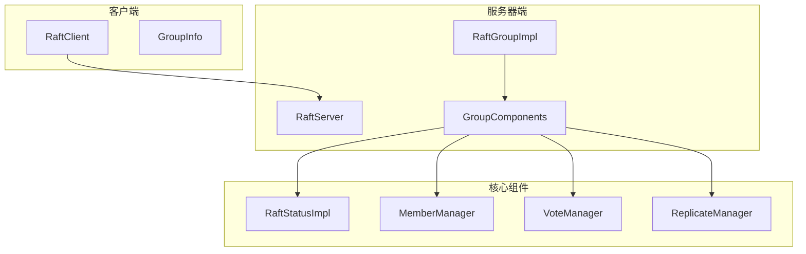
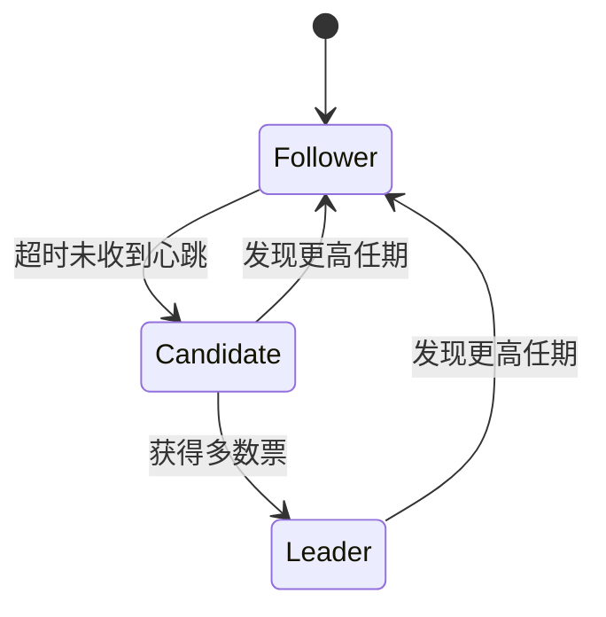
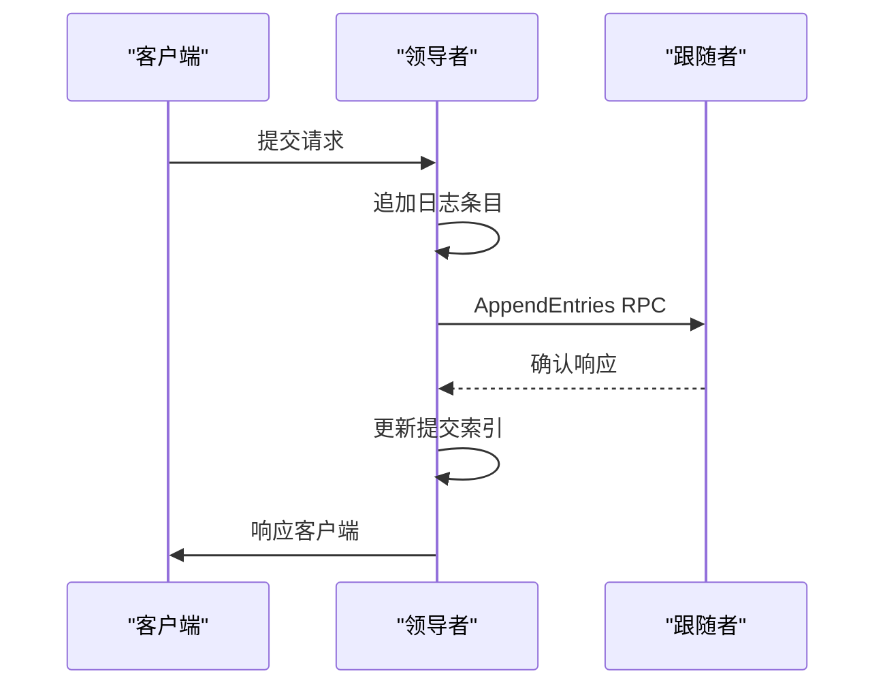
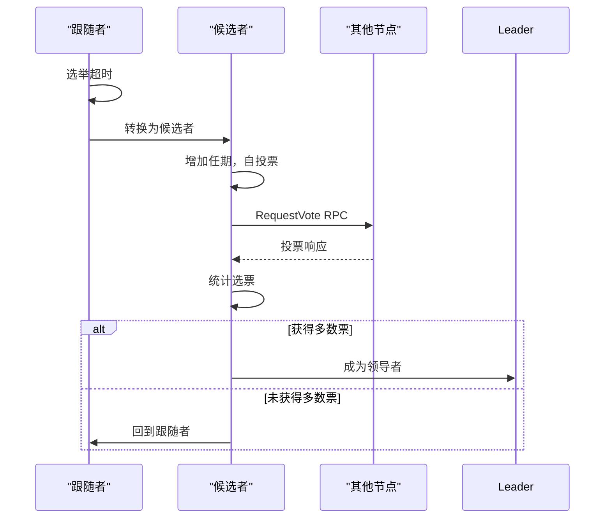
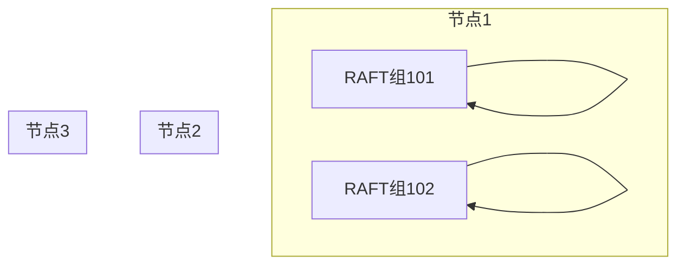
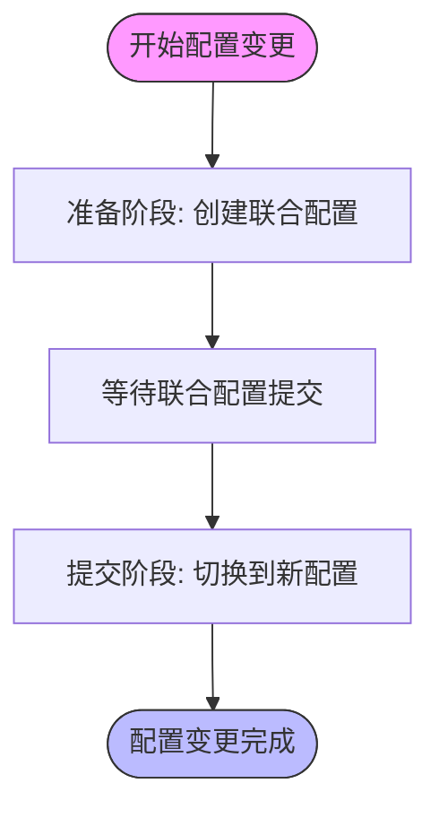
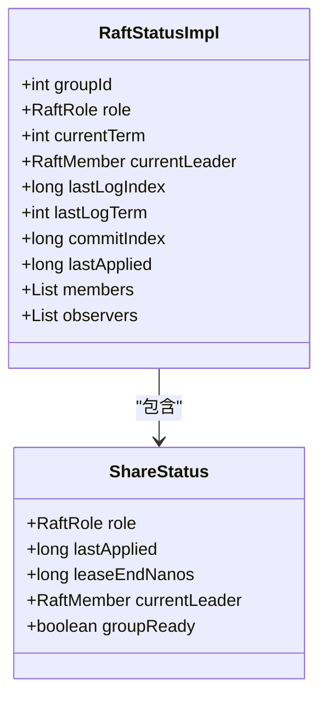
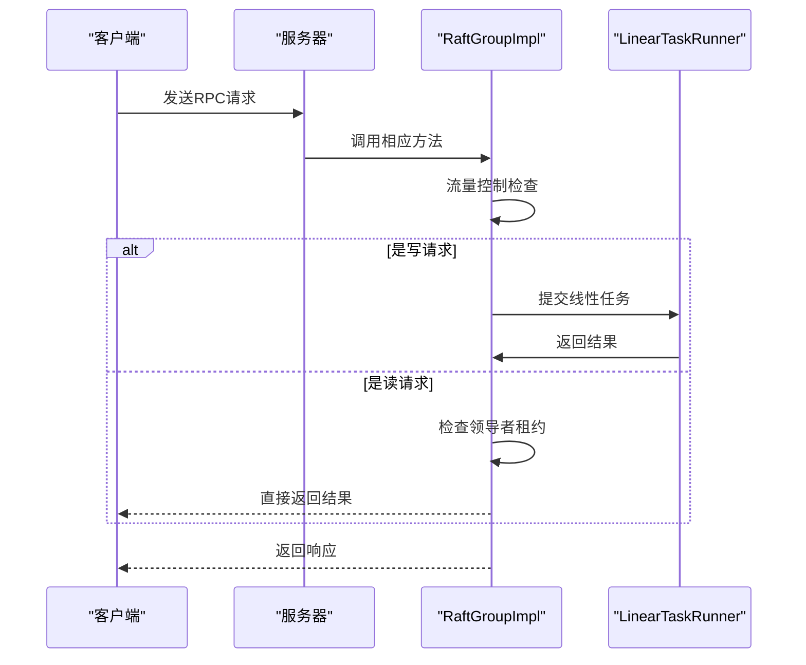

# RAFT实现详解

<cite>
**本文档引用的文件**  
- [RaftGroupImpl.java](file://server/src/main/java/com/github/dtprj/dongting/raft/impl/RaftGroupImpl.java)
- [RaftStatusImpl.java](file://server/src/main/java/com/github/dtprj/dongting/raft/impl/RaftStatusImpl.java)
- [MemberManager.java](file://server/src/main/java/com/github/dtprj/dongting/raft/impl/MemberManager.java)
- [VoteManager.java](file://server/src/main/java/com/github/dtprj/dongting/raft/impl/VoteManager.java)
- [ReplicateManager.java](file://server/src/main/java/com/github/dtprj/dongting/raft/impl/ReplicateManager.java)
- [GroupComponents.java](file://server/src/main/java/com/github/dtprj/dongting/raft/impl/GroupComponents.java)
- [RaftRole.java](file://server/src/main/java/com/github/dtprj/dongting/raft/impl/RaftRole.java)
- [RaftUtil.java](file://server/src/main/java/com/github/dtprj/dongting/raft/impl/RaftUtil.java)
- [MultiRaftDemoServer1.java](file://demos/src/main/java/com/github/dtprj/dongting/demos/multiraft/MultiRaftDemoServer1.java)
- [ConfigChangeDemoServer1.java](file://demos/src/main/java/com/github/dtprj/dongting/demos/configchange/ConfigChangeDemoServer1.java)
</cite>

## 目录
1. [项目结构](#项目结构)
2. [核心组件](#核心组件)
3. [角色转换机制](#角色转换机制)
4. [日志复制流程](#日志复制流程)
5. [选举机制](#选举机制)
6. [多RAFT组支持](#多raft组支持)
7. [动态配置变更](#动态配置变更)
8. [状态管理](#状态管理)
9. [RPC请求处理](#rpc请求处理)

## 项目结构

该项目实现了基于RAFT共识算法的分布式系统，主要包含客户端和服务器端两个部分。服务器端实现了完整的RAFT算法，包括领导者选举、日志复制、成员变更等核心功能。

**图示来源**
- [RaftClient.java](file://client/src/main/java/com/github/dtprj/dongting/raft/RaftClient.java)
- [RaftServer.java](file://server/src/main/java/com/github/dtprj/dongting/raft/server/RaftServer.java)
- [RaftGroupImpl.java](file://server/src/main/java/com/github/dtprj/dongting/raft/impl/RaftGroupImpl.java)
- [GroupComponents.java](file://server/src/main/java/com/github/dtprj/dongting/raft/impl/GroupComponents.java)

**本节来源**
- [项目结构信息](file://workspace_path)

## 核心组件

本项目中的RAFT实现由多个核心组件构成，这些组件协同工作以实现分布式一致性。`RaftGroupImpl`是RAFT组的主要实现类，它封装了RAFT算法的所有功能。`GroupComponents`类包含了RAFT组所需的所有组件引用，包括状态管理、成员管理、投票管理等。

`RaftStatusImpl`类负责管理RAFT节点的内部状态，包括当前角色、任期、日志索引等关键信息。`MemberManager`负责管理集群成员，处理成员变更操作。`VoteManager`负责处理选举相关的逻辑，包括发起投票和处理投票响应。`ReplicateManager`负责日志复制的管理，确保日志在集群中正确复制。

**本节来源**
- [RaftGroupImpl.java](file://server/src/main/java/com/github/dtprj/dongting/raft/impl/RaftGroupImpl.java#L0-L259)
- [GroupComponents.java](file://server/src/main/java/com/github/dtprj/dongting/raft/impl/GroupComponents.java#L0-L54)

## 角色转换机制

RAFT算法中的节点有三种角色：领导者（Leader）、跟随者（Follower）和候选者（Candidate）。角色转换是通过状态机实现的，当特定条件满足时，节点会在不同角色之间转换。

当节点启动或发现领导者失效时，会从跟随者转换为候选者并发起选举。如果获得多数票，则转换为领导者；否则回到跟随者角色。领导者在正常运行时保持领导者角色，当检测到更高任期的领导者时，会转换为跟随者。

**图示来源**
- [RaftRole.java](file://server/src/main/java/com/github/dtprj/dongting/raft/impl/RaftRole.java)
- [RaftUtil.java](file://server/src/main/java/com/github/dtprj/dongting/raft/impl/RaftUtil.java#L278-L295)

**本节来源**
- [RaftStatusImpl.java](file://server/src/main/java/com/github/dtprj/dongting/raft/impl/RaftStatusImpl.java#L0-L199)
- [RaftUtil.java](file://server/src/main/java/com/github/dtprj/dongting/raft/impl/RaftUtil.java#L165-L200)

## 日志复制流程

日志复制是RAFT算法的核心功能之一，确保所有节点的状态机保持一致。领导者负责接收客户端请求并将其作为日志条目追加到自己的日志中，然后通过AppendEntries RPC将日志复制到其他节点。

领导者维护每个跟随者的nextIndex（下一次要发送的日志索引）和matchIndex（已知与领导者匹配的最高日志索引）。当领导者首次与跟随者通信时，nextIndex设置为领导者最后一条日志的索引加1。如果AppendEntries RPC失败，领导者会递减nextIndex并重试，直到找到匹配的日志条目。

**图示来源**
- [ReplicateManager.java](file://server/src/main/java/com/github/dtprj/dongting/raft/impl/ReplicateManager.java#L0-L199)
- [AbstractLeaderRepFrame.java](file://server/src/main/java/com/github/dtprj/dongting/raft/impl/ReplicateManager.java#L200-L400)

**本节来源**
- [ReplicateManager.java](file://server/src/main/java/com/github/dtprj/dongting/raft/impl/ReplicateManager.java#L0-L199)
- [RaftGroupImpl.java](file://server/src/main/java/com/github/dtprj/dongting/raft/impl/RaftGroupImpl.java#L100-L150)

## 选举机制

选举机制是RAFT算法保证高可用性的关键。当跟随者在选举超时时间内未收到领导者的心跳时，会转换为候选者并发起新的选举。

选举过程中，候选者会向集群中的所有节点发送RequestVote RPC请求投票。节点会根据选举安全原则决定是否投票，主要包括：只投票给日志至少和自己一样新的候选者，以及在同一个任期内最多只投一次票。

**图示来源**
- [VoteManager.java](file://server/src/main/java/com/github/dtprj/dongting/raft/impl/VoteManager.java#L0-L199)
- [RaftRole.java](file://server/src/main/java/com/github/dtprj/dongting/raft/impl/RaftRole.java)

**本节来源**
- [VoteManager.java](file://server/src/main/java/com/github/dtprj/dongting/raft/impl/VoteManager.java#L0-L199)
- [RaftUtil.java](file://server/src/main/java/com/github/dtprj/dongting/raft/impl/RaftUtil.java#L165-L200)

## 多RAFT组支持

本实现支持多个独立的RAFT组共存于同一集群中，每个RAFT组管理自己的状态机和日志。这种设计允许多个独立的服务共享同一套基础设施，提高资源利用率。

每个RAFT组有独立的groupId，通过`MultiRaftDemoServer1`示例可以看出，一个节点可以同时参与多个RAFT组。这种设计通过将不同业务的数据隔离在不同的RAFT组中，实现了多租户支持和资源隔离。

**图示来源**
- [MultiRaftDemoServer1.java](file://demos/src/main/java/com/github/dtprj/dongting/demos/multiraft/MultiRaftDemoServer1.java#L0-L31)
- [RaftGroupImpl.java](file://server/src/main/java/com/github/dtprj/dongting/raft/impl/RaftGroupImpl.java#L0-L259)

**本节来源**
- [MultiRaftDemoServer1.java](file://demos/src/main/java/com/github/dtprj/dongting/demos/multiraft/MultiRaftDemoServer1.java#L0-L31)
- [RaftGroupImpl.java](file://server/src/main/java/com/github/dtprj/dongting/raft/impl/RaftGroupImpl.java#L0-L259)

## 动态配置变更

动态配置变更允许在不中断服务的情况下添加或移除RAFT集群的节点。本实现支持联合共识（Joint Consensus）方式的配置变更，确保变更过程中的安全性。

配置变更通过`leaderPrepareJointConsensus`方法发起，领导者首先创建一个包含新旧配置的联合配置，等待该配置被多数节点确认后，再通过`leaderCommitJointConsensus`方法提交变更。这种方式确保了在任何时刻都有一个多数派可以达成共识，避免了脑裂问题。

**图示来源**
- [MemberManager.java](file://server/src/main/java/com/github/dtprj/dongting/raft/impl/MemberManager.java#L874-L908)
- [RaftGroupImpl.java](file://server/src/main/java/com/github/dtprj/dongting/raft/impl/RaftGroupImpl.java#L200-L259)

**本节来源**
- [MemberManager.java](file://server/src/main/java/com/github/dtprj/dongting/raft/impl/MemberManager.java#L874-L908)
- [ConfigChangeDemoServer1.java](file://demos/src/main/java/com/github/dtprj/dongting/demos/configchange/ConfigChangeDemoServer1.java#L0-L31)

## 状态管理

状态管理是RAFT实现的核心，`RaftStatusImpl`类负责维护节点的所有状态信息。这些状态包括当前角色、任期、日志索引、领导者信息等。

状态管理采用了共享状态模式，通过`ShareStatus`对象提供只读视图，避免了频繁的同步开销。当状态发生变化时，会创建新的`ShareStatus`实例，确保读取操作的原子性和一致性。

**图示来源**
- [RaftStatusImpl.java](file://server/src/main/java/com/github/dtprj/dongting/raft/impl/RaftStatusImpl.java#L0-L199)
- [RaftRole.java](file://server/src/main/java/com/github/dtprj/dongting/raft/impl/RaftRole.java)

**本节来源**
- [RaftStatusImpl.java](file://server/src/main/java/com/github/dtprj/dongting/raft/impl/RaftStatusImpl.java#L0-L199)
- [RaftUtil.java](file://server/src/main/java/com/github/dtprj/dongting/raft/impl/RaftUtil.java#L278-L295)

## RPC请求处理

RPC请求处理是RAFT节点间通信的基础。本实现通过`RaftGroupImpl`类的相应方法处理各种RPC请求，包括日志复制、投票请求、状态查询等。

RPC请求处理包含了流量控制机制，通过`maxPendingRaftTasks`和`maxPendingTaskBytes`参数限制待处理请求的数量和总大小，防止节点过载。对于只读请求，领导者可以在本地直接响应，无需写入日志，提高了读取性能。

**图示来源**
- [RaftGroupImpl.java](file://server/src/main/java/com/github/dtprj/dongting/raft/impl/RaftGroupImpl.java#L100-L150)
- [LinearTaskRunner.java](file://server/src/main/java/com/github/dtprj/dongting/raft/impl/LinearTaskRunner.java)

**本节来源**
- [RaftGroupImpl.java](file://server/src/main/java/com/github/dtprj/dongting/raft/impl/RaftGroupImpl.java#L100-L150)
- [RaftGroupImpl.java](file://server/src/main/java/com/github/dtprj/dongting/raft/impl/RaftGroupImpl.java#L150-L200)