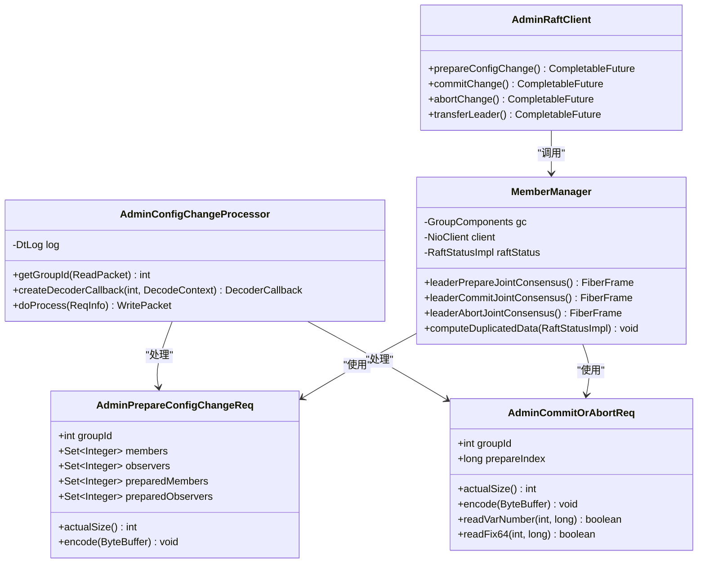
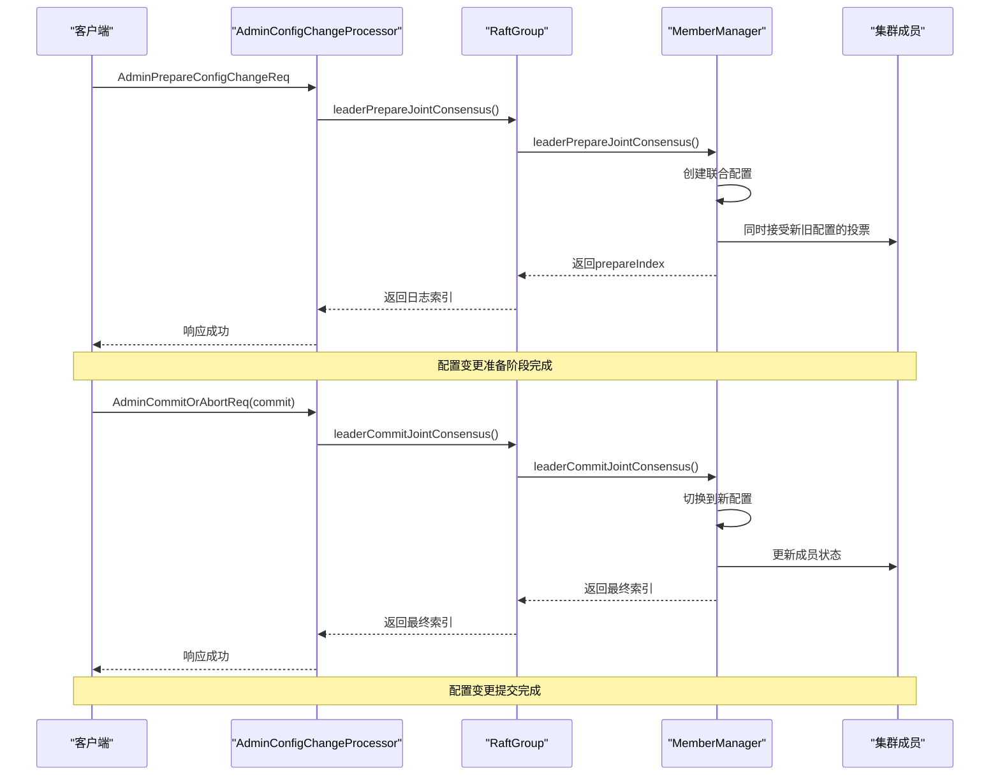
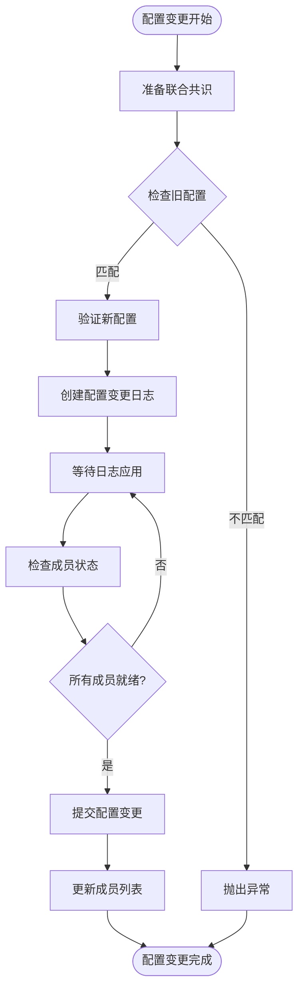
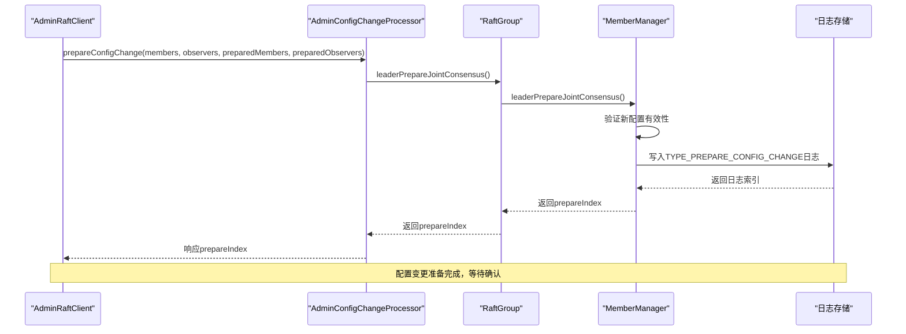
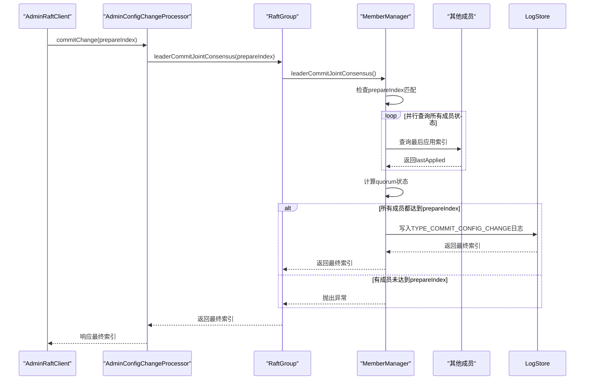

# 动态配置变更

<cite>
**本文档中引用的文件**
- [AdminPrepareConfigChangeReq.java](file://server/src/main/java/com/github/dtprj/dongting/raft/rpc/AdminPrepareConfigChangeReq.java)
- [AdminCommitOrAbortReq.java](file://server/src/main/java/com/github/dtprj/dongting/raft/rpc/AdminCommitOrAbortReq.java)
- [AdminConfigChangeProcessor.java](file://server/src/main/java/com/github/dtprj/dongting/raft/rpc/AdminConfigChangeProcessor.java)
- [MemberManager.java](file://server/src/main/java/com/github/dtprj/dongting/raft/impl/MemberManager.java)
- [AdminRaftClient.java](file://server/src/main/java/com/github/dtprj/dongting/raft/admin/AdminRaftClient.java)
- [TransferLeaderReq.java](file://server/src/main/java/com/github/dtprj/dongting/raft/rpc/TransferLeaderReq.java)
- [AdminTransferLeaderProcessor.java](file://server/src/main/java/com/github/dtprj/dongting/raft/rpc/AdminTransferLeaderProcessor.java)
- [RaftGroup.java](file://server/src/main/java/com/github/dtprj/dongting/raft/server/RaftGroup.java)
- [RaftGroupImpl.java](file://server/src/main/java/com/github/dtprj/dongting/raft/impl/RaftGroupImpl.java)
- [ConfigChangeTest.java](file://server/src/test/java/com/github/dtprj/dongting/raft/server/ConfigChangeTest.java)
</cite>

## 目录
1. [概述](#概述)
2. [核心组件架构](#核心组件架构)
3. [配置变更请求类型](#配置变更请求类型)
4. [联合共识机制](#联合共识机制)
5. [成员管理器](#成员管理器)
6. [配置变更流程详解](#配置变更流程详解)
7. [实际操作示例](#实际操作示例)
8. [风险点与最佳实践](#风险点与最佳实践)
9. [故障排除指南](#故障排除指南)
10. [总结](#总结)

## 概述

Dongting Raft实现提供了完整的动态配置变更功能，支持安全的成员节点添加和移除操作。该系统采用联合共识（Joint Consensus）机制，在保证数据一致性的前提下完成集群配置的平滑过渡。

动态配置变更的核心目标是：
- 安全地添加新节点到集群
- 安全地从集群中移除节点
- 在变更过程中保持服务可用性
- 确保数据完整性和一致性
- 提供回滚机制应对失败场景

## 核心组件架构



**图表来源**
- [AdminConfigChangeProcessor.java](file://server/src/main/java/com/github/dtprj/dongting/raft/rpc/AdminConfigChangeProcessor.java#L31-L102)
- [MemberManager.java](file://server/src/main/java/com/github/dtprj/dongting/raft/impl/MemberManager.java#L60-L150)

## 配置变更请求类型

### AdminPrepareConfigChangeReq

这是配置变更的第一阶段请求，用于准备新的集群配置：

```java
public class AdminPrepareConfigChangeReq extends RaftConfigRpcData implements SimpleEncodable {
    public int groupId;
    public Set<Integer> members;              // 当前活跃成员
    public Set<Integer> observers;            // 观察者节点
    public Set<Integer> preparedMembers;      // 准备加入的新成员
    public Set<Integer> preparedObservers;    // 准备加入的新观察者
}
```

该请求包含以下关键字段：
- **groupId**: 集群标识符
- **members**: 当前活跃的成员节点集合
- **observers**: 当前活跃的观察者节点集合  
- **preparedMembers**: 即将加入的新成员节点集合
- **preparedObservers**: 即将加入的新观察者节点集合

### AdminCommitOrAbortReq

此请求用于提交或中止配置变更：

```java
public class AdminCommitOrAbortReq extends PbCallback<AdminCommitOrAbortReq> implements SimpleEncodable {
    public int groupId;
    public long prepareIndex;                 // 准备阶段的日志索引
}
```

**章节来源**
- [AdminPrepareConfigChangeReq.java](file://server/src/main/java/com/github/dtprj/dongting/raft/rpc/AdminPrepareConfigChangeReq.java#L30-L111)
- [AdminCommitOrAbortReq.java](file://server/src/main/java/com/github/dtprj/dongting/raft/rpc/AdminCommitOrAbortReq.java#L25-L66)

## 联合共识机制

联合共识是Dongting实现配置变更的核心机制，它允许在新旧配置之间进行平滑过渡。



**图表来源**
- [AdminConfigChangeProcessor.java](file://server/src/main/java/com/github/dtprj/dongting/raft/rpc/AdminConfigChangeProcessor.java#L68-L102)
- [MemberManager.java](file://server/src/main/java/com/github/dtprj/dongting/raft/impl/MemberManager.java#L400-L500)

### 联合共识的工作原理

1. **准备阶段**: 创建联合配置，同时接受新旧配置的投票
2. **检查阶段**: 确保所有成员都应用到准备索引
3. **提交阶段**: 切换到新配置并更新成员状态
4. **清理阶段**: 移除不再需要的旧成员连接

**章节来源**
- [MemberManager.java](file://server/src/main/java/com/github/dtprj/dongting/raft/impl/MemberManager.java#L400-L600)

## 成员管理器

MemberManager是负责管理集群成员状态的核心组件，它维护着新旧配置的过渡状态。

### 主要职责



**图表来源**
- [MemberManager.java](file://server/src/main/java/com/github/dtprj/dongting/raft/impl/MemberManager.java#L350-L450)

### 成员状态管理

MemberManager维护以下关键状态：

1. **当前成员 (members)**: 正常参与投票的活跃节点
2. **观察者 (observers)**: 只接收日志但不参与投票的节点
3. **准备成员 (preparedMembers)**: 即将加入的新成员
4. **准备观察者 (preparedObservers)**: 即将加入的新观察者

### 状态计算方法

```java
static void computeDuplicatedData(RaftStatusImpl raftStatus) {
    ArrayList<RaftMember> replicateList = new ArrayList<>();
    Set<Integer> memberIds = new HashSet<>();
    Set<Integer> observerIds = new HashSet<>();
    Set<Integer> jointMemberIds = new HashSet<>();
    Set<Integer> jointObserverIds = new HashSet<>();
    
    // 合并所有成员到复制列表
    for (RaftMember m : raftStatus.members) {
        replicateList.add(m);
        memberIds.add(m.node.nodeId);
    }
    // ... 其他状态合并逻辑
}
```

**章节来源**
- [MemberManager.java](file://server/src/main/java/com/github/dtprj/dongting/raft/impl/MemberManager.java#L150-L200)

## 配置变更流程详解

### 第一阶段：准备配置变更



**图表来源**
- [AdminRaftClient.java](file://server/src/main/java/com/github/dtprj/dongting/raft/admin/AdminRaftClient.java#L91-L112)
- [MemberManager.java](file://server/src/main/java/com/github/dtprj/dongting/raft/impl/MemberManager.java#L350-L400)

### 第二阶段：提交配置变更



**图表来源**
- [MemberManager.java](file://server/src/main/java/com/github/dtprj/dongting/raft/impl/MemberManager.java#L450-L650)

### 第三阶段：中止配置变更

如果配置变更出现问题，可以中止整个过程：

```java
public CompletableFuture<Long> leaderAbortJointConsensus() {
    CompletableFuture<Long> f = new CompletableFuture<>();
    FiberFrame<Void> ff = groupComponents.memberManager.leaderAbortJointConsensus(f);
    groupComponents.fiberGroup.fireFiber("leaderAbortJointConsensus", ff);
    return f;
}
```

**章节来源**
- [RaftGroupImpl.java](file://server/src/main/java/com/github/dtprj/dongting/raft/impl/RaftGroupImpl.java#L200-L250)

## 实际操作示例

### 添加新节点示例

以下是一个完整的添加新节点的示例：

```java
// 1. 准备配置变更 - 添加新成员
CompletableFuture<Long> prepareFuture = adminClient.prepareConfigChange(
    groupId,                    // 集群ID
    Set.of(2, 3),              // 当前成员 (2, 3)
    Set.of(),                  // 当前观察者
    Set.of(2, 3, 4),           // 新成员 (2, 3, 4)
    Set.of(),                  // 新观察者
    timeout                   // 超时时间
);

long prepareIndex = prepareFuture.get(5, TimeUnit.SECONDS);

// 2. 提交配置变更
CompletableFuture<Long> commitFuture = adminClient.commitChange(
    groupId,
    prepareIndex,
    timeout
);

commitFuture.get(5, TimeUnit.SECONDS);

// 3. 验证新配置生效
int leaderId = adminClient.getGroup(groupId).leader.nodeId;
CompletableFuture<QueryStatusResp> queryStatusFuture = 
    adminClient.queryRaftServerStatus(leaderId, groupId);
assertEquals(3, queryStatusFuture.get(5, TimeUnit.SECONDS).members.size());
```

### 移除节点示例

```java
// 1. 准备配置变更 - 移除成员
CompletableFuture<Long> prepareFuture = adminClient.prepareConfigChange(
    groupId,
    Set.of(2, 3, 4),          // 当前成员 (2, 3, 4)
    Set.of(),                 // 当前观察者
    Set.of(2, 4),             // 新成员 (2, 4) - 移除3
    Set.of(),                 // 新观察者
    timeout
);

// 2. 转移领导权到新成员
adminClient.transferLeader(groupId, leaderId, 4, timeout).get(5, TimeUnit.SECONDS);

// 3. 提交配置变更
CompletableFuture<Long> commitFuture = adminClient.commitChange(
    groupId,
    prepareIndex,
    timeout
);
```

### 转移领导权示例

```java
// 转移领导权到新节点
adminClient.transferLeader(groupId, oldLeaderId, newLeaderId, timeout).get(5, TimeUnit.SECONDS);
```

**章节来源**
- [ConfigChangeTest.java](file://server/src/test/java/com/github/dtprj/dongting/raft/server/ConfigChangeTest.java#L40-L120)

## 风险点与最佳实践

### 风险点分析

1. **网络分区风险**
   - 配置变更期间可能出现网络分区
   - 导致部分节点无法达成共识
   - 解决方案：确保大多数节点可达

2. **数据丢失风险**
   - 中止配置变更可能导致部分数据丢失
   - 解决方案：定期备份和快照

3. **性能影响**
   - 配置变更期间可能影响读写性能
   - 解决方案：选择低峰期执行变更

### 最佳实践

1. **分阶段验证**
   ```java
   // 先验证新配置的有效性
   CompletableFuture<Long> prepareFuture = adminClient.prepareConfigChange(...);
   long prepareIndex = prepareFuture.get();
   
   // 检查新配置是否正常工作
   Thread.sleep(1000); // 等待新配置稳定
   
   // 再提交变更
   adminClient.commitChange(groupId, prepareIndex, timeout);
   ```

2. **监控和告警**
   ```java
   // 监控配置变更进度
   CompletableFuture<QueryStatusResp> statusFuture = 
       adminClient.queryRaftServerStatus(nodeId, groupId);
   QueryStatusResp status = statusFuture.get();
   
   // 检查成员状态
   if (status.members.size() != expectedMemberCount) {
       // 发送告警
   }
   ```

3. **回滚策略**
   ```java
   try {
       // 执行配置变更
       adminClient.prepareConfigChange(...);
       adminClient.commitChange(...);
   } catch (Exception e) {
       // 发生错误，中止配置变更
       adminClient.abortChange(groupId, timeout);
   }
   ```

### 性能优化建议

1. **批量操作**: 尽量减少配置变更的频率
2. **异步处理**: 使用异步API避免阻塞
3. **资源控制**: 设置合理的超时和重试机制
4. **监控指标**: 关注配置变更的延迟和成功率

## 故障排除指南

### 常见问题及解决方案

1. **prepareIndex不匹配**
   ```
   错误信息: prepareIndex not match
   原因: 日志应用不同步
   解决方案: 检查日志同步状态，必要时重新启动节点
   ```

2. **成员状态检查失败**
   ```
   错误信息: members prepare status check failed
   原因: 部分成员未达到prepareIndex
   解决方案: 检查成员健康状态，修复故障节点
   ```

3. **NotLeaderException**
   ```
   错误信息: not leader
   原因: 请求发送到非领导者节点
   解决方案: 使用fetchLeader获取当前领导者
   ```

### 调试技巧

1. **启用详细日志**
   ```java
   // 在配置中启用DEBUG级别日志
   log.setLevel(Level.DEBUG);
   ```

2. **检查集群状态**
   ```java
   // 查询集群状态
   QueryStatusResp status = adminClient.queryRaftServerStatus(nodeId, groupId).get();
   System.out.println("Members: " + status.members);
   System.out.println("LastApplied: " + status.lastApplied);
   ```

3. **监控网络连接**
   ```java
   // 检查节点间连接状态
   for (RaftNode node : status.members) {
       PeerStatus peerStatus = node.peer.status;
       System.out.println("Node " + node.nodeId + " status: " + peerStatus);
   }
   ```

**章节来源**
- [MemberManager.java](file://server/src/main/java/com/github/dtprj/dongting/raft/impl/MemberManager.java#L550-L650)

## 总结

Dongting的动态配置变更功能提供了安全可靠的集群成员管理能力。通过联合共识机制，系统能够在保证数据一致性的前提下完成成员的添加和移除操作。

### 核心优势

1. **安全性**: 通过两阶段提交确保配置变更的安全性
2. **可靠性**: 提供中止机制应对失败场景
3. **灵活性**: 支持添加和移除成员，以及转移领导权
4. **可观测性**: 完整的日志记录和状态查询接口

### 使用建议

1. **谨慎规划**: 在执行配置变更前充分评估影响范围
2. **测试验证**: 在生产环境前充分测试变更流程
3. **监控告警**: 建立完善的监控和告警机制
4. **文档记录**: 详细记录每次配置变更的操作步骤

通过遵循本文档的指导和最佳实践，可以安全有效地管理Dongting Raft集群的配置变更需求。