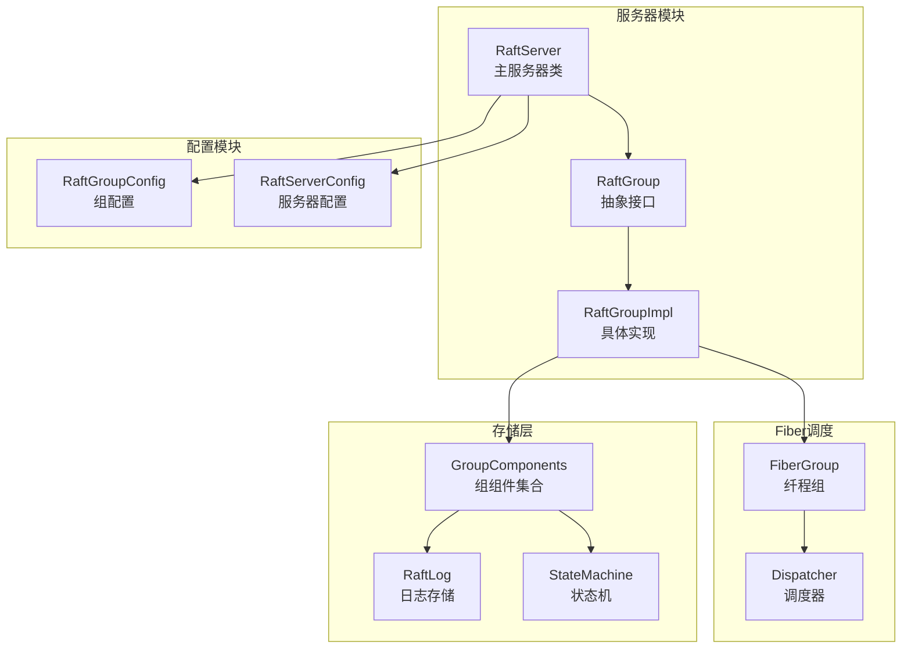
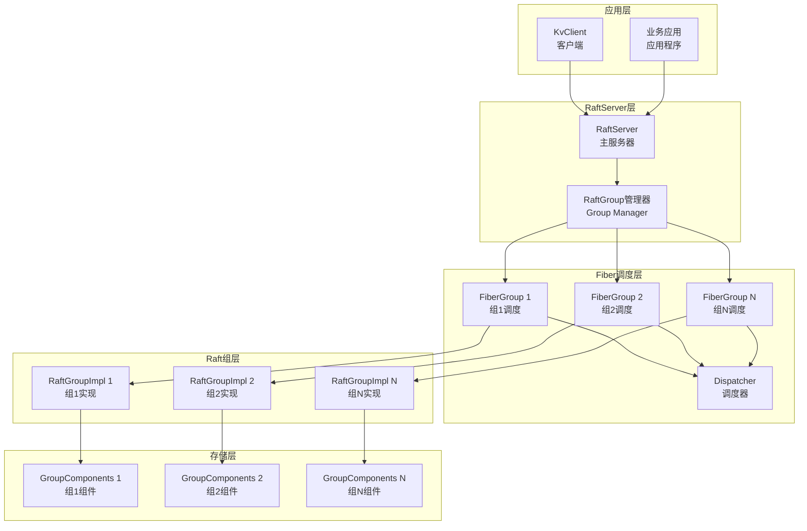
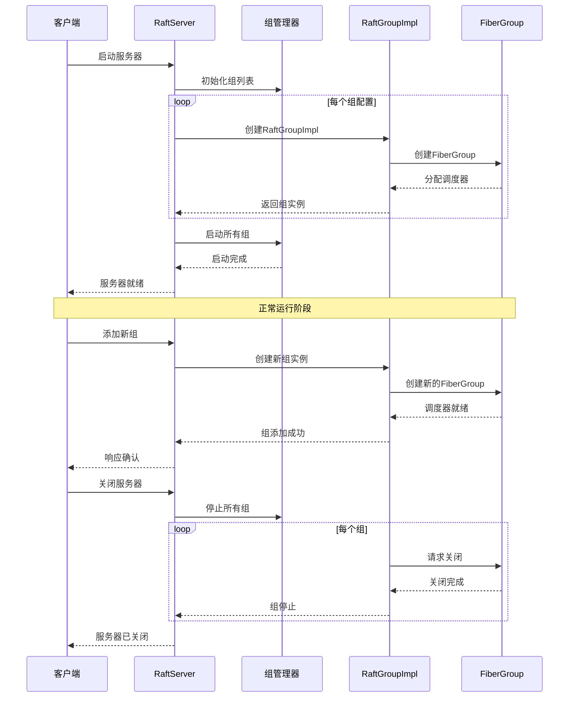
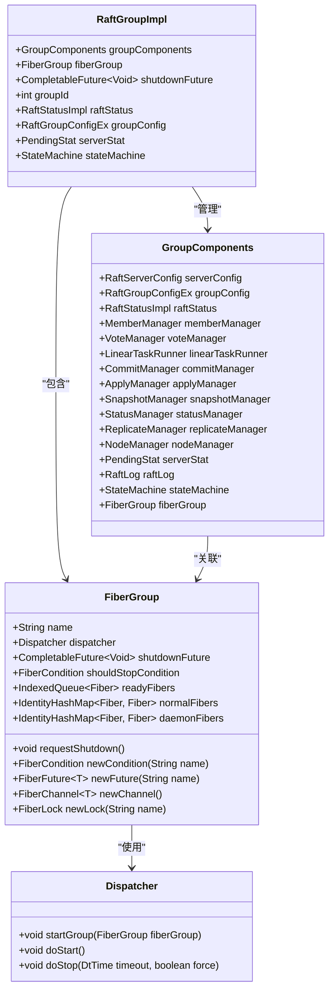
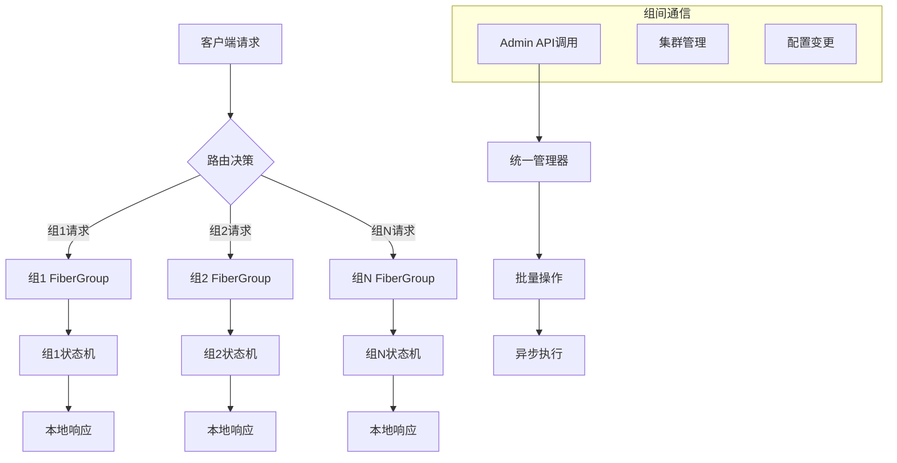
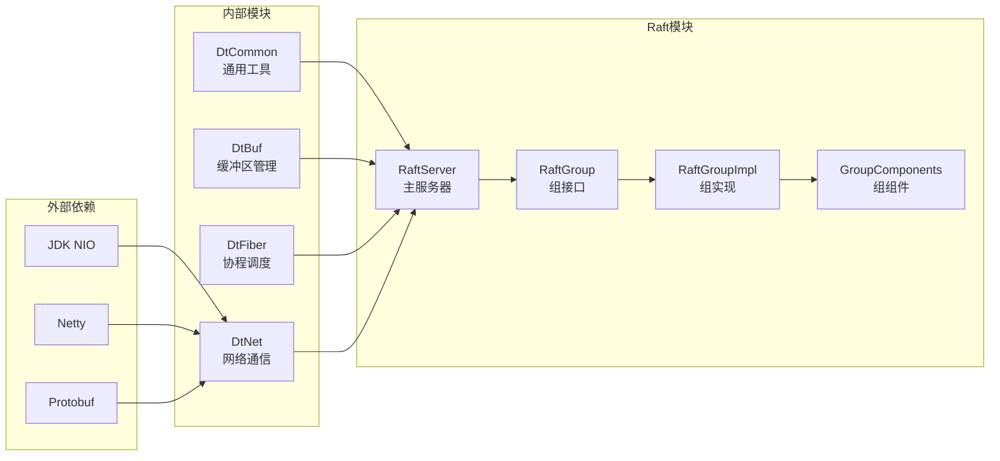

# 多RAFT组支持

<cite>
**本文档中引用的文件**
- [RaftServer.java](file://server/src/main/java/com/github/dtprj/dongting/raft/server/RaftServer.java)
- [RaftGroup.java](file://server/src/main/java/com/github/dtprj/dongting/raft/server/RaftGroup.java)
- [RaftGroupImpl.java](file://server/src/main/java/com/github/dtprj/dongting/raft/impl/RaftGroupImpl.java)
- [RaftGroupConfig.java](file://server/src/main/java/com/github/dtprj/dongting/raft/server/RaftGroupConfig.java)
- [GroupComponents.java](file://server/src/main/java/com/github/dtprj/dongting/raft/impl/GroupComponents.java)
- [FiberGroup.java](file://server/src/main/java/com/github/dtprj/dongting/fiber/FiberGroup.java)
- [Dispatcher.java](file://server/src/main/java/com/github/dtprj/dongting/fiber/Dispatcher.java)
- [MultiRaftDemoServer1.java](file://demos/src/main/java/com/github/dtprj/dongting/demos/multiraft/MultiRaftDemoServer1.java)
- [AddGroup103Demo.java](file://demos/src/main/java/com/github/dtprj/dongting/demos/multiraft/AddGroup103Demo.java)
- [MultiRaftTest.java](file://server/src/test/java/com/github/dtprj/dongting/raft/server/MultiRaftTest.java)
</cite>

## 目录
1. [简介](#简介)
2. [项目结构](#项目结构)
3. [核心组件](#核心组件)
4. [架构概览](#架构概览)
5. [详细组件分析](#详细组件分析)
6. [依赖关系分析](#依赖关系分析)
7. [性能考虑](#性能考虑)
8. [故障排除指南](#故障排除指南)
9. [结论](#结论)

## 简介

多RAFT组支持是Dongting框架中的一个关键特性，它允许单个RaftServer实例同时管理多个独立的Raft组。这种设计实现了资源隔离和并行处理，使得不同业务逻辑可以运行在不同的Raft组中，互不干扰。

每个Raft组都是一个独立的分布式一致性单元，拥有自己的状态机、日志存储和网络通信。通过Fiber调度机制，系统能够高效地管理多个并发的Raft组，提供高吞吐量和低延迟的数据一致性服务。

## 项目结构

多RAFT组支持的代码主要分布在以下模块中：



**图表来源**
- [RaftServer.java](file://server/src/main/java/com/github/dtprj/dongting/raft/server/RaftServer.java#L104-L123)
- [RaftGroupImpl.java](file://server/src/main/java/com/github/dtprj/dongting/raft/impl/RaftGroupImpl.java#L47-L82)
- [GroupComponents.java](file://server/src/main/java/com/github/dtprj/dongting/raft/impl/GroupComponents.java#L28-L54)

## 核心组件

### RaftServer - 主服务器类

RaftServer是多RAFT组支持的核心控制器，负责管理所有Raft组的生命周期：

```java
// 创建多个Raft组
List<RaftGroupConfig> groupConfigs = Arrays.asList(
    new RaftGroupConfig(101, "1,2,3", ""),
    new RaftGroupConfig(102, "1,2,3", "")
);
RaftServer server = new RaftServer(serverConfig, groupConfigs, raftFactory);
```

### RaftGroup - 抽象接口

RaftGroup定义了每个Raft组的基本操作接口：

```java
public abstract class RaftGroup {
    public abstract int getGroupId();
    public abstract StateMachine getStateMachine();
    public abstract void submitLinearTask(RaftInput input, RaftCallback callback);
    public abstract void leaseRead(Timestamp ts, DtTime deadline, FutureCallback<Long> callback);
    public abstract boolean isLeader();
}
```

### RaftGroupImpl - 具体实现

RaftGroupImpl提供了具体的Raft组实现，包含完整的状态管理和任务执行逻辑。

**章节来源**
- [RaftServer.java](file://server/src/main/java/com/github/dtprj/dongting/raft/server/RaftServer.java#L104-L123)
- [RaftGroup.java](file://server/src/main/java/com/github/dtprj/dongting/raft/server/RaftGroup.java#L28-L101)
- [RaftGroupImpl.java](file://server/src/main/java/com/github/dtprj/dongting/raft/impl/RaftGroupImpl.java#L47-L82)

## 架构概览

多RAFT组支持采用分层架构设计，通过Fiber调度机制实现高效的并发处理：



**图表来源**
- [RaftServer.java](file://server/src/main/java/com/github/dtprj/dongting/raft/server/RaftServer.java#L104-L123)
- [FiberGroup.java](file://server/src/main/java/com/github/dtprj/dongting/fiber/FiberGroup.java#L32-L68)

## 详细组件分析

### RaftServer 生命周期管理

RaftServer负责整个多组系统的初始化、运行和关闭：



**图表来源**
- [RaftServer.java](file://server/src/main/java/com/github/dtprj/dongting/raft/server/RaftServer.java#L586-L662)
- [RaftGroupImpl.java](file://server/src/main/java/com/github/dtprj/dongting/raft/impl/RaftGroupImpl.java#L47-L82)

### Fiber调度机制

每个Raft组都有独立的FiberGroup，确保资源隔离和并行处理：



**图表来源**
- [FiberGroup.java](file://server/src/main/java/com/github/dtprj/dongting/fiber/FiberGroup.java#L32-L68)
- [Dispatcher.java](file://server/src/main/java/com/github/dtprj/dongting/fiber/Dispatcher.java#L111-L142)
- [RaftGroupImpl.java](file://server/src/main/java/com/github/dtprj/dongting/raft/impl/RaftGroupImpl.java#L47-L82)
- [GroupComponents.java](file://server/src/main/java/com/github/dtprj/dongting/raft/impl/GroupComponents.java#L28-L54)

### 配置管理

RaftGroupConfig提供了丰富的配置选项，支持细粒度的资源控制：

```java
// 基本配置
RaftGroupConfig config = new RaftGroupConfig(groupId, "1,2,3", "");

// 性能调优配置
config.maxReplicateItems = 50000;
config.maxReplicateBytes = 16 * 1024 * 1024;
config.singleReplicateLimit = 1800 * 1024;

// 流控配置
config.maxPendingRaftTasks = 50000;
config.maxPendingTaskBytes = 256 * 1024 * 1024;

// 快照配置
config.saveSnapshotSeconds = 3600;
config.maxKeepSnapshots = 2;
config.diskSnapshotConcurrency = 4;
```

**章节来源**
- [RaftServer.java](file://server/src/main/java/com/github/dtprj/dongting/raft/server/RaftServer.java#L242-L267)
- [RaftGroupConfig.java](file://server/src/main/java/com/github/dtprj/dongting/raft/server/RaftGroupConfig.java#L28-L73)

### 跨组通信模式

多组架构支持多种跨组通信模式：



**图表来源**
- [RaftServer.java](file://server/src/main/java/com/github/dtprj/dongting/raft/server/RaftServer.java#L586-L662)

## 依赖关系分析

多RAFT组支持的依赖关系体现了清晰的分层架构：



**图表来源**
- [RaftServer.java](file://server/src/main/java/com/github/dtprj/dongting/raft/server/RaftServer.java#L24-L60)
- [GroupComponents.java](file://server/src/main/java/com/github/dtprj/dongting/raft/impl/GroupComponents.java#L22-L26)

**章节来源**
- [RaftServer.java](file://server/src/main/java/com/github/dtprj/dongting/raft/server/RaftServer.java#L24-L60)
- [GroupComponents.java](file://server/src/main/java/com/github/dtprj/dongting/raft/impl/GroupComponents.java#L22-L26)

## 性能考虑

### 资源分配策略

多组架构采用了多种资源分配策略以优化性能：

1. **线程池隔离**: 每个组使用独立的FiberGroup，避免线程竞争
2. **内存隔离**: 不同组的状态机和日志存储相互独立
3. **网络隔离**: 每个组使用独立的网络通道进行通信
4. **I/O分离**: 读写操作和复制操作分别处理

### 性能优势

- **高并发**: 支持数千个并发Raft组
- **低延迟**: Fiber调度减少上下文切换开销
- **高吞吐**: 并行处理不同组的任务
- **弹性扩展**: 动态添加和移除Raft组

### 运维复杂性

虽然多组架构提供了强大的功能，但也带来了以下运维复杂性：

- **监控难度**: 需要监控多个独立的Raft组
- **资源管理**: 需要合理分配CPU和内存资源
- **故障排查**: 故障可能影响多个组
- **版本升级**: 需要考虑组间的兼容性

## 故障排除指南

### 常见问题

1. **组创建失败**
   - 检查groupId是否重复
   - 验证成员配置是否正确
   - 确认数据目录权限

2. **Fiber调度异常**
   - 检查FiberGroup状态
   - 验证调度器配置
   - 查看线程池状态

3. **网络通信问题**
   - 验证节点间连通性
   - 检查防火墙设置
   - 确认端口配置

**章节来源**
- [RaftServer.java](file://server/src/main/java/com/github/dtprj/dongting/raft/server/RaftServer.java#L586-L662)
- [RaftGroupImpl.java](file://server/src/main/java/com/github/dtprj/dongting/raft/impl/RaftGroupImpl.java#L83-L120)

## 结论

多RAFT组支持是Dongting框架的一个重要特性，它通过以下方式提升了系统的整体性能和可维护性：

1. **资源隔离**: 每个Raft组独立运行，避免相互影响
2. **并行处理**: Fiber调度机制实现高效的并发控制
3. **灵活配置**: 丰富的配置选项满足不同场景需求
4. **动态管理**: 支持运行时添加和移除Raft组

这种设计特别适合需要处理大量独立数据集的应用场景，如多租户系统、微服务架构等。通过合理的资源配置和监控，可以充分发挥多组架构的优势，同时有效控制运维复杂性。