# 日志复制机制

<cite>
**本文档引用的文件**
- [AppendReq.java](file://server/src/main/java/com/github/dtprj/dongting/raft/rpc/AppendReq.java)
- [ReplicateManager.java](file://server/src/main/java/com/github/dtprj/dongting/raft/impl/ReplicateManager.java)
- [LogAppender.java](file://server/src/main/java/com/github/dtprj/dongting/raft/store/LogAppender.java)
- [MatchPosFinder.java](file://server/src/main/java/com/github/dtprj/dongting/raft/store/MatchPosFinder.java)
- [AppendProcessor.java](file://server/src/main/java/com/github/dtprj/dongting/raft/rpc/AppendProcessor.java)
- [AppendReqWritePacket.java](file://server/src/main/java/com/github/dtprj/dongting/raft/rpc/AppendReqWritePacket.java)
- [RaftGroupConfig.java](file://server/src/main/java/com/github/dtprj/dongting/raft/server/RaftGroupConfig.java)
- [DefaultRaftLog.java](file://server/src/main/java/com/github/dtprj/dongting/raft/store/DefaultRaftLog.java)
</cite>

## 目录
1. [概述](#概述)
2. [AppendEntries RPC 结构](#appendentries-rpc-结构)
3. [ReplicateManager 协调机制](#replicatemanage-协调机制)
4. [日志条目持久化](#日志条目持久化)
5. [匹配索引查找](#匹配索引查找)
6. [服务器端处理流程](#服务器端处理流程)
7. [网络分区处理策略](#网络分区处理策略)
8. [性能优化策略](#性能优化策略)
9. [故障恢复机制](#故障恢复机制)
10. [总结](#总结)

## 概述

Dongting 的日志复制机制是 Raft 算法的核心组成部分，负责在集群成员之间同步日志条目。该机制通过 AppendEntries RPC 请求实现，具有高效的批量处理、智能的流量控制和完善的错误处理能力。

日志复制机制的主要特点：
- 基于 AppendEntries RPC 的请求-响应模式
- 支持批量日志条目传输
- 实现了智能的流量控制和背压机制
- 提供了完善的日志冲突检测和解决策略
- 支持网络分区场景下的自动恢复

## AppendEntries RPC 结构

### RPC 请求结构

AppendEntries RPC 是 Raft 算法中用于日志复制的核心消息类型，其结构设计精简而高效：

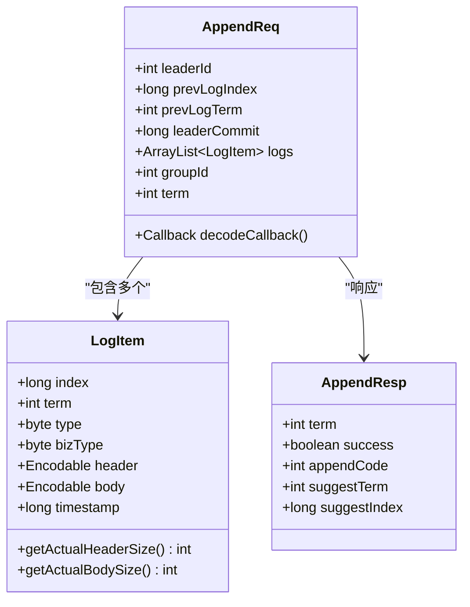

**图表来源**
- [AppendReq.java](file://server/src/main/java/com/github/dtprj/dongting/raft/rpc/AppendReq.java#L40-L156)

### RPC 编码解码机制

AppendReq 使用 Protocol Buffers 进行序列化，支持高效的二进制传输：

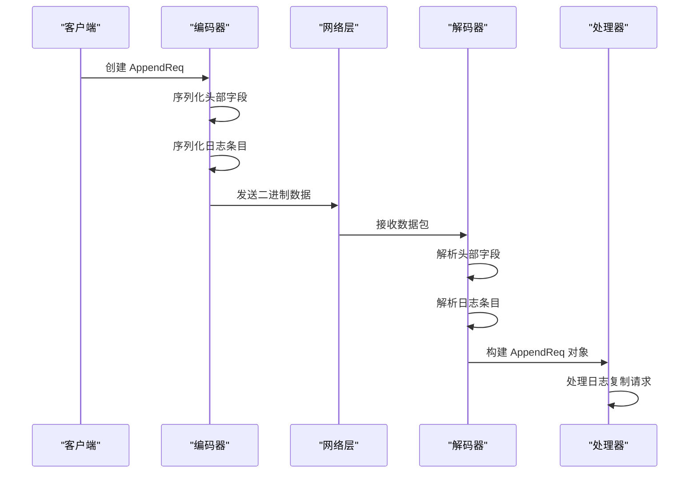

**图表来源**
- [AppendReqWritePacket.java](file://server/src/main/java/com/github/dtprj/dongting/raft/rpc/AppendReqWritePacket.java#L114-L141)

**章节来源**
- [AppendReq.java](file://server/src/main/java/com/github/dtprj/dongting/raft/rpc/AppendReq.java#L40-L156)
- [AppendReqWritePacket.java](file://server/src/main/java/com/github/dtprj/dongting/raft/rpc/AppendReqWritePacket.java#L70-L93)

## ReplicateManager 协调机制

### 核心协调架构

ReplicateManager 负责协调整个日志复制过程，管理所有从领导者到跟随者的日志同步任务：

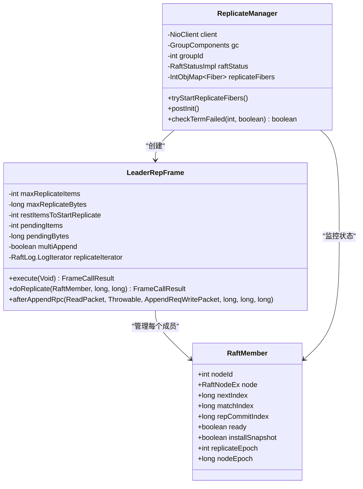

**图表来源**
- [ReplicateManager.java](file://server/src/main/java/com/github/dtprj/dongting/raft/impl/ReplicateManager.java#L56-L200)

### 发送频率控制

ReplicateManager 实现了智能的发送频率控制机制，避免过度频繁的 RPC 调用：

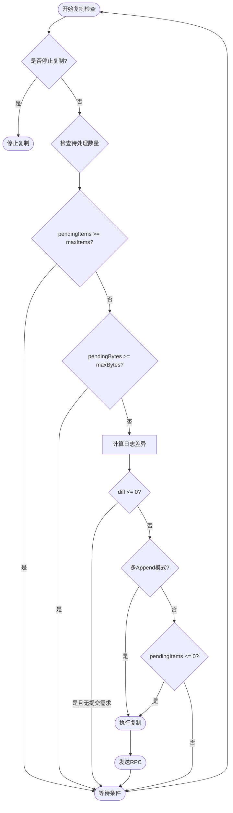

**图表来源**
- [ReplicateManager.java](file://server/src/main/java/com/github/dtprj/dongting/raft/impl/ReplicateManager.java#L271-L314)

### 批量策略

ReplicateManager 实现了多种批量策略来提高复制效率：

1. **基于数量的批量**：最大可批量处理 50,000 条日志条目
2. **基于字节大小的批量**：最大可批量处理 16MB 数据
3. **避免愚蠢窗口综合征**：当剩余空间小于 10% 时暂停批量

**章节来源**
- [ReplicateManager.java](file://server/src/main/java/com/github/dtprj/dongting/raft/impl/ReplicateManager.java#L203-L477)
- [RaftGroupConfig.java](file://server/src/main/java/com/github/dtprj/dongting/raft/server/RaftGroupConfig.java#L34-L35)

## 日志条目持久化

### LogAppender 实现

LogAppender 负责将日志条目持久化到磁盘，确保数据的可靠性：

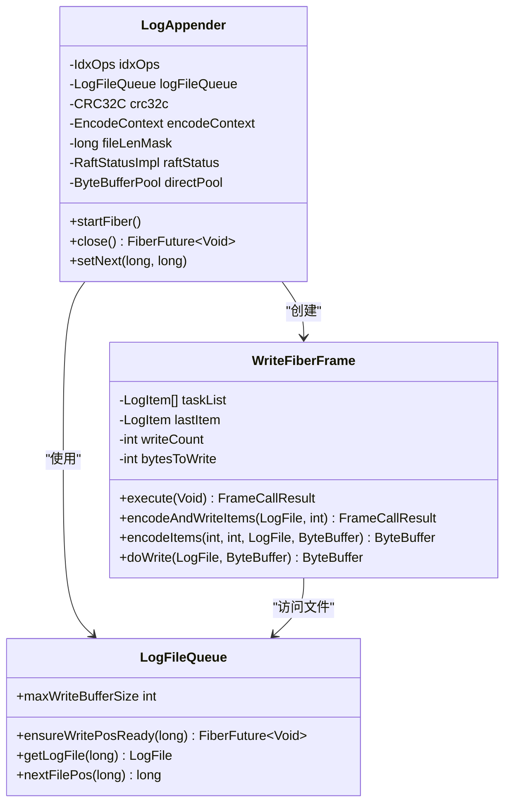

**图表来源**
- [LogAppender.java](file://server/src/main/java/com/github/dtprj/dongting/raft/store/LogAppender.java#L40-L317)

### 持久化流程

日志条目持久化采用异步写入机制，确保高吞吐量：

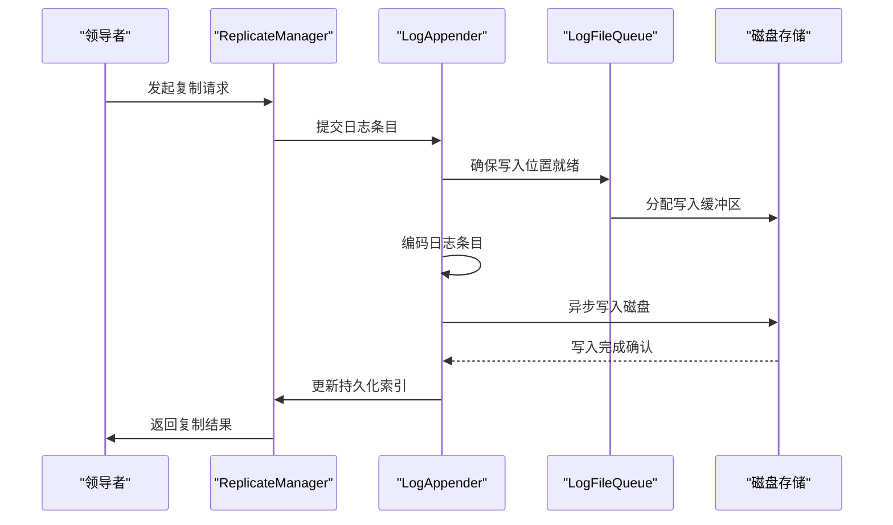

**图表来源**
- [LogAppender.java](file://server/src/main/java/com/github/dtprj/dongting/raft/store/LogAppender.java#L100-L200)

**章节来源**
- [LogAppender.java](file://server/src/main/java/com/github/dtprj/dongting/raft/store/LogAppender.java#L40-L317)

## 匹配索引查找

### MatchPosFinder 算法

MatchPosFinder 实现了高效的匹配索引查找算法，用于解决日志冲突：

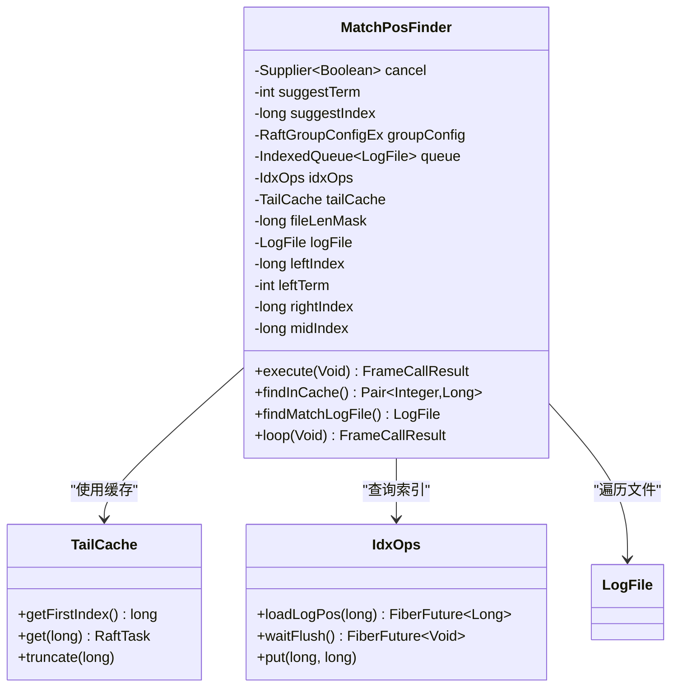

**图表来源**
- [MatchPosFinder.java](file://server/src/main/java/com/github/dtprj/dongting/raft/store/MatchPosFinder.java#L35-L214)

### 二分查找算法

MatchPosFinder 使用二分查找算法快速定位匹配点：

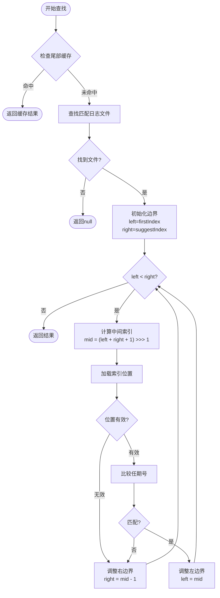

**图表来源**
- [MatchPosFinder.java](file://server/src/main/java/com/github/dtprj/dongting/raft/store/MatchPosFinder.java#L100-L200)

**章节来源**
- [MatchPosFinder.java](file://server/src/main/java/com/github/dtprj/dongting/raft/store/MatchPosFinder.java#L35-L214)

## 服务器端处理流程

### AppendProcessor 处理机制

AppendProcessor 负责处理来自领导者的 AppendEntries 请求：

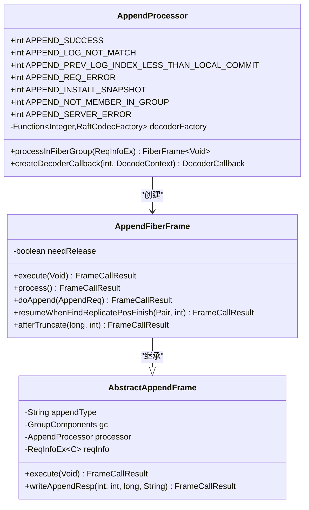

**图表来源**
- [AppendProcessor.java](file://server/src/main/java/com/github/dtprj/dongting/raft/rpc/AppendProcessor.java#L60-L589)

### 请求验证和处理流程

服务器端对 AppendEntries 请求进行严格的验证和处理：

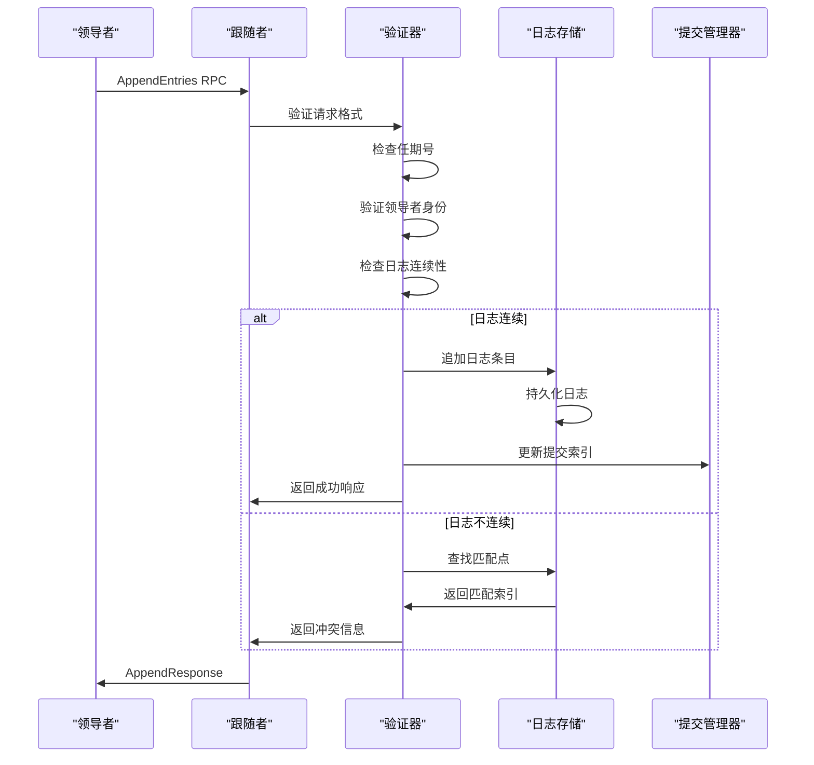

**图表来源**
- [AppendProcessor.java](file://server/src/main/java/com/github/dtprj/dongting/raft/rpc/AppendProcessor.java#L294-L318)

**章节来源**
- [AppendProcessor.java](file://server/src/main/java/com/github/dtprj/dongting/raft/rpc/AppendProcessor.java#L60-L589)

## 网络分区处理策略

### 分区检测和恢复

Dongting 实现了完善的网络分区检测和自动恢复机制：

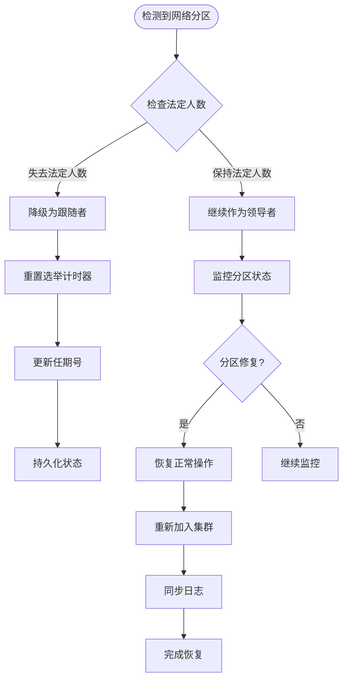

### 节点故障处理

当节点发生故障时，系统采用以下策略：

1. **心跳检测**：定期发送心跳包检测节点状态
2. **超时处理**：超过指定时间未收到响应则标记为故障
3. **自动恢复**：故障节点恢复后自动重新加入集群
4. **状态同步**：确保故障期间丢失的状态得到正确恢复

## 性能优化策略

### 批处理优化

Dongting 实现了多层次的批处理优化策略：

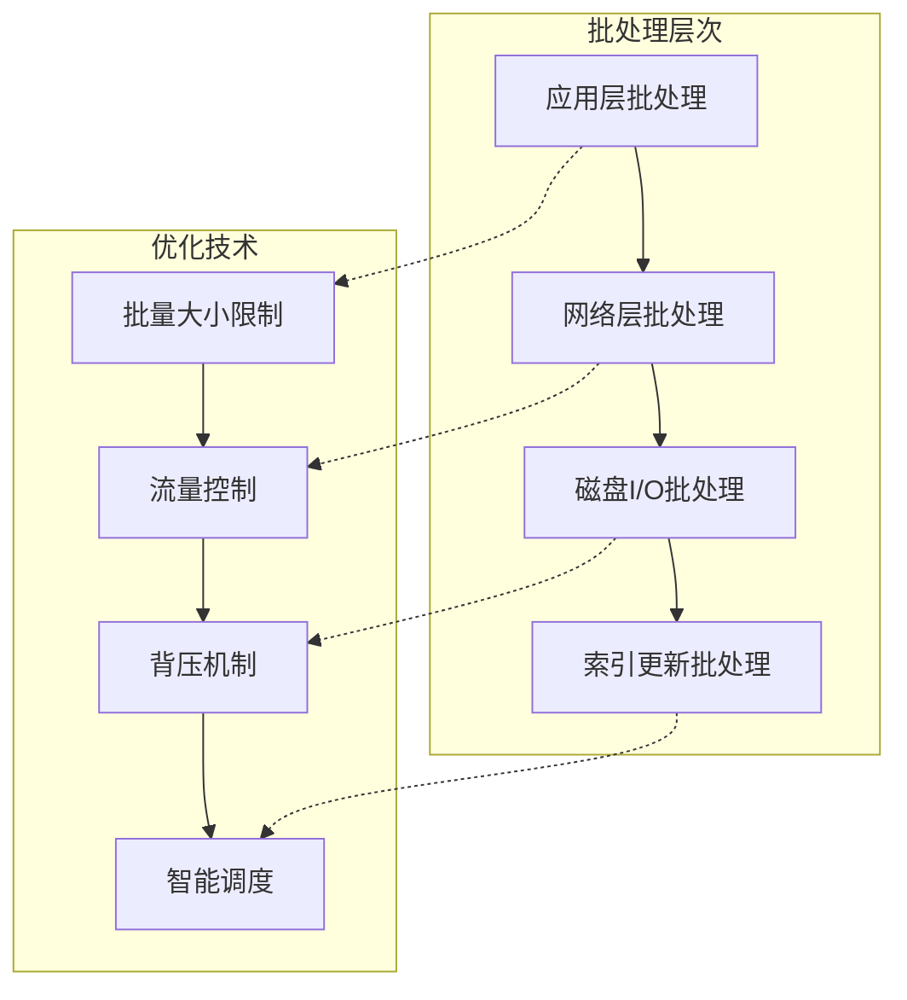

### 流水线复制

系统实现了高效的流水线复制机制：

1. **并发处理**：多个日志条目可以并发处理
2. **流水线阶段**：编码、传输、解码、应用等阶段并行
3. **缓冲管理**：智能的缓冲区管理和复用
4. **资源调度**：动态调整并发度以适应系统负载

### 性能监控指标

系统提供了丰富的性能监控指标：

- **复制延迟**：从领导者到跟随者的复制延迟
- **吞吐量**：每秒处理的日志条目数量
- **批处理效率**：批处理大小与理论最大值的比例
- **网络利用率**：网络带宽的使用效率
- **磁盘I/O性能**：磁盘写入速度和延迟

**章节来源**
- [ReplicateManager.java](file://server/src/main/java/com/github/dtprj/dongting/raft/impl/ReplicateManager.java#L245-L247)
- [RaftGroupConfig.java](file://server/src/main/java/com/github/dtprj/dongting/raft/server/RaftGroupConfig.java#L34-L35)

## 故障恢复机制

### 日志冲突解决

当发生日志冲突时，系统采用以下解决策略：

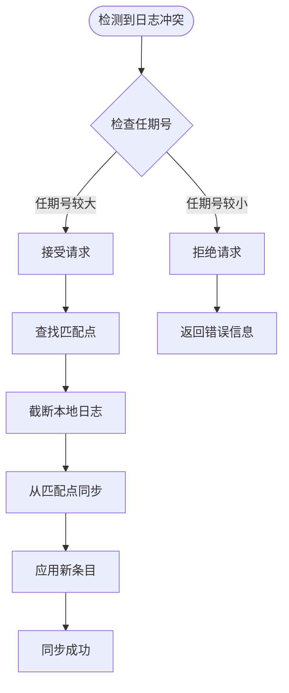

### 自动恢复流程

系统实现了自动化的故障恢复流程：

1. **故障检测**：通过心跳机制检测节点故障
2. **状态评估**：评估故障节点的状态和影响范围
3. **恢复计划**：制定详细的恢复计划
4. **逐步恢复**：分步骤执行恢复操作
5. **验证确认**：验证恢复结果的正确性

**章节来源**
- [AppendProcessor.java](file://server/src/main/java/com/github/dtprj/dongting/raft/rpc/AppendProcessor.java#L418-L446)
- [DefaultRaftLog.java](file://server/src/main/java/com/github/dtprj/dongting/raft/store/DefaultRaftLog.java#L207-L232)

## 总结

Dongting 的日志复制机制是一个高度优化、功能完备的系统，具有以下特点：

### 核心优势

1. **高性能**：通过批处理、流水线复制和智能缓存实现高吞吐量
2. **可靠性**：完善的错误处理和自动恢复机制确保系统稳定运行
3. **可扩展性**：支持大规模集群和动态节点管理
4. **容错性**：在网络分区和节点故障场景下能够自动恢复

### 关键特性

- **智能流量控制**：避免网络拥塞和资源浪费
- **高效的冲突解决**：快速定位和解决日志冲突
- **灵活的配置**：支持根据实际需求调整性能参数
- **全面的监控**：提供详细的性能指标和诊断信息

### 最佳实践建议

1. **合理配置批处理参数**：根据网络带宽和磁盘性能调整批处理大小
2. **监控系统健康状态**：定期检查复制延迟和吞吐量指标
3. **备份重要数据**：定期创建快照以减少故障恢复时间
4. **测试网络环境**：模拟网络分区场景验证系统的容错能力

通过深入理解和正确使用这些机制，可以构建出高性能、高可靠性的分布式系统。