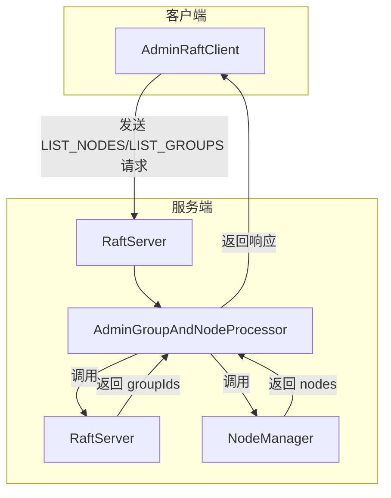
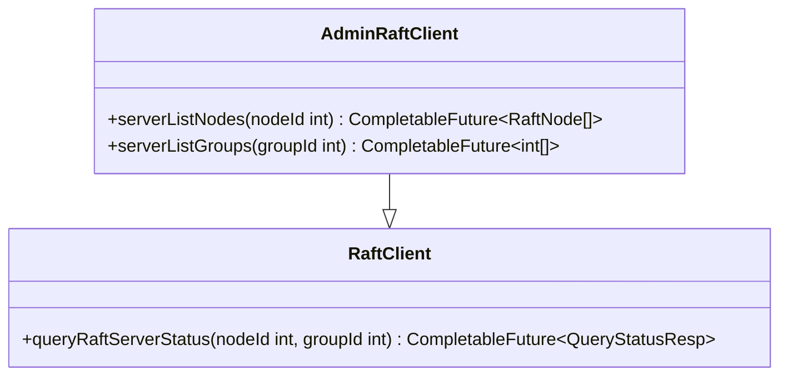
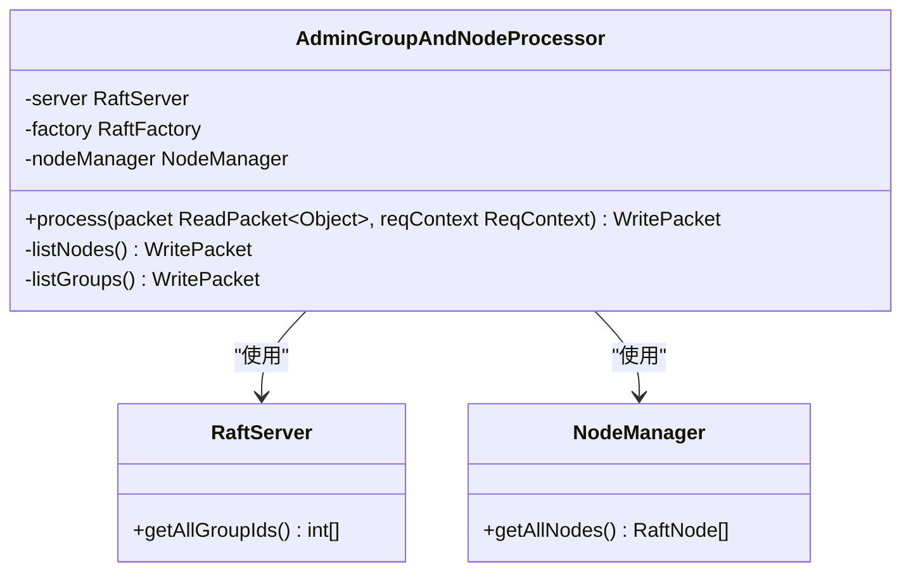
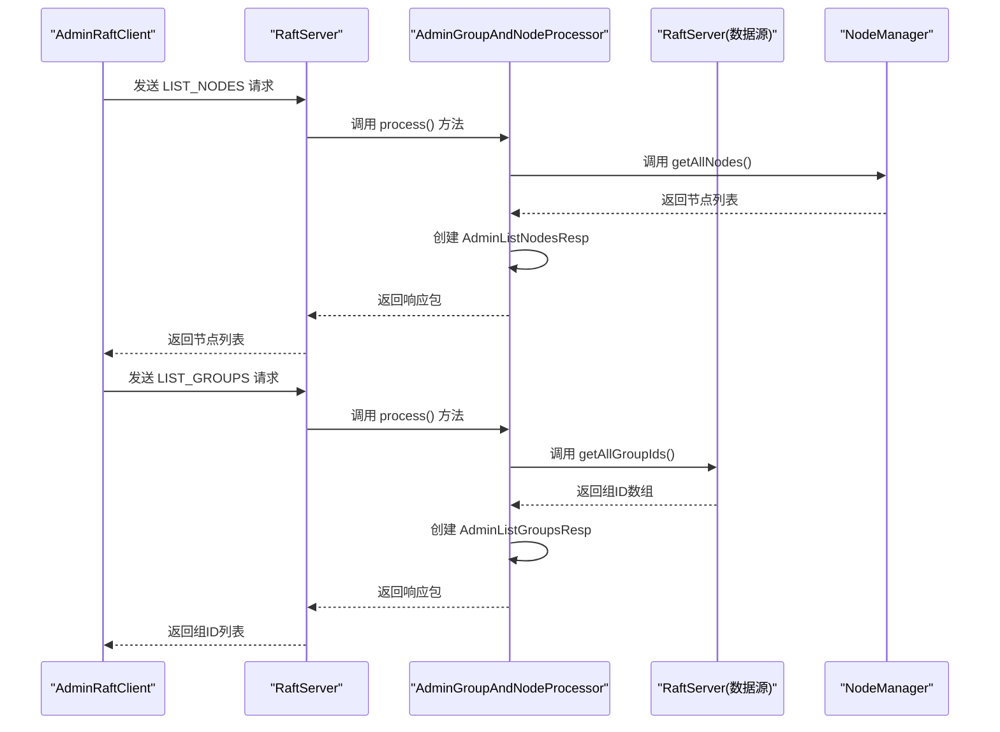
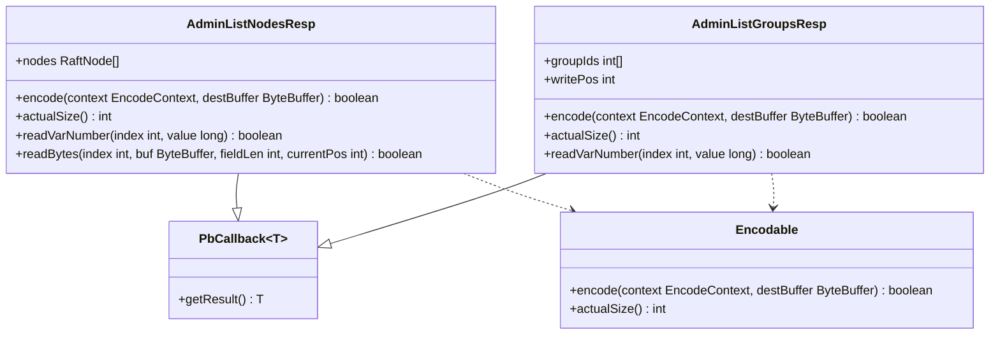
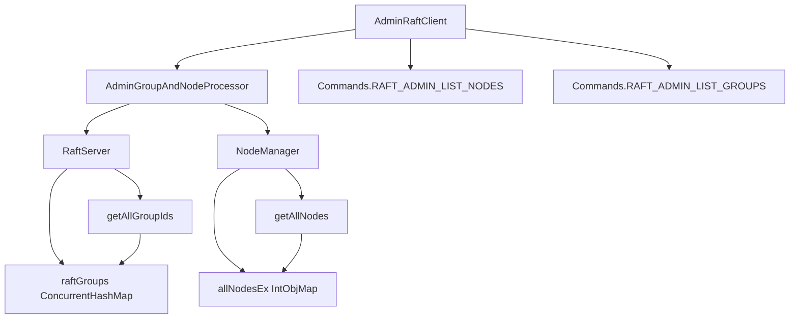

# 管理员节点与组列表查询

<cite>
**本文档引用的文件**  
- [AdminListGroupsResp.java](file://server/src/main/java/com/github/dtprj/dongting/raft/rpc/AdminListGroupsResp.java)
- [AdminListNodesResp.java](file://server/src/main/java/com/github/dtprj/dongting/raft/rpc/AdminListNodesResp.java)
- [AdminGroupAndNodeProcessor.java](file://server/src/main/java/com/github/dtprj/dongting/raft/rpc/AdminGroupAndNodeProcessor.java)
- [RaftServer.java](file://server/src/main/java/com/github/dtprj/dongting/raft/server/RaftServer.java)
- [AdminRaftClient.java](file://server/src/main/java/com/github/dtprj/dongting/raft/admin/AdminRaftClient.java)
- [NodeManager.java](file://server/src/main/java/com/github/dtprj/dongting/raft/impl/NodeManager.java)
- [RaftNode.java](file://client/src/main/java/com/github/dtprj/dongting/raft/RaftNode.java)
</cite>

## 目录
1. [简介](#简介)
2. [核心组件分析](#核心组件分析)
3. [架构概览](#架构概览)
4. [详细组件分析](#详细组件分析)
5. [依赖分析](#依赖分析)
6. [故障排除指南](#故障排除指南)
7. [结论](#结论)

## 简介
本文档详细介绍了Dongting分布式系统中管理员节点与组列表查询功能的实现机制。该功能允许系统管理员查询集群中所有节点的定义信息以及所有Raft组的ID列表，为系统监控、管理和维护提供了基础支持。

## 核心组件分析
管理员节点与组列表查询功能主要由以下几个核心组件构成：`AdminRaftClient`用于发起查询请求，`AdminGroupAndNodeProcessor`作为服务端处理器接收并处理请求，`RaftServer`提供底层数据支持，`NodeManager`管理节点信息，以及`AdminListNodesResp`和`AdminListGroupsResp`作为响应数据结构。

**本文档引用的文件**  
- [AdminListGroupsResp.java](file://server/src/main/java/com/github/dtprj/dongting/raft/rpc/AdminListGroupsResp.java)
- [AdminListNodesResp.java](file://server/src/main/java/com/github/dtprj/dongting/raft/rpc/AdminListNodesResp.java)
- [AdminGroupAndNodeProcessor.java](file://server/src/main/java/com/github/dtprj/dongting/raft/rpc/AdminGroupAndNodeProcessor.java)
- [RaftServer.java](file://server/src/main/java/com/github/dtprj/dongting/raft/server/RaftServer.java)
- [AdminRaftClient.java](file://server/src/main/java/com/github/dtprj/dongting/raft/admin/AdminRaftClient.java)

## 架构概览
管理员节点与组列表查询功能的架构遵循典型的客户端-服务器模式。客户端通过`AdminRaftClient`发起查询请求，请求通过网络传输到指定节点的`RaftServer`，由`AdminGroupAndNodeProcessor`处理器处理，最终返回包含节点或组信息的响应。

**图表来源**  
- [AdminRaftClient.java](file://server/src/main/java/com/github/dtprj/dongting/raft/admin/AdminRaftClient.java)
- [AdminGroupAndNodeProcessor.java](file://server/src/main/java/com/github/dtprj/dongting/raft/rpc/AdminGroupAndNodeProcessor.java)
- [RaftServer.java](file://server/src/main/java/com/github/dtprj/dongting/raft/server/RaftServer.java)
- [NodeManager.java](file://server/src/main/java/com/github/dtprj/dongting/raft/impl/NodeManager.java)

## 详细组件分析

### 管理员客户端分析
`AdminRaftClient`类提供了查询节点和组列表的客户端接口。它继承自`RaftClient`，并扩展了管理员特有的功能。

**图表来源**  
- [AdminRaftClient.java](file://server/src/main/java/com/github/dtprj/dongting/raft/admin/AdminRaftClient.java)

### 服务端处理器分析
`AdminGroupAndNodeProcessor`是处理管理员请求的核心服务端组件，负责处理添加/删除组、添加/删除节点以及查询节点和组列表等操作。

**图表来源**  
- [AdminGroupAndNodeProcessor.java](file://server/src/main/java/com/github/dtprj/dongting/raft/rpc/AdminGroupAndNodeProcessor.java)
- [RaftServer.java](file://server/src/main/java/com/github/dtprj/dongting/raft/server/RaftServer.java)
- [NodeManager.java](file://server/src/main/java/com/github/dtprj/dongting/raft/impl/NodeManager.java)

### 查询流程分析
管理员节点与组列表查询的完整流程涉及多个组件的协同工作，从客户端发起请求到服务端返回响应。

**图表来源**  
- [AdminRaftClient.java](file://server/src/main/java/com/github/dtprj/dongting/raft/admin/AdminRaftClient.java)
- [AdminGroupAndNodeProcessor.java](file://server/src/main/java/com/github/dtprj/dongting/raft/rpc/AdminGroupAndNodeProcessor.java)
- [RaftServer.java](file://server/src/main/java/com/github/dtprj/dongting/raft/server/RaftServer.java)
- [NodeManager.java](file://server/src/main/java/com/github/dtprj/dongting/raft/impl/NodeManager.java)

### 响应数据结构分析
`AdminListNodesResp`和`AdminListGroupsResp`是两个关键的响应数据结构，分别用于封装节点列表和组ID列表的查询结果。

**图表来源**  
- [AdminListNodesResp.java](file://server/src/main/java/com/github/dtprj/dongting/raft/rpc/AdminListNodesResp.java)
- [AdminListGroupsResp.java](file://server/src/main/java/com/github/dtprj/dongting/raft/rpc/AdminListGroupsResp.java)

## 依赖分析
管理员节点与组列表查询功能依赖于多个核心组件和模块，形成了一个完整的依赖链。

**图表来源**  
- [AdminRaftClient.java](file://server/src/main/java/com/github/dtprj/dongting/raft/admin/AdminRaftClient.java)
- [AdminGroupAndNodeProcessor.java](file://server/src/main/java/com/github/dtprj/dongting/raft/rpc/AdminGroupAndNodeProcessor.java)
- [RaftServer.java](file://server/src/main/java/com/github/dtprj/dongting/raft/server/RaftServer.java)
- [NodeManager.java](file://server/src/main/java/com/github/dtprj/dongting/raft/impl/NodeManager.java)

## 故障排除指南
在使用管理员节点与组列表查询功能时，可能会遇到一些常见问题，以下是相应的排查方法：

1. **查询返回空结果**：检查目标节点是否正常运行，确认`RaftServer`状态为运行中。
2. **连接超时**：验证网络连接是否正常，检查防火墙设置，确保服务端口可访问。
3. **节点不存在错误**：确认查询的节点ID是否存在于集群配置中，使用`nodeManager.getAllNodeIdsInLock()`验证。
4. **权限问题**：确保客户端具有管理员权限，能够访问管理员API端点。
5. **数据不一致**：检查集群成员状态，确认所有节点的`nodePing`状态正常。

**本文档引用的文件**  
- [AdminRaftClient.java](file://server/src/main/java/com/github/dtprj/dongting/raft/admin/AdminRaftClient.java)
- [AdminGroupAndNodeProcessor.java](file://server/src/main/java/com/github/dtprj/dongting/raft/rpc/AdminGroupAndNodeProcessor.java)
- [RaftServer.java](file://server/src/main/java/com/github/dtprj/dongting/raft/server/RaftServer.java)
- [NodeManager.java](file://server/src/main/java/com/github/dtprj/dongting/raft/impl/NodeManager.java)

## 结论
管理员节点与组列表查询功能是Dongting分布式系统的重要管理接口，为系统监控和运维提供了基础支持。通过`AdminRaftClient`、`AdminGroupAndNodeProcessor`、`RaftServer`和`NodeManager`等组件的协同工作，实现了高效、可靠的节点和组信息查询能力。该功能的设计充分考虑了分布式系统的特性，确保了在复杂网络环境下的稳定性和可用性。