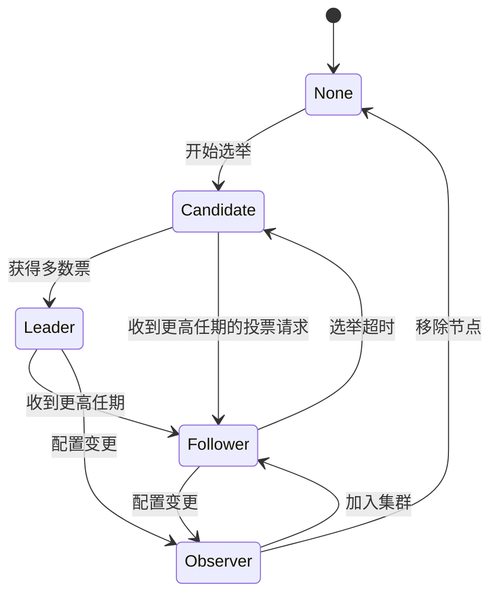
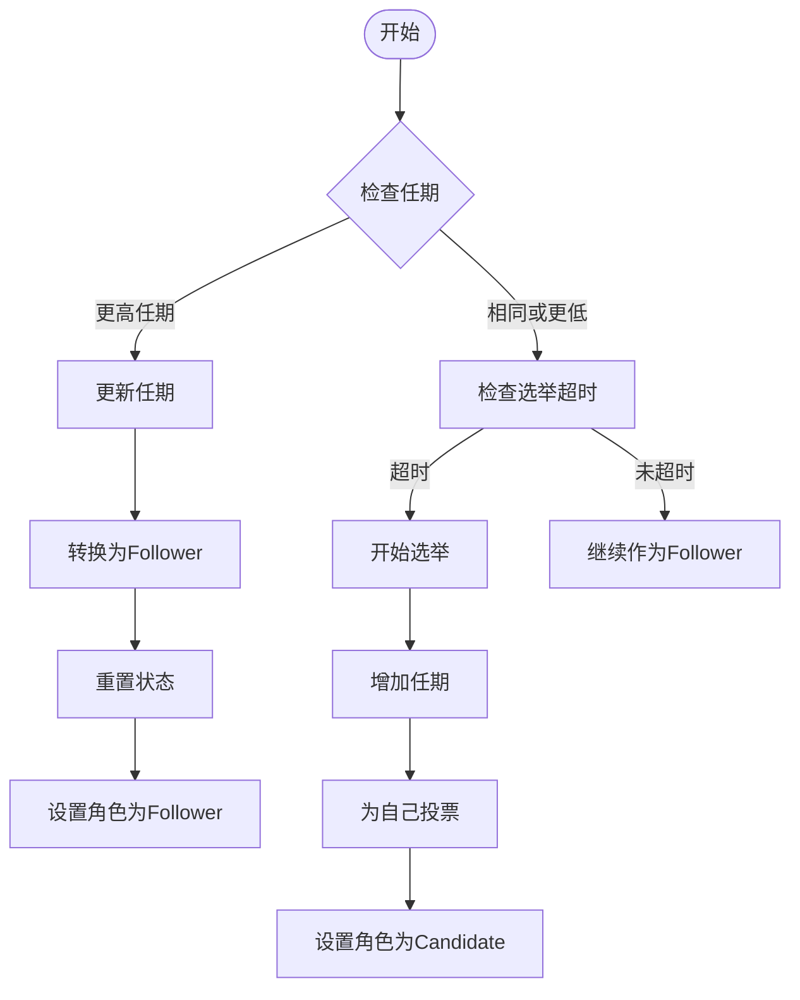
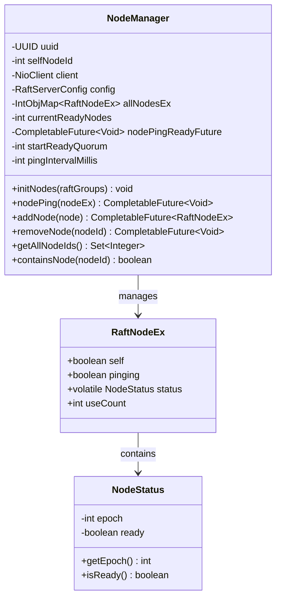
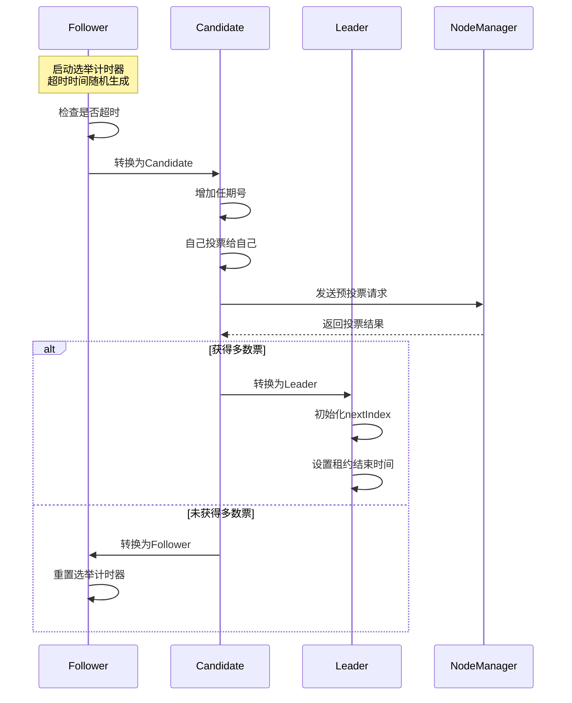
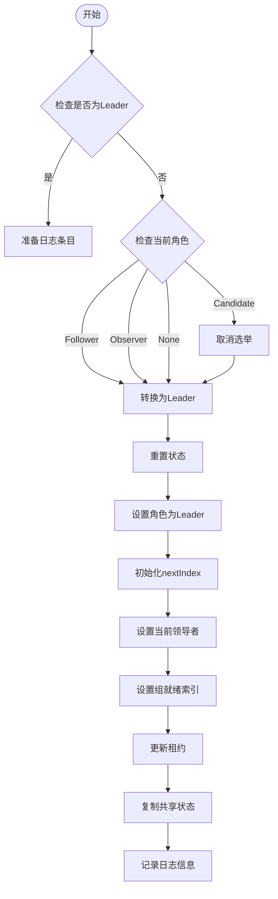
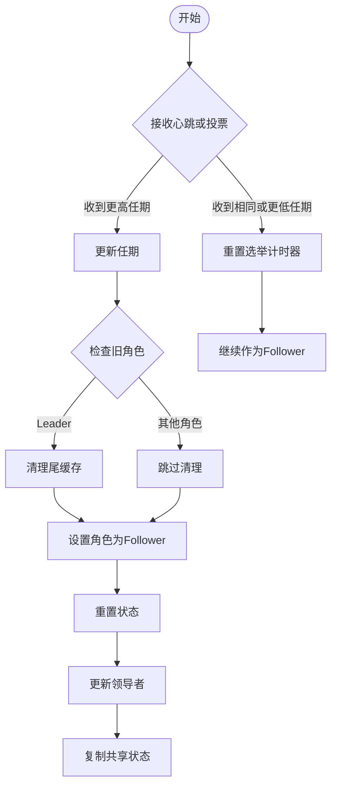

# 角色管理

<cite>
**本文档引用的文件**
- [RaftRole.java](file://server/src/main/java/com/github/dtprj/dongting/raft/impl/RaftRole.java)
- [NodeManager.java](file://server/src/main/java/com/github/dtprj/dongting/raft/impl/NodeManager.java)
- [RaftStatusImpl.java](file://server/src/main/java/com/github/dtprj/dongting/raft/impl/RaftStatusImpl.java)
- [RaftUtil.java](file://server/src/main/java/com/github/dtprj/dongting/raft/impl/RaftUtil.java)
- [VoteManager.java](file://server/src/main/java/com/github/dtprj/dongting/raft/impl/VoteManager.java)
- [ReplicateManager.java](file://server/src/main/java/com/github/dtprj/dongting/raft/impl/ReplicateManager.java)
- [MemberManager.java](file://server/src/main/java/com/github/dtprj/dongting/raft/impl/MemberManager.java)
- [ApplyManager.java](file://server/src/main/java/com/github/dtprj/dongting/raft/impl/ApplyManager.java)
- [RaftGroupImpl.java](file://server/src/main/java/com/github/dtprj/dongting/raft/impl/RaftGroupImpl.java)
- [NodeStatus.java](file://server/src/main/java/com/github/dtprj/dongting/raft/impl/NodeStatus.java)
- [RaftNodeEx.java](file://server/src/main/java/com/github/dtprj/dongting/raft/impl/RaftNodeEx.java)
</cite>

## 目录
1. [简介](#简介)
2. [Raft角色概述](#raft角色概述)
3. [角色状态定义](#角色状态定义)
4. [角色转换机制](#角色转换机制)
5. [NodeManager节点管理](#nodemanager节点管理)
6. [定时器管理](#定时器管理)
7. [角色转换流程](#角色转换流程)
8. [状态监控和调试](#状态监控和调试)
9. [最佳实践和注意事项](#最佳实践和注意事项)
10. [总结](#总结)

## 简介

Dongting分布式系统中的Raft共识算法实现了完整的角色管理系统，支持Leader、Follower、Candidate、Observer和None五种角色状态。本文档详细分析了这些角色的状态定义、转换条件、触发机制以及相互之间的关系，为开发者提供深入理解Raft角色管理的完整指南。

## Raft角色概述

Raft算法中的角色管理是保证分布式系统一致性的核心机制。Dongting实现的Raft角色系统包含以下五种主要角色：



**图表来源**
- [RaftRole.java](file://server/src/main/java/com/github/dtprj/dongting/raft/impl/RaftRole.java#L17-L21)
- [RaftUtil.java](file://server/src/main/java/com/github/dtprj/dongting/raft/impl/RaftUtil.java#L253-L295)

## 角色状态定义

### RaftRole枚举类型

RaftRole枚举定义了所有可能的角色状态：

```java
public enum RaftRole {
    leader,     // 领导者，负责处理客户端请求和日志复制
    follower,   // 跟随者，响应领导者的心跳和选举请求
    candidate,  // 候选人，参与选举过程
    observer,   // 观察者，不参与选举但接收日志复制
    none        // 无角色，通常表示节点未初始化或已移除
}
```

### 角色职责说明

每个角色都有明确的职责和行为特征：

- **Leader（领导者）**：处理所有客户端请求，维护集群领导权，负责日志复制
- **Follower（跟随者）**：被动响应领导者请求，参与选举过程
- **Candidate（候选人）**：主动发起选举，争取成为领导者
- **Observer（观察者）**：接收日志但不参与选举，用于配置变更期间
- **None（无角色）**：节点未加入集群或已被移除

**章节来源**
- [RaftRole.java](file://server/src/main/java/com/github/dtprj/dongting/raft/impl/RaftRole.java#L17-L21)

## 角色转换机制

### 角色转换触发条件

角色转换由多种事件触发，主要包括：



**图表来源**
- [RaftUtil.java](file://server/src/main/java/com/github/dtprj/dongting/raft/impl/RaftUtil.java#L101-L127)
- [VoteManager.java](file://server/src/main/java/com/github/dtprj/dongting/raft/impl/VoteManager.java#L120-L150)

### 核心转换方法

系统提供了专门的方法来处理不同角色间的转换：

#### 1. 转换为Follower

```java
public static void changeToFollower(RaftStatusImpl raftStatus, int leaderId, String reason) {
    log.info("change to follower. term={}, oldRole={}, reason: {}", raftStatus.currentTerm,
            raftStatus.getRole(), reason);
    resetStatus(raftStatus);
    updateLeader(raftStatus, leaderId);
    raftStatus.setRole(RaftRole.follower);
    raftStatus.copyShareStatus();
}
```

#### 2. 转换为Leader

```java
public static void changeToLeader(RaftStatusImpl raftStatus) {
    resetStatus(raftStatus, false);
    raftStatus.setRole(RaftRole.leader);
    raftStatus.setCurrentLeader(raftStatus.self);
    raftStatus.groupReadyIndex = raftStatus.lastLogIndex + 1;
    for (RaftMember node : raftStatus.replicateList) {
        node.nextIndex = raftStatus.lastLogIndex + 1;
    }
    updateLease(raftStatus);
    raftStatus.copyShareStatus();
}
```

#### 3. 转换为Observer

```java
public static void changeToObserver(RaftStatusImpl raftStatus, int leaderId) {
    log.info("change to observer. term={}, oldRole={}", raftStatus.currentTerm, raftStatus.getRole());
    resetStatus(raftStatus);
    updateLeader(raftStatus, leaderId);
    raftStatus.setRole(RaftRole.observer);
    raftStatus.copyShareStatus();
}
```

**章节来源**
- [RaftUtil.java](file://server/src/main/java/com/github/dtprj/dongting/raft/impl/RaftUtil.java#L253-L295)

## NodeManager节点管理

### NodeManager核心功能

NodeManager负责管理集群中所有节点的状态，包括节点发现、健康检查和状态同步：



**图表来源**
- [NodeManager.java](file://server/src/main/java/com/github/dtprj/dongting/raft/impl/NodeManager.java#L48-L84)
- [RaftNodeEx.java](file://server/src/main/java/com/github/dtprj/dongting/raft/impl/RaftNodeEx.java#L25-L36)
- [NodeStatus.java](file://server/src/main/java/com/github/dtprj/dongting/raft/impl/NodeStatus.java#L20-L37)

### 节点状态管理

NodeManager通过定期的ping操作来检测节点的健康状态：

```java
private void tryNodePingAll() {
    if (status < STATUS_PREPARE_STOP) {
        allNodesEx.forEach((nodeId, nodeEx) -> {
            if (!nodeEx.self && !nodeEx.pinging) {
                try {
                    nodePing(nodeEx);
                } catch (Throwable e) {
                    log.error("node ping error", e);
                    nodeEx.pinging = false;
                }
            }
        });
    }
}
```

### 节点状态更新

当节点状态发生变化时，NodeManager会更新相应的状态并通知相关组件：

```java
private void updateNodeStatus(RaftNodeEx nodeEx, boolean ready) {
    NodeStatus oldStatus = nodeEx.status;
    if (ready == oldStatus.isReady()) {
        return;
    }
    if (ready) {
        currentReadyNodes++;
        nodeEx.status = new NodeStatus(true, oldStatus.getEpoch() + 1);
    } else {
        currentReadyNodes--;
        nodeEx.status = new NodeStatus(false, oldStatus.getEpoch());
    }
    if (currentReadyNodes >= startReadyQuorum && !nodePingReadyFuture.isDone()) {
        log.info("nodeManager is ready");
        nodePingReadyFuture.complete(null);
    }
}
```

**章节来源**
- [NodeManager.java](file://server/src/main/java/com/github/dtprj/dongting/raft/impl/NodeManager.java#L150-L232)

## 定时器管理

### 心跳和选举定时器

Raft算法依赖于精确的定时器管理来维持集群的一致性：



**图表来源**
- [VoteManager.java](file://server/src/main/java/com/github/dtprj/dongting/raft/impl/VoteManager.java#L120-L180)
- [NodeManager.java](file://server/src/main/java/com/github/dtprj/dongting/raft/impl/NodeManager.java#L85-L95)

### 定时器参数配置

系统提供了灵活的定时器配置选项：

```java
// NodeManager中的定时器配置
int pingIntervalMillis = 2000;  // 节点心跳间隔

// VoteManager中的选举定时器配置
int firstDelayMin = 1;          // 首次延迟最小值
int firstDelayMax = 30;         // 首次延迟最大值
int checkIntervalMin = 10;      // 检查间隔最小值
int checkIntervalMax = 700;     // 检查间隔最大值
```

### 定时器启动和停止

定时器的生命周期由NodeManager统一管理：

```java
@Override
protected void doStart() {
    this.scheduledFuture = DtUtil.SCHEDULED_SERVICE.scheduleWithFixedDelay(
            this::tryNodePingAll, 0, pingIntervalMillis, TimeUnit.MILLISECONDS);
}

@Override
protected void doStop(DtTime timeout, boolean force) {
    if (scheduledFuture != null) {
        scheduledFuture.cancel(false);
    }
}
```

**章节来源**
- [NodeManager.java](file://server/src/main/java/com/github/dtprj/dongting/raft/impl/NodeManager.java#L85-L95)
- [VoteManager.java](file://server/src/main/java/com/github/dtprj/dongting/raft/impl/VoteManager.java#L50-L60)

## 角色转换流程

### Leader角色转换流程



**图表来源**
- [RaftUtil.java](file://server/src/main/java/com/github/dtprj/dongting/raft/impl/RaftUtil.java#L278-L295)
- [ApplyManager.java](file://server/src/main/java/com/github/dtprj/dongting/raft/impl/ApplyManager.java#L281-L304)

### Follower角色转换流程



**图表来源**
- [RaftUtil.java](file://server/src/main/java/com/github/dtprj/dongting/raft/impl/RaftUtil.java#L101-L127)
- [RaftUtil.java](file://server/src/main/java/com/github/dtprj/dongting/raft/impl/RaftUtil.java#L253-L276)

### Observer角色转换流程

Observer角色主要用于配置变更期间，其转换流程相对简单：

```java
public static void changeToObserver(RaftStatusImpl raftStatus, int leaderId) {
    log.info("change to observer. term={}, oldRole={}", raftStatus.currentTerm, raftStatus.getRole());
    resetStatus(raftStatus);
    updateLeader(raftStatus, leaderId);
    raftStatus.setRole(RaftRole.observer);
    raftStatus.copyShareStatus();
}
```

**章节来源**
- [RaftUtil.java](file://server/src/main/java/com/github/dtprj/dongting/raft/impl/RaftUtil.java#L253-L276)
- [RaftUtil.java](file://server/src/main/java/com/github/dtprj/dongting/raft/impl/RaftUtil.java#L278-L295)

## 状态监控和调试

### 共享状态管理

RaftStatusImpl通过copyShareStatus方法管理共享状态的更新：

```java
public void copyShareStatus() {
    if (shareStatusUpdated) {
        ShareStatus ss = new ShareStatus();
        ss.role = role;
        ss.lastApplied = lastApplied;
        if (role == RaftRole.leader) {
            ss.leaseEndNanos = leaseStartNanos + electTimeoutNanos - leaseDelta;
        }
        ss.lastApplyNanos = lastApplyNanos;
        ss.applyLagNanos = applyLagNanos;
        ss.currentLeader = currentLeader;
        ss.groupReady = groupReady;

        RaftRole oldRole = shareStatus == null ? null : shareStatus.role;
        this.shareStatusUpdated = false;
        this.shareStatus = ss;
        if (oldRole != role && roleChangeListener != null) {
            roleChangeListener.accept(oldRole, role);
        }
    }
}
```

### 角色变更监听

系统提供了角色变更监听机制，允许外部组件感知角色变化：

```java
// 在RaftStatusImpl中注册角色变更监听器
raftStatus.roleChangeListener = (oldRole, newRole) -> {
    log.info("Role changed from {} to {} in group {}", oldRole, newRole, groupId);
    // 执行自定义的处理逻辑
};
```

### 调试信息输出

每个角色转换都会产生详细的日志信息，便于调试和监控：

```java
// Leader转换日志
log.info("change to leader. groupId={}, term={}, lastLogIndex={}, lease rest {}ms",
        raftStatus.groupId, raftStatus.currentTerm, raftStatus.lastLogIndex, restLeaseMillis);

// Follower转换日志  
log.info("change to follower. term={}, oldRole={}, reason: {}", raftStatus.currentTerm,
        raftStatus.getRole(), reason);

// Observer转换日志
log.info("change to observer. term={}, oldRole={}", raftStatus.currentTerm, raftStatus.getRole());
```

**章节来源**
- [RaftStatusImpl.java](file://server/src/main/java/com/github/dtprj/dongting/raft/impl/RaftStatusImpl.java#L120-L159)
- [RaftUtil.java](file://server/src/main/java/com/github/dtprj/dongting/raft/impl/RaftUtil.java#L253-L295)

## 最佳实践和注意事项

### 角色转换的安全考虑

1. **任期一致性检查**
   - 在进行角色转换前必须验证任期的一致性
   - 确保接收到的更高任期消息来自合法的领导者

2. **状态完整性保护**
   - 角色转换过程中要确保状态的完整性
   - 使用原子操作避免竞态条件

3. **资源清理**
   - 转换为非Leader角色时要及时清理相关资源
   - 取消正在进行的选举或复制任务

### 性能优化建议

1. **定时器优化**
   - 合理设置心跳间隔和选举超时时间
   - 使用随机化减少竞争冲突

2. **状态更新批处理**
   - 批量处理多个状态更新以提高效率
   - 减少不必要的状态复制操作

3. **内存管理**
   - 及时释放不再需要的资源
   - 避免内存泄漏影响系统稳定性

### 故障排除指南

1. **常见问题诊断**
   - 检查网络连接状态
   - 验证节点配置的一致性
   - 监控定时器的正常运行

2. **日志分析**
   - 关注角色转换相关的日志信息
   - 分析异常情况的上下文信息
   - 使用结构化日志格式便于分析

3. **监控指标**
   - 跟踪角色转换频率
   - 监控节点可用性状态
   - 分析性能瓶颈和延迟

### 定制化场景注意事项

1. **自定义角色扩展**
   - 在扩展RaftRole枚举时保持向后兼容
   - 实现相应的状态转换逻辑

2. **配置参数调整**
   - 根据集群规模调整定时器参数
   - 考虑网络延迟对选举的影响

3. **安全考虑**
   - 实施适当的访问控制
   - 加密敏感的通信内容
   - 定期审计系统配置

## 总结

Dongting的Raft角色管理系统通过精心设计的状态机模型，实现了稳定可靠的分布式一致性保证。系统支持五种角色状态，每种角色都有明确的职责和转换规则。通过NodeManager的节点管理、精确的定时器控制以及完善的日志记录，系统能够有效应对各种网络异常和故障场景。

关键特性包括：
- 完整的角色状态定义和转换机制
- 高效的节点健康检查和状态同步
- 灵活的定时器配置和管理
- 详细的日志记录和监控支持
- 安全的角色转换和状态保护

开发者在使用和定制该系统时，应该充分理解各个角色的职责和转换条件，合理配置系统参数，并建立完善的监控和调试机制，以确保系统的稳定性和可靠性。