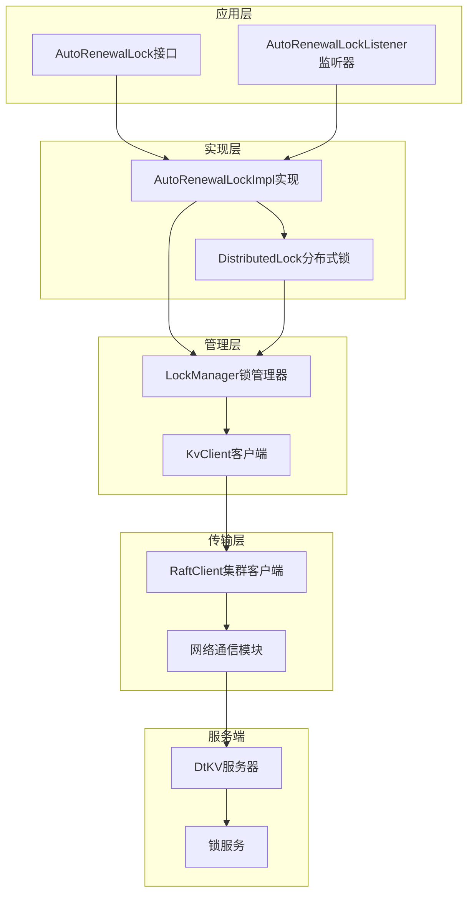
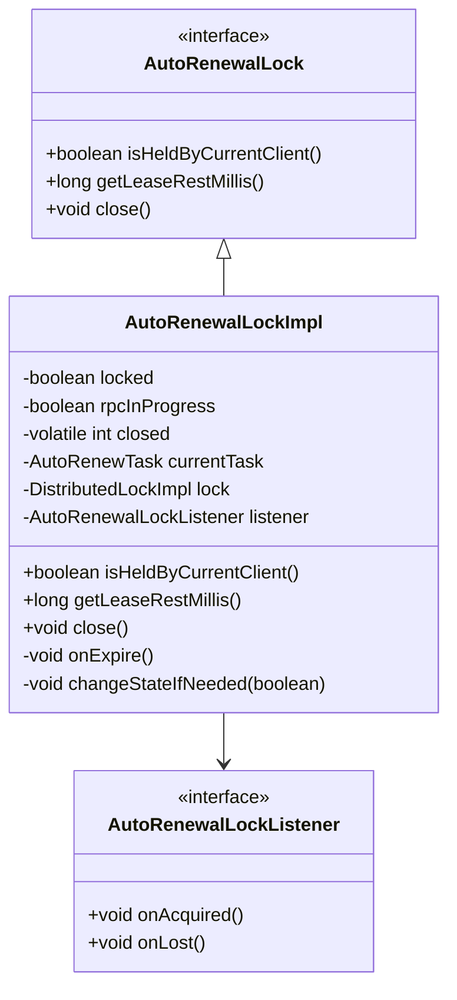
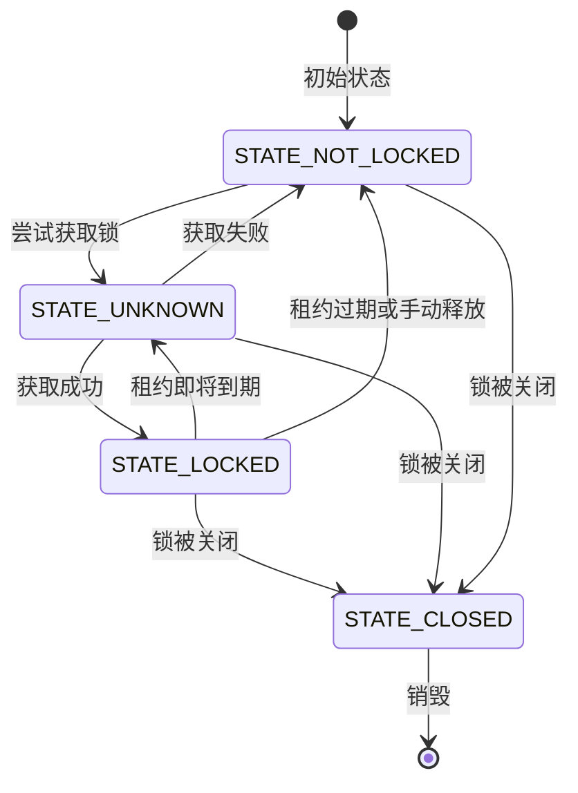
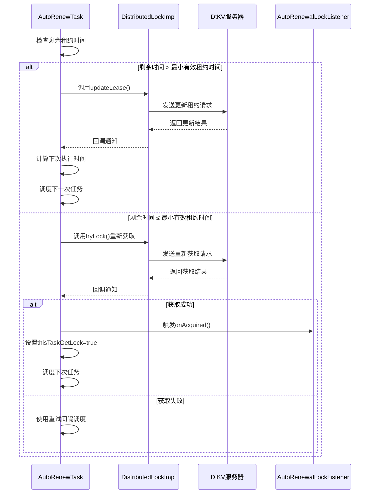
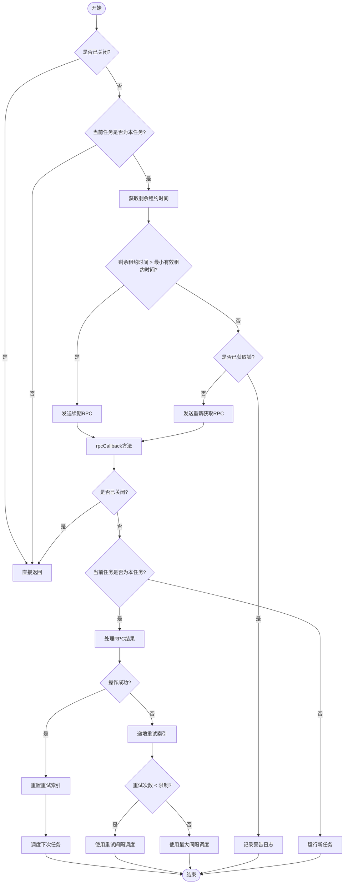
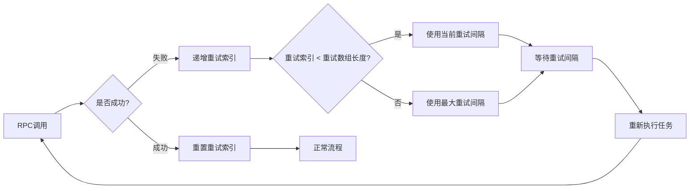

# Auto Renewal Lock 自动续期锁

<cite>
**本文档中引用的文件**
- [AutoRenewalLock.java](file://client/src/main/java/com/github/dtprj/dongting/dtkv/AutoRenewalLock.java)
- [AutoRenewalLockImpl.java](file://client/src/main/java/com/github/dtprj/dongting/dtkv/AutoRenewalLockImpl.java)
- [AutoRenewalLockListener.java](file://client/src/main/java/com/github/dtprj/dongting/dtkv/AutoRenewalLockListener.java)
- [DistributedLock.java](file://client/src/main/java/com/github/dtprj/dongting/dtkv/DistributedLock.java)
- [DistributedLockImpl.java](file://client/src/main/java/com/github/dtprj/dongting/dtkv/DistributedLockImpl.java)
- [LockManager.java](file://client/src/main/java/com/github/dtprj/dongting/dtkv/LockManager.java)
- [KvClient.java](file://client/src/main/java/com/github/dtprj/dongting/dtkv/KvClient.java)
- [KvClientConfig.java](file://client/src/main/java/com/github/dtprj/dongting/dtkv/KvClientConfig.java)
- [AutoRenewalLockDemoClient1.java](file://demos/src/main/java/com/github/dtprj/dongting/demos/lock/AutoRenewalLockDemoClient1.java)
- [AutoRenewalLockImplTest.java](file://server/src/test/java/com/github/dtprj/dongting/dtkv/server/AutoRenewalLockImplTest.java)
</cite>

## 目录
1. [简介](#简介)
2. [系统架构](#系统架构)
3. [核心组件分析](#核心组件分析)
4. [自动续期机制](#自动续期机制)
5. [状态管理](#状态管理)
6. [错误处理与重试](#错误处理与重试)
7. [使用示例](#使用示例)
8. [性能考虑](#性能考虑)
9. [故障排除指南](#故障排除指南)
10. [总结](#总结)

## 简介

Auto Renewal Lock（自动续期锁）是Dongting分布式键值存储系统中的一个高级特性，专门用于在分布式环境中实现领导者选举和资源保护。该锁具有自动续期能力，能够在租约到期前自动延长租约，确保持有者能够持续保持对资源的独占访问。

### 主要特性

- **自动续期**：在租约到期前自动尝试续期，无需用户干预
- **后台运行**：续期操作在后台异步执行，不影响主线业务逻辑
- **智能检测**：能够检测网络异常导致的状态不确定性
- **优雅关闭**：支持安全关闭，自动释放资源
- **事件通知**：提供获取和丢失锁的回调通知

## 系统架构

Auto Renewal Lock的架构基于分层设计，包含以下主要层次：



**图表来源**
- [AutoRenewalLock.java](file://client/src/main/java/com/github/dtprj/dongting/dtkv/AutoRenewalLock.java#L34-L68)
- [AutoRenewalLockImpl.java](file://client/src/main/java/com/github/dtprj/dongting/dtkv/AutoRenewalLockImpl.java#L30-L228)
- [LockManager.java](file://client/src/main/java/com/github/dtprj/dongting/dtkv/LockManager.java#L36-L241)

## 核心组件分析

### AutoRenewalLock接口

AutoRenewalLock定义了自动续期锁的核心API，提供了简洁的接口供用户使用：



**图表来源**
- [AutoRenewalLock.java](file://client/src/main/java/com/github/dtprj/dongting/dtkv/AutoRenewalLock.java#L34-L68)
- [AutoRenewalLockImpl.java](file://client/src/main/java/com/github/dtprj/dongting/dtkv/AutoRenewalLockImpl.java#L30-L228)
- [AutoRenewalLockListener.java](file://client/src/main/java/com/github/dtprj/dongting/dtkv/AutoRenewalLockListener.java#L29-L45)

### 分布式锁实现

DistributedLockImpl提供了分布式锁的基础功能，包括租约管理和状态控制：



**图表来源**
- [DistributedLockImpl.java](file://client/src/main/java/com/github/dtprj/dongting/dtkv/DistributedLockImpl.java#L48-L53)

**章节来源**
- [AutoRenewalLock.java](file://client/src/main/java/com/github/dtprj/dongting/dtkv/AutoRenewalLock.java#L18-L68)
- [AutoRenewalLockImpl.java](file://client/src/main/java/com/github/dtprj/dongting/dtkv/AutoRenewalLockImpl.java#L30-L228)
- [DistributedLockImpl.java](file://client/src/main/java/com/github/dtprj/dongting/dtkv/DistributedLockImpl.java#L45-L652)

## 自动续期机制

### 续期任务调度

AutoRenewalLockImpl内部维护了一个AutoRenewTask，负责定期检查和续期租约：



**图表来源**
- [AutoRenewalLockImpl.java](file://client/src/main/java/com/github/dtprj/dongting/dtkv/AutoRenewalLockImpl.java#L72-L151)

### 续期策略

系统采用智能的续期策略：

1. **阈值检测**：当剩余租约时间超过最小有效租约时间时，执行续期操作
2. **紧急获取**：当剩余租约时间小于等于最小有效租约时间时，尝试重新获取锁
3. **状态标记**：通过`thisTaskGetLock`标志避免重复触发获取事件

**章节来源**
- [AutoRenewalLockImpl.java](file://client/src/main/java/com/github/dtprj/dongting/dtkv/AutoRenewalLockImpl.java#L72-L151)

## 状态管理

### 锁状态转换

AutoRenewalLock实现了严格的锁状态管理，确保状态的一致性和正确性：



**图表来源**
- [AutoRenewalLockImpl.java](file://client/src/main/java/com/github/dtprj/dongting/dtkv/AutoRenewalLockImpl.java#L77-L151)

### 线程安全保证

系统通过多种机制确保线程安全：

1. **原子操作**：使用`AtomicIntegerFieldUpdater`管理关闭状态
2. **锁序列化**：通过`SequentialTaskQueue`确保回调的顺序执行
3. **状态同步**：使用`volatile`变量和锁保护共享状态

**章节来源**
- [AutoRenewalLockImpl.java](file://client/src/main/java/com/github/dtprj/dongting/dtkv/AutoRenewalLockImpl.java#L45-L51)
- [DistributedLockImpl.java](file://client/src/main/java/com/github/dtprj/dongting/dtkv/DistributedLockImpl.java#L111-L141)

## 错误处理与重试

### 重试机制

系统实现了指数退避的重试机制：



**图表来源**
- [AutoRenewalLockImpl.java](file://client/src/main/java/com/github/dtprj/dongting/dtkv/AutoRenewalLockImpl.java#L126-L135)

### 错误类型处理

系统针对不同类型的错误采取不同的处理策略：

| 错误类型 | 处理策略 | 重试行为 |
|---------|---------|---------|
| 网络超时 | 立即重试 | 指数退避 |
| 服务器拒绝 | 立即重试 | 指数退避 |
| 租约过期 | 重新获取 | 立即重试 |
| 客户端异常 | 记录错误 | 不重试 |
| 关闭状态 | 直接退出 | 不重试 |

**章节来源**
- [AutoRenewalLockImpl.java](file://client/src/main/java/com/github/dtprj/dongting/dtkv/AutoRenewalLockImpl.java#L112-L151)
- [KvClientConfig.java](file://client/src/main/java/com/github/dtprj/dongting/dtkv/KvClientConfig.java#L30-L31)

## 使用示例

### 基本使用模式

以下是Auto Renewal Lock的基本使用示例：

```java
// 创建监听器
AutoRenewalLockListener listener = new AutoRenewalLockListener() {
    @Override
    public void onAcquired() {
        System.out.println("锁获取成功");
        // 执行领导者职责
    }
    
    @Override
    public void onLost() {
        System.out.println("锁丢失");
        // 清理工作
    }
};

// 创建自动续期锁
AutoRenewalLock lock = kvClient.createAutoRenewalLock(
    groupId, 
    "leader-election-key".getBytes(), 
    30000, // 租约时间30秒
    listener
);

// 使用锁
try {
    // 主业务逻辑
} finally {
    // 安全关闭
    lock.close();
}
```

**章节来源**
- [AutoRenewalLockDemoClient1.java](file://demos/src/main/java/com/github/dtprj/dongting/demos/lock/AutoRenewalLockDemoClient1.java#L31-L57)

### 高级配置

系统允许通过KvClientConfig进行高级配置：

```java
KvClientConfig config = new KvClientConfig();
config.autoRenewalRetryMillis = new long[]{500, 1000, 5000, 10000}; // 自定义重试间隔
KvClient client = new KvClient(config);
```

**章节来源**
- [KvClientConfig.java](file://client/src/main/java/com/github/dtprj/dongting/dtkv/KvClientConfig.java#L30-L31)

## 性能考虑

### 内存使用

Auto Renewal Lock的设计注重内存效率：

- **轻量级对象**：每个锁实例只包含必要的状态信息
- **延迟初始化**：任务和监听器按需创建
- **资源共享**：多个锁共享同一个LockManager

### 网络开销

系统通过以下方式优化网络使用：

- **批量操作**：合并多个操作减少网络往返
- **连接复用**：利用RaftClient的连接池
- **压缩传输**：使用Protocol Buffers减少数据大小

### 并发性能

通过以下机制提升并发性能：

- **无锁设计**：大部分操作避免使用锁
- **异步处理**：所有网络操作都是异步的
- **任务队列**：使用高效的队列结构管理任务

## 故障排除指南

### 常见问题

#### 1. 锁频繁丢失

**症状**：锁获取后很快丢失
**原因**：
- 网络不稳定
- 租约时间设置过短
- 系统负载过高

**解决方案**：
- 增加租约时间
- 检查网络连接质量
- 优化系统性能

#### 2. 续期失败

**症状**：锁无法自动续期
**原因**：
- 服务器不可达
- 权限不足
- 网络延迟过高

**解决方案**：
- 检查服务器状态
- 验证权限配置
- 调整重试参数

#### 3. 内存泄漏

**症状**：长时间运行后内存占用过高
**原因**：
- 锁未正确关闭
- 监听器持有引用

**解决方案**：
- 确保调用close()方法
- 避免在监听器中持有长生命周期引用

### 调试技巧

1. **启用详细日志**：设置日志级别为DEBUG查看详细信息
2. **监控指标**：关注锁获取成功率和平均响应时间
3. **压力测试**：模拟高并发场景验证系统稳定性

**章节来源**
- [AutoRenewalLockImplTest.java](file://server/src/test/java/com/github/dtprj/dongting/dtkv/server/AutoRenewalLockImplTest.java#L72-L200)

## 总结

Auto Renewal Lock是Dongting分布式系统中的一个重要组件，它通过智能的自动续期机制解决了分布式环境中的领导者选举和资源保护问题。系统的主要优势包括：

### 核心优势

1. **自动化程度高**：无需用户干预即可保持锁的持有状态
2. **容错能力强**：能够处理各种网络异常和系统故障
3. **性能优异**：通过异步处理和优化设计提供良好的性能
4. **易于使用**：简洁的API设计降低了使用门槛

### 应用场景

- **领导者选举**：在分布式系统中选出主节点
- **资源保护**：防止多个进程同时访问共享资源
- **任务协调**：协调分布式任务的执行顺序
- **配置管理**：保护配置变更过程中的数据一致性

### 最佳实践

1. **合理设置租约时间**：根据业务需求平衡可用性和性能
2. **及时关闭资源**：避免资源泄漏和不必要的网络开销
3. **处理异常情况**：在监听器中正确处理各种异常状态
4. **监控系统状态**：建立完善的监控和告警机制

Auto Renewal Lock的设计体现了分布式系统设计中的许多重要原则，包括最终一致性、容错性、可扩展性等，是学习分布式锁实现的优秀案例。