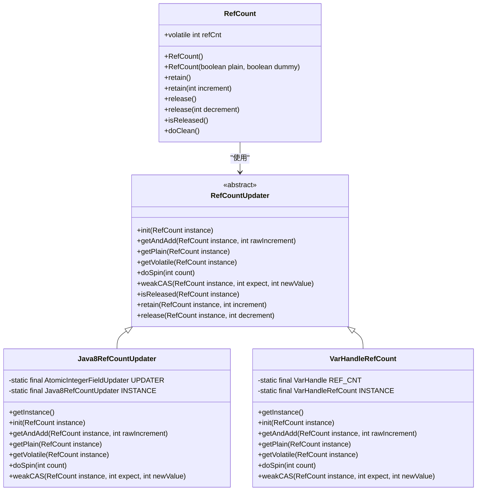
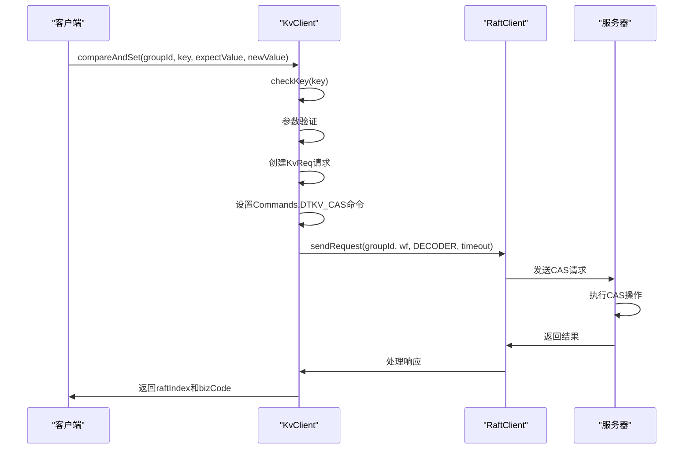
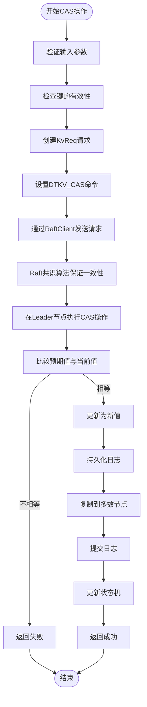
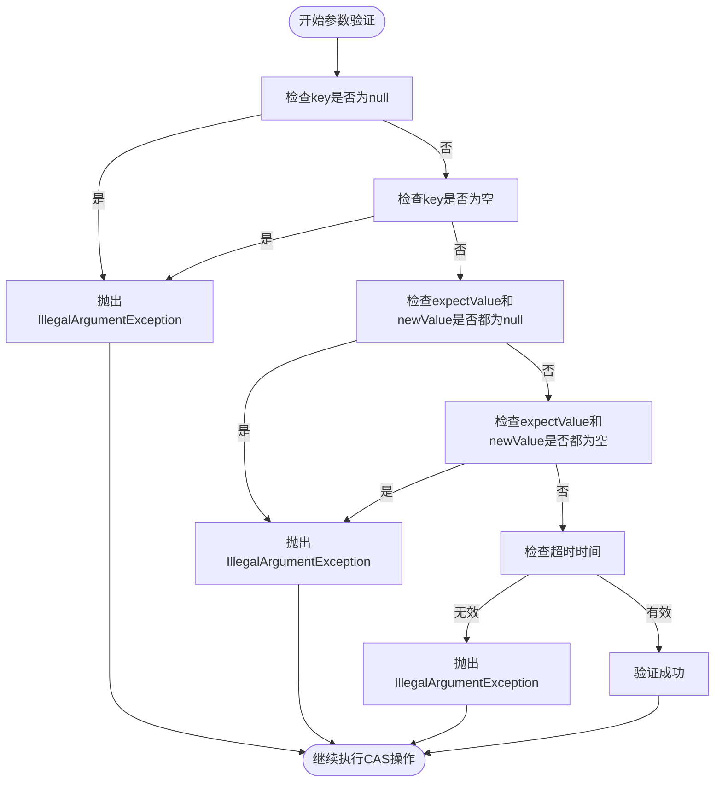
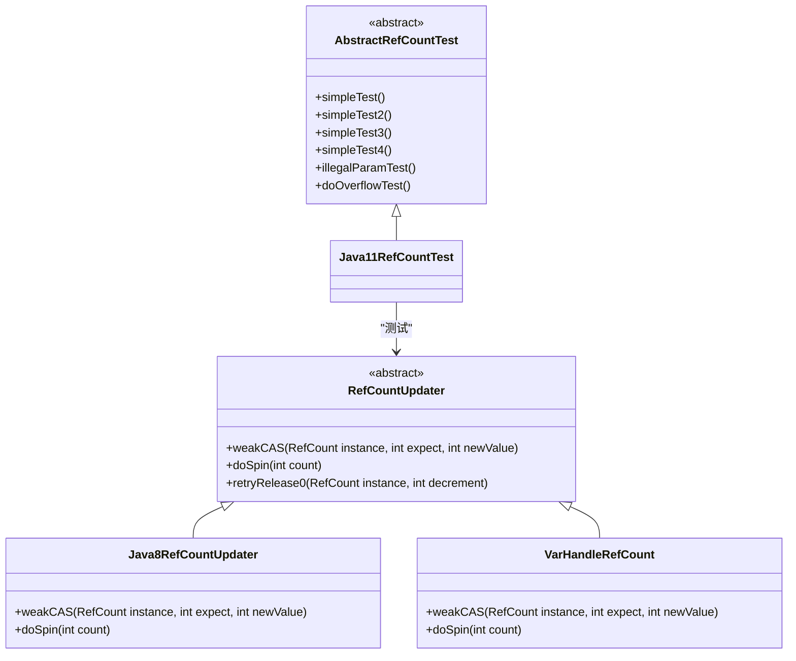
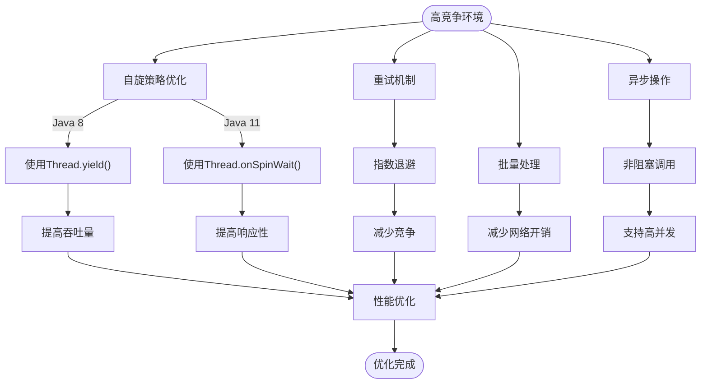
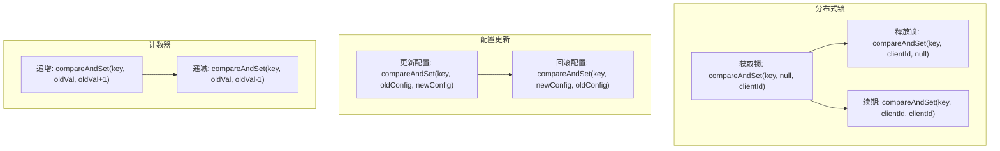

# CAS操作

<cite>
**本文档引用的文件**   
- [KvClient.java](file://client/src/main/java/com/github/dtprj/dongting/dtkv/KvClient.java)
- [RefCount.java](file://client/src/main/java/com/github/dtprj/dongting/common/RefCount.java)
- [RefCountUpdater.java](file://client/src/main/java/com/github/dtprj/dongting/common/RefCountUpdater.java)
- [Java8RefCountUpdater.java](file://client/src/main/java/com/github/dtprj/dongting/java8/Java8RefCountUpdater.java)
- [VarHandleRefCount.java](file://client/src/main/java/com/github/dtprj/dongting/java11/VarHandleRefCount.java)
- [AbstractRefCountTest.java](file://client/src/test/java/com/github/dtprj/dongting/java11/AbstractRefCountTest.java)
</cite>

## 目录
1. [引言](#引言)
2. [CAS操作核心实现](#cas操作核心实现)
3. [compareAndSet方法实现原理](#compareandset方法实现原理)
4. [原子性保证机制](#原子性保证机制)
5. [参数验证流程](#参数验证流程)
6. [并发控制策略](#并发控制策略)
7. [高竞争环境下的性能考虑](#高竞争环境下的性能考虑)
8. [实际应用场景](#实际应用场景)
9. [结论](#结论)

## 引言
CAS（Compare-And-Swap）操作是一种重要的原子操作机制，在分布式系统中用于实现线程安全的数据更新。本文档深入分析Dongting项目中CAS操作的实现原理，重点解析compareAndSet方法的实现细节，包括其在分布式环境下的原子性保证机制、参数验证流程、并发控制策略以及在高竞争环境下的性能优化。

## CAS操作核心实现

Dongting项目中的CAS操作实现基于Java的原子操作机制，通过不同的Java版本适配器提供高效的原子性保证。核心实现包括引用计数管理和原子更新器两个主要部分。

**图示来源**
- [RefCount.java](file://client/src/main/java/com/github/dtprj/dongting/common/RefCount.java#L34-L92)
- [RefCountUpdater.java](file://client/src/main/java/com/github/dtprj/dongting/common/RefCountUpdater.java#L37-L69)
- [Java8RefCountUpdater.java](file://client/src/main/java/com/github/dtprj/dongting/java8/Java8RefCountUpdater.java#L37-L68)
- [VarHandleRefCount.java](file://client/src/main/java/com/github/dtprj/dongting/java11/VarHandleRefCount.java#L39-L82)

**本节来源**
- [RefCount.java](file://client/src/main/java/com/github/dtprj/dongting/common/RefCount.java#L34-L92)
- [RefCountUpdater.java](file://client/src/main/java/com/github/dtprj/dongting/common/RefCountUpdater.java#L37-L69)

## compareAndSet方法实现原理

compareAndSet方法是Dongting项目中实现CAS操作的核心方法，用于在分布式KV存储中执行条件更新操作。该方法通过比较预期值与当前值，仅当两者相等时才执行更新操作，从而保证操作的原子性。

**图示来源**
- [KvClient.java](file://client/src/main/java/com/github/dtprj/dongting/dtkv/KvClient.java#L678-L696)

**本节来源**
- [KvClient.java](file://client/src/main/java/com/github/dtprj/dongting/dtkv/KvClient.java#L678-L696)

## 原子性保证机制

Dongting项目通过多层机制确保CAS操作的原子性。在本地层面，使用Java的原子操作API（如AtomicIntegerFieldUpdater和VarHandle）保证内存操作的原子性；在分布式层面，通过Raft共识算法确保跨节点操作的一致性。

**图示来源**
- [KvClient.java](file://client/src/main/java/com/github/dtprj/dongting/dtkv/KvClient.java#L678-L696)
- [RefCountUpdater.java](file://client/src/main/java/com/github/dtprj/dongting/common/RefCountUpdater.java#L37-L69)

**本节来源**
- [KvClient.java](file://client/src/main/java/com/github/dtprj/dongting/dtkv/KvClient.java#L678-L696)
- [RefCountUpdater.java](file://client/src/main/java/com/github/dtprj/dongting/common/RefCountUpdater.java#L37-L69)

## 参数验证流程

CAS操作的参数验证流程是确保操作安全性和正确性的关键步骤。系统对输入参数进行多层次验证，防止无效或恶意请求导致系统异常。

**图示来源**
- [KvClient.java](file://client/src/main/java/com/github/dtprj/dongting/dtkv/KvClient.java#L678-L696)

**本节来源**
- [KvClient.java](file://client/src/main/java/com/github/dtprj/dongting/dtkv/KvClient.java#L678-L696)

## 并发控制策略

Dongting项目采用多种并发控制策略来处理高并发场景下的CAS操作，确保系统的稳定性和性能。

**图示来源**
- [RefCountUpdater.java](file://client/src/main/java/com/github/dtprj/dongting/common/RefCountUpdater.java#L37-L69)
- [Java8RefCountUpdater.java](file://client/src/main/java/com/github/dtprj/dongting/java8/Java8RefCountUpdater.java#L37-L68)
- [VarHandleRefCount.java](file://client/src/main/java/com/github/dtprj/dongting/java11/VarHandleRefCount.java#L39-L82)
- [AbstractRefCountTest.java](file://client/src/test/java/com/github/dtprj/dongting/java11/AbstractRefCountTest.java#L0-L85)

**本节来源**
- [RefCountUpdater.java](file://client/src/main/java/com/github/dtprj/dongting/common/RefCountUpdater.java#L37-L69)
- [Java8RefCountUpdater.java](file://client/src/main/java/com/github/dtprj/dongting/java8/Java8RefCountUpdater.java#L37-L68)
- [VarHandleRefCount.java](file://client/src/main/java/com/github/dtprj/dongting/java11/VarHandleRefCount.java#L39-L82)

## 高竞争环境下的性能考虑

在高竞争环境下，Dongting项目通过多种优化策略确保CAS操作的性能和吞吐量。

**图示来源**
- [Java8RefCountUpdater.java](file://client/src/main/java/com/github/dtprj/dongting/java8/Java8RefCountUpdater.java#L37-L68)
- [VarHandleRefCount.java](file://client/src/main/java/com/github/dtprj/dongting/java11/VarHandleRefCount.java#L39-L82)

**本节来源**
- [Java8RefCountUpdater.java](file://client/src/main/java/com/github/dtprj/dongting/java8/Java8RefCountUpdater.java#L37-L68)
- [VarHandleRefCount.java](file://client/src/main/java/com/github/dtprj/dongting/java11/VarHandleRefCount.java#L39-L82)

## 实际应用场景

CAS操作在分布式系统中有广泛的应用场景，包括分布式锁、配置更新等。

**图示来源**
- [KvClient.java](file://client/src/main/java/com/github/dtprj/dongting/dtkv/KvClient.java#L678-L696)

**本节来源**
- [KvClient.java](file://client/src/main/java/com/github/dtprj/dongting/dtkv/KvClient.java#L678-L696)

## 结论
Dongting项目中的CAS操作实现通过结合Java原子操作API和Raft共识算法，提供了高效且可靠的原子性保证。compareAndSet方法的设计充分考虑了参数验证、并发控制和性能优化，适用于各种分布式应用场景。通过合理的自旋策略、重试机制和异步操作，系统能够在高竞争环境下保持良好的性能和稳定性。