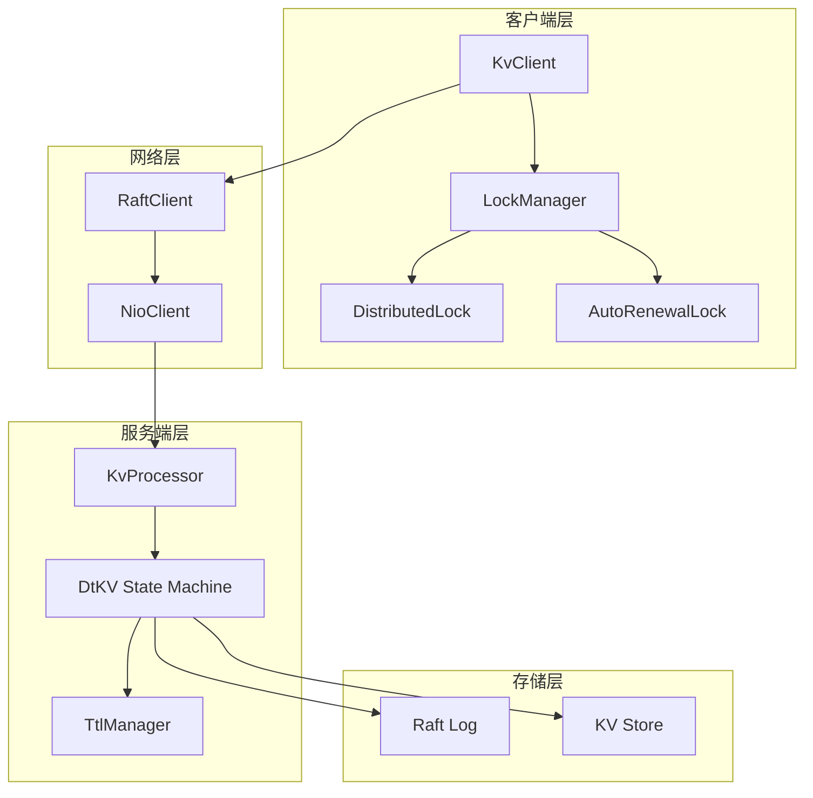
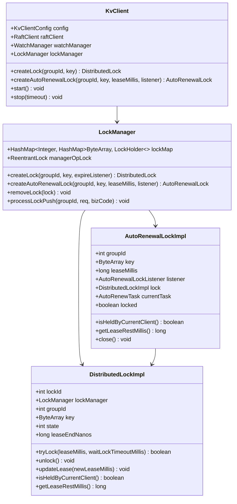
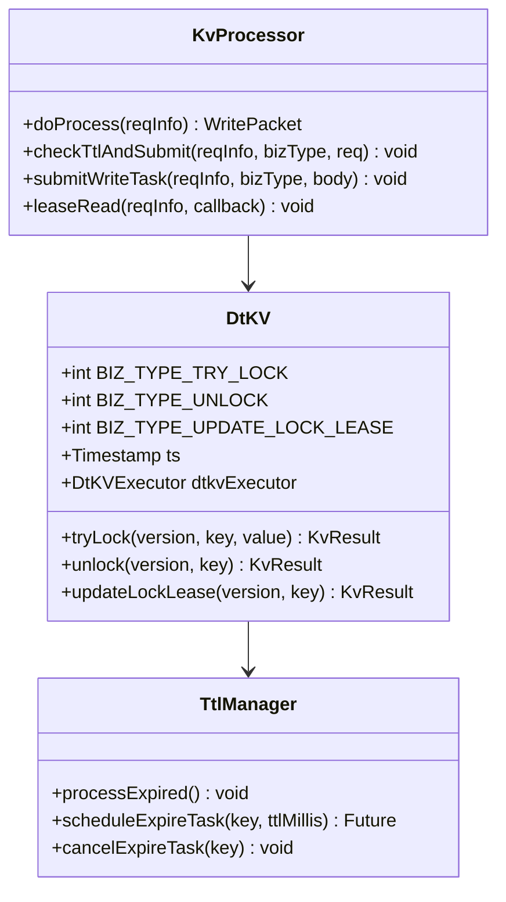
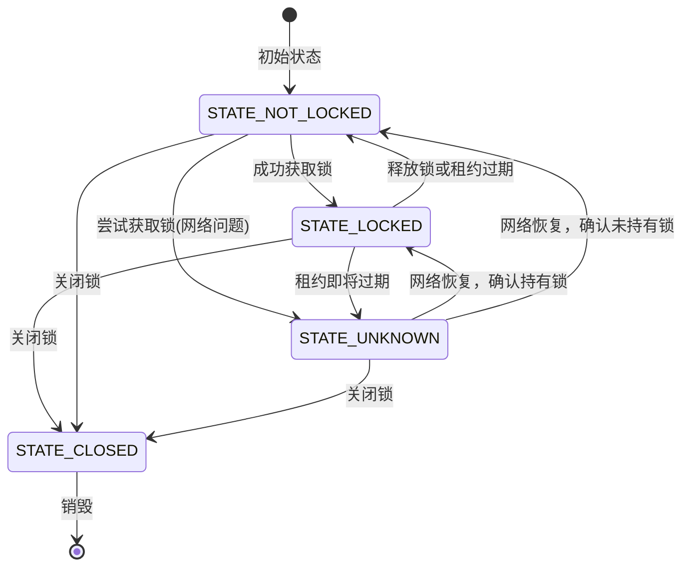
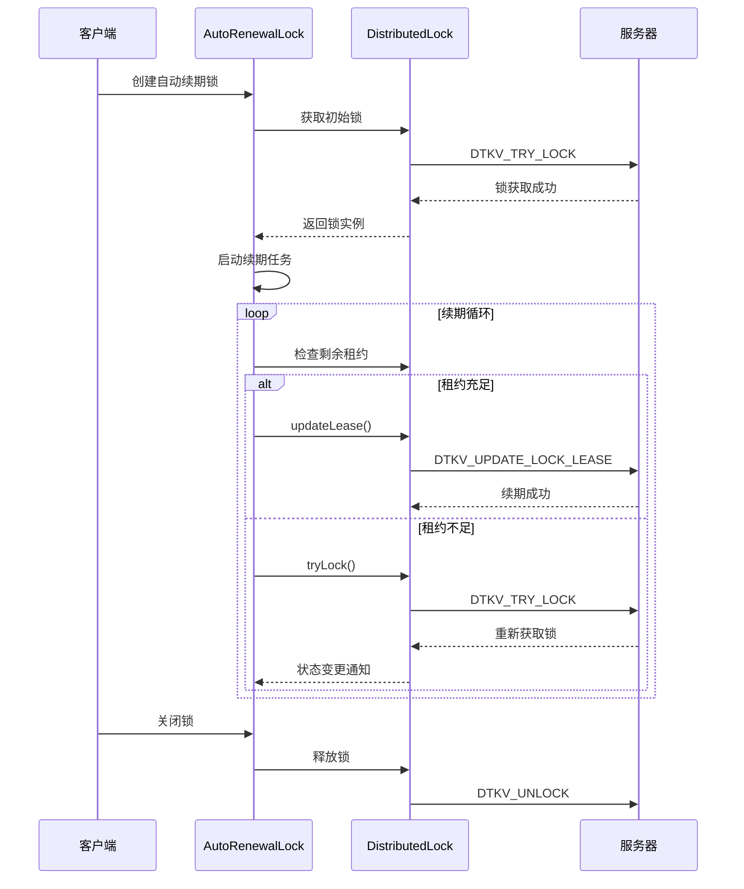
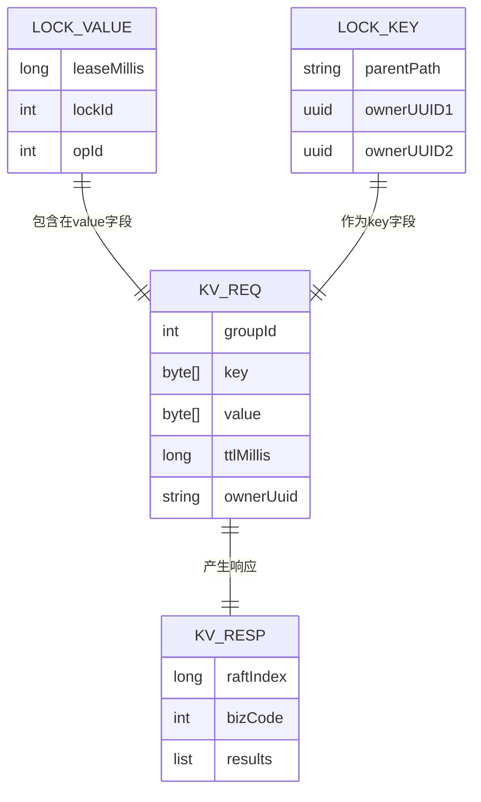
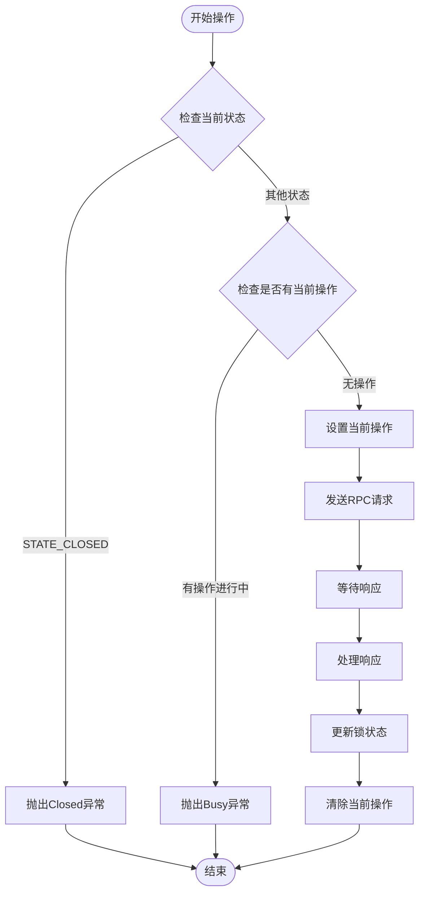
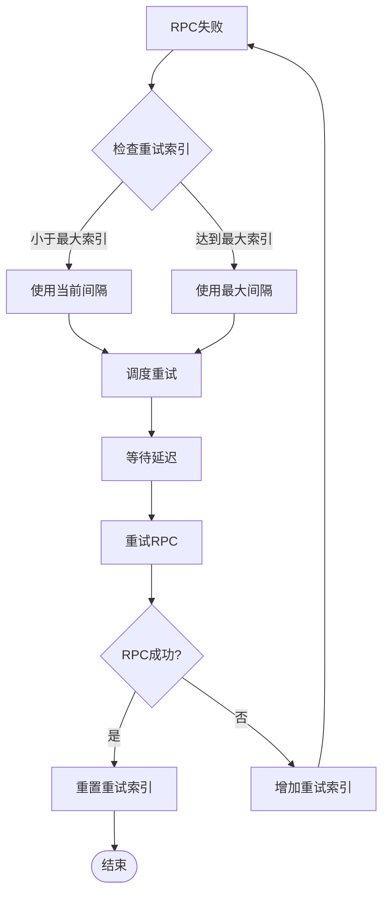

# 分布式锁系统

<cite>
**本文档中引用的文件**
- [DistributedLock.java](file://client/src/main/java/com/github/dtprj/dongting/dtkv/DistributedLock.java)
- [DistributedLockImpl.java](file://client/src/main/java/com/github/dtprj/dongting/dtkv/DistributedLockImpl.java)
- [AutoRenewalLock.java](file://client/src/main/java/com/github/dtprj/dongting/dtkv/AutoRenewalLock.java)
- [AutoRenewalLockImpl.java](file://client/src/main/java/com/github/dtprj/dongting/dtkv/AutoRenewalLockImpl.java)
- [LockManager.java](file://client/src/main/java/com/github/dtprj/dongting/dtkv/LockManager.java)
- [KvClient.java](file://client/src/main/java/com/github/dtprj/dongting/dtkv/KvClient.java)
- [KvProcessor.java](file://server/src/main/java/com/github/dtprj/dongting/dtkv/server/KvProcessor.java)
- [KvCodes.java](file://client/src/main/java/com/github/dtprj/dongting/dtkv/KvCodes.java)
- [DtKV.java](file://server/src/main/java/com/github/dtprj/dongting/dtkv/server/DtKV.java)
- [KvClientConfig.java](file://client/src/main/java/com/github/dtprj/dongting/dtkv/KvClientConfig.java)
- [LockDemoClient.java](file://demos/src/main/java/com/github/dtprj/dongting/demos/lock/LockDemoClient.java)
- [AutoRenewalLockDemoClient1.java](file://demos/src/main/java/com/github/dtprj/dongting/demos/lock/AutoRenewalLockDemoClient1.java)
</cite>

## 目录
1. [简介](#简介)
2. [系统架构](#系统架构)
3. [核心组件](#核心组件)
4. [分布式锁接口](#分布式锁接口)
5. [自动续期锁接口](#自动续期锁接口)
6. [协议与通信](#协议与通信)
7. [状态管理](#状态管理)
8. [重试机制](#重试机制)
9. [性能特性](#性能特性)
10. [使用示例](#使用示例)
11. [故障处理](#故障处理)
12. [总结](#总结)

## 简介

Dongting分布式锁系统是一个基于Raft共识算法构建的高可用、强一致性的分布式锁解决方案。该系统提供了两种类型的锁：基础的分布式锁和具有自动续期功能的自动续期锁，适用于不同的应用场景需求。

### 主要特性

- **强一致性**：基于Raft算法保证锁操作的一致性
- **高可用性**：支持集群部署，具备故障转移能力
- **自动续期**：自动续期锁提供智能的租约管理
- **多种接口**：同步和异步操作支持
- **灵活配置**：可配置的租约时间和重试策略

## 系统架构

分布式锁系统采用分层架构设计，包含客户端层、服务端层和存储层：



**图表来源**
- [KvClient.java](file://client/src/main/java/com/github/dtprj/dongting/dtkv/KvClient.java#L51-L84)
- [LockManager.java](file://client/src/main/java/com/github/dtprj/dongting/dtkv/LockManager.java#L36-L45)
- [KvProcessor.java](file://server/src/main/java/com/github/dtprj/dongting/dtkv/server/KvProcessor.java#L51-L54)

## 核心组件

### 客户端组件

#### KvClient
KvClient是分布式锁系统的主要入口点，负责管理连接和协调各个子组件：



**图表来源**
- [KvClient.java](file://client/src/main/java/com/github/dtprj/dongting/dtkv/KvClient.java#L51-L84)
- [LockManager.java](file://client/src/main/java/com/github/dtprj/dongting/dtkv/LockManager.java#L36-L45)
- [DistributedLockImpl.java](file://client/src/main/java/com/github/dtprj/dongting/dtkv/DistributedLockImpl.java#L45-L94)
- [AutoRenewalLockImpl.java](file://client/src/main/java/com/github/dtprj/dongting/dtkv/AutoRenewalLockImpl.java#L30-L70)

**章节来源**
- [KvClient.java](file://client/src/main/java/com/github/dtprj/dongting/dtkv/KvClient.java#L51-L84)
- [LockManager.java](file://client/src/main/java/com/github/dtprj/dongting/dtkv/LockManager.java#L36-L241)

### 服务端组件

#### 状态机实现
DtKV作为Raft状态机，负责处理所有的锁操作请求：



**图表来源**
- [DtKV.java](file://server/src/main/java/com/github/dtprj/dongting/dtkv/server/DtKV.java#L58-L86)
- [KvProcessor.java](file://server/src/main/java/com/github/dtprj/dongting/dtkv/server/KvProcessor.java#L51-L145)

**章节来源**
- [DtKV.java](file://server/src/main/java/com/github/dtprj/dongting/dtkv/server/DtKV.java#L58-L86)
- [KvProcessor.java](file://server/src/main/java/com/github/dtprj/dongting/dtkv/server/KvProcessor.java#L51-L200)

## 分布式锁接口

### 基础分布式锁

DistributedLock接口提供了基本的锁操作功能：

#### 核心方法

| 方法 | 描述 | 参数说明 |
|------|------|----------|
| `tryLock(leaseMillis, waitLockTimeoutMillis)` | 同步尝试获取锁 | leaseMillis: 租约时间(毫秒)<br>waitLockTimeoutMillis: 等待超时时间(毫秒) |
| `tryLock(leaseMillis, waitLockTimeoutMillis, callback)` | 异步尝试获取锁 | callback: 回调函数 |
| `unlock()` | 同步释放锁 | 无 |
| `unlock(callback)` | 异步释放锁 | callback: 回调函数 |
| `updateLease(newLeaseMillis)` | 更新租约时间 | newLeaseMillis: 新的租约时间 |
| `updateLease(newLeaseMillis, callback)` | 异步更新租约时间 | callback: 回调函数 |
| `isHeldByCurrentClient()` | 检查当前客户端是否持有锁 | 返回布尔值 |
| `getLeaseRestMillis()` | 获取剩余租约时间 | 返回剩余时间(毫秒) |

#### 锁状态管理



**图表来源**
- [DistributedLockImpl.java](file://client/src/main/java/com/github/dtprj/dongting/dtkv/DistributedLockImpl.java#L48-L53)

**章节来源**
- [DistributedLock.java](file://client/src/main/java/com/github/dtprj/dongting/dtkv/DistributedLock.java#L31-L153)
- [DistributedLockImpl.java](file://client/src/main/java/com/github/dtprj/dongting/dtkv/DistributedLockImpl.java#L45-L652)

## 自动续期锁接口

### AutoRenewalLock

AutoRenewalLock提供了智能的锁管理和续期功能，适用于需要长时间保持锁的场景：

#### 核心特性

- **自动续期**：在持有锁期间自动延长租约
- **故障恢复**：在网络中断后自动重新获取锁
- **竞争处理**：在多个客户端竞争时公平分配
- **事件通知**：通过监听器提供状态变更通知

#### 工作流程



**图表来源**
- [AutoRenewalLockImpl.java](file://client/src/main/java/com/github/dtprj/dongting/dtkv/AutoRenewalLockImpl.java#L72-L151)

**章节来源**
- [AutoRenewalLock.java](file://client/src/main/java/com/github/dtprj/dongting/dtkv/AutoRenewalLock.java#L34-L68)
- [AutoRenewalLockImpl.java](file://client/src/main/java/com/github/dtprj/dongting/dtkv/AutoRenewalLockImpl.java#L30-L228)

## 协议与通信

### 锁操作协议

分布式锁系统使用Raft协议进行一致性保证，所有锁操作都通过Raft日志复制：

#### 命令定义

| 命令 | 功能 | 请求格式 | 响应码 |
|------|------|----------|--------|
| `DTKV_TRY_LOCK` | 尝试获取锁 | groupId, key, value(包含租约信息) | SUCCESS, LOCK_BY_SELF, LOCK_BY_OTHER |
| `DTKV_UNLOCK` | 释放锁 | groupId, key, null | SUCCESS, LOCK_BY_OTHER, NOT_FOUND |
| `DTKV_UPDATE_LOCK_LEASE` | 更新租约 | groupId, key, ttlMillis | SUCCESS, NOT_LOCK_NODE, INVALID_TTL |

#### 数据结构

锁操作的数据结构包含以下信息：



**图表来源**
- [KvProcessor.java](file://server/src/main/java/com/github/dtprj/dongting/dtkv/server/KvProcessor.java#L129-L137)
- [DistributedLockImpl.java](file://client/src/main/java/com/github/dtprj/dongting/dtkv/DistributedLockImpl.java#L404-L408)

**章节来源**
- [KvProcessor.java](file://server/src/main/java/com/github/dtprj/dongting/dtkv/server/KvProcessor.java#L129-L137)
- [KvCodes.java](file://client/src/main/java/com/github/dtprj/dongting/dtkv/KvCodes.java#L22-L52)

## 状态管理

### 锁状态转换

分布式锁的状态管理确保了操作的正确性和一致性：

#### 状态常量

| 状态 | 数值 | 描述 |
|------|------|------|
| `STATE_NOT_LOCKED` | 0 | 未持有锁状态 |
| `STATE_LOCKED` | 1 | 确认持有锁状态 |
| `STATE_UNKNOWN` | 2 | 不确定状态(网络问题等) |
| `STATE_CLOSED` | 3 | 锁已关闭状态 |

#### 操作序列化



**图表来源**
- [DistributedLockImpl.java](file://client/src/main/java/com/github/dtprj/dongting/dtkv/DistributedLockImpl.java#L383-L416)

**章节来源**
- [DistributedLockImpl.java](file://client/src/main/java/com/github/dtprj/dongting/dtkv/DistributedLockImpl.java#L48-L53)
- [DistributedLockImpl.java](file://client/src/main/java/com/github/dtprj/dongting/dtkv/DistributedLockImpl.java#L383-L416)

## 重试机制

### 自动重试策略

自动续期锁实现了智能的重试机制，确保在各种网络条件下都能维持锁的持有：

#### 重试间隔配置

默认重试间隔为：
- 1秒
- 10秒  
- 30秒
- 60秒

#### 重试逻辑



**图表来源**
- [AutoRenewalLockImpl.java](file://client/src/main/java/com/github/dtprj/dongting/dtkv/AutoRenewalLockImpl.java#L126-L146)

**章节来源**
- [KvClientConfig.java](file://client/src/main/java/com/github/dtprj/dongting/dtkv/KvClientConfig.java#L30-L31)
- [AutoRenewalLockImpl.java](file://client/src/main/java/com/github/dtprj/dongting/dtkv/AutoRenewalLockImpl.java#L126-L146)

## 性能特性

### 性能指标

- **延迟**：单次锁操作延迟通常在几十毫秒内
- **吞吐量**：支持每秒数千次的锁操作
- **并发性**：支持大量客户端同时访问
- **持久性**：所有操作都持久化到Raft日志

### 优化策略

1. **连接复用**：通过RaftClient复用TCP连接
2. **批量操作**：支持批量锁操作减少网络开销
3. **异步处理**：大部分操作采用异步模式
4. **本地缓存**：客户端维护锁状态缓存

## 使用示例

### 基础分布式锁使用

```java
// 创建KvClient
KvClient kvClient = new KvClient();
kvClient.start();
kvClient.getRaftClient().clientAddNode("1,127.0.0.1:5001");
kvClient.getRaftClient().clientAddOrUpdateGroup(GROUP_ID, new int[]{1});

// 创建分布式锁
DistributedLock lock = kvClient.createLock(GROUP_ID, "myResource".getBytes());

// 尝试获取锁
boolean acquired = lock.tryLock(30000, 5000); // 30秒租约，5秒等待
if (acquired) {
    try {
        // 执行临界区代码
        System.out.println("获得锁，执行业务逻辑");
    } finally {
        // 释放锁
        lock.unlock();
    }
} else {
    System.out.println("未能获得锁");
}

// 关闭客户端
kvClient.stop(new DtTime(3, TimeUnit.SECONDS));
```

### 自动续期锁使用

```java
// 创建监听器
AutoRenewalLockListener listener = new AutoRenewalLockListener() {
    @Override
    public void onAcquired() {
        System.out.println("获得锁");
    }
    
    @Override
    public void onLost() {
        System.out.println("失去锁");
    }
};

// 创建自动续期锁
AutoRenewalLock lock = kvClient.createAutoRenewalLock(
    GROUP_ID, 
    "leaderElection".getBytes(), 
    30000, // 30秒租约
    listener
);

// 程序运行期间会自动管理锁
// 在JVM退出时自动释放锁
Runtime.getRuntime().addShutdownHook(new Thread(() -> {
    lock.close();
    kvClient.stop(new DtTime(3, TimeUnit.SECONDS));
}));
```

**章节来源**
- [LockDemoClient.java](file://demos/src/main/java/com/github/dtprj/dongting/demos/lock/LockDemoClient.java#L30-L50)
- [AutoRenewalLockDemoClient1.java](file://demos/src/main/java/com/github/dtprj/dongting/demos/lock/AutoRenewalLockDemoClient1.java#L43-L58)

## 故障处理

### 常见故障场景

#### 网络分区
- **表现**：客户端无法连接到服务器
- **处理**：自动重试机制会持续尝试连接
- **结果**：锁状态保持不变，直到网络恢复

#### 服务器故障
- **表现**：服务器节点宕机
- **处理**：Raft算法自动选举新领导者
- **结果**：锁操作继续正常进行

#### 租约过期
- **表现**：锁自动释放
- **处理**：自动续期锁会重新获取锁
- **结果**：保持业务连续性

### 错误码说明

| 错误码 | 含义 | 处理建议 |
|--------|------|----------|
| `LOCK_BY_SELF` | 锁已被当前客户端持有 | 可以安全地继续使用 |
| `LOCK_BY_OTHER` | 锁被其他客户端持有 | 等待或重试 |
| `NOT_FOUND` | 锁不存在 | 检查键名或重新获取锁 |
| `NOT_LOCK_NODE` | 非法的锁节点 | 检查数据结构 |
| `INVALID_TTL` | 无效的租约时间 | 使用合理的租约时间 |

**章节来源**
- [KvCodes.java](file://client/src/main/java/com/github/dtprj/dongting/dtkv/KvCodes.java#L50-L52)
- [DistributedLockImpl.java](file://client/src/main/java/com/github/dtprj/dongting/dtkv/DistributedLockImpl.java#L241-L245)

## 总结

Dongting分布式锁系统提供了完整而强大的分布式锁解决方案，具有以下优势：

### 技术优势
- **强一致性**：基于Raft算法保证数据一致性
- **高可用性**：支持集群部署和故障转移
- **易用性**：提供简洁的API和丰富的功能
- **可靠性**：完善的错误处理和重试机制

### 应用场景
- **分布式任务调度**：防止多个节点同时执行同一任务
- **资源访问控制**：保护共享资源的并发访问
- **领导选举**：在分布式系统中选举主节点
- **数据同步**：协调多个节点的数据同步操作

### 最佳实践
1. **合理设置租约时间**：平衡性能和可靠性
2. **使用自动续期锁**：避免因网络延迟导致的锁丢失
3. **及时释放锁**：避免资源浪费和死锁
4. **监控锁状态**：及时发现和处理异常情况

通过本文档的详细介绍，开发者可以深入理解Dongting分布式锁系统的工作原理和使用方法，从而在实际项目中正确有效地应用这一强大的工具。